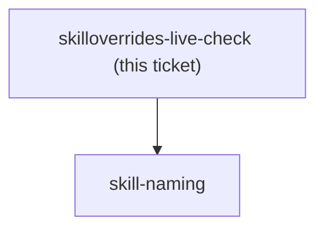

<!-- decision-map:graph:start -->

<!-- decision-map:graph:end -->

## Question

Two facts must be observed, not inferred, and one experiment settles both. (1) Does skillOverrides accept a plugin-qualified key (superpowers:brainstorming) or only the bare directory name? The harness-skill-shadowing research called the qualified form the strong reading but never saw a qualified key actually matched. (2) With the six originals set to off, what does the superpowers SessionStart hook do when its injected text names superpowers:brainstorming by qualified name - does the model fall back to the vendored copy, ignore the instruction, or report the skill missing? Add the overrides, open a fresh session, read the skill list, and observe. Record both facts: coexistence cannot be implemented without the first, and the second is the one hole that decision knowingly left open.
