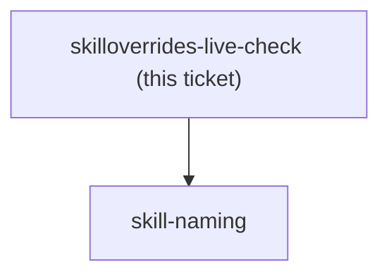
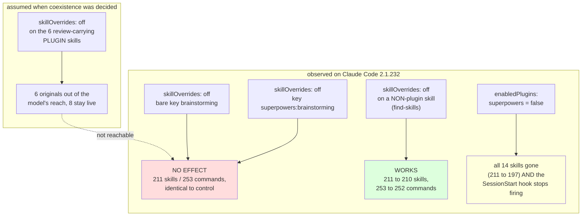

<!-- decision-map:graph:start -->

<!-- decision-map:graph:end -->

## Question

Two facts must be observed, not inferred, and one experiment settles both. (1) Does skillOverrides accept a plugin-qualified key (superpowers:brainstorming) or only the bare directory name? The harness-skill-shadowing research called the qualified form the strong reading but never saw a qualified key actually matched. (2) With the six originals set to off, what does the superpowers SessionStart hook do when its injected text names superpowers:brainstorming by qualified name - does the model fall back to the vendored copy, ignore the instruction, or report the skill missing? Add the overrides, open a fresh session, read the skill list, and observe. Record both facts: coexistence cannot be implemented without the first, and the second is the one hole that decision knowingly left open.

<!-- decision-map:resolution:start -->
## Resolution

Observed on CC 2.1.232: skillOverrides cannot reach a PLUGIN skill by EITHER key form - only whole-plugin disable works, and the hook injects a file so no override touches it.



Both facts were **observed**, not inferred, on Claude Code **2.1.232** with this
repo at `2e535ef`. The observable is the `system/init` event of a
`claude -p --output-format stream-json --verbose` run, which carries a `skills`
array and a `slash_commands` array - the model's actual reach, with no model
involvement in the measurement.

## 1. skillOverrides cannot disable a plugin skill by either key form

Four runs, identical except for the `--settings` payload:

| `skillOverrides` | skills | commands | the named skill still listed? |
|---|---|---|---|
| *(control, none)* | 211 | 253 | - |
| `superpowers:brainstorming: off` | **211** | **253** | **yes, both surfaces** |
| `brainstorming: off` (bare) | **211** | **253** | **yes, both surfaces** |
| `find-skills: off` (a user skill) | **210** | **252** | **no, gone from both** |

So the key form was never the problem: the qualified key and the bare key are
equally inert against a plugin skill, while the very same mechanism, in the very
same settings payload, removes a non-plugin skill cleanly. The strong reading
that `harness-skill-shadowing` recorded - that a plugin-qualified key is what
`skillOverrides` wants - is wrong in a way that no key form fixes.

The mechanism is in the resolver. `claude.exe` computes every skill's effective
listing state in one function, and a plugin skill returns before the override map
is ever read:

```js
function r9e(e){
  if((e.type==="local-jsx"||e.type==="local") && Uob.has(e.name)) ...
  if(e.type!=="prompt" || e.source==="plugin") return "on";   // <-- exits here
  let t=Wo(), r=t.skillOverrides,
      n = r?.[e.name] ?? (e.unqualifiedName!=null ? r?.[e.unqualifiedName] : void 0) ?? "on";
  ...
}
```

`e.source==="plugin"` is exactly how the binary identifies a plugin skill
(`function $9e(e){return e.source==="plugin"}`), and `r9e` is the single resolver
behind both the listing builder and the `/`-invocation refusal, so the exemption
covers every surface at once. The qualified-key lookup that *does* exist
(`r?.[e.name] ?? r?.[e.unqualifiedName]`) belongs to a different feature:
`unqualifiedName` is set only for **directory-scoped project skills**, where the
harness mints `<dir>:<name>`. Plugin namespacing never enters that map.

Two settings descriptions in the binary's own schema agree, read after the fact:
`skillOverrides` is "Per-skill **listing** overrides keyed by skill name", and
its neighbour `disableBundledSkills` states outright that "**Plugins**,
`.claude/skills/`, and `.claude/commands/` **are unaffected**". There is no
plugin-granular skill switch in the schema at all - `includedSkills` is
context-size telemetry and `skillsDirs` is memory-store configuration.

**The only lever that reaches a plugin skill is the whole plugin.**
`enabledPlugins: {"superpowers@claude-plugins-official": false}` took the list
from 211 to 197 - all 14 superpowers skills at once - and the plugin's
SessionStart hook stopped firing in the same run (one `SessionStart` hook event
remained, from a user-level hook, and its output was unrelated).

## 2. The hook question dissolves, and it was never about the override

The premise - "with the six originals set to off, what does the hook do" - is
unreachable, because they cannot be set off. But the hook is structurally immune
regardless, which is the more durable fact. `hooks/session-start` does this:

```bash
using_superpowers_content=$(cat "${PLUGIN_ROOT}/skills/using-superpowers/SKILL.md" ...)
...
printf '{\n  "hookSpecificOutput": { ... "additionalContext": "%s" ...
```

It `cat`s a **file** off disk and injects it verbatim. It never consults the
skill registry, so no listing override in any settings source could change one
byte of what it injects. The injected text names `superpowers:using-superpowers`
in its own preamble, and the SKILL.md body it carries steers to
`superpowers:brainstorming` and `superpowers:systematic-debugging` by qualified
name - and on 2.1.232 every one of those resolves to a live original.

## What this does to the coexistence decision

ADR 0069's chosen option is **not implementable on 2.1.232**. Its reasoning stands
and its rejected options were correctly rejected on their own terms, but the
mechanism it chose does not exist, so the real menu collapses to the two it ruled
out: the whole plugin off (option B, costing 8 skills and 3 dangling refs inside
the copies), or the plugin fully on with the copies winning on name and
description alone against a hook that names the originals (option C, the silent
failure the effort exists to prevent). A correction is recorded on the
`coexistence` ticket and a dated amendment on ADR 0069; the re-decision is a new
ticket rather than a quiet substitution here, because choosing between B and C is
the user's call and it moves the whole effort's shape.

## Reproduction

```bash
# from any directory; nothing outside the probe dir is touched
echo '{"disableAllHooks":true,"skillOverrides":{"superpowers:brainstorming":"off"}}' > s.json
claude -p 'Reply with the single word: ok' --settings ./s.json \
  --permission-mode acceptEdits --output-format stream-json --verbose > out.log
# then read the `skills` array of the system/init event in out.log
```

Both `--settings` (flag settings) and the resolver are source-agnostic here:
flag settings demonstrably carry `skillOverrides` (the `find-skills` row proves
it), and `r9e`'s exemption is checked before any source is consulted, so no
settings file - user, project or local - can reach a plugin skill either.

<!-- decision-map:resolution:end -->
