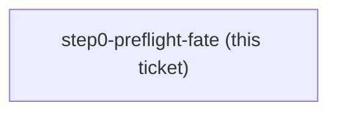
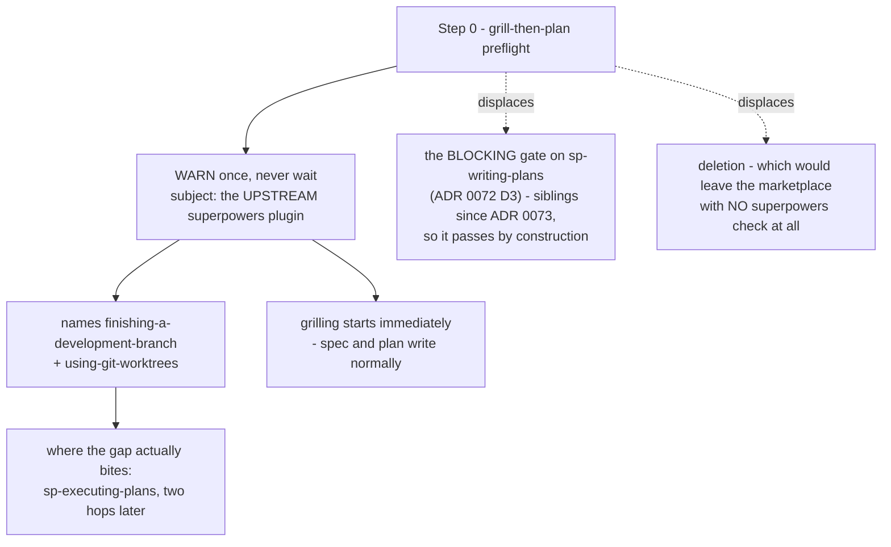

<!-- decision-map:graph:start -->

<!-- decision-map:graph:end -->

## Question

ADR 0072 retargeted grill-then-plan's Step 0 preflight from superpowers onto sp-writing-plans, and kept the gate only because host-plugin had not yet said where the copies live. ADR 0073 now puts them in dev-workflows, so grill-then-plan and sp-writing-plans ship in the same plugin in BOTH harnesses and the check can no longer fail. Does the gate get deleted, kept as documentation of the dependency, or repointed at something that can still be absent?

<!-- decision-map:resolution:start -->
## Resolution

Step 0 stays but stops blocking - it becomes a one-line warning about the UPSTREAM plugin, the only thing that can still be absent; the gate ADR 0072 kept passes by construction.

Detail: docs/adr/0080-the-preflight-warns-about-the-upstream-plugin-and-stops-blocking.md

Owner's answer, verbatim, to "ตอนเริ่มเซสชันออกแบบ อยากให้มันเตือนไหมว่า `superpowers`
ไม่ได้ติดตั้ง?" — **"เตือน"** (warn), against the two offered alternatives of a hard
block and of saying nothing.

The question offered three fates — delete, keep as documentation, repoint at something
that can still be absent — and the answer is the third, plus a demotion the question did
not ask for. Two facts drove it, and both were measured rather than reasoned:

- **The gate ADR 0072 kept cannot fail.** `install-antigravity.py:50-52`
  (`discover_skills()`) has no allowlist and no per-skill flag, so `grill-then-plan` and
  `sp-writing-plans` stage together or not at all; on Claude Code they are one plugin;
  and `skilloverrides-live-check` already measured `skillOverrides` inert against plugin
  skills.
- **Step 0 is the marketplace's only executable superpowers check.** Everything else is
  prose or metadata — `README.md:59`, `.antigravity/INSTALL.md:71`, `reflect/SKILL.md:127`,
  and `plugin.json:19`, where `superpowers` is a *keyword*, not a dependency.

So deletion and retention were each half-right, and the answer takes a half from each:
the block goes (nothing it guards can fail), the check stays (nothing else would look).

ADR 0072's Decision 3 is superseded and carries its banner as of this change. Decisions
1 and 2 of that ADR are untouched.

**The warning is deliberately weaker than a guarantee.** It fires where the arc starts,
not where the dependency bites, and a user who reads past it gets nothing further. A
check at the point of use belongs to `sp-executing-plans` and was not chartered here —
see the fog line this resolution adds.

<!-- decision-map:resolution:end -->
