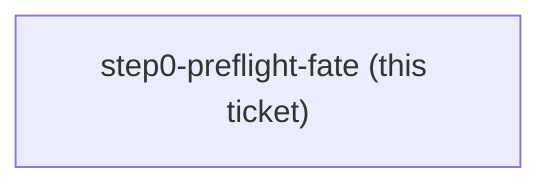

<!-- decision-map:graph:start -->

<!-- decision-map:graph:end -->

## Question

ADR 0072 retargeted grill-then-plan's Step 0 preflight from superpowers onto sp-writing-plans, and kept the gate only because host-plugin had not yet said where the copies live. ADR 0073 now puts them in dev-workflows, so grill-then-plan and sp-writing-plans ship in the same plugin in BOTH harnesses and the check can no longer fail. Does the gate get deleted, kept as documentation of the dependency, or repointed at something that can still be absent?
