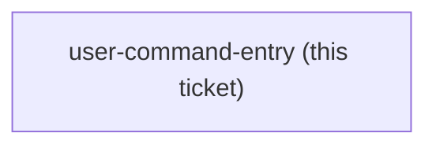

<!-- decision-map:graph:start -->

<!-- decision-map:graph:end -->

## Question

Three commands in the user's home directory - /brainstorm, /write-plan and /execute-plan - each name a superpowers: skill directly, and all three name skills on the copy list. A typed command bypasses the host hook and the descriptions together, so touchpoints #1 and #2 are lost whenever one is used. Do these commands get repointed at the sp- copies, are they deleted, or are they left alone? And if they are repointed, how does that reach a colleague's machine, given they live outside this marketplace in ~/.claude/commands/ rather than in any plugin?
