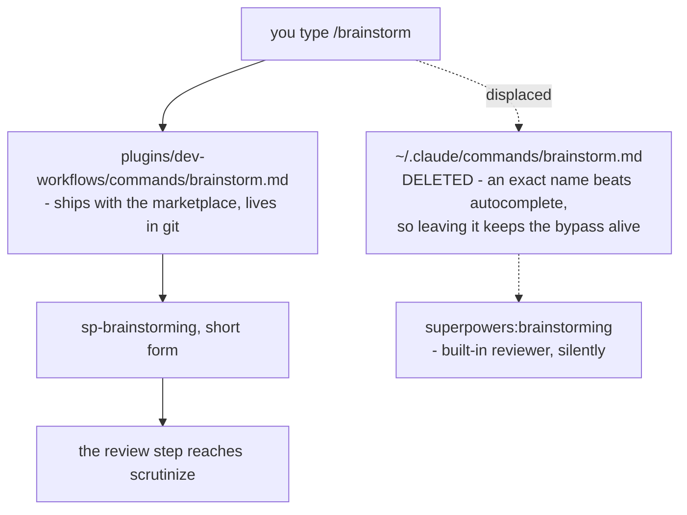

<!-- decision-map:graph:start -->

<!-- decision-map:graph:end -->

## Question

Three commands in the user's home directory - /brainstorm, /write-plan and /execute-plan - each name a superpowers: skill directly, and all three name skills on the copy list. A typed command bypasses the host hook and the descriptions together, so touchpoints #1 and #2 are lost whenever one is used. Do these commands get repointed at the sp- copies, are they deleted, or are they left alone? And if they are repointed, how does that reach a colleague's machine, given they live outside this marketplace in ~/.claude/commands/ rather than in any plugin?

<!-- decision-map:resolution:start -->
## Resolution

The three commands move into plugins/dev-workflows/commands/ naming short-form sp- targets; deleting the personal originals is part of the decision, since an exact name beats autocomplete.

Detail: docs/adr/0081-the-three-personal-commands-become-plugin-commands-and-the-originals-are-deleted.md

Owner's answer, verbatim: **"C — ย้ายเข้าปลักอิน + ลบตัวเดิม"** — move them into the
plugin and delete the originals, chosen over editing the personal files in place, over
deleting outright, and over leaving them alone.

The ticket asked two things and they get different answers. **Do they get repointed?**
Yes, by becoming plugin commands — which is also the whole of the distribution answer,
since a plugin command installs like any other. **Does that reach a colleague's
machine?** The new commands do. The *deletion* does not, and no plugin install can do
it; that half is manual, and it is the fog line this resolution adds.

Two measurements decided it:

- **The typed shortcut survives the move.** `PLAYBOOK.md:4` records `/daily` as
  installed under `/dev-workflows:daily`, found by typing the bare `/daily` via
  autocomplete. So the muscle-memory objection to moving these three does not hold.
- **Editing in place fixes one machine and hides from the checker.** The files sit
  outside the repository, so ADR 0075's resync checker — driven by a manifest of repo
  files — cannot see them. On an upstream rename it would report clean while all three
  commands rot.

Decision 2 is the part that is easy to drop and must not be: shipping the plugin
commands *without* removing the personal originals leaves the bypass fully intact, and
makes it look fixed. That is worse than not shipping them, because it removes the motive
to look again.

Recorded in [ADR 0081](../../../adr/0081-the-three-personal-commands-become-plugin-commands-and-the-originals-are-deleted.md).
ADR 0071 needs no supersession banner: it did not decide this question, it explicitly
deferred it as "charted separately", and this closes that.

**Not measured here:** the three files' bodies live in the owner's home directory, not
in this container, so they were not read. The decision turns only on what they *name*,
which ADR 0071 measured.

<!-- decision-map:resolution:end -->
