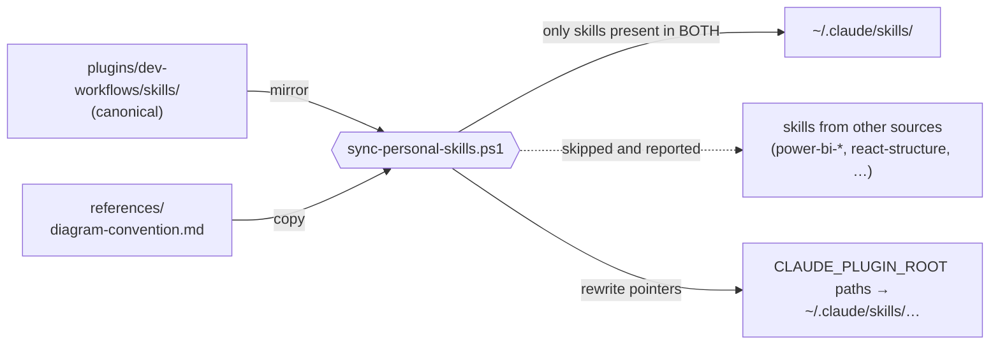

# Personal `~/.claude/skills/` mirror

Some people keep `dev-workflows` skills as **personal copies** under
`~/.claude/skills/` — instead of, or alongside, the marketplace install. Those copies are
not git-tracked, so they drift the moment the repo moves.
[`scripts/sync-personal-skills.ps1`](../scripts/sync-personal-skills.ps1) makes that sync
deterministic and idempotent.

You do not need this if you installed the plugins through the marketplace. The repo is the
single source of truth either way
([ADR 0002](adr/0002-repo-as-single-source-of-skills.md)).



## Run it

Run this after pulling, from the repo root:

```text
pwsh ./scripts/sync-personal-skills.ps1            # sync
pwsh ./scripts/sync-personal-skills.ps1 -DryRun    # report only, write nothing
```

## What it does, precisely

1. Copies the canonical `references/diagram-convention.md` into `~/.claude/skills/`.
2. For every skill present in **both** the repo and `~/.claude/skills/` — the curated
   mirror — copies repo → personal.
3. Rewrites the two `${CLAUDE_PLUGIN_ROOT}` prefixes that do not exist outside a plugin,
   because in the personal layout both collapse to the skills root:

   | in the repo | in `~/.claude/skills/` |
   |---|---|
   | `${CLAUDE_PLUGIN_ROOT}/references/diagram-convention.md` | `~/.claude/skills/diagram-convention.md` |
   | `${CLAUDE_PLUGIN_ROOT}/skills/<name>/references/x.md` | `~/.claude/skills/<name>/references/x.md` |

Three properties are worth relying on:

- **It never adds or removes** skills you keep personally from other sources
  (`power-bi-*`, `react-structure`, …). They are skipped and reported.
- **Running it twice produces the identical result.** A raw `cp` cannot promise that — it
  silently clobbers the pointer rewrite, which is the drift this script exists to end.
- **It refuses to run** if `~/.claude/skills/` does not exist, rather than creating a
  mirror you did not ask for.

## Not to be confused with

- **The Antigravity installer** —
  [`plugins/dev-workflows/.antigravity/INSTALL.md`](../plugins/dev-workflows/.antigravity/INSTALL.md).
  Different target directory, different harness, and it stages *every* skill rather than a
  curated subset.
- **The vendored-superpowers checker** —
  `plugins/dev-workflows/scripts/check_vendored_superpowers.py`. That one compares the
  vendored copies against upstream; this one compares the repo against your personal dir.
