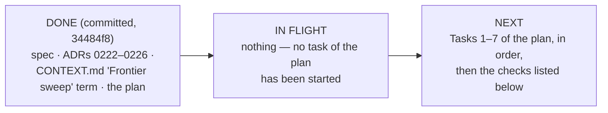

# Handoff — execute the frontier-sweep plan (decision-map 0.14.0)

- **Date:** 2026-09-14
- **From:** a local Claude Code session on the owner's Mac, branch `decision-map-frontier-sweep`
- **To:** a Claude Code cloud session (claude.ai/code) created from this branch
- **Next session is for:** implementing the plan, task by task, until every check passes

## Where the work stands

Everything the design phase produced is committed on this branch in one commit
(`34484f8`). Read these, in this order; do not paste them anywhere:

- **Plan (the thing to execute):** `docs/superpowers/plans/2026-09-14-frontier-sweep.md`
- **Spec:** `docs/superpowers/specs/2026-09-14-frontier-sweep-design.md`
- **ADRs:** `docs/adr/workflow-daily-work-0222-*.md` through `…-0226-*.md`
- **Glossary term:** `CONTEXT.md`, decision-map section, *Frontier sweep*
- **Repo rules:** `CLAUDE.md` at the repo root

**Implementation state, verified 2026-09-14 on this branch:** none of the plan's seven
tasks has been started. `plugins/decision-map/skills/chart-map/references/frontier-sweep.md`
does not exist, `map_core.py` has no `map-never-swept` rule, and the decision-map plugin
still reports version `0.13.0` in both manifests.

**Test baseline, verified 2026-09-14:** `python3 -m unittest test_local_map_ops
test_github_map_ops`, run from `plugins/decision-map/scripts/`, reports **365 tests, OK**
on `main`. The plan's Global Constraints cite the same number.

## Decisions taken in the handoff session (recorded nowhere else)

1. **The plan's Task 1 Step 1 is already done.** The branch
   `decision-map-frontier-sweep` exists on GitHub and you are on it. Skip the
   `git checkout -b` step; do not create a second branch with that name.
2. **Merge `origin/main` into this branch before starting Task 1.** The branch forked
   ten commits behind `main`. Since then `main` added the `handoff` skill, ADRs
   0227–0230, dev-workflows `0.56.0`, and regenerated the root `skills/` tree. A dry
   `git merge-tree` on 2026-09-14 showed **no conflicts**. Merging first means Task 7's
   regeneration of `skills/` includes the handoff skill and the merge is not left for the
   owner. This is a recommendation from the handoff session, not a ruling in the plan;
   if the merge does conflict, stop and report rather than resolve by guesswork.
3. **Line numbers in the plan still hold.** `main` did not touch
   `plugins/decision-map/` after the fork, so the `L…` anchors in Tasks 1–6 refer to the
   files as they are. `CONTEXT.md` and `PLAYBOOK.md` did change on `main` (the handoff
   row); Task 6's PLAYBOOK edit targets the chart-map row, a different line — re-find it
   by content, not by number, after the merge.

## Things this session assumed but did not verify

- *Verified 2026-09-14:* ADR numbers 0222–0226 appear on no local or remote ref other
  than this branch, and no other worktree exists; the highest number elsewhere is 0230.
  Re-run the scan before merging anyway (ADR 0056) — a parallel session can mint
  them in the meantime.
- *Assumed, not verified:* the plan's per-task shell snippets run unchanged on the cloud
  machine. They were written for this Mac (`python3`, no bare `python`); the cloud image
  is expected to have `python3` too.
- *Assumed, not verified:* the plan's note that "something in this environment
  auto-stages untracked files on `git` calls" is a property of the owner's Mac, not of
  the cloud machine. Follow the plan's rule anyway: always commit with explicit paths.

## Suggested skills

These may be **absent on cloud** — the cloud machine starts without this repo's
marketplaces or the owner's user-scope plugins. The plan is self-contained: every task
carries its own code, commands and checks, so it can be executed without any of them.
Load them the way your harness loads skills, if they are available:

| skill (plugin-qualified) | for |
|---|---|
| `dev-workflows:sp-subagent-driven-development` | the plan's stated REQUIRED sub-skill: one implementer per task, a dispatched review per task diff |
| `dev-workflows:sp-executing-plans` | the plan's stated alternative: execute the tasks in this session, in order |
| `dev-workflows:scrutinize-dispatch` | the review engine the two skills above dispatch; if absent, review each task diff yourself against the spec section it implements |
| `superpowers:executing-plans` | the upstream fallback if the `dev-workflows` copies are absent |
| `superpowers:verification-before-completion` | run the real checks before claiming a task done |

Do not promise a review loop that depends on a skill you could not load; say which
reviews were done by hand.

## What "done" means

All of these, on the branch, in commits that each end with the trailer the plan names:

- Tasks 1–7 of the plan checked off, in order.
- From `plugins/decision-map/scripts/`: the two unittest modules pass, with the new
  `map-never-swept` tests included (the count must be above 365).
- From the repo root: `python3 scripts/generate_skills_tree.py --repo .` then
  `python3 scripts/check_skills_tree.py --repo .` passes (CI `.github/workflows/skills-tree.yml`
  runs the same check).
- `plugins/decision-map/.claude-plugin/plugin.json` and `.claude-plugin/marketplace.json`
  both say `0.14.0` for decision-map.
- The PLAYBOOK chart-map row and the decision-map README row mention the sweep and the
  re-chart.

## Launch

- **Web:** claude.ai/code → *Create session* → repo
  `ThodsaphonSonthiphin/workflow-daily-work` → branch `decision-map-frontier-sweep`.
- **CLI:** `claude --cloud "Read docs/superpowers/handoffs/2026-09-14-execute-the-frontier-sweep-plan.md and continue from it."`

## How the result comes back, and what to re-run before merging

The cloud session works on its own `claude/…` branch and can open a pull request.
Locally: `claude --teleport <session>`, or `git fetch` and check the branch out.

Before merging into `main`, on the owner's machine:

1. Re-run both unittest modules and `check_skills_tree.py` as above.
2. `python3 plugins/dev-workflows/scripts/check_vendored_superpowers.py --strict`
   (nothing here touches `skills/sp-*`, but it is the repo's merge gate).
3. Re-verify ADR numbers 0222–0226 against every ref and worktree (ADR 0056 — the
   numbering scan in the grilling skills' `ADR-FORMAT.md`; note the macOS sed trap:
   the script prints an empty number on BSD sed and still exits 0).
4. Re-verify decision-map `0.14.0` is the global max across every branch, and that the
   marketplace entry matches the plugin manifest.
