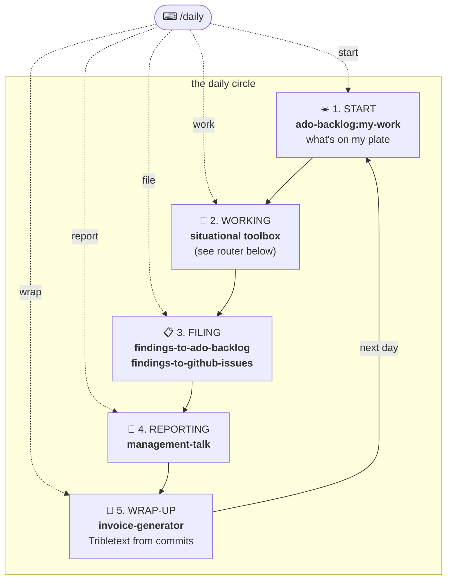
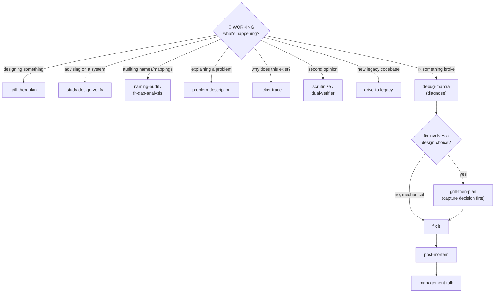

# Daily Workflow Discoverability Implementation Plan

> **For agentic workers:** REQUIRED SUB-SKILL: Use superpowers:subagent-driven-development (recommended) or superpowers:executing-plans to implement this plan task-by-task. Steps use checkbox (`- [ ]`) syntax for tracking.

**Goal:** Make the owner's skills discoverable and routable as a daily workflow: copy 5 missing skills into the repo, ship PLAYBOOK.md (the map) and a `/daily` hybrid router (the entry point), and sync all stale docs/versions.

**Architecture:** Everything lands in the existing `dev-workflows` plugin (no new plugin). PLAYBOOK.md at the repo root is the human map with two Mermaid diagrams; the `daily` skill is a self-contained router (no runtime dependency on PLAYBOOK.md, since installed plugins can't read the marketplace repo root). Spec: `docs/superpowers/specs/2026-06-11-daily-workflow-discoverability-design.md`, ADRs 0001–0004 in `docs/adr/`.

**Tech Stack:** Markdown SKILL.md/command files, Mermaid diagrams, PowerShell verification commands. No test framework — this is a docs/skills repo; verification is structural (grep/Test-Path).

---

## File map

| Status | File | Responsibility |
|---|---|---|
| Create | `plugins/dev-workflows/skills/debug-mantra/SKILL.md` | copy of personal skill |
| Create | `plugins/dev-workflows/skills/post-mortem/SKILL.md` | copy of personal skill |
| Create | `plugins/dev-workflows/skills/scrutinize/SKILL.md` | copy of personal skill |
| Create | `plugins/dev-workflows/skills/dual-verifier/SKILL.md` | copy of personal skill |
| Create | `plugins/dev-workflows/skills/drive-to-legacy/SKILL.md` | copy of personal skill |
| Create | `PLAYBOOK.md` | the one-page daily-arc map (2 Mermaid diagrams) |
| Create | `plugins/dev-workflows/skills/daily/SKILL.md` | the hybrid router |
| Create | `plugins/dev-workflows/commands/daily.md` | thin `/dev-workflows:daily` wrapper |
| Modify | `CLAUDE.md` | 3-plugin summary, PLAYBOOK convention, layout tree |
| Modify | `README.md` | de-stale: 3 plugins + PLAYBOOK link |
| Modify | `plugins/dev-workflows/README.md` | add 9 missing skill rows |
| Modify | `plugins/dev-workflows/.claude-plugin/plugin.json` | description + version 0.9.0 |
| Modify | `.claude-plugin/marketplace.json` | dev-workflows entry sync (currently 0.6.0 ≠ plugin's 0.8.0 — a live convention violation), top-level description |

---

## Task 1: Copy the 5 personal skills into dev-workflows

**Files:**
- Create: `plugins/dev-workflows/skills/{debug-mantra,post-mortem,scrutinize,dual-verifier,drive-to-legacy}/SKILL.md`

- [ ] **Step 1: Copy the five SKILL.md files**

Each personal skill is a single SKILL.md (verified during design). Run from the repo root:

```powershell
$src = "C:\Users\thodsaphon.sonthipin\.claude\skills"
$dst = "plugins\dev-workflows\skills"
foreach ($s in @("debug-mantra","post-mortem","scrutinize","dual-verifier","drive-to-legacy")) {
  New-Item -ItemType Directory -Force "$dst\$s" | Out-Null
  Copy-Item "$src\$s\SKILL.md" "$dst\$s\SKILL.md"
}
Get-ChildItem $dst -Directory | Select-Object Name
```

Expected: the listing includes all five new directories alongside the existing skills.

- [ ] **Step 2: Verify frontmatter is valid (name + description present)**

```powershell
foreach ($s in @("debug-mantra","post-mortem","scrutinize","dual-verifier","drive-to-legacy")) {
  $head = Get-Content "plugins\dev-workflows\skills\$s\SKILL.md" -TotalCount 30 | Out-String
  $hasName = $head -match "name:\s*$s"
  $hasDesc = $head -match "description:"
  Write-Host ("{0,-16} name={1} description={2}" -f $s, $hasName, $hasDesc)
}
```

Expected: `name=True description=True` for all five. If a `name:` doesn't match its folder, fix the frontmatter `name:` to equal the folder name.

- [ ] **Step 3: Verify no personal absolute paths leaked in**

```powershell
Get-ChildItem "plugins\dev-workflows\skills" -Recurse -Filter SKILL.md |
  Select-String -Pattern "C:\\Users\\thodsaphon", "~/.claude/skills" |
  Select-Object Path, LineNumber, Line
```

Expected: no output. If a copied skill references a personal path, replace it with `${CLAUDE_PLUGIN_ROOT}`-relative wording or drop the reference.

- [ ] **Step 4: Commit**

```bash
git add plugins/dev-workflows/skills/debug-mantra plugins/dev-workflows/skills/post-mortem plugins/dev-workflows/skills/scrutinize plugins/dev-workflows/skills/dual-verifier plugins/dev-workflows/skills/drive-to-legacy
git commit -m "feat(dev-workflows): adopt debug-mantra, post-mortem, scrutinize, dual-verifier, drive-to-legacy (ADR 0002)"
```

---

## Task 2: PLAYBOOK.md

**Files:**
- Create: `PLAYBOOK.md` (repo root)

- [ ] **Step 1: Write PLAYBOOK.md with exactly this content**

````markdown
# PLAYBOOK — the daily-work arc

One page: **what to reach for, when.** The only command you must remember is
**`/daily`** (installed as `/dev-workflows:daily` — typing `/daily` finds it via
autocomplete). Everything else is reachable from there or from this page.

## The daily circle



| Station | Say | Skill that runs |
|---|---|---|
| 1. START | `/daily start` | `ado-backlog:my-work` — ADO task hub (GitHub view on request) |
| 2. WORKING | `/daily work` | the situational router below |
| 3. FILING | `/daily file` | `findings-to-ado-backlog` or `findings-to-github-issues` |
| 4. REPORTING | `/daily report` | `management-talk` |
| 5. WRAP-UP | `/daily wrap` | `invoice-generator` — run it every day; it builds from commits |

## WORKING — the situational router



| When… | Reach for |
|---|---|
| designing something new | `grill-then-plan` |
| something broke | `debug-mantra`, then the debug chain below |
| advising on how a system should work | `study-design-verify` |
| auditing names / labels / mappings | `naming-audit` / `fit-gap-analysis` |
| explaining a complex problem | `problem-description` |
| "why does this code/ticket exist?" | `ticket-trace` |
| second opinion on a plan / PR / change | `scrutinize` / `dual-verifier` |
| unfamiliar legacy codebase | `drive-to-legacy` |

### The debug chain (ADR 0003)

```
something broke → debug-mantra (diagnose)
   ├─ fix is mechanical/obvious   → fix → post-mortem → management-talk
   └─ fix involves a design choice → grill-then-plan (document the decision FIRST)
                                     → fix → post-mortem → management-talk
```

The chain flows into REPORTING by itself: post-mortem's output is what
management-talk reshapes for the channel.

## /daily usage

- **`/daily`** — shows the 5-station menu. Pick a number.
- **`/daily <station>`** — jumps straight there: `start` · `work` · `file` ·
  `report` · `wrap` (synonyms accepted: `morning`, `stuck`, `findings`, `status`,
  `done`). An unrecognized word falls back to the menu — never an error.

## Maintenance rule

**Every new skill adds one row to this file, in the same commit.** A skill missing
from the playbook is invisible (see the convention in [CLAUDE.md](CLAUDE.md), and
ADR [0001](docs/adr/0001-playbook-plus-daily-router.md)).
````

- [ ] **Step 2: Verify every skill named in PLAYBOOK.md exists in the repo**

```powershell
$skills = @("my-work","findings-to-ado-backlog","findings-to-github-issues","management-talk",
            "invoice-generator","grill-then-plan","study-design-verify","naming-audit",
            "fit-gap-analysis","problem-description","ticket-trace","scrutinize",
            "dual-verifier","drive-to-legacy","debug-mantra","post-mortem")
foreach ($s in $skills) {
  $found = (Get-ChildItem "plugins" -Recurse -Directory -Filter $s | Measure-Object).Count -gt 0
  Write-Host ("{0,-28} {1}" -f $s, $(if ($found) {"OK"} else {"MISSING"}))
}
```

Expected: all 16 print `OK` (Task 1 must be done first).

- [ ] **Step 3: Commit**

```bash
git add PLAYBOOK.md
git commit -m "docs: add PLAYBOOK.md — the daily-arc map with circle + router diagrams (ADR 0001)"
```

---

## Task 3: The /daily router (skill + command)

**Files:**
- Create: `plugins/dev-workflows/skills/daily/SKILL.md`
- Create: `plugins/dev-workflows/commands/daily.md`

- [ ] **Step 1: Write the daily skill with exactly this content**

````markdown
---
name: daily
description: >-
  The single entry point into the daily-work arc — a hybrid menu/argument router.
  Trigger whenever the user invokes /dev-workflows:daily, types /daily, asks
  "what should I do now", "where was I", "start my day", "what's next today",
  "wrap up my day", "end my day", or seems unsure which skill fits their current
  daily-work moment. Bare invocation shows a 5-station menu (starting / working /
  filing findings / reporting / wrapping up); with an argument (start | work |
  file | report | wrap, synonyms accepted) it jumps straight to the station and
  hands off to the right skill: ado-backlog:my-work, the situational toolbox
  (grill-then-plan, debug-mantra, study-design-verify, naming-audit,
  fit-gap-analysis, problem-description, ticket-trace, scrutinize, dual-verifier,
  drive-to-legacy), findings-to-ado-backlog / findings-to-github-issues,
  management-talk, or invoice-generator.
---

# daily — the one command to remember

Route the user to the right skill for their moment in the day. You are a router:
ask at most two short questions, then hand off. Do not do the station's work
yourself — the destination skill owns it.

## Parse the argument first

`$ARGUMENTS` (if any) selects a station. Match case-insensitively against the
station words and synonyms:

| Station | Words |
|---|---|
| START | `start`, `morning`, `begin`, `plate` |
| WORK | `work`, `working`, `stuck`, `doing` |
| FILE | `file`, `filing`, `findings`, `tickets` |
| REPORT | `report`, `status`, `update` |
| WRAP | `wrap`, `done`, `end`, `finish`, `invoice` |

- **Match** → jump straight to that station (no menu).
- **No argument, or no match** → show the menu. An unrecognized word is NEVER an
  error; show the menu with a one-line note ("didn't recognize '<word>'").

## The menu (bare /daily)

Present exactly five options and wait:

```
Where are you in your day?

  1. ☀️  Starting my day      — what's on my plate
  2. 🔧  Working / stuck      — route me to the right tool
  3. 📋  Filing findings      — turn findings into tickets
  4. 📣  Reporting status     — reshape work for leadership
  5. 🌙  Wrapping up          — daily summary from my commits

(Next time: /daily start · work · file · report · wrap)
```

The last line teaches the shortcuts — that is how users graduate from menu to
argument.

## Stations

### 1. START

Invoke the **`my-work`** skill from the ado-backlog plugin (`ado-backlog:my-work`).
Mention the GitHub equivalent (`github-backlog`'s `github-my-work`) ONLY if the
user asks for GitHub.

### 2. WORK

Ask ONE question — "What's happening?" — with these options, then hand off:

| The user is… | Hand off to |
|---|---|
| designing something new | `grill-then-plan` |
| dealing with something broken | `debug-mantra` — then follow the debug chain below |
| advising how a system should work | `study-design-verify` |
| auditing names / labels / mappings | `naming-audit` (or `fit-gap-analysis` for as-is vs to-be) |
| explaining a complex problem | `problem-description` |
| asking why code/a ticket exists | `ticket-trace` |
| wanting a second opinion | `scrutinize` (plans/PRs) or `dual-verifier` (completed work) |
| facing an unfamiliar legacy codebase | `drive-to-legacy` |

**Debug chain (ADR 0003):** after `debug-mantra` produces a diagnosis, ask:
*"Does the fix involve a design choice (multiple viable approaches with
trade-offs)?"*
- **No (mechanical fix)** → fix → `post-mortem` → offer `management-talk`.
- **Yes** → `grill-then-plan` to capture the decision FIRST → fix →
  `post-mortem` → offer `management-talk`.

### 3. FILE

Ask ONE question — "ADO or GitHub?" — then invoke `findings-to-ado-backlog`
(ado-backlog plugin) or `findings-to-github-issues` (github-backlog plugin).

### 4. REPORT

Invoke `management-talk`.

### 5. WRAP

Invoke `invoice-generator`. Run it every day — it builds the summary from git
commits, so a day without invoicing still yields a Tribletext-ready record.

## Graceful degradation

Stations 1 and 3 route to skills in OTHER plugins. If the target plugin is not
installed, say so explicitly and print the install command — never fail silently:

```
ado-backlog is not installed. Install it with:
/plugin install ado-backlog@workflow-daily-work
```

(Same pattern for `github-backlog@workflow-daily-work`.)

## Rules

- At most two questions before handoff (station + the one station question).
- Never do the destination skill's job inline.
- Unknown argument → menu, never an error.
- The full map lives in PLAYBOOK.md at the marketplace repo root — for humans;
  this skill is self-contained and never needs to read it.
````

- [ ] **Step 2: Write the command wrapper with exactly this content**

```markdown
---
description: The one daily-work command — routes you to the right skill for your moment in the day. Bare = 5-station menu (start / work / file / report / wrap); with a station word it jumps straight there. The entry point into the whole daily arc mapped in PLAYBOOK.md.
argument-hint: "[start|work|file|report|wrap]"
---

Use the **`daily`** skill to route me.

Argument: $ARGUMENTS
```

Write to: `plugins/dev-workflows/commands/daily.md` (this creates the plugin's
`commands/` directory — dev-workflows had none before; Claude Code auto-discovers it).

- [ ] **Step 3: Verify structural integrity of the router**

```powershell
$skill = Get-Content "plugins\dev-workflows\skills\daily\SKILL.md" -Raw
foreach ($station in @("START","WORK","FILE","REPORT","WRAP")) {
  Write-Host ("station {0,-7} {1}" -f $station, $skill.Contains("### "))
}
Write-Host ("menu fallback documented: " + $skill.Contains("NEVER an error"))
Write-Host ("degradation documented:   " + $skill.Contains("/plugin install ado-backlog@workflow-daily-work"))
Test-Path "plugins\dev-workflows\commands\daily.md"
```

Expected: all `True`.

- [ ] **Step 4: Commit**

```bash
git add plugins/dev-workflows/skills/daily plugins/dev-workflows/commands/daily.md
git commit -m "feat(dev-workflows): add /daily hybrid router — menu by default, argument to jump (ADR 0004)"
```

---

## Task 4: CLAUDE.md — convention + de-stale

**Files:**
- Modify: `CLAUDE.md`

- [ ] **Step 1: Replace the one-plugin summary**

Old string:

```markdown
A Claude Code **plugin marketplace** (`workflow-daily-work`). It currently ships one
**plugin**, `ado-backlog`, which turns findings (an audit spreadsheet, a doc, a review,
a pasted list of issues) into an Azure DevOps backlog of linked work items, and surfaces
a person's assigned work.
```

New string:

```markdown
A Claude Code **plugin marketplace** (`workflow-daily-work`). It ships three
**plugins**: `ado-backlog` (findings → Azure DevOps backlog, plus the assigned-work
view), `github-backlog` (the same pipeline against GitHub Issues), and
`dev-workflows` (the daily-work arc: the `/daily` router plus design, debugging,
review, study, and communication skills). [PLAYBOOK.md](PLAYBOOK.md) maps the whole
arc — when to reach for what.
```

- [ ] **Step 2: Update the repo-layout tree**

Old string:

```markdown
```
.claude-plugin/marketplace.json   the marketplace (lists the plugins)
CONTEXT.md                        glossary — domain + architecture terms
README.md                         end-user overview + install
```

New string:

```markdown
```
.claude-plugin/marketplace.json   the marketplace (lists the plugins)
CONTEXT.md                        glossary — domain + architecture terms
PLAYBOOK.md                       the daily-arc map — when to reach for what
README.md                         end-user overview + install
```

(Only the three lines shown change; the rest of the tree block stays as-is. Note the
tree also still details only `plugins/ado-backlog/` — append these two lines directly
under the `plugins/ado-backlog/` subtree, at the same indent level as its header line:)

```markdown
plugins/github-backlog/           same pipeline, GitHub Issues backend
plugins/dev-workflows/            daily-work arc skills + the /daily router
```

- [ ] **Step 3: Add the playbook convention (and generalize the version-sync rule)**

Old string:

```markdown
- **Keep versions in sync:** `plugins/ado-backlog/.claude-plugin/plugin.json` and the
  plugin entry in `.claude-plugin/marketplace.json` must always report the same version.
```

New string:

```markdown
- **Keep versions in sync:** each plugin's `.claude-plugin/plugin.json` and its entry
  in `.claude-plugin/marketplace.json` must always report the same version.
- **Every new skill adds one row to [PLAYBOOK.md](PLAYBOOK.md)** — the playbook is the
  discoverability map for the daily arc; a skill missing from it is invisible. Add the
  row in the same commit that adds the skill.
```

- [ ] **Step 4: Commit**

```bash
git add CLAUDE.md
git commit -m "docs(CLAUDE.md): three-plugin summary, PLAYBOOK.md convention, layout sync"
```

---

## Task 5: Root README.md — de-stale

**Files:**
- Modify: `README.md`

- [ ] **Step 1: Replace the intro (currently claims one plugin)**

Old string:

```markdown
A Claude Code **plugin marketplace** for daily-work automation. Today it ships one plugin:

- **`ado-backlog`** — turn findings from *any* input (an Excel/CSV audit, a doc, a code/QA
  review, a pasted list of issues) into an **Azure DevOps backlog**: extract → triage →
  classify by your project's process → **dry-run** → create on approval → write ticket links
  back to the source. Each step is its own reusable skill, plus a one-shot orchestrator.
```

New string:

```markdown
A Claude Code **plugin marketplace** for daily-work automation. It ships three plugins:

- **`ado-backlog`** — turn findings from *any* input (an Excel/CSV audit, a doc, a code/QA
  review, a pasted list of issues) into an **Azure DevOps backlog**: extract → triage →
  classify by your project's process → **dry-run** → create on approval → write ticket links
  back to the source. Each step is its own reusable skill, plus a one-shot orchestrator.
- **`github-backlog`** — the same findings pipeline against **GitHub Issues**: labels +
  milestone classification, a visual dry-run gate, a tracking issue, and write-back.
- **`dev-workflows`** — the **daily-work arc**: the `/daily` router plus design
  (grill-then-plan), debugging (debug-mantra → post-mortem), review (scrutinize,
  dual-verifier), system study (study-design-verify, fit-gap-analysis, naming-audit,
  drive-to-legacy, ticket-trace), and communication (management-talk, invoice-generator,
  problem-description) skills.

**Start here: [PLAYBOOK.md](PLAYBOOK.md)** — the one-page map of when to reach for what.
The only command to memorize is `/daily`.
```

- [ ] **Step 2: Verify no "one plugin" claim remains**

```powershell
Select-String -Path "README.md" -Pattern "one plugin" -SimpleMatch
```

Expected: no output.

- [ ] **Step 3: Commit**

```bash
git add README.md
git commit -m "docs(README): list all three plugins, link PLAYBOOK.md"
```

---

## Task 6: dev-workflows README + version sync (0.9.0 everywhere)

**Files:**
- Modify: `plugins/dev-workflows/README.md`
- Modify: `plugins/dev-workflows/.claude-plugin/plugin.json`
- Modify: `.claude-plugin/marketplace.json`

- [ ] **Step 1: Add the missing rows to the dev-workflows skills table**

The table currently lists 5 of what will be 14 skills. In
`plugins/dev-workflows/README.md`, after the last existing table row
(`study-design-verify`), append these rows:

```markdown
| `daily` | **The one command to remember.** Hybrid router into the daily arc: bare `/daily` shows the 5-station menu (start / work / file / report / wrap); `/daily <station>` jumps straight there. Routes to the right skill and never errors on unknown input. |
| `debug-mantra` | Four-mantra **debugging discipline** — reproduce, trace the fail path, falsify the hypothesis, cross-reference every breadcrumb — applied in order before proposing any fix. |
| `post-mortem` | Write the **canonical engineering record of a fixed bug** — root cause, mechanism, fix, validation, and how it slipped through. Engineer-audience; run after a debug session lands a fix. |
| `scrutinize` | **Outsider-perspective review** of a plan, PR, or change: first questions intent and simpler alternatives, then traces the actual code path to verify the change does what it claims. |
| `dual-verifier` | **Independent verification** of completed work: two subagents run the same checks independently; findings are merged, deduplicated, and ranked by severity and confidence. |
| `drive-to-legacy` | Systematic exploration of an **unfamiliar legacy codebase** — for studying, documenting, onboarding, or preparing a port/migration. |
| `invoice-generator` | Read git commits across workspace repos into a **daily work summary**, then always reshape it for the target channel via `management-talk` (Tribletext entry, Slack, standup, email, JIRA, talking-points). |
| `naming-audit` | Verify a list of claimed labels/values/mappings **against the authoritative system of record**, item by item — verdict card + the exact app/code path to check. Source-of-truth wins. |
| `ticket-trace` | Two-way **commit ↔ ticket traceability**: commits always carry their ticket number, and "why was this changed?" walks `git blame` → commit → ticket → tracker (incl. attached images). |
```

- [ ] **Step 2: Update plugin.json — description + version**

In `plugins/dev-workflows/.claude-plugin/plugin.json`:

Replace the `"version"` line:

```json
  "version": "0.8.0",
```

with:

```json
  "version": "0.9.0",
```

Replace the entire `"description"` value (the current single-paragraph mega-string enumerating seven skills) with:

```json
  "description": "The daily-work arc in one plugin, entered via /daily (hybrid router: bare = 5-station menu — start/work/file/report/wrap — argument jumps straight there; see PLAYBOOK.md at the marketplace repo root). Design & planning: grill-then-plan. Debug chain: debug-mantra -> (grill-then-plan when the fix involves a design choice) -> post-mortem -> management-talk. Review & verification: scrutinize, dual-verifier. System study: study-design-verify, fit-gap-analysis, naming-audit, drive-to-legacy, ticket-trace. Communication: management-talk, invoice-generator (Tribletext daily summary from git commits), problem-description (interactive HTML walkthroughs).",
```

Append to the `"keywords"` array (keep all existing entries):

```json
"daily", "router", "playbook", "debug-mantra", "post-mortem", "scrutinize", "dual-verifier", "drive-to-legacy", "debugging", "verification", "legacy-code"
```

- [ ] **Step 3: Sync marketplace.json**

In `.claude-plugin/marketplace.json`, in the `dev-workflows` entry:

Replace:

```json
      "version": "0.6.0",
```

with:

```json
      "version": "0.9.0",
```

(Note: the entry currently says 0.6.0 while plugin.json says 0.8.0 — an existing
violation of the version-sync convention; this step heals it.)

Replace the dev-workflows entry's `"description"` value with the same new description
string used in plugin.json (Step 2).

Also update the stale top-level marketplace `"description"`:

Old:

```json
  "description": "Daily-work automation toolkit. Turn any findings source into an Azure DevOps backlog, safely and traceably.",
```

New:

```json
  "description": "Daily-work automation toolkit: the /daily arc (dev-workflows), plus findings-to-backlog pipelines for Azure DevOps and GitHub Issues. Mapped in PLAYBOOK.md.",
```

- [ ] **Step 4: Verify version sync**

```powershell
$p = (Get-Content "plugins\dev-workflows\.claude-plugin\plugin.json" | ConvertFrom-Json).version
$m = ((Get-Content ".claude-plugin\marketplace.json" | ConvertFrom-Json).plugins |
      Where-Object { $_.name -eq "dev-workflows" }).version
Write-Host "plugin.json=$p marketplace.json=$m match=$($p -eq $m)"
```

Expected: `plugin.json=0.9.0 marketplace.json=0.9.0 match=True`

- [ ] **Step 5: Commit**

```bash
git add plugins/dev-workflows/README.md plugins/dev-workflows/.claude-plugin/plugin.json .claude-plugin/marketplace.json
git commit -m "docs(dev-workflows): complete skills table; bump to 0.9.0 and heal version sync"
```

---

## Task 7: Acceptance verification (spec checks 1–7)

**Files:** none (read-only verification)

- [ ] **Step 1: Run the structural acceptance sweep**

```powershell
Write-Host "--- check 1+2+3: router stations, jump words, fallback"
$skill = Get-Content "plugins\dev-workflows\skills\daily\SKILL.md" -Raw
@("### 1. START","### 2. WORK","### 3. FILE","### 4. REPORT","### 5. WRAP") |
  ForEach-Object { Write-Host ("  {0,-15} {1}" -f $_, $skill.Contains($_)) }
Write-Host ("  argument-hint:  " + (Get-Content "plugins\dev-workflows\commands\daily.md" -Raw).Contains("[start|work|file|report|wrap]"))
Write-Host ("  menu fallback:  " + $skill.Contains("NEVER an error"))

Write-Host "--- check 4: every PLAYBOOK skill exists"
$skills = @("my-work","findings-to-ado-backlog","findings-to-github-issues","management-talk",
            "invoice-generator","grill-then-plan","study-design-verify","naming-audit",
            "fit-gap-analysis","problem-description","ticket-trace","scrutinize",
            "dual-verifier","drive-to-legacy","debug-mantra","post-mortem")
$missing = $skills | Where-Object { (Get-ChildItem "plugins" -Recurse -Directory -Filter $_ | Measure-Object).Count -eq 0 }
Write-Host ("  missing: " + $(if ($missing) { $missing -join ", " } else { "none" }))

Write-Host "--- check 5: copied skills valid, originals untouched"
foreach ($s in @("debug-mantra","post-mortem","scrutinize","dual-verifier","drive-to-legacy")) {
  $repo = Test-Path "plugins\dev-workflows\skills\$s\SKILL.md"
  $orig = Test-Path "C:\Users\thodsaphon.sonthipin\.claude\skills\$s\SKILL.md"
  Write-Host ("  {0,-16} repo={1} original={2}" -f $s, $repo, $orig)
}

Write-Host "--- check 6: version sync"
$p = (Get-Content "plugins\dev-workflows\.claude-plugin\plugin.json" | ConvertFrom-Json).version
$m = ((Get-Content ".claude-plugin\marketplace.json" | ConvertFrom-Json).plugins | Where-Object { $_.name -eq "dev-workflows" }).version
Write-Host ("  0.9.0 sync: " + ($p -eq "0.9.0" -and $m -eq "0.9.0"))

Write-Host "--- check 7: README de-staled"
$stale = Select-String -Path "README.md" -Pattern "one plugin" -SimpleMatch
Write-Host ("  'one plugin' gone: " + ($null -eq $stale))
```

Expected: every line prints `True` / `OK` / `none`. Any `False`/`MISSING` → fix in
the task that owns that file, re-run the sweep.

- [ ] **Step 2: Interactive smoke test (manual, after plugin update)**

Tell the user to run, in a fresh Claude Code session after
`/plugin update dev-workflows@workflow-daily-work`:

1. `/dev-workflows:daily` → expect the 5-station menu.
2. `/dev-workflows:daily wrap` → expect invoice-generator to start, no menu.
3. `/dev-workflows:daily banana` → expect the menu with a "didn't recognize" note.

(These can't be automated from inside this plan — skill routing happens in the
Claude Code session layer.)

- [ ] **Step 3: Final commit check — working tree clean**

```powershell
git status --short
```

Expected: empty output (every task committed its own files).

---

## Self-review

**Spec coverage:**

| Spec requirement | Task |
|---|---|
| Copy 5 skills (debug-mantra, post-mortem, scrutinize, dual-verifier, drive-to-legacy) | Task 1 |
| Exclusions (power-bi etc.) stay out | Task 1 copies an explicit 5-item list — nothing else |
| PLAYBOOK.md: circle diagram, situational table, router diagram, debug chain, /daily usage, maintenance rule | Task 2 |
| /daily hybrid: bare→menu, argument→jump, synonym words, unknown→menu (ADR 0004) | Task 3 |
| Station behaviors incl. start→ado my-work (GitHub on request), wrap→invoice daily | Task 3 |
| Conditional debug chain (ADR 0003) in both PLAYBOOK and router | Tasks 2, 3 |
| Graceful degradation with install command | Task 3 |
| CLAUDE.md convention beside version-sync rule | Task 4 |
| Root README de-stale, 3 plugins, PLAYBOOK link | Task 5 |
| dev-workflows README + plugin.json description, 0.9.0 + marketplace sync | Task 6 |
| Acceptance checks 1–7 | Task 7 |
| Follow-ups (prune personal copies, dev-playbook fate) | Out of scope per spec — not in plan |

**Placeholder scan:** none — every step carries full content or an exact command.

**Consistency:** station words `start|work|file|report|wrap` identical across PLAYBOOK.md (Task 2), SKILL.md routing table (Task 3), command argument-hint (Task 3), and the acceptance sweep (Task 7). Version `0.9.0` consistent across Tasks 6 and 7. Skill-folder names in Task 1 match the names verified in Tasks 2 and 7.
