# Mermaid Diagram Convention Implementation Plan

> **For agentic workers:** REQUIRED SUB-SKILL: Use superpowers:subagent-driven-development (recommended) or superpowers:executing-plans to implement this plan task-by-task. Steps use checkbox (`- [ ]`) syntax for tracking.

**Goal:** Every skill-generated Markdown document carries Mermaid diagrams — one canonical convention file, pointer edits in 8 document skills, decision diagrams backfilled into all existing ADRs.

**Architecture:** The canonical wording lives in ONE new file, `plugins/dev-workflows/references/diagram-convention.md` (mirroring the ado-backlog data-contracts pattern, ADR 0008). Document skills point at it via `${CLAUDE_PLUGIN_ROOT}`; they never restate the rules. Pre-existing ADRs get a small decision diagram each (ADR 0009). Spec: `docs/superpowers/specs/2026-06-12-mermaid-diagram-convention-design.md`, ADRs 0005–0009 in `docs/adr/`.

**Tech Stack:** Markdown SKILL.md files, Mermaid diagrams, PowerShell verification commands. No test framework — this is a docs/skills repo; verification is structural (grep/Test-Path).

**Working-tree note:** the tree currently holds TWO groups of uncommitted work: (a) the v0.10.1 FILE-station routing changes (4 modified files), and (b) the design-session docs for THIS feature (ADRs 0005–0009, CONTEXT.md edits, the spec, this plan). Tasks 1–2 commit them separately so history stays clean. Versions: dev-workflows is at 0.10.1 (uncommitted); this feature lands as 0.11.0 (Task 13).

---

## Task 1: Commit the pending v0.10.1 FILE-station work

Pre-existing in-flight work, unrelated to this feature, must land first as its own commit.

**Files:**
- Commit (already modified): `.claude-plugin/marketplace.json`, `PLAYBOOK.md`, `plugins/dev-workflows/.claude-plugin/plugin.json`, `plugins/dev-workflows/skills/daily/SKILL.md`

- [ ] **Step 1: Confirm the modified set is exactly the 4 expected files**

Run: `git status --short`
Expected: ` M` on the 4 files above, plus untracked (`??`) design docs (`docs/adr/0005*` … `0009*`, `docs/superpowers/specs/2026-06-12-*`, `docs/superpowers/plans/2026-06-12-*`) and modified `CONTEXT.md`. If OTHER modified files appear, stop and ask the user.

- [ ] **Step 2: Commit the 4 plugin files only**

```powershell
git add .claude-plugin/marketplace.json PLAYBOOK.md "plugins/dev-workflows/.claude-plugin/plugin.json" "plugins/dev-workflows/skills/daily/SKILL.md"
git commit -m "feat(dev-workflows): FILE station routes batch pipeline vs direct create (v0.10.1)"
```

- [ ] **Step 3: Verify versions are in sync at 0.10.1**

Run: `Select-String -Path ".claude-plugin/marketplace.json","plugins/dev-workflows/.claude-plugin/plugin.json" -Pattern '"version": "0\.10\.1"'`
Expected: one hit in each file.

## Task 2: Commit the design-session docs

**Files:**
- Commit (already created/modified): `docs/adr/0005-mermaid-diagrams-in-generated-documents.md`, `docs/adr/0006-diagrams-always-ask-gate-for-non-rendering-destinations.md`, `docs/adr/0007-overview-diagram-plus-type-matched-sections.md`, `docs/adr/0008-diagram-convention-single-reference-file.md`, `docs/adr/0009-adrs-carry-decision-diagrams-glossary-exempt.md`, `CONTEXT.md`, `docs/superpowers/specs/2026-06-12-mermaid-diagram-convention-design.md`, `docs/superpowers/plans/2026-06-12-mermaid-diagram-convention.md`

- [ ] **Step 1: Commit**

```powershell
git add docs/adr/0005-mermaid-diagrams-in-generated-documents.md docs/adr/0006-diagrams-always-ask-gate-for-non-rendering-destinations.md docs/adr/0007-overview-diagram-plus-type-matched-sections.md docs/adr/0008-diagram-convention-single-reference-file.md docs/adr/0009-adrs-carry-decision-diagrams-glossary-exempt.md CONTEXT.md docs/superpowers/specs/2026-06-12-mermaid-diagram-convention-design.md docs/superpowers/plans/2026-06-12-mermaid-diagram-convention.md
git commit -m "docs: design spec + ADRs 0005-0009 for the Mermaid diagram convention"
```

- [ ] **Step 2: Verify clean tree**

Run: `git status --short`
Expected: empty output.

## Task 3: Create the canonical convention file

**Files:**
- Create: `plugins/dev-workflows/references/diagram-convention.md`

- [ ] **Step 1: Create the file with exactly this content**

````markdown
# Diagram convention — skill-generated Markdown documents

Canonical wording of the marketplace diagram convention (ADRs 0005–0009 at the
marketplace repo root). Skills point here; nothing else restates these rules.
To change the convention, change THIS file only.

## Who must follow this

Any skill whose output is a **Markdown document** — ARCHITECTURE.md, a
post-mortem, a design spec, an advisory document, a fit-gap, an audit report, a
trace report. **The artifact decides, not the skill:** if a normally
chat-shaped output (cards, tables, answers) is requested as a `.md` file, the
convention applies to that file.

Exempt: **channel outputs** (Slack, JIRA comment, email, standup line,
Tribletext) and the **CONTEXT.md glossary**.

## Rule 1 — One overview diagram at the top (mandatory)

Every generated Markdown document opens with **one Mermaid diagram showing the
shape of the whole thing** — placed right after the title/header block, before
any prose. It is a thumbnail, not the full model: keep it to roughly ≤ 15
nodes; deep detail belongs in section diagrams.

## Rule 2 — Type-matched section diagrams

Any section whose content describes a flow, data model, decision, or hierarchy
gets a diagram of the matching type:

| Content shape | Mermaid type |
|---|---|
| flow / lifecycle / interaction between actors | `sequenceDiagram` |
| data model / entity relationships | `erDiagram` |
| decision logic / branching | `flowchart TD` |
| hierarchy / pipeline / dependency / org structure | `graph TD` |

No forced diagrams: a pure table/list section stays prose.

## Rule 3 — ADRs carry a small decision diagram

Every ADR opens with one small Mermaid diagram of the decision — typically a
`flowchart TD` of the chosen path vs the rejected alternatives, or the
structure the decision creates. The glossary (CONTEXT.md) is the only exempt
document type.

## Rule 4 — Ask before a non-rendering destination

Diagrams are **always authored**. If the chosen destination doesn't render
Mermaid (JIRA comment, Slack, email), **ask the user first** — never silently
strip, never silently post raw fences:

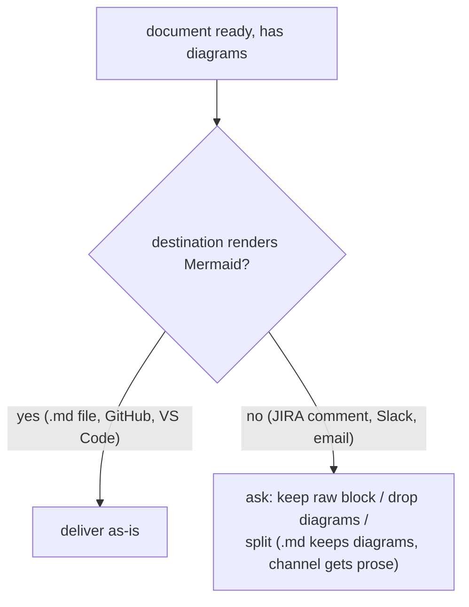

## Authoring guidance

- Quote node labels containing spaces or punctuation: `A["label with spaces"]`.
- Use `<br/>` for line breaks inside labels (HTML entities render unreliably).
- Diagrams supplement prose, never replace it — introduce or follow every
  diagram with at least one sentence saying what to see in it.
````

- [ ] **Step 2: Verify**

Run: `Test-Path "plugins/dev-workflows/references/diagram-convention.md"`
Expected: `True`

- [ ] **Step 3: Commit**

```powershell
git add plugins/dev-workflows/references/diagram-convention.md
git commit -m "feat(dev-workflows): canonical diagram convention reference file (ADR 0008)"
```

## Task 4: Point grill-then-plan at the convention (SKILL.md + ADR-FORMAT.md)

**Files:**
- Modify: `plugins/dev-workflows/skills/grill-then-plan/SKILL.md` (Steps 4 and 5)
- Modify: `plugins/dev-workflows/skills/grill-then-plan/ADR-FORMAT.md` (template)

- [ ] **Step 1: Edit SKILL.md Step 4 — ADR bullet gains the decision-diagram rule**

In `plugins/dev-workflows/skills/grill-then-plan/SKILL.md`, replace:

```markdown
- **Always create an ADR for every design decision** — one ADR per decision, the
  moment the decision is made. Do not batch or defer. Create `docs/adr/` lazily
  on the first ADR. Use the format in [ADR-FORMAT.md](./ADR-FORMAT.md). A
```

with:

```markdown
- **Always create an ADR for every design decision** — one ADR per decision, the
  moment the decision is made. Do not batch or defer. Create `docs/adr/` lazily
  on the first ADR. Use the format in [ADR-FORMAT.md](./ADR-FORMAT.md). Every
  ADR opens with a small Mermaid decision diagram (chosen vs rejected paths) —
  see `${CLAUDE_PLUGIN_ROOT}/references/diagram-convention.md`. A
```

- [ ] **Step 2: Edit SKILL.md Step 5 — the spec follows the convention**

Replace:

```markdown
Once understanding is shared, write the design to
`docs/superpowers/specs/YYYY-MM-DD-<topic>-design.md` (`<topic>` is a
lowercase-kebab slug). Run a self-review for placeholders, internal consistency,
```

with:

```markdown
Once understanding is shared, write the design to
`docs/superpowers/specs/YYYY-MM-DD-<topic>-design.md` (`<topic>` is a
lowercase-kebab slug). The spec is a Markdown document — follow the diagram
convention in `${CLAUDE_PLUGIN_ROOT}/references/diagram-convention.md` (one
overview Mermaid diagram at the top; type-matched diagrams per section).
Run a self-review for placeholders, internal consistency,
```

- [ ] **Step 3: Edit ADR-FORMAT.md — the template gains the diagram**

In `plugins/dev-workflows/skills/grill-then-plan/ADR-FORMAT.md`, replace:

````markdown
```md
# {Short title of the decision}

{1-3 sentences: what's the context, what did we decide, and why.}
```
````

with:

````markdown
```md
# {Short title of the decision}

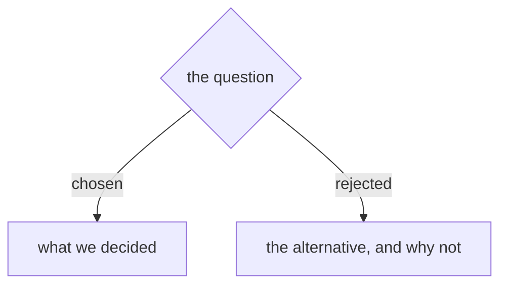

{1-3 sentences: what's the context, what did we decide, and why.}
```

Every ADR opens with one small Mermaid decision diagram (see
`${CLAUDE_PLUGIN_ROOT}/references/diagram-convention.md`, Rule 3).
````

(Note: nested fences — keep the outer fence longer than the inner ones, or use indentation as the file already does. Match the file's existing fencing style exactly when editing.)

- [ ] **Step 4: Verify**

Run: `Select-String -Path "plugins/dev-workflows/skills/grill-then-plan/SKILL.md","plugins/dev-workflows/skills/grill-then-plan/ADR-FORMAT.md" -Pattern 'references/diagram-convention\.md'`
Expected: ≥ 1 hit per file (2 in SKILL.md).

- [ ] **Step 5: Commit**

```powershell
git add plugins/dev-workflows/skills/grill-then-plan/SKILL.md plugins/dev-workflows/skills/grill-then-plan/ADR-FORMAT.md
git commit -m "feat(grill-then-plan): specs and ADRs follow the diagram convention"
```

## Task 5: Point post-mortem at the convention (with the ask-gate)

**Files:**
- Modify: `plugins/dev-workflows/skills/post-mortem/SKILL.md`

- [ ] **Step 1: Add a Diagrams section before `## Tone`**

Replace:

```markdown
## Tone

This is engineer-to-engineer. Different from `management-talk`:
```

with:

```markdown
## Diagrams

A post-mortem is a Markdown document — follow the diagram convention in
`${CLAUDE_PLUGIN_ROOT}/references/diagram-convention.md`. In practice: one
overview diagram at the top (usually a `flowchart TD` of root cause → mechanism
→ symptom → fix), and a `sequenceDiagram` in **Why it produced the symptom**
when the cause chain crosses components. If the destination (step 2 of the
output flow) is a JIRA comment, apply the convention's ask-gate before posting.

## Tone

This is engineer-to-engineer. Different from `management-talk`:
```

- [ ] **Step 2: Wire the ask-gate into the output flow**

Replace:

```markdown
3. **Produce the draft** as a single chat block.
```

with:

```markdown
3. **Produce the draft** as a single chat block, diagrams included (see
   Diagrams above). If the destination doesn't render Mermaid (JIRA comment),
   ask: keep the raw block, drop the diagrams, or split — `.md` file keeps
   diagrams, the comment gets prose.
```

- [ ] **Step 3: Verify**

Run: `Select-String -Path "plugins/dev-workflows/skills/post-mortem/SKILL.md" -Pattern 'diagram-convention\.md'`
Expected: 1 hit.

- [ ] **Step 4: Commit**

```powershell
git add plugins/dev-workflows/skills/post-mortem/SKILL.md
git commit -m "feat(post-mortem): diagram convention + ask-gate for JIRA destination"
```

## Task 6: Point study-design-verify at the convention

**Files:**
- Modify: `plugins/dev-workflows/skills/study-design-verify/SKILL.md` (Phase 4)

- [ ] **Step 1: Add the rule right after the advisory-shape code block**

Replace:

```markdown
3. Numbers keep their queries; claims keep their citations; corrections are stated plainly ("field X does not exist — sum the rows instead").
```

with:

```markdown
3. The advisory is a Markdown document — follow the diagram convention in `${CLAUDE_PLUGIN_ROOT}/references/diagram-convention.md`: open with one overview diagram (the recommended design's shape), use `erDiagram` for proposed schema/mapping changes and `flowchart TD` for phase/decision logic.
4. Numbers keep their queries; claims keep their citations; corrections are stated plainly ("field X does not exist — sum the rows instead").
```

Then renumber the old item 4 ("If the user maintains a knowledge base…") to 5:

Replace:

```markdown
4. If the user maintains a knowledge base, offer to file the advisory there so it compounds.
```

with:

```markdown
5. If the user maintains a knowledge base, offer to file the advisory there so it compounds.
```

- [ ] **Step 2: Verify**

Run: `Select-String -Path "plugins/dev-workflows/skills/study-design-verify/SKILL.md" -Pattern 'diagram-convention\.md'`
Expected: 1 hit.

- [ ] **Step 3: Commit**

```powershell
git add plugins/dev-workflows/skills/study-design-verify/SKILL.md
git commit -m "feat(study-design-verify): advisory follows the diagram convention"
```

## Task 7: Point fit-gap-analysis at the convention

**Files:**
- Modify: `plugins/dev-workflows/skills/fit-gap-analysis/SKILL.md` (step 9 + output checklist)

- [ ] **Step 1: Extend artifact step 9**

Replace:

```markdown
**9 · Produce multi-lens, self-explaining artifacts** — matrix + journeys + actors/access + impact/effort + open `[D]` items, with a **legend** so any reader decodes it without you. Land it where it compounds (a living doc) *and* as a working tracker (spreadsheet).
```

with:

```markdown
**9 · Produce multi-lens, self-explaining artifacts** — matrix + journeys + actors/access + impact/effort + open `[D]` items, with a **legend** so any reader decodes it without you. Land it where it compounds (a living doc) *and* as a working tracker (spreadsheet). The living doc follows the diagram convention (`${CLAUDE_PLUGIN_ROOT}/references/diagram-convention.md`): one overview diagram up top; `sequenceDiagram` for traced journeys, `graph TD` for cluster/dependency views.
```

- [ ] **Step 2: Add a checklist row**

Replace:

```markdown
- [ ] **Completeness gate** run (second adversarial look); **legend** included; gaps → **decisions**
```

with:

```markdown
- [ ] **Completeness gate** run (second adversarial look); **legend** included; gaps → **decisions**
- [ ] **Diagram convention** followed in the living doc (overview diagram + type-matched sections)
```

- [ ] **Step 3: Verify**

Run: `Select-String -Path "plugins/dev-workflows/skills/fit-gap-analysis/SKILL.md" -Pattern 'diagram-convention\.md'`
Expected: 1 hit.

- [ ] **Step 4: Commit**

```powershell
git add plugins/dev-workflows/skills/fit-gap-analysis/SKILL.md
git commit -m "feat(fit-gap-analysis): living doc follows the diagram convention"
```

## Task 8: Conditional pointers — naming-audit and ticket-trace (Rule 5)

These skills' default outputs are chat cards / spreadsheet write-backs — the convention applies **only when the user asks for a Markdown file** (spec Rule 5).

**Files:**
- Modify: `plugins/dev-workflows/skills/naming-audit/SKILL.md`
- Modify: `plugins/dev-workflows/skills/ticket-trace/SKILL.md`

- [ ] **Step 1: naming-audit — insert before `## After the audit`**

Replace:

```markdown
## After the audit
```

with:

```markdown
## If the output is requested as a document

The default output is per-item cards in chat plus spreadsheet write-back —
no diagrams. But if the user asks for the audit as a Markdown report file,
follow the diagram convention in
`${CLAUDE_PLUGIN_ROOT}/references/diagram-convention.md` (overview diagram of
verdict counts per area; the cards stay as-is).

## After the audit
```

- [ ] **Step 2: ticket-trace — insert before `## When NOT to use`**

Replace:

```markdown
## When NOT to use
```

with:

```markdown
## If the output is requested as a document

The default output is an evidence-chain answer in chat — no diagrams. But if
the user asks for the trace as a Markdown report file, follow the diagram
convention in `${CLAUDE_PLUGIN_ROOT}/references/diagram-convention.md` (the
overview diagram is the chain itself: `file:line` → commit → ticket, as a
`flowchart TD`).

## When NOT to use
```

- [ ] **Step 3: Verify**

Run: `Select-String -Path "plugins/dev-workflows/skills/naming-audit/SKILL.md","plugins/dev-workflows/skills/ticket-trace/SKILL.md" -Pattern 'diagram-convention\.md'`
Expected: 1 hit per file.

- [ ] **Step 4: Commit**

```powershell
git add plugins/dev-workflows/skills/naming-audit/SKILL.md plugins/dev-workflows/skills/ticket-trace/SKILL.md
git commit -m "feat(naming-audit,ticket-trace): conditional diagram-convention pointer (artifact decides)"
```

## Task 9: Align the two existing Mermaid skills — drive-to-legacy and crm-archaeology

They keep their richer per-section instructions; the shared file becomes the canonical base they point at.

**Files:**
- Modify: `plugins/dev-workflows/skills/drive-to-legacy/SKILL.md` (rule 2)
- Modify: `plugins/dev-workflows/skills/crm-archaeology/SKILL.md` (step 10)
- Modify: `plugins/dev-workflows/skills/crm-archaeology/references/architecture-template.md` (rule 2)

- [ ] **Step 1: drive-to-legacy rule 2**

Replace:

```markdown
2. **Mermaid diagrams everywhere** - sequence diagrams for flows, flowcharts for logic, ER diagrams for data, graph TD for hierarchies.
```

with:

```markdown
2. **Mermaid diagrams everywhere** - sequence diagrams for flows, flowcharts for logic, ER diagrams for data, graph TD for hierarchies. This implements the marketplace diagram convention (`${CLAUDE_PLUGIN_ROOT}/references/diagram-convention.md`) — including its mandatory overview diagram at the top of the document.
```

- [ ] **Step 2: crm-archaeology SKILL.md step 10**

Replace:

```markdown
Build `ARCHITECTURE.md` from the fragments following
`${CLAUDE_PLUGIN_ROOT}/skills/crm-archaeology/references/architecture-template.md`.
```

with:

```markdown
Build `ARCHITECTURE.md` from the fragments following
`${CLAUDE_PLUGIN_ROOT}/skills/crm-archaeology/references/architecture-template.md`.
The template implements the marketplace diagram convention
(`${CLAUDE_PLUGIN_ROOT}/references/diagram-convention.md`).
```

- [ ] **Step 3: crm-archaeology architecture-template rule 2**

Replace:

```markdown
2. **Mermaid everywhere** — sequenceDiagram for lifecycles, erDiagram for data,
   flowchart TD for decision logic, graph TD for hierarchies.
```

with:

```markdown
2. **Mermaid everywhere** — sequenceDiagram for lifecycles, erDiagram for data,
   flowchart TD for decision logic, graph TD for hierarchies. Implements the
   marketplace diagram convention
   (`${CLAUDE_PLUGIN_ROOT}/references/diagram-convention.md`), including its
   mandatory overview diagram at the top of ARCHITECTURE.md.
```

- [ ] **Step 4: Verify**

Run: `Select-String -Path "plugins/dev-workflows/skills/drive-to-legacy/SKILL.md","plugins/dev-workflows/skills/crm-archaeology/SKILL.md","plugins/dev-workflows/skills/crm-archaeology/references/architecture-template.md" -Pattern 'diagram-convention\.md'`
Expected: 1 hit per file.

- [ ] **Step 5: Commit**

```powershell
git add plugins/dev-workflows/skills/drive-to-legacy/SKILL.md plugins/dev-workflows/skills/crm-archaeology/SKILL.md plugins/dev-workflows/skills/crm-archaeology/references/architecture-template.md
git commit -m "refactor(drive-to-legacy,crm-archaeology): align Mermaid rules to the shared convention"
```

## Task 10: CLAUDE.md convention row + ARCHITECTURE.md recipe step

**Files:**
- Modify: `CLAUDE.md` (Conventions section)
- Modify: `docs/ARCHITECTURE.md` (add-a-skill recipe)

- [ ] **Step 1: CLAUDE.md — add a bullet at the end of "Conventions (do not violate)"**

Replace:

```markdown
- **Every new skill adds one row to [PLAYBOOK.md](PLAYBOOK.md)** — the playbook is the
  discoverability map for the daily arc; a skill missing from it is invisible. Add the
  row in the same commit that adds the skill.
```

with:

```markdown
- **Every new skill adds one row to [PLAYBOOK.md](PLAYBOOK.md)** — the playbook is the
  discoverability map for the daily arc; a skill missing from it is invisible. Add the
  row in the same commit that adds the skill.
- **Document skills follow the diagram convention** — every skill-generated Markdown
  document opens with one overview Mermaid diagram; ADRs carry a small decision diagram.
  Canonical wording lives only in
  `plugins/dev-workflows/references/diagram-convention.md` (ADRs 0005–0009).
```

- [ ] **Step 2: ARCHITECTURE.md — add recipe step 8**

Replace:

```markdown
7. **Test it.** Run `/ado-backlog:setup-check`, then exercise the skill end-to-end using
   the fixtures in `plugins/ado-backlog/examples/` (`sample-findings.csv`,
   `sample-backlog_input.json`). For anything that writes to ADO, validate via the
   dry-run path before a real run.
```

with:

```markdown
7. **Test it.** Run `/ado-backlog:setup-check`, then exercise the skill end-to-end using
   the fixtures in `plugins/ado-backlog/examples/` (`sample-findings.csv`,
   `sample-backlog_input.json`). For anything that writes to ADO, validate via the
   dry-run path before a real run.

8. **If the skill generates Markdown documents**, point it at the diagram convention —
   `plugins/dev-workflows/references/diagram-convention.md` (one overview Mermaid
   diagram at the top, type-matched diagrams per section, ask-gate for destinations
   that don't render Mermaid). See marketplace ADRs 0005–0009.
```

- [ ] **Step 3: Verify**

Run: `Select-String -Path "CLAUDE.md","docs/ARCHITECTURE.md" -Pattern 'diagram-convention\.md'`
Expected: 1 hit per file.

- [ ] **Step 4: Commit**

```powershell
git add CLAUDE.md docs/ARCHITECTURE.md
git commit -m "docs: diagram convention row in CLAUDE.md + add-a-skill recipe step"
```

## Task 11: Backfill decision diagrams — marketplace ADRs 0001–0004

Each edit inserts a Mermaid block between the `- **Date:**` line and `## Context`. (ADRs 0005–0009 already comply.)

**Files:**
- Modify: `docs/adr/0001-playbook-plus-daily-router.md`
- Modify: `docs/adr/0002-repo-as-single-source-of-skills.md`
- Modify: `docs/adr/0003-conditional-debug-chain.md`
- Modify: `docs/adr/0004-daily-router-hybrid-interaction.md`

- [ ] **Step 1: ADR 0001** — in `docs/adr/0001-playbook-plus-daily-router.md`, replace `- **Date:** 2026-06-11\n\n## Context` with:

````markdown
- **Date:** 2026-06-11

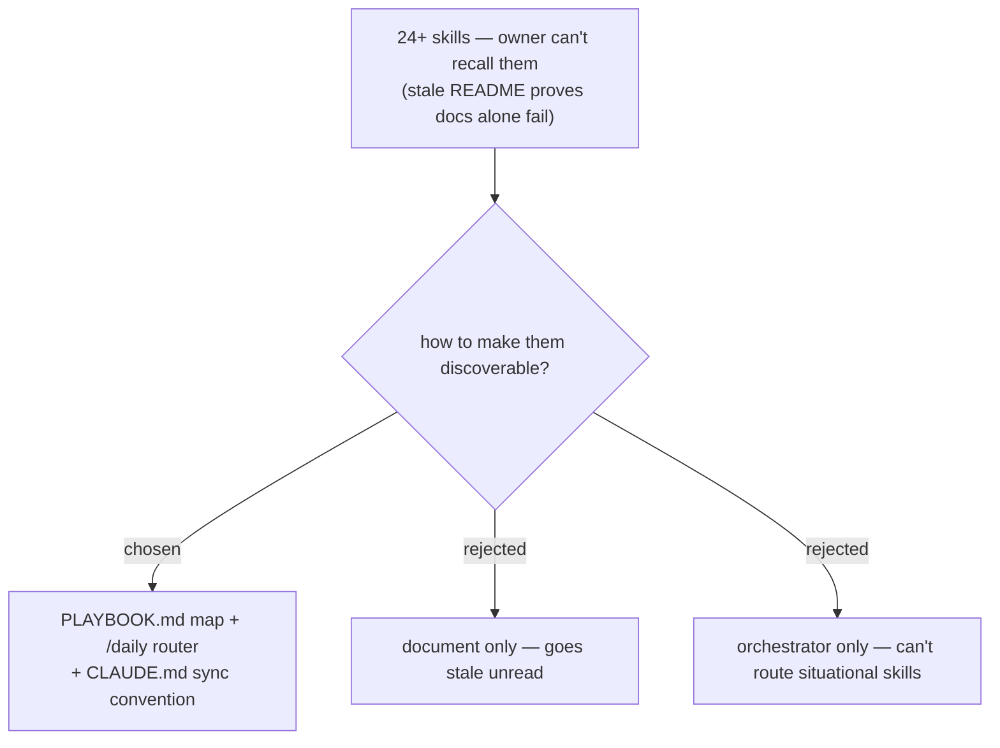

## Context
````

- [ ] **Step 2: ADR 0002** — same insertion pattern, diagram:

````markdown
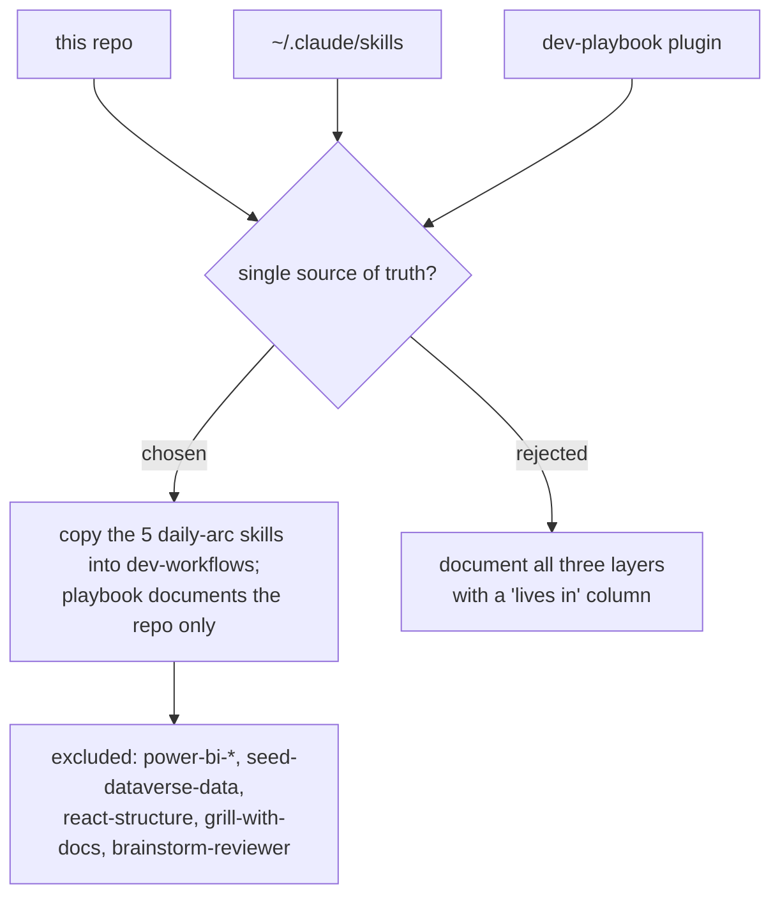
````

- [ ] **Step 3: ADR 0003** — diagram (mirrors its existing ASCII chain):

````markdown
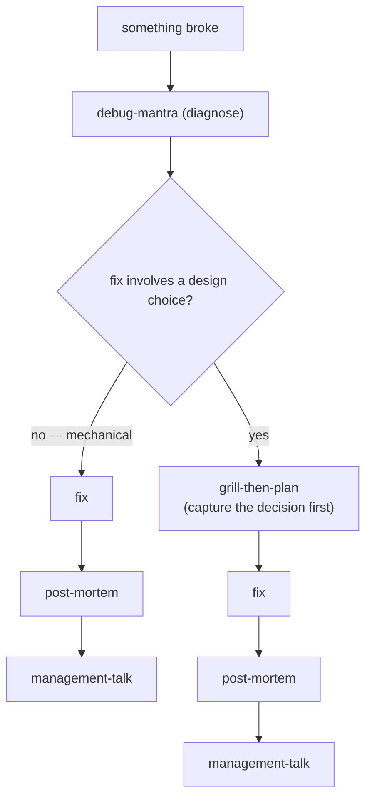
````

- [ ] **Step 4: ADR 0004** — diagram:

````markdown
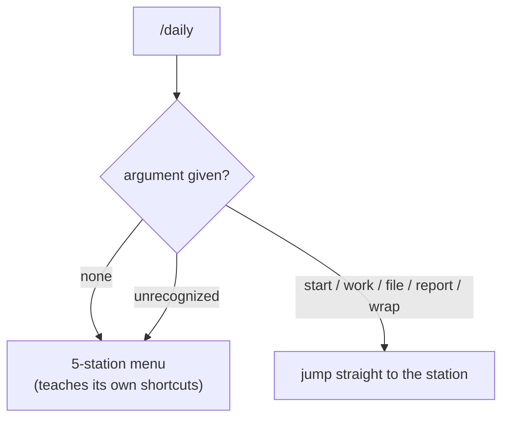
````

- [ ] **Step 5: Verify every marketplace ADR now has a Mermaid block**

Run: `Get-ChildItem docs/adr/*.md | ForEach-Object { "{0}: {1}" -f $_.Name, (Select-String -Path $_.FullName -Pattern '^```mermaid' -Quiet) }`
Expected: `True` for all 9 files.

- [ ] **Step 6: Commit**

```powershell
git add docs/adr/0001-playbook-plus-daily-router.md docs/adr/0002-repo-as-single-source-of-skills.md docs/adr/0003-conditional-debug-chain.md docs/adr/0004-daily-router-hybrid-interaction.md
git commit -m "docs(adr): backfill decision diagrams into ADRs 0001-0004 (ADR 0009)"
```

## Task 12: Backfill decision diagrams — plugin ADRs (ado-backlog 2, github-backlog 3)

Same insertion pattern: Mermaid block between `- **Date:** 2026-06-02` and `## Context` in each file.

**Files:**
- Modify: `plugins/ado-backlog/docs/adr/0001-estimate-as-child-task-hours.md`
- Modify: `plugins/ado-backlog/docs/adr/0002-az-org-project-discovery.md`
- Modify: `plugins/github-backlog/docs/adr/0001-separate-plugin-not-multi-backend.md`
- Modify: `plugins/github-backlog/docs/adr/0002-visual-dry-run-not-api-validation.md`
- Modify: `plugins/github-backlog/docs/adr/0003-labels-not-github-projects.md`

- [ ] **Step 1: ado-backlog ADR 0001** (hierarchy the decision creates):

````markdown
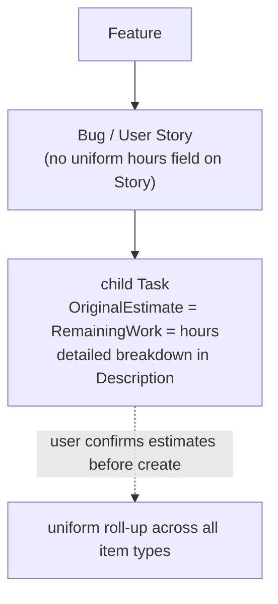
````

- [ ] **Step 2: ado-backlog ADR 0002** (layered fallback):

````markdown
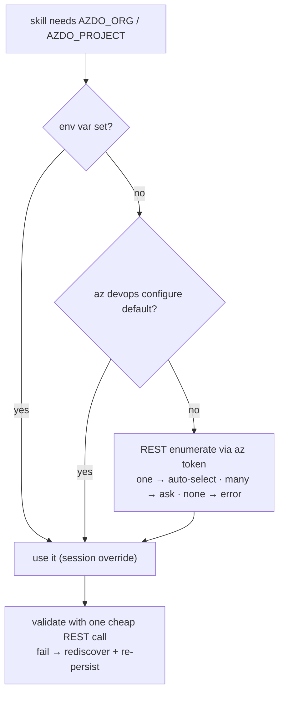
````

- [ ] **Step 3: github-backlog ADR 0001** (chosen vs rejected):

````markdown
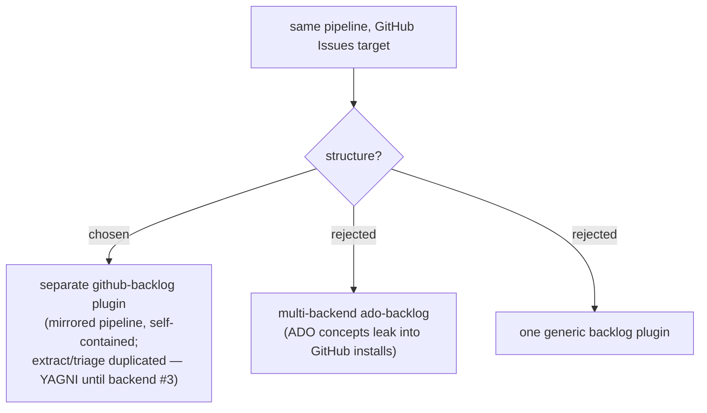
````

- [ ] **Step 4: github-backlog ADR 0002** (the gate):

````markdown
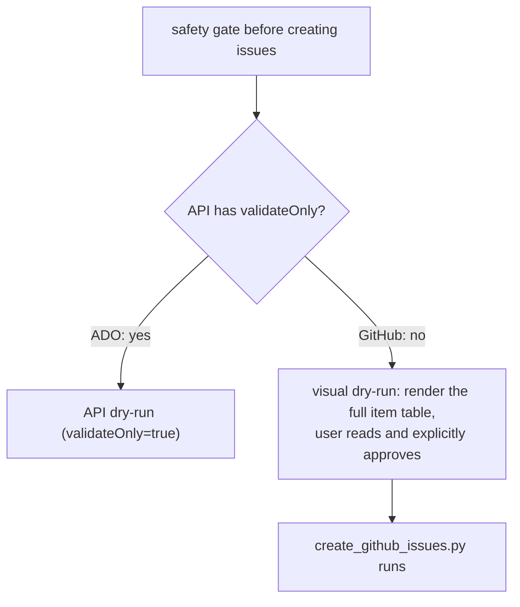
````

- [ ] **Step 5: github-backlog ADR 0003** (structure the decision creates):

````markdown
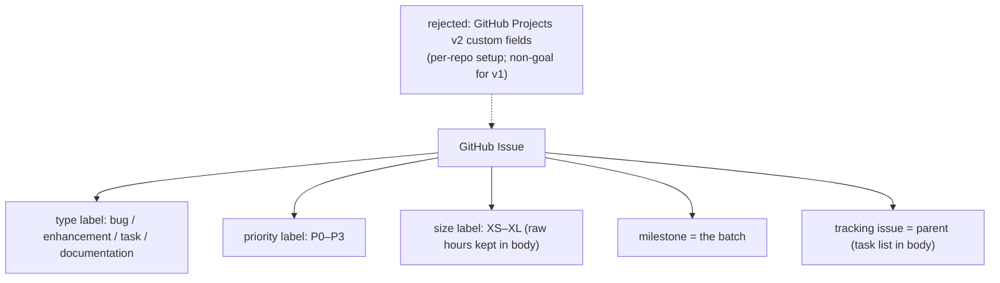
````

- [ ] **Step 6: Verify**

Run: `Get-ChildItem plugins/*/docs/adr/*.md | ForEach-Object { "{0}: {1}" -f $_.Name, (Select-String -Path $_.FullName -Pattern '^```mermaid' -Quiet) }`
Expected: `True` for all 5 files.

- [ ] **Step 7: Commit**

```powershell
git add plugins/ado-backlog/docs/adr plugins/github-backlog/docs/adr
git commit -m "docs(adr): backfill decision diagrams into plugin ADRs (ADR 0009)"
```

## Task 13: Version bump 0.10.1 → 0.11.0 (both files, in sync)

**Files:**
- Modify: `plugins/dev-workflows/.claude-plugin/plugin.json`
- Modify: `.claude-plugin/marketplace.json` (dev-workflows entry)

- [ ] **Step 1: plugin.json** — replace `"version": "0.10.1",` with `"version": "0.11.0",`

- [ ] **Step 2: marketplace.json** — in the `dev-workflows` entry, replace `"version": "0.10.1",` with `"version": "0.11.0",` (the file has one version per plugin — make sure the edit is inside the `"name": "dev-workflows"` object).

- [ ] **Step 3: Verify sync**

Run: `Select-String -Path ".claude-plugin/marketplace.json","plugins/dev-workflows/.claude-plugin/plugin.json" -Pattern '"version": "0\.11\.0"'`
Expected: exactly 1 hit per file, and `Select-String -Path ".claude-plugin/marketplace.json" -Pattern '"version": "0\.10\.1"'` returns nothing.

- [ ] **Step 4: Commit**

```powershell
git add .claude-plugin/marketplace.json plugins/dev-workflows/.claude-plugin/plugin.json
git commit -m "chore(dev-workflows): bump to 0.11.0 (diagram convention)"
```

## Task 14: Final verification sweep (spec checklist)

- [ ] **Step 1: Reference file exists**

Run: `Test-Path "plugins/dev-workflows/references/diagram-convention.md"` → `True`

- [ ] **Step 2: All 8 document skills point at it**

Run:
```powershell
Select-String -Path "plugins/dev-workflows/skills/post-mortem/SKILL.md","plugins/dev-workflows/skills/grill-then-plan/SKILL.md","plugins/dev-workflows/skills/study-design-verify/SKILL.md","plugins/dev-workflows/skills/fit-gap-analysis/SKILL.md","plugins/dev-workflows/skills/naming-audit/SKILL.md","plugins/dev-workflows/skills/ticket-trace/SKILL.md","plugins/dev-workflows/skills/drive-to-legacy/SKILL.md","plugins/dev-workflows/skills/crm-archaeology/SKILL.md","plugins/dev-workflows/skills/crm-archaeology/references/architecture-template.md" -Pattern 'diagram-convention\.md' | Group-Object Path | Measure-Object
```
Expected: Count = 9 (≥ 1 hit in each of the 9 files — 8 skills, crm-archaeology counted via both its SKILL.md and its template).

- [ ] **Step 3: Every ADR has a Mermaid block**

Run: `Get-ChildItem docs/adr/*.md, plugins/*/docs/adr/*.md | Where-Object { -not (Select-String -Path $_.FullName -Pattern '^```mermaid' -Quiet) }`
Expected: empty output (14 ADRs total: 9 marketplace + 5 plugin).

- [ ] **Step 4: CLAUDE.md convention row present**

Run: `Select-String -Path "CLAUDE.md" -Pattern 'diagram convention'` → ≥ 1 hit.

- [ ] **Step 5: Versions in sync**

Run: `Select-String -Path ".claude-plugin/marketplace.json","plugins/dev-workflows/.claude-plugin/plugin.json" -Pattern '"version": "0\.11\.0"'` → 1 hit per file.

- [ ] **Step 6: The rule statement exists once**

Run: `Select-String -Path "plugins/dev-workflows/skills/*/SKILL.md" -Pattern 'one overview Mermaid diagram at the top' -SimpleMatch`
Expected: 0–1 incidental hits in pointer text only; the full Rule 1–4 wording (headings `## Rule 1 —` …) exists ONLY in `references/diagram-convention.md`:
`Select-String -Path "plugins/dev-workflows/skills/*/SKILL.md","plugins/dev-workflows/skills/*/references/*.md" -Pattern '^## Rule 1 —'` → 0 hits.

- [ ] **Step 7: Clean tree**

Run: `git status --short` → empty.
