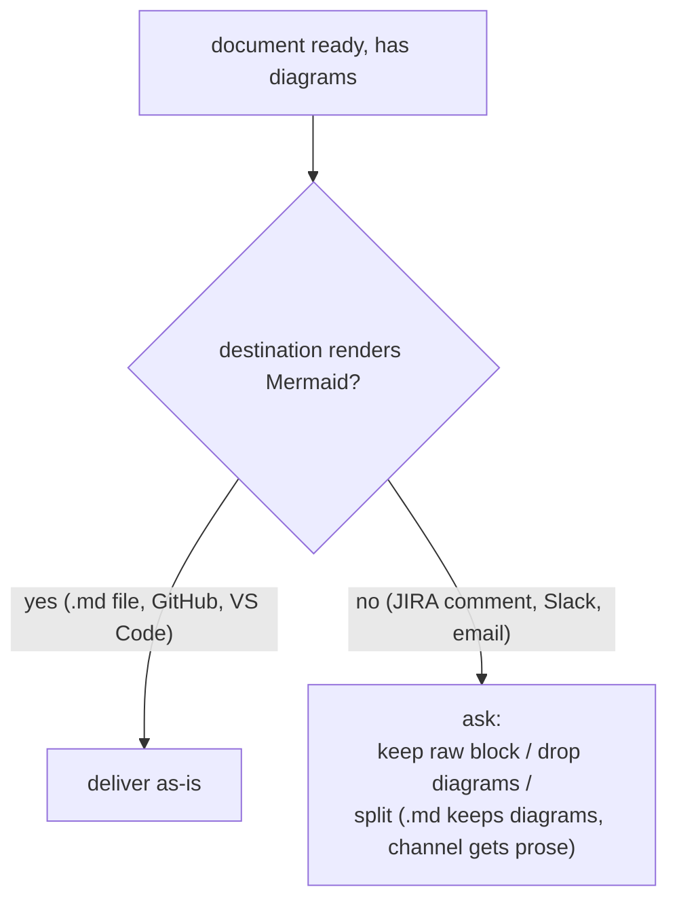

# debug-mantra Terminal Diagram Implementation Plan

> **For agentic workers:** REQUIRED SUB-SKILL: Use superpowers:subagent-driven-development (recommended) or superpowers:executing-plans to implement this plan task-by-task. Steps use checkbox (`- [ ]`) syntax for tracking.

**Goal:** Make `/debug-mantra` easier to read in the terminal by adding a static Unicode process diagram alongside its existing prose, and write down the small "terminal diagram" convention that makes it repeatable.

**Architecture:** Two documentation edits. (1) Reframe the single canonical diagram-convention reference file so it hosts two diagram families — Mermaid for `.md` documents (unchanged) and a new terminal family for interactive skills. (2) Embed a fixed, verbatim-emitted ASCII diagram into the `debug-mantra` skill as the convention's sole pilot adopter. Supporting ADRs (0010 at root, 0001 in dev-workflows) and the CONTEXT.md glossary terms were written during the design session and only need committing here.

**Tech Stack:** Markdown only. No build, no test runner — verification is `grep` presence/absence checks against the edited files. Git for version control. Windows + Git Bash for the shell commands below.

---

## Files

- **Modify:** `plugins/dev-workflows/references/diagram-convention.md` — reframe to two render targets; add the terminal-diagram family. (Full rewrite via Write — cleanest for a structural reframe.)
- **Modify:** `plugins/dev-workflows/skills/debug-mantra/SKILL.md` — embed the canonical diagram between the recital and "Then begin work."; add operating rules; add a convention pointer.
- **Modify:** `plugins/dev-workflows/.claude-plugin/plugin.json` — version bump.
- **Modify:** `.claude-plugin/marketplace.json` — dev-workflows entry version bump (kept in sync with plugin.json).
- **Commit only (already written in the design session):** `docs/adr/0010-terminal-diagrams-for-interactive-skills.md`, `plugins/dev-workflows/docs/adr/0001-debug-mantra-process-diagram.md`, `CONTEXT.md`, `docs/superpowers/specs/2026-06-15-debug-mantra-terminal-diagram-design.md`, and this plan.
- **Out of repo (flagged follow-up):** `~/.claude/skills/diagram-convention.md` — synced personal copy.

The canonical diagram block appears **once** in this plan, in Task 3 Edit A. Wherever it lands it must be byte-identical to that block.

---

### Task 1: Create the working branch and commit the design artifacts

The repo is on the default branch `main`. Branch first, then land the already-written design docs so the record is in from the start.

**Files:**
- Commit: `docs/superpowers/specs/2026-06-15-debug-mantra-terminal-diagram-design.md`, `docs/superpowers/plans/2026-06-15-debug-mantra-terminal-diagram.md`

- [ ] **Step 1: Create and switch to the feature branch**

Run:
```bash
git checkout -b feat/debug-mantra-terminal-diagram
```
Expected: `Switched to a new branch 'feat/debug-mantra-terminal-diagram'`

- [ ] **Step 2: Verify the design docs exist on disk**

Run:
```bash
ls docs/superpowers/specs/2026-06-15-debug-mantra-terminal-diagram-design.md docs/superpowers/plans/2026-06-15-debug-mantra-terminal-diagram.md
```
Expected: both paths print (no "No such file").

- [ ] **Step 3: Commit the design spec and plan**

```bash
git add "docs/superpowers/specs/2026-06-15-debug-mantra-terminal-diagram-design.md" "docs/superpowers/plans/2026-06-15-debug-mantra-terminal-diagram.md"
git commit -m "docs: design spec + plan for debug-mantra terminal diagram

Co-Authored-By: Claude Opus 4.8 (1M context) <noreply@anthropic.com>"
```
Expected: commit succeeds, 2 files changed.

---

### Task 2: Reframe the diagram-convention reference file

Rewrite the file so it leads with the render-target split, keeps the four Mermaid rules verbatim under a heading, and adds the terminal-diagram family. This is the canonical wording for the convention (ADR 0008 — one reference file).

**Files:**
- Modify (full rewrite): `plugins/dev-workflows/references/diagram-convention.md`
- Commit also: `docs/adr/0010-terminal-diagrams-for-interactive-skills.md`, `CONTEXT.md`

- [ ] **Step 1: Verify the new structure is absent (RED)**

Run:
```bash
grep -c "Two render targets" "plugins/dev-workflows/references/diagram-convention.md"
```
Expected: `0` (the reframe hasn't happened yet).

- [ ] **Step 2: Rewrite the file**

Replace the entire contents of `plugins/dev-workflows/references/diagram-convention.md` with exactly this (note: the file itself contains a ```` ```mermaid ```` block in Rule 4 — keep it):

````md
# Diagram convention

Canonical wording of the marketplace diagram convention (ADRs 0005–0010 at the
marketplace repo root). Skills point here; nothing else restates these rules.
To change the convention, change THIS file only.

## Two render targets

A diagram's **render target decides which family applies** — not the skill that
produces it:

| Output | Renders | Diagram family |
|---|---|---|
| Markdown document (ARCHITECTURE.md, post-mortem, spec, audit, trace) | Mermaid | **Mermaid diagrams** (below) |
| Live terminal session (interactive skill) | monospace text only | **Terminal diagrams** (below) |

Exempt from both families: **channel outputs** (Slack, JIRA comment, email,
standup line, Tribletext) and the **CONTEXT.md glossary**.

---

## Mermaid diagrams (Markdown documents)

### Who must follow this

Any skill whose output is a **Markdown document** — ARCHITECTURE.md, a
post-mortem, a design spec, an advisory document, a fit-gap, an audit report, a
trace report. **The artifact decides, not the skill:** if a normally
chat-shaped output (cards, tables, answers) is requested as a `.md` file, the
convention applies to that file.

### Rule 1 — One overview diagram at the top (mandatory)

Every generated Markdown document opens with **one Mermaid diagram showing the
shape of the whole thing** — placed right after the title/header block, before
any prose. It is a thumbnail, not the full model: keep it to roughly ≤ 15
nodes; deep detail belongs in section diagrams.

### Rule 2 — Type-matched section diagrams

Any section whose content describes a flow, data model, decision, or hierarchy
gets a diagram of the matching type:

| Content shape | Mermaid type |
|---|---|
| flow / lifecycle / interaction between actors | `sequenceDiagram` |
| data model / entity relationships | `erDiagram` |
| decision logic / branching | `flowchart TD` |
| hierarchy / pipeline / dependency / org structure | `graph TD` |

No forced diagrams: a pure table/list section stays prose.

Tie-breaker: `sequenceDiagram` is time-ordered (who sends what to whom);
`graph TD` is structural (what connects to what). If the arrows would carry
messages or events, use `sequenceDiagram`; if they connect boxes in a
hierarchy or pipeline, use `graph TD`.

### Rule 3 — ADRs carry a small decision diagram

Every ADR opens with one small Mermaid diagram of the decision — typically a
`flowchart TD` of the chosen path vs the rejected alternatives, or the
structure the decision creates. The glossary (CONTEXT.md) is the only exempt
Markdown document.

### Rule 4 — Ask before a non-rendering destination

Diagrams are **always authored**. If the chosen destination doesn't render
Mermaid (JIRA comment, Slack, email), **ask the user first** — never silently
strip, never silently post raw fences:



### Authoring guidance

- Quote node labels containing spaces or punctuation: `A["label with spaces"]`.
- Use `<br/>` for line breaks inside labels (HTML entities render unreliably).
- Diagrams supplement prose, never replace it — introduce or follow every
  diagram with at least one sentence saying what to see in it.

---

## Terminal diagrams (interactive skills)

For a skill whose output is a **live terminal session** (an interactive
discipline, not a durable `.md` document), Mermaid is useless — it renders as raw
code. Use a **terminal diagram** instead: a text diagram that reads correctly in
a monospace terminal.

### When it applies

An interactive skill MAY carry one terminal diagram of its process when prose
alone is hard to scan. It is optional per skill, not mandatory like Rule 1.

### Style

- **Unicode box-drawing** characters (`┌ ─ │ ▼ ▶ ① ■`), not Mermaid, not raw ASCII art.
- **Vertical** layout (top-to-bottom flow); keep width **≲ 50 columns** so it
  never wraps on a narrow terminal.
- Emit it **inside a fenced code block** so it renders monospace.
- **Static** — drawn once at the point it helps (e.g. session start), never
  redrawn or animated mid-session.
- **Augments, never replaces** prose — same as the Mermaid rules.

### Authoring guidance

- Alignment is **hand-maintained** — no renderer catches drift; keep columns
  simple and re-check spacing after edits.
- If a skill's diagram is fixed (e.g. debug-mantra's four-step process), store it
  as a **canonical block in the SKILL.md** and emit it **verbatim**, so it can't
  drift from the prose it mirrors.
- Introduce the diagram with a sentence, as with Mermaid.
````

- [ ] **Step 3: Verify the new structure is present (GREEN)**

Run:
```bash
grep -c "Two render targets" "plugins/dev-workflows/references/diagram-convention.md"
grep -c "Terminal diagrams (interactive skills)" "plugins/dev-workflows/references/diagram-convention.md"
grep -c "Rule 1 — One overview diagram at the top" "plugins/dev-workflows/references/diagram-convention.md"
grep -c "ADRs 0005–0010" "plugins/dev-workflows/references/diagram-convention.md"
```
Expected: `1` for every line (new sections added; Mermaid Rule 1 preserved; ADR pointer now spans 0005–0010).

- [ ] **Step 4: Commit the convention reframe plus the convention-level ADR and glossary**

```bash
git add "plugins/dev-workflows/references/diagram-convention.md" "docs/adr/0010-terminal-diagrams-for-interactive-skills.md" CONTEXT.md
git commit -m "docs(dev-workflows): diagram convention now covers two render targets (Mermaid + terminal)

Adds the terminal-diagram family for interactive skills alongside the existing
Mermaid rules for Markdown documents. Records ADR 0010 and the CONTEXT.md
'Terminal diagram' glossary term.

Co-Authored-By: Claude Opus 4.8 (1M context) <noreply@anthropic.com>"
```
Expected: commit succeeds, 3 files changed.

---

### Task 3: Add the terminal diagram to debug-mantra

Three edits to `plugins/dev-workflows/skills/debug-mantra/SKILL.md`: insert the canonical diagram after the recital, add operating rules, add the convention pointer.

**Files:**
- Modify: `plugins/dev-workflows/skills/debug-mantra/SKILL.md`
- Commit also: `plugins/dev-workflows/docs/adr/0001-debug-mantra-process-diagram.md`

- [ ] **Step 1: Verify the diagram is absent (RED)**

Run:
```bash
grep -c "four steps, strictly in order" "plugins/dev-workflows/skills/debug-mantra/SKILL.md"
```
Expected: `0`.

- [ ] **Step 2: Edit A — insert the canonical diagram between the recital and "Then begin work."**

Find this exact text (the last mantra line, blank line, then the "Then begin work." line):

```
> 4. **Every run is a breadcrumb.** Cross-reference all of them.

Then begin work.
```

Replace it with exactly this (the inserted block is a normal ```` ``` ```` fenced code block in the file):

````md
> 4. **Every run is a breadcrumb.** Cross-reference all of them.

Then, in that same first response, emit this process diagram **verbatim** inside
a fenced code block — it is fixed text, part of the recital; do not re-author,
paraphrase, or reflow it:

```
DEBUG MANTRA — four steps, strictly in order
─────────────────────────────────────────────

  ① REPRODUCE
  │   reliable repro?  ·  flaky → raise the rate
  │   no repro at all → ■ STOP (don't hypothesise)
  ▼
  ② FAIL PATH   (escalate only when the prior fails)
  │   1. attach a debugger
  │   2. source trace + knob enumeration
  │   3. in-code instrumentation
  ▼
  ③ FALSIFY
  │   3–5 ranked hypotheses  ·  run the DISPROOF first
  ▼
  ④ BREADCRUMBS
  │   ledger every run  ·  cross-reference all of them
  │
  └─▶ contradiction with a past run?  ──  back to ③
```

Then begin work.
````

- [ ] **Step 3: Edit B — extend the operating rules**

Find this exact text near the top of the "## Operating rules" section:

```
- Recite the mantra block **once** per debug session, in your first response. Do not re-recite mid-session.
- Recite **verbatim**. Never paraphrase, shorten, or skip lines of the recital.
- If the user says "skip the mantra" → skip the recital but still apply the four steps silently.
```

Replace it with:

```
- Recite the mantra block **once** per debug session, in your first response. Do not re-recite mid-session.
- Recite **verbatim**. Never paraphrase, shorten, or skip lines of the recital.
- Emit the **process diagram verbatim** right after the recital, in that same first response — it is part of the recital. Never re-author, paraphrase, or reflow it.
- If the user says "skip the mantra" → skip the recital **and the diagram** but still apply the four steps silently.
```

- [ ] **Step 4: Edit C — add the convention pointer at the end of the file**

Find this exact text (the current last line of the file):

```
- The mantra is a constraint **you** carry through the session — not advice to deliver back to the user.
```

Replace it with:

```
- The mantra is a constraint **you** carry through the session — not advice to deliver back to the user.

---

This skill follows the **terminal-diagram** convention — canonical wording in
`${CLAUDE_PLUGIN_ROOT}/references/diagram-convention.md`.
```

- [ ] **Step 5: Verify all three edits landed (GREEN)**

Run:
```bash
grep -c "four steps, strictly in order" "plugins/dev-workflows/skills/debug-mantra/SKILL.md"
grep -c "run the DISPROOF first" "plugins/dev-workflows/skills/debug-mantra/SKILL.md"
grep -c "skip the recital \*\*and the diagram\*\*" "plugins/dev-workflows/skills/debug-mantra/SKILL.md"
grep -c "references/diagram-convention.md" "plugins/dev-workflows/skills/debug-mantra/SKILL.md"
grep -c "Every run is a breadcrumb" "plugins/dev-workflows/skills/debug-mantra/SKILL.md"
```
Expected: `1` for each — diagram present, skip-rule updated, pointer added, and the original recital line still present (proves we augmented, didn't replace).

- [ ] **Step 6: Commit the skill change plus its pilot ADR**

```bash
git add "plugins/dev-workflows/skills/debug-mantra/SKILL.md" "plugins/dev-workflows/docs/adr/0001-debug-mantra-process-diagram.md"
git commit -m "feat(debug-mantra): add terminal process diagram alongside the verbatim recital

First adopter of the terminal-diagram convention (ADR 0010). The diagram is a
fixed canonical block emitted verbatim with the recital; 'skip the mantra' skips
it too. Records pilot ADR 0001.

Co-Authored-By: Claude Opus 4.8 (1M context) <noreply@anthropic.com>"
```
Expected: commit succeeds, 2 files changed.

---

### Task 4: Bump the dev-workflows version (in sync)

Convention + skill change → bump `dev-workflows` from `0.11.0` to `0.12.0`. The repo rule (CLAUDE.md) is that `plugin.json` and the `marketplace.json` entry must always report the same version.

**Files:**
- Modify: `plugins/dev-workflows/.claude-plugin/plugin.json:4`
- Modify: `.claude-plugin/marketplace.json:30`

- [ ] **Step 1: Verify both currently read 0.11.0 (RED)**

Run:
```bash
grep -n '"version": "0.11.0"' "plugins/dev-workflows/.claude-plugin/plugin.json" ".claude-plugin/marketplace.json"
```
Expected: two matching lines (plugin.json line ~4; marketplace.json line ~30, the dev-workflows entry).

- [ ] **Step 2: Bump plugin.json**

In `plugins/dev-workflows/.claude-plugin/plugin.json`, change:
```
  "version": "0.11.0",
```
to:
```
  "version": "0.12.0",
```

- [ ] **Step 3: Bump the marketplace.json dev-workflows entry**

In `.claude-plugin/marketplace.json`, in the object whose `"name": "dev-workflows"`, change its `"version": "0.11.0",` to `"version": "0.12.0",`. (There are three plugin entries — edit only the dev-workflows one. The `0.11.0` string is unique to dev-workflows, so a targeted replace is safe.)

- [ ] **Step 4: Verify both now read 0.12.0 and none of the others changed (GREEN)**

Run:
```bash
grep -n '"version": "0.12.0"' "plugins/dev-workflows/.claude-plugin/plugin.json" ".claude-plugin/marketplace.json"
grep -c '"version": "0.11.0"' "plugins/dev-workflows/.claude-plugin/plugin.json" ".claude-plugin/marketplace.json"
```
Expected: first command prints two `0.12.0` lines; second prints `0` for both files (no stray 0.11.0 left).

- [ ] **Step 5: Commit the version bump**

```bash
git add "plugins/dev-workflows/.claude-plugin/plugin.json" ".claude-plugin/marketplace.json"
git commit -m "chore(dev-workflows): bump to 0.12.0 (terminal-diagram convention + debug-mantra pilot)

Co-Authored-By: Claude Opus 4.8 (1M context) <noreply@anthropic.com>"
```
Expected: commit succeeds, 2 files changed.

---

### Task 5: Flag the personal-skills sync (do NOT do silently)

The canonical `diagram-convention.md` has a synced personal copy at
`~/.claude/skills/diagram-convention.md` that carries a "re-sync after editing the
canonical file" note. It is outside this repo and reflects a personal-skills
mirror, so per the design it must be flagged, not auto-synced.

**Files:**
- Out of repo: `~/.claude/skills/diagram-convention.md`

- [ ] **Step 1: Tell the user the canonical file changed and the personal copy is now stale**

State plainly: "`plugins/dev-workflows/references/diagram-convention.md` changed (two render targets + terminal family). The synced personal copy at `~/.claude/skills/diagram-convention.md` is now stale."

- [ ] **Step 2: Ask whether to re-sync it now**

Ask: "Re-sync the personal copy now? It would get the new content, keeping its top 'Synced copy for personal skills…' note line."

- [ ] **Step 3: Only if the user says yes — re-sync, preserving the sync-note header**

Copy the new canonical body into `~/.claude/skills/diagram-convention.md` but keep its existing first lines:
```
# Diagram convention — skill-generated Markdown documents

> Synced copy for personal skills. Canonical source: `plugins/dev-workflows/references/diagram-convention.md` in the workflow-daily-work repo - edit there, then re-sync.
```
…replaced/extended so the title matches the new canonical title (`# Diagram convention`) while keeping the `> Synced copy…` note immediately under it, followed by the new body. Then confirm to the user it's done. No git action — this file is not in the repo.

---

## Self-Review

**Spec coverage** (against `docs/superpowers/specs/2026-06-15-debug-mantra-terminal-diagram-design.md`):
- Work item 1 (reframe convention) → Task 2. ✅
- Work item 2 (edit SKILL.md: diagram + operating rule + pointer) → Task 3 Edits A/B/C. ✅
- Work item 3 (ADRs + CONTEXT already done) → committed in Tasks 2 & 3. ✅
- Work item 4 (re-sync follow-up, flagged not silent) → Task 5. ✅
- Acceptance: recital + diagram in first response → Edit A; "skip the mantra" skips both → Edit B; convention documents both families + SKILL points at it → Tasks 2 & 3; byte-identical block → single source in Task 3 Step 2; no other skill changes → only debug-mantra touched. ✅
- House rule: version sync → Task 4 (not in spec but required by CLAUDE.md). PLAYBOOK row → not needed (debug-mantra already listed, not a new skill). ✅

**Placeholder scan:** No TBD/TODO/"handle edge cases"/"similar to Task N". Every edit shows exact before/after text and the full diagram block appears in full. ✅

**Type/string consistency:** The diagram block, anchor strings (`four steps, strictly in order`, `run the DISPROOF first`, `skip the recital **and the diagram**`), the version strings (`0.11.0` → `0.12.0`), and the ADR pointer (`ADRs 0005–0010`) are used consistently across tasks and match the files read during planning. ✅
