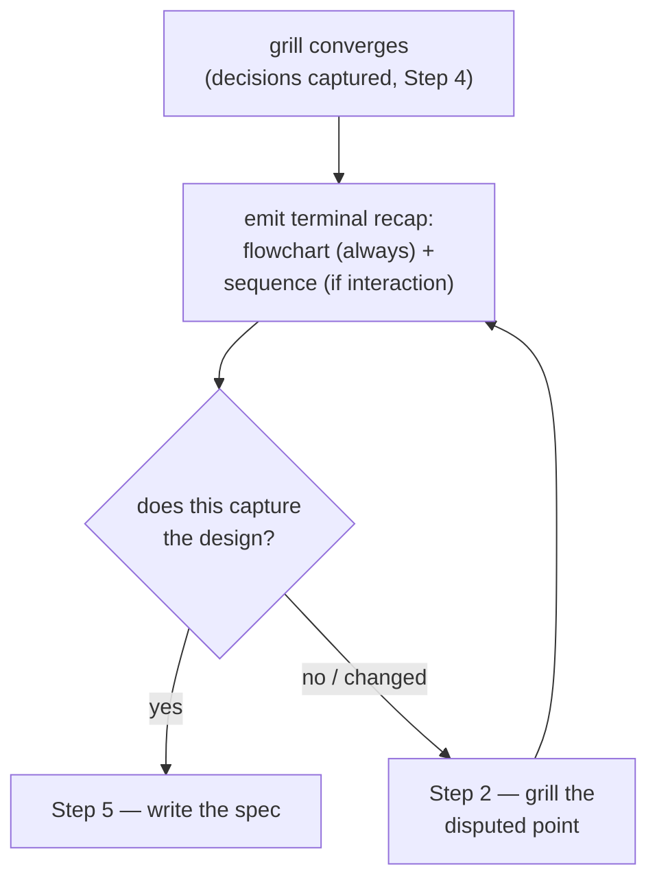

# grill-then-plan Recap & Confirm Gate — Implementation Plan

> **For agentic workers:** REQUIRED SUB-SKILL: Use superpowers:subagent-driven-development (recommended) or superpowers:executing-plans to implement this plan task-by-task. Steps use checkbox (`- [ ]`) syntax for tracking.

**Goal:** Add an internal "Step 4.5 — Recap & confirm" gate to the `grill-then-plan` skill that, when grilling converges, emits a Unicode terminal recap (a mandatory decision flowchart + an optional interaction sequence) and blocks spec-writing until the user confirms.

**Architecture:** Four small documentation/skill-content edits, no code. (1) Authorise the behavior in the diagram convention, (2) add the step to the skill, (3) record the decision as a root ADR, (4) bump the plugin version in lockstep. The recap renders *live in the terminal*, so it follows the **terminal-diagram family** (Unicode box-drawing), not the Mermaid families — Mermaid renders as raw code in a terminal.

**Tech Stack:** Markdown (skill SKILL.md, convention reference, ADR), JSON (plugin.json, marketplace.json), Mermaid (only inside the ADR, which is a rendered `.md`). Git for commits.

## Global Constraints

- **Reference bundled files via `${CLAUDE_PLUGIN_ROOT}`** — never hard-code paths inside a SKILL.md. The grill-then-plan SKILL.md already references the convention as `` `${CLAUDE_PLUGIN_ROOT}/references/diagram-convention.md` `` (twice); the new step must use that exact pattern.
- **Canonical diagram-convention wording lives ONLY in** `plugins/dev-workflows/references/diagram-convention.md` — the skill points at it, never restates the rules.
- **Version sync (hard rule):** `plugins/dev-workflows/.claude-plugin/plugin.json` and the dev-workflows entry in `.claude-plugin/marketplace.json` must always report the **same** version. Both are currently `0.13.0`; this change bumps both to `0.14.0`.
- **The recap is a live terminal artifact** — Unicode box-drawing, **vertical**, **≲ 50 columns**, inside a fenced block, **never Mermaid**. (Mermaid is used only inside the ADR file, which renders as Markdown.)
- **ADR format (followed by all 11 marketplace ADRs):** H1 `# ADR NNNN — <Title>` (em dash `—`, four-digit number, sentence-case title, no trailing period); two metadata bullets `- **Status:** Accepted` / `- **Date:** YYYY-MM-DD`; one `flowchart TD` decision diagram immediately after the metadata and before `## Context`; then `## Context`, `## Decision`, `## Consequences` (➕/➖ glyphs, cons carry a "Mitigation:" clause), `## Alternatives considered` (`**Bold option** — rejected: reason`).
- **Today's date is 2026-06-18** (use in the ADR Date bullet).
- **No new PLAYBOOK row, no README change, no CONTEXT.md term** — this is an internal step inside an existing skill, not a new skill, convention, or reusable domain noun. (See "Deliberate non-edits" below.)

## File structure

| File | Responsibility | Action |
|---|---|---|
| `plugins/dev-workflows/references/diagram-convention.md` | Canonical diagram convention | Add one line authorising a self-mandated, type-matched terminal recap |
| `plugins/dev-workflows/skills/grill-then-plan/SKILL.md` | The grill-then-plan procedure | Insert `## Step 4.5 — Recap & confirm` between Step 4 and Step 5 |
| `docs/adr/0012-grill-then-plan-recap-gate.md` | Marketplace decision record (new) | Create, recording the recap-gate decision |
| `plugins/dev-workflows/.claude-plugin/plugin.json` | dev-workflows plugin manifest | Bump `version` `0.13.0` → `0.14.0` |
| `.claude-plugin/marketplace.json` | Marketplace manifest | Bump dev-workflows entry `version` `0.13.0` → `0.14.0` |

### Deliberate non-edits (verified during grounding — do NOT touch)

- **`PLAYBOOK.md`** — grill-then-plan's row (`| designing something new | \`grill-then-plan\` |`) is unchanged; the playbook maps *when to reach for a skill*, not its internal steps. The "one row per new skill" rule does not apply (no new skill).
- **`README.md`** — only names the skill (`design (grill-then-plan)`), not its steps.
- **`CONTEXT.md`** — a recap step is not a reusable cross-skill domain noun; no glossary term. (Step 4.5 also emits no Markdown document, so the "Diagram convention"/"Terminal diagram" glossary terms are not engaged.)
- **Root `CLAUDE.md` ADR pointer** — reads "(daily-arc/playbook/router ADRs 0001–0004, 0011)". This is a *curated* list that already omits the convention ADRs 0005–0010; ADR 0012 is convention-flavored, so for consistency it is **not** added to that pointer.
- **No plugin-level ADR** (`plugins/dev-workflows/docs/adr/`) — the decision amends a *root* convention (ADR 0010) that spans interactive skills, so it is recorded at root, alongside 0005–0011.

---

### Task 1: Authorise a self-mandated, type-matched terminal recap in the convention

**Files:**
- Modify: `plugins/dev-workflows/references/diagram-convention.md` (the "Terminal diagrams (interactive skills)" → "When it applies" subsection, after the line "It is optional per skill, not mandatory like Rule 1.")

**Interfaces:**
- Consumes: nothing.
- Produces: the convention sentence that Task 2's Step 4.5 relies on ("a flowchart of its decisions is mandatory, a sequence of its interaction is optional"). No Rule 2 palette change — `flowchart TD` and `sequenceDiagram` are already in the palette.

- [ ] **Step 1: Confirm the current text of the insertion point**

Run (Grep tool, or `git grep -n`):
```
grep -n "optional per skill" "plugins/dev-workflows/references/diagram-convention.md"
```
Expected: one hit on the line `alone is hard to scan. It is optional per skill, not mandatory like Rule 1.`

- [ ] **Step 2: Add the authorising line**

Edit `plugins/dev-workflows/references/diagram-convention.md`. Match exactly:

```
An interactive skill MAY carry one terminal diagram of its process when prose
alone is hard to scan. It is optional per skill, not mandatory like Rule 1.
```

Replace with:

```
An interactive skill MAY carry one terminal diagram of its process when prose
alone is hard to scan. It is optional per skill, not mandatory like Rule 1.

A skill MAY also mandate one for itself: when it does, type-match it the same way
Rule 2 does — a flowchart of its decisions is mandatory, a sequence of its
interaction is optional.
```

- [ ] **Step 3: Verify the edit landed and the palette is unchanged**

Run:
```
grep -n "MAY also mandate one for itself" "plugins/dev-workflows/references/diagram-convention.md"
grep -n "flowchart TD\|sequenceDiagram" "plugins/dev-workflows/references/diagram-convention.md"
```
Expected: the first finds the new line; the second still shows the existing Rule 2 palette rows (`sequenceDiagram`, `flowchart TD`) — no palette rows added or removed.

- [ ] **Step 4: Commit**

```bash
git add plugins/dev-workflows/references/diagram-convention.md
git commit -m "docs(dev-workflows): allow interactive skills to mandate a type-matched terminal recap

Co-Authored-By: Claude Opus 4.8 (1M context) <noreply@anthropic.com>"
```

---

### Task 2: Insert "Step 4.5 — Recap & confirm" into grill-then-plan

**Files:**
- Modify: `plugins/dev-workflows/skills/grill-then-plan/SKILL.md` (insert between Step 4, which ends `…A short ADR is better than a missing one.`, and the `## Step 5 — Write the design spec` heading)

**Interfaces:**
- Consumes: the convention line from Task 1 (the recap's "mandatory flowchart / optional sequence" rule); the terminal-diagram family in `${CLAUDE_PLUGIN_ROOT}/references/diagram-convention.md`.
- Produces: the procedural gate that ADR 0012 (Task 3) records.

- [ ] **Step 1: Confirm the Step 4 / Step 5 boundary is intact**

Run:
```
grep -n "A short ADR is better than a missing one.\|## Step 5 — Write the design spec\|## Step 4.5" "plugins/dev-workflows/skills/grill-then-plan/SKILL.md"
```
Expected: a hit for the Step 4 closing line, a hit for the `## Step 5` heading, and **no** hit for `## Step 4.5` (not yet added). If `## Step 4.5` already exists, stop — the task is already done.

- [ ] **Step 2: Insert the new step**

Edit `plugins/dev-workflows/skills/grill-then-plan/SKILL.md`. Match exactly (the end of Step 4 through the Step 5 heading):

```
  doubt, write the ADR. A short ADR is better than a missing one.

## Step 5 — Write the design spec
```

Replace with:

```
  doubt, write the ADR. A short ADR is better than a missing one.

## Step 4.5 — Recap & confirm

When grilling converges, **before writing the spec**, play the design back as a
**terminal recap** so the user can confirm it is captured correctly. Render it as a
terminal diagram per the *Terminal diagrams* family in
`${CLAUDE_PLUGIN_ROOT}/references/diagram-convention.md` (Unicode box-drawing,
vertical, ≲ 50 columns, inside a fenced block — never Mermaid, which does not render
live in a terminal):

- **Emit a flowchart of the grilled decisions — mandatory.** One box per decision in
  the order they were resolved, showing the chosen option, connected top-to-bottom.
  Every grilling session produces decisions, so this diagram always appears.
- **Emit a sequence of the runtime interaction — optional.** Show it only when the
  design has a genuine interaction (≥ 2 actors exchanging messages). Omit it for a
  pure data-model or config design — never force a one-actor diagram.

Then ask: **"Does this capture the design?"**

- If the user **confirms**, continue to Step 5.
- If the user **corrects** anything, return to Step 2, grill the disputed point, then
  re-run this recap. Loop until confirmed.

This is a cheap checkpoint on the *decision set* before the spec exists; it is
distinct from Step 5's gate, which approves the *written spec*. Do not write the spec
until the recap is confirmed.

## Step 5 — Write the design spec
```

- [ ] **Step 3: Verify the step was inserted in the right place**

Run:
```
grep -n "## Step 4\|## Step 4.5\|## Step 5\|## Step 6" "plugins/dev-workflows/skills/grill-then-plan/SKILL.md"
```
Expected order, ascending line numbers: `## Step 4 — Capture inline…`, then `## Step 4.5 — Recap & confirm`, then `## Step 5 — Write the design spec`, then `## Step 6 — Hand off`. Confirm Step 5 and Step 6 headings are unchanged (no renumbering).

- [ ] **Step 4: Verify the path reference uses the plugin-root variable**

Run:
```
grep -n "CLAUDE_PLUGIN_ROOT}/references/diagram-convention.md" "plugins/dev-workflows/skills/grill-then-plan/SKILL.md"
```
Expected: at least 3 hits now (the two pre-existing references in Step 4 and Step 5, plus the new one in Step 4.5). No hard-coded path appears.

- [ ] **Step 5: Commit**

```bash
git add plugins/dev-workflows/skills/grill-then-plan/SKILL.md
git commit -m "feat(dev-workflows): add Step 4.5 recap & confirm gate to grill-then-plan

Emit a Unicode terminal recap at end-of-grill (mandatory decision flowchart +
optional interaction sequence) and block spec-writing until the user confirms.

Co-Authored-By: Claude Opus 4.8 (1M context) <noreply@anthropic.com>"
```

---

### Task 3: Record the decision as root ADR 0012

**Files:**
- Create: `docs/adr/0012-grill-then-plan-recap-gate.md`

**Interfaces:**
- Consumes: the behavior from Tasks 1 and 2 (this ADR documents *why* they exist).
- Produces: the durable decision record. Links to ADR 0010 (terminal-diagram family) and ADR 0011 (the prior grill-then-plan behavior change).

- [ ] **Step 1: Confirm 0012 is the next free number**

Run:
```
ls docs/adr/
```
Expected: files `0001`…`0011`; no `0012`. (If `0012` exists, stop and reconcile.)

- [ ] **Step 2: Create the ADR file**

Create `docs/adr/0012-grill-then-plan-recap-gate.md` with **exactly** this content (note the em dash `—` in the title, and that the Mermaid block renders because this is a `.md` document):

````markdown
# ADR 0012 — grill-then-plan ends the grill with a Recap & confirm gate

- **Status:** Accepted
- **Date:** 2026-06-18



## Context

grill-then-plan grills the user down a design tree (Step 2), captures terms and
ADRs inline as decisions crystallize (Step 4), then writes the design spec (Step
5). Step 5 already gates on the user approving the *written spec* — but by then the
whole spec has been authored, so a misremembered or half-resolved decision surfaces
at the most expensive point.

The owner asked for the convergence point to carry a diagram — "grill-then-plan
should have UML to show when summary" — preferring a flowchart, with a sequence
diagram where it fits. Because the grilling runs in a **live terminal**, where
Mermaid renders as raw code, the recap uses the terminal-diagram family of ADR
[0010](0010-terminal-diagrams-for-interactive-skills.md) rather than Mermaid. This
is the second behavior refinement to this skill after ADR
[0011](0011-grill-then-plan-verifies-cause-first.md).

## Decision

grill-then-plan adds an internal **Step 4.5 — Recap & confirm** between capture
(Step 4) and spec-writing (Step 5): when grilling converges, emit a Unicode terminal
recap — **a flowchart of the grilled decisions (mandatory)** plus **a sequence of
the runtime interaction (optional, only when ≥ 2 actors exchange messages)** — and
ask the user to confirm it captures the design. On confirmation, proceed to Step 5;
on a correction, return to Step 2 and re-recap until confirmed.

The terminal-diagram convention gains one line authorising this: a skill MAY mandate
a recap for itself and type-match it the way Rule 2 does (flowchart of decisions
mandatory, sequence of interaction optional). No Rule 2 palette change — both types
already exist there.

## Consequences

- ➕ A cheap pre-spec checkpoint catches a divergent decision set before the full
  spec is written, not after.
- ➕ The convergence point carries a diagram in the type the design's shape calls
  for, consistent with the spec's own Rule 2 type-matching.
- ➕ Complements rather than duplicates Step 5: Step 4.5 confirms the *decision set*;
  Step 5 confirms the *written spec*.
- ➖ "Does the design have a real interaction?" is a judgment call. Mitigation: the
  flowchart is always shown; the sequence is explicitly optional, so a wrong call
  only omits a supplementary diagram, never the mandatory one.
- ➖ One extra confirmation turn per session. Mitigation: it loops back into grilling
  only on a correction — which would otherwise have surfaced as costlier spec rework.

## Alternatives considered

- **Mermaid in the live recap** — rejected: Mermaid renders as raw code in a
  terminal; the terminal-diagram family (ADR 0010) exists for exactly this.
- **A state diagram as the mandatory diagram** — rejected: a state diagram fits only
  a lifecycle/status subject; most grilled designs are not state machines, so it
  would force an ill-fitting diagram and require a new palette type.
- **Always emit both a flowchart and a sequence** — rejected: a pure data-model or
  config design has no real interaction, so a forced one-actor sequence is noise;
  "no forced diagrams" stays intact.
- **Read-only recap with no gate** — rejected: the value is the confirmation; a recap
  the user cannot correct before Step 5 is decoration.
- **Rely on Step 5's existing spec-approval gate alone** — rejected: that gate fires
  after the spec is written, catching divergence at the most expensive point.
- **Record this in a plugin-level ADR instead of root** — rejected: the change amends
  the root terminal-diagram convention (ADR 0010), which spans interactive skills, so
  it belongs at root alongside 0005–0011.
````

- [ ] **Step 3: Verify structure and Mermaid sanity**

Run:
```
grep -n "^# ADR 0012 —\|^- \*\*Status:\*\*\|^- \*\*Date:\*\*\|^```mermaid\|^## Context\|^## Decision\|^## Consequences\|^## Alternatives considered" "docs/adr/0012-grill-then-plan-recap-gate.md"
```
Expected: the H1 with an em dash, both metadata bullets, one `` ```mermaid `` opener, and the four H2 sections in order. Visually confirm the Mermaid block has balanced quotes and `<br/>` line breaks (no raw newlines inside node labels) so it renders.

- [ ] **Step 4: Commit**

```bash
git add docs/adr/0012-grill-then-plan-recap-gate.md
git commit -m "docs(adr): 0012 — grill-then-plan recap & confirm gate

Co-Authored-By: Claude Opus 4.8 (1M context) <noreply@anthropic.com>"
```

---

### Task 4: Bump the dev-workflows version in lockstep

**Files:**
- Modify: `plugins/dev-workflows/.claude-plugin/plugin.json` (line 4: `"version": "0.13.0"`)
- Modify: `.claude-plugin/marketplace.json` (the dev-workflows entry: `"version": "0.13.0"`)

**Interfaces:**
- Consumes: nothing.
- Produces: matching `0.14.0` in both files (the version-sync invariant).

- [ ] **Step 1: Confirm both files are at 0.13.0**

Run:
```
grep -n "\"version\": \"0.13.0\"" plugins/dev-workflows/.claude-plugin/plugin.json .claude-plugin/marketplace.json
```
Expected: exactly one hit in each file (in `marketplace.json` it is the dev-workflows entry; `ado-backlog` is `0.2.0`, `github-backlog` is `0.1.0`, and the top-level marketplace `version` is `0.3.0`, so `0.13.0` is unique to dev-workflows).

- [ ] **Step 2: Bump plugin.json**

Edit `plugins/dev-workflows/.claude-plugin/plugin.json`. Match `  "version": "0.13.0",` and replace with `  "version": "0.14.0",`.

- [ ] **Step 3: Bump marketplace.json**

Edit `.claude-plugin/marketplace.json`. Match `      "version": "0.13.0",` and replace with `      "version": "0.14.0",`. (The string `0.13.0` appears only once in the file, so this targets the dev-workflows entry.)

- [ ] **Step 4: Verify both report 0.14.0 and stay in sync**

Run:
```
grep -n "\"version\": \"0.14.0\"" plugins/dev-workflows/.claude-plugin/plugin.json .claude-plugin/marketplace.json
grep -rn "\"version\": \"0.13.0\"" plugins/dev-workflows/.claude-plugin/plugin.json .claude-plugin/marketplace.json
```
Expected: the first prints one `0.14.0` hit per file; the second prints **nothing** (no stale `0.13.0` left). Optionally validate JSON: `python -c "import json,sys; [json.load(open(p)) for p in ['plugins/dev-workflows/.claude-plugin/plugin.json', '.claude-plugin/marketplace.json']]; print('JSON OK')"`.

- [ ] **Step 5: Commit**

```bash
git add plugins/dev-workflows/.claude-plugin/plugin.json .claude-plugin/marketplace.json
git commit -m "chore(dev-workflows): bump to 0.14.0 (recap & confirm gate)

Co-Authored-By: Claude Opus 4.8 (1M context) <noreply@anthropic.com>"
```

---

## Post-implementation note (not a task)

The repo is the single source of skills (ADR 0002); the deployed copy under
`~/.claude/skills/grill-then-plan` is produced by the separate resync process, not by
this change. No action here — just don't hand-edit the deployed copy.

## Self-Review

- **Spec coverage:** Decision 1 (location) → Task 2; Decision 2 (Unicode form) → Task 2 Step 2 + Global Constraints; Decision 3 (confirmation gate) → Task 2 Step 2; Decisions 4–5 (mandatory flowchart / optional sequence) → Task 2 Step 2 bullets; Decision 6 (ADR + convention note + version sync) → Tasks 1, 3, 4. Rejected alternatives → ADR 0012 "Alternatives considered". No gaps.
- **Placeholder scan:** none — every edit shows the exact match/replace text and the full ADR body.
- **Type consistency:** the convention line ("flowchart of its decisions is mandatory, a sequence of its interaction is optional") matches the skill's Step 4.5 bullets and the ADR's Decision/Consequences wording. Version `0.14.0` is identical across both manifest files. ADR header/section names match the verified marketplace ADR template.
