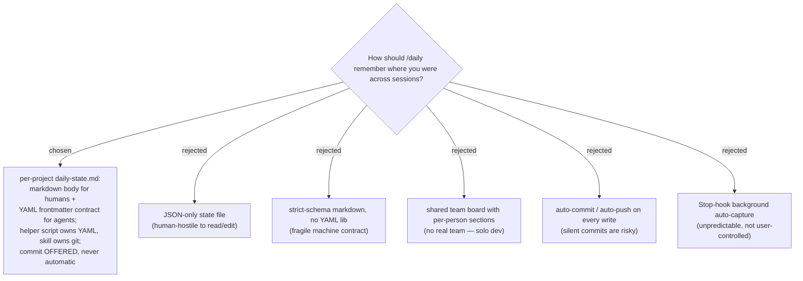

# /daily Cross-Session Work-State File — Implementation Plan

> **For agentic workers:** REQUIRED SUB-SKILL: Use superpowers:subagent-driven-development (recommended) or superpowers:executing-plans to implement this plan task-by-task. Steps use checkbox (`- [ ]`) syntax for tracking.

**Goal:** Give `/daily` a per-project `daily-state.md` (markdown + YAML frontmatter) that it writes on `save`/`wrap` and reads on `start`, so returning narrates "welcome back, here's where you were, here's the next step."

**Architecture:** A bundled helper script (`scripts/daily-state.py`, PyYAML) owns ALL frontmatter read/write through three subcommands (`show`/`set`/`resolve-path`) and is importable as pure functions for testing. The `/daily` SKILL adds read touchpoints (bare `/daily`, `/daily start`) and write touchpoints (new `/daily save` accelerator, `/daily wrap`); **git stays in the skill** (commit is offered, never automatic). The file's frontmatter is a documented data contract a second agent can parse.

**Tech Stack:** Python 3.13 + PyYAML 6.x (script + pytest tests), Markdown/YAML (the state file, contract doc, ADR), PowerShell (setup_check), JSON (plugin manifests). The daily skill/command/PLAYBOOK are Markdown.

## Global Constraints

- **Branch:** `feat/daily-state-file` (already exists; holds the spec commit). Repo convention is `feat/*` branches merged to `main`. Commit per task; trailer `Co-Authored-By: Claude Opus 4.8 (1M context) <noreply@anthropic.com>`.
- **Python only**, English comments, mirror `ado-backlog/scripts/` conventions (shebang optional, `utf-8-sig` read / `utf-8` write, `sys.stdout.reconfigure("utf-8")` guard, `raise SystemExit(...)` for errors, `argparse` subparsers, snake_case).
- **`pytest` is NOT on PATH** — always invoke as `python -m pytest`.
- **Dependency floor:** PyYAML (import name `yaml`). Already installed in this env (6.0.3); add it to `setup_check.ps1`.
- **Bundled paths in the skill** use `"${CLAUDE_PLUGIN_ROOT}/scripts/daily-state.py"` (quoted — paths can contain spaces).
- **Version sync:** `plugins/dev-workflows/.claude-plugin/plugin.json` and the `dev-workflows` entry in `.claude-plugin/marketplace.json` must BOTH read `0.16.0` after this work (they are currently drifted: 0.15.0 vs 0.14.0).
- **Invariants (ADR 0014):** the script owns YAML, the skill owns git; reads never write; writes always *offer* commit and never commit unprompted; `save`/`pause`/`checkpoint` are NOT numbered stations (the ADR 0004 five-station circle stays intact); `show` prints the literal string `no state yet` (NOT JSON) when absent → skip the welcome-back silently.
- **Frontmatter contract (exact names/types):** `type:"daily-state"`, `schema_version:int`, `updated:ISO-8601+offset`, `station:{start|work|file|report|wrap}`, `status:{in-progress|blocked|paused|done}`, `focus.{topic(req),ticket(opt)}`, `next.{action(req),reason(opt)}`, `chain?:list`, `blockers?:list`.
- **PyYAML-missing severity:** report as **WARN** (matches the openpyxl convention); the spec's acceptance check 9 is amended to "reported (WARN)" in Task 6.

---

### Task 1: Helper script `daily-state.py` + unit tests (already on disk, verified — adopt & commit)

> The research phase wrote and verified these two files on `feat/daily-state-file` (untracked, 19/19 tests pass). This task confirms them and commits them. Full canonical content is reproduced below so the task is self-contained; the on-disk files are the source of truth.

**Files:**
- Create: `plugins/dev-workflows/scripts/daily-state.py` (exists on disk, 15043 bytes)
- Test: `plugins/dev-workflows/scripts/test_daily_state.py` (exists on disk, 9744 bytes)

**Interfaces:**
- Produces (importable pure functions, relied on by tests and other agents):
  - `resolve_path(path=None, env_value=None, cwd=None, git_root=_UNSET) -> str|None` — precedence `--path` > `DAILY_STATE_FILE` > git-root; `None` when not in a repo and no override.
  - `parse_frontmatter(text) -> (dict, str)` — split `---` fences, `yaml.safe_load`.
  - `render_frontmatter(frontmatter, body) -> str` — emit in `FIELD_ORDER`, `sort_keys=False`.
  - `upsert_state(existing, station=None, status=None, ticket=None, topic=None, next_action=None, next_reason=None, blockers=None, now=None) -> dict` — read-modify-write; restamps `type`/`schema_version`/`updated`; never mutates `existing`.
  - `append_note(body, note, now=None) -> str` — timestamped bullet under `## Log`.
  - `human_summary(frontmatter) -> str`, `machine_json(frontmatter) -> str` (null-fills required keys).
- CLI (relied on by the SKILL, Task 4): `show [--path] [--json]`, `set [--station --status --ticket --topic --next-action --next-reason --blocker(repeatable) --note --path]`, `resolve-path [--path]`. Importing the module never auto-runs (CLI under `if __name__ == "__main__":`).

- [ ] **Step 1: Confirm the two files exist**

Run: `ls -la "plugins/dev-workflows/scripts/"`
Expected: `daily-state.py` and `test_daily_state.py` present (plus a `__pycache__/` dir — do NOT commit it).

- [ ] **Step 2: Verify the script content matches the canonical source**

The canonical `daily-state.py` content is (must match the on-disk file byte-for-byte in behavior):

```python
"""
daily-state.py — read/write the per-project daily-state.md work-state file.

daily-state.md is a single markdown file with a YAML frontmatter contract that
captures the user's current position in the daily circle plus the explicit next
step. It has two readers: a human (the markdown body) and another agent/session
(the typed frontmatter, parsed deterministically). The canonical schema lives in
plugins/dev-workflows/references/daily-state-contract.md.

This script owns ALL YAML read/write so the machine contract is never corrupted
by freehand edits. Git stays in the /daily SKILL (commit is offered, never run
here) — this script never touches git.

Subcommands:
  show [--path P] [--json]
      Read current state. Default prints a human summary; --json prints a
      machine blob. Prints `no state yet` (exit 0) when the file is absent.
  set [--station S] [--status S] [--ticket T] [--topic TXT]
      [--next-action A] [--next-reason R] [--blocker TXT ...] [--note TXT] [--path P]
      Upsert frontmatter (unset fields preserved), stamp updated=now, optionally
      append --note to the body. Creates the file (with header) if missing.
  resolve-path [--path P]
      Print the resolved file path (override order: --path > DAILY_STATE_FILE
      env > git-root). Exits non-zero with a message when not in a git repo and
      no override is given.

Importable as a module: resolve_path, parse_frontmatter, render_frontmatter,
upsert_state, human_summary, machine_json are pure functions with no side
effects beyond the ones named (read/write happen only in the CLI layer). The
CLI lives under `if __name__ == "__main__":` so importing never auto-runs.

Dependency: PyYAML (import name `yaml`).
"""

import argparse
import json
import os
import subprocess
import sys
from datetime import datetime, timezone

import yaml

try:
    sys.stdout.reconfigure(encoding="utf-8")  # Python 3.7+; avoids cp1252 crashes on Windows
except Exception:
    pass

FILE_NAME = "daily-state.md"
SCHEMA_VERSION = 1
DELIM = "---"

# Canonical frontmatter field order — render_frontmatter emits in this order so
# read-modify-write produces a minimal, stable diff. Fields absent from the
# state dict are simply skipped.
FIELD_ORDER = [
    "type",
    "schema_version",
    "updated",
    "station",
    "status",
    "focus",
    "next",
    "chain",
    "blockers",
]

STATIONS = ["start", "work", "file", "report", "wrap"]
STATUSES = ["in-progress", "blocked", "paused", "done"]

# Sentinel so resolve_path can tell "git_root not supplied, go look it up" apart
# from "git_root explicitly None, i.e. there is no repo" (the latter is how tests
# force the not-in-a-repo branch without hitting a real git call).
_UNSET = object()

# Welcome-back / summary emoji per station (matches the SKILL.md menu glyphs).
STATION_EMOJI = {
    "start": "☀️",
    "work": "\U0001f527",
    "file": "\U0001f4cb",
    "report": "\U0001f4e3",
    "wrap": "\U0001f319",
}

DEFAULT_BODY = (
    "# Daily state\n\n"
    "## What I was doing\n\n"
    "## Next\n"
)


# ---------- path discovery ----------
def _git_root(cwd=None):
    """Return the git repo root for `cwd` (default: process cwd), or None."""
    try:
        out = subprocess.run(
            ["git", "rev-parse", "--show-toplevel"],
            cwd=cwd,
            stdout=subprocess.PIPE,
            stderr=subprocess.DEVNULL,
            text=True,
        )
    except (OSError, FileNotFoundError):
        return None
    if out.returncode != 0:
        return None
    root = out.stdout.strip()
    return root or None


def resolve_path(path=None, env_value=None, cwd=None, git_root=_UNSET):
    """Resolve where daily-state.md lives.

    Override order: explicit `path` > `env_value` (DAILY_STATE_FILE) > git-root.
    `git_root` may be injected (tests stub it): pass a path to force a root, or
    `None` to force the not-in-a-repo branch. When left at the `_UNSET` sentinel
    (the normal case) the root is looked up via `git rev-parse --show-toplevel`
    from `cwd`.

    Returns the resolved path string, or None when not in a repo and no override
    is given (the CLI turns None into an ask-the-user message).
    """
    if path:
        return path
    if env_value:
        return env_value
    if git_root is _UNSET:
        git_root = _git_root(cwd=cwd)
    if git_root:
        return os.path.join(git_root, FILE_NAME)
    return None


# ---------- frontmatter parse / render ----------
def parse_frontmatter(text):
    """Split a daily-state.md document into (frontmatter_dict, body_str).

    The frontmatter is the YAML block between the first two `---` delimiter
    lines. If the document has no frontmatter block, returns ({}, text).
    """
    if text is None:
        return {}, ""
    lines = text.splitlines()
    i = 0
    while i < len(lines) and lines[i].strip() == "":
        i += 1
    if i >= len(lines) or lines[i].strip() != DELIM:
        return {}, text
    start = i + 1
    end = None
    for j in range(start, len(lines)):
        if lines[j].strip() == DELIM:
            end = j
            break
    if end is None:
        return {}, text
    fm_text = "\n".join(lines[start:end])
    body = "\n".join(lines[end + 1:])
    if body.startswith("\n"):
        body = body[1:]
    data = yaml.safe_load(fm_text) if fm_text.strip() else {}
    if not isinstance(data, dict):
        data = {}
    return data, body


def render_frontmatter(frontmatter, body):
    """Render (frontmatter_dict, body_str) back into a full document string.

    Emits frontmatter keys in FIELD_ORDER (then any extras, alphabetically) so
    diffs stay minimal. Uses sort_keys=False to preserve our order. Always ends
    the document with a single trailing newline.
    """
    ordered = {}
    for key in FIELD_ORDER:
        if key in frontmatter:
            ordered[key] = frontmatter[key]
    for key in sorted(frontmatter):
        if key not in ordered:
            ordered[key] = frontmatter[key]

    fm_text = yaml.safe_dump(
        ordered,
        sort_keys=False,
        allow_unicode=True,
        default_flow_style=False,
    ).rstrip("\n")

    body = body if body is not None else ""
    body = body.rstrip("\n")
    return f"{DELIM}\n{fm_text}\n{DELIM}\n\n{body}\n"


def _now_iso():
    """Current local time as ISO-8601 with a timezone offset."""
    return datetime.now(timezone.utc).astimezone().isoformat(timespec="seconds")


# ---------- read-modify-write ----------
def upsert_state(existing, station=None, status=None, ticket=None, topic=None,
                 next_action=None, next_reason=None, blockers=None, now=None):
    """Read-modify-write the frontmatter dict.

    `existing` is the prior frontmatter dict (or None/{} for a fresh file). Only
    arguments that are not None are applied; everything else is preserved. Always
    (re)stamps `type`, `schema_version`, and `updated`. Returns a NEW dict; does
    not mutate `existing`.

    `blockers`, when provided, REPLACES the blockers list (the CLI collects all
    repeated --blocker values into one list). `now` is injectable for tests;
    defaults to the current local time in ISO-8601.
    """
    state = dict(existing) if existing else {}

    state["type"] = "daily-state"
    state["schema_version"] = SCHEMA_VERSION
    state["updated"] = now if now is not None else _now_iso()

    if station is not None:
        state["station"] = station
    if status is not None:
        state["status"] = status

    if ticket is not None or topic is not None:
        focus = dict(state.get("focus") or {})
        if ticket is not None:
            focus["ticket"] = ticket
        if topic is not None:
            focus["topic"] = topic
        state["focus"] = focus

    if next_action is not None or next_reason is not None:
        nxt = dict(state.get("next") or {})
        if next_action is not None:
            nxt["action"] = next_action
        if next_reason is not None:
            nxt["reason"] = next_reason
        state["next"] = nxt

    if blockers is not None:
        state["blockers"] = list(blockers)

    return state


def append_note(body, note, now=None):
    """Append a timestamped note line under a `## Log` section in the body."""
    if not note:
        return body
    stamp = (now if now is not None else _now_iso())
    base = (body or "").rstrip("\n")
    line = f"- {stamp} — {note}"
    if "## Log" in base:
        return base + "\n" + line + "\n"
    sep = "\n\n" if base else ""
    return base + sep + "## Log\n\n" + line + "\n"


# ---------- views ----------
def _relative_age(updated):
    """Human relative-age string from an ISO-8601 timestamp, e.g. '2h ago'."""
    if not updated:
        return ""
    try:
        then = datetime.fromisoformat(str(updated))
    except (ValueError, TypeError):
        return ""
    now = datetime.now(then.tzinfo) if then.tzinfo else datetime.now()
    delta = now - then
    secs = int(delta.total_seconds())
    if secs < 0:
        return "just now"
    if secs < 90:
        return f"{secs}s ago"
    mins = secs // 60
    if mins < 90:
        return f"{mins}m ago"
    hours = mins // 60
    if hours < 36:
        return f"{hours}h ago"
    days = hours // 24
    return f"{days}d ago"


def human_summary(frontmatter):
    """One-block human summary of the state (used by `show` with no --json)."""
    fm = frontmatter or {}
    station = fm.get("station", "?")
    emoji = STATION_EMOJI.get(station, "")
    focus = fm.get("focus") or {}
    topic = focus.get("topic", "")
    ticket = focus.get("ticket")
    nxt = fm.get("next") or {}
    action = nxt.get("action", "")
    reason = nxt.get("reason")
    status = fm.get("status", "")
    age = _relative_age(fm.get("updated"))

    head = f"{emoji} {str(station).upper()}".strip()
    if ticket:
        head += f" on #{ticket}"
    if topic:
        head += f" — {topic}"
    if status:
        head += f"  [{status}]"

    lines = [head]
    if age:
        lines.append(f"updated: {fm.get('updated')} ({age})")
    if action:
        nxt_line = f"next: {action}"
        if reason:
            nxt_line += f" ({reason})"
        lines.append(nxt_line)
    blockers = fm.get("blockers") or []
    for b in blockers:
        lines.append(f"blocker: {b}")
    return "\n".join(lines)


def machine_json(frontmatter):
    """Machine blob (for an agent). Guarantees required keys are present.

    Required per the contract: type, schema_version, updated, station, status,
    focus.topic, next.action. Missing keys are emitted as null so a consumer can
    detect them rather than KeyError.
    """
    fm = dict(frontmatter or {})
    fm.setdefault("type", "daily-state")
    fm.setdefault("schema_version", SCHEMA_VERSION)
    fm.setdefault("updated", None)
    fm.setdefault("station", None)
    fm.setdefault("status", None)
    focus = dict(fm.get("focus") or {})
    focus.setdefault("topic", None)
    focus.setdefault("ticket", focus.get("ticket"))
    fm["focus"] = focus
    nxt = dict(fm.get("next") or {})
    nxt.setdefault("action", None)
    fm["next"] = nxt
    return json.dumps(fm, ensure_ascii=False, indent=2, sort_keys=False)


# ---------- file I/O (CLI layer only) ----------
def read_document(path):
    """Read a daily-state.md file. Returns (frontmatter, body) or (None, None)
    when the file does not exist."""
    if not path or not os.path.exists(path):
        return None, None
    with open(path, encoding="utf-8-sig") as f:
        text = f.read()
    return parse_frontmatter(text)


def write_document(path, frontmatter, body):
    with open(path, "w", encoding="utf-8") as f:
        f.write(render_frontmatter(frontmatter, body))


# ---------- CLI ----------
def _resolved_or_die(path_flag):
    """Resolve the path for the CLI, exiting with guidance if not in a repo."""
    resolved = resolve_path(
        path=path_flag,
        env_value=os.environ.get("DAILY_STATE_FILE"),
    )
    if resolved is None:
        raise SystemExit(
            "not in a git repo and no --path / DAILY_STATE_FILE given. "
            "Pass --path <file> to choose where daily-state.md lives."
        )
    return resolved


def cmd_show(args):
    path = _resolved_or_die(args.path)
    frontmatter, _body = read_document(path)
    if frontmatter is None:
        print("no state yet")
        return
    if args.json:
        print(machine_json(frontmatter))
    else:
        print(human_summary(frontmatter))


def cmd_set(args):
    path = _resolved_or_die(args.path)
    existing, body = read_document(path)
    if body is None:
        body = DEFAULT_BODY
    now = _now_iso()
    state = upsert_state(
        existing,
        station=args.station,
        status=args.status,
        ticket=args.ticket,
        topic=args.topic,
        next_action=args.next_action,
        next_reason=args.next_reason,
        blockers=(args.blocker if args.blocker else None),
        now=now,
    )
    if args.note:
        body = append_note(body, args.note, now=now)
    write_document(path, state, body)
    print(f"wrote {path} (updated={state['updated']})")


def cmd_resolve_path(args):
    print(_resolved_or_die(args.path))


def build_parser():
    ap = argparse.ArgumentParser(
        prog="daily-state.py",
        description="Read/write the per-project daily-state.md work-state file.",
    )
    sub = ap.add_subparsers(dest="cmd", required=True)

    s_show = sub.add_parser("show", help="read current state (human or --json)")
    s_show.add_argument("--path")
    s_show.add_argument("--json", action="store_true")
    s_show.set_defaults(func=cmd_show)

    s_set = sub.add_parser("set", help="upsert frontmatter (unset fields preserved)")
    s_set.add_argument("--station", choices=STATIONS)
    s_set.add_argument("--status", choices=STATUSES)
    s_set.add_argument("--ticket")
    s_set.add_argument("--topic")
    s_set.add_argument("--next-action", dest="next_action")
    s_set.add_argument("--next-reason", dest="next_reason")
    s_set.add_argument("--blocker", action="append", help="repeatable; replaces the blockers list")
    s_set.add_argument("--note", help="append a timestamped note to the body")
    s_set.add_argument("--path")
    s_set.set_defaults(func=cmd_set)

    s_rp = sub.add_parser("resolve-path", help="print the resolved file path")
    s_rp.add_argument("--path")
    s_rp.set_defaults(func=cmd_resolve_path)

    return ap


def main(argv=None):
    args = build_parser().parse_args(argv)
    args.func(args)


if __name__ == "__main__":
    main()
```

If the on-disk file differs, overwrite it with the content above.

- [ ] **Step 3: Verify the test file content matches the canonical source**

The canonical `test_daily_state.py` content:

```python
"""
test_daily_state.py — unit tests for the daily-state.py helper.

daily-state.py owns a machine-read contract (the YAML frontmatter another agent
parses), so a parse/emit bug silently corrupts the file for every consumer.
These tests lock the pure functions: path precedence, frontmatter round-trip,
read-modify-write preservation, the machine blob, and the not-in-repo branch.

Run from the repo root:
    python -m pytest plugins/dev-workflows/scripts/test_daily_state.py -v
(`pytest` is not on PATH in this environment — invoke via `python -m pytest`.)
"""

import importlib.util
import json
import os

import pytest

# Module file name has a hyphen -> load it from its path next to this test file.
_HERE = os.path.dirname(os.path.abspath(__file__))
_SPEC = importlib.util.spec_from_file_location("daily_state", os.path.join(_HERE, "daily-state.py"))
ds = importlib.util.module_from_spec(_SPEC)
_SPEC.loader.exec_module(ds)


# --- resolve_path precedence (acceptance check 6 + override order) ---
def test_resolve_path_flag_wins_over_env_and_gitroot():
    assert ds.resolve_path(path="/explicit/x.md", env_value="/env/y.md", git_root="/repo") == "/explicit/x.md"


def test_resolve_path_env_wins_over_gitroot():
    assert ds.resolve_path(path=None, env_value="/env/y.md", git_root="/repo") == "/env/y.md"


def test_resolve_path_falls_back_to_gitroot():
    assert ds.resolve_path(path=None, env_value=None, git_root="/repo/root") == os.path.join("/repo/root", ds.FILE_NAME)


def test_resolve_path_returns_none_when_not_in_repo():
    assert ds.resolve_path(path=None, env_value=None, git_root=None) is None


def test_cli_resolve_path_errors_when_not_in_repo(monkeypatch):
    monkeypatch.delenv("DAILY_STATE_FILE", raising=False)
    monkeypatch.setattr(ds, "_git_root", lambda cwd=None: None)
    with pytest.raises(SystemExit) as exc:
        ds.main(["resolve-path"])
    assert "not in a git repo" in str(exc.value)


def test_cli_resolve_path_honors_env(monkeypatch, capsys):
    monkeypatch.setenv("DAILY_STATE_FILE", os.path.join("/env", "z.md"))
    monkeypatch.setattr(ds, "_git_root", lambda cwd=None: None)
    ds.main(["resolve-path"])
    assert capsys.readouterr().out.strip() == os.path.join("/env", "z.md")


# --- frontmatter round-trip ---
def test_parse_render_round_trip_preserves_body():
    state = ds.upsert_state(None, station="work", topic="cargo-group status", next_action="grill-then-plan", now="2026-06-19T17:40:00+07:00")
    body = "# Daily state\n\n## What I was doing\nlooked at #6125\n\n## Next\nplan the fix\n"
    fm2, body2 = ds.parse_frontmatter(ds.render_frontmatter(state, body))
    assert fm2["type"] == "daily-state"
    assert fm2["station"] == "work"
    assert fm2["focus"]["topic"] == "cargo-group status"
    assert fm2["next"]["action"] == "grill-then-plan"
    assert "looked at #6125" in body2 and "plan the fix" in body2


def test_render_emits_canonical_field_order():
    state = ds.upsert_state(None, status="blocked", station="file", topic="x", next_action="y", now="2026-06-19T10:00:00+07:00")
    text = ds.render_frontmatter(state, "body")
    order = ["type:", "schema_version:", "updated:", "station:", "status:", "focus:", "next:"]
    positions = [text.index(tok) for tok in order]
    assert positions == sorted(positions), text


def test_parse_handles_missing_frontmatter():
    fm, body = ds.parse_frontmatter("# just a heading\nno frontmatter here\n")
    assert fm == {} and "just a heading" in body


# --- upsert read-modify-write (acceptance check 3) ---
def test_upsert_creates_required_fields():
    state = ds.upsert_state(None, station="work", topic="x", next_action="grill-then-plan", now="2026-06-19T17:40:00+07:00")
    assert state["type"] == "daily-state"
    assert state["schema_version"] == ds.SCHEMA_VERSION
    assert state["updated"] == "2026-06-19T17:40:00+07:00"
    assert state["station"] == "work"
    assert state["focus"]["topic"] == "x"
    assert state["next"]["action"] == "grill-then-plan"


def test_second_upsert_preserves_unset_fields():
    first = ds.upsert_state(None, station="work", ticket="6125", topic="cargo-group status", next_action="grill-then-plan", next_reason="design choice", now="2026-06-19T17:40:00+07:00")
    second = ds.upsert_state(first, status="blocked", now="2026-06-19T18:00:00+07:00")
    assert second["status"] == "blocked"
    assert second["station"] == "work"
    assert second["focus"]["ticket"] == "6125"
    assert second["focus"]["topic"] == "cargo-group status"
    assert second["next"]["action"] == "grill-then-plan"
    assert second["next"]["reason"] == "design choice"
    assert second["updated"] == "2026-06-19T18:00:00+07:00"


def test_upsert_does_not_mutate_input():
    first = ds.upsert_state(None, station="work", topic="x", next_action="y", now="2026-06-19T17:40:00+07:00")
    snapshot = json.dumps(first, sort_keys=True)
    ds.upsert_state(first, status="done", now="2026-06-19T19:00:00+07:00")
    assert json.dumps(first, sort_keys=True) == snapshot


def test_upsert_replaces_blockers_list():
    first = ds.upsert_state(None, status="blocked", topic="x", next_action="y", blockers=["waiting on QA"], now="2026-06-19T17:40:00+07:00")
    assert first["blockers"] == ["waiting on QA"]
    second = ds.upsert_state(first, blockers=["new blocker", "second"], now="2026-06-19T18:00:00+07:00")
    assert second["blockers"] == ["new blocker", "second"]


# --- machine_json (acceptance check 2) ---
def test_machine_json_has_all_required_fields():
    state = ds.upsert_state(None, station="work", topic="x", next_action="y", now="2026-06-19T17:40:00+07:00")
    blob = json.loads(ds.machine_json(state))
    for key in ("type", "schema_version", "updated", "station", "status", "focus", "next"):
        assert key in blob, f"missing {key}"
    assert "topic" in blob["focus"] and "action" in blob["next"]


def test_machine_json_fills_nulls_for_sparse_state():
    blob = json.loads(ds.machine_json({"type": "daily-state"}))
    assert blob["station"] is None and blob["status"] is None
    assert blob["focus"]["topic"] is None and blob["next"]["action"] is None


# --- note append ---
def test_append_note_adds_log_section():
    body = ds.append_note("", "cause confirmed", now="2026-06-19T17:40:00+07:00")
    assert "## Log" in body and "cause confirmed" in body
    body2 = ds.append_note(body, "started the plan", now="2026-06-19T18:00:00+07:00")
    assert body2.count("## Log") == 1 and "started the plan" in body2


# --- end-to-end CLI on a real temp file (acceptance checks 1, 2, 3) ---
def test_cli_set_then_show_round_trip(tmp_path, monkeypatch, capsys):
    monkeypatch.delenv("DAILY_STATE_FILE", raising=False)
    state_file = tmp_path / "daily-state.md"
    ds.main(["set", "--station", "work", "--topic", "cargo-group status", "--next-action", "grill-then-plan", "--path", str(state_file)])
    capsys.readouterr()
    assert state_file.exists()
    text = state_file.read_text(encoding="utf-8")
    assert text.startswith("---\n") and "type: daily-state" in text
    ds.main(["show", "--json", "--path", str(state_file)])
    blob = json.loads(capsys.readouterr().out)
    assert blob["station"] == "work"
    assert blob["focus"]["topic"] == "cargo-group status"
    assert blob["next"]["action"] == "grill-then-plan"
    assert blob["updated"] is not None
    ds.main(["set", "--status", "blocked", "--path", str(state_file)])
    capsys.readouterr()
    ds.main(["show", "--json", "--path", str(state_file)])
    blob2 = json.loads(capsys.readouterr().out)
    assert blob2["status"] == "blocked"
    assert blob2["station"] == "work"
    assert blob2["focus"]["topic"] == "cargo-group status"


def test_cli_show_no_state_yet(tmp_path, monkeypatch, capsys):
    monkeypatch.delenv("DAILY_STATE_FILE", raising=False)
    missing = tmp_path / "daily-state.md"
    ds.main(["show", "--path", str(missing)])
    assert capsys.readouterr().out.strip() == "no state yet"
    ds.main(["show", "--json", "--path", str(missing)])
    assert capsys.readouterr().out.strip() == "no state yet"


def test_cli_set_with_note_appends_body(tmp_path, monkeypatch, capsys):
    monkeypatch.delenv("DAILY_STATE_FILE", raising=False)
    state_file = tmp_path / "daily-state.md"
    ds.main(["set", "--station", "work", "--topic", "x", "--next-action", "y", "--note", "cause confirmed — POL null", "--path", str(state_file)])
    capsys.readouterr()
    text = state_file.read_text(encoding="utf-8")
    assert "## Log" in text and "cause confirmed — POL null" in text
```

- [ ] **Step 4: Run the tests — confirm they pass**

Run: `python -m pytest plugins/dev-workflows/scripts/test_daily_state.py -v`
Expected: `19 passed` (e.g. `19 passed in 0.15s`).

- [ ] **Step 5: Confirm import is side-effect-free and exposes the functions**

Run: `python -c "import importlib.util,os; s=importlib.util.spec_from_file_location('ds','plugins/dev-workflows/scripts/daily-state.py'); m=importlib.util.module_from_spec(s); s.loader.exec_module(m); print(all(hasattr(m,f) for f in ['resolve_path','parse_frontmatter','render_frontmatter','upsert_state','human_summary','machine_json']))"`
Expected: `True` (and no CLI output / no error — importing does not auto-run).

- [ ] **Step 6: Commit (the two files only — never `__pycache__`)**

```bash
git add "plugins/dev-workflows/scripts/daily-state.py" "plugins/dev-workflows/scripts/test_daily_state.py"
git commit -m "feat(daily): add daily-state.py helper + tests for the work-state file

Owns all YAML read/write for daily-state.md (show/set/resolve-path); importable
pure functions; 19 unit tests cover path precedence, frontmatter round-trip,
read-modify-write preservation, the machine blob, and the not-in-repo branch.

Co-Authored-By: Claude Opus 4.8 (1M context) <noreply@anthropic.com>"
```

---

### Task 2: Reference doc `daily-state-contract.md` (the schema contract)

> Incorporates the three review fixes: importable seam names match the script (`render_frontmatter`/`upsert_state`), no fictional `path` key in `show --json`, and the absence case is the literal string `no state yet` (not JSON).

**Files:**
- Create: `plugins/dev-workflows/references/daily-state-contract.md` (the `references/` dir already exists)

**Interfaces:**
- Consumes: the field contract and CLI from Task 1's script (names must match exactly).
- Produces: the canonical schema doc that the SKILL (Task 4), ADR (Task 3), and any external agent reference.

- [ ] **Step 1: Create the file with this exact content**

````markdown
# daily-state.md — the cross-session work-state contract

One file per project, written by `/daily save` / `/daily wrap` and read back on
`/daily` and `/daily start`. It has **two readers by design**: a **human** (reads and
edits the markdown body) and **another agent/session** (parses the YAML frontmatter
deterministically to resume or hand off). The frontmatter is the stable machine
contract — keep the field names and types exactly as below, because
`plugins/dev-workflows/scripts/daily-state.py` and any other consumer depend on them.

This file is the single source of truth for the schema. The helper script owns all
YAML read/write; do not hand-edit the frontmatter freehand — call `daily-state.py set`
so the contract stays valid and `updated` stays honest.

---

## File location

Resolved at **runtime**, never hardcoded:

1. `--path <file>` flag (highest precedence), then
2. `DAILY_STATE_FILE` env var, then
3. `daily-state.md` at the **git repository root** (`git rev-parse --show-toplevel`).

If the cwd is not inside a git repo, the skill asks the user where to put it rather
than failing. Root-level (not a dotfolder) so the human reader sees it and Obsidian
indexes it. One resume-point per project; the next agent working in that project finds
it at a stable relative path.

---

## The file shape

```markdown
---
type: daily-state
schema_version: 1
updated: 2026-06-19T17:40:00+07:00
station: work
status: in-progress
focus:
  ticket: "6125"
  topic: cargo-group status
next:
  action: grill-then-plan
  reason: fix has a design choice
chain:
  - debug-mantra: done (cause confirmed — POL null)
blockers: []
---

# Daily state — glasshull

## What I was doing
<human prose: files touched, decisions made, links to [[memory]] pages / ADO items>

## Next
<human elaboration of next.action>
```

The **frontmatter** (between the `---` fences) is the machine contract. The **body**
(everything after the closing `---`) is free-form human prose; `--note` appends to it
under a `## Log` section.

---

## Frontmatter field contract

| Field | Type | Required | Meaning |
|---|---|---|---|
| `type` | `"daily-state"` (literal string) | yes | Identifies the contract to any consumer. Always exactly `daily-state`. |
| `schema_version` | int | yes | Currently `1`. Bump only on a breaking schema change; consumers may branch on it. |
| `updated` | ISO-8601 datetime with timezone offset | yes | Set to now by the script on every write (e.g. `2026-06-19T17:40:00+07:00`). A consumer diffs it against now to judge staleness and render relative time ("2h ago") — the relative figure is computed by the reader, never stored. |
| `station` | enum: `start` \| `work` \| `file` \| `report` \| `wrap` | yes | Position in the 5-station daily circle (ADR 0004). |
| `status` | enum: `in-progress` \| `blocked` \| `paused` \| `done` | yes | State of the active focus. |
| `focus` | map | yes | Container for the single active focus (v1 tracks one). |
| `focus.topic` | string | yes | One-line description of the active work. |
| `focus.ticket` | string | no | Ticket/issue id, if any (e.g. `"6125"`). Quote it so YAML keeps it a string. |
| `next` | map | yes | Container for the explicit next step the resuming reader should take. |
| `next.action` | string | yes | The next concrete step — a skill name (e.g. `grill-then-plan`) or free text. This is replayed verbatim on resume; the skill does NOT re-derive it. |
| `next.reason` | string | no | Why that is next. |
| `chain` | list | no | Breadcrumbs of completed work-chain steps (e.g. `- debug-mantra: done (cause confirmed)`). |
| `blockers` | list of strings | no | What is blocking, populated when `status: blocked`. Defaults to `[]`. |

Notes:
- Field **order is preserved** on write (`yaml.safe_dump(..., sort_keys=False)`) to keep diffs small.
- A `set` is read-modify-write: only the fields you pass change; everything else is preserved.
- The body `## What I was doing` may `[[link]]` to relevant auto-memory pages; `daily-state.md` and auto-memory are separate and complementary stores.

---

## Script CLI contract — `scripts/daily-state.py`

The script owns all YAML; **git stays in the skill** (commit is offered, never run by the
script). The script is both importable as a module (pure functions) and runnable as a CLI.

| Command | Does |
|---|---|
| `show [--path P] [--json]` | Read current state. Default = human summary; `--json` = a machine blob containing exactly the frontmatter fields (with `null` filled in for any missing required key). **When no file exists, prints the literal text `no state yet` (NOT JSON) under both plain and `--json` modes** — a caller must string-check for `no state yet` before attempting `json.loads`. |
| `set [--station S] [--status S] [--ticket T] [--topic TXT] [--next-action A] [--next-reason R] [--blocker TXT ...] [--note TXT] [--path P]` | Upsert frontmatter (unset fields preserved), set `updated`=now, optionally append `--note` to the body. `--blocker` is repeatable (replaces the `blockers` list when given). Creates the file with a header if missing. |
| `resolve-path [--path P]` | Print the resolved file path (override order above) so the skill can show the user where it will write — without writing. Exits non-zero with guidance when not in a repo and no override is given. |

Importable seams (used by tests and by other agents — names match the script exactly):
- `resolve_path(path=None, env_value=None, cwd=None, git_root=_UNSET)` — applies the `--path > DAILY_STATE_FILE > git-root` precedence; returns `None` when not in a repo.
- `parse_frontmatter(text) -> (frontmatter_dict, body_str)` — split fences, `yaml.safe_load` the frontmatter.
- `render_frontmatter(frontmatter, body) -> str` — round-trip emit (`sort_keys=False`).
- `upsert_state(existing, station=None, status=None, ticket=None, topic=None, next_action=None, next_reason=None, blockers=None, now=None) -> dict` — read-modify-write, stamps `updated`.
- `human_summary(frontmatter) -> str` and `machine_json(frontmatter) -> str` — the two `show` views.

Importing the module must NOT auto-run; only `if __name__ == '__main__':` invokes the CLI.

---

## See also

- ADR `0014` — `/daily` gains a cross-session work-state file (the decision and rejected alternatives).
- ADR `0004` — `/daily` router hybrid interaction (the 5-station circle this layers onto).
- `plugins/dev-workflows/skills/daily/SKILL.md` — where the read/write touchpoints live.
````

- [ ] **Step 2: Verify the doc names match the script (no drift)**

Run: `python -c "import re; t=open('plugins/dev-workflows/references/daily-state-contract.md',encoding='utf-8').read(); assert 'render_frontmatter' in t and 'upsert_state' in t, 'seam names'; assert 'no state yet' in t; assert 'plus the resolved' not in t and 'exists\": false' not in t; print('contract doc OK')"`
Expected: `contract doc OK`

- [ ] **Step 3: Commit**

```bash
git add "plugins/dev-workflows/references/daily-state-contract.md"
git commit -m "docs(daily): add daily-state.md schema + CLI contract reference

Co-Authored-By: Claude Opus 4.8 (1M context) <noreply@anthropic.com>"
```

---

### Task 3: ADR 0014 — the decision record

**Files:**
- Create: `docs/adr/0014-daily-gains-cross-session-work-state-file.md`

- [ ] **Step 1: Create the file with this exact content**

````markdown
# ADR 0014 — /daily gains a cross-session work-state file (daily-state.md)

- **Status:** Accepted
- **Date:** 2026-06-19



## Context

ADR 0004 ships `/daily` as a **stateless** hybrid router: it asks at most two questions
and hands off to a station skill. That is correct within a session, but when the user
leaves and returns in a fresh session, `/daily start` shows the ADO board — which has no
idea the user was *mid-debug on #6125, cause confirmed, next step `grill-then-plan`*. The
resuming session (often another agent) has to reconstruct context from scratch.

The daily arc needs a small, durable **resume pointer** per project: where the user is in
the circle, the single active focus, and — most importantly — the explicit next step
captured while context was fresh. It must serve a **human** (who reads and edits prose)
*and* a **machine** (which parses a typed contract to resume or hand off), in keeping with
this repo's data-contract-first philosophy.

## Decision

Add one per-project file, `daily-state.md`, at the git repository root:

- **Markdown + YAML frontmatter, two readers.** The body is free-form human prose; the
  frontmatter is a documented data contract (`type`, `schema_version`, `updated`,
  `station`, `status`, `focus`, `next`, optional `chain`/`blockers`). The canonical
  schema lives in `plugins/dev-workflows/references/daily-state-contract.md`.
- **The router stops being purely stateless.** `/daily` and `/daily start` *read* the file
  and print a one-line welcome-back (skipping silently when absent); a new `/daily save`
  accelerator (synonyms `pause`/`checkpoint`, not a numbered station) and `/daily wrap`
  *write* it. The 5-station circle of ADR 0004 stays intact — `save` is surfaced only as a
  menu footer line.
- **Per-project runtime discovery.** Location is resolved at runtime via
  `git rev-parse --show-toplevel`, override order `--path` > `DAILY_STATE_FILE` env >
  git-root. Outside a repo, the skill asks rather than failing. Root-level (not a dotfolder)
  so humans see it and Obsidian indexes it.
- **Helper script owns YAML; skill owns git.** `scripts/daily-state.py` (PyYAML) is the only
  thing that touches the frontmatter — importable as functions and runnable as a CLI
  (`show` / `set` / `resolve-path`). `set` is read-modify-write and stamps `updated`. Git
  never runs inside the script.
- **Assisted, never automatic commit.** After any write the skill *offers* to commit and
  push (`y/n`), staging only `daily-state.md`. It never commits on its own.
- **Separate from auto-memory.** `daily-state.md` is the in-repo, version-controllable
  "resume HERE" pointer for the current project; auto-memory (`.claude/.../memory/`) keeps
  its broader, harness-private role. Different scope and storage, so they do not compete.
- **Replay, don't re-derive.** The skill replays the captured `next.action`; it does not
  infer the next step from the conversation — the correct pattern for hand-off.

## Consequences

- ➕ Returning to `/daily` narrates "welcome back, here's where you were, here's what to do
  next" — including across a different agent/session — instead of a cold board.
- ➕ The frontmatter is a typed, single-source-of-truth contract any agent or script can
  parse, not just this skill.
- ➕ Per-project, runtime-discovered file means every repo gets its own resume-point at a
  stable path with zero configuration.
- ➖ The router is no longer purely stateless; a new dependency (PyYAML) joins the
  prerequisites and `setup_check.ps1`.
- ➖ Two state stores now coexist (daily-state.md and auto-memory); the boundary must be
  documented (it is, in the contract reference) to avoid confusion about which holds what.
- ➖ The skill must keep `save`/`pause`/`checkpoint` out of the numbered 5-station menu, or
  it dilutes the ADR 0004 circle.

## Alternatives considered

- **JSON-only state file** — rejected: machine-clean but human-hostile to read or edit by
  hand; the file's whole point is that a person can open it and understand where they were.
- **Strict-schema markdown without a YAML library** — rejected: parsing structure out of
  prose with regexes is a fragile machine contract that breaks on the first freehand edit.
  PyYAML + a documented frontmatter contract is robust.
- **Shared team board with per-person sections** — rejected: there is no real team (solo
  dev); identity resolution and a shared standup board are apparatus with no consumer.
  Revisitable as a follow-up if a team materializes.
- **Auto-commit / auto-push on every write** — rejected: a router silently committing is
  risky (this workspace has two sub-repos and a non-repo root, and the project rule forbids
  root-level commits). For a same-machine resume the file is already on disk; commit is
  offered only when the next reader is elsewhere.
- **Stop-hook background auto-capture** — rejected: a background hook writing the file is
  unpredictable and not user-controlled. Writes happen only on explicit `/daily save` and
  `/daily wrap`.
````

- [ ] **Step 2: Commit**

```bash
git add "docs/adr/0014-daily-gains-cross-session-work-state-file.md"
git commit -m "docs(adr): 0014 — /daily gains a cross-session work-state file

Co-Authored-By: Claude Opus 4.8 (1M context) <noreply@anthropic.com>"
```

---

### Task 4: Wire the read/write touchpoints into `daily/SKILL.md`

> Five exact edits. Each `OLD` block is verbatim from the current file; apply with the Edit tool. The welcome-back parse note uses the tightened wording (review minor fix): string-check `no state yet` before `json.loads`.

**Files:**
- Modify: `plugins/dev-workflows/skills/daily/SKILL.md`

**Interfaces:**
- Consumes: the `daily-state.py` CLI from Task 1 (`show --json`, `set ...`, `resolve-path`) — every invocation here must match those subcommands/flags exactly.

- [ ] **Step 1: Edit 1 — add the SAVE row to the argument table**

OLD:
```
| Station | Words |
|---|---|
| START | `start`, `morning`, `begin`, `plate` |
| WORK | `work`, `working`, `stuck`, `doing` |
| FILE | `file`, `filing`, `findings`, `tickets` |
| REPORT | `report`, `status`, `update` |
| WRAP | `wrap`, `done`, `end`, `finish`, `invoice` |

- **Match** → jump straight to that station (no menu).
- **No argument, or no match** → show the menu. An unrecognized word is NEVER an
  error; show the menu with a one-line note ("didn't recognize '<word>'").
```

NEW:
```
| Station | Words |
|---|---|
| START | `start`, `morning`, `begin`, `plate` |
| WORK | `work`, `working`, `stuck`, `doing` |
| FILE | `file`, `filing`, `findings`, `tickets` |
| REPORT | `report`, `status`, `update` |
| WRAP | `wrap`, `done`, `end`, `finish`, `invoice` |
| SAVE | `save`, `pause`, `checkpoint` |

- **Match a station word** → jump straight to that station (no menu).
- **Match a SAVE word** → run the **Save state** flow (below). SAVE is NOT a
  numbered station and never shows the menu; it captures the resume-point and
  returns.
- **No argument, or no match** → show the menu. An unrecognized word is NEVER an
  error; show the menu with a one-line note ("didn't recognize '<word>'").
```

- [ ] **Step 2: Edit 2 — add the "Welcome back" read section + save footer line**

OLD:
```
## The menu (bare /daily)

Present exactly five options and wait:

```
Where are you in your day?

  1. ☀️  Starting my day      — what's on my plate
  2. 🔧  Working / stuck      — route me to the right tool
  3. 📋  Filing findings      — turn findings into tickets
  4. 📣  Reporting status     — reshape work for leadership
  5. 🌙  Wrapping up          — daily summary from my commits

(Next time: /daily start · work · file · report · wrap)
```

The last line teaches the shortcuts — that is how users graduate from menu to
argument.
```

NEW:
```
## Welcome back (read state, before the menu)

On **bare `/daily`** and on **`/daily start`**, BEFORE showing the menu or handing
off to START, read the saved work-state. Run from any cwd inside the project:

```bash
python "${CLAUDE_PLUGIN_ROOT}/scripts/daily-state.py" show --json
```

- If the output is the literal text `no state yet` (a string, NOT JSON — it is
  printed under both plain and `--json` modes), **skip silently** and go straight
  to the menu / START. Never announce "no state."
- Otherwise `json.loads` the output and read `updated`, `station`, `status`,
  `focus`, and `next`. Compute the relative age yourself from `updated` (e.g.
  "2h ago") — it is NOT stored in the file. Then print one **welcome-back** line,
  the station in CAPS with its emoji, ticket if present:

  > *Last session (2h ago): 🔧 WORK on #6125 — cause confirmed. Suggested next → grill-then-plan.*

  Station emoji: ☀️ START · 🔧 WORK · 📋 FILE · 📣 REPORT · 🌙 WRAP.

Then continue to the normal menu / START handoff. This is a read only — it never
writes or commits.

## The menu (bare /daily)

Present exactly five options and wait:

```
Where are you in your day?

  1. ☀️  Starting my day      — what's on my plate
  2. 🔧  Working / stuck      — route me to the right tool
  3. 📋  Filing findings      — turn findings into tickets
  4. 📣  Reporting status     — reshape work for leadership
  5. 🌙  Wrapping up          — daily summary from my commits

(Next time: /daily start · work · file · report · wrap)
💾 Save state anytime: /daily save "<note>"
```

The `Next time` line teaches the station shortcuts; the 💾 line teaches the save
accelerator — both graduate users from the menu. Save is a footer, not a sixth
option: the circle stays five stations (ADR 0004).
```

- [ ] **Step 3: Edit 3 — START reads state before the board**

OLD:
```
### 1. START

Invoke the **`my-work`** skill from the ado-backlog plugin (`ado-backlog:my-work`).
Mention the GitHub equivalent (`github-backlog`'s `github-my-work`) ONLY if the
user asks for GitHub.
```

NEW:
```
### 1. START

First run the **Welcome back** read above (`daily-state.py show --json`) and, if
state exists, print the one-line welcome-back BEFORE the handoff — so the user sees
where they left off, then their board. Skip silently if there's no state.

Then invoke the **`my-work`** skill from the ado-backlog plugin
(`ado-backlog:my-work`). Mention the GitHub equivalent (`github-backlog`'s
`github-my-work`) ONLY if the user asks for GitHub.
```

- [ ] **Step 4: Edit 4 — WRAP write touchpoint + Save state + Commit offer sections**

OLD:
```
### 5. WRAP

Invoke `invoice-generator`. Run it every day — it builds the summary from git
commits, so a day without invoicing still yields a Tribletext-ready record.
```

NEW:
```
### 5. WRAP

Invoke `invoice-generator`. Run it every day — it builds the summary from git
commits, so a day without invoicing still yields a Tribletext-ready record.

After `invoice-generator` finishes, write the end-of-day snapshot. Ask the user (in
one turn) for `station`, `status`, the active `focus` (topic, ticket if any), and
the `next` step, then call:

```bash
python "${CLAUDE_PLUGIN_ROOT}/scripts/daily-state.py" set \
  --station wrap --status <in-progress|blocked|paused|done> \
  --topic "<what you were on>" --next-action "<next step>" \
  [--ticket <id>] [--next-reason "<why>"] [--blocker "<text>" ...] \
  --note "<end-of-day note>"
```

Then run the **Commit offer** below. This is the resume-point the next session
reads on `/daily start`.

## Save state (the `save` action)

Reached by `/daily save`, `/daily pause`, or `/daily checkpoint` (see the argument
table) — and surfaced as the 💾 menu footer. NOT a station: it captures the
resume-point and returns; it never shows the menu or hands off to a station skill.

1. **Find where it writes** — show the user the resolved path so there are no
   surprises:
   ```bash
   python "${CLAUDE_PLUGIN_ROOT}/scripts/daily-state.py" resolve-path
   ```
   The script resolves `--path` flag → `DAILY_STATE_FILE` env → git root
   (`git rev-parse --show-toplevel`). If the script reports it is **not in a git
   repo**, ASK the user where to write (or to use cwd) and pass it via `--path`;
   never fail.

2. **Write the state** — pass only the fields you know; unset fields are preserved
   (read-modify-write), and `updated` is stamped by the script:
   ```bash
   python "${CLAUDE_PLUGIN_ROOT}/scripts/daily-state.py" set \
     --station <start|work|file|report|wrap> \
     --status <in-progress|blocked|paused|done> \
     --topic "<active work>" --next-action "<next step>" \
     [--ticket <id>] [--next-reason "<why>"] [--blocker "<text>" ...] \
     --note "<the note the user passed to /daily save>"
   ```
   `--topic` and `--next-action` are the required fields; the rest are optional.
   The note from `/daily save "<note>"` goes in `--note` (appended to the body).

3. **Offer commit** (see below), then return to whatever the user was doing.

## Commit offer (assisted, never automatic)

After ANY write (`save` or `wrap`), the skill writes the file first, then
**explicitly asks** — it never commits on its own:

> *Commit & push so the next session/machine sees it? (y/n)*

- **No / declined** → leave the file on disk uncommitted. Done. (For a same-machine
  resume this is usually fine — the file is already there.)
- **Yes** → stage **only** `daily-state.md` (never other files), commit, and push.
  Git lives in the skill, never in the script. Respect this workspace's git rules:
  if the resolved path is a non-repo root or one of several sub-repos, confirm the
  target repo with the user before committing.
```

- [ ] **Step 5: Edit 5 — Rules: encode the state-layer invariants**

OLD:
```
## Rules

- At most two questions before handoff (station + the one station question).
- Never do the destination skill's job inline.
- Unknown argument → menu, never an error.
- The full map lives in PLAYBOOK.md at the marketplace repo root — for humans;
  this skill is self-contained and never needs to read it.
```

NEW:
```
## Rules

- At most two questions before handoff (station + the one station question).
- Never do the destination skill's job inline.
- Unknown argument → menu, never an error. `save`/`pause`/`checkpoint` route to
  the Save flow, not a station.
- The work-state file is read on bare `/daily` and `/daily start`, and written on
  `/daily save` and `/daily wrap`. `daily-state.py` owns ALL YAML; the skill owns
  git. Reads never write; writes always offer commit and never commit unprompted.
- If `daily-state.py show` prints `no state yet`, skip the welcome-back silently —
  it is never an error.
- The full map lives in PLAYBOOK.md at the marketplace repo root — for humans;
  this skill is self-contained and never needs to read it.
```

- [ ] **Step 6: Verify all CLI calls in the skill match the script**

Run: `python -c "t=open('plugins/dev-workflows/skills/daily/SKILL.md',encoding='utf-8').read(); import re; calls=re.findall(r'daily-state.py\" (\w[\w-]*)', t); print(sorted(set(calls))); assert set(calls) <= {'show','set','resolve-path'}, calls; print('CLI calls OK')"`
Expected: `['resolve-path', 'set', 'show']` then `CLI calls OK`

- [ ] **Step 7: Commit**

```bash
git add "plugins/dev-workflows/skills/daily/SKILL.md"
git commit -m "feat(daily): read state on start, write on save/wrap; add save action

Welcome-back read (show --json, string-check 'no state yet'), new /daily save
accelerator + commit offer, WRAP end-of-day snapshot. Script owns YAML, skill owns
git; the 5-station menu stays intact (ADR 0004).

Co-Authored-By: Claude Opus 4.8 (1M context) <noreply@anthropic.com>"
```

---

### Task 5: Surface `save` in the command hint and PLAYBOOK

**Files:**
- Modify: `plugins/dev-workflows/commands/daily.md`
- Modify: `PLAYBOOK.md`

- [ ] **Step 1: Edit the command argument-hint**

In `plugins/dev-workflows/commands/daily.md`:

OLD:
```
argument-hint: "[start|work|file|report|wrap]"
```

NEW:
```
argument-hint: "[start|work|file|report|wrap] | save [\"note\"]"
```

- [ ] **Step 2: Edit the PLAYBOOK `/daily usage` section**

In `PLAYBOOK.md`:

OLD:
```
## /daily usage

- **`/daily`** — shows the 5-station menu. Pick a number.
- **`/daily <station>`** — jumps straight there: `start` · `work` · `file` ·
  `report` · `wrap` (synonyms accepted: `morning`, `stuck`, `findings`, `status`,
  `done`). An unrecognized word falls back to the menu — never an error.
```

NEW:
```
## /daily usage

- **`/daily`** — shows the 5-station menu. Pick a number. If a `daily-state.md`
  exists at the repo root, `/daily` first prints a one-line **welcome-back** (where
  you left off + the suggested next step) before the menu.
- **`/daily <station>`** — jumps straight there: `start` · `work` · `file` ·
  `report` · `wrap` (synonyms accepted: `morning`, `stuck`, `findings`, `status`,
  `done`). An unrecognized word falls back to the menu — never an error.
- **`/daily save "<note>"`** (synonyms `pause` · `checkpoint`) — the resume
  accelerator, NOT a sixth station. Captures your circle position + the explicit
  next step into `daily-state.md` (one per repo, at the git root) and offers to
  commit. `/daily wrap` writes the same snapshot at end of day. The next session's
  `/daily start` reads it back. Helper: `scripts/daily-state.py` owns the YAML;
  git stays in the skill, assisted and never automatic (ADR 0014).
```

- [ ] **Step 3: Commit**

```bash
git add "plugins/dev-workflows/commands/daily.md" "PLAYBOOK.md"
git commit -m "docs(daily): surface /daily save in command hint and PLAYBOOK

Co-Authored-By: Claude Opus 4.8 (1M context) <noreply@anthropic.com>"
```

---

### Task 6: Add the PyYAML prerequisite check (WARN) + amend acceptance check 9

> Decision (signed off): PyYAML missing is **WARN** (matches the openpyxl convention; this setup_check lives in the ado-backlog plugin and daily-state is a dev-workflows nicety). The spec's acceptance check 9 is amended to say "reported (WARN)" so the spec and the implementation agree.

**Files:**
- Modify: `plugins/ado-backlog/scripts/setup_check.ps1`
- Modify: `docs/superpowers/specs/2026-06-19-daily-state-design.md` (acceptance check 9 wording)

- [ ] **Step 1: Add the PyYAML check after the openpyxl block**

In `plugins/ado-backlog/scripts/setup_check.ps1`:

OLD:
```powershell
# --- Python + openpyxl ---
$py = (Get-Command python -ErrorAction SilentlyContinue)
if (-not $py) {
    Line "FAIL" "Python" "not found. Install Python 3.x and 'pip install openpyxl'"; $ok = $false
} else {
    $v = python --version
    try {
        python -c "import openpyxl" 2>$null
        if ($?) { Line "PASS" "Python + openpyxl" "$v, openpyxl ok" }
        else { Line "WARN" "openpyxl" "missing. Run: python -m pip install openpyxl" }
    } catch { Line "WARN" "openpyxl" "missing. Run: python -m pip install openpyxl" }
}
```

NEW:
```powershell
# --- Python + openpyxl ---
$py = (Get-Command python -ErrorAction SilentlyContinue)
if (-not $py) {
    Line "FAIL" "Python" "not found. Install Python 3.x and 'pip install openpyxl pyyaml'"; $ok = $false
} else {
    $v = python --version
    try {
        python -c "import openpyxl" 2>$null
        if ($?) { Line "PASS" "Python + openpyxl" "$v, openpyxl ok" }
        else { Line "WARN" "openpyxl" "missing. Run: python -m pip install openpyxl" }
    } catch { Line "WARN" "openpyxl" "missing. Run: python -m pip install openpyxl" }
    # --- PyYAML (daily-state.py frontmatter parse/emit) ---
    try {
        python -c "import yaml" 2>$null
        if ($?) { Line "PASS" "PyYAML" "installed (daily-state.py)" }
        else { Line "WARN" "PyYAML" "missing. Run: python -m pip install pyyaml" }
    } catch { Line "WARN" "PyYAML" "missing. Run: python -m pip install pyyaml" }
}
```

- [ ] **Step 2: Amend acceptance check 9 in the spec**

In `docs/superpowers/specs/2026-06-19-daily-state-design.md`:

OLD:
```
9. PyYAML missing → `setup_check.ps1` reports it as a failed prerequisite.
```

NEW:
```
9. PyYAML missing → `setup_check.ps1` reports it (WARN, matching the openpyxl
   convention — non-blocking, since the check lives in the ado-backlog plugin).
```

- [ ] **Step 3: Smoke-test the check (PyYAML is installed → expect PASS)**

Run: `powershell -ExecutionPolicy Bypass -File "plugins/ado-backlog/scripts/setup_check.ps1"`
Expected: output includes a green line `PASS  PyYAML  installed (daily-state.py)`.

- [ ] **Step 4: Commit**

```bash
git add "plugins/ado-backlog/scripts/setup_check.ps1" "docs/superpowers/specs/2026-06-19-daily-state-design.md"
git commit -m "chore(setup): check PyYAML (WARN); amend daily-state acceptance check 9

Co-Authored-By: Claude Opus 4.8 (1M context) <noreply@anthropic.com>"
```

---

### Task 7: Version bump to 0.16.0 (reconcile drift + bump in sync)

> `plugin.json` is 0.15.0 and `marketplace.json`'s dev-workflows entry lags at 0.14.0. Reconcile BOTH to 0.16.0 in one step.

**Files:**
- Modify: `plugins/dev-workflows/.claude-plugin/plugin.json`
- Modify: `.claude-plugin/marketplace.json`

- [ ] **Step 1: Bump plugin.json**

OLD (the only `0.15.0` in the file):
```
  "version": "0.15.0",
```
NEW:
```
  "version": "0.16.0",
```

- [ ] **Step 2: Bump the dev-workflows entry in marketplace.json**

OLD (unique — only the dev-workflows entry holds `0.14.0`; 6-space indent):
```
      "version": "0.14.0",
```
NEW:
```
      "version": "0.16.0",
```

- [ ] **Step 3: Verify both files parse and the versions match**

Run: `python -c "import json; a=json.load(open('plugins/dev-workflows/.claude-plugin/plugin.json'))['version']; b=next(p['version'] for p in json.load(open('.claude-plugin/marketplace.json'))['plugins'] if p['name']=='dev-workflows'); print('MATCH' if a==b else 'MISMATCH', a, b)"`
Expected: `MATCH 0.16.0 0.16.0`

- [ ] **Step 4: Commit**

```bash
git add "plugins/dev-workflows/.claude-plugin/plugin.json" ".claude-plugin/marketplace.json"
git commit -m "chore(dev-workflows): bump to 0.16.0 (daily-state feature; reconcile drift)

Co-Authored-By: Claude Opus 4.8 (1M context) <noreply@anthropic.com>"
```

---

### Task 8: Finish the branch (full verification + integrate)

**Files:** none (git + verification only)

- [ ] **Step 1: Full acceptance sweep**

Run each and confirm:
- `python -m pytest plugins/dev-workflows/scripts/test_daily_state.py -q` → `19 passed`
- `python "plugins/dev-workflows/scripts/daily-state.py" show --path "$TMPDIR/none.md"` → `no state yet` (use any nonexistent path)
- `git rev-parse --abbrev-ref HEAD` → `feat/daily-state-file`
- `git status --short` → clean (all tasks committed; no stray `__pycache__` staged)

- [ ] **Step 2: Integrate**

Use **superpowers:finishing-a-development-branch** to choose merge vs PR. Default for this repo (feat/* → main): merge `feat/daily-state-file` into `main` (no-ff), then delete the branch. Do this only on the user's go-ahead.

---

## Self-Review

**Spec coverage** — every spec section maps to a task:
- Contract (frontmatter fields) → Task 1 (script enforces) + Task 2 (documents).
- File location / runtime discovery → Task 1 (`resolve_path`) + Task 2 (doc).
- Helper script `show`/`set`/`resolve-path` → Task 1.
- `/daily` read on start/bare; write on save/wrap; new `save` action → Task 4 + Task 5.
- Commit behavior (assisted) → Task 4 (Commit offer section).
- Relationship to auto-memory → Task 2 (doc) + Task 3 (ADR).
- Repo conventions: ADR 0014 → Task 3; references doc → Task 2; PLAYBOOK → Task 5; SKILL → Task 4; setup_check PyYAML → Task 6; version sync → Task 7.
- Acceptance checks 1–7 → Task 1 tests; 8 → Task 7 verify; 9 → Task 6 (amended to WARN).

**Placeholder scan** — the `<...>` tokens in SKILL.md/contract-doc blocks are intentional skill-template slots (the engineer fills them at runtime from user input), matching existing repo convention; they are not plan placeholders. No TBD/TODO/FIXME.

**Type/name consistency** — every `daily-state.py` invocation in SKILL.md uses only `show`/`set`/`resolve-path` with the script's real flags (verified in Task 4 Step 6). Contract-doc seam names (`render_frontmatter`, `upsert_state`, `parse_frontmatter`, `resolve_path`, `human_summary`, `machine_json`) match the script exactly (review fix applied). `show --json` description claims only fields the script emits; absence is the literal `no state yet` string (review fixes applied).
