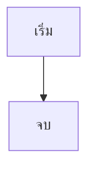
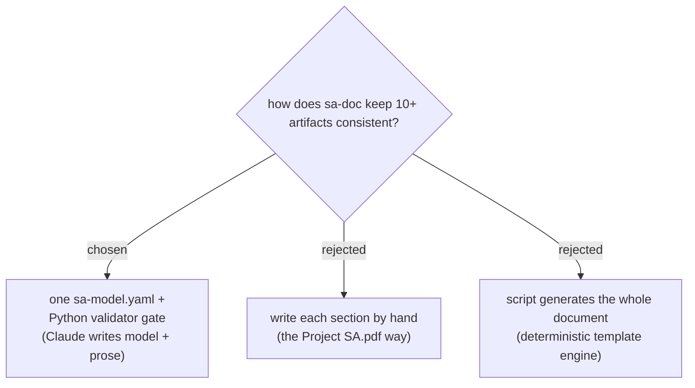

# sa-doc Skill Implementation Plan

> **For agentic workers:** REQUIRED SUB-SKILL: Use superpowers:subagent-driven-development (recommended) or superpowers:executing-plans to implement this plan task-by-task. Steps use checkbox (`- [ ]`) syntax for tracking.

**Goal:** Ship the `sa-doc` skill in dev-workflows: generate a complete SA&D document (Markdown canonical, PDF optional) from a single validated `sa-model.yaml`, per spec `docs/superpowers/specs/2026-07-06-sa-doc-skill-design.md`.

**Architecture:** Claude authors the model and the prose; `validate_model.py` (Python, PyYAML) blocks generation until the model is referentially consistent; `render_doc.py` turns the Markdown into one self-contained HTML (marked.js + mermaid.js) and prints it to PDF with headless Edge/Chrome. Templates and the model contract live as skill references; scripts live at plugin level like `daily-state.py`.

**Tech Stack:** Python 3.10+ (PyYAML for the validator, stdlib only for the renderer), marked.js + mermaid.js via CDN (offline override flags), headless Edge/Chrome for PDF, Markdown/Mermaid output.

## Global Constraints

- **Harness-neutral SKILL.md** (Claude Code + Antigravity): name actions, never one harness's tool; `${CLAUDE_PLUGIN_ROOT}` only in the three rewritable shapes `/references/…`, `/scripts/…`, `/skills/…`; a skill's own files referenced skill-relative (`references/x.md`).
- **Versions in sync:** `plugins/dev-workflows/.claude-plugin/plugin.json` and the dev-workflows entry in `.claude-plugin/marketplace.json` must end at the **same** version. They are currently **out of sync** (plugin.json `0.21.0`, marketplace `0.20.2`) — Task 9 sets both to `0.22.0`.
- **Every new skill adds one PLAYBOOK.md row in the same commit** (Task 9).
- **Diagram convention:** generated docs open with one Mermaid overview diagram; canonical wording changes only in `plugins/dev-workflows/references/diagram-convention.md`; ADRs open with a small decision diagram.
- **Windows/PowerShell is the primary environment**; scripts must also run on POSIX (no shell=True, use `pathlib`).
- Commit messages end with `Co-Authored-By: Claude Fable 5 <noreply@anthropic.com>`.
- Repo test convention: plain-Python test files beside the script (`plugins/dev-workflows/scripts/test_daily_state.py` pattern), runnable with `python <file>` — no pytest dependency.

**Spec deviations (agreed refinements, record here so the spec stays honest):**
1. Scripts live at `plugins/dev-workflows/scripts/` (repo convention, like `daily-state.py`) — the spec drafted them under the skill folder.
2. PDF render waits via Chromium's `--virtual-time-budget` flag instead of the spec's document.title polling (simpler, built-in).
3. `use_cases[].objectives` (optional list) added to the model contract so validator rule W1 can check objectives→use-case coverage.

---

### Task 1: Model contract reference — `model-contract.md`

**Files:**
- Create: `plugins/dev-workflows/skills/sa-doc/references/model-contract.md`

**Interfaces:**
- Produces: the canonical `sa-model.yaml` schema. Tasks 2–5 implement the validator against exactly these section names, field names, and id conventions. Tasks 7–8 reference this file by skill-relative path `references/model-contract.md`.

- [ ] **Step 1: Write the contract file**

Write `plugins/dev-workflows/skills/sa-doc/references/model-contract.md` with exactly this content:

````markdown
# sa-model.yaml — the sa-doc model contract

The single source of truth for a generated SA&D document. Every section of the
document is derived from this file; prose may explain but never introduce
actors, use cases, entities, fields, or states that are not in the model.
This file is the only place the schema is defined.

## Conventions

- Every object carries a stable `id`. Prefixes: `P`/`O`/`B` (problem/objective/
  benefit), `ACT`, `UC`, `ENT`, `SCR`, `NFR`, `SEC` — e.g. `UC-ORDER`, `ENT-PRODUCT`.
- Cross-references use ids only, never names.
- `TBD` (case-insensitive) is a legal value for any leaf. TBDs are inventoried
  by the validator and surfaced in the final summary — never silently invented.
- Language of `name`/`text` values follows the document language.

## Schema

```yaml
meta:
  project: string            # short slug used in file names
  org: string
  language: th | en          # document language
  profile: academic | professional
  authors: [string]
  date: YYYY-MM-DD

problem:
  current_problems: [ {id: P1, text} ]
  objectives:       [ {id: O1, text, problems: [P1]} ]     # which problems it answers
  benefits:         [ {id: B1, text, objectives: [O1]} ]

actors: [ {id: ACT-X, name, desc} ]

scope:                       # every capability MUST point at >= 1 use case (E2)
  - {actor: ACT-X, capability: string, use_cases: [UC-X]}

use_cases:
  - id: UC-X
    name: string
    actors: [ACT-X]                       # must exist (E1)
    objectives: [O1]                      # optional; W1 checks coverage
    preconditions: [string]
    postconditions: [string]              # guaranteed state AFTER success —
                                          # never a trigger like "user clicks save" (W4)
    main_flow:
      - {step: 1, actor: ACT-X, action: string, system_response: string,
         fields: [ENT-X.field]}           # optional machine-checkable refs (E4)
    extensions:
      - {at_step: 3, condition: string, flow: string, fields: []}
    special_reqs: [string]                # only real ones; empty list is fine
    entities: [ENT-X]                     # entities this use case touches
    screens: [SCR-X]

entities:
  - id: ENT-X
    name: string
    fields:
      - {name: string, type: string, size: int, desc: string,
         pk: true,                        # optional
         fk: ENT-Y.field,                 # optional; target must exist (E3)
         sample: string}                  # optional; W6 checks sample vs size

states:                                   # one group per stateful entity field
  - entity: ENT-X
    field: status                         # must exist on the entity (E5)
    states: [string]                      # field type must be able to hold them (E5)
    transitions: [ {from, to, trigger, uc: UC-X} ]

nfrs: [ {id: NFR-X, category, requirement, metric} ]

security: [ {id: SEC-X, concern, control} ]   # REQUIRED non-empty when profile=professional (E8)

architecture:
  style: string                           # e.g. web client-server
  components: [ {name, responsibility} ]
  deployment: string

screens: [ {id: SCR-X, name, use_cases: [UC-X]} ]

# academic profile extras
plan:
  phases: [ {name, from: YYYY-MM, to: YYYY-MM} ]   # contiguous + ordered (E7)
budget: [ {item, category, amount} ]
literature: [ {topic, source, relevance} ]
```

## Validation

`${CLAUDE_PLUGIN_ROOT}/scripts/validate_model.py <path>` — exit 0 clean,
exit 1 on errors. Errors block generation; warnings must be fixed or
explicitly accepted by the user; TBDs are reported, never invented away.
````

- [ ] **Step 2: Commit**

```bash
git add "plugins/dev-workflows/skills/sa-doc/references/model-contract.md"
git commit -m "feat(sa-doc): model contract — sa-model.yaml schema

Co-Authored-By: Claude Fable 5 <noreply@anthropic.com>"
```

---

### Task 2: Validator core — loader, Report, E1/E2/E6, CLI

**Files:**
- Create: `plugins/dev-workflows/scripts/validate_model.py`
- Create: `plugins/dev-workflows/scripts/test_sa_model_validator.py`

**Interfaces:**
- Produces (used by Tasks 3–5):
  - `load_model(path: str) -> dict`
  - `validate(model: dict) -> Report`
  - `Report` with `.errors: list[tuple[str, str]]`, `.warnings: list[tuple[str, str]]`, `.tbds: list[str]`, `.ok: bool` (True iff no errors)
  - test helper `base_model() -> dict` in the test file
  - CLI: `python validate_model.py <path>` → exit 0/1, human-readable report

- [ ] **Step 1: Write the failing tests**

Create `plugins/dev-workflows/scripts/test_sa_model_validator.py`:

```python
#!/usr/bin/env python3
"""Tests for validate_model.py. Run: python test_sa_model_validator.py"""
import copy
import sys

from validate_model import validate


def base_model():
    """Smallest fully-valid model (bookstore subset)."""
    return {
        "meta": {"project": "bookstore", "org": "Codex", "language": "th",
                 "profile": "academic", "authors": ["Pon"], "date": "2026-07-06"},
        "problem": {
            "current_problems": [{"id": "P1", "text": "ลูกค้าไม่รู้ว่ามีสินค้าไหม"}],
            "objectives": [{"id": "O1", "text": "แสดงสต็อกจริง", "problems": ["P1"]}],
            "benefits": [{"id": "B1", "text": "ขายได้มากขึ้น", "objectives": ["O1"]}],
        },
        "actors": [{"id": "ACT-CUST", "name": "ลูกค้า", "desc": "ผู้ซื้อ"},
                   {"id": "ACT-SALE", "name": "พนักงานขาย", "desc": "ผู้ขาย"}],
        "scope": [{"actor": "ACT-CUST", "capability": "สั่งซื้อสินค้า",
                   "use_cases": ["UC-ORDER"]}],
        "use_cases": [{
            "id": "UC-ORDER", "name": "สั่งซื้อสินค้า",
            "actors": ["ACT-CUST"], "objectives": ["O1"],
            "preconditions": ["ล็อกอินแล้ว"],
            "postconditions": ["ใบสั่งซื้อถูกบันทึกและสต็อกถูกจอง"],
            "main_flow": [{"step": 1, "actor": "ACT-CUST",
                           "action": "เพิ่มสินค้าลงตะกร้า",
                           "system_response": "แสดงตะกร้า",
                           "fields": ["ENT-PRODUCT.stock_qty"]}],
            "extensions": [{"at_step": 1, "condition": "สินค้าหมด",
                            "flow": "ระบบแจ้งว่าหมดและเสนอสินค้าใกล้เคียง",
                            "fields": []}],
            "special_reqs": [], "entities": ["ENT-PRODUCT", "ENT-ORDER"],
            "screens": ["SCR-CART"],
        }],
        "entities": [
            {"id": "ENT-PRODUCT", "name": "สินค้า", "fields": [
                {"name": "product_id", "type": "string", "size": 20,
                 "desc": "รหัสสินค้า", "pk": True},
                {"name": "stock_qty", "type": "integer", "size": 10,
                 "desc": "จำนวนคงเหลือ"}]},
            {"id": "ENT-ORDER", "name": "ใบสั่งซื้อ", "fields": [
                {"name": "order_id", "type": "string", "size": 20,
                 "desc": "เลขใบสั่งซื้อ", "pk": True},
                {"name": "product_id", "type": "string", "size": 20,
                 "desc": "สินค้า", "fk": "ENT-PRODUCT.product_id"},
                {"name": "order_status", "type": "string", "size": 20,
                 "desc": "สถานะ"}]},
        ],
        "states": [{"entity": "ENT-ORDER", "field": "order_status",
                    "states": ["awaiting_payment", "paid", "shipped"],
                    "transitions": [{"from": "awaiting_payment", "to": "paid",
                                     "trigger": "ยืนยันชำระเงิน", "uc": "UC-ORDER"}]}],
        "nfrs": [{"id": "NFR-1", "category": "performance",
                  "requirement": "หน้า login ตอบสนอง", "metric": "<= 3 วินาที"}],
        "security": [],
        "architecture": {"style": "web client-server",
                         "components": [{"name": "web", "responsibility": "UI"}],
                         "deployment": "single VM"},
        "screens": [{"id": "SCR-CART", "name": "ตะกร้าสินค้า",
                     "use_cases": ["UC-ORDER"]}],
        "plan": {"phases": [{"name": "วิเคราะห์", "from": "2026-07", "to": "2026-08"},
                            {"name": "ออกแบบ", "from": "2026-09", "to": "2026-10"}]},
        "budget": [{"item": "Server", "category": "hardware", "amount": 20000}],
        "literature": [{"topic": "payment gateway", "source": "ธนาคารกรุงเทพ",
                        "relevance": "ช่องทางชำระเงิน"}],
    }


def mutate(**overrides):
    m = copy.deepcopy(base_model())
    m.update(overrides)
    return m


def test_clean_model_passes():
    r = validate(base_model())
    assert r.ok, f"clean model must pass, got errors: {r.errors}"


def test_e1_unknown_actor_in_use_case():
    m = base_model()
    m["use_cases"][0]["actors"] = ["ACT-GHOST"]
    r = validate(m)
    assert any(rule == "E1" for rule, _ in r.errors), r.errors


def test_e1_unknown_actor_in_scope():
    m = base_model()
    m["scope"][0]["actor"] = "ACT-GHOST"
    r = validate(m)
    assert any(rule == "E1" for rule, _ in r.errors), r.errors


def test_e2_scope_without_use_case():
    m = base_model()
    m["scope"].append({"actor": "ACT-CUST", "capability": "ตั้งกระทู้",
                       "use_cases": []})
    r = validate(m)
    assert any(rule == "E2" for rule, _ in r.errors), r.errors


def test_e2_scope_dangling_use_case():
    m = base_model()
    m["scope"][0]["use_cases"] = ["UC-GHOST"]
    r = validate(m)
    assert any(rule == "E2" for rule, _ in r.errors), r.errors


def test_e6_duplicate_ids():
    m = base_model()
    m["actors"].append({"id": "ACT-CUST", "name": "ซ้ำ", "desc": "ซ้ำ"})
    r = validate(m)
    assert any(rule == "E6" for rule, _ in r.errors), r.errors


TESTS = [v for k, v in sorted(globals().items()) if k.startswith("test_")]

if __name__ == "__main__":
    failed = 0
    for t in TESTS:
        try:
            t()
            print(f"PASS  {t.__name__}")
        except AssertionError as e:
            failed += 1
            print(f"FAIL  {t.__name__}: {e}")
    print(f"{len(TESTS) - failed}/{len(TESTS)} passed")
    sys.exit(1 if failed else 0)
```

- [ ] **Step 2: Run tests to verify they fail**

Run (from repo root):
```powershell
python "plugins/dev-workflows/scripts/test_sa_model_validator.py"
```
Expected: `ModuleNotFoundError: No module named 'validate_model'` (or ImportError).

- [ ] **Step 3: Write the validator core**

Create `plugins/dev-workflows/scripts/validate_model.py`:

```python
#!/usr/bin/env python3
"""validate_model.py — referential-integrity gate for sa-doc's sa-model.yaml.

Usage: python validate_model.py <path-to-sa-model.yaml>
Exit codes: 0 = clean (warnings allowed), 1 = errors, 2 = cannot run.
Every rule exists because the reviewed Project SA.pdf failed it.
"""
import sys

try:
    import yaml
except ImportError:  # pragma: no cover
    print("ERROR: PyYAML is required. Install with: pip install pyyaml")
    sys.exit(2)


class Report:
    def __init__(self):
        self.errors = []    # list[(rule, message)]
        self.warnings = []  # list[(rule, message)]
        self.tbds = []      # list[path-string]

    def error(self, rule, msg):
        self.errors.append((rule, msg))

    def warn(self, rule, msg):
        self.warnings.append((rule, msg))

    @property
    def ok(self):
        return not self.errors


def load_model(path):
    with open(path, encoding="utf-8") as f:
        return yaml.safe_load(f)


def _ids(items):
    return [i.get("id") for i in (items or [])]


def _check_duplicate_ids(model, report):
    """E6 — id uniqueness across every id-carrying list."""
    sections = {
        "actors": model.get("actors"),
        "use_cases": model.get("use_cases"),
        "entities": model.get("entities"),
        "screens": model.get("screens"),
        "nfrs": model.get("nfrs"),
        "security": model.get("security"),
        "problem.current_problems": (model.get("problem") or {}).get("current_problems"),
        "problem.objectives": (model.get("problem") or {}).get("objectives"),
        "problem.benefits": (model.get("problem") or {}).get("benefits"),
    }
    for name, items in sections.items():
        ids = _ids(items)
        for dup in sorted({i for i in ids if i and ids.count(i) > 1}):
            report.error("E6", f"duplicate id '{dup}' in {name}")


def _check_actor_refs(model, actors, report):
    """E1 — every referenced actor exists."""
    for uc in model.get("use_cases") or []:
        for a in uc.get("actors") or []:
            if a not in actors:
                report.error("E1", f"{uc.get('id')} references unknown actor '{a}'")
        for step in uc.get("main_flow") or []:
            a = step.get("actor")
            if a and a not in actors:
                report.error("E1", f"{uc.get('id')} step {step.get('step')} "
                                   f"references unknown actor '{a}'")
    for sc in model.get("scope") or []:
        if sc.get("actor") not in actors:
            report.error("E1", f"scope '{sc.get('capability')}' references "
                               f"unknown actor '{sc.get('actor')}'")


def _check_scope_use_cases(model, use_cases, report):
    """E2 — every scope capability lists >= 1 existing use case."""
    for sc in model.get("scope") or []:
        refs = sc.get("use_cases") or []
        cap = sc.get("capability")
        if not refs:
            report.error("E2", f"scope capability '{cap}' lists no use case")
        for u in refs:
            if u not in use_cases:
                report.error("E2", f"scope capability '{cap}' references "
                                   f"unknown use case '{u}'")


def validate(model):
    report = Report()
    actors = {a.get("id") for a in model.get("actors") or []}
    use_cases = {u.get("id") for u in model.get("use_cases") or []}
    _check_duplicate_ids(model, report)
    _check_actor_refs(model, actors, report)
    _check_scope_use_cases(model, use_cases, report)
    return report


def print_report(report):
    for rule, msg in report.errors:
        print(f"ERROR   {rule}: {msg}")
    for rule, msg in report.warnings:
        print(f"WARNING {rule}: {msg}")
    if report.tbds:
        print(f"TBD ({len(report.tbds)}):")
        for path in report.tbds:
            print(f"  - {path}")
    print(f"{len(report.errors)} error(s), {len(report.warnings)} warning(s), "
          f"{len(report.tbds)} TBD(s)")


def main(argv):
    if len(argv) != 2:
        print(__doc__)
        return 2
    report = validate(load_model(argv[1]))
    print_report(report)
    return 0 if report.ok else 1


if __name__ == "__main__":
    sys.exit(main(sys.argv))
```

- [ ] **Step 4: Run tests to verify they pass**

Run:
```powershell
python "plugins/dev-workflows/scripts/test_sa_model_validator.py"
```
Expected: `7/7 passed`, exit 0. (If PyYAML is missing: `pip install pyyaml` first — the import in `validate_model.py` needs it even though tests pass dicts directly.)

- [ ] **Step 5: Commit**

```bash
git add "plugins/dev-workflows/scripts/validate_model.py" "plugins/dev-workflows/scripts/test_sa_model_validator.py"
git commit -m "feat(sa-doc): validator core - E1 actor refs, E2 scope coverage, E6 id uniqueness

Co-Authored-By: Claude Fable 5 <noreply@anthropic.com>"
```

---

### Task 3: Validator structural rules — E3/E4/E5/E7/E8

**Files:**
- Modify: `plugins/dev-workflows/scripts/validate_model.py`
- Modify: `plugins/dev-workflows/scripts/test_sa_model_validator.py`

**Interfaces:**
- Consumes: `validate(model) -> Report`, `base_model()` from Task 2.
- Produces: rules E3 (fk targets), E4 (step field refs), E5 (states storable + transition ucs), E7 (plan months contiguous), E8 (professional ⇒ security non-empty). Same `Report` API — no signature changes.

- [ ] **Step 1: Add the failing tests**

Append to `test_sa_model_validator.py` (above the `TESTS =` line):

```python
def test_e3_fk_targets_missing_field():
    m = base_model()
    m["entities"][1]["fields"].append(
        {"name": "payment_id", "type": "string", "size": 20,
         "desc": "การชำระเงิน", "fk": "ENT-PAYMENT.payment_id"})
    r = validate(m)
    assert any(rule == "E3" for rule, _ in r.errors), r.errors


def test_e4_step_field_not_on_entities():
    m = base_model()
    m["use_cases"][0]["main_flow"][0]["fields"] = ["ENT-PRODUCT.ghost_field"]
    r = validate(m)
    assert any(rule == "E4" for rule, _ in r.errors), r.errors


def test_e5_boolean_field_cannot_hold_three_states():
    m = base_model()
    m["entities"][1]["fields"][2]["type"] = "boolean"
    r = validate(m)
    assert any(rule == "E5" for rule, _ in r.errors), r.errors


def test_e5_states_field_missing():
    m = base_model()
    m["states"][0]["field"] = "ghost_status"
    r = validate(m)
    assert any(rule == "E5" for rule, _ in r.errors), r.errors


def test_e5_transition_unknown_uc():
    m = base_model()
    m["states"][0]["transitions"][0]["uc"] = "UC-GHOST"
    r = validate(m)
    assert any(rule == "E5" for rule, _ in r.errors), r.errors


def test_e7_plan_months_not_contiguous():
    m = base_model()
    m["plan"]["phases"][1]["from"] = "2026-11"   # gap: Aug -> Nov
    r = validate(m)
    assert any(rule == "E7" for rule, _ in r.errors), r.errors


def test_e8_professional_requires_security():
    m = base_model()
    m["meta"]["profile"] = "professional"
    m["security"] = []
    r = validate(m)
    assert any(rule == "E8" for rule, _ in r.errors), r.errors
```

- [ ] **Step 2: Run tests to verify the new ones fail**

Run:
```powershell
python "plugins/dev-workflows/scripts/test_sa_model_validator.py"
```
Expected: 7 previous PASS, the 7 new tests FAIL (no E3/E4/E5/E7/E8 emitted yet).

- [ ] **Step 3: Implement the rules**

In `validate_model.py`, add below `_check_scope_use_cases`:

```python
BOOL_TYPES = {"bool", "boolean", "bit"}


def _fields_by_entity(model):
    return {e.get("id"): {f.get("name") for f in e.get("fields") or []}
            for e in model.get("entities") or []}


def _check_fk_targets(model, report):
    """E3 — every fk targets an existing entity.field."""
    fields = _fields_by_entity(model)
    for ent in model.get("entities") or []:
        for f in ent.get("fields") or []:
            fk = f.get("fk")
            if not fk:
                continue
            target_entity, _, target_field = str(fk).partition(".")
            if target_entity not in fields or target_field not in fields[target_entity]:
                report.error("E3", f"{ent.get('id')}.{f.get('name')} fk '{fk}' "
                                   f"targets a non-existent field")


def _check_step_field_refs(model, report):
    """E4 — step field refs exist on the use case's entities."""
    fields = _fields_by_entity(model)
    for uc in model.get("use_cases") or []:
        allowed = set()
        for eid in uc.get("entities") or []:
            allowed |= {f"{eid}.{name}" for name in fields.get(eid, set())}
        steps = (uc.get("main_flow") or []) + (uc.get("extensions") or [])
        for step in steps:
            for ref in step.get("fields") or []:
                if ref not in allowed:
                    report.error("E4", f"{uc.get('id')} references '{ref}' which "
                                       f"is not on its entities")


def _check_states(model, entities, use_cases, report):
    """E5 — state groups are storable and transitions reference real use cases."""
    for group in model.get("states") or []:
        eid, fname = group.get("entity"), group.get("field")
        ent = entities.get(eid)
        if ent is None:
            report.error("E5", f"states group references unknown entity '{eid}'")
            continue
        field = next((f for f in ent.get("fields") or []
                      if f.get("name") == fname), None)
        if field is None:
            report.error("E5", f"states group for {eid} names missing field '{fname}'")
            continue
        n_states = len(group.get("states") or [])
        if str(field.get("type", "")).lower() in BOOL_TYPES and n_states > 2:
            report.error("E5", f"{eid}.{fname} is boolean but must hold "
                               f"{n_states} states")
        for t in group.get("transitions") or []:
            uc = t.get("uc")
            if uc and uc not in use_cases:
                report.error("E5", f"transition {t.get('from')}->{t.get('to')} "
                                   f"references unknown use case '{uc}'")


def _month_index(ym):
    year, _, month = str(ym).partition("-")
    return int(year) * 12 + int(month)


def _check_plan(model, report):
    """E7 — plan phases: from <= to, ordered, no gap between phases."""
    phases = (model.get("plan") or {}).get("phases") or []
    prev_to = None
    for ph in phases:
        try:
            start, end = _month_index(ph.get("from")), _month_index(ph.get("to"))
        except (ValueError, TypeError):
            report.error("E7", f"phase '{ph.get('name')}' has a malformed month")
            continue
        if start > end:
            report.error("E7", f"phase '{ph.get('name')}' starts after it ends")
        if prev_to is not None and start > prev_to + 1:
            report.error("E7", f"phase '{ph.get('name')}' leaves a gap in the plan")
        if prev_to is not None and start < prev_to - 12:
            report.error("E7", f"phase '{ph.get('name')}' jumps backwards")
        prev_to = max(end, prev_to) if prev_to is not None else end


def _check_profile(model, report):
    """E8 — professional profile requires a non-empty security section."""
    profile = (model.get("meta") or {}).get("profile")
    if profile == "professional" and not model.get("security"):
        report.error("E8", "profile=professional requires a non-empty "
                           "security section")
```

Then extend `validate()` to (full replacement of the function):

```python
def validate(model):
    report = Report()
    actors = {a.get("id") for a in model.get("actors") or []}
    use_cases = {u.get("id") for u in model.get("use_cases") or []}
    entities = {e.get("id"): e for e in model.get("entities") or []}
    _check_duplicate_ids(model, report)
    _check_actor_refs(model, actors, report)
    _check_scope_use_cases(model, use_cases, report)
    _check_fk_targets(model, report)
    _check_step_field_refs(model, report)
    _check_states(model, entities, use_cases, report)
    _check_plan(model, report)
    _check_profile(model, report)
    return report
```

- [ ] **Step 4: Run tests to verify they pass**

Run:
```powershell
python "plugins/dev-workflows/scripts/test_sa_model_validator.py"
```
Expected: `14/14 passed`, exit 0.

- [ ] **Step 5: Commit**

```bash
git add "plugins/dev-workflows/scripts/validate_model.py" "plugins/dev-workflows/scripts/test_sa_model_validator.py"
git commit -m "feat(sa-doc): validator structural rules - fk targets, step refs, states, plan, profile

Co-Authored-By: Claude Fable 5 <noreply@anthropic.com>"
```

---

### Task 4: Validator warnings W1–W6 + TBD inventory

**Files:**
- Modify: `plugins/dev-workflows/scripts/validate_model.py`
- Modify: `plugins/dev-workflows/scripts/test_sa_model_validator.py`

**Interfaces:**
- Consumes: `validate(model) -> Report` from Tasks 2–3.
- Produces: warnings W1–W6 on `Report.warnings`; `Report.tbds` populated; CLI unchanged.

- [ ] **Step 1: Add the failing tests**

Append to `test_sa_model_validator.py` (above the `TESTS =` line):

```python
def test_w1_use_case_without_scope_and_objective_without_uc():
    m = base_model()
    m["use_cases"].append({
        "id": "UC-ORPHAN", "name": "ลอย", "actors": ["ACT-SALE"],
        "preconditions": [], "postconditions": ["x"], "main_flow": [],
        "extensions": [], "special_reqs": [], "entities": [], "screens": []})
    m["problem"]["objectives"].append({"id": "O2", "text": "ไม่มีใครทำ",
                                       "problems": ["P1"]})
    r = validate(m)
    w = [rule for rule, _ in r.warnings]
    assert w.count("W1") >= 2, r.warnings


def test_w2_screen_coverage():
    m = base_model()
    m["screens"].append({"id": "SCR-ORPHAN", "name": "จอลอย", "use_cases": []})
    r = validate(m)
    assert any(rule == "W2" for rule, _ in r.warnings), r.warnings


def test_w3_money_types_inconsistent():
    m = base_model()
    m["entities"][0]["fields"].append({"name": "unit_price", "type": "integer",
                                       "size": 10, "desc": "ราคา"})
    m["entities"][1]["fields"].append({"name": "total_price", "type": "decimal",
                                       "size": 9, "desc": "ราคารวม"})
    r = validate(m)
    assert any(rule == "W3" for rule, _ in r.warnings), r.warnings


def test_w4_trigger_shaped_postcondition():
    m = base_model()
    m["use_cases"][0]["postconditions"] = ["กดปุ่มยืนยันการแก้ไขข้อมูล"]
    r = validate(m)
    assert any(rule == "W4" for rule, _ in r.warnings), r.warnings


def test_w5_copy_pasted_extensions():
    m = base_model()
    boiler = "ระบบขัดข้อง ให้ restart เครื่องแล้วเริ่มใหม่"
    for i in range(3):
        m["use_cases"].append({
            "id": f"UC-C{i}", "name": f"c{i}", "actors": ["ACT-SALE"],
            "preconditions": [], "postconditions": ["x"], "main_flow": [],
            "extensions": [{"at_step": 1, "condition": "ขัดข้อง",
                            "flow": boiler, "fields": []}],
            "special_reqs": [], "entities": [], "screens": []})
    r = validate(m)
    assert any(rule == "W5" for rule, _ in r.warnings), r.warnings


def test_w6_sample_exceeds_size_and_empty_entity():
    m = base_model()
    m["entities"][0]["fields"][0]["sample"] = "ศาสตร์การปฏิญาณเพื่อการบำบัดรักษา33"
    m["entities"].append({"id": "ENT-EMPTY", "name": "ว่าง", "fields": []})
    r = validate(m)
    w = [rule for rule, _ in r.warnings]
    assert w.count("W6") >= 2, r.warnings


def test_tbd_inventory():
    m = base_model()
    m["architecture"]["deployment"] = "TBD"
    r = validate(m)
    assert any("deployment" in p for p in r.tbds), r.tbds
```

- [ ] **Step 2: Run tests to verify the new ones fail**

Run:
```powershell
python "plugins/dev-workflows/scripts/test_sa_model_validator.py"
```
Expected: 14 previous PASS, the 7 new FAIL.

- [ ] **Step 3: Implement warnings and TBD collection**

In `validate_model.py`, add below `_check_profile`:

```python
MONEY_HINTS = ("amount", "price", "total", "cost", "salary")
TRIGGER_PREFIXES = ("กด", "คลิก", "ป้อน", "click", "press", "enter", "select")


def _check_coverage(model, report):
    """W1 — orphan use cases / uncovered objectives. W2 — screen coverage."""
    scoped = {u for sc in model.get("scope") or [] for u in sc.get("use_cases") or []}
    covered_objectives = {o for uc in model.get("use_cases") or []
                          for o in uc.get("objectives") or []}
    screens_with_uc = {s.get("id") for s in model.get("screens") or []
                       if s.get("use_cases")}
    ucs_with_screen = {u for s in model.get("screens") or []
                       for u in s.get("use_cases") or []}
    for uc in model.get("use_cases") or []:
        if uc.get("id") not in scoped:
            report.warn("W1", f"{uc.get('id')} has no scope capability pointing at it")
        if uc.get("id") not in ucs_with_screen and not uc.get("screens"):
            report.warn("W2", f"{uc.get('id')} has no screen")
    for obj in (model.get("problem") or {}).get("objectives") or []:
        if obj.get("id") not in covered_objectives:
            report.warn("W1", f"objective {obj.get('id')} has no use case")
    for s in model.get("screens") or []:
        if s.get("id") not in screens_with_uc:
            report.warn("W2", f"screen {s.get('id')} is linked to no use case")


def _check_money_types(model, report):
    """W3 — money-hinted fields must share one type."""
    seen = {}
    for ent in model.get("entities") or []:
        for f in ent.get("fields") or []:
            name = str(f.get("name", "")).lower()
            if any(h in name for h in MONEY_HINTS):
                seen[f"{ent.get('id')}.{f.get('name')}"] = str(f.get("type", "")).lower()
    if len(set(seen.values())) > 1:
        detail = ", ".join(f"{k}:{v}" for k, v in sorted(seen.items()))
        report.warn("W3", f"money fields use inconsistent types ({detail})")


def _check_postconditions(model, report):
    """W4 — postconditions must be guarantees, not triggers."""
    for uc in model.get("use_cases") or []:
        posts = uc.get("postconditions") or []
        if not posts:
            report.warn("W4", f"{uc.get('id')} has no postcondition")
        for p in posts:
            if str(p).strip().lower().startswith(TRIGGER_PREFIXES):
                report.warn("W4", f"{uc.get('id')} postcondition '{p}' is a "
                                  f"trigger, not a guaranteed state")


def _check_copy_paste(model, report):
    """W5 — identical extension text across >= 3 use cases."""
    seen = {}
    for uc in model.get("use_cases") or []:
        for ext in uc.get("extensions") or []:
            key = str(ext.get("flow", "")).strip()
            if key:
                seen.setdefault(key, set()).add(uc.get("id"))
    for text, ucs in seen.items():
        if len(ucs) >= 3:
            report.warn("W5", f"extension text repeated in {len(ucs)} use cases "
                              f"({', '.join(sorted(ucs))}): '{text[:60]}...'")


def _check_field_shapes(model, report):
    """W6 — empty entities; sample values exceeding declared size."""
    for ent in model.get("entities") or []:
        if not ent.get("fields"):
            report.warn("W6", f"entity {ent.get('id')} has zero fields")
        for f in ent.get("fields") or []:
            sample, size = f.get("sample"), f.get("size")
            if (sample and size and "string" in str(f.get("type", "")).lower()
                    and len(str(sample)) > int(size)):
                report.warn("W6", f"{ent.get('id')}.{f.get('name')} sample is "
                                  f"{len(str(sample))} chars but size is {size}")


def _collect_tbds(node, path, out):
    if isinstance(node, dict):
        for k, v in node.items():
            _collect_tbds(v, f"{path}.{k}" if path else str(k), out)
    elif isinstance(node, list):
        for i, v in enumerate(node):
            _collect_tbds(v, f"{path}[{i}]", out)
    elif isinstance(node, str) and node.strip().lower() == "tbd":
        out.append(path)
```

Note for the implementer: `str.startswith` accepts a tuple, and
`TRIGGER_PREFIXES` mixes Thai and lowercase-English prefixes — the value being
checked is lowercased first, which does not affect the Thai prefixes.

Extend `validate()` — insert before `return report`:

```python
    _check_coverage(model, report)
    _check_money_types(model, report)
    _check_postconditions(model, report)
    _check_copy_paste(model, report)
    _check_field_shapes(model, report)
    _collect_tbds(model, "", report.tbds)
```

- [ ] **Step 4: Run tests to verify they pass**

Run:
```powershell
python "plugins/dev-workflows/scripts/test_sa_model_validator.py"
```
Expected: `21/21 passed`, exit 0. (`test_clean_model_passes` still passes because warnings do not affect `Report.ok`.)

- [ ] **Step 5: Commit**

```bash
git add "plugins/dev-workflows/scripts/validate_model.py" "plugins/dev-workflows/scripts/test_sa_model_validator.py"
git commit -m "feat(sa-doc): validator warnings - coverage, money types, postconditions, copy-paste, field shapes, TBD inventory

Co-Authored-By: Claude Fable 5 <noreply@anthropic.com>"
```

---

### Task 5: Bookstore fixture + seeded-defect regression test

**Files:**
- Create: `plugins/dev-workflows/scripts/fixtures/sa-model-bookstore.yaml`
- Modify: `plugins/dev-workflows/scripts/test_sa_model_validator.py`

**Interfaces:**
- Consumes: `load_model`, `validate` from Tasks 2–4.
- Produces: a clean on-disk fixture (also the example model for the skill) and a regression test proving the validator catches the five signature defects from the Project SA.pdf review.

- [ ] **Step 1: Write the fixture**

Create `plugins/dev-workflows/scripts/fixtures/sa-model-bookstore.yaml`. It is the
`base_model()` dict from Task 2 expressed as YAML, **extended** with the pieces
the seeded-defect test needs — a payment entity, a delivery status, and a forum
use case (the capability the original document forgot). Full content:

```yaml
meta:
  project: bookstore
  org: Codex
  language: th
  profile: academic
  authors: [Pon]
  date: "2026-07-06"

problem:
  current_problems:
    - {id: P1, text: ลูกค้าไม่ทราบว่ามีสินค้าหรือไม่}
    - {id: P2, text: ค้นหาหนังสือได้ยาก}
  objectives:
    - {id: O1, text: แสดงสต็อกจริงบนเว็บ, problems: [P1]}
    - {id: O2, text: ค้นหาสินค้าออนไลน์ได้, problems: [P2]}
  benefits:
    - {id: B1, text: ยอดขายเพิ่มขึ้น, objectives: [O1, O2]}

actors:
  - {id: ACT-CUST, name: ลูกค้า, desc: ผู้ซื้อหนังสือ}
  - {id: ACT-SALE, name: พนักงานขาย, desc: ดูแลคำสั่งซื้อ}
  - {id: ACT-MGR, name: ผู้จัดการ, desc: ยืนยันการชำระเงิน}
  - {id: ACT-SHIP, name: พนักงานส่งสินค้า, desc: จัดส่ง}

scope:
  - {actor: ACT-CUST, capability: สั่งซื้อสินค้า, use_cases: [UC-ORDER]}
  - {actor: ACT-CUST, capability: ตั้งกระทู้สอบถาม, use_cases: [UC-FORUM]}
  - {actor: ACT-MGR, capability: ยืนยันการชำระเงิน, use_cases: [UC-PAY]}
  - {actor: ACT-SHIP, capability: ยืนยันการส่งสินค้า, use_cases: [UC-SHIP]}

use_cases:
  - id: UC-ORDER
    name: สั่งซื้อสินค้า
    actors: [ACT-CUST]
    objectives: [O1, O2]
    preconditions: [ล็อกอินแล้ว]
    postconditions: [ใบสั่งซื้อถูกบันทึกและสต็อกถูกจอง]
    main_flow:
      - {step: 1, actor: ACT-CUST, action: เพิ่มสินค้าลงตะกร้า,
         system_response: แสดงตะกร้าและสต็อกคงเหลือ,
         fields: [ENT-PRODUCT.stock_qty]}
      - {step: 2, actor: ACT-CUST, action: ยืนยันคำสั่งซื้อ,
         system_response: สร้างใบสั่งซื้อสถานะรอชำระเงิน,
         fields: [ENT-ORDER.order_status]}
    extensions:
      - {at_step: 1, condition: สินค้าหมด,
         flow: ระบบแจ้งว่าหมดและเสนอสินค้าใกล้เคียง, fields: []}
    special_reqs: []
    entities: [ENT-PRODUCT, ENT-ORDER]
    screens: [SCR-CART]
  - id: UC-PAY
    name: ยืนยันการชำระเงิน
    actors: [ACT-MGR]
    objectives: [O1]
    preconditions: [มีใบสั่งซื้อรอชำระ]
    postconditions: [ใบสั่งซื้อเปลี่ยนเป็นสถานะชำระแล้ว]
    main_flow:
      - {step: 1, actor: ACT-MGR, action: ตรวจไฟล์อนุมัติจากธนาคาร,
         system_response: อัปเดตสถานะการชำระ,
         fields: [ENT-PAYMENT.verify_code, ENT-ORDER.order_status]}
    extensions:
      - {at_step: 1, condition: ยอดเงินไม่ตรง,
         flow: ระบบตีกลับรายการและแจ้งผู้จัดการ, fields: []}
    special_reqs: []
    entities: [ENT-PAYMENT, ENT-ORDER]
    screens: [SCR-PAY]
  - id: UC-SHIP
    name: ยืนยันการส่งสินค้า
    actors: [ACT-SHIP]
    objectives: [O1]
    preconditions: [ใบสั่งซื้อชำระแล้ว]
    postconditions: [ใบสั่งซื้อเปลี่ยนเป็นสถานะส่งแล้ว]
    main_flow:
      - {step: 1, actor: ACT-SHIP, action: บันทึกเลขพัสดุ,
         system_response: เปลี่ยนสถานะเป็นส่งแล้ว,
         fields: [ENT-ORDER.order_status]}
    extensions:
      - {at_step: 1, condition: ลูกค้าคืนสินค้า,
         flow: เปลี่ยนสถานะเป็นรับคืนและแจ้งผู้จัดการ, fields: []}
    special_reqs: []
    entities: [ENT-ORDER]
    screens: [SCR-SHIP]
  - id: UC-FORUM
    name: ตั้งกระทู้สอบถาม
    actors: [ACT-CUST]
    objectives: [O2]
    preconditions: [ล็อกอินแล้ว]
    postconditions: [กระทู้ถูกบันทึกและแสดงบนเว็บบอร์ด]
    main_flow:
      - {step: 1, actor: ACT-CUST, action: โพสต์คำถาม,
         system_response: บันทึกและแสดงกระทู้, fields: [ENT-TOPIC.title]}
    extensions: []
    special_reqs: []
    entities: [ENT-TOPIC]
    screens: [SCR-FORUM]

entities:
  - id: ENT-PRODUCT
    name: สินค้า
    fields:
      - {name: product_id, type: string, size: 20, desc: รหัสสินค้า, pk: true}
      - {name: product_name, type: string, size: 120, desc: ชื่อหนังสือ,
         sample: ศาสตร์การปฏิญาณเพื่อการบำบัดรักษา}
      - {name: unit_price, type: decimal, size: 9, desc: ราคาต่อหน่วย}
      - {name: stock_qty, type: integer, size: 10, desc: จำนวนคงเหลือ}
  - id: ENT-ORDER
    name: ใบสั่งซื้อ
    fields:
      - {name: order_id, type: string, size: 20, desc: เลขใบสั่งซื้อ, pk: true}
      - {name: product_id, type: string, size: 20, desc: สินค้า,
         fk: ENT-PRODUCT.product_id}
      - {name: total_amount, type: decimal, size: 9, desc: ยอดรวม}
      - {name: order_status, type: string, size: 20, desc: สถานะใบสั่งซื้อ}
  - id: ENT-PAYMENT
    name: การชำระเงิน
    fields:
      - {name: verify_code, type: string, size: 20, desc: รหัสอนุมัติ, pk: true}
      - {name: order_id, type: string, size: 20, desc: ใบสั่งซื้อ,
         fk: ENT-ORDER.order_id}
      - {name: amount, type: decimal, size: 9, desc: จำนวนเงิน}
  - id: ENT-TOPIC
    name: กระทู้
    fields:
      - {name: topic_id, type: string, size: 20, desc: รหัสกระทู้, pk: true}
      - {name: title, type: string, size: 200, desc: หัวข้อกระทู้}

states:
  - entity: ENT-ORDER
    field: order_status
    states: [awaiting_payment, paid, shipped, returned, cancelled]
    transitions:
      - {from: awaiting_payment, to: paid, trigger: ยืนยันชำระเงิน, uc: UC-PAY}
      - {from: paid, to: shipped, trigger: ยืนยันส่งสินค้า, uc: UC-SHIP}
      - {from: shipped, to: returned, trigger: ลูกค้าคืนสินค้า, uc: UC-SHIP}
      - {from: awaiting_payment, to: cancelled, trigger: เกิน 7 วันไม่ชำระ, uc: UC-PAY}

nfrs:
  - {id: NFR-1, category: performance, requirement: หน้า login ตอบสนอง, metric: <= 3 วินาที}
  - {id: NFR-2, category: security, requirement: ไม่เก็บ CVV ในระบบ, metric: ตรวจ schema}

security:
  - {id: SEC-1, concern: ข้อมูลบัตรเครดิต, control: ส่งต่อให้ payment gateway ไม่เก็บเอง}

architecture:
  style: web client-server
  components:
    - {name: web, responsibility: UI + ตะกร้า}
    - {name: api, responsibility: ธุรกรรมและสต็อก}
    - {name: db, responsibility: จัดเก็บข้อมูล}
  deployment: single VM + managed database

screens:
  - {id: SCR-CART, name: ตะกร้าสินค้า, use_cases: [UC-ORDER]}
  - {id: SCR-PAY, name: ยืนยันการชำระเงิน, use_cases: [UC-PAY]}
  - {id: SCR-SHIP, name: ยืนยันการส่งสินค้า, use_cases: [UC-SHIP]}
  - {id: SCR-FORUM, name: เว็บบอร์ด, use_cases: [UC-FORUM]}

plan:
  phases:
    - {name: วางแผน, from: "2026-07", to: "2026-07"}
    - {name: วิเคราะห์, from: "2026-08", to: "2026-09"}
    - {name: ออกแบบ, from: "2026-10", to: "2026-10"}
    - {name: พัฒนาและทดสอบ, from: "2026-11", to: "2026-12"}

budget:
  - {item: Server, category: hardware, amount: 20000}
  - {item: Managed DB, category: software, amount: 12000}

literature:
  - {topic: payment gateway, source: ธนาคารกรุงเทพ Merchant iPay,
     relevance: แนวทางรับชำระโดยไม่เก็บข้อมูลบัตรเอง}
```

- [ ] **Step 2: Add the seeded-defect regression test**

Append to `test_sa_model_validator.py` (above the `TESTS =` line). The five
mutations reproduce the signature defects of the reviewed `Project SA.pdf`:

```python
import os

FIXTURE = os.path.join(os.path.dirname(__file__), "fixtures",
                       "sa-model-bookstore.yaml")


def _load_fixture():
    from validate_model import load_model
    return load_model(FIXTURE)


def test_fixture_is_clean():
    r = validate(_load_fixture())
    assert r.ok, r.errors
    assert not r.warnings, r.warnings


def test_seeded_defects_are_caught():
    """Each mutation = a real defect found in the Project SA.pdf review."""
    # 1. scope capability with no use case (the forgotten forum feature)
    m = _load_fixture()
    m["scope"][1]["use_cases"] = []
    assert any(rule == "E2" for rule, _ in validate(m).errors)

    # 2. dangling FK (Order.payment_id -> field that does not exist)
    m = _load_fixture()
    m["entities"][1]["fields"].append(
        {"name": "payment_id", "type": "string", "size": 20,
         "desc": "การชำระเงิน", "fk": "ENT-PAYMENT.payment_id"})
    assert any(rule == "E3" for rule, _ in validate(m).errors)

    # 3. boolean deliver_status vs a 3+-state lifecycle
    m = _load_fixture()
    m["entities"][1]["fields"][3]["type"] = "boolean"
    assert any(rule == "E5" for rule, _ in validate(m).errors)

    # 4. identical boilerplate extension pasted across >= 3 use cases
    m = _load_fixture()
    boiler = "กรณีระบบขัดข้อง ให้ restart เครื่องคอมพิวเตอร์แล้ว login ใหม่"
    for uc in m["use_cases"][:3]:
        uc["extensions"].append({"at_step": 1, "condition": "ระบบขัดข้อง",
                                 "flow": boiler, "fields": []})
    assert any(rule == "W5" for rule, _ in validate(m).warnings)

    # 5. String(20) product name vs the 33-char sample from the review
    m = _load_fixture()
    m["entities"][0]["fields"][1]["size"] = 20
    assert any(rule == "W6" for rule, _ in validate(m).warnings)
```

- [ ] **Step 3: Run tests — fixture must be clean AND defects must be caught**

Run:
```powershell
python "plugins/dev-workflows/scripts/test_sa_model_validator.py"
```
Expected: `23/23 passed`, exit 0. If `test_fixture_is_clean` fails, fix the
fixture (not the validator) until it is warning-free.

- [ ] **Step 4: Run the CLI end-to-end on the fixture**

Run:
```powershell
python "plugins/dev-workflows/scripts/validate_model.py" "plugins/dev-workflows/scripts/fixtures/sa-model-bookstore.yaml"
```
Expected: `0 error(s), 0 warning(s), 0 TBD(s)`, exit code 0 (`$LASTEXITCODE` = 0).

- [ ] **Step 5: Commit**

```bash
git add "plugins/dev-workflows/scripts/fixtures/sa-model-bookstore.yaml" "plugins/dev-workflows/scripts/test_sa_model_validator.py"
git commit -m "feat(sa-doc): bookstore fixture + seeded-defect regression test (Project SA.pdf ground truth)

Co-Authored-By: Claude Fable 5 <noreply@anthropic.com>"
```

---

### Task 6: Renderer — `render_doc.py` (md → HTML → PDF)

**Files:**
- Create: `plugins/dev-workflows/scripts/render_doc.py`
- Create: `plugins/dev-workflows/scripts/test_render_doc.py`

**Interfaces:**
- Consumes: nothing from other tasks (input is any Markdown file).
- Produces:
  - `build_html(md_text: str, title: str, marked_js: str | None, mermaid_js: str | None) -> str` (returns full HTML; the js args are inline script bodies for offline mode, `None` = CDN)
  - `find_browser() -> str | None` (absolute path of msedge/chrome/chromium or None)
  - CLI: `python render_doc.py <input.md> [--pdf] [--out-dir DIR] [--marked-js FILE] [--mermaid-js FILE]` → writes `<stem>.html` (always) and `<stem>.pdf` (with `--pdf`, if a browser is found; otherwise prints print-it-yourself instructions and still exits 0).

- [ ] **Step 1: Write the failing tests**

Create `plugins/dev-workflows/scripts/test_render_doc.py`:

```python
#!/usr/bin/env python3
"""Tests for render_doc.py. Run: python test_render_doc.py"""
import json
import os
import sys
import tempfile

from render_doc import build_html, find_browser, main

MD = """# ตัวอย่าง



ข้อความไทยพร้อม **ตัวหนา**
"""


def test_build_html_embeds_markdown_as_json():
    html = build_html(MD, "ตัวอย่าง", None, None)
    assert json.dumps(MD) in html          # md embedded as a JS string
    assert "cdn.jsdelivr.net/npm/marked" in html
    assert "cdn.jsdelivr.net/npm/mermaid" in html
    assert "Sarabun" in html               # Thai-capable font stack
    assert "<title>ตัวอย่าง</title>" in html


def test_build_html_offline_inlines_scripts():
    html = build_html(MD, "t", "/*MARKED*/", "/*MERMAID*/")
    assert "/*MARKED*/" in html and "/*MERMAID*/" in html
    assert "cdn.jsdelivr.net" not in html


def test_cli_writes_html():
    with tempfile.TemporaryDirectory() as d:
        src = os.path.join(d, "doc.md")
        with open(src, "w", encoding="utf-8") as f:
            f.write(MD)
        rc = main([src, "--out-dir", d])
        assert rc == 0
        assert os.path.exists(os.path.join(d, "doc.html"))


def test_find_browser_returns_path_or_none():
    b = find_browser()
    assert b is None or os.path.exists(b)


TESTS = [v for k, v in sorted(globals().items()) if k.startswith("test_")]

if __name__ == "__main__":
    failed = 0
    for t in TESTS:
        try:
            t()
            print(f"PASS  {t.__name__}")
        except AssertionError as e:
            failed += 1
            print(f"FAIL  {t.__name__}: {e}")
    print(f"{len(TESTS) - failed}/{len(TESTS)} passed")
    sys.exit(1 if failed else 0)
```

- [ ] **Step 2: Run tests to verify they fail**

Run:
```powershell
python "plugins/dev-workflows/scripts/test_render_doc.py"
```
Expected: `ModuleNotFoundError: No module named 'render_doc'`.

- [ ] **Step 3: Write the renderer**

Create `plugins/dev-workflows/scripts/render_doc.py`:

```python
#!/usr/bin/env python3
"""render_doc.py — sa-doc renderer: Markdown -> self-contained HTML -> optional PDF.

Usage:
  python render_doc.py <input.md> [--pdf] [--out-dir DIR]
                       [--marked-js FILE] [--mermaid-js FILE]

The HTML renders the Markdown client-side (marked.js) and the Mermaid blocks
(mermaid.js). Default script sources are CDN; pass local files for offline use.
PDF uses headless Edge/Chrome with --virtual-time-budget so client-side
rendering finishes before printing. Missing browser degrades to HTML + advice,
never a failure.
"""
import argparse
import json
import pathlib
import shutil
import subprocess
import sys

MARKED_CDN = "https://cdn.jsdelivr.net/npm/marked/marked.min.js"
MERMAID_CDN = "https://cdn.jsdelivr.net/npm/mermaid@11/dist/mermaid.min.js"

WINDOWS_BROWSER_PATHS = [
    r"C:\Program Files (x86)\Microsoft\Edge\Application\msedge.exe",
    r"C:\Program Files\Microsoft\Edge\Application\msedge.exe",
    r"C:\Program Files\Google\Chrome\Application\chrome.exe",
    r"C:\Program Files (x86)\Google\Chrome\Application\chrome.exe",
]

CSS = """
@page { size: A4; margin: 20mm 18mm; }
body { font-family: "Sarabun", "Leelawadee UI", Tahoma, sans-serif;
       font-size: 11pt; line-height: 1.6; max-width: 180mm; margin: 0 auto;
       color: #1a1a1a; }
h1 { page-break-before: always; }
h1:first-of-type { page-break-before: avoid; }
h1, h2, h3 { line-height: 1.3; }
table { border-collapse: collapse; width: 100%; margin: 0.8em 0; }
th, td { border: 1px solid #999; padding: 4px 8px; text-align: left;
         vertical-align: top; }
th { background: #f0f0f0; }
pre { background: #f6f6f6; padding: 8px; overflow-x: auto; }
.mermaid { display: flex; justify-content: center; margin: 1em 0;
           page-break-inside: avoid; }
"""


def _script_tag(inline_body, cdn_url):
    if inline_body is not None:
        return f"<script>{inline_body}</script>"
    return f'<script src="{cdn_url}"></script>'


def build_html(md_text, title, marked_js, mermaid_js):
    return f"""<!DOCTYPE html>
<html>
<head>
<meta charset="utf-8">
<title>{title}</title>
<style>{CSS}</style>
</head>
<body>
<div id="content"></div>
{_script_tag(marked_js, MARKED_CDN)}
{_script_tag(mermaid_js, MERMAID_CDN)}
<script>
const raw = {json.dumps(md_text)};
document.getElementById("content").innerHTML = marked.parse(raw);
document.querySelectorAll("pre code.language-mermaid").forEach(code => {{
  const div = document.createElement("div");
  div.className = "mermaid";
  div.textContent = code.textContent;
  code.closest("pre").replaceWith(div);
}});
mermaid.initialize({{ startOnLoad: false, theme: "neutral" }});
mermaid.run();
</script>
</body>
</html>
"""


def find_browser():
    for name in ("msedge", "chrome", "chromium", "chromium-browser"):
        path = shutil.which(name)
        if path:
            return path
    for path in WINDOWS_BROWSER_PATHS:
        if pathlib.Path(path).exists():
            return path
    return None


def print_pdf(browser, html_path, pdf_path):
    cmd = [browser, "--headless", "--disable-gpu",
           "--no-pdf-header-footer", "--virtual-time-budget=15000",
           f"--print-to-pdf={pdf_path}", pathlib.Path(html_path).resolve().as_uri()]
    subprocess.run(cmd, check=True, capture_output=True)


def _read_optional(path):
    if path is None:
        return None
    return pathlib.Path(path).read_text(encoding="utf-8")


def main(argv):
    ap = argparse.ArgumentParser(description=__doc__)
    ap.add_argument("input")
    ap.add_argument("--pdf", action="store_true")
    ap.add_argument("--out-dir", default=None)
    ap.add_argument("--marked-js", default=None)
    ap.add_argument("--mermaid-js", default=None)
    args = ap.parse_args(argv)

    src = pathlib.Path(args.input)
    out_dir = pathlib.Path(args.out_dir) if args.out_dir else src.parent
    out_dir.mkdir(parents=True, exist_ok=True)

    md_text = src.read_text(encoding="utf-8")
    title = src.stem
    for line in md_text.splitlines():
        if line.startswith("# "):
            title = line[2:].strip()
            break

    html_path = out_dir / f"{src.stem}.html"
    html_path.write_text(
        build_html(md_text, title,
                   _read_optional(args.marked_js),
                   _read_optional(args.mermaid_js)),
        encoding="utf-8")
    print(f"HTML: {html_path}")

    if args.pdf:
        browser = find_browser()
        if browser is None:
            print("No Edge/Chrome/Chromium found - open the HTML in a browser "
                  "and print to PDF (Ctrl+P).")
        else:
            pdf_path = out_dir / f"{src.stem}.pdf"
            print_pdf(browser, html_path, pdf_path)
            print(f"PDF:  {pdf_path}")
    return 0


if __name__ == "__main__":
    sys.exit(main(sys.argv[1:]))
```

- [ ] **Step 4: Run tests to verify they pass**

Run:
```powershell
python "plugins/dev-workflows/scripts/test_render_doc.py"
```
Expected: `4/4 passed`, exit 0.

- [ ] **Step 5: Manual PDF smoke test (Windows, msedge present)**

Run:
```powershell
"# ทดสอบ`n``````mermaid`nflowchart TD`n    A[`"เริ่ม`"] --> B[`"จบ`"]`n``````" | Out-File -Encoding utf8 "$env:TEMP\sa-doc-smoke.md"
python "plugins/dev-workflows/scripts/render_doc.py" "$env:TEMP\sa-doc-smoke.md" --pdf
```
Expected output lines: `HTML: ...sa-doc-smoke.html` and `PDF:  ...sa-doc-smoke.pdf`; open the PDF and confirm the Mermaid diagram rendered (a box "เริ่ม" pointing to "จบ", not raw code). If the diagram is raw text, raise `--virtual-time-budget` to 30000 and re-test.

- [ ] **Step 6: Commit**

```bash
git add "plugins/dev-workflows/scripts/render_doc.py" "plugins/dev-workflows/scripts/test_render_doc.py"
git commit -m "feat(sa-doc): renderer - md to self-contained HTML to PDF via headless Edge/Chrome

Co-Authored-By: Claude Fable 5 <noreply@anthropic.com>"
```

---

### Task 7: Templates — core, academic, professional

**Files:**
- Create: `plugins/dev-workflows/skills/sa-doc/references/template-core.md`
- Create: `plugins/dev-workflows/skills/sa-doc/references/template-academic.md`
- Create: `plugins/dev-workflows/skills/sa-doc/references/template-professional.md`

**Interfaces:**
- Consumes: the model contract (Task 1) — every template slot names the model path it is filled from.
- Produces: the three reference files SKILL.md (Task 8) points at.

- [ ] **Step 1: Write `template-core.md`**

Full content:

````markdown
# sa-doc core template

Section order and rules shared by both profiles. Every slot names the model
path that fills it — prose may connect and explain, never introduce facts that
are not in `sa-model.yaml`. The document language is `meta.language`.

## Document skeleton (in order)

1. **Title block** — `meta.project`, `meta.org`, `meta.authors`, `meta.date`.
2. **Overview diagram** (diagram convention Rule 1) — one Mermaid `flowchart TD`
   (≤ 15 nodes): actors → the system → major use-case groups → key entities.
3. **1. ที่มาและปัญหา / Background & problem** — `problem.current_problems`,
   `problem.objectives` (with the P→O links stated), scope table from `scope`
   (one row per actor: capability list + the use cases that implement it).
4. **2. Requirements** — FR table: one row per scope capability, id `FR-n`,
   column linking to its use cases. NFR table from `nfrs` (id, category,
   requirement, measurable metric).
5. **3. Use cases** — one `flowchart TD` overview (actors ↔ use cases), then
   per use case the 13-field description (below).
6. **4. Interactions** — one Mermaid `sequenceDiagram` per use case from
   `main_flow` (participants: the actors + the system + external actors).
7. **5. Activity** — one `flowchart TD` per use case that has branches
   (extensions render as decision diamonds); skip use cases with a linear flow.
8. **6. States** — one Mermaid `stateDiagram-v2` per `states` group; a table of
   transitions (from, to, trigger, use case).
9. **7. Data model** — one Mermaid `erDiagram` from `entities` (PK/FK marked,
   relationship per fk); then the data dictionary: one table per entity
   (field, type(size), description, key).
10. **8. Architecture** — `architecture.style` + components table +
    `graph TD` of the components; deployment paragraph.
11. **9. Screens** — table from `screens` (id, name, use cases served).
12. **10. Traceability matrix** — generated from ids only:
    P → O → UC → ENT/SCR. One row per problem chain. Zero manual upkeep.

## The 13-field use case description (semantics enforced)

| # | Field | Rule |
|---|---|---|
| 1 | Use case name | from `name` |
| 2 | Scope | the SYSTEM under design, not the use case name |
| 3 | Level | user goal / subfunction |
| 4 | Primary actor | from `actors` |
| 5 | Stakeholders & interests | derived from `scope` rows pointing here |
| 6 | Preconditions | from `preconditions` |
| 7 | Success guarantee | from `postconditions` — a guaranteed state, NEVER a button press |
| 8 | Main success scenario | numbered steps from `main_flow` — one goal per use case |
| 9 | Extensions | from `extensions`, each anchored `<step>a.` to a main-flow step; no generic "system crashed → restart" boilerplate |
| 10 | Special requirements | from `special_reqs`; empty = "—" |
| 11 | Technology & data variations | only real variations; empty = "—" |
| 12 | Frequency | an estimate with a number, or "—" |
| 13 | Open issues | genuinely unresolved questions only (decided rules go in the flow) |

## Diagram rules

Follow `${CLAUDE_PLUGIN_ROOT}/references/diagram-convention.md`: overview
diagram first (Rule 1), type-matched section diagrams (Rule 2 — including the
`stateDiagram-v2` row for entity lifecycles), every diagram introduced by at
least one sentence.
````

- [ ] **Step 2: Write `template-academic.md`**

Full content:

````markdown
# sa-doc academic profile

Additions to the core template for a course-report shaped document
(insert positions relative to the core skeleton):

- After **1. ที่มาและปัญหา**: **แผนการดำเนินงาน** — phase list + a Markdown
  Gantt-style table from `plan.phases` (validated contiguous by E7);
  **งบประมาณ** — table from `budget` with a total row;
  **ประโยชน์ที่คาดว่าจะได้รับ** — from `problem.benefits` with B→O links stated.
- After the plan sections: **วรรณกรรมที่เกี่ยวข้อง** — one subsection per
  `literature` entry: topic, source, and the *relevance* sentence connecting it
  to a design decision in this document (never paste vendor marketing text).
- At the end: **บรรณานุกรม** — every `literature.source` in a citation list.

Everything else follows the core template unchanged.
````

- [ ] **Step 3: Write `template-professional.md`**

Full content:

````markdown
# sa-doc professional profile

Additions to the core template for a work-deliverable SDD:

- After **7. Data model**: **Security design** — table from `security`
  (concern → control), REQUIRED non-empty (validator E8). Must state how
  credentials are stored (hashing) and how payment data is handled
  (gateway-delegated vs stored) whenever the model touches either topic.
- After **8. Architecture**: **Deployment view** — from
  `architecture.deployment`, expanded to environments and one `graph TD`.
- At the end, before the traceability matrix: **Test-case seed** — one table
  row per use case main flow and per extension (id `TC-<uc>-<n>`, steps
  summary, expected result). Close the section with a pointer: for the full
  evidence-grounded suite, run the `generating-test-cases` skill from this
  plugin.

Everything else follows the core template unchanged.
````

- [ ] **Step 4: Cross-check against the contract**

Manually verify: every model section in `model-contract.md` (Task 1) is
consumed by at least one template slot (meta, problem, actors, scope,
use_cases, entities, states, nfrs, security, architecture, screens, plan,
budget, literature — 14/14), and no template slot names a model path that does
not exist in the contract. Fix any mismatch in the templates, not the contract.

- [ ] **Step 5: Commit**

```bash
git add "plugins/dev-workflows/skills/sa-doc/references/template-core.md" "plugins/dev-workflows/skills/sa-doc/references/template-academic.md" "plugins/dev-workflows/skills/sa-doc/references/template-professional.md"
git commit -m "feat(sa-doc): document templates - core skeleton + academic and professional profiles

Co-Authored-By: Claude Fable 5 <noreply@anthropic.com>"
```

---

### Task 8: SKILL.md + command wrapper

**Files:**
- Create: `plugins/dev-workflows/skills/sa-doc/SKILL.md`
- Create: `plugins/dev-workflows/commands/sa-doc.md`

**Interfaces:**
- Consumes: `references/model-contract.md`, the three templates (skill-relative), `${CLAUDE_PLUGIN_ROOT}/scripts/validate_model.py`, `${CLAUDE_PLUGIN_ROOT}/scripts/render_doc.py`, `${CLAUDE_PLUGIN_ROOT}/references/diagram-convention.md`.
- Produces: the user-facing skill and the `/dev-workflows:sa-doc` command.

- [ ] **Step 1: Write SKILL.md**

Create `plugins/dev-workflows/skills/sa-doc/SKILL.md` with exactly this content:

````markdown
---
name: sa-doc
description: Generate a complete System Analysis & Design document (use cases, sequence/activity/state diagrams, class + ER model, data dictionary, architecture, screens, traceability) from one validated central model — Markdown canonical, PDF optional. Trigger on /sa-doc, "ทำเอกสาร SA", "เขียนเอกสารวิเคราะห์และออกแบบระบบ", "ทำ project report วิชา SA", "generate SA document", "system analysis document", "SA&D report", "SDD", or when the user hands over a brief/requirements/codebase and asks for a full design document. Do NOT use for a single ad-hoc diagram, for explaining a problem interactively (problem-description), or for reviewing an existing document (scrutinize).
---

# sa-doc — SA&D document generator

One validated model, one consistent document. Every section of the output is
derived from `sa-model.yaml`; a Python validator blocks generation until the
model is referentially consistent. This exists because hand-written SA
documents rot by copy-paste: the reviewed specimen carried 30+ cross-artifact
contradictions (see the ADR).

## When NOT to use

- One diagram or one section on demand — just draw it, no model needed.
- Explaining a problem interactively → `problem-description`.
- Reviewing/critiquing an existing SA document → `scrutinize`.

## Flow

### 1. Intake

Gather the input (file paths, pasted text, or the conversation so far).
Detect the input language → document language (an explicit language request
wins). Ask the user, in one round:

1. **Profile** — `academic` (course report: adds literature, Gantt plan,
   budget, bibliography) or `professional` (work SDD: adds security design,
   deployment, test-case seed).
2. **Output** — `md`, `pdf`, or `both`.
3. **Project name** — suggest one from the input.

Working directory: `./SA-<project>/` under the current directory unless the
user names another.

### 2. Build the model

Write `SA-<project>/sa-model.yaml` following `references/model-contract.md`
(the schema lives only there). Fill everything the input answers; for required
slots the input does not answer, ask — grouped, fewest possible questions.
`TBD` is acceptable and tracked; **never invent domain facts** (actors, fields,
prices, rules). The bundled example
`${CLAUDE_PLUGIN_ROOT}/scripts/fixtures/sa-model-bookstore.yaml` shows a
complete, clean model.

### 3. Validate — the gate

```
python ${CLAUDE_PLUGIN_ROOT}/scripts/validate_model.py SA-<project>/sa-model.yaml
```

- **Errors block generation.** Fix the model; ask the user when the fix is a
  domain decision. Re-run until exit 0.
- **Warnings** are shown to the user and either fixed or explicitly accepted —
  never silently ignored.
- The TBD inventory is carried into the final summary.

Never write the document while the validator reports errors.

### 4. Generate the document

Write `SA-<project>/SA-<project>.md` from the model using
`references/template-core.md` plus the profile file
(`references/template-academic.md` / `references/template-professional.md`).
Rules:

- Facts come from the model only; prose connects, never introduces.
- Diagrams follow `${CLAUDE_PLUGIN_ROOT}/references/diagram-convention.md` —
  one Mermaid overview at the top, type-matched section diagrams
  (`sequenceDiagram`, `erDiagram`, `flowchart TD`, `stateDiagram-v2`).
- The 13-field use case semantics in the core template are non-negotiable
  (postcondition = guaranteed state; extensions anchored to steps; no
  boilerplate).

### 5. Render (pdf/both only)

```
python ${CLAUDE_PLUGIN_ROOT}/scripts/render_doc.py SA-<project>/SA-<project>.md --pdf
```

Produces a self-contained HTML and prints it to PDF with headless Edge/Chrome.
No browser found → the script says so and the HTML plus print instructions is
the deliverable; do not treat that as a failure. Offline machines: pass
`--marked-js` / `--mermaid-js` with local copies.

## Wrap-up

Summarize: file paths, warnings the user accepted, the TBD inventory (what is
still unknown), and offer next steps — `generating-test-cases` for a test
suite from the use cases, or the backlog pipeline to file open TBDs as work
items. To change the document later, edit `sa-model.yaml`, re-validate,
regenerate — never patch the generated file by hand.

## Rules

- Never generate while the validator reports errors.
- Never invent domain facts; ask or record TBD.
- Never patch the generated document directly — the model is the source of truth.
- The schema is defined only in `references/model-contract.md`; do not restate
  it elsewhere.
````

- [ ] **Step 2: Write the command wrapper**

Create `plugins/dev-workflows/commands/sa-doc.md`:

```markdown
---
description: Generate a complete SA&D document (use cases, diagrams, data dictionary, architecture) from one validated model — Markdown canonical, PDF optional. Academic or professional profile.
argument-hint: "[brief / file path / 'academic'|'professional' / 'pdf'|'md']"
---

Use the **`sa-doc`** skill.

Argument: $ARGUMENTS
```

- [ ] **Step 3: Verify convention compliance**

Check by eye:
- `${CLAUDE_PLUGIN_ROOT}` appears only in `/references/…` and `/scripts/…` shapes. Run:
  ```powershell
  Select-String -Path "plugins/dev-workflows/skills/sa-doc/SKILL.md" -Pattern 'CLAUDE_PLUGIN_ROOT'
  ```
  Expected: every match is `${CLAUDE_PLUGIN_ROOT}/references/...` or `${CLAUDE_PLUGIN_ROOT}/scripts/...`.
- Skill's own files referenced skill-relative (`references/model-contract.md` etc.).
- No harness-specific tool names ("Skill tool", "AskUserQuestion") in SKILL.md.

- [ ] **Step 4: Commit**

```bash
git add "plugins/dev-workflows/skills/sa-doc/SKILL.md" "plugins/dev-workflows/commands/sa-doc.md"
git commit -m "feat(sa-doc): SKILL.md + /dev-workflows:sa-doc command wrapper

Co-Authored-By: Claude Fable 5 <noreply@anthropic.com>"
```

---

### Task 9: Repo integration — PLAYBOOK, diagram convention, ADR, versions

**Files:**
- Modify: `PLAYBOOK.md` (WORKING router diagram + table)
- Modify: `plugins/dev-workflows/references/diagram-convention.md` (Rule 2 table)
- Create: `docs/adr/0025-sa-doc-generates-from-central-model.md`
- Modify: `plugins/dev-workflows/.claude-plugin/plugin.json` (version + description + keywords)
- Modify: `.claude-plugin/marketplace.json` (dev-workflows version + description keywords)

**Interfaces:**
- Consumes: the shipped skill (Task 8).
- Produces: discoverability + convention + version sync. Target version: **0.22.0 in BOTH files** (this also heals the existing 0.21.0/0.20.2 drift).

- [ ] **Step 1: Add the PLAYBOOK row and router node**

In `PLAYBOOK.md`, inside the WORKING router mermaid block, add after the
`WORK -- new CRM / D365 org --> CA["crm-archaeology"]` line:

```
    WORK -- need a full SA/design document --> SAD["sa-doc"]
```

In the "When… | Reach for" table, add after the `crm-archaeology` row:

```markdown
| need a full SA&D document (use cases, diagrams, data dictionary) | `sa-doc` |
```

- [ ] **Step 2: Add the stateDiagram-v2 row to the diagram convention**

In `plugins/dev-workflows/references/diagram-convention.md`, Rule 2 table, add
after the `| hierarchy / pipeline / dependency / org structure | \`graph TD\` |` row:

```markdown
| state lifecycle of an entity | `stateDiagram-v2` |
```

- [ ] **Step 3: Write ADR 0025**

Create `docs/adr/0025-sa-doc-generates-from-central-model.md`:

````markdown
# 0025 — sa-doc generates every artifact from one validated central model

Status: accepted · Date: 2026-07-06



## Context

The reviewed `Project SA.pdf` (course SA&D report, 71 pages) carried 60
confirmed defects; 30+ were cross-artifact contradictions — features in scope
with no use case, sequences using fields no table stores, a boolean status
field vs a 3+-state lifecycle, three mutually exclusive technology stacks.
Root cause: every artifact was hand-written separately and copy-pasted.

## Decision

`sa-doc` derives every document section from a single `sa-model.yaml`
(schema: the skill's `references/model-contract.md`), and
`scripts/validate_model.py` gates generation — errors block, warnings need
explicit acceptance. Claude authors the model and the prose; the validator
owns referential integrity. The whole-document script generator was rejected
(wooden prose, rigid profiles); pure-discipline SKILL.md was rejected (the
consistency guarantee must be mechanical, not attentional).

## Consequences

- Editing the document = editing the model + regenerating; hand-patching the
  generated file is forbidden by the skill.
- The validator's rules are regression-tested against the defects of the
  reviewed specimen (`scripts/test_sa_model_validator.py`).
- Entity lifecycles introduced `stateDiagram-v2` into the diagram convention
  (Rule 2 table row added in the same change).
````

- [ ] **Step 4: Bump versions and sync (0.22.0 in both files)**

In `plugins/dev-workflows/.claude-plugin/plugin.json`:
- `"version": "0.21.0"` → `"version": "0.22.0"`
- In `description`, after `Testing & QA: generating-test-cases (...)` add:
  ` Documents: sa-doc (full SA&D document — use cases, diagrams, data dictionary, architecture — generated from one validated model; Markdown canonical, PDF optional).`
- Append to `keywords`: `"sa-doc", "sa-document", "system-analysis", "sdd", "uml", "use-case", "data-dictionary", "mermaid", "pdf-export"`

In `.claude-plugin/marketplace.json`, dev-workflows entry:
- `"version": "0.20.2"` → `"version": "0.22.0"` (heals the drift — plugin.json was already 0.21.0)
- Append the same `Documents: sa-doc (...)` sentence to that entry's `description`.
- Append to that entry's `keywords`: `"sa-doc", "system-analysis", "sdd", "use-case"`

- [ ] **Step 5: Verify version sync**

Run:
```powershell
python -c "import json; a=json.load(open('plugins/dev-workflows/.claude-plugin/plugin.json',encoding='utf-8'))['version']; b=[p for p in json.load(open('.claude-plugin/marketplace.json',encoding='utf-8'))['plugins'] if p['name']=='dev-workflows'][0]['version']; print(a,b); assert a==b=='0.22.0'"
```
Expected: `0.22.0 0.22.0`, no assertion error.

- [ ] **Step 6: Commit**

```bash
git add PLAYBOOK.md "plugins/dev-workflows/references/diagram-convention.md" "docs/adr/0025-sa-doc-generates-from-central-model.md" "plugins/dev-workflows/.claude-plugin/plugin.json" ".claude-plugin/marketplace.json"
git commit -m "feat(sa-doc): playbook row, stateDiagram-v2 convention row, ADR 0025, bump dev-workflows 0.21.0 -> 0.22.0 (heals marketplace drift)

Co-Authored-By: Claude Fable 5 <noreply@anthropic.com>"
```

---

### Task 10: End-to-end manual verification

**Files:** none created — this task exercises the shipped skill.

**Interfaces:**
- Consumes: everything from Tasks 1–9.

- [ ] **Step 1: Full test suites green**

Run:
```powershell
python "plugins/dev-workflows/scripts/test_sa_model_validator.py"
python "plugins/dev-workflows/scripts/test_render_doc.py"
python "plugins/dev-workflows/scripts/test_daily_state.py"
```
Expected: all three print all-passed and exit 0 (the third proves no collateral damage).

- [ ] **Step 2: Generate a document from the fixture, render PDF**

Simulate the skill's generate+render stages directly (model → doc is
Claude-driven; here verify the mechanical halves): validate the fixture
(exit 0), then hand-write a 3-section sample doc from it and render:

```powershell
python "plugins/dev-workflows/scripts/validate_model.py" "plugins/dev-workflows/scripts/fixtures/sa-model-bookstore.yaml"
```
Expected: exit 0, `0 error(s)`.

Then follow the skill end-to-end in a fresh session: invoke `/dev-workflows:sa-doc`
with a short Thai brief (e.g. ระบบจองห้องประชุม, 2 actors, 3 use cases), answer
the three intake questions (`academic`, `both`, project name), and confirm:

- [ ] the skill asks only for information the brief did not contain;
- [ ] `sa-model.yaml` is written and the validator is run BEFORE the document;
- [ ] `SA-<project>.md` opens with a Mermaid overview diagram; sections match
      `template-core.md` + academic additions; document is in Thai;
- [ ] no actor/field/use case appears in the document that is not in the model;
- [ ] `.html` and `.pdf` are produced; the PDF renders the diagrams (not raw code);
- [ ] the wrap-up lists warnings, TBDs, and offers `generating-test-cases`.

- [ ] **Step 3: Hot-patch the plugin cache and re-test (deploy convention)**

Per the repo's deploy mechanism (registered plugin runs from the versioned
cache): copy the changed plugin files over
`~/.claude/plugins/cache/workflow-daily-work/dev-workflows/<version>/` for a
hot re-test, or bump + `/plugin update` for the clean install. Confirm
`/dev-workflows:sa-doc` autocompletes in a fresh session.

- [ ] **Step 4: Final commit (fixes found during e2e, if any)**

```bash
git add -A -- plugins/dev-workflows docs
git commit -m "fix(sa-doc): e2e verification fixes

Co-Authored-By: Claude Fable 5 <noreply@anthropic.com>"
```
(Skip if the working tree is clean.)

---

## Plan Self-Review (done at authoring time)

- **Spec coverage:** intake/language/profile (T8 SKILL.md §1), model contract (T1), gap-driven interview + no-invention (T8 §2), validator E1–E8/W1–W6/TBD (T2–T4), fixture + seeded defects (T5), renderer HTML/PDF/fallback/offline (T6), templates core/academic/professional + 13-field semantics + traceability matrix (T7), diagram convention incl. stateDiagram-v2 (T7, T9), PLAYBOOK/ADR/version sync (T9), e2e tests incl. Thai brief (T10). Spec's "documentation deliverables" section fully mapped. ✔
- **Placeholders:** none — every file's full content is in its task. ✔
- **Type consistency:** `Report.errors/warnings/tbds/ok`, `validate(model)`, `load_model(path)`, `base_model()`, `build_html(md,title,marked,mermaid)`, `find_browser()`, `main(argv)` used identically across Tasks 2–6. Rule ids E1–E8, W1–W6 consistent between contract (T1), code (T2–T4), tests (T2–T5), and ADR (T9). ✔
