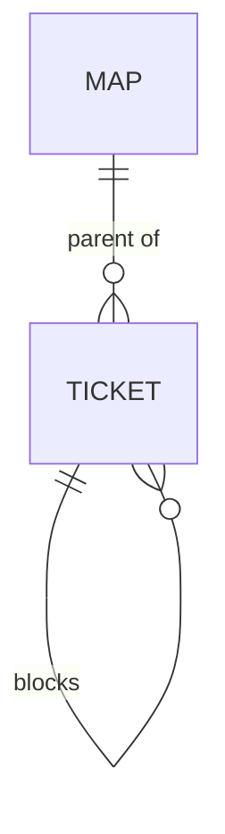

# decision-map Plugin Implementation Plan

> **For agentic workers:** REQUIRED SUB-SKILL: Use superpowers:subagent-driven-development (recommended) or superpowers:executing-plans to implement this plan task-by-task. Steps use checkbox (`- [ ]`) syntax for tracking.

**Goal:** Ship the `decision-map` plugin — wayfinder-style multi-session planning as a map of decision tickets on ADO / GitHub / local markdown — per the approved spec `docs/superpowers/specs/2026-07-31-decision-map-design.md` (ADRs 0033–0042).

**Architecture:** A new plugin owns two flow skills (`chart-map`, `work-map`) and the local backend; the tracker backends are new ops scripts added to `ado-backlog` (`decision-map-ops.cs`) and `github-backlog` (`decision_map_ops.py`), all implementing one subcommand contract (`chart · read · claim · resolve · comment · block · frontier`). Flow skills never touch a tracker API directly.

**Tech Stack:** .NET 10 file-based C# (HttpClient + System.Text.Json only), Python 3 (stdlib + `requests` for GitHub, stdlib-only for local), Markdown skills/commands.

## Global Constraints

- **Versions in sync:** `plugins/decision-map/.claude-plugin/plugin.json` version must equal its entry in `.claude-plugin/marketplace.json` (start at `0.1.0`).
- **Harness-neutral skills:** name *actions*, never one harness's tool ("load the skill via your harness's mechanism"). `${CLAUDE_PLUGIN_ROOT}` only in the three installer-rewritable shapes: `/references/…`, `/scripts/…`, `/skills/…`.
- **Safety gates (ADR 0039):** create-class writes (chart, fog graduation) = dry-run → show → explicit approval → real. Lifecycle writes (claim/resolve/comment/block) flow with in-conversation confirmation. Every subcommand still accepts `--dry-run`.
- **Tags/labels:** map = `decision-map:map`, tickets = `decision-map:ticket` (+ `decision-map:type:<type>` label on GitHub / `Decision-Map-Type: <type>` line in ADO ticket body).
- **Refer by name:** all user-facing output shows ticket *titles* (wrapping their links), never bare ids.
- **Data-contract single source:** shapes live only in `plugins/decision-map/references/data-contracts.md`.
- **Docs rules:** every new skill adds a PLAYBOOK row in the same commit (ADR 0001); skill-generated local `map.md` follows the diagram convention; ADRs 0033–0042 and CONTEXT.md terms already exist — do not re-create.
- **No new dependencies:** C# stays HttpClient+System.Text.Json; GitHub Python may use `requests` (already used by `create_github_issues.py`); local Python is stdlib-only.

---

### Task 1: Plugin scaffold + marketplace registration

**Files:**
- Create: `plugins/decision-map/.claude-plugin/plugin.json`
- Create: `plugins/decision-map/README.md`
- Modify: `.claude-plugin/marketplace.json` (add plugin entry; bump marketplace `version` 0.3.0 → 0.4.0)
- Modify: `CLAUDE.md` (repo-layout: the marketplace now ships five plugins; add one `plugins/decision-map/` line to the layout tree)

**Interfaces:**
- Produces: plugin name `decision-map` (commands will be `/decision-map:chart`, `/decision-map:work`); version `0.1.0` used by Task 8's sync check.

- [ ] **Step 1: Write `plugin.json`**

```json
{
  "name": "decision-map",
  "displayName": "Decision Map",
  "version": "0.1.0",
  "description": "Plan work too big for one agent session as a shared map of decision tickets on your tracker (Azure DevOps, GitHub Issues, or local markdown): chart the map, then resolve one decision per session until the way is clear. Adapts the wayfinder idea to this marketplace's plugins and safety gates.",
  "author": {
    "name": "ThodsaphonSonthiphin",
    "email": "thodsaphon.sonthipin@cartagena.no",
    "url": "https://github.com/ThodsaphonSonthiphin"
  },
  "homepage": "https://github.com/ThodsaphonSonthiphin/workflow-daily-work",
  "repository": "https://github.com/ThodsaphonSonthiphin/workflow-daily-work",
  "license": "MIT",
  "keywords": ["planning", "decision-tickets", "wayfinder", "multi-session", "azure-devops", "github-issues", "daily-work"]
}
```

- [ ] **Step 2: Add the marketplace entry**

In `.claude-plugin/marketplace.json`, set the top-level `"version"` to `"0.4.0"` and append to `"plugins"` (after `react-workflows`):

```json
{
  "name": "decision-map",
  "source": "./plugins/decision-map",
  "description": "Plan work too big for one agent session as a shared map of decision tickets on your tracker (ADO / GitHub Issues / local markdown). /decision-map:chart names the destination and creates the map + tickets (dry-run gated); /decision-map:work claims and resolves exactly one decision per session via the arc's own skills (grilling, ui-mockup, research). Requires ado-backlog or github-backlog for tracker backends; falls back to docs/decision-map/ markdown.",
  "version": "0.1.0",
  "author": { "name": "ThodsaphonSonthiphin", "url": "https://github.com/ThodsaphonSonthiphin" },
  "homepage": "https://github.com/ThodsaphonSonthiphin/workflow-daily-work",
  "repository": "https://github.com/ThodsaphonSonthiphin/workflow-daily-work",
  "license": "MIT",
  "category": "development",
  "keywords": ["planning", "decision-tickets", "wayfinder", "multi-session", "frontier", "azure-devops", "github-issues"]
}
```

- [ ] **Step 3: Write `README.md`**

```markdown
# decision-map

Plan an effort **too big for one agent session** as a **Decision map**: one tracker
item indexing the effort, with child **Decision tickets** — questions whose
resolution is a *decision*, not a slice of a build — resolved **one per session**
until nothing is left to decide. Then hand off to the normal build flow.

Adapted from the [wayfinder](https://github.com/mattpocock/skills) skill by Matt
Pocock, re-grounded on this marketplace's plugins, trackers, and safety gates
(design: `docs/superpowers/specs/2026-07-31-decision-map-design.md`, ADRs 0033–0042
at the marketplace root).

## Skills

| Skill | Command | What it does |
|---|---|---|
| chart-map | `/decision-map:chart` | Name the destination, grill breadth-first, create map + tickets (dry-run gated), fire research subagents, stop. |
| work-map | `/decision-map:work` | Load the map, show the frontier, claim ONE ticket, resolve it via the matching arc skill, record + graduate fog, stop. |

## Backends

| Backend | Needs | Ops script |
|---|---|---|
| Azure DevOps | `ado-backlog` plugin, `az login`, `AZDO_ORG`/`AZDO_PROJECT` | `ado-backlog/scripts/decision-map-ops.cs` |
| GitHub Issues | `github-backlog` plugin, `gh auth login`, `GH_OWNER`/`GH_REPO` | `github-backlog/scripts/decision_map_ops.py` |
| Local markdown | nothing (fallback) | `decision-map/scripts/local_map_ops.py` → `docs/decision-map/<slug>/` |

## Safety

Creating items (charting, fog graduation) always dry-runs first and waits for your
explicit approval. Claim/comment/close ride the conversation's own confirmations.
```

- [ ] **Step 4: Update `CLAUDE.md` repo layout**

In `CLAUDE.md`: change the sentence "It ships three **plugins**" to name the current set, e.g. "It ships five **plugins**: `ado-backlog`, `github-backlog`, `dev-workflows`, `react-workflows` (opt-in React conventions), and `decision-map` (multi-session decision-ticket planning)." Add to the layout tree, after the `plugins/dev-workflows/` block:

```
plugins/decision-map/             multi-session planning: chart-map + work-map skills,
                                  local-markdown backend, ops contract reference
```

- [ ] **Step 5: Validate JSON + verify version sync**

Run (PowerShell): `python -m json.tool "plugins/decision-map/.claude-plugin/plugin.json"; python -m json.tool ".claude-plugin/marketplace.json"`
Expected: both print parsed JSON, exit 0.
Then confirm both files say `0.1.0` for decision-map.

- [ ] **Step 6: Commit**

```bash
git add plugins/decision-map .claude-plugin/marketplace.json CLAUDE.md
git commit -m "feat(decision-map): scaffold plugin + marketplace entry (ADR 0033/0034)"
```

---

### Task 2: The ops contract reference (`data-contracts.md`)

**Files:**
- Create: `plugins/decision-map/references/data-contracts.md`

**Interfaces:**
- Produces: the subcommand CLI contract and JSON shapes (`map_input.json`, `map.json`, frontier output) that Tasks 3–5 implement and Tasks 6–7 reference. Exact shapes below — implementers copy from here.

- [ ] **Step 1: Write the contract file**

````markdown
# decision-map data contracts

Single source of truth for the shapes exchanged between the decision-map flow
skills and the three backend ops scripts (ADR 0037). Nothing else redefines them.
The tracker (or the local files) is the source of truth; these JSON files are
working files, never a store.



## Subcommand contract (all three backends)

| Subcommand | Args | Effect |
|---|---|---|
| `chart` | `--input <map_input.json> --output <map.json>` | bulk-create map + tickets + parent links + blocking edges. **Dry-run by default**; `--real` performs the writes. |
| `read` | `--map <id\|slug> --output <map.json>` | fetch map + children at low resolution. |
| `frontier` | `--map <id\|slug> --output <frontier.json>` | open + unblocked + unclaimed children. |
| `claim` | `--ticket <id\|slug>` (`--user <upn>` ADO only) | assign the ticket to the caller. |
| `resolve` | `--ticket <id\|slug> --gist "<one line>" [--link <url>] [--body-file <md>]` | post resolution comment, close the ticket. |
| `comment` | `--ticket <id\|slug> --body-file <md>` | plain comment. |
| `block` | `--ticket <id\|slug> --blocked-by <id\|slug>` | dependency edge (ticket waits on blocked-by). |

Every subcommand also accepts `--dry-run` (print planned mutations, change
nothing) — for `chart` that is already the default.

## `map_input.json` (input to `chart`)

```json
{
  "target": { "org": "Cartagena365", "project": "GlassHull",
              "owner": "Cartagena365", "repo": "GlassHull",
              "slug": "example-effort" },
  "mapType": "Epic",
  "ticketType": "Issue",
  "map": {
    "title": "Decision map — <effort name>",
    "destination": "<one or two lines>",
    "notes": "<skills to consult; standing preferences>",
    "notYetSpecified": ["<fog line>", "..."],
    "outOfScope": ["<ruled-out line>", "..."]
  },
  "tickets": [
    { "key": "auth-model", "title": "Auth model — per-tenant or shared keys?",
      "type": "grilling", "question": "<the decision this resolves>",
      "blocks": ["rollout-order"] }
  ]
}
```

`target` carries only the fields the active backend needs (org/project for ADO,
owner/repo for GitHub, slug for local). `mapType`/`ticketType` are ADO work-item
types (defaults `Epic`/`Issue`; must be valid for the project's process — the
chart-map skill confirms them). `blocks` lists ticket keys this ticket blocks.
`type` ∈ `research | prototype | grilling | task`. Mode is derived: research=AFK,
grilling/prototype=HITL, task=either.

## `map.json` (output of `chart` and `read`)

```json
{
  "backend": "ado",
  "map": { "id": "1234", "name": "Decision map — <effort>", "url": "https://…",
           "destination": "<line>" },
  "tickets": [
    { "key": "auth-model", "id": "1235", "name": "Auth model — …",
      "url": "https://…", "type": "grilling", "mode": "HITL",
      "status": "open", "assignee": null, "blocks": ["1236"], "gist": null }
  ]
}
```

`status` ∈ `open | closed`. After `resolve`, `gist` holds the one-line answer.
For the local backend, `id` and `key` are both the ticket file's slug and `url`
is the repo-relative file path.

## `frontier.json` (output of `frontier`)

```json
{
  "frontier": [ { "id": "1235", "name": "Auth model — …", "url": "https://…", "type": "grilling" } ],
  "blocked":  [ { "id": "1236", "name": "Rollout order — …", "blockedBy": ["1235"] } ],
  "claimed":  [ { "id": "1237", "name": "…", "assignee": "thodsaphon.sonthipin@cartagena.no" } ]
}
```

## Backend mappings

| Concept | ADO | GitHub | Local |
|---|---|---|---|
| map | work item `mapType`, tag `decision-map:map` | issue, label `decision-map:map` | `docs/decision-map/<slug>/map.md` |
| ticket | child via `System.LinkTypes.Hierarchy-Reverse`, tag `decision-map:ticket`, body line `Decision-Map-Type: <type>` | sub-issue (native REST if available, else task-list in map body), labels `decision-map:ticket`, `decision-map:type:<type>` | `tickets/<slug>.md` with frontmatter |
| claim | `System.AssignedTo` | assignee | frontmatter `assignee:` |
| close | `System.State` → `Done` (fallback `Closed` on 400) | state closed | frontmatter `status: closed` |
| blocking | `System.LinkTypes.Dependency-Reverse` on the blocked item → predecessor | native "blocked by" if the plan supports it, else body line `blocked-by: #<n>` (weaker — the script labels it) | frontmatter `blocked_by: [slug]` |
| resolution | work-item comment | issue comment | `## Resolution` section appended |

## Local map/ticket file formats

`map.md`:

```markdown
# Decision map — <effort name>

<one small overview mermaid diagram (diagram convention applies to local files)>

## Destination
<one or two lines>

## Notes
<domain; skills every session should consult; standing preferences>

## Decisions so far
- [<ticket title>](tickets/<slug>.md) — <one-line gist>

## Not yet specified
- <fog line>

## Out of scope
- <ruled-out line>
```

`tickets/<slug>.md`:

```markdown
---
title: <ticket title>
type: grilling
mode: HITL
status: open
assignee:
blocked_by: []
---

## Question

<the decision or investigation this ticket resolves>
```

`## Resolution` (appended by `resolve`):

```markdown
## Resolution

<gist — one or two lines>

Detail: <link to repo ADR / commit, when one exists (ADR 0036)>
```
````

- [ ] **Step 2: Commit**

```bash
git add plugins/decision-map/references/data-contracts.md
git commit -m "docs(decision-map): ops contract + data shapes (ADR 0037)"
```

---

### Task 3: Local backend `local_map_ops.py` (TDD)

**Files:**
- Create: `plugins/decision-map/scripts/local_map_ops.py`
- Test: `plugins/decision-map/scripts/test_local_map_ops.py`

**Interfaces:**
- Consumes: shapes from Task 2 (`map_input.json` with `target.slug`; `map.json`; `frontier.json`).
- Produces: CLI `python local_map_ops.py <chart|read|frontier|claim|resolve|comment|block> --root <dir> …` where `--root` defaults to `docs/decision-map`. Functions: `chart(root, inp, real)`, `read_map(root, slug)`, `frontier(root, slug)`, `claim(root, slug, ticket, user)`, `resolve(root, slug, ticket, gist, link, body)`, `block(root, slug, ticket, blocked_by)`; ticket files per Task 2's local format.

- [ ] **Step 1: Write the failing tests**

```python
# plugins/decision-map/scripts/test_local_map_ops.py
import json, tempfile, unittest
from pathlib import Path

import local_map_ops as ops

INPUT = {
    "target": {"slug": "example-effort"},
    "map": {"title": "Decision map — example", "destination": "a spec",
            "notes": "use grill-with-docs",
            "notYetSpecified": ["how to deploy"], "outOfScope": ["mobile app"]},
    "tickets": [
        {"key": "auth-model", "title": "Auth model?", "type": "grilling",
         "question": "per-tenant or shared?", "blocks": ["rollout-order"]},
        {"key": "rollout-order", "title": "Rollout order?", "type": "grilling",
         "question": "which env first?", "blocks": []},
        {"key": "api-limits", "title": "API rate limits?", "type": "research",
         "question": "what are the limits?", "blocks": []},
    ],
}

class LocalMapOpsTest(unittest.TestCase):
    def setUp(self):
        self.tmp = tempfile.TemporaryDirectory()
        self.root = Path(self.tmp.name)

    def tearDown(self):
        self.tmp.cleanup()

    def _chart(self):
        return ops.chart(self.root, INPUT, real=True)

    def test_chart_dry_run_writes_nothing(self):
        ops.chart(self.root, INPUT, real=False)
        self.assertFalse((self.root / "example-effort").exists())

    def test_chart_creates_map_and_tickets(self):
        out = self._chart()
        self.assertTrue((self.root / "example-effort" / "map.md").exists())
        self.assertTrue((self.root / "example-effort" / "tickets" / "auth-model.md").exists())
        self.assertEqual(out["backend"], "local")
        self.assertEqual(len(out["tickets"]), 3)
        modes = {t["key"]: t["mode"] for t in out["tickets"]}
        self.assertEqual(modes["api-limits"], "AFK")
        self.assertEqual(modes["auth-model"], "HITL")

    def test_frontier_excludes_blocked_and_claimed(self):
        self._chart()
        ops.claim(self.root, "example-effort", "api-limits", "pon")
        f = ops.frontier(self.root, "example-effort")
        names = [t["id"] for t in f["frontier"]]
        self.assertIn("auth-model", names)          # open, unblocked, unclaimed
        self.assertNotIn("rollout-order", names)     # blocked by auth-model
        self.assertNotIn("api-limits", names)        # claimed
        self.assertEqual(f["blocked"][0]["blockedBy"], ["auth-model"])

    def test_resolve_closes_and_indexes(self):
        self._chart()
        ops.resolve(self.root, "example-effort", "auth-model",
                    "per-tenant keys", link="docs/adr/0007-x.md", body=None)
        m = ops.read_map(self.root, "example-effort")
        t = next(t for t in m["tickets"] if t["key"] == "auth-model")
        self.assertEqual(t["status"], "closed")
        self.assertEqual(t["gist"], "per-tenant keys")
        map_md = (self.root / "example-effort" / "map.md").read_text(encoding="utf-8")
        self.assertIn("[Auth model?](tickets/auth-model.md) — per-tenant keys", map_md)
        # unblocking: rollout-order now on the frontier
        f = ops.frontier(self.root, "example-effort")
        self.assertIn("rollout-order", [t["id"] for t in f["frontier"]])

    def test_block_adds_edge(self):
        self._chart()
        ops.block(self.root, "example-effort", "api-limits", "auth-model")
        f = ops.frontier(self.root, "example-effort")
        self.assertNotIn("api-limits", [t["id"] for t in f["frontier"]])

if __name__ == "__main__":
    unittest.main()
```

- [ ] **Step 2: Run tests to verify they fail**

Run (PowerShell, from repo root): `cd "plugins/decision-map/scripts"; python -m unittest test_local_map_ops -v`
Expected: FAIL / ERROR — `ModuleNotFoundError: No module named 'local_map_ops'`.

- [ ] **Step 3: Implement `local_map_ops.py`**

```python
#!/usr/bin/env python3
"""local_map_ops.py — decision-map local-markdown backend (ADR 0042).

Map lives at <root>/<slug>/map.md, tickets at <root>/<slug>/tickets/<slug>.md.
Contract: plugins/decision-map/references/data-contracts.md. Stdlib only.
"""
import argparse, json, re, sys
from pathlib import Path

AFK_TYPES = {"research"}


def _mode(ticket_type):
    return "AFK" if ticket_type in AFK_TYPES else "HITL"


def _fm_parse(text):
    """Parse the leading --- frontmatter block into a dict (flat, list via [a, b])."""
    m = re.match(r"^---\n(.*?)\n---\n", text, re.DOTALL)
    fm = {}
    if not m:
        return fm, text
    for line in m.group(1).splitlines():
        if ":" not in line:
            continue
        k, v = line.split(":", 1)
        v = v.strip()
        if v.startswith("[") and v.endswith("]"):
            inner = v[1:-1].strip()
            fm[k.strip()] = [s.strip() for s in inner.split(",") if s.strip()]
        else:
            fm[k.strip()] = v
    return fm, text[m.end():]


def _fm_dump(fm):
    lines = []
    for k, v in fm.items():
        if isinstance(v, list):
            lines.append(f"{k}: [{', '.join(v)}]")
        else:
            lines.append(f"{k}: {v if v is not None else ''}")
    return "---\n" + "\n".join(lines) + "\n---\n"


def _ticket_path(root, slug, ticket):
    return Path(root) / slug / "tickets" / f"{ticket}.md"


def _load_ticket(root, slug, ticket):
    text = _ticket_path(root, slug, ticket).read_text(encoding="utf-8")
    return _fm_parse(text)


def _save_ticket(root, slug, ticket, fm, body):
    _ticket_path(root, slug, ticket).write_text(_fm_dump(fm) + body, encoding="utf-8")


def _ticket_json(root, slug, ticket):
    fm, _ = _load_ticket(root, slug, ticket)
    return {
        "key": ticket, "id": ticket,
        "name": fm.get("title", ticket),
        "url": f"{root}/{slug}/tickets/{ticket}.md" if isinstance(root, str)
               else str(Path(root) / slug / "tickets" / f"{ticket}.md"),
        "type": fm.get("type", "grilling"), "mode": fm.get("mode", "HITL"),
        "status": fm.get("status", "open"),
        "assignee": fm.get("assignee") or None,
        "blocked_by": fm.get("blocked_by", []),
        "gist": fm.get("gist") or None,
    }


def _all_tickets(root, slug):
    tdir = Path(root) / slug / "tickets"
    return sorted(p.stem for p in tdir.glob("*.md")) if tdir.exists() else []


def chart(root, inp, real):
    slug = inp["target"]["slug"]
    base = Path(root) / slug
    plan = [f"create {base / 'map.md'}"] + [
        f"create {base / 'tickets' / (t['key'] + '.md')}" for t in inp["tickets"]]
    if not real:
        print("DRY RUN — planned files:")
        for line in plan:
            print(f"  {line}")
        return {"backend": "local", "dryRun": True, "planned": plan}
    (base / "tickets").mkdir(parents=True, exist_ok=True)
    m = inp["map"]
    fog = "\n".join(f"- {x}" for x in m.get("notYetSpecified", [])) or "- (none)"
    oos = "\n".join(f"- {x}" for x in m.get("outOfScope", [])) or "- (none)"
    (base / "map.md").write_text(
        f"# {m['title']}\n\n"
        "```mermaid\ngraph TD\n    MAP[\"map (this file)\"] --> T[\"tickets/*.md — one decision each\"]\n"
        "    T --> D[\"Decisions so far (index below)\"]\n```\n\n"
        f"## Destination\n{m['destination']}\n\n"
        f"## Notes\n{m.get('notes', '')}\n\n"
        "## Decisions so far\n\n"
        f"## Not yet specified\n{fog}\n\n"
        f"## Out of scope\n{oos}\n",
        encoding="utf-8")
    # pass 1: create tickets; pass 2: wire blocking (create-then-wire, spec §9)
    for t in inp["tickets"]:
        fm = {"title": t["title"], "type": t["type"], "mode": _mode(t["type"]),
              "status": "open", "assignee": "", "blocked_by": [], "gist": ""}
        _save_ticket(root, slug, t["key"], fm, f"\n## Question\n\n{t['question']}\n")
    for t in inp["tickets"]:
        for blocked in t.get("blocks", []):
            block(root, slug, blocked, t["key"])
    return read_map(root, slug)


def read_map(root, slug):
    map_md = (Path(root) / slug / "map.md").read_text(encoding="utf-8")
    title = map_md.splitlines()[0].lstrip("# ").strip()
    dest = ""
    dm = re.search(r"## Destination\n(.+?)(\n\n|\n##)", map_md, re.DOTALL)
    if dm:
        dest = dm.group(1).strip()
    return {"backend": "local",
            "map": {"id": slug, "name": title,
                    "url": str(Path(root) / slug / "map.md"), "destination": dest},
            "tickets": [_ticket_json(root, slug, t) for t in _all_tickets(root, slug)]}


def frontier(root, slug):
    out = {"frontier": [], "blocked": [], "claimed": []}
    tickets = {t: _ticket_json(root, slug, t) for t in _all_tickets(root, slug)}
    for key, t in tickets.items():
        if t["status"] != "open":
            continue
        open_blockers = [b for b in t["blocked_by"]
                         if b in tickets and tickets[b]["status"] == "open"]
        if t["assignee"]:
            out["claimed"].append({"id": key, "name": t["name"], "assignee": t["assignee"]})
        elif open_blockers:
            out["blocked"].append({"id": key, "name": t["name"], "blockedBy": open_blockers})
        else:
            out["frontier"].append({"id": key, "name": t["name"],
                                    "url": t["url"], "type": t["type"]})
    return out


def claim(root, slug, ticket, user):
    fm, body = _load_ticket(root, slug, ticket)
    fm["assignee"] = user
    _save_ticket(root, slug, ticket, fm, body)
    return {"claimed": ticket, "assignee": user}


def block(root, slug, ticket, blocked_by):
    fm, body = _load_ticket(root, slug, ticket)
    deps = fm.get("blocked_by", [])
    if blocked_by not in deps:
        deps.append(blocked_by)
    fm["blocked_by"] = deps
    _save_ticket(root, slug, ticket, fm, body)
    return {"ticket": ticket, "blocked_by": deps}


def comment(root, slug, ticket, body_text):
    fm, body = _load_ticket(root, slug, ticket)
    _save_ticket(root, slug, ticket, fm, body + f"\n## Comment\n\n{body_text}\n")
    return {"commented": ticket}


def resolve(root, slug, ticket, gist, link, body):
    fm, tbody = _load_ticket(root, slug, ticket)
    fm["status"] = "closed"
    fm["gist"] = gist
    detail = f"\nDetail: {link}\n" if link else ""
    extra = f"\n{body}\n" if body else ""
    _save_ticket(root, slug, ticket, fm,
                 tbody + f"\n## Resolution\n\n{gist}\n{detail}{extra}")
    map_path = Path(root) / slug / "map.md"
    map_md = map_path.read_text(encoding="utf-8")
    entry = f"- [{fm['title']}](tickets/{ticket}.md) — {gist}\n"
    map_md = map_md.replace("## Decisions so far\n", "## Decisions so far\n" + entry, 1)
    map_path.write_text(map_md, encoding="utf-8")
    return {"resolved": ticket, "gist": gist}


def main():
    ap = argparse.ArgumentParser(description="decision-map local backend")
    ap.add_argument("cmd", choices=["chart", "read", "frontier", "claim",
                                    "resolve", "comment", "block"])
    ap.add_argument("--root", default="docs/decision-map")
    ap.add_argument("--input"); ap.add_argument("--output")
    ap.add_argument("--map", dest="slug"); ap.add_argument("--ticket")
    ap.add_argument("--user", default="me"); ap.add_argument("--gist")
    ap.add_argument("--link"); ap.add_argument("--body-file", dest="body_file")
    ap.add_argument("--blocked-by", dest="blocked_by")
    ap.add_argument("--real", action="store_true")
    ap.add_argument("--dry-run", dest="dry", action="store_true")
    a = ap.parse_args()
    body = Path(a.body_file).read_text(encoding="utf-8") if a.body_file else None
    if a.cmd == "chart":
        inp = json.loads(Path(a.input).read_text(encoding="utf-8"))
        result = chart(a.root, inp, real=a.real and not a.dry)
    elif a.cmd == "read":
        result = read_map(a.root, a.slug)
    elif a.cmd == "frontier":
        result = frontier(a.root, a.slug)
    elif a.dry:
        result = {"dryRun": True, "wouldRun": a.cmd, "ticket": a.ticket}
    elif a.cmd == "claim":
        result = claim(a.root, a.slug, a.ticket, a.user)
    elif a.cmd == "resolve":
        result = resolve(a.root, a.slug, a.ticket, a.gist, a.link, body)
    elif a.cmd == "comment":
        result = comment(a.root, a.slug, a.ticket, body)
    elif a.cmd == "block":
        result = block(a.root, a.slug, a.ticket, a.blocked_by)
    text = json.dumps(result, indent=2)
    if a.output:
        Path(a.output).write_text(text, encoding="utf-8")
    print(text)


if __name__ == "__main__":
    main()
```

Note for the implementer: `claim`, `resolve`, `comment`, and `block` need `--map <slug>` on the CLI because ticket slugs are only unique within one map folder.

- [ ] **Step 4: Run tests to verify they pass**

Run: `cd "plugins/decision-map/scripts"; python -m unittest test_local_map_ops -v`
Expected: `OK` — 5 tests passed.

- [ ] **Step 5: Commit**

```bash
git add plugins/decision-map/scripts
git commit -m "feat(decision-map): local-markdown backend with unit tests (ADR 0042)"
```

---

### Task 4: ADO backend `decision-map-ops.cs`

**Files:**
- Create: `plugins/ado-backlog/scripts/decision-map-ops.cs`
- Create: `plugins/decision-map/examples/map_input.example.json` (fixture used by smoke tests and docs)

**Interfaces:**
- Consumes: Task 2 shapes; auth + patch patterns copied from `create-backlog.cs` (`GetEntraTokenAsync`, JSON-Patch, `validateOnly=true`).
- Produces: `dotnet run "plugins/ado-backlog/scripts/decision-map-ops.cs" -- <subcommand> [args]` implementing the full contract. Env: `AZDO_ORG`, `AZDO_PROJECT`, optional `AZDO_PAT`.

- [ ] **Step 1: Write the fixture**

```json
{
  "target": { "org": "Cartagena365", "project": "GlassHull", "slug": "example-effort" },
  "mapType": "Epic",
  "ticketType": "Issue",
  "map": {
    "title": "Decision map — example effort",
    "destination": "An approved spec for the example effort.",
    "notes": "Grill with grill-with-docs; prefer boring technology.",
    "notYetSpecified": ["how rollout interacts with the legacy cron jobs"],
    "outOfScope": ["the mobile app"]
  },
  "tickets": [
    { "key": "auth-model", "title": "Auth model — per-tenant or shared keys?",
      "type": "grilling", "question": "Which auth model do we commit to?",
      "blocks": ["rollout-order"] },
    { "key": "rollout-order", "title": "Rollout order — which environment first?",
      "type": "grilling", "question": "Given the auth model, what rolls out first?",
      "blocks": [] },
    { "key": "api-limits", "title": "API rate limits — what does the vendor allow?",
      "type": "research", "question": "Document the vendor's documented rate limits.",
      "blocks": [] }
  ]
}
```

- [ ] **Step 2: Write `decision-map-ops.cs`**

```csharp
#!/usr/bin/env dotnet
// decision-map-ops.cs
// .NET 10 file-based program — decision-map ops contract, Azure DevOps backend.
// Contract: plugins/decision-map/references/data-contracts.md (ADR 0037).
// Built-in libraries only (HttpClient + System.Text.Json). Auth identical to create-backlog.cs.
//
// Subcommands:
//   chart    --input map_input.json --output map.json [--real]     (dry-run default)
//   read     --map <id> --output map.json
//   frontier --map <id> --output frontier.json
//   claim    --ticket <id> [--user <upn>]      (default: AZDO_ASSIGNED_TO or the az account)
//   resolve  --ticket <id> --gist "<line>" [--link <url>] [--body-file <md>]
//   comment  --ticket <id> --body-file <md>
//   block    --ticket <id> --blocked-by <id>
// All subcommands accept --dry-run (print planned calls, change nothing).
//
// Env: AZDO_ORG, AZDO_PROJECT (required); AZDO_PAT optional (else Entra token via az).

#:property JsonSerializerIsReflectionEnabledByDefault=true

using System.Diagnostics;
using System.Net.Http.Headers;
using System.Text;
using System.Text.Json;

const string ApiVersion = "7.1";
const string CommentsApiVersion = "7.1-preview.3";
const string MapTag = "decision-map:map";
const string TicketTag = "decision-map:ticket";

var opts = ParseArgs(args);
string cmd = opts.Cmd;
bool dryRun = opts.Flags.Contains("dry-run") || (cmd == "chart" && !opts.Flags.Contains("real"));

string org = Environment.GetEnvironmentVariable("AZDO_ORG")
    ?? throw new InvalidOperationException("AZDO_ORG is not set");
string project = Environment.GetEnvironmentVariable("AZDO_PROJECT")
    ?? throw new InvalidOperationException("AZDO_PROJECT is not set");
string baseUrl = $"https://dev.azure.com/{org}";
string? pat = Environment.GetEnvironmentVariable("AZDO_PAT");

using var http = new HttpClient();
if (!string.IsNullOrEmpty(pat))
    http.DefaultRequestHeaders.Authorization = new AuthenticationHeaderValue(
        "Basic", Convert.ToBase64String(Encoding.ASCII.GetBytes($":{pat}")));
else
    http.DefaultRequestHeaders.Authorization = new AuthenticationHeaderValue(
        "Bearer", await GetEntraTokenAsync());

object result = cmd switch
{
    "chart" => await Chart(Req(opts, "input"), opts.Get("output"), dryRun),
    "read" => await ReadMap(int.Parse(Req(opts, "map")), opts.Get("output")),
    "frontier" => await Frontier(int.Parse(Req(opts, "map")), opts.Get("output")),
    "claim" => await Claim(int.Parse(Req(opts, "ticket")), opts.Get("user"), dryRun),
    "resolve" => await Resolve(int.Parse(Req(opts, "ticket")), Req(opts, "gist"),
                               opts.Get("link"), opts.Get("body-file"), dryRun),
    "comment" => await Comment(int.Parse(Req(opts, "ticket")), Req(opts, "body-file"), dryRun),
    "block" => await Block(int.Parse(Req(opts, "ticket")), int.Parse(Req(opts, "blocked-by")), dryRun),
    _ => throw new InvalidOperationException(
        "usage: decision-map-ops.cs -- <chart|read|frontier|claim|resolve|comment|block> [--arg value] [--dry-run]"),
};
Console.WriteLine(JsonSerializer.Serialize(result, new JsonSerializerOptions { WriteIndented = true }));

// ── subcommands ───────────────────────────────────────────────────────────────

async Task<object> Chart(string inputPath, string? outputPath, bool dry)
{
    using var doc = JsonDocument.Parse(await File.ReadAllTextAsync(inputPath));
    var root = doc.RootElement;
    string mapType = root.TryGetProperty("mapType", out var mt) ? mt.GetString()! : "Epic";
    string ticketType = root.TryGetProperty("ticketType", out var tt) ? tt.GetString()! : "Issue";
    var map = root.GetProperty("map");
    string mapBody = BuildMapBody(map);

    if (dry)
    {
        Console.WriteLine($"DRY RUN (validateOnly) — org={org} project={project}");
        bool ok = await Validate(mapType, map.GetProperty("title").GetString()!, mapBody, MapTag);
        int pass = ok ? 1 : 0, fail = ok ? 0 : 1;
        foreach (var t in root.GetProperty("tickets").EnumerateArray())
        {
            bool tok = await Validate(ticketType, t.GetProperty("title").GetString()!,
                TicketBody(t), TicketTag);
            if (tok) pass++; else fail++;
        }
        return new { dryRun = true, valid = pass, invalid = fail };
    }

    (int mapId, string mapUrl) = await Create(mapType,
        map.GetProperty("title").GetString()!, mapBody, MapTag, parentUrl: null);
    var created = new Dictionary<string, (int id, string url)>();
    foreach (var t in root.GetProperty("tickets").EnumerateArray())       // pass 1: create
        created[t.GetProperty("key").GetString()!] = await Create(ticketType,
            t.GetProperty("title").GetString()!, TicketBody(t), TicketTag, mapUrl);
    foreach (var t in root.GetProperty("tickets").EnumerateArray())       // pass 2: wire blocking
        if (t.TryGetProperty("blocks", out var blocks))
            foreach (var b in blocks.EnumerateArray())
                await Block(created[b.GetString()!].id,
                            created[t.GetProperty("key").GetString()!].id, dry: false);
    var outObj = await ReadMap(mapId, outputPath);
    return outObj;
}

async Task<object> ReadMap(int mapId, string? outputPath)
{
    var children = await ChildIds(mapId);
    var tickets = new List<object>();
    foreach (int id in children)
    {
        var wi = await GetItem(id, expandRelations: true);
        var f = wi.GetProperty("fields");
        tickets.Add(new
        {
            key = id.ToString(), id = id.ToString(),
            name = S(f, "System.Title"), url = ItemUrl(id),
            type = ExtractType(S(f, "System.Description")),
            mode = ExtractType(S(f, "System.Description")) == "research" ? "AFK" : "HITL",
            status = IsClosed(S(f, "System.State")) ? "closed" : "open",
            assignee = Assignee(f),
            blocks = Predecessors(wi).Select(p => p.ToString()).ToArray(),
            gist = (string?)null,
        });
    }
    var mapItem = await GetItem(mapId, expandRelations: false);
    var mf = mapItem.GetProperty("fields");
    var result = new
    {
        backend = "ado",
        map = new { id = mapId.ToString(), name = S(mf, "System.Title"),
                    url = ItemUrl(mapId), destination = "" },
        tickets,
    };
    if (outputPath is not null)
        await File.WriteAllTextAsync(outputPath,
            JsonSerializer.Serialize(result, new JsonSerializerOptions { WriteIndented = true }));
    return result;
}

async Task<object> Frontier(int mapId, string? outputPath)
{
    var frontier = new List<object>(); var blocked = new List<object>(); var claimed = new List<object>();
    var children = await ChildIds(mapId);
    var states = new Dictionary<int, bool>(); // id -> closed?
    var items = new Dictionary<int, JsonElement>();
    foreach (int id in children)
    {
        var wi = await GetItem(id, expandRelations: true);
        items[id] = wi;
        states[id] = IsClosed(S(wi.GetProperty("fields"), "System.State"));
    }
    foreach (var (id, wi) in items)
    {
        if (states[id]) continue;
        var f = wi.GetProperty("fields");
        string name = S(f, "System.Title");
        string? assignee = Assignee(f);
        var openPreds = Predecessors(wi).Where(p => states.TryGetValue(p, out bool c) && !c).ToList();
        if (assignee is not null)
            claimed.Add(new { id = id.ToString(), name, assignee });
        else if (openPreds.Count > 0)
            blocked.Add(new { id = id.ToString(), name,
                              blockedBy = openPreds.Select(p => p.ToString()).ToArray() });
        else
            frontier.Add(new { id = id.ToString(), name, url = ItemUrl(id),
                               type = ExtractType(S(f, "System.Description")) });
    }
    var result = new { frontier, blocked, claimed };
    if (outputPath is not null)
        await File.WriteAllTextAsync(outputPath,
            JsonSerializer.Serialize(result, new JsonSerializerOptions { WriteIndented = true }));
    return result;
}

async Task<object> Claim(int id, string? user, bool dry)
{
    user ??= Environment.GetEnvironmentVariable("AZDO_ASSIGNED_TO")
        ?? throw new InvalidOperationException("pass --user <upn> or set AZDO_ASSIGNED_TO");
    if (dry) return new { dryRun = true, wouldAssign = id, to = user };
    await PatchFields(id, new Dictionary<string, object> { ["System.AssignedTo"] = user });
    return new { claimed = id, assignee = user };
}

async Task<object> Resolve(int id, string gist, string? link, string? bodyFile, bool dry)
{
    string extra = bodyFile is null ? "" : "\n\n" + await File.ReadAllTextAsync(bodyFile);
    string comment = $"**Resolution:** {gist}" + (link is null ? "" : $"\n\nDetail: {link}") + extra;
    if (dry) return new { dryRun = true, wouldResolve = id, gist };
    await PostComment(id, comment);
    try { await PatchFields(id, new Dictionary<string, object> { ["System.State"] = "Done" }); }
    catch (HttpRequestException) // process without "Done" (e.g. Agile Epic) — fall back
    { await PatchFields(id, new Dictionary<string, object> { ["System.State"] = "Closed" }); }
    return new { resolved = id, gist };
}

async Task<object> Comment(int id, string bodyFile, bool dry)
{
    string text = await File.ReadAllTextAsync(bodyFile);
    if (dry) return new { dryRun = true, wouldComment = id };
    await PostComment(id, text);
    return new { commented = id };
}

async Task<object> Block(int ticketId, int blockedById, bool dry)
{
    if (dry) return new { dryRun = true, ticket = ticketId, blockedBy = blockedById };
    // the blocked ticket gains a Predecessor (Dependency-Reverse) pointing at its blocker
    var ops = new object[] { new { op = "add", path = "/relations/-", value = new
        { rel = "System.LinkTypes.Dependency-Reverse", url = ItemApiUrl(blockedById) } } };
    var resp = await http.PatchAsync(
        $"{baseUrl}/{project}/_apis/wit/workitems/{ticketId}?api-version={ApiVersion}",
        new StringContent(JsonSerializer.Serialize(ops), Encoding.UTF8, "application/json-patch+json"));
    await EnsureOk(resp, $"block {ticketId} on {blockedById}");
    return new { ticket = ticketId, blockedBy = blockedById };
}

// ── ADO helpers ───────────────────────────────────────────────────────────────

string ItemUrl(int id) => $"{baseUrl}/{Uri.EscapeDataString(project)}/_workitems/edit/{id}";
string ItemApiUrl(int id) => $"{baseUrl}/_apis/wit/workItems/{id}";

static string BuildMapBody(JsonElement map)
{
    string lines(string prop) => map.TryGetProperty(prop, out var el)
        ? string.Join("<br>", el.EnumerateArray().Select(x => "- " + x.GetString())) : "- (none)";
    return $"<b>Destination</b><br>{map.GetProperty("destination").GetString()}<br><br>" +
           $"<b>Notes</b><br>{(map.TryGetProperty("notes", out var n) ? n.GetString() : "")}<br><br>" +
           "<b>Decisions so far</b><br><br>" +
           $"<b>Not yet specified</b><br>{lines("notYetSpecified")}<br><br>" +
           $"<b>Out of scope</b><br>{lines("outOfScope")}";
}

static string TicketBody(JsonElement t) =>
    $"Decision-Map-Type: {t.GetProperty("type").GetString()}<br><br>" +
    $"<b>Question</b><br>{t.GetProperty("question").GetString()}";

static string ExtractType(string description)
{
    var m = System.Text.RegularExpressions.Regex.Match(description ?? "",
        @"Decision-Map-Type:\s*(research|prototype|grilling|task)");
    return m.Success ? m.Groups[1].Value : "grilling";
}

static bool IsClosed(string state) =>
    state is "Done" or "Closed" or "Resolved" or "Removed" or "Completed";

static string? Assignee(JsonElement fields) =>
    fields.TryGetProperty("System.AssignedTo", out var a) && a.ValueKind == JsonValueKind.Object
        ? a.GetProperty("uniqueName").GetString() : null;

static string S(JsonElement fields, string name) =>
    fields.TryGetProperty(name, out var el)
        ? (el.ValueKind == JsonValueKind.String ? el.GetString() ?? "" : el.ToString()) : "";

IEnumerable<int> Predecessors(JsonElement wi)
{
    if (!wi.TryGetProperty("relations", out var rels)) yield break;
    foreach (var r in rels.EnumerateArray())
        if (r.GetProperty("rel").GetString() == "System.LinkTypes.Dependency-Reverse")
            yield return int.Parse(r.GetProperty("url").GetString()!.Split('/')[^1]);
}

async Task<List<int>> ChildIds(int mapId)
{
    var wi = await GetItem(mapId, expandRelations: true);
    var ids = new List<int>();
    if (wi.TryGetProperty("relations", out var rels))
        foreach (var r in rels.EnumerateArray())
            if (r.GetProperty("rel").GetString() == "System.LinkTypes.Hierarchy-Forward")
                ids.Add(int.Parse(r.GetProperty("url").GetString()!.Split('/')[^1]));
    return ids;
}

async Task<JsonElement> GetItem(int id, bool expandRelations)
{
    string expand = expandRelations ? "&$expand=relations" : "";
    var resp = await http.GetAsync(
        $"{baseUrl}/_apis/wit/workitems/{id}?api-version={ApiVersion}{expand}");
    await EnsureOk(resp, $"get work item {id}");
    return JsonDocument.Parse(await resp.Content.ReadAsStringAsync()).RootElement.Clone();
}

async Task<(int id, string url)> Create(string type, string title, string htmlBody,
                                        string tag, string? parentUrl)
{
    var ops = new List<object>
    {
        new { op = "add", path = "/fields/System.Title", value = title },
        new { op = "add", path = "/fields/System.Description", value = htmlBody },
        new { op = "add", path = "/fields/System.Tags", value = tag },
    };
    if (parentUrl is not null)
        ops.Add(new { op = "add", path = "/relations/-",
                      value = new { rel = "System.LinkTypes.Hierarchy-Reverse", url = parentUrl } });
    var resp = await http.PatchAsync(
        $"{baseUrl}/{project}/_apis/wit/workitems/${Uri.EscapeDataString(type)}?api-version={ApiVersion}",
        new StringContent(JsonSerializer.Serialize(ops), Encoding.UTF8, "application/json-patch+json"));
    string body = await resp.Content.ReadAsStringAsync();
    if (!resp.IsSuccessStatusCode)
        throw new HttpRequestException($"create {type} failed ({(int)resp.StatusCode}): {body}");
    using var doc = JsonDocument.Parse(body);
    return (doc.RootElement.GetProperty("id").GetInt32(),
            doc.RootElement.GetProperty("url").GetString()!);
}

async Task<bool> Validate(string type, string title, string htmlBody, string tag)
{
    var ops = new object[]
    {
        new { op = "add", path = "/fields/System.Title", value = title },
        new { op = "add", path = "/fields/System.Description", value = htmlBody },
        new { op = "add", path = "/fields/System.Tags", value = tag },
    };
    var resp = await http.PatchAsync(
        $"{baseUrl}/{project}/_apis/wit/workitems/${Uri.EscapeDataString(type)}?validateOnly=true&api-version={ApiVersion}",
        new StringContent(JsonSerializer.Serialize(ops), Encoding.UTF8, "application/json-patch+json"));
    Console.WriteLine($"  {(resp.IsSuccessStatusCode ? "PASS" : "FAIL")}  {type,-13} {title}");
    return resp.IsSuccessStatusCode;
}

async Task PatchFields(int id, Dictionary<string, object> fields)
{
    var ops = fields.Select(kv => new { op = "add", path = $"/fields/{kv.Key}", value = kv.Value });
    var resp = await http.PatchAsync(
        $"{baseUrl}/{project}/_apis/wit/workitems/{id}?api-version={ApiVersion}",
        new StringContent(JsonSerializer.Serialize(ops), Encoding.UTF8, "application/json-patch+json"));
    await EnsureOk(resp, $"patch {id}");
}

async Task PostComment(int id, string text)
{
    var resp = await http.PostAsync(
        $"{baseUrl}/{Uri.EscapeDataString(project)}/_apis/wit/workItems/{id}/comments?api-version={CommentsApiVersion}",
        new StringContent(JsonSerializer.Serialize(new { text }), Encoding.UTF8, "application/json"));
    await EnsureOk(resp, $"comment on {id}");
}

static async Task EnsureOk(HttpResponseMessage resp, string what)
{
    if (resp.IsSuccessStatusCode) return;
    throw new HttpRequestException(
        $"{what} failed ({(int)resp.StatusCode}): {await resp.Content.ReadAsStringAsync()}");
}

static async Task<string> GetEntraTokenAsync()
{
    const string adoResourceId = "499b84ac-1321-427f-aa17-267ca6975798";
    var psi = new ProcessStartInfo
    {
        FileName = OperatingSystem.IsWindows() ? "cmd.exe" : "az",
        RedirectStandardOutput = true, RedirectStandardError = true, UseShellExecute = false,
    };
    string azArgs = $"account get-access-token --resource {adoResourceId} --query accessToken -o tsv";
    psi.Arguments = OperatingSystem.IsWindows() ? $"/c az {azArgs}" : azArgs;
    using var proc = Process.Start(psi)
        ?? throw new InvalidOperationException("could not start az — is Azure CLI installed?");
    string token = (await proc.StandardOutput.ReadToEndAsync()).Trim();
    await proc.WaitForExitAsync();
    if (proc.ExitCode != 0 || string.IsNullOrEmpty(token))
        throw new InvalidOperationException($"failed to get Entra token (az exit {proc.ExitCode}). Try 'az login'.");
    return token;
}

// ── arg parsing ───────────────────────────────────────────────────────────────

static Opts ParseArgs(string[] args)
{
    if (args.Length == 0)
        throw new InvalidOperationException(
            "usage: decision-map-ops.cs -- <chart|read|frontier|claim|resolve|comment|block> [--arg value] [--dry-run]");
    var named = new Dictionary<string, string>(); var flags = new HashSet<string>();
    for (int i = 1; i < args.Length; i++)
    {
        if (!args[i].StartsWith("--")) continue;
        string key = args[i][2..];
        if (i + 1 < args.Length && !args[i + 1].StartsWith("--")) named[key] = args[++i];
        else flags.Add(key);
    }
    return new Opts(args[0], named, flags);
}

static string Req(Opts o, string key) => o.Get(key)
    ?? throw new InvalidOperationException($"--{key} is required for '{o.Cmd}'");

record Opts(string Cmd, Dictionary<string, string> Named, HashSet<string> Flags)
{
    public string? Get(string key) => Named.TryGetValue(key, out var v) ? v : null;
}
```

- [ ] **Step 3: Smoke test — usage error (compiles + arg parsing)**

Run: `dotnet run "plugins/ado-backlog/scripts/decision-map-ops.cs"`
Expected: compiles, then fails with the usage message `usage: decision-map-ops.cs -- <chart|read|frontier|...`. (A compile error at this step is a real failure — fix before proceeding.)

- [ ] **Step 4: Smoke test — live dry-run chart (requires `az login` + org; skip-if-unavailable)**

Run (PowerShell):
```powershell
$env:AZDO_ORG = "Cartagena365"; $env:AZDO_PROJECT = "GlassHull"
dotnet run "plugins/ado-backlog/scripts/decision-map-ops.cs" -- chart --input "plugins/decision-map/examples/map_input.example.json"
```
Expected: `DRY RUN (validateOnly)` then one PASS/FAIL line per item and `"valid": 4` (map + 3 tickets) with `"dryRun": true`. Nothing is created. If `Epic`/`Issue` fail for this project's process, re-run with `"mapType"`/`"ticketType"` valid for it — that is the fixture's job to demonstrate. If no org access in this environment, record the step as manually-verified-later and continue.

- [ ] **Step 5: Verify the comments API version against docs**

The comments endpoint is preview (`7.1-preview.3` here). Confirm the current preview suffix in Microsoft Learn (search "Azure DevOps REST API work item comments add") and correct the `CommentsApiVersion` constant if the docs disagree. This is the spec's declared fog item — resolve it now, in code.

- [ ] **Step 6: Commit**

```bash
git add plugins/ado-backlog/scripts/decision-map-ops.cs plugins/decision-map/examples
git commit -m "feat(ado-backlog): decision-map ops backend — chart/claim/resolve/comment/block/frontier (ADR 0037)"
```

---

### Task 5: GitHub backend `decision_map_ops.py`

**Files:**
- Create: `plugins/github-backlog/scripts/decision_map_ops.py`

**Interfaces:**
- Consumes: Task 2 shapes; token/API helpers pattern from `create_github_issues.py` (`get_token`, `gh(method, path, token, **kwargs)`).
- Produces: `python decision_map_ops.py <subcommand> [args]` implementing the full contract. Env: `GH_OWNER`, `GH_REPO`, optional `GH_TOKEN`.

- [ ] **Step 1: Write `decision_map_ops.py`**

```python
#!/usr/bin/env python3
"""decision_map_ops.py — decision-map ops contract, GitHub Issues backend.

Contract: plugins/decision-map/references/data-contracts.md (ADR 0037).
Sub-issues and issue dependencies use GitHub's native REST endpoints when the
repo/plan supports them, and fall back to body conventions when they 404/410
(the fallback is labelled in output — it has no board-visible frontier).

Env: GH_OWNER, GH_REPO (or from map_input target); GH_TOKEN or `gh auth token`.
"""
import argparse, json, os, subprocess, sys
from pathlib import Path

import requests

API = "https://api.github.com"
HEADERS_BASE = {"Accept": "application/vnd.github+json",
                "X-GitHub-Api-Version": "2022-11-28"}
MAP_LABEL = "decision-map:map"
TICKET_LABEL = "decision-map:ticket"
AFK_TYPES = {"research"}


def get_token():
    token = os.environ.get("GH_TOKEN") or os.environ.get("GITHUB_TOKEN")
    if token:
        return token
    try:
        return subprocess.run(["gh", "auth", "token"], capture_output=True,
                              text=True, check=True).stdout.strip()
    except (subprocess.CalledProcessError, FileNotFoundError) as exc:
        sys.exit(f"no token: set GH_TOKEN or run `gh auth login` ({exc})")


def gh(method, path, token, ok404=False, **kwargs):
    resp = requests.request(method, f"{API}{path}",
                            headers={**HEADERS_BASE, "Authorization": f"Bearer {token}"},
                            **kwargs)
    if resp.status_code in (404, 410) and ok404:
        return None
    if not resp.ok:
        sys.exit(f"GitHub API {method} {path} -> {resp.status_code}: {resp.text}")
    return {} if resp.status_code == 204 else resp.json()


def target(args_ns, inp=None):
    owner = os.environ.get("GH_OWNER") or (inp or {}).get("target", {}).get("owner")
    repo = os.environ.get("GH_REPO") or (inp or {}).get("target", {}).get("repo")
    if not owner or not repo:
        sys.exit("set GH_OWNER and GH_REPO (or target.owner/target.repo in the input)")
    return owner, repo


def ensure_labels(owner, repo, token, needed):
    existing = {l["name"] for l in gh("GET", f"/repos/{owner}/{repo}/labels?per_page=100", token)}
    for name in needed:
        if name not in existing:
            gh("POST", f"/repos/{owner}/{repo}/labels", token,
               json={"name": name, "color": "5319e7"})


def map_body(m):
    fog = "\n".join(f"- {x}" for x in m.get("notYetSpecified", [])) or "- (none)"
    oos = "\n".join(f"- {x}" for x in m.get("outOfScope", [])) or "- (none)"
    return (f"## Destination\n{m['destination']}\n\n## Notes\n{m.get('notes', '')}\n\n"
            f"## Decisions so far\n\n## Not yet specified\n{fog}\n\n## Out of scope\n{oos}\n")


def add_sub_issue(owner, repo, token, map_number, map_node_id, child_id):
    """Native sub-issue; returns False when the API is unavailable (fallback: task list)."""
    r = gh("POST", f"/repos/{owner}/{repo}/issues/{map_number}/sub_issues", token,
           ok404=True, json={"sub_issue_id": child_id})
    return r is not None


def chart(args):
    inp = json.loads(Path(args.input).read_text(encoding="utf-8"))
    owner, repo = target(args, inp)
    token = get_token()
    type_labels = {f"decision-map:type:{t['type']}" for t in inp["tickets"]}
    if args.real and not args.dry:
        ensure_labels(owner, repo, token, {MAP_LABEL, TICKET_LABEL} | type_labels)
    plan = [f"map issue: {inp['map']['title']}"] + [
        f"ticket: [{t['type']}] {t['title']}" + (f" (blocks {t['blocks']})" if t.get("blocks") else "")
        for t in inp["tickets"]]
    if not (args.real and not args.dry):
        print("DRY RUN — planned creations on "
              f"{owner}/{repo}:\n" + "\n".join(f"  {p}" for p in plan))
        return {"dryRun": True, "planned": plan}
    m = gh("POST", f"/repos/{owner}/{repo}/issues", token, json={
        "title": inp["map"]["title"], "body": map_body(inp["map"]), "labels": [MAP_LABEL]})
    created, native_sub = {}, True
    for t in inp["tickets"]:                                   # pass 1: create
        body = f"## Question\n\n{t['question']}\n"
        issue = gh("POST", f"/repos/{owner}/{repo}/issues", token, json={
            "title": t["title"], "body": body,
            "labels": [TICKET_LABEL, f"decision-map:type:{t['type']}"]})
        created[t["key"]] = issue
        native_sub = add_sub_issue(owner, repo, token, m["number"], m["node_id"],
                                   issue["id"]) and native_sub
    if not native_sub:                                         # fallback: task list in map body
        tasks = "\n".join(f"- [ ] #{i['number']} {i['title']}" for i in created.values())
        gh("PATCH", f"/repos/{owner}/{repo}/issues/{m['number']}", token,
           json={"body": map_body(inp["map"]) + "\n## Tickets\n\n" + tasks})
        print("note: native sub-issues unavailable — using task-list fallback")
    for t in inp["tickets"]:                                   # pass 2: wire blocking
        for blocked_key in t.get("blocks", []):
            _block(owner, repo, token, created[blocked_key]["number"],
                   created[t["key"]]["number"])
    return read_map_impl(owner, repo, token, m["number"], args.output)


def _block(owner, repo, token, ticket_number, blocker_number):
    """Native 'blocked by' dependency; body-convention fallback when unavailable."""
    r = gh("POST", f"/repos/{owner}/{repo}/issues/{ticket_number}/dependencies/blocked_by",
           token, ok404=True, json={"issue_id": _issue_id(owner, repo, token, blocker_number)})
    if r is None:
        issue = gh("GET", f"/repos/{owner}/{repo}/issues/{ticket_number}", token)
        gh("PATCH", f"/repos/{owner}/{repo}/issues/{ticket_number}", token,
           json={"body": (issue.get("body") or "") + f"\nblocked-by: #{blocker_number}"})
        print(f"note: native dependencies unavailable — body convention on #{ticket_number} (weaker: no board-visible frontier)")


def _issue_id(owner, repo, token, number):
    return gh("GET", f"/repos/{owner}/{repo}/issues/{number}", token)["id"]


def _children(owner, repo, token, map_number):
    subs = gh("GET", f"/repos/{owner}/{repo}/issues/{map_number}/sub_issues?per_page=100",
              token, ok404=True)
    if subs is not None:
        return subs
    import re
    body = gh("GET", f"/repos/{owner}/{repo}/issues/{map_number}", token).get("body") or ""
    numbers = [int(n) for n in re.findall(r"- \[[ x]\] #(\d+)", body)]
    return [gh("GET", f"/repos/{owner}/{repo}/issues/{n}", token) for n in numbers]


def _blocked_by(owner, repo, token, issue):
    deps = gh("GET",
              f"/repos/{owner}/{repo}/issues/{issue['number']}/dependencies/blocked_by?per_page=100",
              token, ok404=True)
    if deps is not None:
        return [d for d in deps if d.get("state") == "open"]
    import re
    blockers = []
    for n in re.findall(r"blocked-by: #(\d+)", issue.get("body") or ""):
        b = gh("GET", f"/repos/{owner}/{repo}/issues/{n}", token)
        if b.get("state") == "open":
            blockers.append(b)
    return blockers


def _ticket_type(issue):
    for l in issue.get("labels", []):
        name = l["name"] if isinstance(l, dict) else l
        if name.startswith("decision-map:type:"):
            return name.split(":", 2)[2]
    return "grilling"


def read_map_impl(owner, repo, token, map_number, output):
    m = gh("GET", f"/repos/{owner}/{repo}/issues/{map_number}", token)
    tickets = []
    for c in _children(owner, repo, token, map_number):
        t = _ticket_type(c)
        tickets.append({
            "key": str(c["number"]), "id": str(c["number"]), "name": c["title"],
            "url": c["html_url"], "type": t,
            "mode": "AFK" if t in AFK_TYPES else "HITL",
            "status": "closed" if c["state"] == "closed" else "open",
            "assignee": (c["assignees"][0]["login"] if c.get("assignees") else None),
            "blocks": [], "gist": None})
    result = {"backend": "github",
              "map": {"id": str(map_number), "name": m["title"],
                      "url": m["html_url"], "destination": ""},
              "tickets": tickets}
    if output:
        Path(output).write_text(json.dumps(result, indent=2), encoding="utf-8")
    return result


def frontier(args):
    owner, repo = target(args)
    token = get_token()
    out = {"frontier": [], "blocked": [], "claimed": []}
    for c in _children(owner, repo, token, int(args.map)):
        if c["state"] == "closed":
            continue
        blockers = _blocked_by(owner, repo, token, c)
        if c.get("assignees"):
            out["claimed"].append({"id": str(c["number"]), "name": c["title"],
                                   "assignee": c["assignees"][0]["login"]})
        elif blockers:
            out["blocked"].append({"id": str(c["number"]), "name": c["title"],
                                   "blockedBy": [str(b["number"]) for b in blockers]})
        else:
            out["frontier"].append({"id": str(c["number"]), "name": c["title"],
                                    "url": c["html_url"], "type": _ticket_type(c)})
    if args.output:
        Path(args.output).write_text(json.dumps(out, indent=2), encoding="utf-8")
    return out


def main():
    ap = argparse.ArgumentParser(description="decision-map GitHub backend")
    ap.add_argument("cmd", choices=["chart", "read", "frontier", "claim",
                                    "resolve", "comment", "block"])
    ap.add_argument("--input"); ap.add_argument("--output")
    ap.add_argument("--map"); ap.add_argument("--ticket")
    ap.add_argument("--user"); ap.add_argument("--gist"); ap.add_argument("--link")
    ap.add_argument("--body-file", dest="body_file")
    ap.add_argument("--blocked-by", dest="blocked_by")
    ap.add_argument("--real", action="store_true")
    ap.add_argument("--dry-run", dest="dry", action="store_true")
    args = ap.parse_args()

    if args.cmd == "chart":
        result = chart(args)
    elif args.cmd == "read":
        owner, repo = target(args)
        result = read_map_impl(owner, repo, get_token(), int(args.map), args.output)
    elif args.cmd == "frontier":
        result = frontier(args)
    else:
        owner, repo = target(args)
        token = get_token()
        n = int(args.ticket)
        if args.dry:
            result = {"dryRun": True, "wouldRun": args.cmd, "ticket": n}
        elif args.cmd == "claim":
            user = args.user or gh("GET", "/user", token)["login"]
            gh("POST", f"/repos/{owner}/{repo}/issues/{n}/assignees", token,
               json={"assignees": [user]})
            result = {"claimed": n, "assignee": user}
        elif args.cmd == "resolve":
            body = f"**Resolution:** {args.gist}"
            if args.link:
                body += f"\n\nDetail: {args.link}"
            if args.body_file:
                body += "\n\n" + Path(args.body_file).read_text(encoding="utf-8")
            gh("POST", f"/repos/{owner}/{repo}/issues/{n}/comments", token, json={"body": body})
            gh("PATCH", f"/repos/{owner}/{repo}/issues/{n}", token, json={"state": "closed"})
            result = {"resolved": n, "gist": args.gist}
        elif args.cmd == "comment":
            gh("POST", f"/repos/{owner}/{repo}/issues/{n}/comments", token,
               json={"body": Path(args.body_file).read_text(encoding="utf-8")})
            result = {"commented": n}
        elif args.cmd == "block":
            _block(owner, repo, token, n, int(args.blocked_by))
            result = {"ticket": n, "blockedBy": args.blocked_by}
    print(json.dumps(result, indent=2))


if __name__ == "__main__":
    main()
```

- [ ] **Step 2: Smoke test — dry-run chart offline**

Run: `python "plugins/github-backlog/scripts/decision_map_ops.py" chart --input "plugins/decision-map/examples/map_input.example.json" --dry-run`
(set `$env:GH_OWNER="Cartagena365"; $env:GH_REPO="GlassHull"` first — dry run makes no API calls for chart).
Expected: `DRY RUN — planned creations on Cartagena365/GlassHull:` + 4 lines (1 map + 3 tickets), exit 0.

- [ ] **Step 3: Verify the two native endpoints against docs**

Search GitHub's REST docs for **sub-issues** (`POST /repos/{owner}/{repo}/issues/{n}/sub_issues`) and **issue dependencies** (`.../dependencies/blocked_by`) and correct paths/payloads if the docs differ. Both calls already tolerate 404/410 with labelled fallbacks, so a wrong path degrades gracefully — but fix it to match docs now. This is the spec's declared fog item.

- [ ] **Step 4: Commit**

```bash
git add plugins/github-backlog/scripts/decision_map_ops.py
git commit -m "feat(github-backlog): decision-map ops backend with native/fallback sub-issues and dependencies (ADR 0037)"
```

---

### Task 6: `chart-map` skill + command

**Files:**
- Create: `plugins/decision-map/skills/chart-map/SKILL.md`
- Create: `plugins/decision-map/commands/chart.md`

**Interfaces:**
- Consumes: ops contract (Task 2), backend scripts (Tasks 3–5).
- Produces: the charting flow other docs reference as `/decision-map:chart`.

- [ ] **Step 1: Write `SKILL.md`**

````markdown
---
name: chart-map
description: >-
  Chart a Decision map for an effort too big for one agent session: name the
  destination, grill breadth-first to surface decision tickets and fog, create the
  map + tickets on the tracker (dry-run gated), fire research subagents, then STOP.
  Use when the user has a loose, foggy idea — "this is huge, where do we even
  start", "plan this big migration/initiative", "chart this", "make a decision
  map" — and the route to the goal isn't visible yet. Do NOT use for a well-scoped
  single-session design (that is grill-then-plan / grill-with-docs); if the opening
  grill surfaces no fog, this skill stops and says so.
---

# chart-map

Chart the way, don't charge at the goal. The output is a **Decision map** — one
tracker item indexing the effort — plus child **Decision tickets** (questions whose
resolution is a decision, sized to one session). **Plan, don't do**: charting
creates the map and hand-resolves nothing. One charting run is one session.

```
┌─────────────────────────────────────┐
│ ① preflight — pick the backend      │
│ ② name the destination (grill)     │
│ ③ grill breadth-first → tickets+fog │
│    no fog? STOP — no map needed     │
│ ④ dry-run → approval → create      │
│ ⑤ fire research subagents → STOP   │
└─────────────────────────────────────┘
```

## Step 0 — Preflight: resolve the backend

Detect which backend this repo uses, in order:

1. **Azure DevOps** — the `ado-backlog` plugin is installed (its skills, e.g.
   `ado-create-work-items`, are available to load) AND `AZDO_ORG`/`AZDO_PROJECT`
   are known for this repo. Ops script: `decision-map-ops.cs` under the
   **ado-backlog** plugin's `scripts/` directory — locate that plugin's install
   root the way your harness exposes installed plugins (Claude Code: the plugin
   cache directory `~/.claude/plugins/cache/*/ado-backlog/*/scripts/`; when
   working inside this marketplace repo itself, `plugins/ado-backlog/scripts/`).
2. **GitHub Issues** — the `github-backlog` plugin is installed AND the repo's
   remote is GitHub (`GH_OWNER`/`GH_REPO` known). Ops script:
   `decision_map_ops.py` under the **github-backlog** plugin's `scripts/`.
3. **Local markdown** — neither tracker plugin available. Ops script:
   `${CLAUDE_PLUGIN_ROOT}/scripts/local_map_ops.py`; the map lives at
   `docs/decision-map/<slug>/` (committed via assisted git — offer, never auto).

If a tracker plugin is missing but the user wants that tracker, offer its install
command (`/plugin install ado-backlog@workflow-daily-work` or
`github-backlog@workflow-daily-work`), wait for them to confirm the install, and
re-detect. Announce the resolved backend before proceeding.

Contract for every call below: `${CLAUDE_PLUGIN_ROOT}/references/data-contracts.md`.

## Step 1 — Name the destination

Run a short grilling exchange (load your grilling skill — `grill-with-docs` — if
available; otherwise ask directly, one question at a time): **what does reaching
the end look like** — a spec, a locked decision, a change made in place? One or two
lines. The destination fixes the scope every ticket is measured against. Write it
down before any ticket exists.

## Step 2 — Map the frontier, breadth-first

Grill again, breadth-first — fan out across the whole space, not deep on any one
thread. For each area, decide: **ticket or fog?**

- **Ticket** when you can state the question precisely now (even if blocked).
  Type it: `research` (AFK — outside knowledge), `prototype` (HITL — an artifact
  to react to), `grilling` (HITL — the default), `task` (unblocks a decision).
- **Fog ("Not yet specified")** when you can't phrase it sharply yet. Don't
  pre-slice fog into ticket-sized pieces.
- **Out of scope** when it lies past the destination.

**If this surfaces no fog** — the way is already clear, the whole journey fits one
session — **stop**. Tell the user a map isn't needed and point at
`grill-then-plan` instead.

## Step 3 — Create the map (gated)

Build `map_input.json` per the contract (ADO also needs `mapType`/`ticketType`
valid for the project's process — confirm with the user; defaults `Epic`/`Issue`).
Then the **create-class gate** (never skip):

1. Run the backend's `chart` subcommand — **dry-run is the default**. Show the
   user the validated plan (every ticket by name).
2. Ask for explicit approval. **Never create without it.**
3. On approval, re-run with `--real`. Save the returned `map.json` as this
   session's working file and show the map's name + link.

The script wires parent links and blocking edges itself (create-then-wire).

## Step 4 — Fire the research subagents

For each `research` ticket just created, dispatch a research subagent in parallel
(the way your harness runs subagents): give it the ticket's Question, have it
return findings as raw markdown, then post each result with
`resolve --ticket <id> --gist "<one line>" --body-file <findings.md>`. Research is
AFK and the one exception to one-ticket-per-session. If a research question needs
grounding in a live system (schema, org, real code), leave it open and note on the
ticket that it should be resolved via `study-design-verify` in its own session.

## Step 5 — Stop

Report: map name + link, tickets by name (frontier vs blocked), fog lines, out of
scope. Suggest `/decision-map:work` for the next session. Do not resolve anything
else. Charting is one session's work.
````

- [ ] **Step 2: Write `commands/chart.md`**

```markdown
---
description: Chart a Decision map for an effort too big for one session — name the destination, grill breadth-first, create decision tickets on your tracker (dry-run gated), fire research subagents, stop.
argument-hint: "<loose idea — e.g. 'migrate billing to the new provider'>"
---

Use the **chart-map** skill to chart a Decision map for: $ARGUMENTS
```

- [ ] **Step 3: Verify frontmatter + `${CLAUDE_PLUGIN_ROOT}` shapes**

Check: SKILL.md has `name` + trigger-rich `description`; every `${CLAUDE_PLUGIN_ROOT}` occurrence is followed by `/references/…` or `/scripts/…` (the installer-rewritable shapes); no harness-specific tool names (the words "Task tool", "Skill tool" must not appear).
Run: `grep -n "CLAUDE_PLUGIN_ROOT" "plugins/decision-map/skills/chart-map/SKILL.md"`
Expected: only `/references/` and `/scripts/` shapes.

- [ ] **Step 4: Commit**

```bash
git add plugins/decision-map/skills/chart-map plugins/decision-map/commands/chart.md
git commit -m "feat(decision-map): chart-map skill + /decision-map:chart command"
```

---

### Task 7: `work-map` skill + command

**Files:**
- Create: `plugins/decision-map/skills/work-map/SKILL.md`
- Create: `plugins/decision-map/commands/work.md`

**Interfaces:**
- Consumes: ops contract (Task 2), backend scripts (Tasks 3–5), resolver skills named in ADR 0038.
- Produces: the work-through flow referenced as `/decision-map:work`.

- [ ] **Step 1: Write `SKILL.md`**

````markdown
---
name: work-map
description: >-
  Work through an existing Decision map: load it, show the frontier (open +
  unblocked + unclaimed decision tickets), claim exactly ONE, resolve it with the
  matching arc skill (grilling / prototype / research / task), record the answer on
  the ticket, graduate any fog it cleared, then STOP. Use when the user says
  "continue the map", "next decision", "work the decision map", names a map
  ticket, or returns to a charted effort. Never resolves more than one HITL ticket
  per session.
---

# work-map

One session, one decision. The map — not this conversation — is the state carrier.

## Step 0 — Preflight

Resolve the backend and ops script exactly as chart-map's Step 0 does (ADO →
GitHub → local). Contract: `${CLAUDE_PLUGIN_ROOT}/references/data-contracts.md`.

## Step 1 — Load the map, show the frontier

Run `read --map <id|slug>` for the low-res view (destination + decisions so far),
then `frontier --map <id|slug>`. Present the frontier **by ticket name** (each name
wrapping its link) — never a wall of bare ids. Include a one-line blocked list so
the human sees what's coming.

## Step 2 — Choose and claim

If the user named a ticket, use it; otherwise recommend the first frontier ticket.
Once the user picks (or accepts), **claim it immediately** — `claim --ticket <id>`
— before any work, so concurrent sessions skip it. The pick itself is the
approval; no extra dialog (ADR 0039).

## Step 3 — Resolve by type

| Type | How |
|---|---|
| grilling | Load your grilling skill (`grill-with-docs`, or `grill-then-plan` when the ticket's outcome needs a written plan). **If the ticket is fix-shaped and the cause is unverified, verify the cause first via `debug-mantra` (ADR 0003/0011).** HITL: preference, trade-off, and scope questions go to the user — never treat your own recommended answer as accepted. |
| prototype | Produce the cheap artifact per the ui-mockup mechanism (`dev-workflows` reference; DesignSync-style design-system home preferred, rendered artifact / self-contained `.html` as fallbacks). Link the artifact from the ticket via `comment`. |
| research | Should already be resolved by chart-time subagents. If still open: needs live-system grounding → run `study-design-verify`; otherwise dispatch a research subagent now. |
| task | Do it if you can (AFK); otherwise hand the user a precise checklist and wait. Record what was done and the facts later tickets depend on. |

## Step 4 — Record the resolution (ADR 0036)

When the user confirms the answer (HITL) or the AFK work completes:

1. If the resolution produced repo docs (an ADR, a CONTEXT.md term, a spec), those
   are **canonical** — the ticket only gists and links them.
2. `resolve --ticket <id> --gist "<one line>" --link <adr-or-commit-url>`
   (`--body-file` for research findings / task facts, which have no repo doc —
   there the comment IS the record). Quote the user's confirming words in the
   body for the audit trail.
3. The map's Decisions-so-far gains the one-line gist + link (ADO/GitHub: append
   it to the map body's "Decisions so far" via `comment` on the map or a body
   edit; local: `resolve` already did it).

## Step 5 — Graduate the fog, then stop

Did the answer make any "Not yet specified" line sharp enough to ticket? Or
reveal a ticket now past the destination (→ close it, one line under Out of
scope)? New tickets are **create-class**: dry-run, show, get explicit approval,
create, wire blocking (ADR 0039). Then **stop — one HITL ticket per session**
(ADR 0041). The pull to do "just one more" means the map's edge is near: say so.
When the frontier is empty and no fog remains, the map is done — hand off to
`superpowers:writing-plans` (or the effort's stated destination) and say the way
is clear.
````

- [ ] **Step 2: Write `commands/work.md`**

```markdown
---
description: Work through a Decision map — show the frontier, claim ONE decision ticket, resolve it with the right skill, record the answer, graduate fog, stop.
argument-hint: "[map id/slug or ticket name — optional]"
---

Use the **work-map** skill to work the Decision map. Target (may be empty): $ARGUMENTS
```

- [ ] **Step 3: Verify frontmatter + shapes (same checks as Task 6 Step 3)**

Run: `grep -n "CLAUDE_PLUGIN_ROOT" "plugins/decision-map/skills/work-map/SKILL.md"`
Expected: only `/references/` (and `/scripts/` if present) shapes; no harness tool names.

- [ ] **Step 4: Commit**

```bash
git add plugins/decision-map/skills/work-map plugins/decision-map/commands/work.md
git commit -m "feat(decision-map): work-map skill + /decision-map:work command"
```

---

### Task 8: PLAYBOOK + router integration, final sync check

**Files:**
- Modify: `PLAYBOOK.md` (WORK router diagram + table + two skill rows)
- Modify: `plugins/dev-workflows/skills/daily/SKILL.md` — ONLY if its WORK-station text enumerates router options inline; check first, and if the router content lives only in PLAYBOOK.md, no edit here.

**Interfaces:**
- Consumes: skill/command names from Tasks 6–7.

- [ ] **Step 1: Add the router branch to `PLAYBOOK.md`**

In the `WORKING — the situational router` mermaid flowchart, add after the `GTP` line:

```
    WORK -- too big for one session --> DMAP["decision-map:chart /<br/>decision-map:work"]
```

In the router table, add after the "designing something new" row:

```markdown
| effort too big for one session (foggy, multi-session) | `/decision-map:chart` (new map) · `/decision-map:work` (continue) |
```

- [ ] **Step 2: Add the maintenance-rule rows**

In the same table area where skills are listed (the router table covers it), confirm both new skills are discoverable; the two entries above satisfy ADR 0001's "every new skill adds one row". Also append one line to the PLAYBOOK intro's plugin mention if it names plugins explicitly (check the file; if it only says "/daily", no change).

- [ ] **Step 3: Check `/daily`'s skill for inline router duplication**

Run: `grep -n "grill-then-plan" "plugins/dev-workflows/skills/daily/SKILL.md"`
If the WORK station enumerates skills inline, add the same "too big for one session → decision-map" line there; if it defers to PLAYBOOK.md, do nothing.

- [ ] **Step 4: Full-repo consistency sweep**

Run (PowerShell):
```powershell
python -m json.tool ".claude-plugin/marketplace.json" > $null
python -m json.tool "plugins/decision-map/.claude-plugin/plugin.json" > $null
cd "plugins/decision-map/scripts"; python -m unittest test_local_map_ops -v; cd "../../.."
dotnet run "plugins/ado-backlog/scripts/decision-map-ops.cs"   # expect usage error only
```
Expected: JSON valid; 5 unit tests OK; .cs prints usage. Confirm decision-map version identical in both JSON files.

- [ ] **Step 5: Commit**

```bash
git add PLAYBOOK.md plugins/dev-workflows
git commit -m "docs(playbook): route 'too big for one session' to decision-map (ADR 0040)"
```

---

## Self-Review Notes (already applied)

- **Spec coverage:** §2 scaffold→T1; §3 contract+backends→T2–T5; §4 map/ticket formats→T2/T3; §5 resolvers→T7; §6 record chain→T7 Step 4; §7 gates→T6 Step 3 / T7 Step 5 + `--dry-run` everywhere; §8 arc→T8; §9 discipline→T6 Step 5 / T7 Step 5; §11 fog items→T4 Step 5, T5 Step 3 (API-version/endpoint verification), T2 (map.json schema), T3 (local concurrency = git conflicts, noted in README's assisted-git line); §12 inventory→all tasks.
- **Known judgment calls for the executor:** ADO `read`/`frontier` use `$expand=relations` per item (N+1 calls) instead of a `WorkItemLinks` WIQL — correct and simpler; optimize only if maps grow beyond ~50 tickets. ADO map-body "Decisions so far" updates go through `comment` on the map (body edits on ADO Description are possible but riskier); GitHub uses a body PATCH.
- **Type consistency:** subcommand names, `map_input.json`/`map.json`/`frontier.json` fields, and tag/label strings are identical across T2–T7 (copied from T2).
