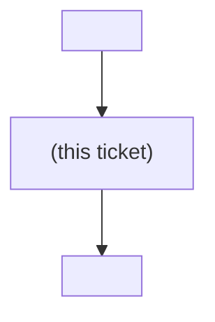

# Decision-map diagrams Implementation Plan

> **For agentic workers:** REQUIRED SUB-SKILL: Use superpowers:subagent-driven-development (recommended) or superpowers:executing-plans to implement this plan task-by-task. Steps use checkbox (`- [ ]`) syntax for tracking.

**Goal:** Give every Decision ticket a generated position diagram and an authored answer diagram, so a reader sees where a ticket sits and what it decided before reading a word of prose.

**Architecture:** One renderer in `map_core.py` produces a `decision-map:graph` region; both backends call it when an edge changes, writing *both* ends of that edge. The answer diagram is a `work-map` SKILL.md instruction, because only the agent sees the answer. A gist over 200 characters warns on stderr and is written anyway.

**Tech Stack:** Python 3 (stdlib only), pytest, Markdown + Mermaid.

## Global Constraints

- **Spec:** `docs/superpowers/specs/2026-08-03-decision-map-diagrams-design.md`. **Decisions:** ADR 0063–0066 in `docs/adr/`.
- **Shared rules live in `map_core.py` only.** Anything both backends must agree on goes there — ADR 0062. Never implement the renderer twice.
- **Determinism is load-bearing.** Every list rendered into a diagram is sorted key-ascending. A non-deterministic renderer breaks the byte-identical no-op that makes a partially-failed `chart` resumable.
- **Escape LAST: flatten, then escape, never the other way round.** Nothing may transform a string after `scrub`/`one_line` has run.
- **No status, no assignee, no colour in a generated diagram** — ADR 0064.
- **Run all tests from `plugins/decision-map/scripts/`:** `python -m pytest test_local_map_ops.py test_github_map_ops.py -q`
- **Baseline before you start:** 84 tests in `test_local_map_ops.py`, 87 in `test_github_map_ops.py`. Record the actual pass/fail counts on your first run and assert them unchanged except for tests this plan adds.
- **Version:** `0.5.0` → `0.6.0`, in `plugins/decision-map/.claude-plugin/plugin.json` **and** the `decision-map` entry of `.claude-plugin/marketplace.json`. They must always match.

---

### Task 1: The shared renderer and its markers

**Files:**
- Modify: `plugins/decision-map/scripts/map_core.py:76-99` (markers and region tuples)
- Modify: `plugins/decision-map/scripts/map_core.py` (append `position_diagram_region` and `GIST_MAX` near the other shared helpers)
- Test: `plugins/decision-map/scripts/test_local_map_ops.py`

**Interfaces:**
- Consumes: nothing.
- Produces:
  - `map_core.GRAPH_START` / `GRAPH_END` — the region marker strings.
  - `map_core.position_diagram_region(key: str, parents: list[str], children: list[str]) -> str` — the full region text including both markers and a trailing newline.
  - `map_core.GIST_MAX: int` = `200`.
  - `map_core.GIST_TOO_LONG: str` — the warning template both backends print, so the two cannot word it differently.
  - `TICKET_REGIONS` and `TRACKER_TICKET_REGIONS` each gain the graph pair.

- [ ] **Step 1: Write the failing test**

Append to `test_local_map_ops.py` (top-level, alongside the existing test classes):

```python
class PositionDiagramTests(unittest.TestCase):
    def test_renders_parents_self_and_children_sorted(self):
        r = map_core.position_diagram_region(
            "carve-core-api", ["zeta-blocker", "alpha-blocker"], ["downstream-one"])
        self.assertEqual(r, (
            "<!-- decision-map:graph:start -->\n"
            "```mermaid\n"
            "graph TD\n"
            '    ME["carve-core-api (this ticket)"]\n'
            '    P0["alpha-blocker"] --> ME\n'
            '    P1["zeta-blocker"] --> ME\n'
            '    ME --> C0["downstream-one"]\n'
            "```\n"
            "<!-- decision-map:graph:end -->\n"))

    def test_a_ticket_with_no_edges_renders_a_single_node(self):
        r = map_core.position_diagram_region("lonely", [], [])
        self.assertIn('    ME["lonely (this ticket)"]\n```', r)
        self.assertNotIn("-->", r)

    def test_render_is_deterministic_regardless_of_input_order(self):
        a = map_core.position_diagram_region("k", ["b", "a"], ["d", "c"])
        b = map_core.position_diagram_region("k", ["a", "b"], ["c", "d"])
        self.assertEqual(a, b, "input order must not change the bytes written")

    def test_duplicate_edges_collapse(self):
        r = map_core.position_diagram_region("k", ["a", "a"], [])
        self.assertEqual(r.count('"a"'), 1)

    def test_the_graph_region_is_declared_on_both_ticket_region_tuples(self):
        pair = (map_core.GRAPH_START, map_core.GRAPH_END)
        self.assertIn(pair, map_core.TICKET_REGIONS)
        self.assertIn(pair, map_core.TRACKER_TICKET_REGIONS)
```

Confirm `test_local_map_ops.py` already imports `map_core`; if it imports only `local_map_ops`, add `import map_core` beside it.

- [ ] **Step 2: Run test to verify it fails**

Run: `python -m pytest test_local_map_ops.py::PositionDiagramTests -v`
Expected: FAIL with `AttributeError: module 'map_core' has no attribute 'position_diagram_region'`

- [ ] **Step 3: Write minimal implementation**

In `map_core.py`, after the `GIST_START`/`GIST_END` block (currently line 90):

```python
GRAPH_START = "<!-- decision-map:graph:start -->"
GRAPH_END = "<!-- decision-map:graph:end -->"
```

Replace the two ticket-region tuples (currently lines 95-99):

```python
TICKET_REGIONS = ((RESOLUTION_START, RESOLUTION_END),
                  (GRAPH_START, GRAPH_END))
# A tracker records the resolution as a native comment, so the resolution
# markers are local-only; the gist region is the tracker's machine-readable
# home for the same one-liner the local backend keeps in frontmatter. The
# graph region is shared -- a position diagram is as useful on an issue as
# in a file, and rendering it in one place is what stops the two backends
# drifting the way _MAP_DIAGRAM already has.
TRACKER_TICKET_REGIONS = ((GIST_START, GIST_END),
                          (GRAPH_START, GRAPH_END))
```

Add near `FORCE_COST`:

```python
# The longest gist that still reads as ONE line in the map's decisions index,
# which is what the index renders it as. Over this, resolve() warns and writes
# anyway (ADR 0066): failing the call would discard a resolved decision to
# enforce a formatting rule.
GIST_MAX = 200

# One wording, printed by both backends. A user who moves a map from local
# to GitHub must not get a different explanation of the same problem.
GIST_TOO_LONG = (
    "warning: this gist is {n} characters. The map's 'Decisions so far' "
    "index renders it as ONE line, so anything past ~{max} makes the index "
    "unreadable. Recording it anyway -- consider re-resolving with a "
    "one-sentence gist and moving the detail into --body-file or --link.")
```

Add with the other render helpers (near `render_map_body`):

```python
def position_diagram_region(key, parents, children):
    """A ticket's position: its blockers, itself, and what it unblocks.

    Three levels and no more (ADR 0063) -- a map may legally hold 100 tickets
    and a whole-map graph is unreadable long before that. Structure only, never
    status or assignee (ADR 0064): a stale "open" on a blocker that has since
    closed tells the reader they cannot pick the ticket up when they can, which
    is the absence-read-as-a-fact shape ADR 0061 exists to prevent.

    Node ids are positional (P0, C0, ...), NOT derived from the key: Mermaid
    ids cannot contain "-", and mapping "-" to "_" would collide "a-b" with
    "a_b", both of which are legal keys.

    Sorted, and de-duplicated, because the bytes this returns are compared for
    equality by the byte-identical no-op guarantee. An unsorted render would
    make an identical re-chart report a spurious change.
    """
    ps, cs = sorted(set(parents)), sorted(set(children))
    lines = ["```mermaid", "graph TD", f'    ME["{key} (this ticket)"]']
    lines += [f'    P{i}["{p}"] --> ME' for i, p in enumerate(ps)]
    lines += [f'    ME --> C{i}["{c}"]' for i, c in enumerate(cs)]
    lines.append("```")
    return GRAPH_START + "\n" + "\n".join(lines) + "\n" + GRAPH_END + "\n"
```

Keys are validated against `SAFE_SLUG_RE` (`[A-Za-z0-9][A-Za-z0-9_-]*`) everywhere they are minted, so no key can carry a quote or bracket that would break a label. Do not put a ticket **title** in a node label — a title is free text.

- [ ] **Step 4: Run test to verify it passes**

Run: `python -m pytest test_local_map_ops.py::PositionDiagramTests -v`
Expected: PASS, 5 tests

Then run the full suite: `python -m pytest test_local_map_ops.py test_github_map_ops.py -q`
Expected: the recorded baseline plus 5. **If any pre-existing test now fails, stop** — adding a region to `TICKET_REGIONS` changes what `assert_regions` accounts for, and a failure here means an existing document shape is now rejected. Fix that before continuing.

- [ ] **Step 5: Commit**

```bash
git add plugins/decision-map/scripts/map_core.py plugins/decision-map/scripts/test_local_map_ops.py
git commit -m "feat(decision-map): add the shared position-diagram renderer and its region markers"
```

---

### Task 2: Emit the region on ticket creation, and insert it into legacy tickets

**Files:**
- Modify: `plugins/decision-map/scripts/local_map_ops.py` (imports; new helpers; ticket creation at `:393-396`)
- Test: `plugins/decision-map/scripts/test_local_map_ops.py`

**Interfaces:**
- Consumes: `map_core.position_diagram_region`, `map_core.GRAPH_START`, `map_core.GRAPH_END` (Task 1).
- Produces:
  - `_children_of(root, slug, key) -> list[str]` — every ticket whose `blocked_by` names `key`.
  - `_graph_region_for(root, slug, key) -> str` — the rendered region for one ticket.
  - `map_core.set_graph_region(body, region) -> str` — replace the region if present, else insert it above `## Question`, else prepend. **It lives in `map_core`, not in the backend**: both backends must apply the same insert rule, and the GitHub backend calls it in Task 6. `local_map_ops` binds it as `_set_graph_region` in its existing import block, like every other `map_core` name.

- [ ] **Step 1: Write the failing test**

```python
class GraphRegionOnTicketTests(MapOpsTestCase):
    def test_a_created_ticket_carries_a_graph_region_above_the_question(self):
        self._chart()
        text = (self.root / "example-effort" / "tickets" / "api-limits.md").read_text(
            encoding="utf-8")
        self.assertIn(map_core.GRAPH_START, text)
        self.assertIn(map_core.GRAPH_END, text)
        self.assertLess(text.index(map_core.GRAPH_START), text.index("## Question"),
                        "the position must be visible before the prose")
        self.assertIn('ME["api-limits (this ticket)"]', text)

    def test_set_graph_region_inserts_above_question_on_a_legacy_ticket(self):
        legacy = "\n## Question\n\nold body\n"
        out = ops._set_graph_region(legacy, "<!-- decision-map:graph:start -->\nX\n"
                                            "<!-- decision-map:graph:end -->\n")
        self.assertLess(out.index("decision-map:graph:start"), out.index("## Question"))
        self.assertIn("old body", out, "legacy content must survive untouched")

    def test_set_graph_region_replaces_an_existing_region_and_touches_nothing_else(self):
        body = ("<!-- decision-map:graph:start -->\nOLD\n<!-- decision-map:graph:end -->\n"
                "\n## Question\n\nkeep me\n")
        out = ops._set_graph_region(body, "<!-- decision-map:graph:start -->\nNEW\n"
                                          "<!-- decision-map:graph:end -->\n")
        self.assertIn("NEW", out)
        self.assertNotIn("OLD", out)
        self.assertIn("keep me", out)

    def test_children_of_finds_every_ticket_naming_this_one_as_a_blocker(self):
        self._chart()
        ops.block(self.root, "example-effort", "api-limits", "auth-model")
        self.assertEqual(ops._children_of(self.root, "example-effort", "auth-model"),
                         ["api-limits"])
```

`MapOpsTestCase` / `self._chart()` are the existing base class and helper in this file — reuse them rather than building fixtures.

- [ ] **Step 2: Run test to verify it fails**

Run: `python -m pytest test_local_map_ops.py::GraphRegionOnTicketTests -v`
Expected: FAIL — `module 'local_map_ops' has no attribute '_set_graph_region'`

- [ ] **Step 3: Write minimal implementation**

Add `GRAPH_START`, `GRAPH_END`, `position_diagram_region` to the existing `from map_core import (...)` block, aliased the way that file aliases the others (`_GRAPH_START`, etc. — match the local convention exactly; check how `_RESOLUTION_START` is bound).

Add beside `_RESOLUTION_BLOCK_RE`:

```python
_GRAPH_BLOCK_RE = _region_re(_GRAPH_START, _GRAPH_END)
```

Add after `_all_tickets`:

```python
def _children_of(root, slug, key):
    """Every ticket this one unblocks -- i.e. whose blocked_by names it.

    A ticket's parents are in its own frontmatter, but its children are only
    discoverable by looking at everyone else, so rendering either end of the
    diagram costs a scan of the map. That is the price of drawing children at
    all (spec 1, "Both ends"); on the GitHub backend the same information is
    already in the snapshot and costs nothing.
    """
    out = []
    for other in _all_tickets(root, slug):
        if other == key:
            continue
        fm, _ = _load_ticket(root, slug, other)
        if key in fm.get("blocked_by", []):
            out.append(other)
    return sorted(out)


def _graph_region_for(root, slug, key):
    fm, _ = _load_ticket(root, slug, key)
    return _position_diagram_region(key, fm.get("blocked_by", []),
                                    _children_of(root, slug, key))


def set_graph_region(body, region):   # <- in map_core.py, NOT local_map_ops
    """Replace the graph region, or insert one into a ticket that predates it.

    Insertion goes ABOVE "## Question" so the reader sees the position first.
    A ticket with neither a region nor a Question heading gets the region
    prepended -- never guess at the boundary of content the tool did not
    write, the same conservative rule _reindex_decisions applies to a legacy
    map.md.
    """
    block_re = region_re(GRAPH_START, GRAPH_END)
    if block_re.search(body):
        return block_re.sub(lambda _m: region.rstrip("\n"), body, count=1)
    heading = "## Question"
    if heading in body:
        return body.replace(heading, region + "\n" + heading, 1)
    return region + body
```

Note the `.rstrip("\n")` on the substitution: `_GRAPH_BLOCK_RE` matches through the end marker, and `region` carries a trailing newline that the surrounding text already supplies. Verify against how `_RESOLUTION_BLOCK_RE.sub` is called in `resolve()` and match it; if that one substitutes the trailing newline in, do the same here and drop the `rstrip`.

Change ticket creation (currently `local_map_ops.py:395-396`):

```python
        _save_ticket(root, slug, t["key"], fm,
                     f"\n{_position_diagram_region(t['key'], [], [])}"
                     f"\n## Question\n\n{_scrub(t['question'])}\n")
```

A ticket is created before its edges are wired (`chart` pass 1, then pass 2), so it is created edge-less on purpose; Task 3 makes `block()` re-render it in pass 2.

- [ ] **Step 4: Run test to verify it passes**

Run: `python -m pytest test_local_map_ops.py -q`
Expected: `GraphRegionOnTicketTests` passes (4 tests).

**Expect `test_additive_chart_unions_a_new_edge_into_an_existing_ticket` to fail now** — that is Task 3's job and is exactly the assertion the spec says must be updated, not deleted. Leave it failing until Task 3.

- [ ] **Step 5: Commit**

```bash
git add plugins/decision-map/scripts/local_map_ops.py plugins/decision-map/scripts/test_local_map_ops.py
git commit -m "feat(decision-map): emit a position-diagram region on every ticket, with a legacy insert path"
```

---

### Task 3: `block()` re-renders both ends of the edge

**Files:**
- Modify: `plugins/decision-map/scripts/local_map_ops.py:471-499` (`block`)
- Modify: `plugins/decision-map/scripts/test_local_map_ops.py:936-984` (update the union test)
- Test: same file

**Interfaces:**
- Consumes: `_graph_region_for`, `_set_graph_region` (Task 2).
- Produces: `block()` writes two ticket files when it writes at all; still writes nothing when the edge already exists.

- [ ] **Step 1: Write the failing test**

Add:

```python
    def test_block_renders_the_edge_at_both_ends(self):
        self._chart()
        ops.block(self.root, "example-effort", "api-limits", "auth-model")
        base = self.root / "example-effort" / "tickets"
        blocked = (base / "api-limits.md").read_text(encoding="utf-8")
        blocker = (base / "auth-model.md").read_text(encoding="utf-8")
        self.assertIn('P0["auth-model"] --> ME', blocked,
                      "the blocked ticket shows its blocker as a parent")
        self.assertIn('ME --> C0["api-limits"]', blocker,
                      "the blocker shows what it unblocks as a child")

    def test_re_blocking_an_existing_edge_writes_nothing(self):
        self._chart()
        ops.block(self.root, "example-effort", "api-limits", "auth-model")
        frozen = _snapshot(self.root / "example-effort")
        ops.block(self.root, "example-effort", "api-limits", "auth-model")
        self.assertEqual(_snapshot(self.root / "example-effort"), frozen)
```

Now update `test_additive_chart_unions_a_new_edge_into_an_existing_ticket`. Replace **only** the scoped-identity block at `:963-972`:

```python
        # scoped identity: the blocked_by line changed, and so did the graph
        # region -- an edge is drawn at both of its ends (ADR 0064), so this
        # test no longer pins "exactly one line". What it still pins is the
        # thing that matters: recorded state survives a union.
        b_lines, a_lines = before_text.splitlines(), after_text.splitlines()
        differing = [i for i, (x, y) in enumerate(zip(b_lines, a_lines)) if x != y]
        changed = [a_lines[i] for i in differing]
        self.assertTrue(any(ln.startswith("blocked_by:") for ln in changed),
                        f"blocked_by must be among the changed lines, got {changed}")
        self.assertNotIn("blocked_by: []", after_text)
        self.assertIn("blocked_by: [fog-graduate]", after_text)
        for ln in changed:
            self.assertFalse(ln.startswith(("title:", "type:", "mode:", "status:",
                                            "assignee:", "gist:")),
                             f"a union must not touch {ln!r}")
```

And replace the every-other-ticket assertion at `:976-979`:

```python
        # every other ticket is byte-identical EXCEPT the blocker end, whose
        # graph region gains this ticket as a child
        for path, digest in before_tree.items():
            if path in ("tickets/api-limits.md", "tickets/fog-graduate.md"):
                continue
            self.assertEqual(_snapshot(base)[path], digest, f"{path} changed")
        blocker_text = (base / "tickets" / "fog-graduate.md").read_text(encoding="utf-8")
        self.assertIn('ME --> C0["api-limits"]', blocker_text)
```

Leave `:940-962` (the recorded-state setup and the frontier assertions), `:973-975` and `:980-984` (the byte-identical re-union) **exactly as they are**. They are the assertions this change must not weaken.

- [ ] **Step 2: Run test to verify it fails**

Run: `python -m pytest test_local_map_ops.py -q -k "block_renders or unions_a_new_edge"`
Expected: FAIL — the blocker end carries no child edge yet.

- [ ] **Step 3: Write minimal implementation**

Replace the write branch of `block()` (currently `:495-499`):

```python
    if blocked_by not in deps:
        deps.append(blocked_by)
        fm["blocked_by"] = deps
        _save_ticket(root, slug, ticket, fm,
                     _set_graph_region(body, _graph_region_for_deps(
                         ticket, deps, _children_of(root, slug, ticket))))
        # BOTH ends: the edge is a parent in `ticket` and a child in
        # `blocked_by`, so the blocker's own diagram is now stale. Its
        # frontmatter is untouched -- only the region is re-rendered.
        b_fm, b_body = _load_ticket(root, slug, blocked_by)
        _save_ticket(root, slug, blocked_by, b_fm,
                     _set_graph_region(b_body,
                                       _graph_region_for(root, slug, blocked_by)))
    return {"ticket": ticket, "blockedBy": deps}
```

`ticket`'s own region must be rendered from the **in-memory** `deps`, because the file on disk is not written yet — hence a second small helper beside `_graph_region_for`:

```python
def _graph_region_for_deps(key, parents, children):
    """Render from values held in memory, for a ticket mid-update whose file
    on disk is still stale."""
    return _position_diagram_region(key, parents, children)
```

Order matters: compute `_children_of(root, slug, ticket)` **before** writing `blocked_by`, and compute the blocker's region **after** `ticket` is written, so the scan sees the new edge.

- [ ] **Step 4: Run test to verify it passes**

Run: `python -m pytest test_local_map_ops.py -q`
Expected: all pass, including `test_rechart_identical_input_is_a_byte_identical_no_op` — **that one must pass unchanged.** If it fails, the renderer is non-deterministic; fix the sort, do not touch the test.

- [ ] **Step 5: Commit**

```bash
git add plugins/decision-map/scripts/local_map_ops.py plugins/decision-map/scripts/test_local_map_ops.py
git commit -m "feat(decision-map): render a blocking edge at both of its ends"
```

---

### Task 4: The dry-run plan announces the blocker end

**Files:**
- Modify: `plugins/decision-map/scripts/local_map_ops.py:336-355` (the `pending` loop in `_chart_plan`)
- Test: `plugins/decision-map/scripts/test_local_map_ops.py`

**Interfaces:**
- Consumes: nothing new.
- Produces: a `merge` plan entry, with a non-null `detail`, for every existing blocker whose diagram gains a child.

- [ ] **Step 1: Write the failing test**

```python
    def test_the_plan_announces_the_blocker_end_of_a_new_edge(self):
        self._chart()
        plan = ops.chart(self.root, self._plus_ticket(blocks=["api-limits"]), real=False)
        by_path = {p["path"]: p for p in plan["planned"]}
        blocked = next(v for k, v in by_path.items() if k.endswith("api-limits.md"))
        self.assertEqual(blocked["action"], "merge")
        self.assertIn("unions blockedBy", blocked["detail"])
        # the plan must name EVERY file the real run writes -- that is the
        # whole value of the ADR-0039 gate
        self.assertTrue(any(k.endswith("fog-graduate.md") for k in by_path),
                        f"the blocker end is missing from the plan: {list(by_path)}")

    def test_no_merge_entry_may_carry_a_null_detail(self):
        self._chart()
        plan = ops.chart(self.root, self._plus_ticket(blocks=["api-limits"]), real=False)
        for e in plan["planned"]:
            if e["action"] == "merge":
                self.assertIsNotNone(e["detail"], f"undescribed write: {e['path']}")
```

- [ ] **Step 2: Run test to verify it fails**

Run: `python -m pytest test_local_map_ops.py -q -k "announces_the_blocker_end or null_detail"`
Expected: FAIL — the blocker end is absent from `planned`.

- [ ] **Step 3: Write minimal implementation**

In `_chart_plan`, after the existing `for p, blockers in pending.items():` loop (which ends at `:354`), add:

```python
    # The blocker end of every edge the run will write. An edge is drawn at
    # both of its ends (ADR 0064), so the blocker's file is modified too --
    # and nothing the run writes may be missing from the plan. A blocker that
    # is itself being created or overwritten already carries the edge in its
    # own line, so it is skipped here.
    blocker_gains = {}
    for t in inp["tickets"]:
        for blocked in t.get("blocks") or []:
            if action_by_key.get(t["key"]) in ("create", "OVERWRITE"):
                continue
            bp = _ticket_path(root, slug, t["key"])
            if not bp.exists():
                continue
            fm, _ = _load_ticket(root, slug, blocked)
            if t["key"] in fm.get("blocked_by", []):
                continue                      # edge already there: no write
            gained = blocker_gains.setdefault(bp, [])
            if blocked not in gained:
                gained.append(blocked)
    for p, gained in blocker_gains.items():
        entry = by_path.get(p)
        if entry is None:
            entry = {"path": p, "action": "skip (exists)", "detail": None}
            entries.append(entry)
            by_path[p] = entry
        if entry["action"] in ("create", "OVERWRITE"):
            continue
        entry["action"] = "merge"
        detail = "renders as a child in the graph: " + ", ".join(sorted(gained))
        entry["detail"] = (entry["detail"] + "; " + detail) if entry["detail"] else detail
```

- [ ] **Step 4: Run test to verify it passes**

Run: `python -m pytest test_local_map_ops.py -q`
Expected: all pass. Also eyeball a dry run by hand and read the stderr rendering:

```bash
python local_map_ops.py chart --input <a map_input.json with an edge onto an existing ticket> --output /dev/null
```
Expected: one `merge` line per touched ticket, each with a bracketed detail.

- [ ] **Step 5: Commit**

```bash
git add plugins/decision-map/scripts/local_map_ops.py plugins/decision-map/scripts/test_local_map_ops.py
git commit -m "feat(decision-map): announce the blocker end of a new edge in the dry-run plan"
```

---

### Task 5: `resolve` warns on an over-long gist

**Files:**
- Modify: `plugins/decision-map/scripts/local_map_ops.py:575-591` (`resolve`)
- Test: `plugins/decision-map/scripts/test_local_map_ops.py`

**Interfaces:**
- Consumes: `map_core.GIST_MAX` (Task 1).
- Produces: one stderr line when `len(_fm_value(gist)) > GIST_MAX`. Exit code and return shape unchanged.

- [ ] **Step 1: Write the failing test**

```python
    def test_an_over_long_gist_warns_but_is_still_recorded(self):
        self._chart()
        long_gist = "x" * (map_core.GIST_MAX + 1)
        err = io.StringIO()
        with contextlib.redirect_stderr(err):
            out = ops.resolve(self.root, "example-effort", "auth-model",
                              long_gist, None, None)
        self.assertIn("warning:", err.getvalue())
        self.assertIn(str(map_core.GIST_MAX), err.getvalue())
        self.assertEqual(out["resolved"], "auth-model")
        text = (self.root / "example-effort" / "tickets" / "auth-model.md").read_text(
            encoding="utf-8")
        self.assertIn(long_gist, text, "the answer is recorded regardless (ADR 0066)")

    def test_a_short_gist_warns_about_nothing(self):
        self._chart()
        err = io.StringIO()
        with contextlib.redirect_stderr(err):
            ops.resolve(self.root, "example-effort", "auth-model", "short answer",
                        None, None)
        self.assertNotIn("warning:", err.getvalue())
```

Add `import io` and `import contextlib` at the top of the test file if absent.

- [ ] **Step 2: Run test to verify it fails**

Run: `python -m pytest test_local_map_ops.py -q -k "over_long_gist or short_gist"`
Expected: FAIL — nothing is written to stderr.

- [ ] **Step 3: Write minimal implementation**

At the top of `resolve()`, immediately after `fm, tbody = _load_ticket(...)`:

```python
    flat = _fm_value(gist)
    if len(flat) > _GIST_MAX:
        print(_GIST_TOO_LONG.format(n=len(flat), max=_GIST_MAX), file=sys.stderr)
```

Bind `_GIST_MAX` and `_GIST_TOO_LONG` from `map_core` in the existing import block.

- [ ] **Step 4: Run test to verify it passes**

Run: `python -m pytest test_local_map_ops.py -q`
Expected: all pass.

- [ ] **Step 5: Commit**

```bash
git add plugins/decision-map/scripts/local_map_ops.py plugins/decision-map/scripts/test_local_map_ops.py
git commit -m "feat(decision-map): warn when a gist is too long for the map index"
```

---

### Task 6: GitHub backend parity

**Files:**
- Modify: `plugins/decision-map/scripts/github_map_ops.py:622-632` (`render_ticket_issue_body`)
- Modify: `plugins/decision-map/scripts/github_map_ops.py:1130-1150` (`_ensure_edge`)
- Modify: `plugins/decision-map/scripts/github_map_ops.py:1264-1298` (`resolve`)
- Test: `plugins/decision-map/scripts/test_github_map_ops.py`

**Interfaces:**
- Consumes: `map_core.position_diagram_region`, `GRAPH_START`, `GRAPH_END`, `GIST_MAX` (Task 1); `Snapshot.blockers_of` / `Snapshot.keys` (existing).
- Produces: an issue body carrying the graph region; `_ensure_edge` patching both issues' bodies.

- [ ] **Step 1: Write the failing test**

Add to `test_github_map_ops.py`, using the existing `fake_github` harness the other tests use:

```python
    def test_a_created_ticket_issue_body_carries_a_graph_region(self):
        body = gh.render_ticket_issue_body("auth-model", "why?")
        self.assertIn(map_core.GRAPH_START, body)
        self.assertIn('ME["auth-model (this ticket)"]', body)
        self.assertLess(body.index(map_core.GRAPH_START),
                        body.index(map_core.GIST_START),
                        "position before the machine-readable gist region")

    def test_adding_a_dependency_patches_both_issue_bodies(self):
        # INPUT already wires auth-model -> rollout-order, so chart() alone
        # must leave both ends rendered
        out = self.chart()
        by_key = {t["key"]: int(t["id"]) for t in out["tickets"]}
        blocked = self.fake.issue(by_key["rollout-order"])["body"]
        blocker = self.fake.issue(by_key["auth-model"])["body"]
        self.assertIn('P0["auth-model"] --> ME', blocked,
                      "the blocked issue shows its blocker as a parent")
        self.assertIn('ME --> C0["rollout-order"]', blocker,
                      "the blocker issue shows what it unblocks as a child")

    def test_an_over_long_gist_warns_on_the_tracker_too(self):
        self.chart()
        with captured_stderr() as err:
            gh.resolve(self.ops, "billing", "auth-model",
                       "y" * (map_core.GIST_MAX + 1), None, None)
        self.assertIn("warning:", err.getvalue())
        self.assertIn(str(map_core.GIST_MAX), err.getvalue())
```

Put these in a new `class TestPositionDiagram(Base):` — `Base` already provides
`self.fake`, `self.ops`, `self.chart()` and the `billing` fixture map whose two
tickets are `auth-model` and `rollout-order`. `captured_stderr` and `map_core`
are already imported at the top of that file.

- [ ] **Step 2: Run test to verify it fails**

Run: `python -m pytest test_github_map_ops.py -q -k "graph_region or both_issue_bodies or over_long_gist"`
Expected: FAIL.

- [ ] **Step 3: Write minimal implementation**

`render_ticket_issue_body` — the region goes above the Question, edge-less at creation exactly as on local:

```python
def render_ticket_issue_body(key, question):
    """The ticket issue body: key marker, position diagram, the question, an
    empty gist region.

    Every region is written at creation rather than inserted later, for the
    reason the local backend does the same: a writer that has to decide
    *where* a region goes is guessing at the boundary of content it did not
    write, which is exactly the pattern that cost three review rounds.
    """
    return (f"{KEY_MARKER % key}\n\n{position_diagram_region(key, [], [])}\n"
            f"## Question\n\n{scrub(question)}\n\n"
            f"{GIST_START}\n{GIST_END}\n")
```

`_ensure_edge` — after the dependency write succeeds, patch both bodies. The snapshot already holds every child's body and dependency edges, so no extra reads are needed; recompute parents from `snap.blockers_of(key)` and children by scanning `snap.keys()` for tickets whose blockers include `key`. Add a module-level helper mirroring the local one:

```python
def _children_of(snap, key):
    return sorted(k for k in snap.keys()
                  if k != key and key in snap.blockers_of(k))
```

and patch each body with `map_core.set_graph_region` (Task 2) — the same replace-or-insert rule the local backend uses, called rather than reimplemented.

`resolve` — add the same gist warning Task 5 added, by formatting `map_core.GIST_TOO_LONG` (defined in Task 1). Do not retype the sentence: the two backends must print byte-identical text.

- [ ] **Step 4: Run test to verify it passes**

Run: `python -m pytest test_local_map_ops.py test_github_map_ops.py -q`
Expected: everything passes. The local suite must not regress when `_set_graph_region` moves into `map_core`.

- [ ] **Step 5: Commit**

```bash
git add plugins/decision-map/scripts/
git commit -m "feat(decision-map): position diagram and gist warning on the GitHub backend"
```

---

### Task 7: Update the data contract

**Files:**
- Modify: `plugins/decision-map/references/data-contracts.md` — lines `887-892` (marker table), `1012-1028` (ticket format), `1044-1056` (generated regions), `1030-1042` (resolution format), `220-241` (merge detail vocabulary), `1096-1100` (shared-marker list)

**Interfaces:**
- Consumes: the behaviour shipped in Tasks 1-6.
- Produces: no code. This file is the single source of truth; a stale contract is how the next implementer builds the wrong thing.

- [ ] **Step 1: Update the ticket file format**

In the `tickets/<slug>.md` block (currently `:1014-1028`), insert above `## Question`:

```markdown
<!-- decision-map:graph:start -->

<!-- decision-map:graph:end -->
```

- [ ] **Step 2: Correct the region count and the additive guarantee**

At `:1046`, "**Four spans** of a local file are generated regions" becomes **Five**, and the enumeration gains the graph region in `tickets/<slug>.md`.

At `:1051-1056`, replace the "exactly one line changes" claim:

> It leaves a ticket file byte-identical too **unless the ticket gains a blocking edge**, in which case its frontmatter `blocked_by:` line and its `graph` region are both re-rendered (ADR 0058, ADR 0064) — and every other byte, including the resolution region, the claim and the gist, is untouched. **An edge is written at both of its ends**, so the blocker's file is re-rendered too; its frontmatter is not touched at all. A ticket at neither end of a new edge is not opened for writing.

Then restate, unchanged, the guarantee that still holds: nothing recorded is ever removed, reordered or overwritten, and re-running identical input is a byte-identical no-op.

- [ ] **Step 3: Extend the merge detail vocabulary**

In the dry-run action table (`:220-241`), add the blocker-end example beside `unions blockedBy: fog-graduate`:

> `renders as a child in the graph: api-limits` on a blocker whose diagram gains an entry

- [ ] **Step 4: Add `graph` to the shared-marker list**

Two places say the shared markers are `key`, `gist`, `fog`, `scope`, `decisions` — `:912-915` and `:1096-1100`. Both gain `graph`, and both keep the sentence that only the **resolution** markers are local-only.

- [ ] **Step 5: Self-check and commit**

Re-read your diff and confirm no sentence in the file still claims a ticket changes by exactly one line.

```bash
git add plugins/decision-map/references/data-contracts.md
git commit -m "docs(decision-map): contract covers the graph region and the both-ends write"
```

---

### Task 8: The answer diagram and the sharpened gist wording

**Files:**
- Modify: `plugins/decision-map/skills/work-map/SKILL.md:280-316` (Step 4)
- Modify: `plugins/decision-map/skills/chart-map/SKILL.md` (one sentence, where it describes what a created ticket contains)

**Interfaces:**
- Consumes: nothing — this is instruction text.
- Produces: the rule the agent follows at resolve time. The scripts never see the answer, so this is the only place it can live.

- [ ] **Step 1: Sharpen the gist wording**

Replace the sentence at `work-map/SKILL.md:303-305`:

> `--gist` is required either way (without it: exit `2`, one line on stderr). It is flattened to a single line and it is what the map's index shows, so make it **one sentence that answers the question** — not one paragraph, and not a topic. `resolve` warns on stderr past 200 characters and records it anyway; the warning means the map index is now unreadable, not that the answer was rejected. Detail belongs in `--body-file` or behind `--link`, never in the gist.

- [ ] **Step 2: Add the answer-diagram rule**

Insert into Step 4, after the two `resolve` shapes and before the `--link`/`--body-file` paragraph:

> **Every resolution opens with one Mermaid diagram of the ANSWER** (ADR 0065) — the structure the decision creates, not the options weighed and not the process followed. A reader who opens a closed ticket should see what was decided before reading a word of prose.
>
> Match the diagram to the ticket's own `type`:
>
> | `type` | diagram | what it shows |
> |---|---|---|
> | `grilling` | `flowchart TD` | the chosen shape and what it displaces |
> | `research` | `graph TD`, or `erDiagram` for a real data model | the structure that was found |
> | `prototype` | `sequenceDiagram` if the answer is a call order, else `graph TD` | the seam that was built |
> | `task` | `graph TD` | before → after |
>
> A ticket resolving with `--link` alone still draws one, and it is **not** a copy of the ADR's. The subjects differ: the ADR draws *chosen versus rejected* (diagram convention, Rule 3); the ticket draws *what the chosen answer changes*. Two diagrams with two subjects cannot drift into contradicting each other; two copies of one diagram will.
>
> This is separate from the **position diagram** the ops script generates above `## Question` — that one is the ticket's place in the map, and you never author or edit it.

- [ ] **Step 3: One sentence in chart-map**

Where `chart-map/SKILL.md` describes what a created ticket holds, note that each ticket is created carrying a generated position-diagram region, and that it is tool-owned.

- [ ] **Step 4: Verify harness-neutrality**

Both edits must stay harness-neutral per the repo convention — name actions, not one harness's tool. Check the new text mentions no Claude-Code-specific mechanism, and uses no `${CLAUDE_PLUGIN_ROOT}` shape outside `/references/…`, `/scripts/…`, `/skills/…`.

- [ ] **Step 5: Commit**

```bash
git add plugins/decision-map/skills/
git commit -m "docs(decision-map): resolutions open with a diagram of the answer; sharpen the gist rule"
```

---

### Task 9: Version bump and final verification

**Files:**
- Modify: `plugins/decision-map/.claude-plugin/plugin.json` (`version`)
- Modify: `.claude-plugin/marketplace.json` (the `decision-map` entry's `version`)

- [ ] **Step 1: Re-mint the version from the global max**

Do not read `0.5.0` and add one from this checkout alone — the same trap as ADR numbering. Check every ref:

```bash
cd "$(git rev-parse --show-toplevel)"
git for-each-ref --format='%(refname:short)' refs/heads refs/remotes |
  while IFS= read -r r; do
    git show "$r:plugins/decision-map/.claude-plugin/plugin.json" 2>/dev/null |
      grep '"version"'
  done | sort -u
```

Expected: `0.5.0` everywhere. Target: `0.6.0` (new feature, backwards-compatible).

- [ ] **Step 2: Set both files to the same value**

Set `"version": "0.6.0"` in `plugins/decision-map/.claude-plugin/plugin.json` and in the `decision-map` object of `.claude-plugin/marketplace.json`.

- [ ] **Step 3: Verify they match**

```bash
python -c "import json,io; a=json.load(io.open('plugins/decision-map/.claude-plugin/plugin.json',encoding='utf-8'))['version']; d=json.load(io.open('.claude-plugin/marketplace.json',encoding='utf-8')); b=[p for p in d['plugins'] if p['name']=='decision-map'][0]['version']; print(a,b); assert a==b, 'VERSION MISMATCH'"
```
Expected: `0.6.0 0.6.0`

- [ ] **Step 4: Full suite and a real end-to-end run**

```bash
cd plugins/decision-map/scripts && python -m pytest test_local_map_ops.py test_github_map_ops.py -q
```
Expected: baseline count plus every test this plan added, zero failures.

Then chart a throwaway map in a temp directory, resolve one ticket with `--body-file`, and **open the files**. Confirm by eye: the position diagram sits above `## Question`, it names the right neighbours, and the resolution reads as intended. The suite cannot tell you a diagram is *useful*.

- [ ] **Step 5: Commit**

```bash
git add plugins/decision-map/.claude-plugin/plugin.json .claude-plugin/marketplace.json
git commit -m "chore(decision-map): 0.6.0 — ticket position and answer diagrams"
```

---

## Notes for the implementer

- **`docs/adr/0063`–`0066` and the spec are already committed-ready but uncommitted** at plan time. Commit them with Task 1 if they are still untracked: `git add docs/adr/006[3-6]*.md docs/superpowers/specs/2026-08-03-*.md`.
- **Re-run the ADR global-max scan before you merge**, not only now — a parallel session's number becomes visible only then, and git will not flag the collision.
- **The one test you must not "fix" by editing it** is `test_rechart_identical_input_is_a_byte_identical_no_op`. If it fails, the renderer is non-deterministic. Sort harder.
