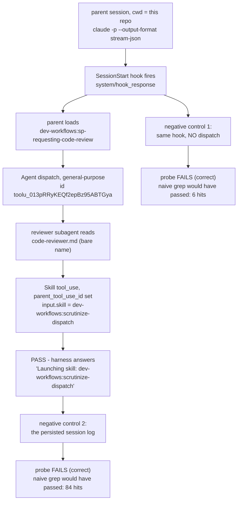

# Acceptance probe result — a dispatched review runs `scrutinize-dispatch`

**Date:** 2026-08-16 · **Claude Code:** 2.1.232 · **Repo:** `C:\Repo2\workflow daily work`
· **Branch:** `claude/route-reviews-to-scrutinize-dispatch` · **HEAD at probe time:** `9a8bfda`
· **Model:** `claude-opus-5[1m]`

This is the Task 7 probe required by
[ADR 0079](../../adr/0079-routing-proof-is-the-dispatch-streams-skill-record-measured-once.md).
It is the only evidence that the six vendored `sp-` skills actually re-point their reviewer
dispatches at the local `scrutinize-dispatch` skill. **Verdict: the acceptance criterion was
met.**



The diagram shows the one chain that constitutes the proof, and the two controls that show
the check discriminates. The signal is the `Skill` record at `K` — written by the harness,
linked to the dispatch by `parent_tool_use_id`, and not authorable by the subagent.

## Step-by-step outcome

| Step | What it checks | Outcome |
|---|---|---|
| 1 | four assertion scripts | **reproduced** — 4 × `PASS`, 0 failures |
| 2 | restart Claude Code | **superseded** — replaced by the headless recipe (addendum Amendment 3) |
| 3 | the control (upstream hook alone) | **NOT RUN** — contaminated; see below |
| 4 | the hook re-points `brainstorming` | **reproduced** — `dev-workflows:sp-brainstorming` |
| 5 | the dispatch loads `scrutinize-dispatch` | **reproduced** — structured `Skill` record observed |
| 6 | record the result | this document |
| 7 | delete the assertion scripts | done, after this document was written |
| 8 | `scrutinize` still frozen | **reproduced** — empty diff |

## Step 1 — the four assertions, recorded before deletion

Run at `9a8bfda`, each script separately with its exit status checked (never piped, so a
failure cannot be masked by a later command's exit code):

```
PASS: scrutinize-dispatch carries all four deltas; scrutinize untouched
PASS: 21 files across six sp- directories, licence present
PASS: rewrite pass classes 1-4 applied
PASS: PLAYBOOK rows, version parity, glossary terms
```

All four exited `0`. **This is the last evidence these checks ever passed** — Step 7 deletes
them.

## The probe check, and why it is not a grep

Task 5's `SessionStart` hook injects the literal string `dev-workflows:scrutinize-dispatch`
into **every** session in this repo (`plugins/dev-workflows/hooks/session-start.py:43`),
whether or not a review is ever dispatched. Any substring search over a stream or a session
log is therefore contaminated. The measured contamination is not theoretical — see the two
negative controls below, where a grep would have reported success with **no review having run
at all**.

The check used instead looks for an `assistant` event that carries a `parent_tool_use_id`
(i.e. a turn belonging to a dispatched subagent, not the parent) and whose content holds a
`tool_use` named `Skill`:

```python
for line in open(path, encoding="utf-8", errors="replace"):
    d = json.loads(line)
    if d.get("type") == "assistant" and d.get("parent_tool_use_id"):
        for c in d["message"]["content"]:
            if c.get("type") == "tool_use" and c["name"] == "Skill":
                print(d["parent_tool_use_id"], c["input"])
```

## Step 5 — the result, and the identifier as observed

The dispatch was driven end-to-end: the prompt asked only for
`dev-workflows:sp-requesting-code-review` to review `f29f945..9a8bfda` and **never mentioned
`scrutinize-dispatch`**, so the routing instruction came from the repo's own
`code-reviewer.md`, not from the probe.

```
Agent dispatch      : toolu_013pRRyKEQf2epBz95ABTGya  subagent_type=general-purpose
parent_tool_use_id  : toolu_013pRRyKEQf2epBz95ABTGya   <- linkage confirmed
Skill tool_use id   : toolu_01HxohXnzJZd5nPDLh32WPDc
input               : {"skill": "dev-workflows:scrutinize-dispatch"}
harness answer      : "Launching skill: dev-workflows:scrutinize-dispatch"
```

**The observed identifier, verbatim: `dev-workflows:scrutinize-dispatch`** — the
**plugin-qualified** form.

This answers the question addendum Amendment 2 left open. The prompt file uses the **bare**
name (`code-reviewer.md:48` and `task-reviewer-prompt.md:104` both say *"Load the
`scrutinize-dispatch` skill"*, per controller Ruling 2, so the files also work on Antigravity
where skills stage flat). **The harness resolved that bare name to the plugin-qualified form
before recording it.** A probe asserting on the bare string would therefore not have matched;
future checks should match on a suffix, not on equality.

The returned report carried these headings — `## Spec Compliance` plus two of the three
severity headings, satisfying the brief's requirement of at least one:

```
## Spec Compliance
## Issues
#### Important (Should Fix)
#### Minor (Nice to Have)
## Recommendations
## Assessment
```

## The negative controls — the probe was seen to fail

A check never seen to fail is not evidence. Two were run, and the probe failed both, while a
naive grep would have passed both.

| # | Run | Hook fired | Dispatches | Probe | Naive grep hits |
|---|---|---|---|---|---|
| 1 | in-repo session, question only, no review | yes (21 hook events) | 0 | **FAIL** (exit 1) | **6** |
| 2 | the persisted session log of the passing Step 5 run | — | 1 | **FAIL** (exit 1) | **84** |

Control 2 is the stronger of the two and is an independent reconfirmation of ADR 0079's
central finding, now on Windows and on 2.1.232 rather than the ADR's Linux / 2.1.233: the
**same run** that produced the PASS above leaves **no** subagent `Skill` record in
`~/.claude/projects/c--Repo2-workflow-daily-work/ace0a157-….jsonl`. The parent's `Agent`
dispatch and the parent's own `Skill` call persist; the subagent's turns do not. The routing
genuinely happened and the persisted log cannot see it — so a real review still cannot be
audited after the fact, and a grep over that log would have claimed otherwise 84 times over.

## Step 3 — the control, honestly: NOT RUN

Attempted per addendum Amendment 4, with the working directory outside this repo
(`…/scratchpad/control-dir`). **The control is contaminated and is recorded as not-run.**

The host `SessionStart` hook fired anyway (`system/hook_response`, hook text present), because
`dev-workflows` is installed at **user** scope and the marketplace is a **directory** source
whose `CLAUDE_PLUGIN_ROOT` resolves into this repo regardless of the session's cwd — so the
hook's six-copy presence test passes from any directory. The run answered
`dev-workflows:sp-brainstorming`, not the `superpowers:brainstorming` a clean control requires.

The premise the control exists to establish is already measured cleanly in
[ADR 0070](../../adr/0070-host-sessionstart-hook-repoints-the-one-skill-the-upstream-hook-names.md):
two runs, same prompt, `superpowers:brainstorming` **twice**, against the upstream hook alone.
That measurement stands; this probe adds nothing to it and does not contradict it.

## Step 4 — the hook: reproduced

Same prompt, cwd inside the repo. Answer:

> `dev-workflows:sp-brainstorming`
>
> "Let's build X" is creative work, so brainstorming comes first — but in this marketplace the
> SessionStart hook re-points that dispatch […]

The `SessionStart` hook is confirmed fired from the stream itself
(`type=system`, `subtype=hook_response`, `hook_event=SessionStart`), and the session listed all
six vendored skills plus `dev-workflows:scrutinize-dispatch` among its 219 skills.

### A recipe defect worth recording

The addendum's recipe specified `--setting-sources project`. Run that way, the init event
reports **`plugins: []`** — no plugins load, so the `SessionStart` hook never fires and not one
`sp-` skill exists in the session. That first run still answered `sp-brainstorming`, but only
because the model **read `PLAYBOOK.md` from the working tree** and inferred it. It would have
been recorded as a pass while proving nothing — the same class of vacuous green the addendum's
Amendment 1 was written to prevent, arriving through a different door.

The fix is `--setting-sources user,project,local`; every run reported here uses it. The
first, discarded run is kept at `probe-runs/step4-hook-in-repo.jsonl` as the counter-example.

## Commands and captured streams

Every run used `env -u CLAUDE_EFFORT -u CLAUDE_SESSION_ID`, a fresh `--session-id` UUID, and
redirection to a file with the bare command's exit status checked:

```bash
env -u CLAUDE_EFFORT -u CLAUDE_SESSION_ID claude -p "<prompt>" \
  --setting-sources user,project,local --output-format stream-json --verbose \
  --include-hook-events --permission-mode acceptEdits --session-id "<uuid>" \
  < /dev/null > <outfile>.jsonl
```

| File (under `.superpowers/sdd/2026-08-16-…-core/probe-runs/`) | Run | Session id |
|---|---|---|
| `step3-control-outside-repo.jsonl` | Step 3 control (contaminated) | `fc62e8d7-…` |
| `step4-hook-in-repo.jsonl` | Step 4, discarded — `--setting-sources project`, no plugins | `3d64581d-…` |
| `step4b-hook-in-repo.jsonl` | Step 4 + negative control 1 | `4c76d988-…` |
| `step5-dispatch.jsonl` | Step 5, the passing run | `ace0a157-…` |

`.superpowers/` is `.gitignore`d, so these streams are local evidence only and are not
committed — which is why every number and quotation this document relies on is reproduced
inline above rather than merely cited.

## Step 8 — the frozen files

- `plugins/dev-workflows/skills/scrutinize/SKILL.md` — `git diff 2524f4c..HEAD` is **empty**.
  Its last commit, `33fb139`, is an ancestor of this plan's base commit, so no commit in this
  plan touched it.
- `plugins/dev-workflows/skills/sp-subagent-driven-development/re-review-prompt.md` — touched
  by exactly **one** commit in this plan, `2aa0d72`, the verbatim vendoring commit that
  created it. No later commit modified it, and it contains **zero** occurrences of
  `scrutinize` — deliberately unrouted, as controller Ruling 5 requires.

## What this probe does not prove

- It stops at the reviewer **loading** the skill. Nothing here watches the controller's
  fix-loop gate actually fire on a routed `Critical` finding — the map's own fog already
  records that gap, and ADR 0076's translation is asserted statically rather than observed.
- The review this probe drove returned `Important` and `Minor` findings only, so even the
  severity path to `Critical` went unexercised.
- **The Antigravity half is untested by this plan.** ADR 0079 records why it is untestable in
  principle: Antigravity ships no CLI, so there is no headless run, no event stream, and no
  `Skill` record to read. This result binds Claude Code only.
- It is **one** run on **one** of the two routed prompt files (`code-reviewer.md`).
  `task-reviewer-prompt.md` carries the same class-1 edit but was not driven live; per ADR
  0079 that is by design — the live run establishes the harness mechanism once, and per-file
  wiring is the static checker's job.
- The report's *content* is not evidence and was not treated as such. A capable reviewer
  holding the output contract produces the same headings without loading anything, which is
  exactly why the signal is the tool_use record.

## The guard window this opens, deliberately

**Step 7 deletes the only automated guards this plan has** — `assert_scrutinize_dispatch.py`,
`assert_vendored_closure.py`, `assert_rewrite_pass.py` and `assert_conventions.py`, whose final
passing output is recorded above. From this commit until Plan B lands, nothing mechanical
checks the vendored copies. The permanent replacement is the resync checker specified in
[ADR 0075](../../adr/0075-resync-is-a-checker-script-and-one-recorded-sha.md), deferred to
Plan B by the scope decision. A reader six months from now should know the window was
deliberate and not an oversight.
