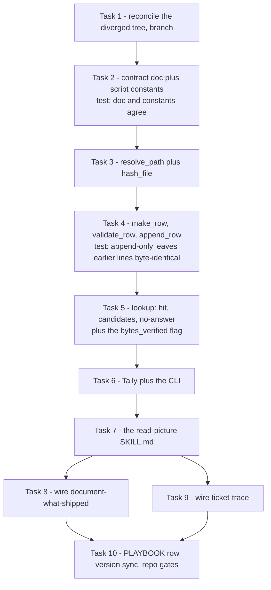

# read-picture Implementation Plan

> **For agentic workers:** REQUIRED SUB-SKILL: Use sp-subagent-driven-development (recommended) or sp-executing-plans to implement this plan task-by-task. Steps use checkbox (`- [ ]`) syntax for tracking.

**Goal:** Ship `read-picture` — a model-invocable dev-workflows skill that opens a picture once, records the answer to a named question in an append-only per-project JSONL record, and hands rows back to any calling skill — plus the two callers that prove it works.

**Architecture:** A bundled script (`scripts/picture-record.py`, stdlib only) owns every read and write of `picture-record.jsonl` so the row format cannot drift; the SKILL owns the judgment (what the picture shows, which kind applies, whether a stored row actually covers the request). One plugin-level reference (`references/picture-record-contract.md`) is the single source of truth for both the row schema and the named question set, and a test asserts the script's constants still match it. Two callers are wired by one surgical edit each: `document-what-shipped` at its shot-list step (kind `on-screen-text`) and `ticket-trace` at Operation A step 5 (kind `requirement`).

**Tech Stack:** Python 3.13, **stdlib only** (`hashlib`, `json`, `argparse`, `subprocess`, `datetime`) — no PyYAML, because the record is JSONL not YAML. Tests are pytest, invoked as `python -m pytest`. Skill, contract and PLAYBOOK are Markdown; plugin manifests are JSON.

**Spec:** [docs/superpowers/specs/2026-08-24-read-picture-design.md](../specs/2026-08-24-read-picture-design.md)



## Global Constraints

- **The tree is diverged — Task 1 fixes it before anything else.** Local `main` is **1 ahead and 1 behind** `origin/main`. The origin-only commit `e2f99f8` bumped `dev-workflows` to **0.49.0** and rewrote `skills/grill-then-plan/SKILL.md` by 63 lines. Do not branch from local `main` as-is.
- **Version to mint: `0.50.0`** — global max across every ref is `0.49.0` (on `origin/main`), not the `0.48.0` the local working tree shows. `plugins/dev-workflows/.claude-plugin/plugin.json` and the `dev-workflows` entry in `.claude-plugin/marketplace.json` must BOTH read `0.50.0` when this work lands. Never mint from the checkout you are sitting in.
- **Branch:** `feat/read-picture`, cut in Task 1 from the reconciled tree. Commit per task.
- **`pytest` is NOT on PATH** — always `python -m pytest`. Run from the repo root.
- **Stdlib only.** No new dependency, so `setup_check.ps1` needs no edit. If a step wants PyYAML, the step is wrong.
- **Script conventions** mirror `scripts/daily-state.py`: module docstring listing subcommands, the `sys.stdout.reconfigure(encoding="utf-8")` guard in a `try/except`, module-level constants, pure importable functions, CLI under `if __name__ == "__main__":` so importing never auto-runs.
- **Test conventions** mirror `scripts/test_daily_state.py`: the test file sits beside the script as `scripts/test_picture_record.py`, and loads the hyphenated module through `importlib.util.spec_from_file_location`.
- **Bundled paths** are `"${CLAUDE_PLUGIN_ROOT}/scripts/picture-record.py"` and `"${CLAUDE_PLUGIN_ROOT}/references/picture-record-contract.md"` — quoted, because paths contain spaces. These are two of the three shapes `install-antigravity.py` rewrites, so **no installer edit is needed**; the installer discovers skills by folder.
- **`read-picture` must NOT carry `disable-model-invocation`** (ADR 0141). That flag makes a skill slash-only and unloadable by another skill.
- **Frontmatter `description` on one line, single-quoted.** An unquoted `description:` containing a colon-space is silently rejected by strict YAML parsers.
- **Fixed decisions — do not re-open:** ADRs 0135–0143. Reader not format (0135); key = hash + question (0136); record only what was asked (0137); named set not free text (0138); source + hash, flag on the **returned** row (0139); two callers, lazy enforcement (0140); the name, model-invocable (0141); at the project git root (0142); append-only JSONL (0143).
- **Every negative probe must actually fail.** Where a step asks you to break something and watch a test go red, assert the edit landed before running, and treat a passing mutated run as a failed probe.

---

### Task 1: Reconcile the diverged tree and cut the branch

**Files:**
- Modify: none (git state only)

**Interfaces:**
- Consumes: nothing.
- Produces: a working tree containing both `6f983c9` (local) and `e2f99f8` (origin), on branch `feat/read-picture`, with `dev-workflows` reading `0.49.0` before Task 10 bumps it to `0.50.0`.

- [ ] **Step 1: Confirm the divergence is still exactly as this plan measured it**

```bash
git fetch origin
echo "ahead : $(git rev-list --count origin/main..HEAD)"
echo "behind: $(git rev-list --count HEAD..origin/main)"
```

Expected: `ahead : 1` and `behind: 1`. If either number differs, STOP and re-measure the version and ADR maxima before continuing — the numbers in Global Constraints were read at a point in time.

- [ ] **Step 2: Verify no ADR number collision was introduced**

```bash
names=$(git ls-tree -r --name-only origin/main -- docs/adr | sed 's|.*/||' | sed '/^$/d')
unparsed=$(printf '%s\n' "$names" | grep -Ecv '^([A-Za-z][A-Za-z_-]*-)?[0-9]{3,}-')
echo "unparsed: $unparsed"
printf '%s\n' "$names" | sed -E 's|^([A-Za-z][A-Za-z_-]*-)?([0-9]{3,})-.*|\2|' | sort -n | tail -1
```

Expected: `unparsed: 0` then `0134`. (The prefix here excludes digits and the number must run
at least three digits before its hyphen — a looser pattern once misread `...-0144-...` as
`0` and `...-50-...` as `50`, both already-taken numbers.) ADRs 0135–0143 in the working
tree are therefore un-collided. If this prints `0135` or higher, STOP — a sibling session
minted into our range and the ADRs must be renumbered before merging.

- [ ] **Step 3: Merge origin/main into local main**

```bash
git checkout main
git merge origin/main
```

Expected: a clean merge. The two commits touch disjoint files, so no conflict is expected. If `plugins/dev-workflows/.claude-plugin/plugin.json` conflicts, take **`0.49.0`** (the higher value) — that is the global max the version bump builds on.

- [ ] **Step 4: Confirm the reconciled version baseline**

```bash
grep -o '"version": *"[^"]*"' plugins/dev-workflows/.claude-plugin/plugin.json
```

Expected: `"version": "0.49.0"`.

- [ ] **Step 5: Cut the working branch**

```bash
git checkout -b feat/read-picture
git status --short
```

Expected: the nine ADRs, the spec, this plan and the modified `CONTEXT.md` are present as the only changes.

- [ ] **Step 6: Commit the design documents so they cannot orphan**

```bash
git add docs/adr/workflow-daily-work-013*.md docs/adr/workflow-daily-work-014*.md \
        docs/superpowers/specs/2026-08-24-read-picture-design.md \
        docs/superpowers/plans/2026-08-24-read-picture.md CONTEXT.md
git commit -m "docs(read-picture): design spec, plan and ADRs 0135-0143"
```

---

### Task 2: The contract document, the script's constants, and the test that they agree

**Files:**
- Create: `plugins/dev-workflows/references/picture-record-contract.md`
- Create: `plugins/dev-workflows/scripts/picture-record.py`
- Create: `plugins/dev-workflows/scripts/test_picture_record.py`

**Interfaces:**
- Consumes: nothing.
- Produces: module constants every later task uses — `FILE_NAME = "picture-record.jsonl"`, `ENV_VAR = "PICTURE_RECORD_FILE"`, `SCHEMA_VERSION = 1`, `QUESTION_KINDS = ("on-screen-text", "requirement", "other")`, `SOURCE_KINDS = ("ado-attachment", "local-path", "url")`, `ROW_FIELDS` (9 names, in emit order).

- [ ] **Step 1: Write the failing test**

Create `plugins/dev-workflows/scripts/test_picture_record.py`:

```python
"""test_picture_record.py — unit tests for the picture-record.py helper.

picture-record.py owns an append-only machine contract that other skills read,
so a format or key bug silently serves wrong answers to every caller. These
tests lock the constants against the contract document, path precedence, the
row schema, append-only behaviour, and every lookup outcome.

Run from the repo root:
    python -m pytest plugins/dev-workflows/scripts/test_picture_record.py -v

(`pytest` is not on PATH in this environment — invoke via `python -m pytest`.)
"""

import importlib.util
import io
import json
import os
import re

import pytest

_HERE = os.path.dirname(os.path.abspath(__file__))
_SPEC = importlib.util.spec_from_file_location(
    "picture_record", os.path.join(_HERE, "picture-record.py")
)
pr = importlib.util.module_from_spec(_SPEC)
_SPEC.loader.exec_module(pr)

CONTRACT = os.path.join(_HERE, os.pardir, "references", "picture-record-contract.md")


# ---------- the contract document is the source of truth (ADR 0138) ----------
def test_contract_doc_and_script_agree_on_the_question_kinds():
    doc = io.open(CONTRACT, encoding="utf-8").read()
    seg = doc.split("## Question kinds")[1].split("\n## ")[0]
    names = re.findall(r"^\|\s*`([a-z-]+)`\s*\|", seg, re.M)
    assert tuple(names) == pr.QUESTION_KINDS


def test_contract_doc_and_script_agree_on_the_row_fields():
    doc = io.open(CONTRACT, encoding="utf-8").read()
    seg = doc.split("## Row fields")[1].split("\n## ")[0]
    names = re.findall(r"^\|\s*`([a-z0-9_]+)`\s*\|", seg, re.M)
    assert tuple(names) == pr.ROW_FIELDS


def test_v1_ships_exactly_two_kinds_plus_other():
    # ADR 0140: a kind invented for an unwired caller is a guess.
    assert pr.QUESTION_KINDS == ("on-screen-text", "requirement", "other")
```

- [ ] **Step 2: Run the tests to verify they fail**

```bash
python -m pytest plugins/dev-workflows/scripts/test_picture_record.py -v
```

Expected: collection error — `picture-record.py` does not exist yet.

- [ ] **Step 3: Write the contract document**

Create `plugins/dev-workflows/references/picture-record-contract.md`:

````markdown
# picture-record.jsonl — the cross-skill picture-reading contract

One file per project, holding what has already been read out of pictures. It has
**two readers by design**: a **human** (greps a sentence and lands on the line that
produced it) and **another skill** (looks up whether a question has already been
answered for an image). `plugins/dev-workflows/scripts/picture-record.py` owns all
read and write; nothing else parses or emits these lines.

This file is the single source of truth for both the row schema and the question set.
`scripts/test_picture_record.py` asserts the script's constants still match the two
tables below, so an edit here that the script does not follow fails the suite.

## File location

Resolved at **runtime**, never hardcoded:

1. `--path <file>` flag (highest precedence), then
2. `PICTURE_RECORD_FILE` env var, then
3. `picture-record.jsonl` at the **git repository root** (`git rev-parse --show-toplevel`).

If the cwd is not inside a git repo, the skill asks the user where to put it rather
than failing. It lives in the repo you run in — **never** in the plugin marketplace
repo, which installs onto other people's machines (ADR 0142).

## Shape

**Append-only JSONL**: one JSON object per line, one line per answer, never rewritten
(ADR 0143). Re-reading a picture appends a new line rather than editing the old one, so
the file keeps the history of when each answer was confirmed.

## Row fields

| field | type | meaning |
|---|---|---|
| `schema_version` | int | On every line, so a format change never needs the file rewritten. `1` today. |
| `image_sha256` | string | SHA-256 of the bytes that were actually read. Half of the key (ADR 0136). |
| `source` | string | The URL or path the bytes came from. How a row is found when the file is gone. |
| `source_kind` | enum | `ado-attachment` \| `local-path` \| `url`. Says whether the source is expected to be re-fetchable. |
| `question_kind` | enum | A name from the set below. The other half of the key (ADR 0138). |
| `question_detail` | string | The caller's own wording under that name — what specifically it asked. |
| `answer` | string | Only what the question asked for (ADR 0137). |
| `read_on` | string | ISO-8601 with offset, when the bytes were read. |
| `asked_by` | string | The calling skill's name. Makes cross-skill reuse observable rather than assumed. |

Field order is the order above, and `append_row` emits it unsorted, so a line read by a
human lists the key before the answer.

## Question kinds

| kind | the question it stands for |
|---|---|
| `on-screen-text` | The exact words the product shows — control labels, page titles, status names. |
| `requirement` | What an annotated picture asks to be done. |
| `other` | Anything else. Using it **obliges the run to add the new kind to this table** in the same change, the way `document-what-shipped` writes back a spine its five did not cover. |

Two kinds, not five: a kind invented for a caller nobody has wired is a guess, and this
repo does not ship guessed recipes (ADR 0140).

## What a lookup returns

| outcome | means |
|---|---|
| `hit` | A row exists for this image, kind, and an equal (whitespace- and case-normalised) detail. |
| `candidates` | Rows exist for this image and kind but none matches the detail. **The skill must judge them and default to re-reading** — a near-miss is a miss (ADR 0136). |
| `no-answer` | Nothing recorded for this image and kind. |

Every result also carries **`bytes_verified`**: `true` when the lookup hashed bytes that
were present, `false` when the row was found by its `source` because the file was gone.
A `false` result is the **not re-checked against current bytes** flag of ADR 0139, and it
lives on the returned result — never on a stored line, because a line written last month
cannot know about a lookup happening today.

## Safety

- **Only what the question asked goes into a line** (ADR 0137). A data value is recorded
  only when the caller names the field it wants. This is what makes the file committable.
- **No credential, ever.** A signed link is a credential; it stays out of the record and
  out of the commit, for any reader.
- The script reads image bytes and appends lines. It writes nothing else and touches git
  never.

## See also

- ADRs `0135`–`0143` — the decisions behind every rule on this page.
- `plugins/dev-workflows/skills/read-picture/SKILL.md` — the judgment half.
- `plugins/dev-workflows/references/daily-state-contract.md` — the sibling contract this
  one is modelled on.
````

- [ ] **Step 4: Write the minimal script — docstring and constants only**

Create `plugins/dev-workflows/scripts/picture-record.py`:

```python
"""picture-record.py — read/write the per-project picture-record.jsonl file.

picture-record.jsonl records what has already been read out of a picture, so a
second run (or a second skill) does not re-open the same image to reach the same
sentence. It is append-only: one JSON object per line, never rewritten. The
canonical schema and question set live in
plugins/dev-workflows/references/picture-record-contract.md.

This script owns ALL read/write so the row format is never corrupted by freehand
edits. Judgment stays in the read-picture SKILL: what the picture shows, which
kind applies, and whether a stored row actually covers the request. This script
never touches git and never writes anything but appended lines.

Subcommands:
  resolve-path [--path P]
      Print the resolved record path (override order: --path > PICTURE_RECORD_FILE
      env > git-root). Exits non-zero with a message when not in a git repo and no
      override is given.
  kinds
      Print the named question set, one per line.
  hash <file>
      Print the SHA-256 of a file's bytes.
  lookup --kind K --detail D (--file F | --source S) [--path P] [--json]
      Report hit / candidates / no-answer plus bytes_verified.
  append --kind K --detail D --answer A --asked-by S
         (--file F | --sha H --source S --source-kind SK) [--path P]
      Validate and append exactly one line.

Importable as a module: resolve_path, hash_file, normalize_detail, make_row,
validate_row, append_row, iter_rows, lookup and Tally are pure functions and
classes whose only side effects are the reads and writes named. The CLI lives
under `if __name__ == "__main__":` so importing never auto-runs.

Dependencies: none beyond the standard library.
"""

import argparse
import hashlib
import io
import json
import os
import re
import subprocess
import sys
from datetime import datetime, timezone

try:
    sys.stdout.reconfigure(encoding="utf-8")  # Python 3.7+; avoids cp1252 crashes on Windows
except Exception:
    pass

FILE_NAME = "picture-record.jsonl"
ENV_VAR = "PICTURE_RECORD_FILE"
SCHEMA_VERSION = 1

# The named set (ADR 0138). `other` obliges the run to add its new kind to the
# contract document in the same change. test_picture_record.py asserts this tuple
# still matches that document's table.
QUESTION_KINDS = ("on-screen-text", "requirement", "other")

SOURCE_KINDS = ("ado-attachment", "local-path", "url")

# Emit order for a row, key before answer, so a human reading a line sees what was
# asked before what was answered.
ROW_FIELDS = (
    "schema_version",
    "image_sha256",
    "source",
    "source_kind",
    "question_kind",
    "question_detail",
    "answer",
    "read_on",
    "asked_by",
)

_UNSET = object()
```

- [ ] **Step 5: Run the tests to verify they pass**

```bash
python -m pytest plugins/dev-workflows/scripts/test_picture_record.py -v
```

Expected: 3 passed.

- [ ] **Step 6: Prove the agreement test actually bites**

Temporarily add a fourth kind to `QUESTION_KINDS` in the script (e.g. `"error-state"`), re-run the suite, and confirm `test_contract_doc_and_script_agree_on_the_question_kinds` **FAILS**. A passing run here means the probe missed and the test is worthless — investigate before reverting. Then revert the edit and re-run to green.

- [ ] **Step 7: Commit**

```bash
git add plugins/dev-workflows/references/picture-record-contract.md \
        plugins/dev-workflows/scripts/picture-record.py \
        plugins/dev-workflows/scripts/test_picture_record.py
git commit -m "feat(read-picture): picture record contract and its constants"
```

---

### Task 3: Path resolution and hashing

**Files:**
- Modify: `plugins/dev-workflows/scripts/picture-record.py`
- Test: `plugins/dev-workflows/scripts/test_picture_record.py`

**Interfaces:**
- Consumes: `FILE_NAME`, `ENV_VAR`, `_UNSET` from Task 2.
- Produces: `_git_root(cwd=None) -> str|None`, `resolve_path(path=None, env_value=None, cwd=None, git_root=_UNSET) -> str|None`, `hash_file(file_path) -> str` (64-char lowercase hex).

- [ ] **Step 1: Write the failing tests**

Append to `test_picture_record.py`:

```python
# ---------- resolve_path precedence (ADR 0142) ----------
def test_resolve_path_flag_wins_over_env_and_gitroot():
    got = pr.resolve_path(path="/explicit/x.jsonl", env_value="/env/y.jsonl", git_root="/repo")
    assert got == "/explicit/x.jsonl"


def test_resolve_path_env_wins_over_gitroot():
    got = pr.resolve_path(path=None, env_value="/env/y.jsonl", git_root="/repo")
    assert got == "/env/y.jsonl"


def test_resolve_path_falls_back_to_gitroot_filename():
    got = pr.resolve_path(path=None, env_value=None, git_root="/repo/root")
    assert got == os.path.join("/repo/root", pr.FILE_NAME)


def test_resolve_path_returns_none_when_not_in_repo():
    # None so the CLI can ask the user rather than failing (ADR 0142).
    assert pr.resolve_path(path=None, env_value=None, git_root=None) is None


# ---------- hashing (the first half of the key, ADR 0136) ----------
def test_hash_file_is_stable_and_content_addressed(tmp_path):
    a = tmp_path / "a.png"
    b = tmp_path / "b.png"
    a.write_bytes(b"\x89PNG same bytes")
    b.write_bytes(b"\x89PNG same bytes")
    assert pr.hash_file(str(a)) == pr.hash_file(str(b))
    assert len(pr.hash_file(str(a))) == 64


def test_hash_file_changes_when_one_byte_changes(tmp_path):
    p = tmp_path / "c.png"
    p.write_bytes(b"\x89PNG v1")
    first = pr.hash_file(str(p))
    p.write_bytes(b"\x89PNG v2")
    assert pr.hash_file(str(p)) != first
```

- [ ] **Step 2: Run the tests to verify they fail**

```bash
python -m pytest plugins/dev-workflows/scripts/test_picture_record.py -v -k "resolve_path or hash_file"
```

Expected: FAIL with `AttributeError: module 'picture_record' has no attribute 'resolve_path'`.

- [ ] **Step 3: Write the implementation**

Append to `picture-record.py`, after the constants:

```python
def _git_root(cwd=None):
    """Repo root, or None when the cwd is not inside a git repo."""
    try:
        out = subprocess.run(
            ["git", "rev-parse", "--show-toplevel"],
            cwd=cwd, capture_output=True, text=True, check=False,
        )
    except OSError:
        return None
    root = out.stdout.strip()
    return root or None


def resolve_path(path=None, env_value=None, cwd=None, git_root=_UNSET):
    """--path > PICTURE_RECORD_FILE > git root. None when there is no repo and no
    override, so the caller can ask the user instead of failing (ADR 0142)."""
    if path:
        return path
    if env_value:
        return env_value
    root = _git_root(cwd) if git_root is _UNSET else git_root
    if not root:
        return None
    return os.path.join(root, FILE_NAME)


def hash_file(file_path):
    """SHA-256 of a file's bytes, streamed so a large screenshot is not loaded whole."""
    digest = hashlib.sha256()
    with open(file_path, "rb") as handle:
        for chunk in iter(lambda: handle.read(65536), b""):
            digest.update(chunk)
    return digest.hexdigest()
```

- [ ] **Step 4: Run the tests to verify they pass**

```bash
python -m pytest plugins/dev-workflows/scripts/test_picture_record.py -v
```

Expected: 9 passed.

- [ ] **Step 5: Commit**

```bash
git add plugins/dev-workflows/scripts/picture-record.py \
        plugins/dev-workflows/scripts/test_picture_record.py
git commit -m "feat(read-picture): resolve the record path and hash image bytes"
```

---

### Task 4: Build, validate and append a row

**Files:**
- Modify: `plugins/dev-workflows/scripts/picture-record.py`
- Test: `plugins/dev-workflows/scripts/test_picture_record.py`

**Interfaces:**
- Consumes: `SCHEMA_VERSION`, `QUESTION_KINDS`, `SOURCE_KINDS`, `ROW_FIELDS` from Task 2.
- Produces: `normalize_detail(detail) -> str`, `validate_row(row) -> dict` (raises `ValueError`), `make_row(image_sha256, source, source_kind, question_kind, question_detail, answer, asked_by, read_on=None) -> dict`, `append_row(record_path, row) -> str` (the line written), `iter_rows(record_path)` generator.

- [ ] **Step 1: Write the failing tests**

Append to `test_picture_record.py`:

```python
# ---------- helpers used by the row tests ----------
def _row(**over):
    base = dict(
        image_sha256="a" * 64,
        source="C:/tmp/send-dialog.png",
        source_kind="local-path",
        question_kind="on-screen-text",
        question_detail="the words on the primary button",
        answer="Send",
        asked_by="document-what-shipped",
        read_on="2026-08-24T15:40:00+07:00",
    )
    base.update(over)
    return pr.make_row(**base)


# ---------- detail normalisation ----------
def test_normalize_detail_folds_case_and_whitespace():
    assert pr.normalize_detail("  The   WORDS on\tthe button ") == "the words on the button"


def test_normalize_detail_handles_none():
    assert pr.normalize_detail(None) == ""


# ---------- the row schema ----------
def test_make_row_emits_every_field_in_contract_order():
    assert tuple(_row().keys()) == pr.ROW_FIELDS


def test_make_row_stamps_schema_version():
    assert _row()["schema_version"] == pr.SCHEMA_VERSION


def test_validate_row_rejects_an_unknown_question_kind():
    with pytest.raises(ValueError, match="question_kind"):
        _row(question_kind="error-state")


def test_validate_row_rejects_an_unknown_source_kind():
    with pytest.raises(ValueError, match="source_kind"):
        _row(source_kind="sharepoint")


def test_validate_row_rejects_an_extra_field():
    bad = dict(_row())
    bad["screenshot_notes"] = "everything else I saw"
    with pytest.raises(ValueError, match="unknown field"):
        pr.validate_row(bad)


def test_validate_row_rejects_a_missing_field():
    bad = dict(_row())
    del bad["answer"]
    with pytest.raises(ValueError, match="missing required field"):
        pr.validate_row(bad)


# ---------- append-only (ADR 0143) ----------
def test_append_row_writes_one_json_line(tmp_path):
    rec = str(tmp_path / pr.FILE_NAME)
    pr.append_row(rec, _row())
    lines = io.open(rec, encoding="utf-8").read().splitlines()
    assert len(lines) == 1
    assert json.loads(lines[0])["answer"] == "Send"


def test_appending_leaves_every_earlier_line_byte_identical(tmp_path):
    # This is the test that protects against the whole-file-rewrite scar behind ADR 0143.
    rec = str(tmp_path / pr.FILE_NAME)
    pr.append_row(rec, _row(answer="Send"))
    first = io.open(rec, encoding="utf-8", newline="").read()
    pr.append_row(rec, _row(question_detail="the page title", answer="Send quote"))
    after = io.open(rec, encoding="utf-8", newline="").read()
    assert after.startswith(first)
    assert after[len(first):].count("\n") == 1


def test_iter_rows_round_trips_what_was_appended(tmp_path):
    rec = str(tmp_path / pr.FILE_NAME)
    pr.append_row(rec, _row(answer="Send"))
    pr.append_row(rec, _row(question_detail="the page title", answer="Send quote"))
    got = [r["answer"] for r in pr.iter_rows(rec)]
    assert got == ["Send", "Send quote"]


def test_iter_rows_on_a_missing_file_yields_nothing(tmp_path):
    assert list(pr.iter_rows(str(tmp_path / "nope.jsonl"))) == []


def test_iter_rows_names_the_line_number_of_bad_json(tmp_path):
    rec = tmp_path / pr.FILE_NAME
    rec.write_text('{"ok": 1}\nnot json\n', encoding="utf-8")
    with pytest.raises(ValueError, match="line 2"):
        list(pr.iter_rows(str(rec)))
```

- [ ] **Step 2: Run the tests to verify they fail**

```bash
python -m pytest plugins/dev-workflows/scripts/test_picture_record.py -v -k "normalize or row"
```

Expected: FAIL with `AttributeError: module 'picture_record' has no attribute 'normalize_detail'`.

- [ ] **Step 3: Write the implementation**

Append to `picture-record.py`:

```python
_WHITESPACE = re.compile(r"\s+")


def normalize_detail(detail):
    """Fold case and collapse whitespace, so two callers wording the same request
    slightly differently still match. Anything beyond this is judgment and belongs
    in the SKILL, not here."""
    return _WHITESPACE.sub(" ", (detail or "").strip().lower())


def validate_row(row):
    """Raise ValueError unless the row is exactly the contract's nine fields with
    known enum values. Returns the row so callers can wrap it."""
    missing = [name for name in ROW_FIELDS if name not in row]
    if missing:
        raise ValueError("row is missing required field(s): %s" % ", ".join(missing))
    unknown = [name for name in row if name not in ROW_FIELDS]
    if unknown:
        raise ValueError("row carries unknown field(s): %s" % ", ".join(sorted(unknown)))
    if row["schema_version"] != SCHEMA_VERSION:
        raise ValueError(
            "schema_version must be %d, got %r" % (SCHEMA_VERSION, row["schema_version"])
        )
    if row["question_kind"] not in QUESTION_KINDS:
        raise ValueError(
            "question_kind %r is not in the named set (%s)"
            % (row["question_kind"], ", ".join(QUESTION_KINDS))
        )
    if row["source_kind"] not in SOURCE_KINDS:
        raise ValueError(
            "source_kind %r is not one of (%s)"
            % (row["source_kind"], ", ".join(SOURCE_KINDS))
        )
    return row


def make_row(image_sha256, source, source_kind, question_kind, question_detail,
             answer, asked_by, read_on=None):
    """Build one validated row in contract field order."""
    row = {
        "schema_version": SCHEMA_VERSION,
        "image_sha256": image_sha256,
        "source": source,
        "source_kind": source_kind,
        "question_kind": question_kind,
        "question_detail": question_detail,
        "answer": answer,
        "read_on": read_on or datetime.now(timezone.utc).astimezone().isoformat(timespec="seconds"),
        "asked_by": asked_by,
    }
    return validate_row(row)


def append_row(record_path, row):
    """Append exactly one line. Never rewrites, so no earlier line can be corrupted
    by a bad round-trip (ADR 0143). Returns the line written."""
    validate_row(row)
    line = json.dumps(row, ensure_ascii=False, sort_keys=False) + "\n"
    with io.open(record_path, "a", encoding="utf-8", newline="\n") as handle:
        handle.write(line)
    return line


def iter_rows(record_path):
    """Yield each row in file order — which is chronological, because the file is
    append-only. A blank line is skipped; malformed JSON names its line number."""
    if not record_path or not os.path.exists(record_path):
        return
    with io.open(record_path, encoding="utf-8", newline="") as handle:
        for number, raw in enumerate(handle, 1):
            text = raw.strip()
            if not text:
                continue
            try:
                yield json.loads(text)
            except ValueError:
                raise ValueError("picture record line %d is not valid JSON" % number)
```

- [ ] **Step 4: Run the tests to verify they pass**

```bash
python -m pytest plugins/dev-workflows/scripts/test_picture_record.py -v
```

Expected: 22 passed.

- [ ] **Step 5: Prove the append-only test actually bites**

Temporarily change `append_row` to rewrite the whole file (read all rows, re-emit them, then the new one). Re-run and confirm `test_appending_leaves_every_earlier_line_byte_identical` **FAILS**. If it passes, the probe missed — the mutation did not land. Revert and re-run to green.

- [ ] **Step 6: Commit**

```bash
git add plugins/dev-workflows/scripts/picture-record.py \
        plugins/dev-workflows/scripts/test_picture_record.py
git commit -m "feat(read-picture): validate rows and append them, never rewrite"
```

---

### Task 5: Lookup — hit, candidates, no-answer, and the bytes_verified flag

**Files:**
- Modify: `plugins/dev-workflows/scripts/picture-record.py`
- Test: `plugins/dev-workflows/scripts/test_picture_record.py`

**Interfaces:**
- Consumes: `iter_rows`, `normalize_detail` from Task 4.
- Produces: `lookup(record_path, question_kind, question_detail, image_sha256=None, source=None) -> dict` with keys `outcome` (`"hit"` | `"candidates"` | `"no-answer"`), `row` (dict or None), `candidates` (list), `bytes_verified` (bool).

- [ ] **Step 1: Write the failing tests**

Append to `test_picture_record.py`:

```python
# ---------- lookup: the key is hash + kind + detail (ADRs 0136, 0138) ----------
def _seeded(tmp_path):
    rec = str(tmp_path / pr.FILE_NAME)
    pr.append_row(rec, _row(question_detail="the words on the primary button", answer="Send"))
    pr.append_row(rec, _row(question_kind="requirement",
                            answer="Rename Auto to Vehicles / Hide Breakbulk",
                            question_detail="what the annotation asks for",
                            asked_by="ticket-trace"))
    return rec


def test_same_hash_same_kind_same_detail_is_a_hit(tmp_path):
    rec = _seeded(tmp_path)
    got = pr.lookup(rec, "on-screen-text", "the words on the primary button",
                    image_sha256="a" * 64)
    assert got["outcome"] == "hit"
    assert got["row"]["answer"] == "Send"
    assert got["bytes_verified"] is True


def test_detail_match_ignores_case_and_spacing(tmp_path):
    rec = _seeded(tmp_path)
    got = pr.lookup(rec, "on-screen-text", "The Words  On The PRIMARY Button",
                    image_sha256="a" * 64)
    assert got["outcome"] == "hit"


def test_a_new_kind_on_the_same_file_is_not_a_hit(tmp_path):
    # ADR 0136: a question nobody asked of this file is a miss.
    rec = _seeded(tmp_path)
    got = pr.lookup(rec, "other", "anything", image_sha256="a" * 64)
    assert got["outcome"] == "no-answer"
    assert got["row"] is None


def test_a_near_miss_returns_candidates_never_a_hit(tmp_path):
    # Same image and kind, a detail the stored row does not cover.
    rec = _seeded(tmp_path)
    got = pr.lookup(rec, "on-screen-text", "the page title", image_sha256="a" * 64)
    assert got["outcome"] == "candidates"
    assert got["row"] is None
    assert [c["answer"] for c in got["candidates"]] == ["Send"]


def test_a_different_image_is_not_a_hit(tmp_path):
    rec = _seeded(tmp_path)
    got = pr.lookup(rec, "on-screen-text", "the words on the primary button",
                    image_sha256="b" * 64)
    assert got["outcome"] == "no-answer"


def test_the_newest_line_wins_because_the_file_is_chronological(tmp_path):
    rec = _seeded(tmp_path)
    pr.append_row(rec, _row(question_detail="the words on the primary button",
                            answer="Send quote", read_on="2026-09-01T09:00:00+07:00"))
    got = pr.lookup(rec, "on-screen-text", "the words on the primary button",
                    image_sha256="a" * 64)
    assert got["row"]["answer"] == "Send quote"


# ---------- the flag: found by source, bytes gone (ADR 0139) ----------
def test_lookup_by_source_is_flagged_not_bytes_verified(tmp_path):
    rec = _seeded(tmp_path)
    got = pr.lookup(rec, "on-screen-text", "the words on the primary button",
                    source="C:/tmp/send-dialog.png")
    assert got["outcome"] == "hit"
    assert got["bytes_verified"] is False


def test_no_row_and_no_bytes_is_no_answer_not_an_invention(tmp_path):
    rec = _seeded(tmp_path)
    got = pr.lookup(rec, "on-screen-text", "anything at all",
                    source="C:/tmp/never-seen.png")
    assert got["outcome"] == "no-answer"
    assert got["row"] is None


def test_lookup_needs_a_hash_or_a_source(tmp_path):
    rec = _seeded(tmp_path)
    with pytest.raises(ValueError, match="image_sha256 or source"):
        pr.lookup(rec, "on-screen-text", "anything")
```

- [ ] **Step 2: Run the tests to verify they fail**

```bash
python -m pytest plugins/dev-workflows/scripts/test_picture_record.py -v -k lookup
```

Expected: FAIL with `AttributeError: module 'picture_record' has no attribute 'lookup'`.

- [ ] **Step 3: Write the implementation**

Append to `picture-record.py`:

```python
def lookup(record_path, question_kind, question_detail, image_sha256=None, source=None):
    """Find the row that answers this question about this image.

    Keyed on hash + kind + detail (ADRs 0136, 0138). Matching on the detail is
    deliberately literal — normalised string equality, nothing cleverer — so the
    script stays deterministic and the judgment of whether a near-miss row is good
    enough stays in the SKILL, which must default to re-reading.

    Pass image_sha256 when the bytes are present, source when they are gone. The
    returned bytes_verified is the ADR 0139 flag: it lives on the result, never on a
    stored line.
    """
    if not image_sha256 and not source:
        raise ValueError("lookup needs image_sha256 or source")
    wanted = normalize_detail(question_detail)
    exact = None
    candidates = []
    for row in iter_rows(record_path):
        if row.get("question_kind") != question_kind:
            continue
        if image_sha256:
            if row.get("image_sha256") != image_sha256:
                continue
        elif row.get("source") != source:
            continue
        if normalize_detail(row.get("question_detail")) == wanted:
            exact = row  # last match wins: the file is append-only, so file order is time order
        else:
            candidates.append(row)
    result = {
        "outcome": "no-answer",
        "row": None,
        "candidates": candidates,
        "bytes_verified": bool(image_sha256),
    }
    if exact is not None:
        result["outcome"] = "hit"
        result["row"] = exact
    elif candidates:
        result["outcome"] = "candidates"
    return result
```

- [ ] **Step 4: Run the tests to verify they pass**

```bash
python -m pytest plugins/dev-workflows/scripts/test_picture_record.py -v
```

Expected: 31 passed.

- [ ] **Step 5: Commit**

```bash
git add plugins/dev-workflows/scripts/picture-record.py \
        plugins/dev-workflows/scripts/test_picture_record.py
git commit -m "feat(read-picture): look up by hash or source, flag unverified bytes"
```

---

### Task 6: The tally and the CLI

**Files:**
- Modify: `plugins/dev-workflows/scripts/picture-record.py`
- Test: `plugins/dev-workflows/scripts/test_picture_record.py`

**Interfaces:**
- Consumes: everything from Tasks 3–5.
- Produces: `class Tally` with `add(result) -> Tally`, `summary() -> str`, and counters `hit`, `candidates`, `miss`, `unverified`; a `main(argv=None) -> int` CLI exposing `resolve-path`, `kinds`, `hash`, `lookup`, `append`.

- [ ] **Step 1: Write the failing tests**

Append to `test_picture_record.py`:

```python
# ---------- the tally makes reuse observable (ADR 0138) ----------
def test_tally_counts_each_outcome(tmp_path):
    rec = _seeded(tmp_path)
    tally = pr.Tally()
    tally.add(pr.lookup(rec, "on-screen-text", "the words on the primary button",
                        image_sha256="a" * 64))
    tally.add(pr.lookup(rec, "on-screen-text", "the page title", image_sha256="a" * 64))
    tally.add(pr.lookup(rec, "other", "anything", image_sha256="a" * 64))
    tally.add(pr.lookup(rec, "on-screen-text", "the words on the primary button",
                        source="C:/tmp/send-dialog.png"))
    assert (tally.hit, tally.candidates, tally.miss, tally.unverified) == (2, 1, 1, 1)
    assert "2 hit" in tally.summary()
    assert "not re-checked" in tally.summary()


# ---------- CLI ----------
def test_cli_kinds_prints_the_named_set(capsys):
    assert pr.main(["kinds"]) == 0
    printed = capsys.readouterr().out.split()
    assert printed == list(pr.QUESTION_KINDS)


def test_cli_resolve_path_errors_when_not_in_repo(monkeypatch):
    monkeypatch.delenv(pr.ENV_VAR, raising=False)
    monkeypatch.setattr(pr, "_git_root", lambda cwd=None: None)
    with pytest.raises(SystemExit):
        pr.main(["resolve-path"])


def test_cli_resolve_path_honors_env(monkeypatch, capsys):
    monkeypatch.setenv(pr.ENV_VAR, os.path.join("/env", "z.jsonl"))
    monkeypatch.setattr(pr, "_git_root", lambda cwd=None: None)
    assert pr.main(["resolve-path"]) == 0
    assert capsys.readouterr().out.strip() == os.path.join("/env", "z.jsonl")


def test_cli_append_then_lookup_round_trip(tmp_path, capsys):
    rec = str(tmp_path / pr.FILE_NAME)
    img = tmp_path / "dialog.png"
    img.write_bytes(b"\x89PNG send dialog")
    assert pr.main([
        "append", "--path", rec, "--file", str(img),
        "--kind", "on-screen-text", "--detail", "the words on the primary button",
        "--answer", "Send", "--asked-by", "document-what-shipped",
    ]) == 0
    capsys.readouterr()
    assert pr.main([
        "lookup", "--path", rec, "--file", str(img),
        "--kind", "on-screen-text", "--detail", "the words on the primary button",
        "--json",
    ]) == 0
    blob = json.loads(capsys.readouterr().out)
    assert blob["outcome"] == "hit"
    assert blob["row"]["answer"] == "Send"
    assert blob["bytes_verified"] is True


def test_cli_append_refuses_an_unknown_kind(tmp_path):
    rec = str(tmp_path / pr.FILE_NAME)
    img = tmp_path / "d.png"
    img.write_bytes(b"x")
    with pytest.raises(SystemExit):
        pr.main([
            "append", "--path", rec, "--file", str(img),
            "--kind", "error-state", "--detail", "d",
            "--answer", "a", "--asked-by", "someone",
        ])
```

- [ ] **Step 2: Run the tests to verify they fail**

```bash
python -m pytest plugins/dev-workflows/scripts/test_picture_record.py -v -k "tally or cli"
```

Expected: FAIL with `AttributeError: module 'picture_record' has no attribute 'Tally'`.

- [ ] **Step 3: Write the implementation**

Append to `picture-record.py`:

```python
_OUTCOME_COUNTER = {"hit": "hit", "candidates": "candidates", "no-answer": "miss"}


class Tally(object):
    """Counts the outcomes of one run's lookups. ADR 0138's argument against free-text
    keys is that a hit which never happens is silent — so the reader reports its own
    hit and miss counts rather than hiding the same thing."""

    def __init__(self):
        self.hit = 0
        self.candidates = 0
        self.miss = 0
        self.unverified = 0

    def add(self, result):
        name = _OUTCOME_COUNTER[result["outcome"]]
        setattr(self, name, getattr(self, name) + 1)
        if not result["bytes_verified"]:
            self.unverified += 1
        return self

    def summary(self):
        return (
            "picture record: %d hit, %d candidates-only, %d no-answer, "
            "%d not re-checked against current bytes"
            % (self.hit, self.candidates, self.miss, self.unverified)
        )


def _resolved_or_die(args):
    path = resolve_path(path=args.path, env_value=os.environ.get(ENV_VAR))
    if not path:
        raise SystemExit(
            "not inside a git repo and no --path or %s given - ask where the record "
            "should live rather than guessing" % ENV_VAR
        )
    return path


def _source_of(args):
    """Return (image_sha256, source, source_kind) from either --file or the explicit trio."""
    if args.file:
        return hash_file(args.file), args.file, args.source_kind or "local-path"
    return args.sha, args.source, args.source_kind or "url"


def main(argv=None):
    parser = argparse.ArgumentParser(description="Read/write the per-project picture record.")
    subparsers = parser.add_subparsers(dest="command", required=True)

    p_resolve = subparsers.add_parser("resolve-path")
    p_resolve.add_argument("--path")

    subparsers.add_parser("kinds")

    p_hash = subparsers.add_parser("hash")
    p_hash.add_argument("file")

    for name in ("lookup", "append"):
        sub = subparsers.add_parser(name)
        sub.add_argument("--path")
        sub.add_argument("--kind", required=True, choices=list(QUESTION_KINDS))
        sub.add_argument("--detail", required=True)
        sub.add_argument("--file")
        sub.add_argument("--sha")
        sub.add_argument("--source")
        sub.add_argument("--source-kind", choices=list(SOURCE_KINDS))
        if name == "lookup":
            sub.add_argument("--json", action="store_true")
        else:
            sub.add_argument("--answer", required=True)
            sub.add_argument("--asked-by", required=True)

    args = parser.parse_args(argv)

    if args.command == "kinds":
        for kind in QUESTION_KINDS:
            print(kind)
        return 0

    if args.command == "hash":
        print(hash_file(args.file))
        return 0

    if args.command == "resolve-path":
        print(_resolved_or_die(args))
        return 0

    record_path = _resolved_or_die(args)
    sha, source, source_kind = _source_of(args)

    if args.command == "lookup":
        result = lookup(
            record_path, args.kind, args.detail,
            image_sha256=sha if args.file else None,
            source=None if args.file else source,
        )
        if args.json:
            print(json.dumps(result, ensure_ascii=False, indent=2))
        else:
            print("%s | bytes_verified=%s" % (result["outcome"], result["bytes_verified"]))
            if result["row"]:
                print(result["row"]["answer"])
            for candidate in result["candidates"]:
                print("candidate: %s -> %s"
                      % (candidate["question_detail"], candidate["answer"]))
        return 0

    try:
        row = make_row(
            image_sha256=sha, source=source, source_kind=source_kind,
            question_kind=args.kind, question_detail=args.detail,
            answer=args.answer, asked_by=args.asked_by,
        )
    except ValueError as err:
        raise SystemExit(str(err))
    append_row(record_path, row)
    print("appended to %s" % record_path)
    return 0


if __name__ == "__main__":
    raise SystemExit(main())
```

- [ ] **Step 4: Run the whole suite**

```bash
python -m pytest plugins/dev-workflows/scripts/test_picture_record.py -v
```

Expected: 37 passed.

- [ ] **Step 5: Confirm importing the module does not run the CLI**

```bash
python -c "import importlib.util,os; s=importlib.util.spec_from_file_location('pr','plugins/dev-workflows/scripts/picture-record.py'); m=importlib.util.module_from_spec(s); s.loader.exec_module(m); print('imported clean, kinds =', m.QUESTION_KINDS)"
```

Expected: prints the tuple, no argparse error, exit 0.

- [ ] **Step 6: Commit**

```bash
git add plugins/dev-workflows/scripts/picture-record.py \
        plugins/dev-workflows/scripts/test_picture_record.py
git commit -m "feat(read-picture): tally the outcomes and expose the CLI"
```

---

### Task 7: The read-picture SKILL.md

**Files:**
- Create: `plugins/dev-workflows/skills/read-picture/SKILL.md`

**Interfaces:**
- Consumes: the CLI from Task 6, the contract from Task 2.
- Produces: a loadable, model-invocable skill named `read-picture` that callers in Tasks 8 and 9 name.

- [ ] **Step 1: Write the skill**

Create `plugins/dev-workflows/skills/read-picture/SKILL.md`:

````markdown
---
name: read-picture
description: 'Answer one named question about one or more picture files, and record the answer so no run and no other skill re-reads the same image to reach the same sentence. Use when another skill or the user hands over screenshots, ticket attachments or exported images together with a specific question about them - the exact words on a control, or what an annotated picture requires. Not for generating or editing images, and not a full transcription: it answers the question it was given and records nothing else.'
---

# Read a picture

The answer to a question about a picture is a measurement, and this repo throws exactly
one class of measurement away: the one that came from looking. A ticket whose description
is a single annotated screenshot decided that a hardcoded label was a requirement rather
than a bug — and every later run re-downloaded and re-read that same picture to learn the
same sentence.

So this skill reads the picture **once per question**, writes the answer down, and hands
rows back. It is a reader, not a store: the caller passes paths and a question, and gets
facts (ADR 0135).

```
  ONE CALL = ONE QUESTION, N PICTURES
  ──────────────────────────────────────────────
  ① THE QUESTION      a kind from the named set
  │                   plus the caller's detail
  ▼
  ② LOOK IT UP        hash the bytes, ask the record
  │                   hit / candidates / no-answer
  ▼
  ③ READ ON A MISS    open the picture, answer ONLY
  │                   the question, append one line
  ▼
  ④ HAND BACK         rows, plus hit and miss counts
                      and any not-re-checked flag
```

## ① Take the question as a kind, plus detail

The record is keyed on the picture's bytes **and** the question, so the question has to be
a name from a set rather than free prose — two skills phrasing the same need differently
would otherwise never share an answer, and nothing would report the miss (ADR 0138).

```bash
python "${CLAUDE_PLUGIN_ROOT}/scripts/picture-record.py" kinds
```

The set and what each kind means live in
`${CLAUDE_PLUGIN_ROOT}/references/picture-record-contract.md`. Read it before choosing.

**If no kind fits, take `other` — and add the new kind to that contract's table in this
same change.** A question answered once should never be improvised twice.

Under the kind, state the caller's **detail**: what specifically is being asked ("the words
on the primary button in the Send dialog"). The detail is part of the key.

## ② Look it up before opening anything

```bash
python "${CLAUDE_PLUGIN_ROOT}/scripts/picture-record.py" lookup \
    --file "<image path>" --kind <kind> --detail "<detail>" --json
```

Three outcomes, and only one of them lets you skip looking:

| outcome | what to do |
|---|---|
| `hit` | Use the stored answer. Do not open the picture. |
| `candidates` | Rows exist for this picture and kind, but none answers *this* detail. **Read the candidates, then default to opening the picture.** |
| `no-answer` | Open the picture. |

**A near-miss is a miss.** A stored row about the page title does not answer a question
about the confirm button. Serving it anyway manufactures the failure
`generating-test-cases` names — a value that is genuinely sourced but is the *class*
rather than the *instance*, which slips the source check precisely because it looks
verified. When the candidate does not plainly cover what was asked, read the picture.

**When the bytes are gone** — a temp download that was cleaned up, an attachment nobody
can re-fetch — look up by source instead of by file:

```bash
python "${CLAUDE_PLUGIN_ROOT}/scripts/picture-record.py" lookup \
    --source "<url or original path>" --kind <kind> --detail "<detail>" --json
```

That result comes back with `bytes_verified: false`. **Carry that flag to the caller.** A
row nobody can re-check looks exactly like one verified a minute ago, and the caller about
to quote it onto a published page has to be able to see the difference (ADR 0139).

## ③ On a miss, read the picture and answer only what was asked

Open the image and answer the question. Then record it:

```bash
python "${CLAUDE_PLUGIN_ROOT}/scripts/picture-record.py" append \
    --file "<image path>" --kind <kind> --detail "<detail>" \
    --answer "<the answer>" --asked-by "<calling skill>"
```

**Record only the answer.** Not the customer name that happened to be on screen, not the
quote number, not the rest of the window. A picture of a running system carries more than
the thing being asked about, and this file is committed (ADR 0137).

**No credential reaches the record.** A signed link is a credential for the record it
names. It stays out of the answer, out of the record and out of the commit — this one does
not bend for any caller.

**Quote on-screen words exactly as the product spells them.** The whole value of a picture
over a diagram is that it carries the real label, so "Send quote" is not "Send".

## ④ Hand back rows, counts, and any flag

Return to the caller, per picture: the kind, the detail, the answer, and whether it was a
hit, a fresh read, or a flagged row. Then the run's counts — how many hits, how many
candidates-only, how many read fresh, how many not re-checked.

The counts are not decoration. A run where every call is a miss says the kind set no
longer fits the questions being asked, and that is the signal to extend the set rather
than keep paying.

## What this skill refuses

- **To answer a question it was not asked**, or to transcribe a picture in full.
- **To serve a near-miss row as a hit.** When in doubt, open the picture.
- **To put a credential, a customer identifier, or anything else it merely saw into the
  record.**
- **To present a `bytes_verified: false` row as verified.**
- **To hand back an answer with no picture and no row.** `no-answer` is the honest result,
  and the caller decides what to do about it.

## Red flags — stop and go back a step

| thought | what it means |
|---|---|
| "There is a row for this image, close enough" | Check the detail. A near-miss is a miss — ② |
| "I will transcribe everything so future callers are covered" | The first caller cannot know what a later one needs, and this file is committed — ③ |
| "The file is missing, I will answer from the row" | You may, but the flag travels with it — ② |
| "No kind fits, I will write my own phrasing" | Take `other` and add it to the contract — ① |
| "I will record the counts at the end" | Nothing else reports a hit that did not happen — ④ |

## Related skills

- `document-what-shipped` — asks `on-screen-text` for the words a page will quote.
- `ticket-trace` — asks `requirement` of an annotated screenshot that may *be* the spec.
- `${CLAUDE_PLUGIN_ROOT}/references/picture-record-contract.md` — the row schema and the kind set.
````

- [ ] **Step 2: Verify the plugin still validates**

```bash
claude plugin validate plugins/dev-workflows
```

Expected: valid. A silently-dropped frontmatter (the colon-space trap) shows up here.

- [ ] **Step 3: Verify the description parses under a strict YAML parser**

```bash
python -c "
import io, yaml
t = io.open('plugins/dev-workflows/skills/read-picture/SKILL.md', encoding='utf-8').read()
fm = t.split('---')[1]
d = yaml.safe_load(fm)
assert d['name'] == 'read-picture', d
assert 'disable-model-invocation' not in d, 'ADR 0141: must stay model-invocable'
print('frontmatter OK, keys =', sorted(d))
"
```

Expected: `frontmatter OK, keys = ['description', 'name']`.

- [ ] **Step 4: Verify every `${CLAUDE_PLUGIN_ROOT}` use is a rewritable shape**

```bash
grep -o '${CLAUDE_PLUGIN_ROOT}/[a-z]*/' plugins/dev-workflows/skills/read-picture/SKILL.md | sort -u
```

Expected: exactly `${CLAUDE_PLUGIN_ROOT}/references/` and `${CLAUDE_PLUGIN_ROOT}/scripts/`. Any third shape means `install-antigravity.py`'s `rewrite_plugin_root()` needs a new mapping.

- [ ] **Step 5: Commit**

```bash
git add plugins/dev-workflows/skills/read-picture/SKILL.md
git commit -m "feat(read-picture): the skill that reads a picture once per question"
```

---

### Task 8: Wire document-what-shipped

**Files:**
- Modify: `plugins/dev-workflows/skills/document-what-shipped/SKILL.md` (the ① section, after the gate paragraph at line 89–91)

**Interfaces:**
- Consumes: the `read-picture` skill from Task 7, kind `on-screen-text`.
- Produces: nothing other tasks read.

- [ ] **Step 1: Apply the anchored edit**

The anchor is the single line that ends the gate paragraph. Insert a new paragraph **after** it. Use the skill's own `anchored_edit.py` habits: find by text, assert the text appears exactly once.

**Write the patch as a file and run it by path — never through a heredoc.** A python payload sent through `python - <<'PY'` has been measured in this environment to arrive with one backslash eaten, so an anchor containing an escape silently matches nothing while `grep` proves the line is there. The script below also uses a triple-quoted literal with real newlines instead of `\n` escapes, which sidesteps the class entirely.

Create `<scratchpad>/wire_dws.py`:

```python
import io

PATH = 'plugins/dev-workflows/skills/document-what-shipped/SKILL.md'
ANCHOR = 'all leave it closed - ask once more. An absent answer is not a decline.'

ADD = """

**Once the files are handed over, read them through `read-picture`.** Load the `read-picture`
skill via your harness's mechanism, asking kind `on-screen-text` for the words this page will
quote - button labels, page titles, status names. It answers from the project's picture record
when that picture has already been read for the same question, and opens the image when it has
not. Carry its not-re-checked flag into ② - a row whose bytes could not be confirmed is not
evidence for a sentence on a published page."""

text = io.open(PATH, encoding='utf-8', newline='').read()
assert 'read-picture' not in text, 'already wired'
assert text.count(ANCHOR) == 1, 'anchor found %d times, expected 1' % text.count(ANCHOR)
io.open(PATH, 'w', encoding='utf-8', newline='').write(text.replace(ANCHOR, ANCHOR + ADD))
print('wired document-what-shipped: anchor matched once')
```

Then run it from the repo root:

```bash
python "<scratchpad>/wire_dws.py"
```

Expected: `wired document-what-shipped: anchor matched once`. The `②` in the added text is the literal section marker that file uses for its fact-ledger step — confirm it against the file's own numbering before running.

- [ ] **Step 2: Read the produced prose**

```bash
sed -n '85,105p' plugins/dev-workflows/skills/document-what-shipped/SKILL.md
```

Expected: the gate paragraph is intact and unchanged, and the new paragraph reads as English. An assert proves an anchor matched; it cannot prove a sentence reads — this skill published *"the Agent clears it with Add Booking, and the quote-list marker and the Agent clears it with Add Booking"* with every assert green.

- [ ] **Step 3: Verify the gate itself did not move**

```bash
grep -c 'The gate opens only on an explicit answer' plugins/dev-workflows/skills/document-what-shipped/SKILL.md
grep -c 'Screenshot needed' plugins/dev-workflows/skills/document-what-shipped/SKILL.md
```

Expected: `1` and `1`. The gate and the visible-hole rule are untouched — reading a picture is what happens *after* the gate opens, never a reason to open it.

- [ ] **Step 4: Commit**

```bash
git add plugins/dev-workflows/skills/document-what-shipped/SKILL.md
git commit -m "feat(document-what-shipped): read the shot-list images through read-picture"
```

---

### Task 9: Wire ticket-trace

**Files:**
- Modify: `plugins/dev-workflows/skills/ticket-trace/SKILL.md:58`

**Interfaces:**
- Consumes: the `read-picture` skill from Task 7, kind `requirement`.
- Produces: nothing other tasks read.

- [ ] **Step 1: Apply the anchored edit**

**A file, run by path — not a heredoc**, for the reason given in Task 8 Step 1.

This edit replaces part of a line whose sentence **continues past the anchor**. The original reads
`… **download it with the same auth and view it** — annotated screenshots frequently ARE the
requirement, and skipping them flips the conclusion.` The replacement must leave that trailing
clause attached and sensible. This exact shape once published a garbled sentence with every
assert green, so Step 2 reads the result rather than trusting the assert.

Create `<scratchpad>/wire_ticket_trace.py`:

```python
import io

PATH = 'plugins/dev-workflows/skills/ticket-trace/SKILL.md'

OLD = '**download it with the same auth and view it**'
NEW = ('**download it with the same auth and read it through `read-picture`** '
       "(load that skill via your harness's mechanism, kind `requirement`, which answers "
       "from the project's picture record when this attachment has already been read for "
       'the same question and opens the image when it has not)')

text = io.open(PATH, encoding='utf-8', newline='').read()
assert 'read-picture' not in text, 'already wired'
assert text.count(OLD) == 1, 'anchor found %d times, expected 1' % text.count(OLD)
io.open(PATH, 'w', encoding='utf-8', newline='').write(text.replace(OLD, NEW))
print('wired ticket-trace: anchor matched once')
```

Then run it from the repo root:

```bash
python "<scratchpad>/wire_ticket_trace.py"
```

Expected: `wired ticket-trace: anchor matched once`.

- [ ] **Step 2: Read the produced prose**

```bash
sed -n '56,60p' plugins/dev-workflows/skills/ticket-trace/SKILL.md
```

Expected: step 5 reads as one sentence. The clause that follows the anchor in the original — *"— annotated screenshots frequently ARE the requirement, and skipping them flips the conclusion"* — must still be attached and still make sense. This is the exact shape that produced a garbled published sentence once: replacing one line of a multi-line clause leaves a dangling tail that still parses.

- [ ] **Step 3: Verify the trap note survived**

```bash
grep -c 'never report "description is empty"' plugins/dev-workflows/skills/ticket-trace/SKILL.md
```

Expected: `1`. A description that is only an image is still the whole spec.

- [ ] **Step 4: Commit**

```bash
git add plugins/dev-workflows/skills/ticket-trace/SKILL.md
git commit -m "feat(ticket-trace): read ticket attachments through read-picture"
```

---

### Task 10: PLAYBOOK row, version sync, and the repo gates

**Files:**
- Modify: `PLAYBOOK.md` (the situational table beginning at line 79)
- Modify: `plugins/dev-workflows/.claude-plugin/plugin.json`
- Modify: `.claude-plugin/marketplace.json`

**Interfaces:**
- Consumes: the skill from Task 7.
- Produces: the shipped change.

- [ ] **Step 1: Add the PLAYBOOK row**

Insert into the situational table, immediately after the `ticket-trace` row:

```markdown
| a picture that has to be read - a screenshot, a ticket attachment, an exported image - and a specific question about it | `read-picture` — answers one named question per picture and records it in the project's `picture-record.jsonl`, so no later run and no other skill re-reads the same image for the same question. Called by `document-what-shipped` and `ticket-trace`; usable directly |
```

- [ ] **Step 2: Verify the row landed exactly once**

```bash
grep -c 'read-picture' PLAYBOOK.md
```

Expected: `1`. A skill missing from `PLAYBOOK.md` is invisible; a skill listed twice is a maintenance trap.

- [ ] **Step 3: Bump both versions to 0.50.0**

Both files are edited as **text**, one string swap each. Do **not** load and re-dump the JSON: re-emitting a structured file with a different indent or line ending turns a 2-line change into a whole-file diff — measured in this repo once at 2894 diff lines for 10 real insertions. Read the committed formatting first:

```bash
git show HEAD:.claude-plugin/marketplace.json | head -3
```

Create `<scratchpad>/bump_version.py` (a file, not a heredoc):

```python
import io

FROM, TO = '"0.49.0"', '"0.50.0"'
PLUGIN = 'plugins/dev-workflows/.claude-plugin/plugin.json'

text = io.open(PLUGIN, encoding='utf-8', newline='').read()
assert text.count(FROM) == 1, 'plugin.json: expected one %s, found %d' % (FROM, text.count(FROM))
io.open(PLUGIN, 'w', encoding='utf-8', newline='').write(text.replace(FROM, TO, 1))
print('plugin.json bumped to 0.50.0')
print('now bump the dev-workflows entry in .claude-plugin/marketplace.json by hand -')
print('it holds many plugins, so a blind replace would hit the wrong one')
```

Then run it and hand-edit the one `dev-workflows` entry in `.claude-plugin/marketplace.json`:

```bash
python "<scratchpad>/bump_version.py"
```

If `plugin.json` reports a count other than 1, the reconciled baseline is not `0.49.0` — stop and re-read Task 1 Step 4 rather than forcing the number.

- [ ] **Step 4: Verify the two versions agree and the diff is small**

```bash
grep -o '"version": *"[^"]*"' plugins/dev-workflows/.claude-plugin/plugin.json
python -c "
import json,io
m=json.load(io.open('.claude-plugin/marketplace.json',encoding='utf-8'))
print([p['version'] for p in m['plugins'] if p['name']=='dev-workflows'])
"
git diff --stat -w .claude-plugin/marketplace.json plugins/dev-workflows/.claude-plugin/plugin.json
```

Expected: both read `0.50.0`, and the stat shows about 2 changed lines total — not a whole-file rewrite.

- [ ] **Step 5: Run every repo gate**

```bash
python -m pytest plugins/dev-workflows/scripts/test_picture_record.py -v > /tmp/t1.txt 2>&1; echo "tests exit=$?"
python plugins/dev-workflows/scripts/check_vendored_superpowers.py --strict > /tmp/t2.txt 2>&1; echo "vendored exit=$?"
claude plugin validate plugins/dev-workflows > /tmp/t3.txt 2>&1; echo "plugin exit=$?"
claude plugin validate . > /tmp/t4.txt 2>&1; echo "marketplace exit=$?"
```

Expected: all four `exit=0`. Check each bare command's own exit code — never read a status through a pipe, which reports the last command's code and makes a red run look green.

- [ ] **Step 6: Confirm the antigravity installer needs no change**

```bash
python plugins/dev-workflows/.antigravity/install-antigravity.py --scope project \
    --project "$(mktemp -d)" > /tmp/ag.txt 2>&1; echo "installer exit=$?"; tail -5 /tmp/ag.txt
```

Expected: `exit=0` and no leftover-`${CLAUDE_PLUGIN_ROOT}` warning naming the new skill. The installer discovers skills by folder, so the new one needs no registration — this step proves it rather than assuming it.

- [ ] **Step 7: Commit**

```bash
git add PLAYBOOK.md .claude-plugin/marketplace.json \
        plugins/dev-workflows/.claude-plugin/plugin.json
git commit -m "feat(read-picture): playbook row and version 0.50.0"
```

- [ ] **Step 8: Re-verify the ADR numbers immediately before merging**

```bash
git fetch origin
git ls-tree -r --name-only origin/main -- docs/adr | sed 's|.*/||' \
  | sed -E 's|^([A-Za-z][A-Za-z0-9_-]*-)?([0-9]+)[-.].*|\2|' | sort -n | tail -1
```

Expected: `0134` or lower. A sibling session that minted into 0135–0143 while this branch was open produces two files with the same number and **git merges both without conflict**, because only the numbers collide and the filenames do not. Re-verify here, not only at creation time.

---

## Self-review

**1. Spec coverage.** Every spec section maps to a task: the data contract → Tasks 2–5; question kinds → Task 2 (constants + doc + the agreement test); the reader's contract and the four lookup outcomes → Task 5; hit/miss counts → Task 6; safety (whitelist, no credential, the flag) → Tasks 4, 5, 7; script-versus-skill split → Tasks 2–6 (script) and 7 (skill); caller wiring → Tasks 8–9; repo obligations (PLAYBOOK, versions, model-invocable, frontmatter, Antigravity, vendored checker) → Tasks 7 and 10; tests, including the generated-fixture rule and the must-actually-fail probes → Tasks 2–6. Two spec items are deliberately **not** tasks because the spec lists them as already done or out of scope: the `CONTEXT.md` terms (already written) and the three unwired callers (ADR 0140).

**2. Placeholders.** None left. The first draft of Task 8 carried an escape placeholder for the fact-ledger section marker; it now carries the literal `②`, with an instruction to confirm it against the file's own numbering. `<scratchpad>` in Tasks 8–10 is a path the executor substitutes, not a gap in the plan. One mechanism was corrected during self-review: three steps originally patched files through `python - <<'PY'` heredocs, which this environment has been measured to corrupt by eating a backslash — they now write a script file and run it by path, and the payloads use triple-quoted literals with real newlines rather than escapes.

**3. Type consistency.** `resolve_path(path, env_value, cwd, git_root)` is used with the same keywords in Tasks 3 and 6. `lookup(record_path, question_kind, question_detail, image_sha256=None, source=None)` returns the same four keys in Tasks 5, 6 and 7 (`outcome`, `row`, `candidates`, `bytes_verified`), and `outcome` takes the same three values everywhere (`hit`, `candidates`, `no-answer`). `make_row(...)` takes the nine contract fields with `read_on` optional in Tasks 4 and 6. `Tally.add(result)` consumes exactly the dict `lookup` returns. `ROW_FIELDS` orders the row identically in the contract document, `make_row`, and the field-order test.

## Execution Handoff

**Plan complete and saved to `docs/superpowers/plans/2026-08-24-read-picture.md`. Two execution options:**

**1. Subagent-Driven (recommended)** - I dispatch a fresh subagent per task, review between tasks, fast iteration

**2. Inline Execution** - Execute tasks in this session using sp-executing-plans, batch execution with checkpoints

**Which approach?**
