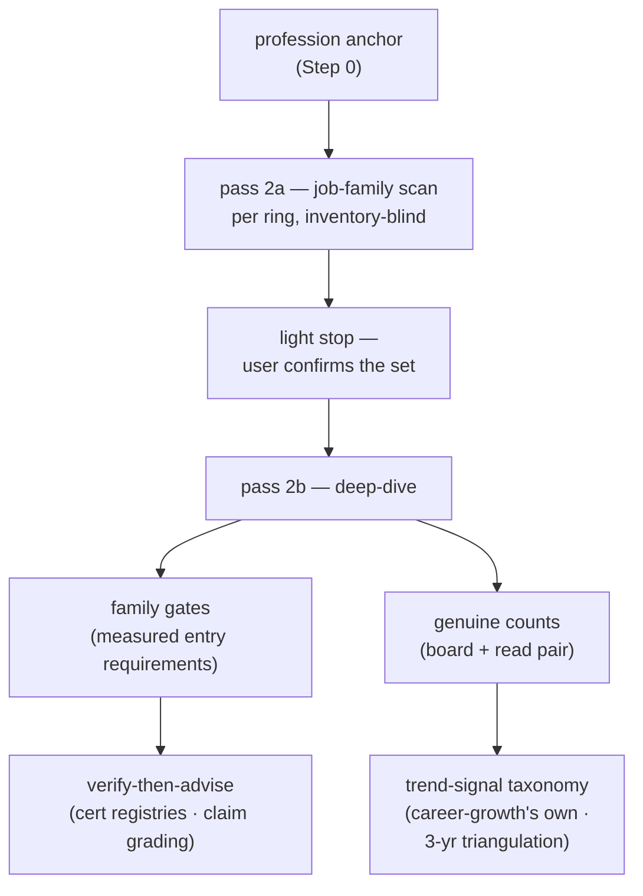
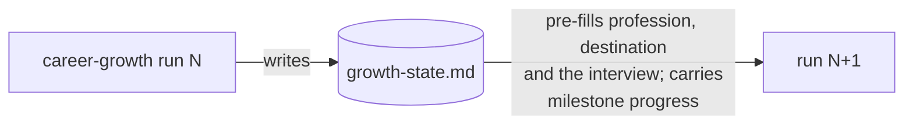

# career-growth Market-First Redesign Implementation Plan

> **For agentic workers:** REQUIRED SUB-SKILL: Use sp-subagent-driven-development (recommended) or sp-executing-plans to implement this plan task-by-task. Steps use checkbox (`- [ ]`) syntax for tracking.

**Goal:** Cut the dependency that let Station 1's inventory scope Station 2's market survey, and replan Station 5 around measured family gates instead of certificates.

**Architecture:** All changes are prose edits to one skill (`plugins/dev-workflows/skills/career-growth/`) plus its three reference files, followed by a version bump and seven description corrections. No new scripts, no new skills, no code. Each task is gated by a **scratchpad verifier** (`verify.py`) that asserts the invariants of the redesign as string checks against the edited files — write the check first, watch it fail, edit, watch it pass.

**Tech Stack:** Markdown (CRLF), JSON manifests, Python 3 for all file writes (the write-guard makes Write/Edit unusable in this repo — see Global Constraints).

**Spec:** `C:\Repo2\workflow daily work\docs\superpowers\specs\2026-08-26-career-growth-market-first-redesign-design.md`

## Global Constraints

- **The Write and Edit tools are BLOCKED for every path under `C:\Repo2\workflow daily work`** by the mobile-app write-guard (measured this session: both tools refused). Every repo write in this plan goes: author the payload in the scratchpad with Write → run a Python script **by path** that copies/splices it in. Never inline a payload containing backslashes or newlines into a Bash heredoc.
- **Scratchpad root:** `C:/Users/THODSA~1.SON/AppData/Local/Temp/claude/c--Repo2-carreer/860b18a7-e9a2-48ea-8691-e6359b09c4cd/scratchpad` — referred to below as `$SP`. A ready `copyin.py` (whole-file copy with EOL matching) already exists there from the design session.
- **Line endings are MIXED file-to-file** — measured by byte count on 2026-08-26, and `grep -q $'\r'` reports it WRONG (it read every one of these as LF). Count `b'\r\n'` against lone `b'\n'` instead. What the files this plan edits actually are:

  | file | EOL |
  |---|---|
  | `skills/career-growth/SKILL.md` | **LF** |
  | `skills/career-growth/references/market-sources.md` | **CRLF** |
  | `skills/career-growth/references/growth-state-contract.md` | **CRLF** |
  | `skills/career-growth/references/interview-bank.md` | **CRLF** |
  | `skills/verify-then-advise/SKILL.md` | **LF** |
  | `plugins/dev-workflows/.claude-plugin/plugin.json` | **CRLF** |
  | `.claude-plugin/marketplace.json` | **CRLF** |
  | `plugins/dev-workflows/README.md` | **CRLF** |
  | `plugins/dev-workflows/commands/career-growth.md` | **CRLF** |
  | `docs/superpowers/plans/*.md` | **LF** (whole directory) |

  Every script in this plan detects the target's EOL per file and re-emits in it — never assume, never let Python's bare `\n` reach a CRLF file, and re-measure if a step reports an unexpected diff size.
- **Version to mint: `0.51.0`.** Global max across every ref and worktree is `0.50.0`, verified 2026-08-26 (`main`, `origin`, `origin/main` all 0.50.0; every other branch lower). Per CLAUDE.md the version is minted from the global max, so re-run that scan immediately before merging.
- **Both version files must agree:** `plugins/dev-workflows/.claude-plugin/plugin.json` and the `dev-workflows` entry in `.claude-plugin/marketplace.json`.
- **The spec's §8.5 undercounted the "cert-driven" sites.** It names only `marketplace.json`. There are **seven**, enumerated in Task 7; this plan is authoritative on that list.
- **`career-growth` is NOT a vendored superpowers copy** (absent from `references/vendored-superpowers.json`), so `check_vendored_superpowers.py` does not gate this work and must not be run as if it did.
- **Skills stay harness-neutral.** Name actions, not one harness's tools. `career-growth` uses skill-relative reference paths (`references/x.md`) and no `${CLAUDE_PLUGIN_ROOT}`; keep it that way so the Antigravity installer's `rewrite_plugin_root()` needs no new shape. The installer auto-discovers skills (`discover_skills()`), so no registration step exists.
- **Diagram convention:** the in-terminal pipeline diagram is a **terminal diagram** (Unicode box-drawing, vertical, ≲50 columns, never Mermaid). Documents the skill *generates* keep their Mermaid overview requirement.
- **ADR numbers 0148–0152 are taken** by this redesign's decisions. If execution produces a new design decision (a controller ruling counts), the next number is minted by the ADR-FORMAT global-max scan, not by adding one to 0152.
- **Do not modify `verify-then-advise`'s method.** Task 7 touches exactly one cross-reference sentence in its SKILL.md.
- **No new permanent scripts.** `verify.py` lives in the scratchpad and is deleted at finish; it is a plan gate, not a repo artifact.

---

## File Structure

| File | Responsibility | Task |
|---|---|---|
| `$SP/verify.py` | scratchpad gate — asserts every invariant of the redesign as string checks; `python verify.py <prefix>` runs one group | 1 |
| `$SP/splice.py` | scratchpad helper — replaces the span between two single-line anchors in a repo file, EOL-preserving, `.BAK` first | 1 |
| `.../career-growth/SKILL.md` | the pipeline: Step 0 inputs, evidence rule 5, Station 2's two passes, Stations 3–5, failure table, frontmatter description | 2, 3, 4 |
| `.../career-growth/references/market-sources.md` | pass 2a family-scan method, genuine-count reading method, family-gate fields | 5 |
| `.../career-growth/references/growth-state-contract.md` | contract v2 + v1 migration rule | 6 |
| `.../career-growth/references/interview-bank.md` | profession + declared-destination questions; the language-answer grading note | 7 |
| `plugin.json`, `marketplace.json`, `README.md`, `commands/career-growth.md`, `verify-then-advise/SKILL.md` | the seven advertised descriptions + the version bump | 8 |

---

### Task 1: Branch, and build the scratchpad gate

**Files:**
- Create: `$SP/verify.py`
- Create: `$SP/splice.py`
- Modify: nothing in the repo yet

**Interfaces:**
- Consumes: nothing.
- Produces: `python $SP/verify.py <group>` where `<group>` is one of `s0`, `r5`, `s2`, `s345`, `ms`, `gs`, `ib`, `desc`, `ver`, or `all`; exits 0 when every check in the group passes, 1 with a per-check report otherwise. `python $SP/splice.py <file> <start-anchor> <end-anchor> <payload-file>` replaces the span from the line equal to `<start-anchor>` up to (not including) the line equal to `<end-anchor>`.

- [ ] **Step 1: Create the working branch**

The repo currently has uncommitted work from the design session (five ADRs, `CONTEXT.md`, ADR 0051's status line, the spec). `checkout -b` carries it across untouched — do **not** stash.

```bash
cd "C:/Repo2/workflow daily work" && git checkout -b feat/career-growth-market-first && git status --porcelain | head -10
```

Expected: branch created; the same 7 modified/untracked paths still listed.

- [ ] **Step 2: Write the splice helper**

```python
# $SP/splice.py
import sys, io, os, shutil
sys.stdout = io.TextIOWrapper(sys.stdout.buffer, encoding='utf-8', errors='replace')

target, start_anchor, end_anchor, payload_path = sys.argv[1:5]

with open(target, "rb") as f:
    raw = f.read()
eol = "\r\n" if b"\r\n" in raw else "\n"
lines = raw.decode("utf-8").split(eol)

starts = [i for i, l in enumerate(lines) if l == start_anchor]
ends = [i for i, l in enumerate(lines) if l == end_anchor]
assert len(starts) == 1, "start anchor matched %d times: %r" % (len(starts), start_anchor)
assert len(ends) == 1, "end anchor matched %d times: %r" % (len(ends), end_anchor)
a, b = starts[0], ends[0]
assert a < b, "start anchor (line %d) must precede end anchor (line %d)" % (a + 1, b + 1)

with open(payload_path, "rb") as f:
    payload = f.read().decode("utf-8").replace("\r\n", "\n").split("\n")
if payload and payload[-1] == "":
    payload.pop()

bak = os.path.join(os.path.dirname(payload_path), os.path.basename(target) + ".BAK")
shutil.copy2(target, bak)

out = lines[:a] + payload + lines[b:]
with open(target, "wb") as f:
    f.write(eol.join(out).encode("utf-8"))
print("OK spliced %s: replaced lines %d-%d with %d lines (eol=%r)" % (
    os.path.basename(target), a + 1, b, len(payload), eol))
print("OK backup:", bak)
```

- [ ] **Step 3: Write the verifier with every check for the whole plan**

Each check is `(id, path-key, kind, needle, expected)`. `kind` is `has` (substring present when expected is True, absent when False) or `count` (exact occurrence count).

```python
# $SP/verify.py
import sys, io, os
sys.stdout = io.TextIOWrapper(sys.stdout.buffer, encoding='utf-8', errors='replace')

R = "C:/Repo2/workflow daily work"
CG = R + "/plugins/dev-workflows/skills/career-growth"
P = {
    "skill":  CG + "/SKILL.md",
    "ms":     CG + "/references/market-sources.md",
    "gs":     CG + "/references/growth-state-contract.md",
    "ib":     CG + "/references/interview-bank.md",
    "plugin": R + "/plugins/dev-workflows/.claude-plugin/plugin.json",
    "market": R + "/.claude-plugin/marketplace.json",
    "readme": R + "/plugins/dev-workflows/README.md",
    "cmd":    R + "/plugins/dev-workflows/commands/career-growth.md",
    "vta":    R + "/plugins/dev-workflows/skills/verify-then-advise/SKILL.md",
}

CHECKS = [
    # --- s0: Step 0 preflight gains two inputs ---
    ("s0-profession",   "skill", "has", "coarsest true label", True),
    ("s0-prof-once",    "skill", "has", "asked once, ever", True),
    ("s0-destination",  "skill", "has", "declared destination", True),
    ("s0-dest-optional","skill", "has", "Absent is a valid answer", True),

    # --- r5: evidence rule 5 ---
    ("r5-rule",         "skill", "has", "5. **A verdict-bearing count is a board+genuine pair**", True),
    ("r5-unread",       "skill", "has", "A count labeled `unread` may inform but", True),
    ("r5-external",     "skill", "has", "is a lead to re-measure, never a", True),
    ("r5-meaning",      "skill", "has", "Bearing a verdict means", True),

    # --- s2: Station 2's two passes ---
    ("s2-2a-heading",   "skill", "has", "### Pass 2a — inventory-blind job-family scan", True),
    ("s2-blind",        "skill", "has", "may not read Station 1's output", True),
    ("s2-cap",          "skill", "has", "8–10 job families per ring", True),
    ("s2-cap-report",   "skill", "has", "names the dropped families", True),
    ("s2-stop",         "skill", "has", "### The light stop — the user confirms the deep-dive set", True),
    ("s2-auto",         "skill", "has", "enters automatically", True),
    ("s2-2b-heading",   "skill", "has", "### Pass 2b — the scoped deep-dive", True),
    ("s2-gates",        "skill", "has", "extract its **family gates**", True),
    ("s2-gate-unread",  "skill", "has", "say so per family rather than leaving the field absent", True),
    ("s2-family-table", "skill", "has", "the per-ring family table", True),
    ("s2-old-scope",    "skill", "has", "for the skill areas from Station 1's inventory plus any adjacent", False),

    # --- s345: Stations 3-5 ---
    ("s3-anchor",       "skill", "has", "may anchor on any deep-dived job family", True),
    ("s3-dest-mand",    "skill", "has", "**A declared destination is a mandatory candidate.**", True),
    ("s3-comparator",   "skill", "has", "at least one comparator", True),
    ("s3-gates-listed", "skill", "has", "lists the family gates it must clear", True),
    ("s4-gates-recorded","skill","has", "records the chosen candidate's family gates", True),
    ("s5-lanes",        "skill", "has", "Create **one lane per measured family gate**", True),
    ("s5-hole",         "skill", "has", "no lane is a planning hole", True),
    ("s5-justif",       "skill", "has", "institution or ring demonstrably reads it", True),
    ("s5-justif-b",     "skill", "has", "readiness check graded **unknown**", True),
    ("s5-drop",         "skill", "has", "the plan and recorded as dropped", True),
    ("s5-baseline",     "skill", "has", "**measured baseline** before its milestone", True),
    ("s5-zero-hour",    "skill", "has", "across every lane", True),
    ("s5-lane-table",   "skill", "has", "lane table", True),
    ("s5-readiness",    "skill", "has", "**moat-fit ÷ remaining hours**, not by moat-fit alone", True),   # survives
    ("s5-practice",     "skill", "has", "practice assessment", True),          # survives
    ("s5-objectives",   "skill", "has", "*backwards from exam objectives*: the project exists", True),# survives
    ("fail-2a-empty",   "skill", "has", "Pass 2a returns no families for a ring", True),
    ("fail-no-req",     "skill", "has", "A board exposes no requirement text", True),
    ("fail-v1",         "skill", "has", "A v1 `growth-state.md` is found", True),

    # --- ms: market-sources.md ---
    ("ms-scan",         "ms", "has", "## Pass 2a — enumerating job families", True),
    ("ms-anchor-rule",  "ms", "has", "the profession anchor", True),
    ("ms-genuine",      "ms", "has", "## Genuine counts — the reading method", True),
    ("ms-first-page",   "ms", "has", "first page of returned titles", True),
    ("ms-record",       "ms", "has", "**Record both integers**", True),
    ("ms-gate-fields",  "ms", "has", "## Family gates — the fields to extract", True),
    ("ms-taxonomy",     "ms", "has", "Trend-signal taxonomy", True),  # survives

    # --- gs: growth-state-contract.md ---
    ("gs-v2",           "gs", "has", "version: 2", True),
    ("gs-profession",   "gs", "has", "profession:", True),
    ("gs-dest",         "gs", "has", "declared_destination:", True),
    ("gs-milestones",   "gs", "has", "milestones:", True),
    ("gs-lane",         "gs", "has", "lane: certificate", True),
    ("gs-justif",       "gs", "has", "justification:", True),
    ("gs-baseline",     "gs", "has", "baseline:", True),
    ("gs-migration",    "gs", "has", "## Migrating a v1 file", True),
    ("gs-mig-read",     "gs", "has", "read, not rejected", True),
    ("gs-old-certs",    "gs", "has", "target_certs:", False),

    # --- ib: interview-bank.md ---
    ("ib-profession",   "ib", "has", "coarsest label", True),
    ("ib-dest",         "ib", "has", "declared destination", True),
    ("ib-lang-note",    "ib", "has", "is not a measured baseline", True),
    ("ib-lang-exists",  "ib", "has", "Which human languages do you work in", True),  # untouched

    # --- desc: the seven advertised descriptions ---
    ("desc-skill",      "skill",  "has", "cert-driven", False),
    ("desc-skill-gate", "skill",  "has", "gate-driven", True),
    ("desc-plugin",     "plugin", "has", "cert-driven", False),
    ("desc-market",     "market", "has", "cert-driven", False),
    ("desc-readme",     "readme", "has", "cert-driven", False),
    ("desc-cmd",        "cmd",    "has", "cert-driven", False),
    ("desc-vta",        "vta",    "has", "certification-driven study plan", False),

    # --- ver: version bump ---
    ("ver-plugin",      "plugin", "has", '"version": "0.51.0"', True),
    ("ver-market",      "market", "has", '"version": "0.51.0"', True),
    ("ver-plugin-old",  "plugin", "has", '"version": "0.50.0"', False),
]

GROUPS = {
    "s0":   ["s0-"],
    "r5":   ["r5-"],
    "s2":   ["s2-"],
    "s345": ["s3-", "s4-", "s5-", "fail-"],   # one gate for Stations 3-5 + the failure table
    "ms":   ["ms-"],
    "gs":   ["gs-"],
    "ib":   ["ib-"],
    "desc": ["desc-"],
    "ver":  ["ver-"],
}

def run(group):
    if group == "all":
        sel = list(CHECKS)
    else:
        prefixes = GROUPS.get(group, [])
        sel = [c for c in CHECKS if any(c[0].startswith(p) for p in prefixes)]
    if not sel:
        print("no checks match group %r" % group); return 2
    cache = {}
    bad = 0
    for cid, key, kind, needle, expected in sel:
        path = P[key]
        if path not in cache:
            with open(path, "rb") as f:
                cache[path] = f.read().decode("utf-8")
        text = cache[path]
        if kind == "has":
            ok = (needle in text) == expected
            got = "present" if needle in text else "absent"
        else:
            ok = text.count(needle) == expected
            got = "count=%d" % text.count(needle)
        if not ok:
            bad += 1
            print("FAIL %-20s %-8s %s (%s)" % (cid, key, needle[:60], got))
    print("%s: %d checks, %d failing" % (group, len(sel), bad))
    return 1 if bad else 0

sys.exit(run(sys.argv[1] if len(sys.argv) > 1 else "all"))
```

- [ ] **Step 4: Run the verifier to confirm it fails everywhere it should**

```bash
python "$SP/verify.py" all
```

Expected: exit 1. Every `s0`/`r5`/`s2`/`s345`/`ms`/`gs`/`desc`/`ver` check FAILs except the five marked "survives"/"untouched" (`s5-readiness`, `s5-practice`, `s5-objectives`, `ms-taxonomy`, `ib-lang-exists`) and `s2-old-scope`, which currently fails *because* the old scoping sentence is still present. If any *new* check passes now, its needle is too weak — sharpen it before continuing.

- [ ] **Step 5: Commit the branch point**

The verifier is scratchpad-only, so there is nothing to add yet. Record the starting state instead:

```bash
cd "C:/Repo2/workflow daily work" && git add docs/adr CONTEXT.md docs/superpowers/specs docs/superpowers/plans && git commit -m "docs(career-growth): ADRs 0148-0152, glossary terms and the market-first design spec

The grilling session's decision record: two-pass MARKET, genuine-count rule,
gate-driven PLAN lanes, declared-destination entry. ADR 0051 marked
superseded in part by workflow-daily-work-0152.

Co-Authored-By: Claude Fable 5 <noreply@anthropic.com>"
```

Expected: one commit; `git log --oneline -1` shows it.

---

### Task 2: SKILL.md — the pipeline diagram, Step 0's two new inputs, and evidence rule 5

**Files:**
- Modify: `plugins/dev-workflows/skills/career-growth/SKILL.md` (three spans)
- Create: `$SP/p-diagram.md`, `$SP/p-rules.md`, `$SP/p-step0.md`

**Interfaces:**
- Consumes: `$SP/splice.py` and `$SP/verify.py` from Task 1.
- Produces: the terms later tasks depend on — `profession` and `declared destination` as Step 0 inputs, and **evidence rule 5** as the rule Station 2 and Station 5 both cite by number.

- [ ] **Step 1: Run the verifier for this task's groups and watch them fail**

```bash
SP="C:/Users/THODSA~1.SON/AppData/Local/Temp/claude/c--Repo2-carreer/860b18a7-e9a2-48ea-8691-e6359b09c4cd/scratchpad"; python "$SP/verify.py" s0; python "$SP/verify.py" r5
```

Run each separately (the script takes one group). Expected: `s0: 4 checks, 4 failing` and `r5: 4 checks, 4 failing`.

- [ ] **Step 2: Author the replacement pipeline diagram**

Write this to `$SP/p-diagram.md`. It replaces the span from the line `Print this pipeline diagram verbatim in your first response of a run:` up to (not including) `## Non-negotiable evidence rules`. Keep it ≲50 columns — it is a terminal diagram, never Mermaid.

````markdown
Print this pipeline diagram verbatim in your first response of a run:

```
CAREER-GROWTH — five stations, full run every time
──────────────────────────────────────────────────

  ① INVENTORY   evidence-graded skill inventory
  │    resume · repos · git history ·
  │    certs/LinkedIn · ADO (if available) ·
  │    gap-fill interview
  ▼
  ② MARKET      two passes over the rings
  │  2a  job-family scan — profession-anchored,
  │      INVENTORY-BLIND, capped per ring
  │      ⛔ light stop: you confirm the set
  │  2b  deep-dive — family gates read,
  │      genuine counts, certs live-verified,
  │      3-yr outlook triangulated (≥3 signals)
  ▼
  ③ GAP + MOAT  inventory × market
  │    candidates may anchor on any deep-dived
  │    family; a declared destination is a
  │    mandatory candidate
  │    four tests: rare · evidenced ·
  │    paid · durable
  ▼
  ④ PRESENT ⛔  the user picks the moat
  │    (approval gate — nothing below
  │     runs without an explicit pick)
  ▼
  ⑤ PLAN        gate-driven lanes
       one lane per measured family gate;
       cert lane keeps readiness ÷ hours;
       every cert states its (a)/(b) case
       → career repo, assisted commit
```

````

(The trailing blank line inside the payload is deliberate — it keeps one blank line before the next heading.)

- [ ] **Step 3: Splice the diagram in**

```bash
SP="C:/Users/THODSA~1.SON/AppData/Local/Temp/claude/c--Repo2-carreer/860b18a7-e9a2-48ea-8691-e6359b09c4cd/scratchpad"; python "$SP/splice.py" "C:/Repo2/workflow daily work/plugins/dev-workflows/skills/career-growth/SKILL.md" "Print this pipeline diagram verbatim in your first response of a run:" "## Non-negotiable evidence rules" "$SP/p-diagram.md"
```

Expected: `OK spliced SKILL.md: replaced lines 13-44 ...` plus a `.BAK` path. If either anchor reports a match count other than 1, stop — do not retry with a different anchor until you have looked at the file.

- [ ] **Step 4: Author the evidence-rules section with rule 5 added**

Write this to `$SP/p-rules.md`. It replaces the span from `## Non-negotiable evidence rules` up to `## Step 0 — Preflight`. Rules 1–4 are re-emitted unchanged in substance; rule 5 is new.

```markdown
## Non-negotiable evidence rules

All outside-world fact verification — certificate lifecycle, market demand,
claim grading — is delegated to **`verify-then-advise`**; Station 2 runs its
six-stage method rather than career-growth re-deriving a thinner copy of it.
Rules 1–2 below are consequences of running that method; rule 3 draws on
career-growth's own trend-signal taxonomy, with the sibling contributing
claim grading and the counter-signal hunt that stress-test it:

1. **Never answer certificate questions from memory** — every cert is
   live-verified against the vendor's registry before it may be named
   (`verify-then-advise` stage 2).
2. **Every market claim carries its source and a confidence grade** — one of
   `verify-then-advise`'s four grades (Verified-primary / Corroborated /
   Directional / Unverified); an ungraded claim may not appear in
   `market-report.md`.
3. **No 3-year claim without triangulation** — at least three signal types,
   drawn from this skill's own trend-signal taxonomy
   (`references/market-sources.md`); `verify-then-advise` contributes the
   claim-grading scale and the counter-signal hunt that stress-test the case.

Two rules have no sibling equivalent and stay entirely career-growth's own:

4. **Personal data never enters this plugin or the current project.** All outputs
   go to the career repo. Commits there are assisted — propose, show, let the user
   approve — never automatic.
5. **A verdict-bearing count is a board+genuine pair** — a posting count may
   support a verdict only when it carries both the raw board figure **and** a
   genuine figure from reading the returned titles (method in
   `references/market-sources.md`). A count labeled `unread` may inform but
   never decide. An `[External-research]` count — anything a research run
   reported rather than you measuring it — is a lead to re-measure, never a
   citable count. *Bearing a verdict means* feeding a four-test line, a cert
   or lane ranking, or the family shortlist; round 1's unreproducible counts
   reached all three.
```

- [ ] **Step 5: Splice the rules in and verify group r5 passes**

```bash
SP="C:/Users/THODSA~1.SON/AppData/Local/Temp/claude/c--Repo2-carreer/860b18a7-e9a2-48ea-8691-e6359b09c4cd/scratchpad"; python "$SP/splice.py" "C:/Repo2/workflow daily work/plugins/dev-workflows/skills/career-growth/SKILL.md" "## Non-negotiable evidence rules" "## Step 0 — Preflight" "$SP/p-rules.md" && python "$SP/verify.py" r5
```

Expected: splice OK, then `r5: 4 checks, 0 failing`.

- [ ] **Step 6: Author the new Step 0**

Write this to `$SP/p-step0.md`. It replaces the span from `## Step 0 — Preflight` up to `## Station 1 — INVENTORY`. Items 1–2 and 5–6 carry the existing content; 3–4 are new.

```markdown
## Step 0 — Preflight

1. **Career repo path** — if `$ARGUMENTS` is present and resolves to a usable
   directory, use it as the career repo path; only ask the user for it (or
   confirm from a previous run) when `$ARGUMENTS` is absent or doesn't resolve.
   Also ask for (or confirm) the **resume file path** and the **list of repo
   roots** to scan. If the career repo doesn't exist or isn't a git repo, offer
   to create/`git init` it.
2. Read `growth-state.md` and the four artifacts from the career repo if present
   (see `references/growth-state-contract.md`). They pre-fill this run; they never
   skip a station. A **v1** file is read, not rejected — migrate it per that
   reference's migration section before using its values.
3. **Profession** — ask for the **coarsest true label** for what the user does
   ("software engineering", "data", "finance"), not their specialisation. This
   is pass 2a's only anchor, and a narrow answer re-creates the bias the two
   passes exist to remove. It is **asked once, ever**: carried in
   `growth-state.md` and confirmed rather than re-asked on later rounds.
4. **Declared destination** (optional) — ask whether the user is already aiming
   at a named target: role + ring + stack (e.g. "Solution Architect, Bangkok,
   Microsoft Business Applications"). **Absent is a valid answer** and the
   normal one on a first round. A declared destination forces its job families
   into pass 2b's deep-dive set and becomes a mandatory candidate in Station 3
   — it is an input to validate, never a shortcut past the Station 4 gate
   (workflow-daily-work-0151).
5. Detect the optional ADO source: if the `ado-backlog` plugin's skills are
   available in this session, plan to use its assigned-work view in Station 1
   with `$env:AZDO_SHOW_DONE = "true"` — that view's default output is open
   work, and only its Done/Resolved table is delivered-work evidence;
   otherwise tell the user the ADO source is skipped and continue.
6. Confirm the target market rings — default **Thailand + SEA + global remote**;
   the user may narrow or swap for this run.
```

- [ ] **Step 7: Splice Step 0 in and verify group s0 passes**

```bash
SP="C:/Users/THODSA~1.SON/AppData/Local/Temp/claude/c--Repo2-carreer/860b18a7-e9a2-48ea-8691-e6359b09c4cd/scratchpad"; python "$SP/splice.py" "C:/Repo2/workflow daily work/plugins/dev-workflows/skills/career-growth/SKILL.md" "## Step 0 — Preflight" "## Station 1 — INVENTORY" "$SP/p-step0.md" && python "$SP/verify.py" s0
```

Expected: splice OK, then `s0: 4 checks, 0 failing`.

- [ ] **Step 8: Confirm nothing else in the file moved**

```bash
cd "C:/Repo2/workflow daily work" && git diff --stat -- plugins/dev-workflows/skills/career-growth/SKILL.md && grep -c "^## " plugins/dev-workflows/skills/career-growth/SKILL.md
```

Expected: one file changed; the `^## ` heading count is still **9** — evidence rules, Step 0, Stations 1–5, Failure & degradation, Relationship to neighbouring skills. This task adds and removes no `##` heading, so any number other than 9 means a splice ate one; restore from the `.BAK` and re-check the anchors.

- [ ] **Step 9: Commit**

```bash
cd "C:/Repo2/workflow daily work" && git add plugins/dev-workflows/skills/career-growth/SKILL.md && git commit -m "feat(career-growth): preflight captures profession and declared destination

Adds evidence rule 5 (a verdict-bearing count is a board+genuine pair) and
redraws the pipeline diagram for MARKET's two passes.
Refs workflow-daily-work-0148, -0150, -0151.

Co-Authored-By: Claude Fable 5 <noreply@anthropic.com>"
```

---

### Task 3: SKILL.md — Station 2's two passes

**Files:**
- Modify: `plugins/dev-workflows/skills/career-growth/SKILL.md` (the Station 2 span)
- Create: `$SP/p-station2.md`

**Interfaces:**
- Consumes: `profession` and `declared destination` from Task 2's Step 0; evidence rule 5 by number.
- Produces: the vocabulary Stations 3–5 consume — **job family**, **family gate**, **the deep-dive set**, and `market-report.md`'s new sections (per-ring family table, family-gate table per family).

- [ ] **Step 1: Watch group s2 fail**

```bash
SP="C:/Users/THODSA~1.SON/AppData/Local/Temp/claude/c--Repo2-carreer/860b18a7-e9a2-48ea-8691-e6359b09c4cd/scratchpad"; python "$SP/verify.py" s2
```

Expected: `s2: 11 checks, 11 failing` — ten because the new text is absent, and `s2-old-scope` because the old inventory-scoped sentence is still there.

- [ ] **Step 2: Author the new Station 2**

Write this to `$SP/p-station2.md`. It replaces the span from `## Station 2 — MARKET` up to `## Station 3 — GAP + MOAT`.

```markdown
## Station 2 — MARKET

Two passes over the confirmed rings. Pass 2a looks at the market with no
knowledge of the person; pass 2b spends the research budget only where the
user has agreed it should go (workflow-daily-work-0148, -0149).

Both passes run `verify-then-advise`'s six-stage method — load that skill via
your harness's mechanism. Two of its stages run before any source-list work
and are easy to miss if you assume you already know the method:

- **Inventory the moving parts** (stage 1) — before researching anything,
  list every external entity this round's advice will name (certs, vendors,
  products, market claims) as the verification queue.
- **Compute headline numbers in a script** (stage 6) — any number that
  carries the recommendation is computed from source values, once, in a
  script; never sum rounded per-item parts.

`references/market-sources.md` is the **starting** board and ring list — it
bounds where the survey begins, not where it must stop.

### Pass 2a — inventory-blind job-family scan

This pass **may not read Station 1's output**, and that prohibition is the
whole point: a survey scoped by the skills a person already holds can only
find more of what they already have. Round 1 of this skill scoped Station 2
that way and never counted the job family that later decided the plan.

1. Anchor on the **profession** captured in Step 0 — nothing narrower.
2. Enumerate the **job families** that exist in each ring under that
   profession: named, separately-laddered roles a person is hired *as*, not
   skill keywords. Cap at **8–10 job families per ring** so MARKET stays a
   single-session stage (ADR 0047). When the cap truncates, `market-report.md`
   names the dropped families — a silent truncation reads as "that was all
   there was".
3. Per family record: ring · the titles it appears under · a board count
   labeled `unread` · any entry requirement the list view already exposes.
   Pass 2a counts are **not** verdict-bearing (evidence rule 5), which is why
   an `unread` figure is acceptable here and nowhere downstream.
4. Note where a family has **no ladder in a ring** at all. Round 1's most
   useful structural finding was exactly this shape — a capability that
   existed only as a differentiator inside a conventional title, never as a
   job to apply for.

### The light stop — the user confirms the deep-dive set

Present the per-ring family table and propose the deep-dive set. A family
that is **inventory-adjacent** (it plainly matches Station 1's evidence) or
that belongs to a **declared destination** enters automatically; the user
adds or cuts the rest. This is a light stop, not the Station 4 gate — no moat
is chosen here, and the run continues as soon as the set is agreed.

### Pass 2b — the scoped deep-dive

For each family in the confirmed set:

1. **Read the requirement text** and extract its **family gates** — the
   measurable entry requirements (language level, named certificates, domain
   experience, lead delivery, clearance). Where a board exposes no
   requirement text, say so per family rather than leaving the field absent:
   a gate nobody measured must never become a lane in Station 5.
2. **Count genuinely** — read the returned titles and count only the postings
   actually about that family, recording the board count and the genuine
   count as a dated pair (evidence rule 5; method in
   `references/market-sources.md`).
3. **Certificates** — every cert a posting or partner program names is
   live-verified per `verify-then-advise` stage 2 before it may be mentioned,
   together with its published **preparation-hour** figure and whether a
   **practice assessment** exists. Record "not published" explicitly rather
   than leaving the field absent; Station 5's readiness check needs both.
4. **Counter-signal hunt** (stage 3) — a counter-signal is by definition not
   on a curated list; look for the contradicting view (independent analysts,
   adoption data, post-mortems) before advising a direction.
5. **Institutional-incentive read** (stage 5) — read the user's **employer's**
   partner-program, customer, or team requirements for the families in play,
   and surface any dated cliff running against them. This turns a personal
   wish into an employer-funded case, and it is also the evidence a
   certificate needs to earn a lane in Station 5.
6. **Compensation** where boards expose it (aggregator numbers grade
   `Directional`), and the **3-year outlook** triangulated across at least
   three signal types, with the AI-absorption assessment stated per family.

Write **`market-report.md`** to the career repo: overview Mermaid diagram
(rings × families), **the per-ring family table** from pass 2a with its
dropped-family note, the deep-dive set and who chose each entry, a
**family-gate table per deep-dived family**, the demand table (family · board
count · genuine count · source · date · **confidence grade**), the verified
cert list (code, registry status, `verified_on`, registry URL, published prep
hours or "not published", practice assessment yes/no), the counter-signals
found (or "looked, found none"), the institutional-incentive findings with any
dated cliff, and the triangulated outlook with each signal cited and graded.
Also record **what was not checked** — geographies skipped, sources that
blocked, families dropped by the cap, requirement text a board would not
expose, questions left open. The file is overwritten each run; git history in
the career repo keeps the prior rounds.
```

- [ ] **Step 3: Splice it in and verify group s2 passes**

```bash
SP="C:/Users/THODSA~1.SON/AppData/Local/Temp/claude/c--Repo2-carreer/860b18a7-e9a2-48ea-8691-e6359b09c4cd/scratchpad"; python "$SP/splice.py" "C:/Repo2/workflow daily work/plugins/dev-workflows/skills/career-growth/SKILL.md" "## Station 2 — MARKET" "## Station 3 — GAP + MOAT" "$SP/p-station2.md" && python "$SP/verify.py" s2
```

Expected: splice OK, then `s2: 11 checks, 0 failing`.

- [ ] **Step 4: Commit**

```bash
cd "C:/Repo2/workflow daily work" && git add plugins/dev-workflows/skills/career-growth/SKILL.md && git commit -m "feat(career-growth): MARKET runs an inventory-blind family scan, then a scoped deep-dive

Pass 2a enumerates job families per ring from the profession anchor alone and
may not read Station 1; a light stop confirms the deep-dive set; pass 2b reads
family gates and counts genuinely.
Refs workflow-daily-work-0148, -0149, -0150.

Co-Authored-By: Claude Fable 5 <noreply@anthropic.com>"
```

---

### Task 4: SKILL.md — Stations 3, 4, 5 and the failure table

**Files:**
- Modify: `plugins/dev-workflows/skills/career-growth/SKILL.md` (four spans)
- Create: `$SP/p-station3.md`, `$SP/p-station4.md`, `$SP/p-station5.md`, `$SP/p-failure.md`

**Interfaces:**
- Consumes: **job family** and **family gate** from Task 3's Station 2; evidence rule 5 from Task 2.
- Produces: the field names Task 6's contract must hold — a milestone's `lane`, a cert's `justification` (`(a)` or `(b)`), and a lane's `baseline`.

- [ ] **Step 1: Watch group s345 fail**

```bash
SP="C:/Users/THODSA~1.SON/AppData/Local/Temp/claude/c--Repo2-carreer/860b18a7-e9a2-48ea-8691-e6359b09c4cd/scratchpad"; python "$SP/verify.py" s345
```

Expected: `s345: 19 checks, 16 failing` — the three survivors (`s5-readiness`, `s5-practice`, `s5-objectives`) already pass because the current Station 5 contains those phrases; every other check fails.

- [ ] **Step 2: Author Station 3**

Write to `$SP/p-station3.md`; replaces `## Station 3 — GAP + MOAT` up to `## Station 4 — PRESENT ⛔ approval gate`.

```markdown
## Station 3 — GAP + MOAT

Cross INVENTORY × MARKET, weighted by Station 1's evidence grades: `verified`
skills count as strengths; `interview-attested` ones count as real strengths
whose public evidence is still missing, feeding the `evidenced` test as proof
still to be created rather than proof already held; `unverified` ones count as
gaps to close even when claimed.

- **Gap list** — market-demanded skills the user lacks or holds unverified,
  plus every **family gate** from pass 2b that the inventory does not clear.
- **Moat candidates** — skill *combinations* (never single hot skills). A
  candidate **may anchor on any deep-dived job family**, including one the
  inventory barely touches, as long as it states the gap plainly
  (workflow-daily-work-0149). Each candidate carries:
  - its **gap** — what the person is missing for this combination, drawn from
    the Gap list;
  - the gates it faces: each candidate **lists the family gates it must clear**
    (from pass 2b). Station 5 turns exactly this list into lanes, so a
    candidate whose gates were never measured cannot be planned;
  - a four-test argument, one line per test — `rare` (evidence of scarcity in
    the rings) · `evidenced` (what public proof the user has or would gain) ·
    `paid` (demand claims with sources and confidence grade; a `Directional`
    claim may support a direction but never be the sole basis for this verdict,
    and per evidence rule 5 an `unread` or external-only count may not support
    it at all) · `durable` (the triangulated 3-year case against AI/automation
    absorption — synthesise Station 2's per-family AI-absorption assessments
    into one argument for *this combination*, not per skill).
- **A declared destination is a mandatory candidate.** If Step 0 captured one,
  it appears in this station's candidate set whatever the evidence says, argued
  against the same four tests, alongside **at least one comparator** candidate
  so the user is choosing rather than confirming. A failing verdict is reported
  as a failing verdict; the skill never quietly substitutes a different target
  (workflow-daily-work-0151).
- Anything failing a test may appear only as a labeled **supporting skill** —
  never as a moat candidate. The one exception is a declared destination, which
  stays on the table *with its failures shown*, because the user declared it
  and only the user may withdraw it.
```

- [ ] **Step 3: Author Station 4**

Write to `$SP/p-station4.md`; replaces `## Station 4 — PRESENT ⛔ approval gate` up to `## Station 5 — PLAN`.

```markdown
## Station 4 — PRESENT ⛔ approval gate

Present the candidates — a compact table: combination · anchoring job family ·
gap · the family gates to clear · the four test verdicts · strongest evidence —
and ask the user to **pick one moat, or reject all**. On reject: collect the
objections as constraints and loop back to Station 3. Never pick for the user;
never proceed past this gate without an explicit pick. The user may pick a
candidate that failed a test — that is their call to make with the verdict in
front of them, and the pick is recorded with the failure intact.

On a pick, write **`moat.md`** to the career repo: the chosen combination, its
gap, its full four-test argument, the rejected candidates (one line each, why),
and an overview Mermaid decision diagram (chosen vs rejected). It also
**records the chosen candidate's family gates** verbatim — that list is the
input Station 5 plans its lanes from, so a gate missing here is a lane missing
there.
```

- [ ] **Step 4: Author Station 5**

Write to `$SP/p-station5.md`; replaces `## Station 5 — PLAN` up to `## Failure & degradation`.

```markdown
## Station 5 — PLAN

The plan is **gate-driven**: it is built from the family gates recorded in
`moat.md`, not from a certificate list (workflow-daily-work-0152, which
supersedes ADR 0051's cert-driven framing in part). Round 2 of this skill
measured zero certificate mentions across every Ring 1 posting it read, while
the gate that actually blocked the destination — client-facing spoken English —
is closable by no certificate at all.

1. **Draw the lanes.** Create **one lane per measured family gate** from
   `moat.md`: language, certificate, published work, employer/partner
   arithmetic, domain evidence — whatever pass 2b actually measured. **A gate
   with no lane is a planning hole**: name it as one rather than dropping it.
   The converse holds too — a lane with no measured gate behind it does not
   belong in the plan.

2. **Baseline every lane before sizing it.** Every lane needs a
   **measured baseline** before its milestone can be scheduled. This is
   the certificate
   lane's existing discipline, generalised: a published **practice assessment**
   outranks any estimate for a cert; a scored test or a recorded mock call is
   the baseline for a language lane; a public repo's absence is its own
   baseline for an evidence lane. Where no measurement exists, say so plainly
   and label the figure **unvalidated** — nothing downstream will re-check it.

3. **The certificate lane.** Identify the certs that evidence the moat, each
   already live-verified in Station 2. If the moat needs one Station 2 did not
   verify, verify it now via `verify-then-advise`'s registry-verification stage
   before naming it; if the registry is unreachable or the cert is retired, say
   so and use a non-cert milestone in this lane instead. Fetch each exam's
   **study guide** and extract its objective domains. Then:

   - **Every cert states its justification**, one of exactly two: **(a)** an
     institution or ring demonstrably reads it — a partner-program requirement,
     a posting that names it, an employer rule, each from Station 2's
     institutional-incentive read; or **(b)** it forces capability the
     readiness check graded **unknown**. A cert with neither **is dropped from
     the plan and recorded as dropped**, with its reason, so a later round
     revisits it instead of rediscovering it.
   - **Readiness check** — grade every objective domain against `profile.md`:
     **known** (a `verified` entry attests it) · **partial** · **unknown** (no
     entry, or only `unverified` ones). Estimate **remaining hours** from the
     partial + unknown share weighted by each domain's published exam
     weighting — never from the exam's total nominal prep time, which assumes a
     stranger. Record the grade per domain, not just the total: the domain
     table is what makes a wrong estimate visible next round.
   - **Rank, and show the trade** — order candidate certs by
     **moat-fit ÷ remaining hours**, not by moat-fit alone. A cert the
     user has largely
     already earned through delivered work can outrank a closer-fitting one —
     most sharply when the user holds **no live credential**, or when a dated
     employer cliff lands sooner than the closer cert could. Where the two
     orderings disagree, present both with the cost of each in hours and let
     the user choose; never silently resolve it.

4. **Mini projects** — for a certificate lane, design each project
   *backwards from exam objectives*: the project exists to build the
   knowledge the exam
   tests, and passing the exam is the milestone. For every other lane, design
   it backwards from that gate's own measurement, and clearing the gate is the
   milestone. Aim each project at what the baseline graded **unknown** — hours
   spent on already-cleared ground buy nothing. Size each to the user's stated
   study hours; if study hours were never captured (the interview's
   *Constraints & preferences* section can be skipped), ask for them now before
   sizing. Offer (never require) to publish each project to a public repo when
   its content allows — record `published_url` when taken.

5. **Zero-study-hour milestones list first — across every lane.** Publishing
   existing work, asking an employer a question, confirming a credential's
   expiry date, booking a language assessment: each buys gate progress without
   spending the scarcest resource, so each is listed ahead of anything costing
   study hours, whichever lane it sits in.

6. Write **`growth-plan.md`** to the career repo: an overview Mermaid diagram
   (lanes × milestones on a quarter timeline); the **lane table**
   (gate · lane · milestone · baseline (measured / unvalidated) · study
   hours); for the
   certificate lane, its readiness table per candidate cert with per-domain
   grades, the remaining-hour figure marked validated or unvalidated, the
   ranking with the trade shown, and each cert's (a)/(b) justification; the
   certs dropped and why; then per-project sections (what it builds, the gate
   or objective domains covered, milestone, size, publish decision).

7. **Wrap up:** propose the career-repo commit (assisted — show the diff
   summary, let the user approve). On approval, write/finalise
   **`growth-state.md`**'s `last_run` (and the round's other fields) per
   `references/growth-state-contract.md`, **then** commit all five artifacts
   together — `profile.md`, `market-report.md`, `moat.md`, `growth-plan.md`,
   and `growth-state.md` — so the file asserting a committed round exists is
   itself inside that commit. A committed round is what `last_run` means, so a
   crashed run and a declined commit both leave it unchanged: on decline, do
   not write `growth-state.md` at all. Then print the `next_review_due` date
   with a reminder that re-runs are user-initiated. If the user declines the
   commit, say plainly that the run is not recorded as complete and the next
   run's posting-trend-delta signal will have no prior round to diff against.
```

- [ ] **Step 5: Author the failure table**

Write to `$SP/p-failure.md`; replaces `## Failure & degradation` up to `## Relationship to neighbouring skills`. Three rows are new; the rest carry forward.

```markdown
## Failure & degradation

| Situation | Behavior |
|---|---|
| A job board 403s | try the alternates in `references/market-sources.md`; only then report the metric unavailable |
| **Pass 2a returns no families for a ring** | report the ring as unsurveyed and continue with the rings that answered — never fall back to inventory keywords, which is the bias the pass exists to remove |
| **A board exposes no requirement text** | record "gates not exposed" for that family; the family may still be deep-dived on counts, but an unmeasured gate must not become a Station 5 lane |
| Vendor cert registry unreachable | withhold cert recommendations — never from memory; keep a previously-targeted cert's existing status and leave its stale `verified_on` in place, noting the verification could not be refreshed. `retired-blocked` is only for a confirmed retirement listing |
| No published prep hours and no practice assessment for a cert | rank it anyway, on the estimate, but label the figure **unvalidated** in `growth-plan.md` and name the missing measurement as a risk — never present an unmeasured estimate as a schedule |
| A gate has no measurable baseline | keep the lane, label its size **unvalidated**, and list the measurement itself as that lane's first (usually zero-study-hour) milestone |
| **A v1 `growth-state.md` is found** | migrate it per `references/growth-state-contract.md` and say what was carried and what defaulted — never rewrite it silently, and never reject the round for it |
| `ado-backlog` absent | skip the ADO source with an explicit notice |
| No web access at all | the run stops after INVENTORY — Stations 2 through 5 do not run, because without market evidence the `paid` and `durable` tests cannot be argued; say why, never fabricate |
| User rejects all candidates | loop to Station 3 with their objections as constraints |
```

- [ ] **Step 6: Splice all four spans, in descending file order**

Apply them **bottom-up** so an earlier splice cannot shift a later anchor's line number.

```bash
SP="C:/Users/THODSA~1.SON/AppData/Local/Temp/claude/c--Repo2-carreer/860b18a7-e9a2-48ea-8691-e6359b09c4cd/scratchpad"; F="C:/Repo2/workflow daily work/plugins/dev-workflows/skills/career-growth/SKILL.md"; python "$SP/splice.py" "$F" "## Failure & degradation" "## Relationship to neighbouring skills" "$SP/p-failure.md" && python "$SP/splice.py" "$F" "## Station 5 — PLAN" "## Failure & degradation" "$SP/p-station5.md" && python "$SP/splice.py" "$F" "## Station 4 — PRESENT ⛔ approval gate" "## Station 5 — PLAN" "$SP/p-station4.md" && python "$SP/splice.py" "$F" "## Station 3 — GAP + MOAT" "## Station 4 — PRESENT ⛔ approval gate" "$SP/p-station3.md"
```

Expected: four `OK spliced` lines. Anchors are exact-match single lines, so a match count other than 1 aborts that splice before it writes — if one aborts, the earlier ones have already applied; restore from the `.BAK` the aborted call names, or re-run only the remaining splices.

- [ ] **Step 7: Verify group s345 passes**

```bash
SP="C:/Users/THODSA~1.SON/AppData/Local/Temp/claude/c--Repo2-carreer/860b18a7-e9a2-48ea-8691-e6359b09c4cd/scratchpad"; python "$SP/verify.py" s345
```

Expected: `s345: 19 checks, 0 failing`.

- [ ] **Step 8: Read the file end-to-end once**

```bash
sed -n '1,80p' "C:/Repo2/workflow daily work/plugins/dev-workflows/skills/career-growth/SKILL.md"
```

Then read the rest in two more windows. You are checking for what the verifier structurally cannot see: a dangling sentence left by a splice boundary, a duplicated heading, a station referring to something a previous edit renamed. The verifier proves phrases exist; only reading proves the prose still reads as one document.

- [ ] **Step 9: Commit**

```bash
cd "C:/Repo2/workflow daily work" && git add plugins/dev-workflows/skills/career-growth/SKILL.md && git commit -m "feat(career-growth): PLAN is gate-driven; candidates may anchor on a job family

Station 3 lists each candidate's family gates and treats a declared destination
as a mandatory candidate with a comparator; Station 4 records the chosen gates;
Station 5 plans one lane per gate, baselines each, and makes every cert state
its (a) read-by-an-institution or (b) forces-unknown-capability justification.
Refs workflow-daily-work-0149, -0151, -0152.

Co-Authored-By: Claude Fable 5 <noreply@anthropic.com>"
```

---

### Task 5: `market-sources.md` — the family-scan method, genuine counting, and gate fields

**Files:**
- Modify: `plugins/dev-workflows/skills/career-growth/references/market-sources.md`
- Create: `$SP/p-msources.md`

**Interfaces:**
- Consumes: Station 2's two-pass structure and evidence rule 5 (Tasks 2–3), which cite this file by name for both methods.
- Produces: the three named methods the skill defers to — the pass 2a enumeration recipe, the genuine-count reading method, and the family-gate field list.

- [ ] **Step 1: Watch group ms fail**

```bash
SP="C:/Users/THODSA~1.SON/AppData/Local/Temp/claude/c--Repo2-carreer/860b18a7-e9a2-48ea-8691-e6359b09c4cd/scratchpad"; python "$SP/verify.py" ms
```

Expected: `ms: 7 checks, 6 failing` — `ms-taxonomy` already passes (that section stays).

- [ ] **Step 2: Author the replacement front half of the file**

Write to `$SP/p-msources.md`. It replaces the span from `# MARKET station — source list and trend taxonomy` up to `## Trend-signal taxonomy (career-growth's own)`, so the taxonomy section and everything after it survive untouched.

````markdown
# MARKET station — source list, scan methods and trend taxonomy

The fixed per-ring source list that keeps MARKET a single-session stage
(ADR 0047), the two scan methods its passes run (workflow-daily-work-0148,
-0150), plus career-growth's own trend-signal taxonomy for the 3-year
triangulation. Fetchability shifts — treat "known blocked" entries as *skip
immediately*, and when a listed board starts returning 403, try the
alternates before reporting a metric unavailable, then record the
fetchability change in `market-report.md` in the user's career repo and tell
the user to update this reference file in the plugin **source** if the
change looks permanent.



## Ring 1 — Thailand

| Source | Status | Notes |
|---|---|---|
| LinkedIn Jobs (location: Thailand) | fetchable | primary demand signal |
| Indeed Thailand | fetchable | cross-check counts |
| JobsDB (th.jobsdb.com) | **known blocked (403, 2026-07-31)** | skip; do not burn time retrying |

## Ring 2 — SEA (incl. Singapore)

| Source | Status | Notes |
|---|---|---|
| LinkedIn Jobs (SG / MY / VN / ID / PH) | fetchable | primary |
| Indeed Singapore | fetchable | cross-check |
| NodeFlair / regional boards | verify at run time | use only if they serve automated fetch |

## Ring 3 — Global remote

| Source | Status | Notes |
|---|---|---|
| LinkedIn Jobs (remote filter) | fetchable | primary |
| Indeed (remote filter) | fetchable | cross-check |
| We Work Remotely / RemoteOK / Hacker News "Who's hiring" | verify at run time | volume smaller; good rarity signal for niche combos |

## Pass 2a — enumerating job families

The scan starts from **the profession anchor** captured in Step 0 and from
nothing else. It may not read Station 1's inventory: that is the bias the
two-pass split exists to remove, and a "helpful" narrowing re-creates it.

1. Query each ring for the profession in its own coarse terms, plus the
   ladder words that surround it locally (*engineer, developer, architect,
   lead, consultant, specialist, analyst*).
2. Read the returned **titles** and group them into **job families** — named,
   separately-laddered roles a person is hired *as*. Two titles belong to one
   family when a candidate would apply to either with the same CV.
3. Stop at **8–10 families per ring**. Record which families the cap dropped;
   pass that list to `market-report.md`.
4. Per family, record: ring · titles seen · board count (labeled `unread`) ·
   any entry requirement the list view already shows.
5. Record explicitly where a family has **no ladder in a ring**. "The
   capability exists here but only inside a conventional title" is a finding,
   not a null result.

## Genuine counts — the reading method

A board count is a query artifact, not a market fact. Round 1 of this skill
carried external counts that a later round reproduced at 3–10× lower, and one
board count of 4 held **zero** postings actually about the technology named.
So, per evidence rule 5:

1. Open the result list and read the **first page of returned titles** —
   roughly 10–15 postings; more when the page is shorter than that.
2. Count only the postings genuinely about the family or technology in
   question. An ERP end-user role is not a developer role; an "advantageous"
   mention is not a requirement.
3. **Record both integers** — the board figure and the genuine figure — with
   the query string, the board, and the date. A single number is not
   reportable.
4. A count you did not read is labeled `unread`. A count someone else
   reported is `[External-research]`: a lead to re-measure, never a citable
   figure.
5. Where the two figures diverge sharply, say so in `market-report.md` — the
   ratio itself is a finding about the board.

## Family gates — the fields to extract

For every deep-dived family in pass 2b, extract these from the requirement
text. Absent is a valid value; **unread is not** — say which.

| Field | What to capture | Why it matters |
|---|---|---|
| language | which language, at what level, in what setting (docs / meetings / client-facing) | usually the gate no certificate closes |
| certificates named | exact codes, and whether required or "advantageous" | zero mentions across a ring is itself the finding |
| domain experience | industry, years, depth expected | often the cheapest gate to evidence from existing work |
| lead / delivery | leading people, owning delivery, client ownership | separates a senior IC ladder from an architect ladder |
| location / eligibility | on-site, hybrid, timezone, work authorisation | decides whether a ring is reachable at all |
| seniority signal | title ladder, years, scope of decisions | tells you which rung the plan is aiming at |

Where a board exposes no requirement text at list level, record
"gates not exposed" for that family and say so in `market-report.md`'s
not-checked section. An unmeasured gate must not become a Station 5 lane.

````

- [ ] **Step 3: Splice it in and verify**

```bash
SP="C:/Users/THODSA~1.SON/AppData/Local/Temp/claude/c--Repo2-carreer/860b18a7-e9a2-48ea-8691-e6359b09c4cd/scratchpad"; python "$SP/splice.py" "C:/Repo2/workflow daily work/plugins/dev-workflows/skills/career-growth/references/market-sources.md" "# MARKET station — source list and trend taxonomy" "## Trend-signal taxonomy (career-growth's own)" "$SP/p-msources.md" && python "$SP/verify.py" ms
```

Expected: splice OK, then `ms: 7 checks, 0 failing`.

- [ ] **Step 4: Commit**

```bash
cd "C:/Repo2/workflow daily work" && git add plugins/dev-workflows/skills/career-growth/references/market-sources.md && git commit -m "feat(career-growth): market-sources carries the family-scan and genuine-count methods

Adds the pass 2a enumeration recipe (profession anchor, family grouping, the
per-ring cap and its dropped-family report), the genuine-count reading method,
and the six family-gate fields pass 2b extracts.
Refs workflow-daily-work-0148, -0150.

Co-Authored-By: Claude Fable 5 <noreply@anthropic.com>"
```

---

### Task 6: `growth-state-contract.md` — contract v2 and the v1 migration

**Files:**
- Modify: `plugins/dev-workflows/skills/career-growth/references/growth-state-contract.md` (whole file)
- Create: `$SP/overwrite.py`, `$SP/p-contract.md`

**Interfaces:**
- Consumes: `lane`, `justification`, `baseline` from Task 4's Station 5; `profession` and `declared_destination` from Task 2's Step 0.
- Produces: contract **v2** — `milestones:` replaces both `target_certs:` and `mini_projects:`; a v1 file is migrated, never rejected.

- [ ] **Step 1: Watch group gs fail**

```bash
SP="C:/Users/THODSA~1.SON/AppData/Local/Temp/claude/c--Repo2-carreer/860b18a7-e9a2-48ea-8691-e6359b09c4cd/scratchpad"; python "$SP/verify.py" gs
```

Expected: `gs: 10 checks, 10 failing` — nine for absent v2 content, and `gs-old-certs` because `target_certs:` is still present.

- [ ] **Step 2: Write the whole-file overwrite helper**

`copyin.py` refuses an existing destination by design. This one overwrites, EOL-preserving, with a `.BAK` first.

```python
# $SP/overwrite.py
import sys, io, os, shutil
sys.stdout = io.TextIOWrapper(sys.stdout.buffer, encoding='utf-8', errors='replace')

src, dst = sys.argv[1], sys.argv[2]
assert os.path.exists(dst), "dst must already exist (use copyin.py for new files): " + dst
with open(dst, "rb") as f:
    eol = "\r\n" if b"\r\n" in f.read() else "\n"
with open(src, "rb") as f:
    text = f.read().decode("utf-8").replace("\r\n", "\n")
bak = os.path.join(os.path.dirname(src), os.path.basename(dst) + ".BAK")
shutil.copy2(dst, bak)
with open(dst, "wb") as f:
    f.write(text.replace("\n", eol).encode("utf-8"))
print("OK overwrote %s (eol=%r, %d bytes); backup %s" % (
    os.path.basename(dst), eol, os.path.getsize(dst), bak))
```

- [ ] **Step 3: Author contract v2**

Write to `$SP/p-contract.md`.

````markdown
# growth-state.md — contract

The single machine-readable state file the `career-growth` skill maintains in the
user's **career repo** (ADR 0049). One YAML document in a fenced block inside
`growth-state.md`. The skill owns every field; the user may hand-edit
`cadence_months`.



## Schema

```yaml
version: 2                      # contract version — bump only via a new ADR
last_run: 2026-08-26            # ISO date of the last completed full run
cadence_months: 3               # suggested review cadence (user-adjustable)
next_review_due: 2026-11-26     # last_run + cadence_months; printed at wrap-up
profession: "software engineering"   # Step 0 — pass 2a's only anchor; asked once, ever
declared_destination:           # Step 0 — optional; null when the user declared none
  role: "Solution Architect"
  ring: "Thailand"
  stack: "Microsoft Business Applications"
  declared_on: 2026-08-26
  last_verdict: paid-fail       # the Station 3 four-test outcome of the last round
chosen_moat: "<one-line moat statement>"   # copied from moat.md when the user picks (Station 4)
moat_adopted_on: 2026-08-26     # date the current moat was picked
family_gates:                   # Station 4 — the gates moat.md recorded; Station 5 plans lanes from these
  - gate: "client-facing spoken English"
    lane: language
    source: "Ring 3 BA-architect postings, 2026-08-26"
milestones:                     # Station 5 output — one entry per milestone, any lane
  - name: <kebab-slug>
    lane: certificate           # certificate | language | published-work | employer | domain
    for_gate: "partner designation points"   # the family_gates entry this serves
    milestone: "pass PL-400"    # the pass/fail statement
    baseline:                   # the measurement that sized it
      kind: practice-assessment # practice-assessment | scored-test | mock-call | none
      value: "62%"              # measured value, or null
      measured_on: 2026-08-26   # null when kind is none
      validated: true           # false ⇒ the size is an estimate, labeled unvalidated
    justification: a            # certificate lane only: "a" (an institution reads it)
                                # or "b" (forces capability graded unknown)
    remaining_hours: 30         # certificate lane only; from the readiness check
    exam_objectives:            # certificate lane only
      - "Extend the platform"
    status: planned             # planned | in-progress | done
    published_url: null         # public repo URL when published; null when private
target_certs:                   # DEPRECATED in v2 — see the migration section
  []
```

The `target_certs` key is retained as an empty list **only** so a v1 reader
does not crash on a v2 file; the skill never writes entries into it. A
certificate is a `milestones` entry with `lane: certificate`, and its registry
verification (`verified_on`, `registry_url`) travels with the cert list in
`market-report.md`, which is where a stale verification is visible.

## Rules

- **Full run every time (ADR 0050):** re-runs never skip a station; this file
  only pre-fills (profession, declared destination, the interview) and carries
  milestone progress — it is never a reason to skip fresh evidence gathering.
- **`profession` is asked once, ever.** Later rounds confirm it; they do not
  re-ask. A profession that genuinely changed is a new answer, not a refinement.
- **`declared_destination` is re-validated every round**, never assumed. Its
  `last_verdict` records what the four tests said last time, so a destination
  that keeps failing is visibly failing rather than quietly persisting.
- **A cert with no `justification` may not appear.** Station 5 drops it and
  records the drop; a milestone in the certificate lane without `a` or `b` is a
  contract violation, not a default.
- **`baseline.validated: false` must reach the reader.** `growth-plan.md`
  labels that milestone's size **unvalidated**; nothing downstream re-checks it.
- A cert confirmed retired by a reachable registry is removed from
  `milestones` and its replacement proposed (ADR 0048 rule 1). An unreachable
  registry changes nothing.
- The skill writes this file's `last_run` (and the round's other fields)
  once the user has **approved** the career-repo commit but **before** that
  commit runs, so `growth-state.md` is one of the five files the commit
  covers. `last_run` means "a committed round exists in the career repo": a
  crashed run and a commit the user declines both leave this file unchanged.
- This file is a machine-readable state file and is exempt from the diagram
  convention — the four document artifacts carry the diagrams, the same way the
  CONTEXT.md glossary is exempt.

## Migrating a v1 file

A v1 `growth-state.md` is **read, not rejected**. Migrate it in Step 0 and say
what was carried and what defaulted:

| v1 | v2 |
|---|---|
| `version: 1` | `version: 2` |
| `target_certs[]` | one `milestones` entry each, `lane: certificate`, `baseline.kind: none`, `validated: false` |
| `mini_projects[]` | one `milestones` entry each; `for_cert: PL-400` becomes `for_gate` naming that cert's gate, `for_cert: none` becomes the matching non-cert lane |
| — | `profession`: ask (it is the once-ever question) |
| — | `declared_destination`: ask; null is the normal answer |
| — | `family_gates`: empty until this round's Station 4 writes it |
| — | `justification`: absent, so **every carried cert must earn (a) or (b) this round or be dropped** |

A migrated cert carries no baseline and no justification, so the first round
after migration re-argues every cert on the plan. That is the intent: v1 plans
were built without either test.
````

- [ ] **Step 4: Overwrite and verify**

```bash
SP="C:/Users/THODSA~1.SON/AppData/Local/Temp/claude/c--Repo2-carreer/860b18a7-e9a2-48ea-8691-e6359b09c4cd/scratchpad"; python "$SP/overwrite.py" "$SP/p-contract.md" "C:/Repo2/workflow daily work/plugins/dev-workflows/skills/career-growth/references/growth-state-contract.md" && python "$SP/verify.py" gs
```

Expected: overwrite OK, then `gs: 10 checks, 0 failing`. Note `gs-old-certs` asserts `target_certs:` is **absent** — the payload above deliberately keeps a deprecated `target_certs: []` key, so this check will FAIL. That is a real conflict between two decisions, not a typo: resolve it by deleting the deprecated key from the payload (v1 readers do not exist — nothing outside this skill reads the file) and re-running. Record the resolution as an ADR if you choose to keep the key instead.

- [ ] **Step 5: Commit**

```bash
cd "C:/Repo2/workflow daily work" && git add plugins/dev-workflows/skills/career-growth/references/growth-state-contract.md && git commit -m "feat(career-growth): growth-state contract v2 with lanes, baselines and v1 migration

milestones[] replaces target_certs[] and mini_projects[]; each entry carries its
lane, the gate it serves and the baseline that sized it; certificate entries
carry the (a)/(b) justification. Step 0 gains profession and
declared_destination. A v1 file is migrated, never rejected.
Refs workflow-daily-work-0151, -0152.

Co-Authored-By: Claude Fable 5 <noreply@anthropic.com>"
```

---

### Task 7: `interview-bank.md` — the two Step 0 questions and the language-baseline note

**Files:**
- Modify: `plugins/dev-workflows/skills/career-growth/references/interview-bank.md`
- Create: `$SP/p-interview.md`

**Interfaces:**
- Consumes: Step 0's `profession` and `declared destination` (Task 2); the measured-baseline rule (Task 4, Station 5 item 2).
- Produces: nothing later tasks read — this is a leaf.

- [ ] **Step 1: Watch group ib fail**

```bash
SP="C:/Users/THODSA~1.SON/AppData/Local/Temp/claude/c--Repo2-carreer/860b18a7-e9a2-48ea-8691-e6359b09c4cd/scratchpad"; python "$SP/verify.py" ib
```

Expected: `ib: 4 checks, 3 failing` — `ib-lang-exists` passes (that question already exists and must survive).

- [ ] **Step 2: Author the replacement middle of the file**

Write to `$SP/p-interview.md`. It replaces the span from `## Non-git work` up to `## Domain knowledge`, adding one section before it and one note inside the languages section.

```markdown
## Profession & destination (Step 0)

These two are asked in Step 0, before any market work, because pass 2a is
anchored on the first and its deep-dive set is widened by the second.

- What is the **coarsest label** for what you do — "software engineering",
  "data", "finance" — not your specialisation? *(Asked once, ever; later rounds
  confirm the stored answer rather than re-asking. A narrow answer here
  re-creates the inventory bias the two-pass market scan exists to remove, so
  push back on "Power Platform developer" and take "software engineering".)*
- Are you already aiming at a **declared destination** — a named role, in a
  named ring, on a named stack? *(Optional; "no" is the normal first-round
  answer. A declared destination becomes a mandatory Station 3 candidate argued
  against the four tests, so it is an input to validate, not a shortcut.)*

## Non-git work

- What delivered work of the last 2 years left no git trace (config, ops,
  migrations, integrations, admin, reports)?
- What systems do you operate or support that you did not build?

## Soft skills & languages

- Which human languages do you work in, at what level (meetings / writing / docs)?
- Have you led anything — a feature, a rollout, a person, a vendor call?
- What do colleagues come to you for?

A self-reported language level **is not a measured baseline.** It grades
`interview-attested` like any other answer here, and if a family gate turns out
to be language, Station 5's language lane still needs a real measurement — a
scored test or a recorded mock call — before its milestone can be sized. Ask
for the level anyway: it is what tells you whether that measurement is worth
booking.
```

- [ ] **Step 3: Splice it in and verify**

```bash
SP="C:/Users/THODSA~1.SON/AppData/Local/Temp/claude/c--Repo2-carreer/860b18a7-e9a2-48ea-8691-e6359b09c4cd/scratchpad"; python "$SP/splice.py" "C:/Repo2/workflow daily work/plugins/dev-workflows/skills/career-growth/references/interview-bank.md" "## Non-git work" "## Domain knowledge" "$SP/p-interview.md" && python "$SP/verify.py" ib
```

Expected: splice OK, then `ib: 4 checks, 0 failing`.

- [ ] **Step 4: Commit**

```bash
cd "C:/Repo2/workflow daily work" && git add plugins/dev-workflows/skills/career-growth/references/interview-bank.md && git commit -m "feat(career-growth): interview bank carries the profession and destination questions

Adds the Step 0 pair (coarsest profession label, asked once ever; optional
declared destination) and states that a self-reported language level is not the
measured baseline a language lane needs.
Refs workflow-daily-work-0148, -0151, -0152.

Co-Authored-By: Claude Fable 5 <noreply@anthropic.com>"
```

---

### Task 8: The seven advertised descriptions, the version bump, and the cache check

**Files:**
- Modify: `plugins/dev-workflows/skills/career-growth/SKILL.md` (frontmatter `description`)
- Modify: `plugins/dev-workflows/.claude-plugin/plugin.json` (description + version)
- Modify: `.claude-plugin/marketplace.json` (description + version)
- Modify: `plugins/dev-workflows/README.md`
- Modify: `plugins/dev-workflows/commands/career-growth.md`
- Modify: `plugins/dev-workflows/skills/verify-then-advise/SKILL.md` (one cross-reference sentence)
- Create: `$SP/p-desc.py`

**Interfaces:**
- Consumes: every earlier task (the descriptions must describe what now exists).
- Produces: version `0.51.0` in both manifests — the value a cache check looks for.

- [ ] **Step 1: Watch groups desc and ver fail**

```bash
SP="C:/Users/THODSA~1.SON/AppData/Local/Temp/claude/c--Repo2-carreer/860b18a7-e9a2-48ea-8691-e6359b09c4cd/scratchpad"; python "$SP/verify.py" desc; python "$SP/verify.py" ver
```

Expected: `desc: 7 checks, 6 failing` (`desc-skill-gate` already passes — Task 2's diagram introduced "gate-driven") and `ver: 3 checks, 3 failing`.

- [ ] **Step 2: Write the description patch script**

Every replacement asserts its own count before any write, and the script writes nothing if any anchor is wrong.

```python
# $SP/p-desc.py
import sys, io, os, shutil
sys.stdout = io.TextIOWrapper(sys.stdout.buffer, encoding='utf-8', errors='replace')

SP = os.path.dirname(os.path.abspath(__file__))
R = "C:/Repo2/workflow daily work"
DW = R + "/plugins/dev-workflows"

OLD_MANIFEST = ("Growth: career-growth (quarterly career review \u2014 evidence-graded "
                "inventory, live market + certificate survey, four-test moat, "
                "cert-driven mini-project plan).")
NEW_MANIFEST = ("Growth: career-growth (quarterly career review \u2014 evidence-graded "
                "inventory, a two-pass market survey that scans job families before it "
                "looks at your skills, four-test moat, then a gate-driven plan: one "
                "milestone lane per measured entry requirement, certificates included "
                "only where an institution reads them or they force a capability you "
                "lack).")

EDITS = [
    (DW + "/.claude-plugin/plugin.json", OLD_MANIFEST, NEW_MANIFEST),
    (R + "/.claude-plugin/marketplace.json", OLD_MANIFEST, NEW_MANIFEST),
    (DW + "/.claude-plugin/plugin.json", '"version": "0.50.0"', '"version": "0.51.0"'),
    (R + "/.claude-plugin/marketplace.json", '"version": "0.50.0"', '"version": "0.51.0"'),
    (DW + "/README.md",
     "then writes a **cert-driven plan** (mini projects designed from exam objectives) into your personal career git repo",
     "then writes a **gate-driven plan** \u2014 one milestone lane per measured entry requirement (language, certificate, published work, employer arithmetic), each lane baselined before it is sized \u2014 into your personal career git repo"),
    (DW + "/commands/career-growth.md",
     "four-test moat selection, cert-driven growth plan with mini projects",
     "four-test moat selection, gate-driven growth plan with one milestone lane per measured entry requirement"),
    (DW + "/skills/career-growth/SKILL.md",
     "a defensible moat and a cert-driven growth plan",
     "a defensible moat and a gate-driven growth plan"),
    (DW + "/skills/verify-then-advise/SKILL.md",
     "then a certification-driven study plan",
     "then a gate-driven study plan whose lanes come from the entry requirements the market survey measured"),
]

# --- resolve and assert every anchor before the first write ---
texts = {}
for path, old, new in EDITS:
    if path not in texts:
        with open(path, "rb") as f:
            raw = f.read()
        texts[path] = [raw.decode("utf-8"), "\r\n" if b"\r\n" in raw else "\n"]
for i, (path, old, new) in enumerate(EDITS):
    n = texts[path][0].count(old)
    assert n == 1, "edit %d: anchor count %d (expected 1) in %s: %r" % (i, n, path, old[:60])

# --- snapshot, then apply ---
for path in texts:
    shutil.copy2(path, os.path.join(SP, os.path.basename(path) + ".BAK"))
for path, old, new in EDITS:
    texts[path][0] = texts[path][0].replace(old, new, 1)
for path, (text, eol) in texts.items():
    with open(path, "wb") as f:
        f.write(text.encode("utf-8"))
    print("OK patched", path.replace(R + "/", ""))
print("OK %d edits across %d files" % (len(EDITS), len(texts)))
```

- [ ] **Step 3: Run it, then verify both groups**

```bash
SP="C:/Users/THODSA~1.SON/AppData/Local/Temp/claude/c--Repo2-carreer/860b18a7-e9a2-48ea-8691-e6359b09c4cd/scratchpad"; python "$SP/p-desc.py" && python "$SP/verify.py" desc && python "$SP/verify.py" ver
```

Expected: 8 edits across 6 files, then `desc: 7 checks, 0 failing` and `ver: 3 checks, 0 failing`.

- [ ] **Step 4: Confirm the JSON still parses and the diff is small**

A description edit inside a 4000-character JSON line is exactly where a
whole-file reformat hides.

```bash
cd "C:/Repo2/workflow daily work" && python -c "import json;[json.load(open(p,encoding='utf-8')) and print('OK json',p) for p in ['.claude-plugin/marketplace.json','plugins/dev-workflows/.claude-plugin/plugin.json']]" && git diff --stat -w -- .claude-plugin plugins/dev-workflows/.claude-plugin
```

Expected: both files parse; the `--stat -w` diff shows **2 files changed, 4 insertions(+), 4 deletions(-)** (one description line and one version line each). A larger number means a reformat — restore from the `.BAK` files and redo.

- [ ] **Step 5: Re-mint the version against the global max before it is final**

Another session may have bumped `dev-workflows` while this branch was open.

```bash
cd "C:/Repo2/workflow daily work" && for r in $(git for-each-ref --format='%(refname:short)' refs/heads refs/remotes); do v=$(git show "$r:plugins/dev-workflows/.claude-plugin/plugin.json" 2>/dev/null | grep -m1 '"version"'); echo "$r -> $v"; done | sort -t'"' -k4 -V | tail -5
```

Expected: nothing above `0.51.0` other than this branch. If another ref now holds `0.51.0` or higher, re-run `p-desc.py`'s version edits against the new max instead of merging a colliding version.

- [ ] **Step 6: Check the PLAYBOOK row still describes the skill**

```bash
cd "C:/Repo2/workflow daily work" && grep -n "career-growth" PLAYBOOK.md
```

Expected: two lines — a mermaid edge and a table row, both keyed on "planning my own growth / quarterly career review". Neither claims cert-driven, so no edit is required. If either has drifted into describing the plan's shape, update it in this commit.

- [ ] **Step 7: Commit**

```bash
cd "C:/Repo2/workflow daily work" && git add .claude-plugin plugins/dev-workflows/.claude-plugin plugins/dev-workflows/README.md plugins/dev-workflows/commands/career-growth.md plugins/dev-workflows/skills/career-growth/SKILL.md plugins/dev-workflows/skills/verify-then-advise/SKILL.md && git commit -m "feat(dev-workflows): 0.51.0 - career-growth is market-first and gate-driven

Replaces the cert-driven description in all seven places that advertised it
(plugin.json, marketplace.json, README, the command, the skill frontmatter, the
pipeline diagram, and verify-then-advise's cross-reference) and bumps both
manifests to 0.51.0.
Refs workflow-daily-work-0152.

Co-Authored-By: Claude Fable 5 <noreply@anthropic.com>"
```

- [ ] **Step 8: Prove the edit is live, not just committed**

The plugin loads from the cache, not from this repo. A manifest that claims
0.51.0 while `plugins/cache/.../0.51.0/` was never created keeps serving the
old skill, and every manifest-based check still reports success.

```bash
CACHE="$HOME/.claude/plugins/cache/workflow-daily-work/dev-workflows"; ls -1 "$CACHE" 2>/dev/null; grep -c "inventory-blind job-family scan" "$CACHE/0.51.0/skills/career-growth/SKILL.md" 2>/dev/null || echo "NOT LIVE: 0.51.0 cache dir or the new phrase is missing"
```

Expected: a `0.51.0` directory whose `SKILL.md` contains the new phrase at least
once. If the directory is absent, copy it in (`cp -a plugins/dev-workflows/. "$CACHE/0.51.0/"` — dotfiles included, `.claude-plugin/` lives there) and re-check. Report the outcome plainly: "committed and live" or "committed, cache not refreshed".

- [ ] **Step 9: Full verifier run**

```bash
SP="C:/Users/THODSA~1.SON/AppData/Local/Temp/claude/c--Repo2-carreer/860b18a7-e9a2-48ea-8691-e6359b09c4cd/scratchpad"; python "$SP/verify.py" all
```

Expected: `all: 69 checks, 0 failing`, exit 0.

- [ ] **Step 10: Delete the scratchpad gate**

`verify.py`, `splice.py`, `overwrite.py`, `p-*.md`, `p-desc.py` and every `.BAK` are plan-scoped and must not reach the repo.

```bash
cd "C:/Repo2/workflow daily work" && git status --porcelain && echo "--- confirm no scratchpad artifact is tracked ---" && git ls-files | grep -E "verify\.py|splice\.py|overwrite\.py|\.BAK$" || echo "clean"
```

Expected: a clean working tree and `clean` from the second check.

---

## Self-Review

**Spec coverage.** Every section of the design spec maps to a task: §2 (two-pass Station 2) → Tasks 2–3, 5; §3 (light stop, deep-dive set) → Task 3; §4 (genuine counts, evidence rule 5) → Tasks 2, 5; §5 (declared destination) → Tasks 2, 4, 6, 7; §6 (gate-driven lanes) → Tasks 4, 6; §7 (contract v2 + migration) → Task 6; §8 (packaging: descriptions, version, cache) → Task 8. The failure-table rows the spec asks for land in Task 4 Step 5.

**Two places where this plan corrects the spec.** (1) The spec's §8.5 names one "cert-driven" site; there are **seven**, enumerated in Task 8 — the plan is authoritative. (2) The spec asserts the version bump as a given; per ADR 0056 it must be minted from the global max, so Task 8 Step 5 re-mints it immediately before merge. Neither changes the design, so no supersession banner is required — but if execution changes the design itself, ADR 0056's sibling rule applies: banner the spec in the same commit.

**One deliberate conflict left in the plan.** Task 6 Step 4 will fail the `gs-old-certs` check, because the payload keeps a deprecated `target_certs: []` key that the check forbids. That is not an oversight: the step names the conflict, gives the default resolution (delete the key — nothing outside this skill reads the file), and requires an ADR if the executor keeps it instead. A plan that silently reconciled it would have hidden a real decision.

**Type/name consistency.** `lane`, `justification`, `baseline`, `for_gate`, `family_gates`, `declared_destination`, `profession` are spelled identically in Task 4's prose, Task 6's schema, and Task 8's descriptions. The lane vocabulary is fixed once, in Task 6's `lane:` comment — `certificate | language | published-work | employer | domain` — and Tasks 4 and 5 use only those five words.

**Verifier honesty.** Six checks are expected to pass *before* any edit (`s5-readiness`, `s5-practice`, `s5-objectives`, `ms-taxonomy`, `ib-lang-exists`, `desc-skill-gate` after Task 2). Each is marked in the check list and named in the step that would otherwise read as a false pass. The verifier proves phrases exist; Task 4 Step 8 is the read-it-yourself step that catches what string checks structurally cannot.

---

## Execution Handoff

**Plan complete and saved to `docs/superpowers/plans/2026-08-26-career-growth-market-first-redesign.md`. Two execution options:**

**1. Subagent-Driven (recommended)** — I dispatch a fresh subagent per task, review between tasks, fast iteration.

**2. Inline Execution** — Execute tasks in this session using sp-executing-plans, batch execution with checkpoints.

**Which approach?**
