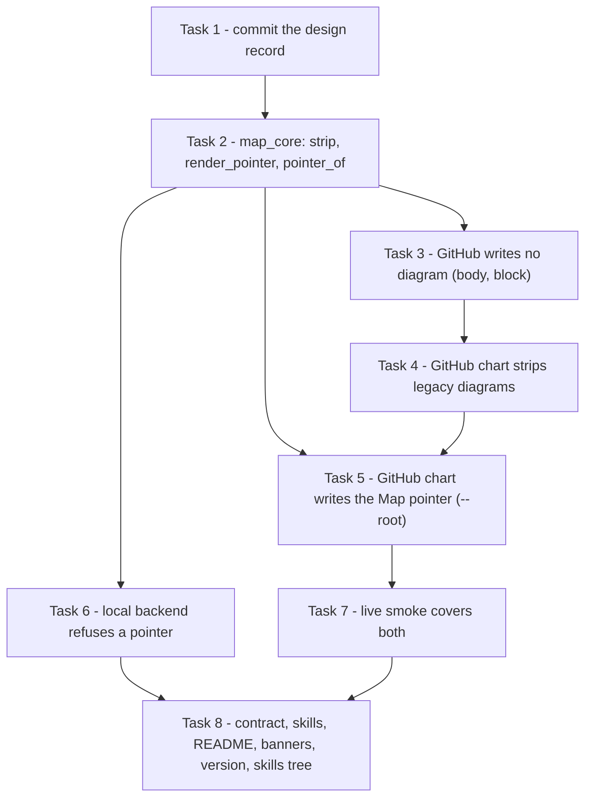

# decision-map on GitHub: no diagram, strip the old ones, Map pointer — Implementation Plan

> **For agentic workers:** REQUIRED SUB-SKILL: Use sp-subagent-driven-development (recommended) or sp-executing-plans to implement this plan task-by-task. Steps use checkbox (`- [ ]`) syntax for tracking.

**Goal:** The GitHub backend of `decision-map` stops writing the position diagram, strips the ones it already wrote on the next gated `chart`, and leaves a Map pointer at `docs/decision-map/<slug>/map.md` that `work-map` reads and the local backend refuses.

**Architecture:** Three shared helpers land in `map_core.py` (`strip_graph_region`, `render_pointer`, `pointer_of`) because one backend writes what the other must recognise (ADR 0062). `github_map_ops.py` loses its graph re-render pass and gains a strip pass, a `--root` flag and a pointer write at the end of `chart --real`; `local_map_ops.py` gains one refusal in `_map_dir`, the choke point every subcommand already passes through. The graph region stays declared in `TRACKER_TICKET_REGIONS` so old tickets remain writable. Docs, contract, skills, version and the generated `skills/` tree close the change.

**Tech Stack:** Python 3 stdlib only (`re`, `pathlib`, `argparse`, `json`, `unittest`). Tests run with `python -m unittest` from `plugins/decision-map/scripts/`. Markdown docs; JSON manifests.

**Spec:** [docs/superpowers/specs/2026-09-04-github-map-no-diagram-and-pointer-design.md](../specs/2026-09-04-github-map-no-diagram-and-pointer-design.md)



## Global Constraints

- **Branch:** `claude/grill-then-plan-qwo5mx`, already checked out. Commit per task. Push with `git push -u origin claude/grill-then-plan-qwo5mx` after each commit.
- **Version to mint: `decision-map` 0.12.0.** Global max across every ref (`main`, `origin/main`, this branch) is **0.11.0** today. `plugins/decision-map/.claude-plugin/plugin.json` and the `decision-map` entry in `.claude-plugin/marketplace.json` must both read `0.12.0` when Task 8 lands. Re-check the max before Task 8 (command in that task).
- **ADR numbers 0171–0173 are minted** from the global max (0170 on every ref, scanned 2026-09-04). Task 1 re-verifies before committing.
- **Tests:** run from `plugins/decision-map/scripts/` with `python -m unittest test_github_map_ops test_local_map_ops`. Baseline at plan time: **331 tests, OK**. `pytest` is not on PATH.
- **The GitHub tests must never write into the working tree.** Every `gh.chart(...)` in a test passes `root=<a TemporaryDirectory>` (Task 5 adds the parameter and updates `Base`). A test that leaves `docs/decision-map/billing/` behind is a failed test.
- **Every string the tool writes goes through `one_line`** (frontmatter values, the pointer's title, repo and url). No raw user text in a generated file.
- **The graph region stays in `TRACKER_TICKET_REGIONS`.** Removing it makes every old GitHub ticket unwritable (`assert_regions` rejects an undeclared marker). Task 3 rewrites the comment above it; it does not delete the pair.
- **Fixed decisions — do not re-open:** ADR 0171 (no diagram on GitHub), ADR 0172 (`chart` strips; nothing else touches the region; the region stays declared), ADR 0173 (pointer at `docs/decision-map/<slug>/map.md`, written by `chart --real`, read by `work-map`, refused by local). The local backend's diagram is untouched.
- **Harness-neutral skill prose:** say "load the skill", never "call the Skill tool"; reference plugin files as `${CLAUDE_PLUGIN_ROOT}/scripts/...` or `${CLAUDE_PLUGIN_ROOT}/references/...`.
- **The generated `skills/` tree is regenerated, never hand-edited:** `python3 scripts/generate_skills_tree.py --repo .` then `python3 scripts/check_skills_tree.py --repo .` from the repo root, after any edit under `plugins/decision-map/skills/` or `plugins/decision-map/references/`.
- **Every negative probe must actually fail.** Where a step says "run it and watch it fail", a passing run means the test is not testing the change — fix the test before implementing.

---

### Task 1: Commit the design record

**Files:**
- Modify: none (git only). The files already exist in the working tree: `docs/adr/workflow-daily-work-0171-*.md`, `-0172-*.md`, `-0173-*.md`, `docs/superpowers/specs/2026-09-04-github-map-no-diagram-and-pointer-design.md`, this plan, `CONTEXT.md`.

**Interfaces:**
- Consumes: nothing.
- Produces: a commit on `claude/grill-then-plan-qwo5mx` holding the design record, so no later task can orphan it.

- [ ] **Step 1: Confirm the ADR numbers are still free on every ref**

```bash
cd "$(git rev-parse --show-toplevel)"
git fetch origin
for r in $(git for-each-ref --format='%(refname:short)' refs/heads refs/remotes); do
  git ls-tree -r --name-only --full-tree "$r" -- docs/adr
done | sed 's|.*/||' | sed -E 's|^([A-Za-z][A-Za-z_-]*-)?([0-9]{3,})-.*|\2|;t;d' | sort -n | tail -1
```

Expected: `0170`. If it prints `0171` or higher, a sibling session minted into this range: renumber the three ADRs (file names, their cross-references in the spec, this plan and `CONTEXT.md`) to the next free numbers before continuing.

- [ ] **Step 2: Check the working tree holds exactly the design files**

```bash
git status --short
```

Expected: three new ADRs, the spec, this plan, and a modified `CONTEXT.md`. Nothing else.

- [ ] **Step 3: Commit and push**

```bash
git add docs/adr/workflow-daily-work-0171-*.md docs/adr/workflow-daily-work-0172-*.md docs/adr/workflow-daily-work-0173-*.md \
        docs/superpowers/specs/2026-09-04-github-map-no-diagram-and-pointer-design.md \
        docs/superpowers/plans/2026-09-04-github-map-no-diagram-and-pointer.md CONTEXT.md
git commit -m "docs(decision-map): design record for no diagram on GitHub and the Map pointer (ADRs 0171-0173)"
git push -u origin claude/grill-then-plan-qwo5mx
```

---

### Task 2: `map_core` — `strip_graph_region`, `render_pointer`, `pointer_of`, `MapElsewhereError`

**Files:**
- Modify: `plugins/decision-map/scripts/map_core.py` (after `set_graph_region`, around line 1043; the error classes near line 213; the constants block near line 105)
- Test: `plugins/decision-map/scripts/test_github_map_ops.py` (new class at the end of the file)

**Interfaces:**
- Consumes: `region_re`, `GRAPH_START`, `GRAPH_END`, `one_line`, `norm_eol`, `CliUsageError` — all already in `map_core`.
- Produces:
  - `POINTER_TYPE = "decision-map-pointer"`
  - `class MapElsewhereError(CliUsageError)`
  - `strip_graph_region(body: str) -> str` — body with the graph region removed and the blank line it leaves collapsed; identity on a body without one.
  - `render_pointer(title: str, repo: str, issue: int, url: str) -> str` — the whole Map pointer file, deterministic.
  - `pointer_of(text: str | None) -> dict | None` — `{"type","backend","repo","issue","url"}` (all strings) when `text` is a Map pointer, else `None`; raises `MapElsewhereError`'s parent `CliUsageError` when the type says pointer but `repo` or `issue` is missing.

- [ ] **Step 1: Write the failing tests**

Append to `plugins/decision-map/scripts/test_github_map_ops.py`:

```python
class MapCoreStripAndPointerTest(unittest.TestCase):
    """The three helpers both backends share (ADRs 0171-0173)."""

    def test_strip_removes_the_region_and_leaves_one_blank_line(self):
        region = map_core.position_diagram_region("k", ["a"], [])
        body = f"<!-- decision-map:key:k -->\n\n## Question\n\nwhy?\n\n{region}\n{map_core.GIST_START}\n{map_core.GIST_END}\n"
        out = map_core.strip_graph_region(body)
        self.assertNotIn(map_core.GRAPH_START, out)
        self.assertEqual(out, f"<!-- decision-map:key:k -->\n\n## Question\n\nwhy?\n\n{map_core.GIST_START}\n{map_core.GIST_END}\n")

    def test_strip_of_a_diagram_first_body_keeps_the_question(self):
        region = map_core.position_diagram_region("k", [], ["c"])
        body = f"<!-- decision-map:key:k -->\n\n{region}\n## Question\n\nwhy?\n"
        self.assertEqual(map_core.strip_graph_region(body),
                         "<!-- decision-map:key:k -->\n\n## Question\n\nwhy?\n")

    def test_strip_is_identity_without_a_region_and_idempotent(self):
        body = "<!-- decision-map:key:k -->\n\n## Question\n\nwhy?\n"
        self.assertEqual(map_core.strip_graph_region(body), body)
        once = map_core.strip_graph_region(
            body + "\n" + map_core.position_diagram_region("k", [], []))
        self.assertEqual(map_core.strip_graph_region(once), once)

    def test_render_pointer_is_deterministic_and_scrubbed(self):
        a = map_core.render_pointer("Decision map — billing", "acme/widgets", 42,
                                    "https://github.com/acme/widgets/issues/42")
        b = map_core.render_pointer("Decision map — billing", "acme/widgets", 42,
                                    "https://github.com/acme/widgets/issues/42")
        self.assertEqual(a, b)
        self.assertTrue(a.startswith("---\ntype: decision-map-pointer\nbackend: github\n"
                                     "repo: acme/widgets\nissue: 42\n"
                                     "url: https://github.com/acme/widgets/issues/42\n---\n"
                                     "# Decision map — billing\n"))
        evil = map_core.render_pointer("t <!-- decision-map:key:x -->", "acme/widgets", 1, "u")
        self.assertNotIn(map_core.MARKER_PREFIX, evil)

    def test_pointer_of_reads_a_pointer_and_rejects_everything_else(self):
        text = map_core.render_pointer("t", "acme/widgets", 42, "u")
        ptr = map_core.pointer_of(text)
        self.assertEqual((ptr["backend"], ptr["repo"], ptr["issue"]),
                         ("github", "acme/widgets", "42"))
        self.assertIsNone(map_core.pointer_of("# a local map\n\n## Destination\nd\n"))
        self.assertIsNone(map_core.pointer_of("---\ntitle: a ticket\n---\n"))
        self.assertIsNone(map_core.pointer_of(None))
        self.assertEqual(map_core.pointer_of(text.replace("\n", "\r\n"))["issue"], "42")

    def test_pointer_of_refuses_a_pointer_missing_its_target(self):
        with self.assertRaises(map_core.CliUsageError):
            map_core.pointer_of("---\ntype: decision-map-pointer\nbackend: github\n---\n")
```

- [ ] **Step 2: Run the tests to verify they fail**

Run (from `plugins/decision-map/scripts/`): `python -m unittest test_github_map_ops.MapCoreStripAndPointerTest -v`
Expected: 6 failures/errors, each `AttributeError: module 'map_core' has no attribute ...`.

- [ ] **Step 3: Add the constant and the error class**

In `map_core.py`, directly below `GRAPH_END = "<!-- decision-map:graph:end -->"` (line 106):

```python
# The Map pointer (ADR 0173): the one file a GitHub-backed map leaves in the
# repo, so `docs/decision-map/` lists every map whichever backend holds it. It
# is recognised by this frontmatter `type`, never by its path -- a pointer and
# a local map.md share a filename on purpose.
POINTER_TYPE = "decision-map-pointer"
```

Directly below `class CliUsageError(ValueError):` (line 213, keep its body), add:

```python
class MapElsewhereError(CliUsageError):
    """The slug names a Map pointer (ADR 0173): the map lives on another
    backend, and the local script must refuse rather than read the pointer as
    an empty map -- the absence-read-as-a-fact shape ADR 0061 forbids."""
```

- [ ] **Step 4: Add the three helpers**

In `map_core.py`, directly after `set_graph_region` (after line 1042):

```python
def strip_graph_region(body):
    """`body` with its position-diagram region removed (ADR 0172).

    The GitHub backend no longer writes the region (ADR 0171); this is how a
    `chart` re-run takes back the ones an earlier version wrote. The region
    sat on a line of its own, so the blank line it leaves is collapsed to at
    most one -- and a body that never had the region comes back byte-identical,
    which is what restores the no-op guarantee from the second run onward.
    Nothing outside the markers is touched.
    """
    m = region_re(GRAPH_START, GRAPH_END).search(body)
    if not m:
        return body
    head = body[:m.start()].rstrip("\n")
    tail = body[m.end():].lstrip("\n")
    if not head:
        return tail
    if not tail:
        return head + "\n"
    return head + "\n\n" + tail


def render_pointer(title, repo, issue, url):
    """The whole Map pointer file (ADR 0173). Deterministic: the same inputs
    give the same bytes, so `chart` can compare and report `skip (exists)`.

    Every value passes through `one_line` -- the title is user text, and a
    marker smuggled into it must not survive into a generated file."""
    repo, url, title = one_line(repo), one_line(url), one_line(title)
    n = int(issue)
    return (
        "---\n"
        f"type: {POINTER_TYPE}\n"
        "backend: github\n"
        f"repo: {repo}\n"
        f"issue: {n}\n"
        f"url: {url}\n"
        "---\n"
        f"# {title}\n\n"
        f"This decision map lives on GitHub Issues, not in this folder: the map is "
        f"{repo}#{n} and every ticket is one of its sub-issues. Nothing here is a "
        "copy of it. Work it with the decision-map plugin's GitHub backend "
        f"(`github_map_ops.py`) and `--repo {repo} --map {n}`; the local backend "
        "refuses this file on purpose.\n")


_POINTER_FM_RE = re.compile(r"^---\n(.*?)\n---\n", re.DOTALL)


def pointer_of(text):
    """-> the pointer's frontmatter as a dict of strings, or None.

    None for anything that is not a Map pointer: a local map.md (no
    frontmatter), a ticket (frontmatter without the pointer type), or no text.
    A file that CLAIMS the type but names no target is refused rather than
    treated as a local map -- half a pointer is still not a map."""
    m = _POINTER_FM_RE.match(norm_eol(text or ""))
    if not m:
        return None
    fm = {}
    for line in m.group(1).splitlines():
        if ":" in line:
            k, v = line.split(":", 1)
            fm[k.strip()] = v.strip()
    if fm.get("type") != POINTER_TYPE:
        return None
    for k in ("backend", "repo", "issue"):
        if not fm.get(k):
            raise CliUsageError(
                f"map.md says it is a {POINTER_TYPE} but carries no {k!r}; "
                "restore the pointer from git, or delete it and re-chart")
    return fm
```

Check `norm_eol` is defined above this point in `map_core.py` (it is imported by both backends, so it exists; `grep -n "^def norm_eol" map_core.py`).

- [ ] **Step 5: Run the tests to verify they pass**

Run: `python -m unittest test_github_map_ops.MapCoreStripAndPointerTest -v`
Expected: 6 tests, `OK`.

- [ ] **Step 6: Run both suites**

Run: `python -m unittest test_github_map_ops test_local_map_ops`
Expected: 337 tests, `OK`.

- [ ] **Step 7: Commit**

```bash
git add plugins/decision-map/scripts/map_core.py plugins/decision-map/scripts/test_github_map_ops.py
git commit -m "feat(decision-map): shared strip_graph_region, render_pointer and pointer_of (ADRs 0171-0173)"
git push -u origin claude/grill-then-plan-qwo5mx
```

---

### Task 3: The GitHub backend writes no position diagram

**Files:**
- Modify: `plugins/decision-map/scripts/github_map_ops.py` — `render_ticket_issue_body` (`:648-663`), `block` (`:1450-1453`), delete `_children_of` (`:1271-1281`) and `_patch_graph_region` (`:1284-1303`), the import list (`:93`)
- Modify: `plugins/decision-map/scripts/map_core.py` — the comment above `TRACKER_TICKET_REGIONS` (`:115-120`)
- Test: `plugins/decision-map/scripts/test_github_map_ops.py` — `TestPositionDiagram` (`:1194-1213`), `test_a_new_ticket_issue_leads_with_its_question` (`:1542`)

**Interfaces:**
- Consumes: nothing new.
- Produces: `render_ticket_issue_body(key, question)` returns `KEY_MARKER\n\n## Question\n\n<question>\n\n<GIST_START>\n<GIST_END>\n`. `block` patches no issue body. `_children_of` and `_patch_graph_region` no longer exist in `github_map_ops` (Task 4 needs neither).

Note: `chart`'s post-write pass at `:1215-1245` still calls `_patch_graph_region` after this task's deletions, so Task 3 **replaces that pass with a no-op placeholder** that Task 4 fills in. Do not leave a dangling reference.

- [ ] **Step 1: Rewrite the tests that pinned the old behaviour**

In `test_github_map_ops.py`, replace the first two tests of `TestPositionDiagram` (`test_a_created_ticket_issue_body_carries_a_graph_region` and `test_adding_a_dependency_patches_both_issue_bodies`) with:

```python
    def test_a_created_ticket_issue_body_carries_no_graph_region(self):
        body = gh.render_ticket_issue_body("auth-model", "why?")
        self.assertNotIn(map_core.GRAPH_START, body, "ADR 0171: no diagram on GitHub")
        self.assertEqual(body, "<!-- decision-map:key:auth-model -->\n\n## Question\n\nwhy?\n\n"
                               f"{map_core.GIST_START}\n{map_core.GIST_END}\n")

    def test_a_dependency_is_written_natively_and_patches_no_body(self):
        out = self.chart()
        by_key = {t["key"]: int(t["id"]) for t in out["tickets"]}
        blocked = self.fake.issue(by_key["rollout-order"])["body"]
        blocker = self.fake.issue(by_key["auth-model"])["body"]
        self.assertNotIn(map_core.GRAPH_START, blocked)
        self.assertNotIn(map_core.GRAPH_START, blocker)
        rollout = next(t for t in out["tickets"] if t["key"] == "rollout-order")
        self.assertEqual(rollout["blockedBy"], ["auth-model"],
                         "the edge lives in GitHub's own dependency, not in a picture")

    def test_block_writes_the_dependency_and_patches_no_body(self):
        inp = copy.deepcopy(INPUT)
        inp["tickets"][0]["blocks"] = []
        self.chart(inp)
        by_key = {t["key"]: int(t["id"]) for t in gh.read_map(self.ops, "billing")["tickets"]}
        before = {k: self.fake.issue(n)["body"] for k, n in by_key.items()}
        writes_before = len(self.fake.writes)
        out = gh.block(self.ops, "billing", "rollout-order", "auth-model")
        self.assertEqual(out["blockedBy"], ["auth-model"])
        after = {k: self.fake.issue(n)["body"] for k, n in by_key.items()}
        self.assertEqual(before, after, "block must not patch either ticket's body")
        patches = [w for w in self.fake.writes[writes_before:] if w[0] == "PATCH"]
        self.assertEqual(patches, [], patches)
```

Delete `test_an_existing_ticket_gaining_a_new_blocker_role_is_announced_in_the_plan` (`:1215` to the end of that method) — the blocker end is no longer written on GitHub, so there is nothing to announce (its local twin in `test_local_map_ops.py` stays).

In `test_a_new_ticket_issue_leads_with_its_question` (`:1542`) replace the `assertLess` line with:

```python
        self.assertNotIn(map_core.GRAPH_START, body)
        self.assertLess(body.index("## Question"), body.index(map_core.GIST_START))
```

- [ ] **Step 2: Run the rewritten tests to verify they fail**

Run: `python -m unittest test_github_map_ops.TestPositionDiagram test_github_map_ops.GitHubMilestoneProjectionTest.test_a_new_ticket_issue_leads_with_its_question -v`
Expected: the three `TestPositionDiagram` tests and the milestone test FAIL on `GRAPH_START` being present (the `block` test on `before != after`).

- [ ] **Step 3: Rewrite `render_ticket_issue_body`**

Replace the function at `github_map_ops.py:648-663` with:

```python
def render_ticket_issue_body(key, question):
    """The ticket issue body: key marker, the question, an empty gist region.

    No position diagram (ADR 0171): the GitHub backend writes real sub-issues
    and real blocked-by dependencies, so the issue's own sidebar already shows
    the parent, its blockers and what it blocks -- live, which the diagram by
    decision was not (ADR 0064). The gist region is still written at creation
    rather than inserted later, for the reason the local backend does the
    same: a writer that has to decide *where* a region goes is guessing at
    the boundary of content it did not write.
    """
    return (f"{KEY_MARKER % key}\n\n## Question\n\n{scrub(question)}\n\n"
            f"{GIST_START}\n{GIST_END}\n")
```

- [ ] **Step 4: Stop `block` patching bodies, delete the two helpers, neutralise the chart pass**

In `block` (`:1443-1454`), replace the lines from `new_held = held + [blocker_key]` to the `return` with:

```python
    new_held = held + [blocker_key]
    # No body is patched (ADR 0171): the edge is GitHub's own dependency and
    # the sidebar renders it. The graph region of a ticket charted by an older
    # version is left exactly as found -- only `chart` strips it (ADR 0172).
    return {"ticket": key, "blockedBy": new_held}
```

Delete `_children_of` (`:1271-1281`) and `_patch_graph_region` (`:1284-1303`) entirely.

In `chart`, replace the block from the comment `# The closing snapshot below is chart()'s own return value` (`:1215`) down to and including the `for key in sorted(touched): ... _patch_graph_region(...)` loop (`:1245`) with:

```python
    # The closing snapshot below is chart()'s own return value (see the cost
    # table's "1 closing GraphQL") -- fetched AFTER every create, link and edge
    # write above. Task 4 of the 2026-09-04 plan turns it into the strip pass
    # (ADR 0172); nothing re-renders a diagram here any more (ADR 0171).
    final_snap = ops.snapshot(str(map_number))
```

Remove `position_diagram_region, set_graph_region,` from the `from map_core import (...)` list (`:93`) and, if `force_orphaned_blockers, force_orphan_detail, rewired_edges` are now only used by `chart_plan`'s orphan pass, leave them for Task 4 to remove together with that pass.

- [ ] **Step 5: Update the comment above `TRACKER_TICKET_REGIONS`**

In `map_core.py`, replace the comment at `:115-120` with:

```python
# A tracker records the resolution as a native comment, so the resolution
# markers are local-only; the gist region is the tracker's machine-readable
# home for the same one-liner the local backend keeps in frontmatter. The
# graph region is DECLARED here but never written by a tracker backend
# (ADR 0171): assert_regions rejects any marker outside a declared region, so
# dropping the pair would make every ticket charted by an older version
# unwritable at its next resolve. Declared-not-written keeps them writable;
# `chart` is the one subcommand that strips the region (ADR 0172).
```

- [ ] **Step 6: Run both suites**

Run: `python -m unittest test_github_map_ops test_local_map_ops`
Expected: `OK`. If `test_every_merge_entry_names_what_it_adds` fails, a `merge` entry lost its detail — fix the plan pass, not the test. If a test still expects `renders as a child in the graph` in a GitHub plan, it belongs to Task 4's removal: mark it and continue only if it is that one.

- [ ] **Step 7: Commit**

```bash
git add plugins/decision-map/scripts/github_map_ops.py plugins/decision-map/scripts/map_core.py plugins/decision-map/scripts/test_github_map_ops.py
git commit -m "feat(decision-map): the GitHub backend writes no position diagram (ADR 0171)"
git push -u origin claude/grill-then-plan-qwo5mx
```

---

### Task 4: A GitHub `chart` re-run strips the diagrams it once wrote

**Files:**
- Modify: `plugins/decision-map/scripts/github_map_ops.py` — `chart_plan` (`:929-1084`), `chart`'s closing pass (the placeholder from Task 3), the import list
- Test: `plugins/decision-map/scripts/test_github_map_ops.py`

**Interfaces:**
- Consumes: `map_core.strip_graph_region` (Task 2); `Snapshot.keys`, `Snapshot.tickets[key]["body"]`, `Snapshot.number_of`, `Snapshot.repo_of`, `GitHubOps.patch_issue` (existing).
- Produces: `chart_plan` emits, for every existing ticket whose body holds `GRAPH_START` and that is not being created/overwritten, a `merge` entry with detail `removes the position diagram (ADR 0171)`; the `renders as a child in the graph` and `force_orphans` passes are gone from the GitHub plan. `chart_plan` keeps its return arity but `force_orphans` is always `{}`. `chart --real` strips and patches each such body once.

- [ ] **Step 1: Write the failing tests**

Append to `test_github_map_ops.py`:

```python
class LegacyDiagramStripTest(Base):
    """A map charted by an older version carries diagrams; the next chart
    takes them back, announced ticket by ticket (ADR 0172)."""

    def _seed_legacy_diagrams(self):
        out = self.chart()
        by_key = {t["key"]: int(t["id"]) for t in out["tickets"]}
        for key, n in by_key.items():
            issue = self.fake.issue(n)
            issue["body"] = map_core.set_graph_region(
                issue["body"], map_core.position_diagram_region(key, [], []))
            self.assertIn(map_core.GRAPH_START, issue["body"])
        return by_key

    def test_the_dry_run_announces_each_strip_and_writes_nothing(self):
        by_key = self._seed_legacy_diagrams()
        writes_before = len(self.fake.writes)
        out, err = self.dry()
        details = {e["path"]: e["detail"] for e in out["planned"]}
        for key in by_key:
            self.assertEqual(details[key], "removes the position diagram (ADR 0171)")
            self.assertEqual(next(e["action"] for e in out["planned"] if e["path"] == key), "merge")
        self.assertIn("removes the position diagram", err)
        self.assertEqual(len(self.fake.writes), writes_before)

    def test_the_real_run_strips_and_the_second_run_is_a_no_op(self):
        by_key = self._seed_legacy_diagrams()
        self.chart()
        for key, n in by_key.items():
            body = self.fake.issue(n)["body"]
            self.assertNotIn(map_core.GRAPH_START, body, key)
            self.assertEqual(body, gh.render_ticket_issue_body(
                key, next(t["question"] for t in INPUT["tickets"] if t["key"] == key)),
                "a stripped legacy body equals a freshly rendered one")
        before = {n: self.fake.issue(n)["body"] for n in by_key.values()}
        writes_before = len(self.fake.writes)
        out, _ = self.dry()
        self.assertTrue(all(e["action"] == "skip (exists)" for e in out["planned"]
                            if e["path"] in by_key), out["planned"])
        self.chart()
        self.assertEqual(before, {n: self.fake.issue(n)["body"] for n in by_key.values()})
        self.assertEqual([w for w in self.fake.writes[writes_before:] if w[0] == "PATCH"], [])

    def test_resolve_on_a_legacy_ticket_works_before_any_chart_strips_it(self):
        by_key = self._seed_legacy_diagrams()
        gh.resolve(self.ops, "billing", "auth-model", "shared keys", None, None)
        body = self.fake.issue(by_key["auth-model"])["body"]
        self.assertIn(map_core.GRAPH_START, body, "resolve leaves the region alone")
        self.assertIn("shared keys", map_core.region_body(
            map_core.norm_eol(body), map_core.GIST_START, map_core.GIST_END))

    def test_a_strip_and_an_edge_union_share_one_merge_line(self):
        inp = copy.deepcopy(INPUT)
        inp["tickets"][0]["blocks"] = []
        self.chart(inp)
        by_key = {t["key"]: int(t["id"]) for t in gh.read_map(self.ops, "billing")["tickets"]}
        issue = self.fake.issue(by_key["rollout-order"])
        issue["body"] = map_core.set_graph_region(
            issue["body"], map_core.position_diagram_region("rollout-order", [], []))
        out, _ = self.dry()          # INPUT wires auth-model -> rollout-order
        entry = next(e for e in out["planned"] if e["path"] == "rollout-order")
        self.assertEqual(entry["action"], "merge")
        self.assertIn("unions blockedBy: auth-model", entry["detail"])
        self.assertIn("removes the position diagram (ADR 0171)", entry["detail"])
```

- [ ] **Step 2: Run them to verify they fail**

Run: `python -m unittest test_github_map_ops.LegacyDiagramStripTest -v`
Expected: the dry-run test fails on the missing detail; the real-run test fails on `GRAPH_START` still present; the resolve test passes already (the region is tolerated since Task 3 — that is fine, it guards a regression); the shared-line test fails on the missing detail.

- [ ] **Step 3: Add the strip pass to `chart_plan` and remove the two diagram-only passes**

In `chart_plan`, delete the `blocker_gains` pass (from the comment `# The blocker end of every edge the run will write.` at `:1017` through the `for blocker_key, gained in blocker_gains.items(): ...` loop ending `:1051`) and the `force_orphans` pass (from `# The OTHER end of every edge --force DELETES.` at `:1053` through `:1072`). In their place insert:

```python
    # Diagrams an older version wrote (ADR 0172). Nothing re-renders them
    # (ADR 0171), so the only thing left to announce about a graph region is
    # its removal -- one merge line per ticket that still carries one, on
    # top of whatever that ticket's line already says. A ticket being created
    # or overwritten gets a fresh body from its own line and is not listed.
    if snap is not None:
        for key in snap.keys:
            if action_by_key.get(key) in ("create", "OVERWRITE"):
                continue
            if GRAPH_START not in norm_eol(snap.tickets[key].get("body")):
                continue
            entry = by_key.get(key)
            if entry is None:
                entry = {"path": key, "action": "skip (exists)", "detail": None}
                entries.append(entry)
                by_key[key] = entry
            entry["action"] = "merge"
            detail = "removes the position diagram (ADR 0171)"
            entry["detail"] = (entry["detail"] + "; " + detail) if entry["detail"] else detail
    force_orphans = {}
```

Keep the `return entries, map_body, div, {**fresh, **pending}, force_orphans` line unchanged so `chart`'s unpacking still works.

- [ ] **Step 4: Replace the closing pass in `chart` with the strip**

Replace Task 3's placeholder (the comment plus `final_snap = ops.snapshot(str(map_number))`) with:

```python
    # The closing snapshot below is chart()'s own return value (see the cost
    # table's "1 closing GraphQL") -- fetched AFTER every create, link and edge
    # write above. Reuse it to take back the position diagrams an older version
    # wrote (ADR 0172): one PATCH per ticket that still carries the region, and
    # none on a ticket that does not, so the second run is byte-identical. The
    # plan announced each of these as a merge line.
    final_snap = ops.snapshot(str(map_number))
    for key in final_snap.keys:
        body = norm_eol(final_snap.tickets[key].get("body"))
        new_body = strip_graph_region(body)
        if new_body == body:
            continue
        _assert_ticket_body(new_body, f"ticket {key!r} (#{final_snap.number_of(key)})")
        ops.patch_issue(final_snap.number_of(key), {"body": new_body},
                        repo=final_snap.repo_of(key))
```

Remove the now-unused `touched`, `force_orphans` handling in `chart` (the `touched |= ...` lines are already gone with the placeholder; make sure `force_orphans` from `chart_plan`'s return is not referenced elsewhere in `chart` — `grep -n force_orphans github_map_ops.py` should show only `chart_plan`'s own `force_orphans = {}` and the unpacking line).

Update the import list: add `strip_graph_region`; remove `force_orphaned_blockers, force_orphan_detail, rewired_edges` if nothing else in the file uses them (`grep -n "force_orphaned_blockers\|force_orphan_detail\|rewired_edges" github_map_ops.py`). Leave them in `map_core` — the local backend uses them.

- [ ] **Step 5: Run the tests**

Run: `python -m unittest test_github_map_ops.LegacyDiagramStripTest -v`
Expected: 4 tests, `OK`.

- [ ] **Step 6: Run both suites and fix the GitHub tests that asserted the removed announcements**

Run: `python -m unittest test_github_map_ops test_local_map_ops`
Expected: any failure is a GitHub test asserting `renders as a child in the graph` or `no longer renders as a child` in a **GitHub** plan. Delete each such assertion (or the test, if that was its whole point) and note the name in the commit body. A failure in `test_local_map_ops` is a regression — investigate before continuing.

- [ ] **Step 7: Commit**

```bash
git add plugins/decision-map/scripts/github_map_ops.py plugins/decision-map/scripts/test_github_map_ops.py
git commit -m "feat(decision-map): a GitHub chart re-run strips the position diagrams it wrote (ADR 0172)"
git push -u origin claude/grill-then-plan-qwo5mx
```

---

### Task 5: `chart --real` on GitHub writes the Map pointer

**Files:**
- Modify: `plugins/decision-map/scripts/github_map_ops.py` — `chart_plan` signature and map entry (`:929-958`), `chart` signature and tail (`:1087`, the closing pass), `_dispatch` (`:1618-1625`), `build_parser` (`:1666-1692`), the import list
- Test: `plugins/decision-map/scripts/test_github_map_ops.py` — `Base` (`:60-75`) and a new class

**Interfaces:**
- Consumes: `map_core.render_pointer`, `map_core.pointer_of`, `map_core.safe_segment`, `map_core.norm_eol`, `ChartValidationError` (all existing or from Task 2).
- Produces:
  - `chart(ops, inp, real, force=False, root="docs/decision-map")`
  - `chart_plan(ops, snap, inp, force, root)`; one extra plan entry with `path` = `<root>/<slug>/map.md` (posix string) directly after the `<map>` entry.
  - `_issue_url(repo, number) -> str` = `https://github.com/<repo>/issues/<number>`.
  - `--root` on the CLI, default `docs/decision-map`.
  - The pointer file written **last**, after the strip pass, on `--real` only, unless its action is `skip (exists)`.

- [ ] **Step 1: Give every test its own root**

In `test_github_map_ops.py`, replace `Base` (`:60-75`) with:

```python
class Base(unittest.TestCase):
    def setUp(self):
        self.fake = FakeGitHub(repo=REPO)
        self.ops = ops_for(self.fake)
        # The pointer (ADR 0173) is a real file: never let a test write it
        # into the working tree.
        self.tmp = tempfile.TemporaryDirectory()
        self.root = Path(self.tmp.name)

    def tearDown(self):
        self.tmp.cleanup()

    def chart(self, inp=None, **kw):
        with captured_stderr():
            return gh.chart(self.ops, copy.deepcopy(inp or INPUT), real=True,
                            root=self.root, **kw)

    def dry(self, inp=None, **kw):
        with captured_stderr() as err:
            out = gh.chart(self.ops, copy.deepcopy(inp or INPUT), real=False,
                           root=self.root, **kw)
        return out, err.getvalue()

    def map_number(self):
        return int(gh.read_map(self.ops, "billing")["map"]["id"])

    def pointer_path(self, slug="billing"):
        return self.root / slug / "map.md"
```

Any test in the file that calls `gh.chart(...)` directly (not through `self.chart`/`self.dry`) must pass `root=self.root` too — `grep -n "gh.chart(" test_github_map_ops.py` and add the argument to each. Tests driving `gh.main([...])` (`:148`, `:846`) must add `"--root", str(self.root)` to their argv — those classes need the same `setUp`/`tearDown` as `Base` if they do not inherit it.

- [ ] **Step 2: Write the failing tests**

Append:

```python
class MapPointerTest(Base):
    """chart --real leaves docs/decision-map/<slug>/map.md behind (ADR 0173)."""

    def test_the_dry_run_plans_the_pointer_and_writes_nothing(self):
        out, err = self.dry()
        paths = [e["path"] for e in out["planned"]]
        ptr = self.pointer_path().as_posix()
        self.assertIn(ptr, paths)
        self.assertEqual(paths.index(ptr), paths.index("<map>") + 1,
                         "the pointer is planned right after the map")
        self.assertEqual(next(e["action"] for e in out["planned"] if e["path"] == ptr), "create")
        self.assertFalse(self.pointer_path().exists())
        self.assertIn(ptr, err)

    def test_the_real_run_writes_a_pointer_naming_the_map_issue(self):
        out = self.chart()
        text = self.pointer_path().read_text(encoding="utf-8")
        ptr = map_core.pointer_of(text)
        self.assertEqual(ptr["repo"], REPO)
        self.assertEqual(ptr["issue"], out["map"]["id"])
        self.assertEqual(ptr["url"], f"https://github.com/{REPO}/issues/{out['map']['id']}")
        self.assertIn(f"# {INPUT['map']['title']}", text)

    def test_the_second_run_skips_an_identical_pointer(self):
        self.chart()
        before = self.pointer_path().read_bytes()
        out, _ = self.dry()
        entry = next(e for e in out["planned"] if e["path"] == self.pointer_path().as_posix())
        self.assertEqual(entry["action"], "skip (exists)")
        self.chart()
        self.assertEqual(self.pointer_path().read_bytes(), before)

    def test_a_stale_pointer_to_the_same_issue_is_refreshed_as_a_merge(self):
        out = self.chart()
        p = self.pointer_path()
        p.write_text(map_core.render_pointer("old title", REPO, int(out["map"]["id"]),
                                             f"https://github.com/{REPO}/issues/{out['map']['id']}"),
                     encoding="utf-8")
        plan, _ = self.dry()
        entry = next(e for e in plan["planned"] if e["path"] == p.as_posix())
        self.assertEqual((entry["action"], entry["detail"]), ("merge", "refreshes the Map pointer"))
        self.chart()
        self.assertIn(f"# {INPUT['map']['title']}", p.read_text(encoding="utf-8"))

    def test_a_pointer_to_another_issue_is_refused_unless_forced(self):
        self.chart()
        p = self.pointer_path()
        p.write_text(map_core.render_pointer("t", "other/repo", 7, "u"), encoding="utf-8")
        with self.assertRaises(gh.ChartValidationError) as cm:
            self.dry()
        self.assertIn("other/repo#7", str(cm.exception))
        plan, _ = self.dry(force=True)
        entry = next(e for e in plan["planned"] if e["path"] == p.as_posix())
        self.assertEqual(entry["action"], "OVERWRITE")
        self.chart(force=True)
        self.assertEqual(map_core.pointer_of(p.read_text(encoding="utf-8"))["repo"], REPO)

    def test_a_local_map_at_the_slug_is_refused_always(self):
        p = self.pointer_path()
        p.parent.mkdir(parents=True)
        p.write_text("# Decision map — billing\n\n## Destination\nd\n", encoding="utf-8")
        for force in (False, True):
            with self.assertRaises(gh.ChartValidationError) as cm:
                self.dry(force=force)
            self.assertIn("not a Map pointer", str(cm.exception))

    def test_the_pointer_is_written_after_the_tracker_writes(self):
        # A failure on the tracker must leave no pointer to a half-charted map.
        real_link = self.ops.link_child
        def boom(*a, **k):
            raise gh.GitHubError("simulated outage")
        self.ops.link_child = boom
        with self.assertRaises(gh.GitHubError):
            self.chart()
        self.assertFalse(self.pointer_path().exists())
        self.ops.link_child = real_link

    def test_main_accepts_root(self):
        with tempfile.TemporaryDirectory() as d:
            p = Path(d) / "in.json"
            p.write_text(json.dumps(INPUT), encoding="utf-8")
            buf, err = io.StringIO(), io.StringIO()
            with contextlib.redirect_stdout(buf), contextlib.redirect_stderr(err):
                rc = gh.main(["chart", "--repo", REPO, "--input", str(p), "--real",
                              "--root", str(self.root)], api=self.fake)
            self.assertEqual(rc, 0, err.getvalue())
            self.assertTrue(self.pointer_path().exists())
```

- [ ] **Step 3: Run them to verify they fail**

Run: `python -m unittest test_github_map_ops.MapPointerTest -v`
Expected: `TypeError: chart() got an unexpected keyword argument 'root'` on every test.

- [ ] **Step 4: Implement the pointer plan and write**

In `github_map_ops.py`, add after `_key_marker_in` (`:675-681`):

```python
def _issue_url(repo, number):
    return f"https://github.com/{repo}/issues/{int(number)}"


def _pointer_path(root, slug):
    return Path(root) / safe_segment(slug, "map slug") / "map.md"


def _plan_pointer(root, slug, repo, issue, title, force):
    """-> (action, detail) for the Map pointer file (ADR 0173).

    `issue` is None when the map does not exist on the tracker yet, so a
    pointer that is already there can only be pointing somewhere else.
    """
    p = _pointer_path(root, slug)
    if not p.exists():
        return "create", None
    text = p.read_text(encoding="utf-8")
    ptr = pointer_of(text)
    if ptr is None:
        raise ChartValidationError(
            f"{p.as_posix()} exists and is not a Map pointer: a local map already "
            f"uses slug {slug!r} in this repo; pick another slug for the GitHub map")
    if issue is None or (ptr["repo"], ptr["issue"]) != (repo, str(issue)):
        if force:
            return "OVERWRITE", None
        raise ChartValidationError(
            f"{p.as_posix()} points at {ptr['repo']}#{ptr['issue']}, but this chart "
            f"targets {repo}#{issue if issue is not None else '<new>'}; pass --force "
            "to overwrite the pointer, or move it aside")
    if norm_eol(text) == render_pointer(title, repo, issue, _issue_url(repo, issue)):
        return "skip (exists)", None
    return "merge", "refreshes the Map pointer"
```

Add `from pathlib import Path` to the imports if the file does not already have it (`grep -n "^from pathlib" github_map_ops.py`), and add `render_pointer, pointer_of` to the `from map_core import (...)` list.

Change `chart_plan`'s signature to `def chart_plan(ops, snap, inp, force, root):` and, directly after `entries.append({"path": "<map>", "action": map_action, "detail": map_detail})` (`:958`), insert:

```python
    ptr_action, ptr_detail = _plan_pointer(
        root, slug, ops.repo,
        snap.map["number"] if snap is not None else None,
        (snap.map.get("title") if snap is not None else None) or inp["map"]["title"],
        force)
    entries.append({"path": _pointer_path(root, slug).as_posix(),
                    "action": ptr_action, "detail": ptr_detail})
```

Change `chart`'s signature to `def chart(ops, inp, real, force=False, root="docs/decision-map"):` and its call to `chart_plan(ops, snap, inp, force, root)`. At the very end of `chart`, replace

```python
    out = final_snap.map_json()
    out["divergence"] = div
    return out
```

with

```python
    # Last, after every tracker write and the strip pass: a run that failed
    # above leaves no pointer to a half-charted map, and on a fresh map the
    # issue number only exists now (ADR 0173).
    ptr_path = _pointer_path(root, slug)
    if actions[ptr_path.as_posix()] != "skip (exists)":
        ptr_path.parent.mkdir(parents=True, exist_ok=True)
        ptr_path.write_text(
            render_pointer(final_snap.map.get("title") or inp["map"]["title"],
                           ops.repo, map_number, _issue_url(ops.repo, map_number)),
            encoding="utf-8")

    out = final_snap.map_json()
    out["divergence"] = div
    return out
```

In `_dispatch`, change the chart call to `return chart(ops, inp, real=a.real and not a.dry, force=a.force, root=a.root)`. In `build_parser`, add after the `--repo` argument:

```python
    ap.add_argument("--root", default="docs/decision-map",
                    help="chart only: where the Map pointer file is written "
                         "(<root>/<slug>/map.md, ADR 0173)")
```

- [ ] **Step 5: Run the tests**

Run: `python -m unittest test_github_map_ops.MapPointerTest -v`
Expected: 8 tests, `OK`.

- [ ] **Step 6: Run both suites, then prove no test wrote into the tree**

Run: `python -m unittest test_github_map_ops test_local_map_ops && git status --short`
Expected: `OK`, and `git status` shows only the four modified source/test files — no `docs/decision-map/` entry under `plugins/decision-map/scripts/` or the repo root.

- [ ] **Step 7: Commit**

```bash
git add plugins/decision-map/scripts/github_map_ops.py plugins/decision-map/scripts/test_github_map_ops.py
git commit -m "feat(decision-map): chart --real on GitHub writes the Map pointer, gated like every other write (ADR 0173)"
git push -u origin claude/grill-then-plan-qwo5mx
```

---

### Task 6: The local backend refuses a Map pointer

**Files:**
- Modify: `plugins/decision-map/scripts/local_map_ops.py` — `_map_dir` (`:205-206`), the import list (`:96-116`), `_REMEDY` (`:847-854`), `main`'s `except` tuple (`:928-930`)
- Test: `plugins/decision-map/scripts/test_local_map_ops.py`

**Interfaces:**
- Consumes: `map_core.pointer_of`, `map_core.MapElsewhereError` (Task 2).
- Produces: every local subcommand that names a map (`read`, `frontier`, `lint`, `claim`, `block`, `comment`, `resolve`, and `chart` for `target.slug`) exits `2` with one stderr line when `<root>/<slug>/map.md` is a pointer. Direct callers (`ops.read_map(root, slug)`) raise `MapElsewhereError`.

- [ ] **Step 1: Write the failing tests**

Append to `test_local_map_ops.py`:

```python
class MapPointerRefusalTest(unittest.TestCase):
    """A Map pointer (ADR 0173) is not a local map: every subcommand refuses
    it loudly, naming the GitHub command, instead of reading an empty map."""

    def setUp(self):
        self.tmp = tempfile.TemporaryDirectory()
        self.root = Path(self.tmp.name)
        d = self.root / "billing"
        d.mkdir()
        (d / "map.md").write_text(map_core.render_pointer(
            "Decision map — billing", "acme/widgets", 42,
            "https://github.com/acme/widgets/issues/42"), encoding="utf-8")
        self.input_path = self.root / "map_input.json"
        inp = copy.deepcopy(INPUT)
        inp["target"]["slug"] = "billing"
        self.input_path.write_text(json.dumps(inp), encoding="utf-8")

    def tearDown(self):
        self.tmp.cleanup()

    def _run(self, argv):
        old = sys.argv
        sys.argv = ["local_map_ops.py"] + argv
        out, err = io.StringIO(), io.StringIO()
        try:
            with contextlib.redirect_stdout(out), contextlib.redirect_stderr(err):
                rc = ops.main()
        finally:
            sys.argv = old
        return rc, out.getvalue(), err.getvalue()

    def test_read_does_not_return_an_empty_map(self):
        with self.assertRaises(map_core.MapElsewhereError) as cm:
            ops.read_map(self.root, "billing")
        self.assertIn("acme/widgets#42", str(cm.exception))

    def test_every_subcommand_exits_2_and_names_the_github_command(self):
        cases = {
            "read": ["read", "--map", "billing"],
            "frontier": ["frontier", "--map", "billing"],
            "lint": ["lint", "--map", "billing"],
            "claim": ["claim", "--map", "billing", "--ticket", "t"],
            "block": ["block", "--map", "billing", "--ticket", "t", "--blocked-by", "u"],
            "resolve": ["resolve", "--map", "billing", "--ticket", "t", "--gist", "g"],
            "chart": ["chart", "--input", str(self.input_path), "--real"],
        }
        body = self.root / "b.md"
        body.write_text("note", encoding="utf-8")
        cases["comment"] = ["comment", "--map", "billing", "--ticket", "t",
                            "--body-file", str(body)]
        for cmd, argv in cases.items():
            with self.subTest(cmd=cmd):
                rc, out, err = self._run(argv + ["--root", str(self.root)])
                self.assertEqual(rc, 2, err)
                self.assertEqual(out, "")
                self.assertIn("lives on GitHub (acme/widgets#42)", err)
                self.assertIn("github_map_ops.py", err)
                self.assertIn("--repo acme/widgets --map 42", err)
        self.assertFalse((self.root / "billing" / "tickets").exists(),
                         "chart must not scaffold a local map over a pointer")

    def test_a_local_map_is_still_read_normally(self):
        inp = copy.deepcopy(INPUT)
        ops.chart(self.root, inp, real=True)
        self.assertEqual(ops.read_map(self.root, "example-effort")["backend"], "local")
```

- [ ] **Step 2: Run them to verify they fail**

Run: `python -m unittest test_local_map_ops.MapPointerRefusalTest -v`
Expected: `test_read_does_not_return_an_empty_map` fails with `AttributeError` or "MapElsewhereError not raised" (today `read_map` returns a map with zero tickets — the exact misreading this task removes); the CLI test fails on `rc == 0`; the third passes.

- [ ] **Step 3: Refuse in `_map_dir`**

In `local_map_ops.py`, add `pointer_of as _pointer_of, MapElsewhereError as _MapElsewhereError,` to the `from map_core import (...)` list, then replace `_map_dir` (`:205-206`) with:

```python
def _map_dir(root, slug):
    """The map's folder -- and THE enforcing line for the Map pointer
    (ADR 0173). Every subcommand resolves its map through here, so a
    pointer is refused before anything reads it as an empty local map
    (the absence-read-as-a-fact shape ADR 0061 forbids).
    """
    d = Path(root) / _safe_segment(slug, "map slug")
    p = d / "map.md"
    if p.exists():
        ptr = _pointer_of(p.read_text(encoding="utf-8"))
        if ptr is not None:
            raise _MapElsewhereError(
                f"map {slug!r} lives on GitHub ({ptr['repo']}#{ptr['issue']}), not "
                f"in this folder; run github_map_ops.py <subcommand> --repo "
                f"{ptr['repo']} --map {ptr['issue']} instead")
    return d
```

Add to `_REMEDY` (`:847`) as its **first** entry, before `CliUsageError` (the lookup is `isinstance` in dict order and `MapElsewhereError` is a `CliUsageError`):

```python
    _MapElsewhereError: "the local backend never reads a GitHub map",
```

`main`'s `except (CliUsageError, ...)` already catches the subclass — confirm `CliUsageError` is in that tuple (`:928`).

`chart` reaches `_map_dir` through `_validate_chart_input(inp, root)` → `_ticket_path` only when a `blocks` target is checked, and through `base = _map_dir(root, slug)` at `:491` — both before any write, so no scaffolding happens. Confirm with the CLI test's final assertion.

- [ ] **Step 4: Run the tests**

Run: `python -m unittest test_local_map_ops.MapPointerRefusalTest -v`
Expected: 3 tests, `OK`.

- [ ] **Step 5: Run both suites**

Run: `python -m unittest test_github_map_ops test_local_map_ops`
Expected: `OK`. `_map_dir` now reads `map.md` on every call; `test_local_map_ops` runs in well under 5 seconds — if it does not, cache nothing, but confirm no test loops `_map_dir` thousands of times.

- [ ] **Step 6: Commit**

```bash
git add plugins/decision-map/scripts/local_map_ops.py plugins/decision-map/scripts/test_local_map_ops.py
git commit -m "feat(decision-map): the local backend refuses a Map pointer instead of reading an empty map (ADR 0173)"
git push -u origin claude/grill-then-plan-qwo5mx
```

---

### Task 7: The live smoke test covers the strip and the pointer

**Files:**
- Modify: `plugins/decision-map/scripts/smoke_github_live.py` (`:59-121`)

**Interfaces:**
- Consumes: `gh.chart(..., root=...)` (Task 5), `map_core.GRAPH_START`, `map_core.pointer_of`.
- Produces: the smoke run passes a temporary `--root`, asserts no ticket body carries `GRAPH_START`, and asserts the pointer round-trips through the byte-identical re-chart. Not run in this plan (it needs a throwaway repo and `gh` auth); the owner runs it as ADR 0062 records.

- [ ] **Step 1: Thread a temporary root through the smoke run**

In `main()`, after `ops = gh.GitHubOps(api, a.repo)` (`:72`) add:

```python
    import tempfile
    tmp = tempfile.TemporaryDirectory()
    root = Path(tmp.name)
```

and add `from pathlib import Path` to the imports. Change the three `gh.chart(...)` calls (`:77`, `:98`, `:114`) to pass `root=root`. In the `finally` block, add `tmp.cleanup()` as its last line.

- [ ] **Step 2: Add the two checks**

After the "both tickets exist, key-ascending" check in step 2 (`:104`) add:

```python
        for t in out["tickets"]:
            body = ops.api.rest(f"repos/{a.repo}/issues/{t['id']}")["body"]
            check(f"ticket {t['key']} carries no position diagram (ADR 0171)",
                  map_core.GRAPH_START not in (body or ""))
        ptr = map_core.pointer_of((root / SLUG / "map.md").read_text(encoding="utf-8"))
        check("the Map pointer names the map issue (ADR 0173)",
              ptr is not None and ptr["issue"] == str(map_number), ptr)
```

In step 3, extend the byte-identical check to the pointer: read `(root / SLUG / "map.md").read_bytes()` before and after the re-chart and `check("the pointer is byte-identical across a re-chart", ...)`.

- [ ] **Step 3: Compile-check the script (it cannot run here)**

Run: `python -m py_compile smoke_github_live.py && echo ok`
Expected: `ok`.

- [ ] **Step 4: Commit**

```bash
git add plugins/decision-map/scripts/smoke_github_live.py
git commit -m "test(decision-map): live smoke asserts no diagram and a byte-identical Map pointer"
git push -u origin claude/grill-then-plan-qwo5mx
```

---

### Task 8: Contract, skills, README, banners, version, generated tree

**Files:**
- Modify: `plugins/decision-map/references/data-contracts.md` (`:271-281`, `:379-411`, `:803`, `:1161`, a new subsection under "Backend mappings" after `:1168`, `:1377-1384`)
- Modify: `plugins/decision-map/skills/chart-map/SKILL.md` (`:72-75`, `:92`, `:296-302`, `:316-318`, `:430-436`)
- Modify: `plugins/decision-map/skills/work-map/SKILL.md` (`:31-34`, `:69-72`, `:83`, `:105-108`, `:433-435`)
- Modify: `plugins/decision-map/README.md` (`:114-121`)
- Modify: `docs/superpowers/specs/2026-08-03-decision-map-diagrams-design.md` (banner table `:5-8`)
- Modify: `docs/adr/0064-the-position-diagram-shows-structure-only-never-status.md`, `docs/adr/workflow-daily-work-0102-a-new-ticket-renders-its-question-above-the-position-diagram.md`, `docs/adr/0062-github-backend-ships-on-a-shared-core-not-a-second-copy.md` (one amendment paragraph each)
- Modify: `plugins/decision-map/.claude-plugin/plugin.json` (`"version"`), `.claude-plugin/marketplace.json` (the `decision-map` entry's `"version"`, line 154)
- Regenerate: `skills/` (root) via the generator

**Interfaces:**
- Consumes: everything Tasks 2–7 produced.
- Produces: docs that state what the code now does; version 0.12.0 in both manifests; a regenerated tree that the checker accepts.

- [ ] **Step 1: Contract — the per-field row and the `--force` rows**

In `data-contracts.md:1161` replace the GitHub cell of the *ticket position diagram* row with:

`**not written** (ADR 0171) — the issue sidebar's *Blocked by* / *Blocking* is the position. A region left by an older version is tolerated (the pair stays declared in `TRACKER_TICKET_REGIONS`) and stripped by the next `chart`, announced as `merge … removes the position diagram (ADR 0171)` (ADR 0172)`

At `:271` (the row "present on the map but in neither `tickets[]` nor any `blocks`, and blocking an `OVERWRITE`'d ticket") prefix the third cell with `**local backend only** — `; at `:274` prefix the paragraph "**Both ends, on removal as well as addition.**" with `*(local backend only — on GitHub nothing draws the edge, ADR 0171.)* `.

- [ ] **Step 2: Contract — the GitHub plan example and the pointer subsection**

Replace the GitHub `planned` example at `:383-389` with:

```json
  "planned": [
    { "path": "label:decision-map:map",            "action": "create", "detail": null },
    { "path": "label:decision-map:type:grilling",  "action": "create", "detail": null },
    { "path": "<map>",                             "action": "create", "detail": null },
    { "path": "docs/decision-map/billing/map.md",  "action": "create", "detail": null },
    { "path": "auth-model",                        "action": "create", "detail": null },
    { "path": "rollout-order",                     "action": "merge",  "detail": "unions blockedBy: auth-model; removes the position diagram (ADR 0171)" }
  ],
```

Extend the `path` bullet at `:401-404` with: `On GitHub one entry is a real file: the **Map pointer**, `<root>/<slug>/map.md`, planned right after the map (ADR 0173).`

After the "Where each field lives on a tracker" table (after `:1168`) add:

````markdown
### The Map pointer (GitHub backend, ADR 0173)

A GitHub `chart --real` writes one file into the repo, `<root>/<slug>/map.md`
(`--root` defaults to `docs/decision-map`, the same default as the local
backend), so `docs/decision-map/` lists every map whichever backend holds it:

```markdown
---
type: decision-map-pointer
backend: github
repo: acme/widgets
issue: 42
url: https://github.com/acme/widgets/issues/42
---
# Decision map — billing

This decision map lives on GitHub Issues, not in this folder: ...
```

It carries no state — no tickets, status or frontier — and only `chart`
writes it, **last**, after every tracker write. In the plan it is one entry
(`path` = the file's posix path): `create` when absent; `skip (exists)` when
byte-identical; `merge` with detail `refreshes the Map pointer` when it names
the same repo and issue with different bytes; a **validation error** when it
names another repo or issue (`--force` makes that `OVERWRITE`) or when the file
is not a pointer at all — one slug cannot name a local map and a GitHub map in
the same repo.

The local backend refuses a pointer in every subcommand, exit `2`, naming the
backend, the target and the command to run instead (`map 'billing' lives on
GitHub (acme/widgets#42) … run github_map_ops.py <subcommand> --repo
acme/widgets --map 42`). It must never read one as an empty local map.

The shared-region rule of ADR 0062 reads, from here on, *every region both
backends write*: `graph` is written by the local backend only.
````

In the CLI/flag description near `:803` (the GitHub row of the join table) or wherever `--repo <owner>/<repo>` is first documented for the GitHub script, add one sentence: `` `--root` (chart only) sets where the Map pointer is written. ``

- [ ] **Step 3: Skills — chart-map**

`chart-map/SKILL.md:75` (GitHub row, "where the map lives" cell): append ` — plus a **Map pointer** at `docs/decision-map/<slug>/map.md` so the repo lists the map (ADR 0173)`.

`:92` (extra flag cell for GitHub): append `; `--root` only if the pointer must land somewhere other than `docs/decision-map``.

`:296-302`: replace the paragraph starting "**Carry the end-of-session commit offer in this same ask, on local.**" with:

```markdown
**Carry the end-of-session commit offer in this same ask, on both backends.** In
the same message, ask whether to commit what `--real` will leave in the repo once
the session ends — on local the new `docs/decision-map/<slug>/` folder, on GitHub
the **Map pointer** `docs/decision-map/<slug>/map.md` (ADR 0173) — alongside any
repo docs it produced, so the session pauses once, here, instead of twice. This
does not weaken assisted git: a bundled offer is still an explicit offer the user
answers, and nothing is committed without that yes.
```

`:316-318`: replace "Each created ticket also carries a generated **position diagram** below `## Question`, written and maintained by the script rather than by you (ADR 0063/0064)." with:

```markdown
On **local**, each created ticket also carries a generated **position diagram**
below `## Question`, written and maintained by the script rather than by you (ADR
0063/0064). On **GitHub** there is none (ADR 0171): the issue's own sidebar shows
the parent and its *Blocked by* / *Blocking* relationships, and a `chart` re-run
on a map charted by an older version strips the diagrams it once wrote — the plan
lists each as `merge … removes the position diagram` (ADR 0172).
```

`:430-436`: replace the paragraph starting "On **local**, offer to commit" with:

```markdown
Offer to commit (assisted git — offer, never automatic): on **local** the new
`docs/decision-map/<slug>/` folder; on **GitHub** the Map pointer
`docs/decision-map/<slug>/map.md` that `--real` just wrote (ADR 0173) — the map
itself is already live in the tracker, so give the map issue's URL too and say
that anyone with repo access can see it now. If the Step 3 gate already carried
this offer and the user approved it there, commit now without asking a second
time -- the yes you are holding *is* that explicit offer, answered.
```

- [ ] **Step 4: Skills — work-map**

`work-map/SKILL.md:31-34` (the terminal diagram's preflight box) becomes:

```
  ① PREFLIGHT
  │   which backend holds THIS map?
  │   read docs/decision-map/<slug>/map.md:
  │   a Map pointer → GitHub (repo + issue
  │   are in it); a real map → local
  ▼
```

`:69-72` (the "how to tell" table) becomes:

```markdown
| backend | where the map lives | how to tell |
|---|---|---|
| **local markdown** (default) | `docs/decision-map/<slug>/` | the directory exists and its `map.md` is a real map (an H1, `## Destination` …) |
| **GitHub Issues** | an issue labelled `decision-map:map`, one **sub-issue** per ticket, plus a **Map pointer** in the repo | `docs/decision-map/<slug>/map.md` opens with `type: decision-map-pointer` frontmatter naming `repo:` and `issue:` — take `--repo` and `--map` from it, do not ask (ADR 0173). No directory at all means *either* no map here *or* a GitHub map charted before pointers existed: say both, and ask which |
```

`:83` (the `--repo` cell): append ` — read from the Map pointer when one exists; this is not inferring it from the git remote, the pointer was written by a chart the user approved`.

`:105-108` (list the maps): replace "on GitHub they are the issues labelled `decision-map:map`" with "on GitHub they are the Map pointers under `docs/decision-map/` (each names its issue), falling back to the issues labelled `decision-map:map` for a map charted before pointers existed".

`:433-435`: replace "This is separate from the **position diagram** the ops script generates below `## Question` — that one is the ticket's place in the map, and you never author or edit it." with:

```markdown
This is separate from the **position diagram** the local ops script generates
below `## Question` — that one is the ticket's place in the map, and you never
author or edit it. On GitHub there is no such diagram (ADR 0171): the issue
sidebar is the position. If you meet one on an old GitHub ticket, leave it; the
next `chart` strips it (ADR 0172).
```

- [ ] **Step 5: README, banners, version**

`plugins/decision-map/README.md:121` (GitHub row): change the ops-script cell to `` `scripts/github_map_ops.py` → issues + a Map pointer at `docs/decision-map/<slug>/map.md` (ADR 0173) ``, and after the table add one sentence: `On GitHub a ticket carries no position diagram — the issue sidebar shows its blockers live (ADR 0171).`

`docs/superpowers/specs/2026-08-03-decision-map-diagrams-design.md`: add a row to the banner table at `:5-8`:

```markdown
> | §1 "The position diagram" applies to both backends | **Local backend only** since 2026-09-04: the GitHub backend writes no position diagram (ADR 0171) and a `chart` re-run strips the ones it wrote (ADR 0172). §2 and §3 are unchanged. |
```

Append to ADR 0064 and ADR 0102 (each, as a final paragraph):

```markdown
**Amendment (2026-09-04).** Local backend only from here on. The GitHub backend
writes no position diagram at all (ADR 0171) and strips the ones an earlier
version wrote on its next `chart` (ADR 0172); this ADR's reasoning stands
unchanged for `tickets/<key>.md`.
```

Append to ADR 0062 (final bullet under Consequences):

```markdown
- **Amendment (2026-09-04).** "Byte-identical regions on both backends" now
  reads *every region both backends write*: the `graph` region is written by
  the local backend only (ADR 0171), and the Map pointer is a file only the
  GitHub backend writes (ADR 0173). `map_core` still holds both renderers.
```

Version — first re-check the global max, then bump:

```bash
cd "$(git rev-parse --show-toplevel)"
for r in $(git for-each-ref --format='%(refname:short)' refs/heads refs/remotes); do
  printf '%s ' "$r"; git show "$r:plugins/decision-map/.claude-plugin/plugin.json" | grep '"version"'
done
```

Expected: every ref prints `0.11.0`. If any prints higher, mint max+1 minor instead of `0.12.0` and use that value in both files. Then set `"version": "0.12.0"` in `plugins/decision-map/.claude-plugin/plugin.json` and in the `decision-map` entry of `.claude-plugin/marketplace.json` (line 154). Also update the `description` in both manifests: after "GitHub Issues using native sub-issues and blocked-by dependencies (ADR 0062)" add ", leaving a Map pointer in docs/decision-map/ so a cold session finds it (ADR 0173)".

- [ ] **Step 6: Regenerate the skills tree and run every gate**

```bash
cd "$(git rev-parse --show-toplevel)"
python3 scripts/generate_skills_tree.py --repo .
python3 scripts/check_skills_tree.py --repo .
python3 scripts/test_generate_skills_tree.py
python3 scripts/test_check_skills_tree.py
python plugins/dev-workflows/scripts/check_vendored_superpowers.py --strict
(cd plugins/decision-map/scripts && python -m unittest test_github_map_ops test_local_map_ops)
grep -n '"version"' plugins/decision-map/.claude-plugin/plugin.json .claude-plugin/marketplace.json | grep -A0 -B0 decision-map || grep -n '0.12.0' plugins/decision-map/.claude-plugin/plugin.json .claude-plugin/marketplace.json
```

Expected: the generator rewrites `skills/chart-map/`, `skills/work-map/` and every generated skill that bundles `references/data-contracts.md` of decision-map; the checker exits 0; both generator suites pass; the vendored check exits 0 (nothing under `sp-*` changed); the decision-map suites are `OK`; both manifests show `0.12.0`.

- [ ] **Step 7: Read the diff of every prose file once, adversarially**

```bash
git diff --stat
git diff plugins/decision-map/skills plugins/decision-map/README.md plugins/decision-map/references/data-contracts.md | grep -n "Skill tool\|call the Skill\|plugins/decision-map/skills/" || echo "harness-neutral: ok"
```

Expected: `harness-neutral: ok` (no harness-specific tool names, no hard-coded plugin paths). Any `${CLAUDE_PLUGIN_ROOT}` you added must be one of the three rewritable shapes (`/references/…`, `/scripts/…`, `/skills/…`).

- [ ] **Step 8: Commit and push**

```bash
git add -A
git status --short   # only the files this task names, plus skills/ regenerations
git commit -m "docs(decision-map): contract, skills, README and banners for no diagram on GitHub and the Map pointer; 0.11.0 -> 0.12.0"
git push -u origin claude/grill-then-plan-qwo5mx
```

---

## Self-review

**Spec coverage.** §1 (no diagram, region declared, local unchanged) → Task 3. §2 (strip pass, plan detail, the two removed announcements, second-run no-op, not stripped by other subcommands) → Task 4 (the "resolve leaves it" test covers the last point). §3 file format and `pointer_of` → Task 2; plan table, write-last, `--root` → Task 5; skills → Task 8 Steps 3–4; local refusal → Task 6. §5 contract, docs, banners, version, tree → Task 8; tests table → Tasks 3–6; smoke → Task 7. §4 out-of-scope items have no task, as intended.

**Placeholders.** None: every code step carries the code; the only "confirm by grep" steps are verifications of existing facts, not deferred work.

**Type consistency.** `strip_graph_region(body) -> str`, `render_pointer(title, repo, issue, url) -> str`, `pointer_of(text) -> dict|None` are used with those signatures in Tasks 4, 5, 6 and 7. `chart(ops, inp, real, force=False, root=...)` and `chart_plan(ops, snap, inp, force, root)` match between Task 5's implementation, `_dispatch`, `Base`, the smoke script and every test. `pointer_of` returns `issue` as a **string**; Task 5's `_plan_pointer` compares against `str(issue)` and Task 5's tests compare against `out["map"]["id"]`, which `map_json` reports as a string — consistent.
