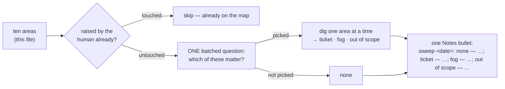

# Frontier Sweep Implementation Plan

> **For agentic workers:** REQUIRED SUB-SKILL: Use sp-subagent-driven-development (recommended) or sp-executing-plans to implement this plan task-by-task. Steps use checkbox (`- [ ]`) syntax for tracking.

**Goal:** chart-map sweeps ten fixed software-engineering areas after the human-led grill, records the result as one Notes bullet, and `lint` warns on any map that carries no such record — so old maps get swept by an additive re-chart.

**Architecture:** One new lint rule (`map-never-swept`) in the shared `map_core.lint_findings`, so both backends get it from one function; one new reference file under chart-map with the ten areas; chart-map's SKILL.md gains Step 2b and a re-chart entry; the contract, README, PLAYBOOK, eval, versions and the generated `skills/` tree follow. No new region, no new `map_input.json` field, no change to work-map.

**Tech Stack:** Python 3 (`python3` on this Mac — there is no bare `python`), `unittest`, Markdown skills, JSON manifests.

**Spec:** `docs/superpowers/specs/2026-09-14-frontier-sweep-design.md` (ADRs 0222–0226, already written; `CONTEXT.md` **Frontier sweep** term already written).

## Global Constraints

- Work on branch `decision-map-frontier-sweep` off `main` (Task 1 Step 1 creates it). Never commit on `main`.
- Run scripts with `python3`, never `python`. Run tests from `plugins/decision-map/scripts/` with `python3 -m unittest test_local_map_ops test_github_map_ops`. Baseline on `main` today: **365 tests, OK**.
- Every commit message ends with the trailer `Co-Authored-By: Claude Fable 5.1 <noreply@anthropic.com>` — verbatim; it is repo policy, not the committer's identity.
- Something in this environment auto-stages untracked files on `git` calls: always commit with explicit paths — `git add -- <paths> && git commit -m "…" -- <paths>` — and check `git status` first.
- `skills/` at the repo root is **generated**. Never hand-edit it. After any edit under `plugins/decision-map/scripts/`, `plugins/decision-map/references/` or `plugins/decision-map/skills/`, regenerate with `python3 scripts/generate_skills_tree.py --repo .` and verify with `python3 scripts/check_skills_tree.py --repo .` (Task 7 does this once, at the end; do not run it per task).
- `plugins/decision-map/.claude-plugin/plugin.json` and `.claude-plugin/marketplace.json` must report the same version: `0.14.0` (Task 6).
- Data-contract schemas are defined only in `plugins/decision-map/references/data-contracts.md`; skills cite it, never redefine it.
- Skills stay harness-neutral: no "call the Skill tool"; say "load … the way your harness loads skills".
- Skill-relative paths for a skill's own files (`references/frontier-sweep.md`), `${CLAUDE_PLUGIN_ROOT}/…` only for plugin-level files.
- Record grammar (spec §6), fixed: `sweep <YYYY-MM-DD>: none — <slug>, <slug>; ticket — <key>[, <key>]; fog — <slug>; out of scope — <slug>` — verdicts with no areas are omitted; the hand-written form `sweep <date>: reviewed, accepted as-is` is legal.
- Rule fire condition (spec §5), fixed: the Notes region (between `<!-- decision-map:notes:start -->` / `:end -->`) has no bullet whose text after `- ` starts, case-insensitively, with `sweep ` or `sweep:`. No notes region at all → fires. Severity `warning`, `ticket: None`, never in `notChecked`.

---

### Task 1: the `map-never-swept` lint rule, on both backends

**Files:**
- Modify: `plugins/decision-map/scripts/map_core.py` — add `SWEEP_PREFIX` + `has_sweep_record()` next to the fog constants (around L1510), and one block at the end of `lint_findings` just before `return errors + warnings` (around L1780).
- Test: `plugins/decision-map/scripts/test_local_map_ops.py` — `LINT_INPUT` (L2153), `LintTest` (L2170), `MilestoneLintTest._map_text` (L3066).
- Test: `plugins/decision-map/scripts/test_github_map_ops.py` — `INPUT` (L31), `TestLint` (L1401).

**Interfaces:**
- Consumes: `region_body(text, start, end)`, `norm_eol(s)`, `NOTES_START`, `NOTES_END`, `_finding(rule, severity, ticket, message)`, `LINT_WARNING` — all already in `map_core.py`.
- Produces: `map_core.SWEEP_PREFIX = "sweep"`, `map_core.has_sweep_record(map_text) -> bool`, and lint finding rule name `"map-never-swept"`. Task 2 cites the rule name and message; Task 4's SKILL.md quotes the rule name.

- [ ] **Step 1: Create the branch**

```bash
cd /Users/liusp/Documents/repo/workflow-daily-work
git status --short   # expect: clean apart from the spec/ADR/CONTEXT files already written
git checkout -b decision-map-frontier-sweep
```

- [ ] **Step 2: Update the fixtures so a freshly charted map carries the record**

A fresh chart writes the record before `--real` (spec §5), so the fixtures that stand in for "a freshly charted map" must carry it — otherwise the four existing clean-map tests fail for a reason unrelated to what they pin.

In `test_local_map_ops.py`, change `LINT_INPUT` (L2153–2165) `"notes": ""` to:

```python
            "notes": ["sweep 2026-09-14: none — security, deploy; ticket — alpha, beta; fog — data"],
```

In `test_local_map_ops.py`, change `MilestoneLintTest._map_text` (L3066–3070) to render a Notes region ahead of the milestones region:

```python
    def _map_text(self, *lines):
        return ("## Notes\n\n" + map_core.NOTES_START + "\n"
                + "- sweep 2026-09-14: none — security\n" + map_core.NOTES_END
                + "\n\n## Milestones\n\n" + map_core.MILESTONES_START + "\n"
                + "".join(ln + "\n" for ln in lines) + map_core.MILESTONES_END
                + "\n\n" + map_core.FOG_START + "\n" + map_core.EMPTY_LIST_LINE
                + "\n" + map_core.FOG_END + "\n")
```

In `test_github_map_ops.py`, change `INPUT["map"]["notes"]` (L36) from the string to a list:

```python
        "notes": ["consult the pricing skill",
                  "sweep 2026-09-14: none — security, deploy; ticket — auth-model"],
```

- [ ] **Step 3: Write the failing local tests**

Append to `LintTest` in `test_local_map_ops.py`, after `test_unrelated_fog_is_not_flagged` (L2404) and before the `# --- CLI contract` comment:

```python
    # --- the sweep record (ADRs 0223, 0224, 0225) ---------------------------

    def _set_notes(self, *bullets):
        """Rewrite the Notes region by hand -- the hand edit ADR 0225 names as
        a legitimate way to write (or lose) the record."""
        mp = self.root / "lint-effort" / "map.md"
        text = mp.read_text(encoding="utf-8")
        body = ("\n" + "".join(f"- {b}\n" for b in bullets)) if bullets \
            else "\n" + map_core.EMPTY_LIST_LINE + "\n"
        mp.write_text(map_core.replace_region(
            text, map_core.NOTES_START, map_core.NOTES_END, body), encoding="utf-8")

    def test_a_map_with_no_sweep_bullet_warns_once_at_map_level(self):
        """The gap the sweep exists to close: a map charted before it cannot
        show the difference between 'swept and empty' and 'never asked'."""
        self._set_notes("consult the pricing skill")
        out = self._lint()
        found = [f for f in out["findings"] if f["rule"] == "map-never-swept"]
        self.assertEqual(len(found), 1, out["findings"])
        self.assertEqual(found[0]["severity"], "warning")
        self.assertIsNone(found[0]["ticket"], "the map, not a ticket, is unswept")
        self.assertIn("/decision-map:chart", found[0]["message"])
        self.assertIn("reviewed, accepted as-is", found[0]["message"])
        self.assertNotIn("map-never-swept", out["notChecked"])
        self.assertFalse(out["clean"])

    def test_a_freshly_charted_map_carries_the_record_and_is_silent(self):
        self.assertNotIn("map-never-swept", self._rules())
        self.assertTrue(map_core.has_sweep_record(
            (self.root / "lint-effort" / "map.md").read_text(encoding="utf-8")))

    def test_the_hand_written_reviewed_form_counts_case_insensitively(self):
        self._set_notes("Sweep 2026-09-14: reviewed, accepted as-is")
        self.assertNotIn("map-never-swept", self._rules())

    def test_a_bullet_that_merely_contains_sweep_does_not_count(self):
        """Exact prefix, not a heuristic: a check that cries wolf is worse than
        no check, and so is one that is satisfied by the wrong sentence."""
        self._set_notes("the sweep is pending", "sweeping changes are out")
        self.assertIn("map-never-swept", self._rules())

    def test_a_legacy_paragraph_notes_map_fires(self):
        """A map from before ADR 0101 has no notes region and so nowhere to
        carry the record."""
        mp = self.root / "lint-effort" / "map.md"
        legacy = mp.read_text(encoding="utf-8")
        for marker in (map_core.NOTES_START, map_core.NOTES_END):
            legacy = legacy.replace(marker, "")
        mp.write_text(legacy, encoding="utf-8")
        self.assertFalse(map_core.has_sweep_record(legacy))
        self.assertIn("map-never-swept", self._rules())

    def test_an_additive_re_chart_that_adds_the_bullet_clears_the_finding(self):
        """ADR 0223's migration path for an old map, end to end: the dry run
        names the one notes line, --real writes it byte-for-byte, lint clears."""
        self._set_notes("consult the pricing skill")
        self.assertIn("map-never-swept", self._rules())
        bullet = "sweep 2026-09-14: none — performance, operations; ticket — alpha"
        inp = {
            "target": {"slug": "lint-effort"},
            "map": {"title": "Decision map - lint", "destination": "a written spec",
                    "notes": [bullet], "notYetSpecified": [], "outOfScope": []},
            "tickets": [],
        }
        dry = ops.chart(self.root, copy.deepcopy(inp), real=False)
        entry = {Path(p["path"]).name: p for p in dry["planned"]}["map.md"]
        self.assertEqual(entry["action"], "merge")
        self.assertEqual(entry["detail"], "adds 1 notes line")
        ops.chart(self.root, inp, real=True)
        text = (self.root / "lint-effort" / "map.md").read_text(encoding="utf-8")
        self.assertIn("- consult the pricing skill\n- " + bullet + "\n", text,
                      "union appends; the earlier bullet is kept")
        self.assertNotIn("map-never-swept", self._rules())
```

- [ ] **Step 4: Write the failing GitHub tests**

Append to `TestLint` in `test_github_map_ops.py`, after `test_lint_on_a_map_that_does_not_exist_raises` (L1475–1478):

```python
    def test_a_map_with_no_sweep_bullet_warns_at_map_level(self):
        """Same rule, same name, from the one snapshot -- the record lives in
        the issue body's notes region, which the snapshot already holds."""
        inp = copy.deepcopy(INPUT)
        inp["map"]["notes"] = ["consult the pricing skill"]
        self.chart(inp)
        out = gh.lint(self.ops, "billing")
        found = [f for f in out["findings"] if f["rule"] == "map-never-swept"]
        self.assertEqual(len(found), 1, out["findings"])
        self.assertEqual(found[0]["severity"], "warning")
        self.assertIsNone(found[0]["ticket"])
        self.assertNotIn("map-never-swept", out["notChecked"],
                         "the rule needs only the body, which every backend has")

    def test_a_sweep_bullet_in_the_issue_body_satisfies_the_rule(self):
        self.chart()
        rules = {f["rule"] for f in gh.lint(self.ops, "billing")["findings"]}
        self.assertNotIn("map-never-swept", rules)

    def test_an_additive_re_chart_writes_the_bullet_into_the_issue_body(self):
        inp = copy.deepcopy(INPUT)
        inp["map"]["notes"] = ["consult the pricing skill"]
        self.chart(inp)
        self.assertFalse(gh.lint(self.ops, "billing")["clean"])
        bullet = "sweep 2026-09-14: none — performance; ticket — auth-model"
        again = copy.deepcopy(INPUT)
        again["map"]["notes"] = [bullet]
        again["tickets"] = []
        self.chart(again)
        body = self.ops.snapshot("billing").map["body"]
        self.assertIn("- consult the pricing skill\n- " + bullet + "\n", body)
        rules = {f["rule"] for f in gh.lint(self.ops, "billing")["findings"]}
        self.assertNotIn("map-never-swept", rules)
```

- [ ] **Step 5: Run the tests to verify they fail**

Run, from `plugins/decision-map/scripts/`:

```bash
python3 -m unittest test_local_map_ops.LintTest test_github_map_ops.TestLint 2>&1 | tail -15
```

Expected: FAIL — `AttributeError: module 'map_core' has no attribute 'has_sweep_record'` on the tests that call it, and `AssertionError` (rule absent) on `test_a_map_with_no_sweep_bullet_warns_once_at_map_level`, `test_a_bullet_that_merely_contains_sweep_does_not_count`, `test_a_legacy_paragraph_notes_map_fires`, and the GitHub `test_a_map_with_no_sweep_bullet_warns_at_map_level`. The "silent" tests pass already (nothing fires yet) — that is expected.

- [ ] **Step 6: Implement the rule in `map_core.py`**

After the fog constants (`_FOG_MIN_SHARED`, `_FOG_MIN_RATIO`, ~L1510–1511) add:

```python
# The frontier-sweep record (ADR 0224): one Notes bullet per sweep run,
# opening with this word. An exact prefix, deliberately unlike the fog rule's
# word-overlap heuristic -- a rule that can be satisfied by the wrong sentence
# is as bad as one that cries wolf.
SWEEP_PREFIX = "sweep"


def has_sweep_record(map_text):
    """True when the Notes region carries a frontier-sweep bullet.

    A bullet counts when its text after the leading dash opens with `sweep`
    followed by a space or a colon, case-insensitively -- which admits the
    chart-written form (`sweep 2026-09-14: none — …`) and the hand-written
    form ADR 0225 names (`sweep <date>: reviewed, accepted as-is`), and
    rejects a bullet that merely mentions the word. A map with no notes
    region at all (a paragraph Notes from before ADR 0101) has nowhere to
    carry the record, so it has none.
    """
    body = region_body(norm_eol(map_text or ""), NOTES_START, NOTES_END)
    if body is None:
        return False
    for raw in body.splitlines():
        line = raw.strip()
        if not line.startswith("-"):
            continue
        text = line[1:].strip().lower()
        if text.startswith(SWEEP_PREFIX + " ") or text.startswith(SWEEP_PREFIX + ":"):
            return True
    return False
```

At the end of `lint_findings`, immediately before `return errors + warnings`, add:

```python
    # The whole map, not a ticket (ADRs 0223, 0225): a map charted before the
    # frontier sweep existed cannot show the difference between "swept and
    # empty" and "never asked", and one that finished that way is the map
    # most worth flagging, not least -- so no status clause. A fresh chart
    # writes the record before --real, so only pre-sweep maps (or a hand edit
    # that deleted the bullet) ever fire this.
    if not has_sweep_record(map_text):
        warnings.append(_finding(
            "map-never-swept", LINT_WARNING, None,
            "this map carries no frontier-sweep record (no Notes bullet opening "
            "with 'sweep'); it was charted before the sweep existed, or the "
            "record was deleted. Re-run /decision-map:chart <slug> to sweep it, "
            "or if you have reviewed it by hand add a Notes bullet "
            "'sweep <date>: reviewed, accepted as-is' (ADRs 0223, 0225)"))

    return errors + warnings
```

- [ ] **Step 7: Run the two lint classes, then the full suites**

```bash
python3 -m unittest test_local_map_ops.LintTest test_local_map_ops.MilestoneLintTest test_github_map_ops.TestLint 2>&1 | tail -4
python3 -m unittest test_local_map_ops test_github_map_ops 2>&1 | tail -4
```

Expected: both `OK`; the full run reports **374 tests** (365 + 6 local + 3 GitHub). If any pre-existing test now reports `map-never-swept` where it asserted `[]` or `clean`, it is a fixture that stands in for a fresh chart and needs the same sweep bullet Step 2 added — add it there rather than weakening the assertion.

- [ ] **Step 8: Commit**

```bash
cd /Users/liusp/Documents/repo/workflow-daily-work
git add -- plugins/decision-map/scripts/map_core.py plugins/decision-map/scripts/test_local_map_ops.py plugins/decision-map/scripts/test_github_map_ops.py
git commit -m "feat(decision-map): lint warns map-never-swept when the Notes region carries no sweep bullet (ADRs 0223-0225)

Co-Authored-By: Claude Fable 5.1 <noreply@anthropic.com>" -- plugins/decision-map/scripts/map_core.py plugins/decision-map/scripts/test_local_map_ops.py plugins/decision-map/scripts/test_github_map_ops.py
```

---

### Task 2: the contract — lint table row, `ticket: null` paragraph, notes sentence

**Files:**
- Modify: `plugins/decision-map/references/data-contracts.md` — lint table (row after `fog-line-graduated`, L174), the `ticket: null` paragraph (L180–189), the heuristic sentence (L191–194), and the `map.notes` note (L580).

**Interfaces:**
- Consumes: rule name `map-never-swept` and its message from Task 1.
- Produces: the contract wording Task 4's SKILL.md and Task 6's README cite.

- [ ] **Step 1: Add the lint table row**

Directly after the `fog-line-graduated` row (L174) insert:

```markdown
| `map-never-swept` | warning | the map's Notes region carries no bullet opening with `sweep` (followed by a space or a colon, case-insensitive) — the frontier-sweep record chart-map writes on every chart (ADRs 0222, 0224). Fires on a map charted before the sweep existed, on one whose record was deleted by hand, and on a legacy paragraph-Notes map that has no region to carry it; **finished or not** (ADR 0225). Cleared by an additive re-chart that runs the sweep, or by a hand-written `sweep <date>: reviewed, accepted as-is` bullet. `ticket: null` — the map, not a ticket, is unswept. An exact prefix match, not a heuristic. |
```

- [ ] **Step 2: Rewrite the `ticket: null` paragraph**

Replace the paragraph beginning `**Three findings carry \`ticket: null\`: \`gist-budget\`, \`milestone-line-unparsable\`` (L180) through its end (`That assumption was never part of this contract.`, L189) with:

```markdown
**Four findings carry `ticket: null`: `gist-budget`, `milestone-line-unparsable`,
`milestone-duplicate-slug` and `map-never-swept`.** Every other rule names the
ticket it fires on — `blocker-cycle` covers several and still names one of them,
and `milestone-duplicate-member` / `milestone-unknown-ticket` name the *ticket*
even though the milestone is the map-level structure at fault. The four `null`
findings name the map instead because the broken thing is not any one ticket:
`gist-budget` is a property of the whole corpus of gists (ADR 0068);
`milestone-line-unparsable` and `milestone-duplicate-slug` are properties of
the milestones region itself — an unreadable line or a repeated slug belongs
to no single ticket; `map-never-swept` is a property of the map's Notes region
(ADR 0224). A consumer that assumes `finding.ticket` is always a key on the
map breaks on any of the four. That assumption was never part of this contract.
```

- [ ] **Step 3: Amend the heuristic sentence**

In the paragraph beginning `` `fog-line-graduated` is the only **heuristic** rule `` (L191), append one sentence at its end:

```markdown
`map-never-swept` is the opposite kind of rule — an exact prefix match on the
Notes bullets — precisely so it cannot cry wolf either way.
```

- [ ] **Step 4: Note the sweep bullet under `map.notes`**

In the paragraph beginning `` `map.notes` is `str | list[str]` (ADR 0101) `` (L580), append after its first sentence (`…and a list is one bullet per entry, unioned like \`notYetSpecified\` on every later \`chart\`.`):

```markdown
chart-map's frontier-sweep record is one such entry — `sweep <YYYY-MM-DD>: none —
<area>, <area>; ticket — <key>; fog — <area>; out of scope — <area>` — written
on every chart and read back by `lint`'s `map-never-swept` (ADRs 0222, 0224);
it is an ordinary notes line, not a field.
```

- [ ] **Step 5: Verify the edits landed and nothing else moved**

```bash
cd /Users/liusp/Documents/repo/workflow-daily-work
grep -c "map-never-swept" plugins/decision-map/references/data-contracts.md   # expect 4
grep -n "Three findings carry" plugins/decision-map/references/data-contracts.md   # expect no output
git diff --stat -- plugins/decision-map/references/data-contracts.md   # expect one file
```

- [ ] **Step 6: Commit**

```bash
git add -- plugins/decision-map/references/data-contracts.md
git commit -m "docs(decision-map): contract gains the map-never-swept rule and the sweep notes bullet (ADRs 0223-0225)

Co-Authored-By: Claude Fable 5.1 <noreply@anthropic.com>" -- plugins/decision-map/references/data-contracts.md
```

---

### Task 3: `references/frontier-sweep.md` — the ten areas

**Files:**
- Create: `plugins/decision-map/skills/chart-map/references/frontier-sweep.md`

**Interfaces:**
- Produces: the ten area **slugs** (`scope`, `functional`, `performance`, `reliability`, `security`, `identity`, `data`, `deploy`, `operations`, `dependencies`) that the record grammar uses and Task 4's SKILL.md quotes; the file path Task 4 references skill-relatively.

- [ ] **Step 1: Write the file**

```bash
mkdir -p /Users/liusp/Documents/repo/workflow-daily-work/plugins/decision-map/skills/chart-map/references
```

Write `plugins/decision-map/skills/chart-map/references/frontier-sweep.md` with exactly this content:

````markdown
# Frontier sweep — the ten areas chart-map covers after the human-led grill



This list is what "fan out across the whole space" means (ADR 0222). It is drawn
from the frameworks people actually review software against — ISO/IEC 25010:2023,
Google's SRE launch checklist and design-doc cross-cutting concerns, the AWS and
Azure Well-Architected pillars, OWASP's four threat-modelling questions — and it
is one fixed list for every destination (ADR 0226). It is a **coverage check, not
a questionnaire**: the human-led grill runs first, this pass asks once which of the
untouched areas matter, and digs only where the user points.

How to use each area: the **slug** is the word that goes in the record; the
**gloss** is what the batched question quotes; the **probes** are what you ask,
one at a time, only if the user picks the area. Ask them in the user's terms —
what they would see or do — and lead with your own recommendation, which the
human accepts, rejects or reshapes (the HITL guard in SKILL.md).

## 1. `scope` — what it does, what it will not do, who uses it and who owns it after

- Which flows are explicitly *not* part of this effort?
- Who uses it on day one, and who owns it once it has shipped?

Source: Google design doc — goals and non-goals.

## 2. `functional` — flows we cannot yet say how they work

- Which user flow can you not describe end to end today?
- Which edge case do you already know exists and have not placed anywhere?

Source: ISO 25010 — functional suitability.

## 3. `performance` — load, spikes, growth, acceptable latency

- How much load on day one, and in six months? Is there a spike (a launch, a
  month-end, a campaign)?
- What latency would users call broken?
- Does the design have to survive ten times today's load without a redesign?

Source: SRE launch checklist (volume, capacity, growth); ISO 25010 — performance
efficiency; Well-Architected — performance.

## 4. `reliability` — what happens when it breaks, and how it comes back

- What breaks first, and what do users see when it does?
- Is there a backup, and has anyone actually restored from it?
- How long can it be down, and how much data can be lost, before it is a crisis?

Source: SRE launch checklist (failover, backup and restore); ISO 25010 —
reliability, recoverability.

## 5. `security` — what we are protecting, from whom, and where the trust boundary is

- What are we working on, and what can go wrong with it?
- Where do the secrets live, and who can read them?
- What crosses a trust boundary — user input, a partner API, a file upload?

Source: OWASP threat modelling — the four questions; ISO 25010 — security.

## 6. `identity` — who can do what, and how we prove it afterwards

- Which roles exist, and what can each one *not* do?
- Is it multi-tenant — can one customer's user ever see another's data?
- Does anyone need to know afterwards who did what (an audit trail)?

Source: ISO 25010 — accountability, authenticity; architecture review checklists —
authorization.

## 7. `data` — personal data, migration, retention, who owns the data

- Is there personal data, and what must happen to it (consent, deletion, export)?
- Does existing data have to move, and can the old shape and the new one coexist
  during the move?
- How long is data kept, and who decides?

Source: Google design doc — privacy as a cross-cutting concern; architecture
review checklists — data ownership.

## 8. `deploy` — environments, rollback, deploy windows, platform limits

- Which environments exist, and does this pass through all of them?
- Can this be rolled back, and has that been tried on something like it?
- Is there a deploy window, a freeze, or a platform limit (quota, region,
  runtime version) that constrains the design?
- What has to deploy before what?

Source: deployment checklists (Octopus Deploy, Cortex); SRE launch checklist —
rollout planning.

## 9. `operations` — what we watch, who is paged, what the runbook says

- What signal tells us it is unhealthy before a user tells us?
- Who is on call for it, and do they know?
- Is there a runbook — what does the person paged at 3 a.m. read?

Source: SRE launch checklist — monitoring; Azure Well-Architected — operational
excellence.

## 10. `dependencies` — third parties, cost, and rules we must obey

- Which external service can take this down, and what degrades when it does?
- What does it cost to run, and who pays for it?
- Which law, policy or contract binds the design (data residency, licensing,
  a customer's security questionnaire)?

Source: SRE launch checklist — external dependencies; AWS Well-Architected — cost;
compliance reviews.

## Deliberately not on the list (ADR 0226)

- **Usability / accessibility** — on a decision map this arrives as a user-led
  `prototype` ticket already; the sweep would only repeat it.
- **Maintainability** — a property of the code once written, not a decision to
  take before starting.

If a real map shows the sweep missed something, these two are the first places to
reopen — record the change as a new ADR, and add the area here with its slug.
````

- [ ] **Step 2: Verify the file parses as expected**

```bash
cd /Users/liusp/Documents/repo/workflow-daily-work
grep -c '^## [0-9]*\. `' plugins/decision-map/skills/chart-map/references/frontier-sweep.md   # expect 10
grep -o '^## [0-9]*\. `[a-z]*`' plugins/decision-map/skills/chart-map/references/frontier-sweep.md | sed 's/.*`\(.*\)`/\1/' | tr '\n' ' '
# expect: scope functional performance reliability security identity data deploy operations dependencies
```

- [ ] **Step 3: Commit**

```bash
git add -- plugins/decision-map/skills/chart-map/references/frontier-sweep.md
git commit -m "feat(decision-map): chart-map gains references/frontier-sweep.md — the ten areas (ADR 0226)

Co-Authored-By: Claude Fable 5.1 <noreply@anthropic.com>" -- plugins/decision-map/skills/chart-map/references/frontier-sweep.md
```

---

### Task 4: chart-map SKILL.md — description, diagram, re-chart entry, Step 2b, moved stop, report line

**Files:**
- Modify: `plugins/decision-map/skills/chart-map/SKILL.md` — frontmatter (L1–16), the run diagram (L28–62), the end of Step 0 (after L112, before `## Step 1`), the end of Step 2 (L210–212), Step 5's report list (L442–449).

**Interfaces:**
- Consumes: `references/frontier-sweep.md` (Task 3) and the ten slugs; rule name `map-never-swept` (Task 1); record grammar (Global Constraints).
- Produces: the Step 2b wording Task 5's eval asserts against.

- [ ] **Step 1: Change the description**

Replace the frontmatter `description` (L3–15) with:

```yaml
description: >-
  Chart a Decision map for an effort too big for one agent session — name the
  destination, grill breadth-first to separate real decision tickets from fog,
  then SWEEP the ten software-engineering areas the human did not raise
  (security, identity, data, deploy, operations, …), create the map and its
  tickets behind a dry-run gate, fire the research subagents, then STOP. Use
  when the user has a loose, foggy, multi-session idea — "this is huge, where
  do we even start", "plan this migration", "chart this", "make a decision
  map", "map out this initiative", "too big for one session" — and the route
  to the goal is not visible yet. Also use it on a map that ALREADY exists when
  the user says "sweep the map", "did we cover security / rollback / deploy",
  or lint reports `map-never-swept`: on an existing map it runs only the
  frontier sweep and adds additively. Do NOT use for a well-scoped
  single-session design (that is grill-then-plan / sp-grill-with-doc), and do
  NOT use to continue a map's decisions (that is work-map). If the grill AND
  the sweep surface no fog, this skill stops and says a map is not needed.
```

- [ ] **Step 2: Change the run diagram**

Replace the diagram block's stations ① through ④ (L32–52) so the whole block reads:

```
CHART A DECISION MAP — one session, then stop
─────────────────────────────────────────────

  ① PREFLIGHT — ask which backend
  │   local docs/decision-map/<slug>/
  │   or GitHub issues + sub-issues
  │   name it BEFORE any charting
  │   `read` the slug: exists? → skip to ③b
  ▼
  ② DESTINATION  (HITL — the human answers)
  │   what does arriving look like?
  │   one or two sentences, one line, first
  ▼
  ③ FRONTIER — breadth-first, never deep
  │   HITL too: you ask, the human answers
  │   can you STATE the question now?
  │     yes → ticket · no → fog
  │     past the destination → out of scope
  ▼
  ③b SWEEP — the ten areas the human
  │   did not raise (references/frontier-sweep.md)
  │   ONE batched question → dig only where
  │   the user points · the rest = none
  │   record: one `sweep <date>:` notes line
  │
  │   no fog anywhere, even now? ■ STOP —
  │      no map needed; hand to grill-then-plan
  ▼
  ④ GATE — dry run first, always
  │   create · skip (exists) · merge
  │   show every label → get a yes → --real
  ▼
  ⑤ RESEARCH subagents, in parallel
  │   findings posted back with `resolve`
  ▼
  ⑥ LINT — run the check, report it
  │   exit 0 clean · exit 3 findings
  ▼
  ■ STOP — report the `frontier`, hand off
     charting hand-resolves nothing
```

- [ ] **Step 3: Add the re-chart entry at the end of Step 0**

After the paragraph `The map is repo docs, so it is committed through **assisted git** — offer the commit, never make it automatically.` (L111–112) and before `## Step 1 — Name the destination`, insert:

```markdown
### Does the map already exist? — the re-chart entry (ADR 0223)

Before any grilling, probe the slug:

```
python "<ops>" read --map <slug>
```

Exit `2` (one line on stderr, empty stdout) — no map: continue to Step 1. Exit
`0` — the map exists: say so in one line and quote its destination back, then
**skip Step 1 and Step 2 entirely** and go to Step 2b. The destination and the
frontier the human already grilled are not re-asked; a re-chart's only job is the
frontier sweep, which the map may have been charted without (that is what a
`map-never-swept` lint finding means). Everything the sweep adds goes through
the Step 3 gate additively (ADR 0057): expect `skip (exists)` on every existing
ticket, `create` on any new one, and one `merge` line for the map body.
```

- [ ] **Step 4: Insert Step 2b and move the no-fog stop**

Replace the paragraph at L210–212:

```markdown
**If this step surfaces no fog at all, stop.** The way is already clear and the
whole journey fits one session, so a map would be overhead. Say that plainly and
point the user at `grill-then-plan` instead.
```

with:

```markdown
## Step 2b — Sweep the areas the human did not raise (ADR 0222)

The frontier is only as wide as what the human happened to mention. Before the
gate, run one coverage pass over the ten areas in `references/frontier-sweep.md`
(scope, functional, performance, reliability, security, identity, data, deploy,
operations, dependencies). It is a check, not a questionnaire — the human's own
concerns were heard first, in Step 2.

1. **Classify each area as touched or untouched.** Touched means at least one
   ticket, fog line or out-of-scope line named this session clearly belongs to
   it. On a re-chart (Step 0), classify from the map as `read` returned it —
   its tickets, fog and scope regions — instead. This is your judgement, like
   the ticket / fog / scope verdict itself; it is not asked.
2. **Ask ONE batched HITL question** naming only the untouched areas, each with
   its one-line gloss from the reference file, in the user's terms, and lead
   with your recommendation: *"These N areas have not come up — which of them
   matter for this map? My guess: security and deploy, because …"*. The user
   may pick some, none, or say they are all fine.
3. **Dig one area at a time, only into the picked ones**, with that area's probe
   questions. Each picked area ends as a ticket, a fog line or an out-of-scope
   line by Step 2's own test — can you *state* the question now? A picked area
   may yield more than one ticket.
4. **Every unpicked area is `none`.** Do not ask about it further.
5. **Write the record** as one entry in `map.notes` for Step 3's input:

   ```
   sweep <YYYY-MM-DD>: none — <slug>, <slug>; ticket — <key>, <key>; fog — <slug>; out of scope — <slug>
   ```

   Every one of the ten slugs appears exactly once under the verdict it got;
   omit a verdict that has no areas; under `ticket` write the ticket **keys**,
   not the slug, so a reader can jump to them. One line, no line break — the
   tool flattens one anyway (ADR 0101). It renders as an ordinary Notes bullet
   and is what `lint`'s `map-never-swept` looks for (ADRs 0224, 0225).

**Only now: if the grill and the sweep together surfaced no fog at all, stop.**
The way is already clear and the whole journey fits one session, so a map would
be overhead. Say that plainly and point the user at `grill-then-plan` instead.
On a re-chart this stop does not apply — the map exists; go to Step 3 even if the
sweep added nothing but the record.
```

- [ ] **Step 5: Add the sweep line to Step 5's report**

In the report list (L442–449), after the bullet `- what the research subagents resolved, one gist each;` insert:

```markdown
- the sweep in one line — how many areas ended `none`, and which became tickets,
  fog or out of scope (this is the `sweep <date>:` notes bullet, read back);
```

- [ ] **Step 6: Verify every anchor changed and the file still reads as one skill**

```bash
cd /Users/liusp/Documents/repo/workflow-daily-work
f=plugins/decision-map/skills/chart-map/SKILL.md
grep -c "Step 2b" $f                     # expect >= 3 (heading, diagram ref, re-chart entry)
grep -n "do NOT use to continue a map that already exists" $f   # expect no output
grep -n "references/frontier-sweep.md" $f   # expect >= 2
grep -n "map-never-swept" $f             # expect >= 2
grep -n "^## Step" $f                    # expect Step 0, 1, 2, 2b, 3, 4, 5 in order
grep -n '\${CLAUDE_PLUGIN_ROOT}/skills' $f   # expect no output (skill-relative only)
```

- [ ] **Step 7: Commit**

```bash
git add -- plugins/decision-map/skills/chart-map/SKILL.md
git commit -m "feat(decision-map): chart-map sweeps the ten areas after the grill and re-charts an existing map sweep-only (ADRs 0222-0223)

Co-Authored-By: Claude Fable 5.1 <noreply@anthropic.com>" -- plugins/decision-map/skills/chart-map/SKILL.md
```

---

### Task 5: the eval case

**Files:**
- Create: `plugins/decision-map/skills/chart-map/evals/evals.json`

**Interfaces:**
- Consumes: the Step 2b wording (Task 4) and the record grammar.
- Produces: nothing downstream; the file shape mirrors `plugins/dev-workflows/skills/guide-and-verify/evals/evals.json` (`skill_name`, `evals[]` with `id`, `name`, `prompt`, `expected_output`, `files`, `assertions`).

- [ ] **Step 1: Write the file**

```bash
mkdir -p /Users/liusp/Documents/repo/workflow-daily-work/plugins/decision-map/skills/chart-map/evals
```

Write `plugins/decision-map/skills/chart-map/evals/evals.json`:

```json
{
  "skill_name": "chart-map",
  "evals": [
    {
      "id": 0,
      "name": "sweep-asks-about-security-and-deploy-the-user-never-raised",
      "prompt": "we want to build an internal tool for the ops team to approve vendor invoices — a list page with filters, an approve/reject button with a comment box, and an export to Excel at month end. it's bigger than one session so chart it. local markdown is fine. the destination: a written spec the two devs can build from. the things i keep going back and forth on are: whether filters are server-side or client-side, whether the approve button needs a confirm dialog, and what the export columns are.",
      "expected_output": "A charting run that grills the user's own three concerns first, then — before the gate — asks ONE batched question naming the areas the user never raised (security, identity/RBAC, data, deploy/rollback, operations, reliability, performance, dependencies, scope) with a recommendation, digs only into the ones the user picks, records every unpicked area as none in a single 'sweep <date>:' notes bullet in the dry run, and does not declare 'no map needed' before the sweep has run.",
      "files": [],
      "assertions": [
        "Asks about the user's own three concerns (filters, confirm dialog, export columns) before asking about any area the user did not raise",
        "Asks, in ONE batched question, which of the untouched areas matter, and that question names at least security and deploy (rollback) among them",
        "The batched question leads with the agent's own recommendation of which areas matter and waits for the user to answer rather than answering for them",
        "Does not ask ten separate area questions in a row before the user's own concerns have been grilled",
        "Every area the user did not pick appears under 'none' in a single notes line of the form 'sweep <YYYY-MM-DD>: none — …' shown in the dry run",
        "Does not declare that no map is needed before the sweep has been run",
        "Runs the dry run and asks for a yes before writing anything with --real"
      ]
    }
  ]
}
```

- [ ] **Step 2: Validate the JSON**

```bash
cd /Users/liusp/Documents/repo/workflow-daily-work
python3 -c "import json;d=json.load(open('plugins/decision-map/skills/chart-map/evals/evals.json'));print(d['skill_name'], len(d['evals']), len(d['evals'][0]['assertions']))"
# expect: chart-map 1 7
```

- [ ] **Step 3: Commit**

```bash
git add -- plugins/decision-map/skills/chart-map/evals/evals.json
git commit -m "test(chart-map): eval case — the sweep asks about security and deploy the user never raised (ADR 0222)

Co-Authored-By: Claude Fable 5.1 <noreply@anthropic.com>" -- plugins/decision-map/skills/chart-map/evals/evals.json
```

---

### Task 6: README row, PLAYBOOK row, version 0.14.0 in both manifests

**Files:**
- Modify: `plugins/decision-map/README.md:115`
- Modify: `PLAYBOOK.md:86`
- Modify: `plugins/decision-map/.claude-plugin/plugin.json` (`version`, `description`)
- Modify: `.claude-plugin/marketplace.json` (the `decision-map` entry: `description` L153, `version` L154)

**Interfaces:**
- Consumes: nothing new; wording from the spec.
- Produces: version `0.14.0` in both files — Task 7's check reads plugin.json.

- [ ] **Step 1: README row**

Replace L115 of `plugins/decision-map/README.md`:

```markdown
| chart-map | `/decision-map:chart` | Name the destination, grill breadth-first, sweep the ten areas the human did not raise (security, identity, data, deploy, operations, …), create map + tickets (dry-run gated), fire research subagents, stop. Re-run it on an existing map to sweep it — `lint` says `map-never-swept` until you do. |
```

- [ ] **Step 2: PLAYBOOK row**

Replace L86 of `PLAYBOOK.md`:

```markdown
| an effort too big for one session (foggy, multi-session) | `chart-map` (`/decision-map:chart`) — chart the destination, the decision tickets and the fog, then sweep the ten areas you did not raise (security, identity, data, deploy, operations, …); the map lands in `docs/decision-map/`, or on GitHub Issues as an issue + sub-issues. Re-run it on an existing map to sweep it |
```

- [ ] **Step 3: plugin.json**

In `plugins/decision-map/.claude-plugin/plugin.json` set `"version": "0.14.0"` and, in `description`, replace the sentence `` `lint` is the runnable check on a map's own health. `` with:

```
`lint` is the runnable check on a map's own health, including `map-never-swept` for a map charted before the frontier sweep — chart-map's coverage pass over ten software-engineering areas (ADRs 0222-0226).
```

- [ ] **Step 4: marketplace.json**

In `.claude-plugin/marketplace.json`, in the `decision-map` entry, set `"version": "0.14.0"` and, in `description`, replace `/decision-map:chart names the destination and creates the map + tickets behind a dry-run gate;` with:

```
/decision-map:chart names the destination, sweeps ten software-engineering areas the human did not raise (ADR 0222), and creates the map + tickets behind a dry-run gate — re-run it on an existing map to sweep it;
```

- [ ] **Step 5: Verify the two versions agree and the JSON is valid**

```bash
cd /Users/liusp/Documents/repo/workflow-daily-work
python3 - <<'EOF'
import json
p = json.load(open("plugins/decision-map/.claude-plugin/plugin.json"))["version"]
m = next(e for e in json.load(open(".claude-plugin/marketplace.json"))["plugins"] if e["name"] == "decision-map")["version"]
assert p == m == "0.14.0", (p, m)
print("versions agree:", p)
EOF
grep -c "map-never-swept" plugins/decision-map/README.md PLAYBOOK.md   # expect 1 and 0 (PLAYBOOK names the sweep, not the rule)
```

- [ ] **Step 6: Commit**

```bash
git add -- plugins/decision-map/README.md PLAYBOOK.md plugins/decision-map/.claude-plugin/plugin.json .claude-plugin/marketplace.json
git commit -m "docs(decision-map): README, PLAYBOOK and manifests name the frontier sweep; 0.13.0 -> 0.14.0

Co-Authored-By: Claude Fable 5.1 <noreply@anthropic.com>" -- plugins/decision-map/README.md PLAYBOOK.md plugins/decision-map/.claude-plugin/plugin.json .claude-plugin/marketplace.json
```

---

### Task 7: regenerate the `skills/` tree, run every check, final verification

**Files:**
- Modify (generated): `skills/chart-map/**`, `skills/work-map/**` — never by hand.

**Interfaces:**
- Consumes: every earlier task's edits under `plugins/decision-map/`.
- Produces: a tree `check_skills_tree.py` accepts, and a branch ready for the whole-branch review.

- [ ] **Step 1: Regenerate**

```bash
cd /Users/liusp/Documents/repo/workflow-daily-work
python3 scripts/generate_skills_tree.py --repo .
git status --short skills/ | head -20
```

Expected: modified `skills/chart-map/SKILL.md`, `skills/chart-map/scripts/map_core.py`, `skills/work-map/scripts/map_core.py`, both `references/data-contracts.md` copies, and new `skills/chart-map/references/frontier-sweep.md` and `skills/chart-map/evals/evals.json` (if the generator copies evals; if it does not, their absence is not an error).

- [ ] **Step 2: Check the tree**

```bash
python3 scripts/check_skills_tree.py --repo .
echo "exit=$?"
```

Expected: `exit=0`. If it reports a stale file, re-run Step 1 — do not edit `skills/` by hand.

- [ ] **Step 3: Run the full decision-map suites once more**

```bash
cd plugins/decision-map/scripts && python3 -m unittest test_local_map_ops test_github_map_ops 2>&1 | tail -3; cd -
```

Expected: `Ran 374 tests … OK`.

- [ ] **Step 4: Lint the two live maps in this repo, as a user would see it**

```bash
cd /Users/liusp/Documents/repo/workflow-daily-work
python3 plugins/decision-map/scripts/local_map_ops.py lint --map superpowers-review-to-scrutinize | python3 -c "import json,sys;d=json.load(sys.stdin);print([f['rule'] for f in d['findings']])"
```

Expected: the list contains `map-never-swept` (this map predates the sweep — that is the finding working, not a regression). Do **not** sweep it in this plan; that is a charting session of its own.

- [ ] **Step 5: Commit the tree**

```bash
git add -- skills/
git commit -m "chore(skills): regenerate skills/ after the frontier sweep (ADRs 0222-0226)

Co-Authored-By: Claude Fable 5.1 <noreply@anthropic.com>" -- skills/
```

- [ ] **Step 6: Commit the spec, ADRs and glossary that seeded this plan (they are still uncommitted on the branch)**

```bash
git status --short docs/ CONTEXT.md
git add -- CONTEXT.md docs/adr/workflow-daily-work-0222-*.md docs/adr/workflow-daily-work-0223-*.md docs/adr/workflow-daily-work-0224-*.md docs/adr/workflow-daily-work-0225-*.md docs/adr/workflow-daily-work-0226-*.md docs/superpowers/specs/2026-09-14-frontier-sweep-design.md docs/superpowers/plans/2026-09-14-frontier-sweep.md
git commit -m "docs: frontier sweep — ADRs 0222-0226, the Frontier sweep glossary term, spec and plan

Co-Authored-By: Claude Fable 5.1 <noreply@anthropic.com>" -- CONTEXT.md docs/adr/workflow-daily-work-0222-*.md docs/adr/workflow-daily-work-0223-*.md docs/adr/workflow-daily-work-0224-*.md docs/adr/workflow-daily-work-0225-*.md docs/adr/workflow-daily-work-0226-*.md docs/superpowers/specs/2026-09-14-frontier-sweep-design.md docs/superpowers/plans/2026-09-14-frontier-sweep.md
```

- [ ] **Step 7: Re-verify the ADR numbers before merge (CLAUDE.md: global max, not your checkout)**

```bash
cd /Users/liusp/Documents/repo/workflow-daily-work
git fetch --all --quiet
{ git for-each-ref --format='%(refname)' refs/heads refs/remotes | while read r; do git ls-tree -r --name-only "$r" -- docs/adr 2>/dev/null; done; git worktree list --porcelain | grep '^worktree ' | cut -d' ' -f2- | while read w; do ls "$w"/docs/adr 2>/dev/null; done; } | grep -oE '(^|/)([a-z-]+-)?0*([0-9]{3,4})-' | grep -oE '[0-9]{3,4}' | sort -n | uniq -c | awk '$1>1 && $2>=222'
```

Expected: no output. Any line means another branch minted the same number — renumber ours (files, `Status` references, spec header, plan header) before merging.
