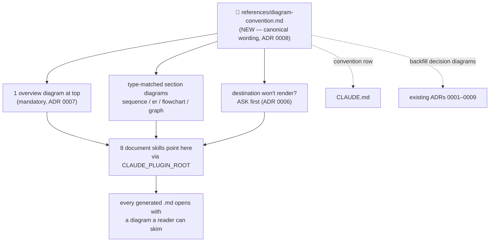
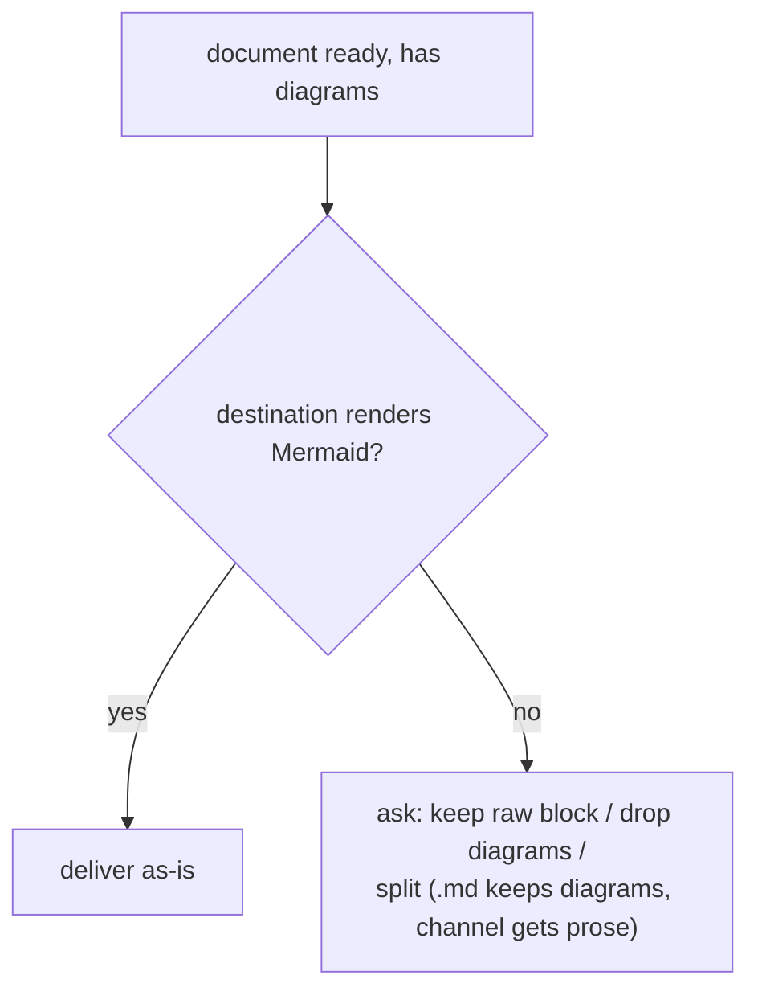
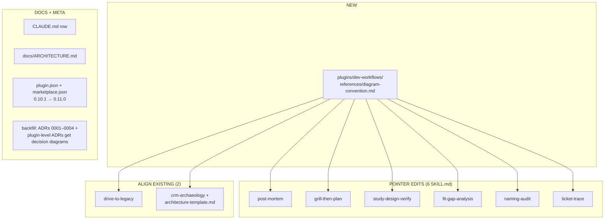

# Design Spec — Mermaid diagram convention for skill-generated documents

**Date:** 2026-06-12
**Status:** Approved — implemented (dev-workflows 0.11.0)
**Topic:** Every document a skill generates carries Mermaid diagrams that make it easy to understand
**ADRs:** [0005](../../adr/0005-mermaid-diagrams-in-generated-documents.md), [0006](../../adr/0006-diagrams-always-ask-gate-for-non-rendering-destinations.md), [0007](../../adr/0007-overview-diagram-plus-type-matched-sections.md), [0008](../../adr/0008-diagram-convention-single-reference-file.md), [0009](../../adr/0009-adrs-carry-decision-diagrams-glossary-exempt.md)



---

## Goal

Generated documents (ARCHITECTURE.md, post-mortems, design specs, advisory
docs, fit-gaps, ADRs) are walls of prose unless the individual skill happens to
mandate diagrams — only `drive-to-legacy` and `crm-archaeology` do today. Make
"Mermaid diagrams that explain the shape of the thing" a **marketplace
convention** with one canonical reference file, so every document skill —
current and future — produces documents a reader can skim visually.

## Non-goals

- **Channel outputs** (`management-talk`, `invoice-generator` — Slack, JIRA,
  email, standup, Tribletext): exempt, Mermaid doesn't render there (ADR 0005).
- **`problem-description`**: produces interactive HTML with its own
  visualization paradigm; not a Markdown document skill.
- **`ado-backlog` / `github-backlog` plugins**: their outputs are JSON data
  contracts, chat tables, and spreadsheet write-backs — no Markdown documents,
  so naturally out of scope. No changes there.
- **CONTEXT.md (glossary)**: the single exemption inside grill-then-plan's
  outputs (ADR 0009).
- **No new skill, no new plugin, no PLAYBOOK row** — this is a convention plus
  pointer edits, not a new capability.
- **No rendering/CI validation tooling** — verification stays structural
  (grep), like the rest of the repo.

---

## The convention (canonical wording → the reference file)

This section becomes the body of
`plugins/dev-workflows/references/diagram-convention.md` (NEW). The shapes are
defined **only** there; SKILL.md files point, never restate (same rule as data
contracts).

### Rule 1 — One overview diagram at the top (mandatory)

Every generated Markdown document opens with **one Mermaid diagram showing the
shape of the whole thing** — before any prose, right after the title/header
block. The same pattern PLAYBOOK.md itself uses.

### Rule 2 — Type-matched section diagrams

Any section whose content describes a flow, data model, decision, or hierarchy
gets a diagram of the matching type:

| Content shape | Mermaid type |
|---|---|
| flow / lifecycle / interaction between actors | `sequenceDiagram` |
| data model / entity relationships | `erDiagram` |
| decision logic / branching | `flowchart TD` |
| hierarchy / pipeline / dependency / org structure | `graph TD` |

No forced diagrams: a pure table/list section stays prose. (ADR 0007)

### Rule 3 — ADRs carry a small decision diagram

Every ADR opens with one small diagram of the decision — typically a
`flowchart TD` of the chosen path vs the rejected alternatives. The glossary
(CONTEXT.md) is the only exempt document type. (ADR 0009)

### Rule 4 — The ask-gate for non-rendering destinations

Diagrams are **always** authored. If the chosen destination doesn't render
Mermaid (JIRA comment, Slack, email), the skill must **ask the user first** —
never silently strip, never silently post raw fences:



(ADR 0006 — consistent with the marketplace's safety-gate culture.)

### Rule 5 — The artifact decides, not the skill

Skills whose default output is chat cards or spreadsheet write-backs
(`naming-audit`, `ticket-trace`) owe the convention **only when** the user asks
for the result as a Markdown file. The trigger is "the output is a .md
document", wherever it comes from.

### Authoring guidance (also in the reference file)

- Quote node labels containing spaces/punctuation: `A["label with spaces"]`.
- Keep the overview diagram to roughly ≤ 15 nodes — it's a thumbnail, not the
  full model; deep detail goes in section diagrams.
- Use `<br/>` for line breaks inside labels (HTML entities render unreliably).
- Diagrams supplement prose, never replace it — every diagram is introduced or
  followed by at least one sentence saying what to see in it.

---

## File-change inventory



| Change | File(s) | What |
|---|---|---|
| **Create** | `plugins/dev-workflows/references/diagram-convention.md` | the canonical convention (rules 1–5 + authoring guidance above) |
| **Edit (pointer)** | `skills/{post-mortem,grill-then-plan,study-design-verify,fit-gap-analysis,naming-audit,ticket-trace}/SKILL.md` | short "Diagrams" note: when this skill's output is a Markdown document, follow `${CLAUDE_PLUGIN_ROOT}/references/diagram-convention.md`; naming-audit/ticket-trace wording is conditional (rule 5); post-mortem also gets the ask-gate wording in its JIRA posting flow (rule 4) |
| **Edit (align)** | `skills/drive-to-legacy/SKILL.md`, `skills/crm-archaeology/SKILL.md` + `references/architecture-template.md` | keep their richer per-section diagram instructions, add the pointer so the shared file is the canonical base |
| **Edit** | `CLAUDE.md` | one row in **Conventions (do not violate)**: document skills follow the diagram convention; canonical wording only in the reference file |
| **Edit** | `docs/ARCHITECTURE.md` | mention the new plugin-level `references/` dir in dev-workflows + the convention in the add-a-skill recipe |
| **Edit (backfill)** | `docs/adr/0001–0004`, `plugins/ado-backlog/docs/adr/*` | add a small decision diagram to each pre-existing ADR (ADR 0009; 0005–0009 already comply) |
| **Version** | `plugins/dev-workflows/.claude-plugin/plugin.json` + `.claude-plugin/marketplace.json` | bump dev-workflows 0.10.1 → 0.11.0, both files in sync |

**Sequencing note:** the working tree already holds uncommitted v0.10.1 changes
(FILE-station routing). Land those first (or together); this change then bumps
to 0.11.0 — versions must never diverge between plugin.json and
marketplace.json.

---

## Edge cases resolved during grilling

| Edge | Resolution |
|---|---|
| post-mortem's default destination is a JIRA comment | author diagrams always; ask-gate before posting to a non-renderer (ADR 0006) |
| naming-audit / ticket-trace mostly emit chat cards / xlsx write-backs | convention applies only when output lands as a .md file (rule 5) |
| ADRs are deliberately terse | included anyway — owner chose uniformity over terseness (ADR 0009, overriding the recommendation) |
| CONTEXT.md glossary | the single exemption (ADR 0009) |
| "UML" in the original request | canonical term is **Mermaid diagram** (type-matched family), not strict UML class diagrams — captured in CONTEXT.md |
| pre-existing ADRs without diagrams | backfilled during implementation so the corpus is uniform |

---

## Verification (structural, no test framework)

1. `Test-Path plugins/dev-workflows/references/diagram-convention.md` → true.
2. Grep each of the 8 document-skill SKILL.md files for
   `references/diagram-convention.md` → 8 hits.
3. Grep `docs/adr/*.md` for ` ```mermaid ` → every ADR has ≥ 1 block.
4. CLAUDE.md conventions section mentions the diagram convention → 1 hit.
5. `plugin.json` and `marketplace.json` report the same dev-workflows version.
6. No file other than the reference file defines the type-mapping table
   (grep for `erDiagram` outside skills' own usage guidance stays as-is —
   the *rule statement* exists once).
