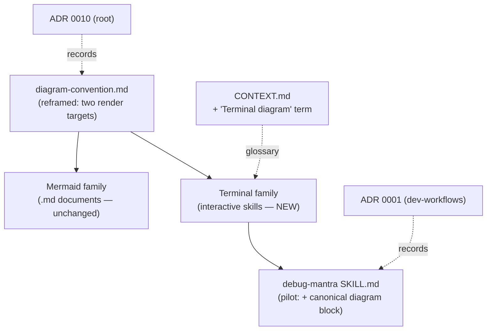
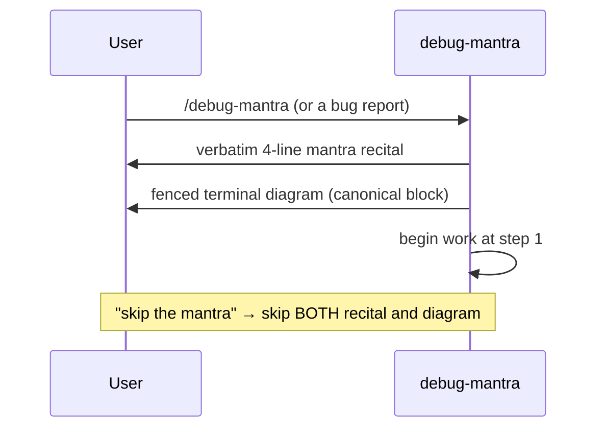

# Design — debug-mantra terminal diagram (+ the terminal-diagram convention)

Make `/debug-mantra` easier to read in the terminal by **adding** a static ASCII
process diagram alongside its existing prose, and write down the small convention
that makes it repeatable for future interactive skills.



The diagram above is the whole change: one reference file reframed to host two
diagram families, one new convention (terminal), one pilot skill adopting it, and
the supporting ADRs/glossary (already written during the design session).

## Problem

`debug-mantra` recites a four-line mantra verbatim, then explains the four steps
in prose — including the step-2 escalation ladder and two loop-backs. In a
terminal that prose is hard to scan. The repo's existing diagram convention can't
help: it governs **Markdown documents** only and uses **Mermaid**, which renders
as raw code in a terminal.

## Decisions (settled in the design session)

| # | Decision | Recorded in |
|---|---|---|
| 1 | **Augment, not replace** — the verbatim recital stays; the diagram is added. | ADR 0001 |
| 2 | **Whole-process scope, static** — 4 steps + step-2 escalation ladder + no-repro STOP gate + step-4→step-3 loop-back. | ADR 0001 |
| 3 | **A "terminal diagram" convention** (sibling to the Mermaid one); `debug-mantra` is the **sole pilot**, no other skill retrofitted. | ADR 0010 |
| 4 | **Unicode box-drawing, vertical layout**, inside a fenced code block. | ADR 0010 / 0001 |

Glossary terms **Diagram convention** (scoped to Markdown) and **Terminal
diagram** (new) are already added to `CONTEXT.md`.

## The canonical diagram block

This exact block is embedded in `debug-mantra/SKILL.md` and emitted **verbatim**
(like the recital) — it is fixed text, not re-authored per session, so it cannot
drift:

```
DEBUG MANTRA — four steps, strictly in order
─────────────────────────────────────────────

  ① REPRODUCE
  │   reliable repro?  ·  flaky → raise the rate
  │   no repro at all → ■ STOP (don't hypothesise)
  ▼
  ② FAIL PATH   (escalate only when the prior fails)
  │   1. attach a debugger
  │   2. source trace + knob enumeration
  │   3. in-code instrumentation
  ▼
  ③ FALSIFY
  │   3–5 ranked hypotheses  ·  run the DISPROOF first
  ▼
  ④ BREADCRUMBS
  │   ledger every run  ·  cross-reference all of them
  │
  └─▶ contradiction with a past run?  ──  back to ③
```

## How the opening response changes

The diagram is part of the **opening recital**, emitted right after the verbatim
mantra lines, in the first response:



## Work items

1. **Reframe `plugins/dev-workflows/references/diagram-convention.md`** to host
   two families:
   - Retitle from "…— skill-generated Markdown documents" to cover both.
   - Add a lead section **"Two render targets"**: Markdown document → Mermaid
     (existing); live terminal session → terminal diagram (new). The render
     target decides.
   - Keep the existing Rules 1–4 under a **"Mermaid diagrams (Markdown
     documents)"** heading (unchanged wording).
   - Add a **"Terminal diagrams (interactive skills)"** section: when it applies,
     Unicode box-drawing, vertical, fenced, augment-not-replace, keep ≲ 50 cols,
     static; alignment is hand-maintained.
   - Update the ADR pointer line to include **ADR 0010**.

2. **Edit `plugins/dev-workflows/skills/debug-mantra/SKILL.md`:**
   - Insert the canonical diagram block **between** the recital block and the
     "Then begin work." line, inside a fenced code block (order: recite → show
     diagram → begin work).
   - Add an operating rule: the diagram is emitted **verbatim** with the recital;
     "skip the mantra" skips it too; do not re-author or paraphrase it.
   - Add a one-line pointer to
     `${CLAUDE_PLUGIN_ROOT}/references/diagram-convention.md` (terminal-diagram
     section), mirroring how document skills point at the same file.

3. **Already done in the design session (no further action):** ADR 0010 (root),
   ADR 0001 (dev-workflows), `CONTEXT.md` terms.

4. **Follow-up (outside the repo):** re-sync the personal-skills copy at
   `~/.claude/skills/diagram-convention.md` after the canonical file changes
   (it carries a "re-sync" note). Flag to the user; do not edit silently.

## Out of scope

- Retrofitting other interactive skills (scrutinize, study-design-verify, …).
- A horizontal layout, or a live/animated status tracker.
- Any change to the verbatim mantra wording or the four-step logic.
- Touching the Mermaid rules themselves (only reorganized under a heading).

## Acceptance criteria

- Running `/debug-mantra` shows the verbatim recital **and** the fenced Unicode
  diagram in the first response, then proceeds at step 1.
- "skip the mantra" suppresses both recital and diagram.
- `diagram-convention.md` documents both families with the render-target split,
  and `debug-mantra/SKILL.md` points at it.
- The diagram block in SKILL.md is byte-identical to the canonical block above.
- No other skill's behavior changes.
```
