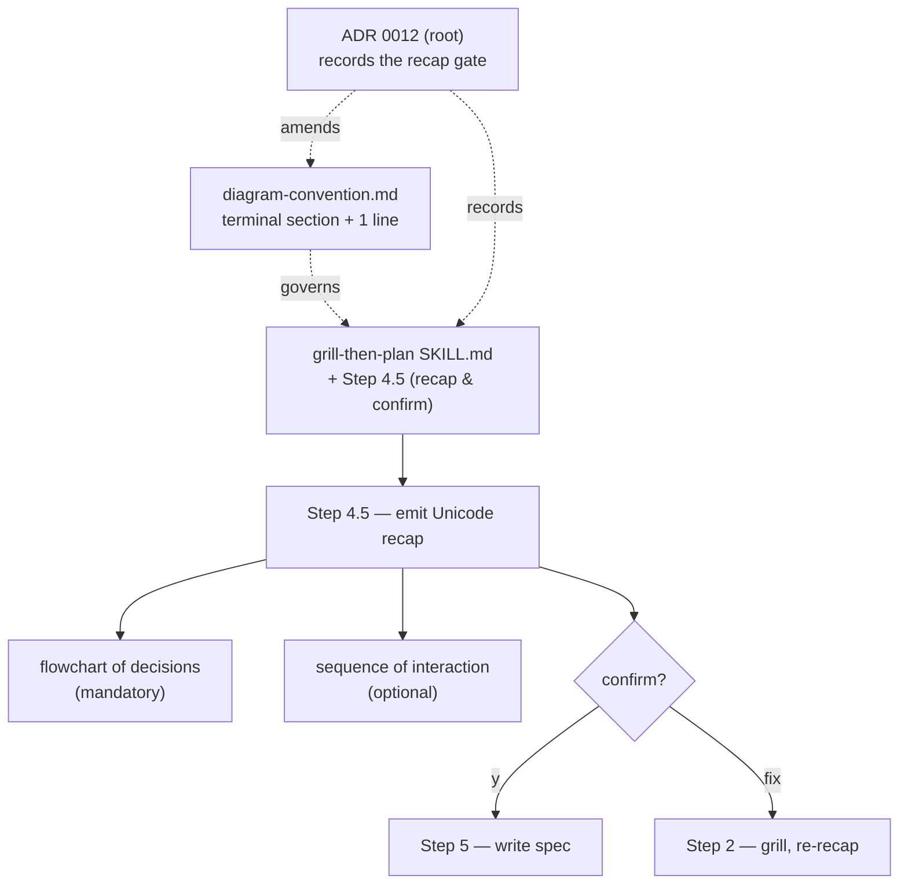
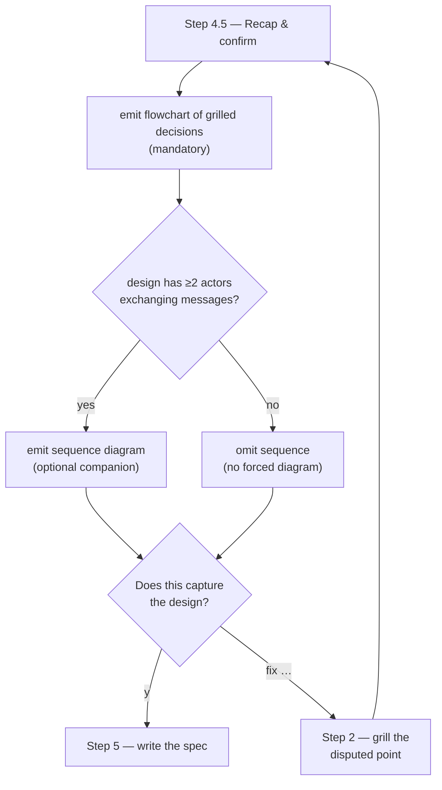

# Design — grill-then-plan end-of-grill recap gate

Add a **Step 4.5 — Recap & confirm** checkpoint to `grill-then-plan`: when grilling
converges, emit a **Unicode terminal recap** of the grilled design — a mandatory
decision **flowchart** plus an optional **sequence diagram** — and require the user
to confirm it captures the design before any spec is written. Record the behavior
with a new ADR and one supporting line in the terminal-diagram convention.



The diagram above is the whole change: one skill gains a recap-and-confirm step,
one convention line authorises a type-matched terminal recap, and one ADR records
the decision. No Rule 2 palette change — `flowchart` and `sequenceDiagram` are
already in it.

## Problem

`grill-then-plan` grills the user through a design tree (Step 2), captures terms
and ADRs inline (Step 4), then jumps straight to writing the design spec (Step 5).
There is no moment where the *shape* of the grilled design is reflected back
visually before the full spec is committed. A misunderstanding that surfaces only
when the user reads the written spec is expensive — the whole spec has already been
authored. The owner also wants the convergence point to carry a diagram, having a
stated preference for flowcharts and sequence diagrams.

The repo's diagram convention can't be applied naively here: the grilling runs in a
**live terminal**, where Mermaid renders as raw code. The terminal-diagram family
(ADR 0010) is the correct tool, and it is currently *optional* per skill.

## Decisions (settled in the design session)

| # | Decision | Choice |
|---|----------|--------|
| 1 | Where the recap lives | The **live grilling recap** (terminal), at end-of-grill — a new Step 4.5 between Step 4 (capture) and Step 5 (write spec). |
| 2 | Diagram form | **Unicode terminal diagrams** (box-drawing), per the terminal-diagram family. Not Mermaid — it can't render live. |
| 3 | Trigger | A **confirmation gate**: emit the recap, ask "does this capture the design?", and only proceed to Step 5 on confirmation. |
| 4 | Mandatory content | A **flowchart** of the grilled decisions — always present (every grilling produces decisions). |
| 5 | Optional content | A **sequence diagram** of the runtime interaction — shown only when the design has a genuine ≥2-actor interaction; omitted otherwise (no forced diagram). |
| 6 | Scope of the change | **ADR + convention note** — record an ADR (0012) and add one line to the convention's terminal section, matching how ADR 0011 recorded the last behavior change to this skill. |

## Step 4.5 — Recap & confirm (behavior)

The step has two branch points: a **sequence-or-skip** branch (preserves "no forced
diagrams") and a **confirm-or-loop** gate (the new checkpoint). This is decision
logic, so it is drawn as a `flowchart TD`:



In words:

1. Emit the decision **flowchart** (mandatory) as a Unicode terminal diagram.
2. If the grilled design has ≥2 actors exchanging messages, also emit a Unicode
   **sequence diagram**; otherwise omit it.
3. Ask the user to confirm the recap captures the design.
4. On confirmation, proceed to Step 5 (write the spec). On a correction, return to
   Step 2 to grill the disputed point, then re-run Step 4.5 — looping until confirmed.

## Diagram content rules

| Diagram | Status | Type / convention | Shown when |
|---------|--------|-------------------|------------|
| Decision flowchart | **Mandatory** | flowchart (decision logic / branching) | Always |
| Interaction sequence | Optional | sequence (time-ordered actor messages) | Design has ≥2 actors exchanging messages |

Both render as **Unicode terminal diagrams** per the terminal-diagram family
(vertical, ≲ 50 columns, inside a fenced block, static). They are *not* Mermaid.

## Example recap output

What the skill emits at the recap point (illustrative — the live skill fills in the
actual grilled decisions):

```
   ┌──────────── Design recap ─────────────┐
   │ Decisions (flowchart — always)         │
   └────────────────────────────────────────┘

   ┌────────────────────────────────┐
   │ ① Auth model                   │
   │    → JWT  (reject: session)     │
   └───────────────┬────────────────┘
                   ▼
   ┌────────────────────────────────┐
   │ ② Token store                  │
   │    → Postgres  (reject: Redis)  │
   └───────────────┬────────────────┘
                   ▼
   ┌────────────────────────────────┐
   │ ③ Refresh → sliding window     │
   └────────────────────────────────┘

   Interaction (sequence — optional, shown: ≥2 actors)
     Client        API          DB
       │            │            │
       │─ login ───▶│            │
       │            │─ verify ──▶│
       │            │◀─ user ────│
       │◀─ JWT ─────│            │

   → "Does this capture the design? (y / fix …)"
```

When the design has no real interaction, the sequence block is omitted and only the
flowchart shows.

## Files changed

- **`plugins/dev-workflows/skills/grill-then-plan/SKILL.md`** — insert **Step 4.5 —
  Recap & confirm** between the current Step 4 and Step 5. It points at the
  convention's terminal section rather than restating diagram rules, and makes the
  confirmation an explicit gate before Step 5. Renumbering: current Step 5 (write
  spec) and Step 6 (hand off) are unchanged in content.
- **`plugins/dev-workflows/references/diagram-convention.md`** — add one line to the
  *Terminal diagrams* section: an interactive skill MAY make a recap mandatory and
  MAY type-match it (a mandatory flowchart of decisions, an optional sequence of
  interaction). No change to the Mermaid Rule 2 palette.
- **`docs/adr/0012-grill-then-plan-recap-gate.md`** — new marketplace ADR recording
  the recap-gate decision, opening with a small decision diagram (Rule 3), in the
  style of ADR 0011.

## Rejected alternatives

- **Raw Mermaid fences in the live recap** — would show as code text in the
  terminal, violating the terminal-diagram family (ADR 0010) and Rule 4.
- **State diagram (mandatory or optional)** — a state diagram fits only when the
  design's subject is a lifecycle/status machine; most grilled designs are not, so
  it would be a forced diagram and would require extending the Rule 2 palette.
- **Full type-matched palette in the recap** (er / hierarchy as well) — scope creep;
  a mandatory flowchart plus an optional sequence keeps the live recap lean.
- **"Both" locations** (terminal recap *and* a new mandatory spec treatment) — the
  Step 5 spec already follows the Mermaid convention, so the recap is purely
  additive; nothing in Step 5 changes.
- **Read-only recap or on-demand recap** — a confirmation gate is the cheaper place
  to catch a misunderstanding, before the full spec is authored.
- **Skill-local only (no ADR)** — a behavior change to this skill should be recorded
  the way ADR 0011 recorded the previous one.

## Non-goals

- No change to `grill-with-docs` (it is not in this repo).
- No change to the Mermaid family or the Rule 2 palette.
- No change to Step 5 (spec authoring) or Step 6 (handoff to `writing-plans`).

## Validation

- The recap appears at end-of-grill and blocks Step 5 until the user confirms.
- A design with no ≥2-actor interaction shows only the flowchart (sequence omitted).
- A correction at the gate returns to grilling and re-emits the recap.
- The Unicode recap stays ≲ 50 columns and renders cleanly in a monospace terminal.
- `grill-then-plan`'s PLAYBOOK row still describes the skill accurately (the recap is
  an internal step, not a new skill — no new PLAYBOOK row needed).
