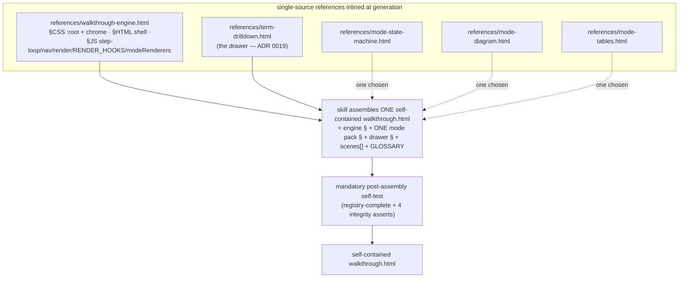
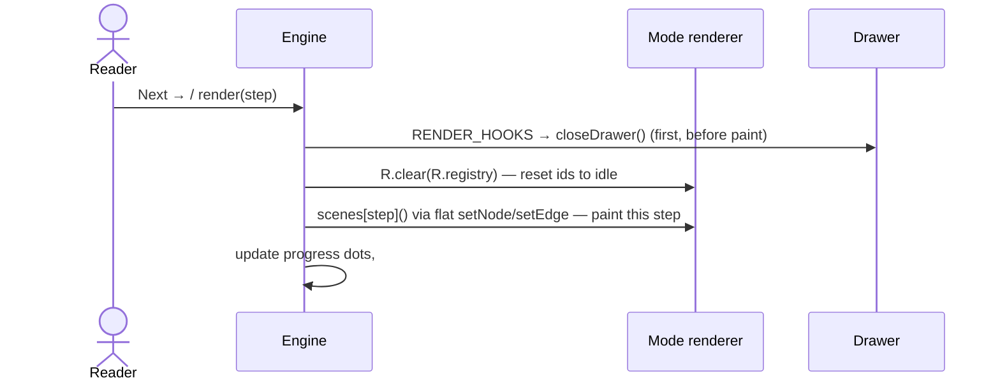
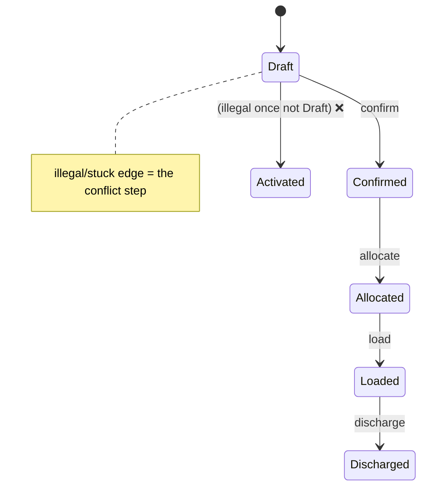

# Design — problem-description mode framework + state-machine mode (Phase 2)

Turns the `problem-description` skill's two hard-coded visualization modes into a
**plug-in mode framework**: a single inlined-at-generation **engine reference** owns the
step loop, navigation, palette, narration contract, and cross-cutting render hooks; each
visualization mode is a small **standalone-runnable pack** that registers one renderer
into a `modeRenderers` registry. Generation splices **engine + one mode pack + the drawer
+ authored scenes/GLOSSARY** into one self-contained `.html`. Phase 2 ships the engine,
**migrates the two existing modes (diagram, tables) onto it**, builds the first new mode
**state-machine**, and **dry-sketches** timeline + tree against the contract to verify the
boundary. Phases 3 (building timeline/tree/before-after) stay out of scope.



## Why (context)

Phase 1 added the drill-down primitive and proved the DRY single-source/inline-at-
generation pattern (ADR 0019). Phase 2 is the next step in the ADR-0016 sequence: a mode
plug-in framework + the first new mode, without mode-sprawl. A design-space workflow
(13 agents) generated three framework shapes, scored them on a judge panel, and
adversarially broke the leader (it survived with fixes). The decisions are locked in:

- **[ADR 0020](../../adr/0020-mode-framework-renderer-registry-engine.md)** — renderer-registry shared engine; migrate both existing modes onto it; first mode = state-machine.
- **[ADR 0021](../../adr/0021-engine-narration-contract-diagram-nested.md)** — engine narration = diagram's nested shape; tables migrates; `--bg=#0a0e14`.
- **[ADR 0022](../../adr/0022-color-token-discipline-root-and-svg-markerheads.md)** — `:root` tokens for CSS + engine-owned fixed 5 markerheads for SVG; `var()` escape hatch.
- **[ADR 0023](../../adr/0023-additivity-proof-dry-sketch-timeline-tree.md)** — build state-machine + dry-sketch timeline & tree against the contract.
- **[ADR 0024](../../adr/0024-scene-authoring-api-hybrid-alias.md)** — hybrid scene API: renderer object is the engine contract, generation aliases its methods to flat names.

## Goals / non-goals

**Goals**
- One shared engine reference; **zero engine duplication** across modes (diagram & tables migrated onto it).
- Adding a future mode = author one pack + add one selection-table row; **zero engine edits** (the additivity invariant).
- The drill-down primitive composes into every mode for free.
- Generated walkthroughs stay single self-contained files; no build step.
- A first new mode, **state-machine**, built on the engine and browser-verified.

**Non-goals (out of scope for Phase 2)**
- Building timeline / tree / before-after (Phase 3, on demand) — only *dry-sketched* here.
- Any build/bundler tooling.
- Changing the drawer primitive (ADR 0019 stands; the engine only adds a registration point for it).

## Architecture

### 1. The engine reference — `references/walkthrough-engine.html`

Same `§CSS` / `§HTML` / `§JS` marker + `DEMO ONLY` convention as `term-drilldown.html`,
and itself standalone-runnable (a tiny built-in demo mode so the engine renders in a
browser on its own).

**`§JS` owns** (mode-blind): `let currentStep`, `TOTAL`, `buildProgressDots()`,
navigation handlers (prev/next/reset), bootstrap (`render(0)`), null-guarded `show()/hide()`,
the **one canonical** `setNarration(cls, title, bodyHTML)` + `setSceneTitle()`, and two
empty registries plus the render loop:

```js
const RENDER_HOOKS = [];        // cross-cutting per-render actions; capabilities self-register
const modeRenderers = {};       // mode renderers self-register: modeRenderers['<name>'] = {...}
let MODE = null;                 // set by the assembled file to the chosen mode key

function render(step) {
  RENDER_HOOKS.forEach(h => h());            // runs FIRST, before any scene paint
  const R = modeRenderers[MODE];
  R.clear(R.registry);                        // engine calls the mode's reset generically
  scenes[step]();                             // scene body uses flat aliased setters (ADR 0024)
  /* update progress dots, #stepBadge, prev/next disabled — engine-owned */
}
```

> **Registration over fixed source-order** (refinement of the synthesis): `RENDER_HOOKS`
> and `modeRenderers` start empty; the drawer self-registers (`RENDER_HOOKS.push(closeDrawer)`)
> and the mode pack self-registers (`modeRenderers['state-machine'] = {...}`). This removes
> the fragile "closeDrawer must be defined before `RENDER_HOOKS=[closeDrawer]`" ordering — the
> only ordering requirement is that the engine `§JS` (which declares the empty registries)
> precedes the drawer/mode `§JS` that push into them, which the self-test asserts.

**`§CSS` owns**: a `:root` token block (the palette hexes + the one reconciled `--bg:#0a0e14`),
the **full** narration-variant set **including `.magic`** (fixing its silent no-op in tables
today), the chrome (controls, step-progress dots, narration box per ADR 0021's nested shape),
and **one** hidden-panel class `.wt-panel` (retiring the divergent `.extra-panel`/`.toggleable`).
Derived hexes that are not single tokens — tables' `.target-conflict` gradient
(`#3a1818`→`#3a2810`) and diagram's per-variant `.step-title` recolors
(`#d4a4ff`/`#ff8888`/`#a3e8b9`) — are lifted **verbatim** (ADR 0022).

**`§HTML` owns**: the page shell (container, `#narration` nested box, `#stepProgress`,
controls), plus the fixed **5 markerheads** (`arrowhead`/`-active`/`-magic`/`-done`/`-error`)
that SVG modes select from (ADR 0022).

### 2. The mode-pack contract — `references/mode-<name>.html`

A whole standalone-runnable file (runs its own 3-scene demo against the engine demo harness
before assembly — preserving the known-good-single-file safety net). It exposes, via marked
`§CSS` / `§HTML` / `§JS` sections to inline:

```js
// §JS — the mode self-registers exactly one renderer:
modeRenderers['state-machine'] = {
  registry: { NODE_LIST: [...], EDGE_LIST: [...] },   // one+ flat id-registry arrays
  clear(reg) { /* walk registry → reset to idle; hide .wt-panel; restore [data-default] */ },
  setNode(id, state) { /* REPLACE class on a pre-declared id; never createElement */ },
  setEdge(id, state) { /* REPLACE class + select a markerhead */ },
  assertRegistryComplete() { /* throw if any data-* id in the DOM is absent from registry */ },
};
```

- **`§CSS`**: mode state classes that reference **only** `:root` tokens.
- **`§HTML`**: the mode's content DOM (for state-machine: the `<svg>` with `<g>` state nodes
  and `<path>` transition edges, positioned in markup).
- **Contract obligations the pack signs**: scenes never `createElement`/`appendChild`; `clear()`
  and setters never touch drawer ids; no scene references `openTerm`/`closeDrawer`/`GLOSSARY`;
  SVG marker fills use the engine's fixed set (or `var(--token)`), never a raw hex.

### 3. Generation assembly + the flat scene API (ADR 0024)

The skill assembles one self-contained file: engine `§` + the one chosen mode pack `§` +
drawer `§` + authored `scenes[]` + `GLOSSARY`, sets `MODE = '<name>'`, and **aliases the
chosen renderer's methods to flat top-level names** so scene bodies read like today:

```js
const { setNode, setEdge } = modeRenderers[MODE];   // generation emits this once
// scene body — flat, exactly as ergonomic as today's setComp(...):
scenes[4] = () => { setNarration('error','Step 4 — illegal transition', '…');
                    setNode('stDraft','done'); setEdge('eDraftSubmit','error'); };
```



### 4. The state-machine mode (first pack)

- **Registries**: `NODE_LIST` (legal states, e.g. `['stDraft','stConfirmed','stAllocated','stLoaded','stDischarged']`), `EDGE_LIST` (legal transitions as directed pairs).
- **Setters**: `setNode(id, state)`, `setEdge(id, state)` — replace-only.
- **Five semantic states map onto the existing palette, zero new tokens**: current = `active` (`#5fb4ff`), passed = `done` (`#4ade80`), illegal/stuck = `error` (`#ff5757`), key transition = `magic` (`#b070ff`), reachable-idle = `dimmed`.
- **Rendering**: inline SVG — a state is a `<g>` node (like a diagram comp), a transition is a `<path>` edge (like a diagram arrow) selecting one of the engine's 5 markerheads. Reuses the diagram mode's arrow-state CSS and marker-selection logic.
- **Scene model**: the mandatory key-question/conflict/resolution is **native** — the *illegal or stuck transition is the conflict*, not a bolted-on slot. Standard skeleton: show legal states/edges idle → walk the happy path (one node/edge lit per step) → key question ("can it go X→Y here?") → the illegal/stuck edge lights `error` → resolution (the guard/why).



- **Domain grounding**: ~15 `statecode/statuscode` pairs in the codebase; lifecycles like `BookingItemStatus` (Planning→Confirmed→Allocated→Loaded→Discharged); illegal-transition guards literally coded (`QuoteService.cs` faults non-Draft re-activation). It fills the gap the two existing modes jointly leave: *the legal-edges-of-one-entity view*.

### 5. Migrating diagram + tables onto the engine

Each existing mode becomes a pack (`mode-diagram.html`, `mode-tables.html`) that registers
its renderer and supplies only its content DOM + state CSS; its copy of the step-engine is
deleted (now inherited from the engine reference). Specifics:
- **diagram**: renderer `{ COMPONENTS/ARROWS/LABELS registries, setComp/setArrow/setLabel/setText, clear }`; its narration already matches the engine contract.
- **tables**: renderer `{ ID_LIST registry, setRowClass/setBadge/setCell/setRule, clear }`; **narration migrates** to the nested shape (ADR 0021) — its outer `.scene` card / header-above-narration chrome is replaced; `setNarration` goes 2-arg→3-arg, `setSceneTitle` folds in; background shifts to `#0a0e14`.
- Both verified by a **before/after visual regression check** (the `:root` hoist is a one-shot blast radius — ADR 0022).

### 6. Mode selection — one flat decision table (anti-sprawl)

SKILL.md's prose "How to choose" is promoted to **one flat Markdown table**, one row per
mode, keyed on the single question *"what is the problem ABOUT?"* (a distinct noun per row),
with a `NOT when → use X` disambiguator column. The two sharp disambiguators written day one:
- **state-machine** = "ONE entity's status transitions" — *NOT* "many rows mutating → tables".
- **timeline** = "WHEN it happened / ordering" — *NOT* "what connects to what → diagram".
Tie-break stays "when in doubt → diagram". Each future row must name its **nearest neighbour**
explicitly.

| Mode | Problem is ABOUT | NOT when → use | Pack |
|---|---|---|---|
| diagram | data flow between components | row state → tables | mode-diagram |
| tables | rows changing state under rules | one entity's lifecycle → state-machine | mode-tables |
| state-machine | one entity's legal state transitions | many rows mutating → tables | mode-state-machine |

### 7. Safety net — mandatory post-assembly self-test

No build step means assembly-by-agent splices sources; a bad splice yields a self-contained
file that is silently broken. Before reporting done, the skill **must** run a machine-checkable
self-test against the assembled sample:
1. `modeRenderers[MODE]` resolves to an object with `registry`, `clear`, and the setters.
2. `RENDER_HOOKS` includes `closeDrawer` and runs before scene paint (the drawer closes on step change).
3. `assertRegistryComplete()` throws on any scene-referenced id missing from the registry.
4. Engine `§JS` (declares the empty registries) precedes the drawer/mode `§JS` that push into them.

### 8. Additivity dry-sketch (ADR 0023)

Without building them, sketch **timeline** (continuous time-axis) and **tree** (containment
indentation) as renderer packs against the contract. Confirm each expresses as replace-setters
over pre-declared ids with **no engine layout hook**. If either cannot, decide then: add one
designed-once layout hook, or declare that mode outside the registry model. Record the outcome.

## Changes to SKILL.md

- Replace "Two Visualization Modes" with the **engine + mode-pack model** and the flat selection table.
- Document generation assembly (inline engine §, one mode pack §, drawer §; alias setters; set `MODE`) and the post-assembly self-test.
- Per-mode design detail (state classes, insertion zones, registry-completeness) lives as comments **inside each pack file**; SKILL.md carries only the table + the shared contract + a pointer per pack (doc-sprawl control).
- Keep harness-neutral, skill-relative reference paths (`references/walkthrough-engine.html`, `references/mode-<name>.html`).

## Verification / acceptance criteria

- [ ] `references/walkthrough-engine.html` runs standalone in a browser (built-in demo mode).
- [ ] `references/mode-state-machine.html` runs its own 3-scene demo standalone; states/edges paint, semantic colors correct, **zero new color tokens**, **zero new `<marker>` defs**.
- [ ] An **assembled** state-machine walkthrough (scratchpad): the self-test passes all 4 asserts; stepping paints states/edges; the illegal/stuck edge lights `error`; a drillable term opens the drawer; **Next closes the drawer** and advances the step; Reset leaves no residue.
- [ ] **diagram** and **tables**, migrated onto the engine and assembled, are **visually unchanged** vs their Phase-1 selves (tables' narration nested-shape migration is the one intended change) — before/after regression check.
- [ ] Drill-down referential integrity + idempotency checks pass on every assembled mode (reuse the Phase-1 checker).
- [ ] timeline + tree dry-sketches confirm "zero engine edits" (or the layout-hook decision is recorded).
- [ ] SKILL.md selection table has the two sharp disambiguators; no mode row's "about" noun overlaps a neighbour's.

## Risks (carried from the design-space analysis)

- **Assembly-by-agent, no build** — the one axis worse than today; mitigated only by the mandatory self-test. *(ADR 0020)*
- **`:root` hoist blast radius** — one bad derived-hex extraction regresses a state color across all modes at once; require before/after regression. *(ADR 0022)*
- **Narration migration is a real shipped-look change** to tables — explicit, visually re-verified. *(ADR 0021)*
- **Additivity proven only for the easy mode** — hence the timeline/tree dry-sketch before locking. *(ADR 0023)*
- **tree/hierarchy is the highest-risk future mode** (reader-driven expand/collapse collides with idempotent scenes AND the reader-driven drawer) — sequence it LAST in Phase 3; flag now.
- **SKILL.md doc-bloat** — relieved only if per-mode detail stays inside pack files.

## Out of scope / future (Phase 3)

Build timeline, tree, before-after as packs on this engine, on demand, each with its own ADR
and selection-table row (nearest-neighbour named). tree sequenced last.
