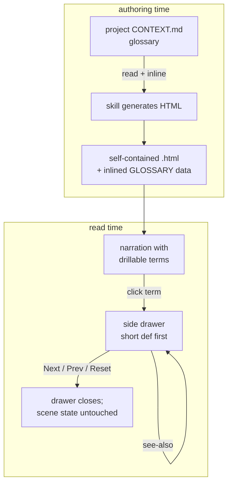
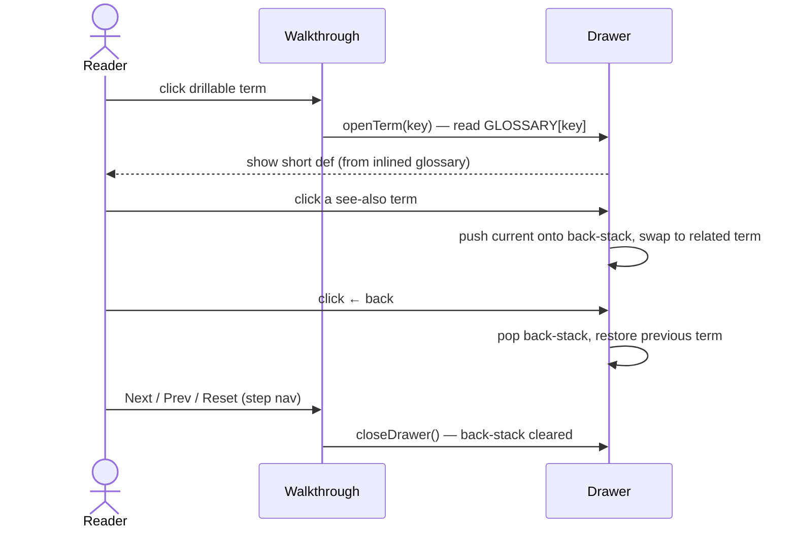

# Design — `problem-description` term drill-down (Phase 1)

Adds a **term drill-down** primitive to the `problem-description` skill: a reader who
hits an unfamiliar term mid-walkthrough (e.g. "glasshull scope") clicks it to open a
side drawer with a short, glossary-grounded definition and `see-also` links that hop to
related terms. It is **cross-cutting** — it lands in both existing modes (diagram and
tables) now, and every future mode inherits it. This is **Phase 1** of the evolution
sequenced in [ADR 0016](../../adr/0016-problem-description-drill-down-first.md); Phases
2–3 (mode framework + new modes) are sketched under *Future direction* but are **out of
scope** here.



## Why (context)

Grilling surfaced two gaps in `problem-description`: (1) only two visualization modes,
and (2) walkthroughs are **flat and single-level** — a reader stuck on a term cannot
drill down. Gap (2) is the felt pain and is *foundational*, so it ships first (ADR 0016).
Three decisions frame this design:

- **[ADR 0016](../../adr/0016-problem-description-drill-down-first.md)** — drill-down
  first (cross-cutting primitive), then modes incrementally.
- **[ADR 0017](../../adr/0017-drill-down-content-grounded-in-context-md.md)** — content
  is grounded in `CONTEXT.md`, inlined at authoring time, short-first.
- **[ADR 0018](../../adr/0018-drill-down-is-side-drawer-with-see-also-hops.md)** — the
  container is a side drawer with see-also hops, not a tooltip.

The canonical term is **Term drill-down** ([CONTEXT.md](../../../CONTEXT.md)).

## Goals / non-goals

**Goals**
- A reader can click any unfamiliar term in the narration and read a short definition
  without leaving the walkthrough.
- The definition is grounded in the project's `CONTEXT.md` when the term exists there.
- The reader can hop deeper to related terms (`see-also`), multiple levels.
- The primitive works in **both** existing modes and does not break the idempotent-scene
  rule.

**Non-goals (explicitly out of scope for Phase 1)**
- New visualization modes (timeline / tree / state-machine / before-after) — Phase 2+.
- A mode plug-in framework — Phase 2.
- Browser render-verification of the generated HTML — a separate gap, not addressed here.
- Editing `CONTEXT.md` from inside a walkthrough at read time (drawer is read-only).

## Design

### 1. Content source — glossary-grounded, inlined (ADR 0017)

At **authoring time** the skill:

1. Reads the open project's `CONTEXT.md` (single-context) or the relevant context file
   via `CONTEXT-MAP.md` (multi-context).
2. Selects the terms it will mark drillable (see §5).
3. **Inlines** each definition into the HTML as a `GLOSSARY` data object — the HTML
   stays a single self-contained file; no runtime fetch of `CONTEXT.md`.

```js
// Inlined at authoring time — one entry per drillable term.
const GLOSSARY = {
  "glasshull-scope": {
    term:    "glasshull scope",
    short:   "the set of records a workflow may read/write in one transaction",
    seeAlso: ["row-lock", "transaction"],   // keys into GLOSSARY
    source:  "CONTEXT.md"                    // or "authored" (fallback)
  },
  // ...
};
```

- **Term present in CONTEXT.md** → `short` is taken from the glossary definition;
  `source: "CONTEXT.md"`. `seeAlso` may reuse the glossary's `_Avoid_`/related terms.
- **Term absent from CONTEXT.md** → the author writes a one-line `short`;
  `source: "authored"`. The skill **may offer** to add the term to `CONTEXT.md`,
  closing the loop with the grill-with-docs / grill-then-plan glossary discipline.
- **No CONTEXT.md at all** → every drillable term is `authored`.

### 2. Container — side drawer with see-also hops (ADR 0018)



- The drawer is **declared once** in the initial HTML, hidden with `.hidden`, consistent
  with the template's "declare-upfront, toggle-visibility" rule.
- `openTerm(key)` populates the drawer from `GLOSSARY[key]`, renders `seeAlso` as
  clickable chips, and `show()`s the drawer.
- A small **back-stack** array supports `← back` between hops; cleared on close.
- `closeDrawer()` hides the drawer and clears the back-stack.

### 3. Affordance

A drillable term is marked in narration so the reader knows it is clickable:

```html
narration … the <span class="term" data-term="glasshull-scope">glasshull scope</span> lock …
```

```css
.term { border-bottom: 1px dotted #5fb4ff; color: #5fb4ff; cursor: help; }
```

Reuses the existing info/accent token `#5fb4ff` (no new color). One delegated click
handler reads `data-term` and calls `openTerm()`.

### 4. Idempotency — drawer is orthogonal to scene state

The drawer must not corrupt the idempotent-scene model:

- Drawer state lives **outside** scene state. `clearAllStates()` does **not** touch it.
- The render loop, on every step change, calls `closeDrawer()` **before** running the
  current scene — so stepping always lands with the drawer closed and no residue.
- No scene function ever opens, closes, or references the drawer. Scenes remain pure
  descriptions of the diagram/table state.

This keeps "every scene fully describes DOM state from scratch" true: the drawer is a
reader-driven overlay, never part of a scene's described state.

### 5. Which terms become drillable (authoring rule)

`problem-description` Phase 1 already articulates *"the prerequisites the reader already
has."* Drillable candidates are terms used in the narration that are **beyond those
prerequisites** — domain jargon, schema names, project-specific concepts. Prefer terms
that exist in `CONTEXT.md` (grounded); for a beyond-prerequisite term not in the
glossary, author a fallback `short` (§1). A term the reader is assumed to know is **not**
marked — over-marking turns the narration into a sea of dotted underlines.

## Changes to the templates

Both [`template.html`](../../../plugins/dev-workflows/skills/problem-description/template.html)
and
[`template-diagram.html`](../../../plugins/dev-workflows/skills/problem-description/template-diagram.html)
gain the same self-contained drawer block:

- A hidden `<aside id="termDrawer" class="drawer hidden">` with title, short-def, see-also
  region, and `← back` / `✕ close` controls.
- `.term` CSS and the `GLOSSARY` object (seeded with the template's demo term so the
  scaffold is verifiable in a browser, matching how the templates already ship a runnable
  demo).
- `openTerm()`, `closeDrawer()`, the back-stack, and the delegated click handler.
- The render loop's existing step-change path calls `closeDrawer()`.

## Changes to SKILL.md

[`SKILL.md`](../../../plugins/dev-workflows/skills/problem-description/SKILL.md):

- **Phase 1** — add a step: identify beyond-prerequisite terms and read `CONTEXT.md`
  (or the mapped context) to source their definitions.
- **Phase 4** — document the drawer insertion zone and the `GLOSSARY` authoring rule
  (grounded-first, authored fallback, offer-to-add-to-CONTEXT.md).
- **Phase 5 self-test** — add checklist items (below).
- **Common Mistakes** — add: ungrounded invented definitions; over-marking terms; a
  scene touching the drawer; a `data-term` with no `GLOSSARY` entry.

No PLAYBOOK row is added — this enhances an existing skill rather than adding one.

## Verification / acceptance criteria

A walkthrough built with the new primitive passes when:

- [ ] Every `data-term` in the narration has a matching `GLOSSARY` key.
- [ ] Every `seeAlso` key resolves to a `GLOSSARY` entry.
- [ ] Each `GLOSSARY` entry with `source: "CONTEXT.md"` matches the glossary wording.
- [ ] Clicking a term opens the drawer with the short definition.
- [ ] Clicking a see-also chip swaps the drawer; `← back` restores the prior term.
- [ ] `Next` / `Prev` / `Reset` close the drawer and leave no residue (idempotent).
- [ ] No scene function references the drawer; `clearAllStates()` does not touch it.
- [ ] With no `CONTEXT.md`, drillable terms still work via `authored` definitions.

## Future direction (Phase 2–3 — out of scope)

Recorded so the framework intent is not lost (ADR 0016):

- **Phase 2** — a mode plug-in framework (shared nav/scene-engine/color-tokens + a clean
  selection rule) plus the first new mode. Candidate first mode: **state-machine**, given
  the CRM/D365 domain (statecode/statuscode, BPF stages). Each new mode must support the
  drill-down primitive from day one.
- **Phase 3** — remaining modes (timeline, tree/hierarchy, before/after) added on real
  demand, each with its own ADR, to avoid mode-sprawl.

## Suggested first build step

Render a standalone **HTML drawer mockup** in the template's dark theme (drawer over a
mini diagram) to de-risk before editing the real templates — the ASCII mockups already
locked the choice; this validates the look and the interaction.
