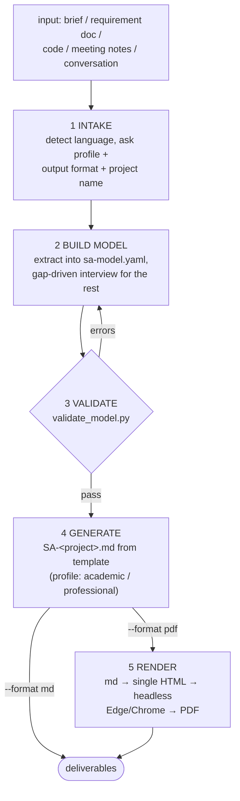

# Design Spec — `sa-doc`: generate a full SA&D document from one central model

**Date:** 2026-07-06
**Status:** Draft — awaiting approval
**Topic:** A dev-workflows skill that generates a complete System Analysis & Design
document (use cases, sequence/activity/state diagrams, class + ER model, data
dictionary, architecture, screens) from a single validated model file, with
Markdown as canonical output and PDF as an optional render.
**ADRs:** one new ADR — *generate every SA artifact from one central model*
(number assigned at implementation). Extends the diagram convention
(ADRs 0005–0009) with one new row (`stateDiagram-v2`).



---

## Goal

Produce SA&D documents like `Project SA.pdf` (the bookstore course report reviewed
2026-07-06) but without its failure modes. That review confirmed **60 defects**;
the dominant root cause was that each artifact (scope, use cases, sequence,
class, data dictionary, screens) was **written by hand separately and
copy-pasted**, producing 30+ cross-artifact contradictions (features in scope
with no use case, sequences using fields no table stores, a status field too
small for its own state machine, three mutually exclusive technology stacks).

The fix is structural: **every section is derived from one machine-validated
model.** Claude writes the model and the prose; a Python validator enforces the
referential integrity that hand-written documents lose.

## Non-goals (YAGNI)

- **No .docx output.** Markdown canonical, PDF optional. Nothing else.
- **No editing of arbitrary existing SA documents.** Regeneration happens only
  through `sa-model.yaml` — edit the model, re-run. (Reverse-engineering an
  existing document into a model is a follow-up, not v1.)
- **No automatic filing to ADO/GitHub.** The document may *seed*
  `generating-test-cases` or the backlog pipeline, but sa-doc itself only writes
  files.
- **No deterministic prose generator.** The "script generates the whole
  document" approach was considered and rejected: wooden prose, rigid profiles,
  heavy template maintenance. Claude writes prose; the validator guards
  consistency.

---

## Decisions locked during brainstorming

| Question | Decision |
|---|---|
| Audience/template | **Hybrid** — one core template + `academic` / `professional` profiles chosen at intake |
| Content source | **Both** — extract from any input first, then gap-driven interview (never ask what the input already answers) |
| Document language | **Follow the input language** (Thai→Thai, English→English); explicit override argument wins |
| PDF mechanism | **Headless Edge/Chrome** print-to-pdf from a self-contained HTML render (no pandoc/LaTeX/node toolchain) |
| Central model | **Persisted** as `sa-model.yaml` next to the document — the single source of truth, enables regeneration |
| Architecture | **Model + validator** — Claude authors model and prose; `validate_model.py` blocks generation until the model is internally consistent |

---

## Skill identity

- **Location:** `plugins/dev-workflows/skills/sa-doc/SKILL.md`
- **Command wrapper:** `plugins/dev-workflows/commands/sa-doc.md` →
  `/dev-workflows:sa-doc` (thin, hands `$ARGUMENTS` to the skill per repo
  convention)
- **Bundled files** (skill-relative references):
  - `references/model-contract.md` — the `sa-model.yaml` schema (single place it
    is defined)
  - `references/template-core.md`, `references/template-academic.md`,
    `references/template-professional.md`
  - `scripts/validate_model.py`
  - `scripts/render_doc.py`
- **Triggers (description keywords):** "ทำเอกสาร SA", "เอกสารวิเคราะห์และออกแบบระบบ",
  "generate SA document", "system analysis document", "SA&D report",
  "ทำ project report", handing over a brief/requirements and asking for a full
  design document. Must NOT trigger for one-diagram requests (that's ad-hoc) or
  for problem walkthroughs (`problem-description`).
- **Harness-neutral wording** throughout (Claude Code + Antigravity); scripts
  referenced via skill-relative paths in the three installer-rewritable shapes.

## Flow

1. **Intake.** Collect input (file paths, pasted text, or the conversation).
   Detect input language → document language (an explicit language argument
   overrides). Ask the user three things in one round: **profile**
   (`academic` | `professional`), **output** (`md` | `pdf` | `both`), **project
   name** (suggest one from input). Working directory defaults to
   `./SA-<project>/` under the current directory (user may override).
2. **Build model.** Extract actors, scope, use cases, entities, states, NFRs
   (and profile-specific extras) into `sa-model.yaml` following
   `references/model-contract.md`. For every REQUIRED slot the input does not
   answer, ask — grouped, smallest number of questions possible. The user may
   answer "TBD"; TBDs are recorded as `TBD` values and surfaced in the final
   summary, never silently invented. **The skill never fabricates domain facts**
   (same evidence discipline as `generating-test-cases`).
3. **Validate.** Run `scripts/validate_model.py sa-model.yaml`. Errors block
   generation; fix the model (asking the user when the fix is a domain
   decision) and re-run until clean. Warnings are listed and explicitly
   accepted by the user or fixed — never silently ignored.
4. **Generate.** Write `SA-<project>.md` from the model using the core template
   + profile additions, in the document language. Every section's facts come
   from the model; prose connects and explains, it does not introduce new
   entities/actors/fields. Diagrams are Mermaid per the repo diagram
   convention (see below).
5. **Render (pdf/both only).** `scripts/render_doc.py SA-<project>.md` produces
   `SA-<project>.html` (self-contained; Mermaid rendered client-side) then
   invokes headless Edge (`msedge --headless --print-to-pdf=...`), falling back
   to `chrome`/`chromium` on other platforms. If no browser is found, deliver
   the HTML and tell the user to print it — never fail the whole run over the
   PDF step.

## The model contract — `sa-model.yaml`

Defined once in `references/model-contract.md`. Shape (abbreviated):

```yaml
meta:      { project, org, language, profile, authors: [], date }
problem:   { current_problems: [{id: P1, text}],
             objectives:       [{id: O1, text, problems: [P1]}],
             benefits:         [{id: B1, text, objectives: [O1]}] }
actors:    [ {id: ACT1, name, desc} ]
scope:     [ {actor: ACT1, capability, use_cases: [UC1]} ]
use_cases: [ {id: UC1, name, actors: [ACT1], preconditions: [],
              postconditions: [],          # real guarantees, never triggers
              main_flow: [{step: 1, actor, action, system_response,
                           fields: [ENT1.field]}],   # machine-checkable refs
              extensions: [{at_step: 3, condition, flow, fields: []}],
              special_reqs: [], entities: [ENT1], screens: [SCR1]} ]
entities:  [ {id: ENT1, name, fields: [{name, type, size, desc,
              pk: true, fk: ENT2.field, sample}]} ]   # sample optional
states:    [ {entity: ENT1, field: status,
              states: [], transitions: [{from, to, trigger, uc: UC1}]} ]
nfrs:      [ {id: NFR1, category, requirement, metric} ]
security:  [ {id: SEC1, concern, control} ]        # REQUIRED when profile=professional
architecture: { style, components: [], deployment }
screens:   [ {id: SCR1, name, use_cases: [UC1]} ]
# academic profile extras:
plan:      { phases: [{name, from, to}] }           # months validated contiguous
budget:    [ {item, category, amount} ]
literature: [ {topic, source, relevance} ]
```

Every object has a stable `id`; cross-references use ids only. `TBD` is a legal
value for any leaf; the validator counts and reports TBDs but does not block on
them.

## Validator — `scripts/validate_model.py`

Python 3, stdlib + PyYAML only. Exit 0 = clean, 1 = errors. Output: grouped
human-readable report (errors, then warnings, then TBD inventory). Every rule
exists because `Project SA.pdf` failed it:

| # | Rule | Level |
|---|---|---|
| E1 | every actor referenced anywhere exists in `actors` | error |
| E2 | every scope capability lists ≥ 1 existing use case | error |
| E3 | every `fk` targets an existing `entity.field` | error |
| E4 | every `fields` ref on `main_flow`/`extensions` steps exists on the use case's entities | error |
| E5 | every `states` group names an existing entity field whose type can hold all listed states; every transition's `uc` exists | error |
| E6 | id uniqueness + dangling id references anywhere | error |
| E7 | `plan.phases` months are contiguous and ordered (academic) | error |
| E8 | profile=professional ⇒ `security` non-empty | error |
| W1 | use case with no scope capability pointing at it (and vice-versa objectives with no use case) | warning |
| W2 | use case with no screen; screen with no use case | warning |
| W3 | money-typed fields (`amount`, `price`, `total`…) with inconsistent types across entities | warning |
| W4 | empty/trigger-shaped postconditions (e.g. starts with "กด"/"click") | warning |
| W5 | identical extension text repeated across ≥ 3 use cases (copy-paste detector) | warning |
| W6 | entity with zero fields; `String(n)` where a field's `sample` value exceeds `n` | warning |

## Templates and profiles

`references/template-core.md` defines section order, the 13-field use-case
description with **correct semantics** (postcondition = guaranteed state;
extensions = numbered branches off main-flow steps; no boilerplate "restart the
computer" recovery; special requirements only when real), and which Mermaid
type each section carries.

- **Core (both profiles):** background/problem/objectives/scope →
  Requirements (FR ids from scope + NFR table) → Use Case diagrams +
  descriptions → Sequence → Activity → **State** → Class + **ER** → Data
  Dictionary → Architecture → Screens → **Traceability matrix**
  (problems → objectives → use cases → entities/screens; generated from model
  ids, zero manual upkeep).
- **Academic adds:** related literature, Gantt plan, budget, expected benefits,
  bibliography — the course-report skeleton of the sample.
- **Professional adds:** Security Design (mandatory), Deployment view,
  test-case seed table (one row per use case main flow + each extension) with a
  pointer to `dev-workflows:generating-test-cases` for the full suite.

### Diagram convention

The generated document follows `plugins/dev-workflows/references/diagram-convention.md`:
one Mermaid overview diagram at the top (Rule 1), type-matched section diagrams
(Rule 2): use-case overview → `flowchart TD`, interactions → `sequenceDiagram`,
data model → `erDiagram`, decision flows → `flowchart TD`. **New:** entity
lifecycles render as `stateDiagram-v2`; this row is added to the convention
table (same commit, canonical wording changed only in that file per its header
rule).

## Rendering — `scripts/render_doc.py`

- md → **one self-contained HTML**: embedded CSS (print-friendly, A4 margins,
  Thai-capable font stack `"Sarabun", "Leelawadee UI", Tahoma, sans-serif`),
  Mermaid via CDN `<script>` by default, `--mermaid-js <path>` for offline use.
- HTML → PDF: `msedge --headless --print-to-pdf=<out> <html>`; probe order
  `msedge` → `chrome` → `chromium`. Waits for Mermaid render completion (script
  signals via `document.title` change; renderer polls before printing).
- Degrades gracefully: no browser found ⇒ ship `.html`, print instructions, do
  not fail.

## Deliverables per run

```
SA-<project>/
  sa-model.yaml      # source of truth — edit this, re-run to regenerate
  SA-<project>.md    # canonical document
  SA-<project>.html  # when pdf/both requested
  SA-<project>.pdf   # when pdf/both requested
```

Final chat summary lists: file paths, validator warnings accepted, TBD
inventory (what's still unknown), and the offered next steps
(`generating-test-cases`, backlog filing).

## Repo integration (same commit as the skill)

- **PLAYBOOK.md**: one row in the WORKING toolbox — *"need a full SA/design
  document → `sa-doc`"* — plus a node in the router diagram.
- **diagram-convention.md**: add the `stateDiagram-v2` row (entity lifecycle).
- **ADR**: *generate-from-central-model* — why every artifact derives from
  `sa-model.yaml` and why a validator gates generation (evidence: the 60-defect
  review). Location: `docs/adr/` (marketplace level, since it extends the
  diagram convention too).
- **Versions**: bump `plugins/dev-workflows/.claude-plugin/plugin.json` and the
  matching entry in `.claude-plugin/marketplace.json` together.
- **CLAUDE.md/CONTEXT.md**: no changes needed beyond what the conventions
  already mandate (verify at implementation).

## Testing

Fixture = the reviewed bookstore system (`Project SA.pdf` content), because we
hold a 60-defect ground truth for it:

1. **Validator seeded-defect test**: encode the bookstore domain into a correct
   `sa-model.yaml`; then re-introduce representative original defects
   (scope capability "ตั้งกระทู้" with no use case, `Order.payment_id` FK to a
   non-existent field, `deliver_status` boolean vs 3-state lifecycle, identical
   extension text across use cases, `String(20)` product name vs a 33-char
   sample) and assert each is caught at the expected level.
2. **End-to-end md**: run the skill on a short Thai brief; generated document
   opens with the overview Mermaid diagram, all sections trace to model ids,
   language is Thai.
3. **End-to-end pdf**: `render_doc.py` produces HTML + PDF on Windows
   (msedge present); no-browser path degrades to HTML with instructions.

## Follow-ups (out of scope now)

- Reverse-engineering an existing SA document/PDF into `sa-model.yaml`.
- A github-backlog/ado hand-off that files the traceability matrix as work items.
- Additional profiles (e.g. thesis, RFP response).
