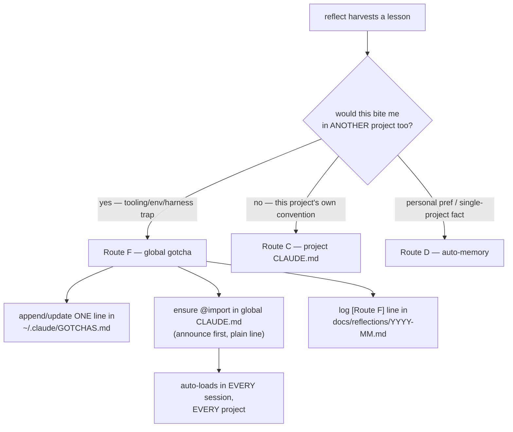
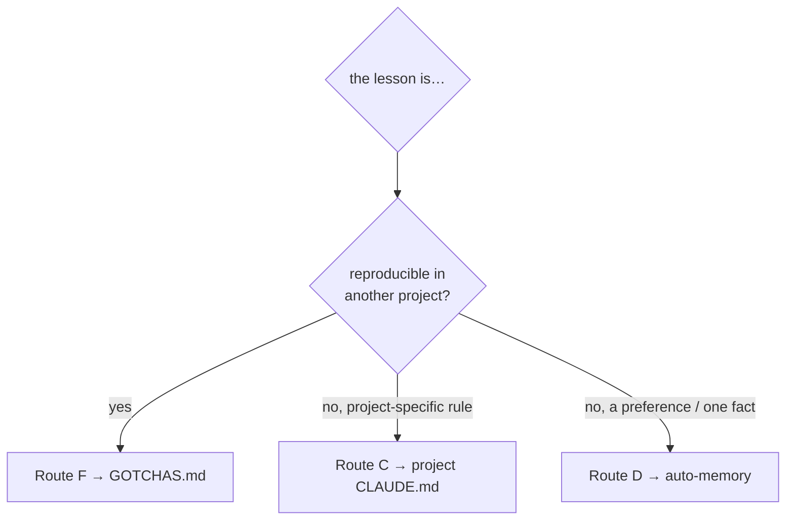
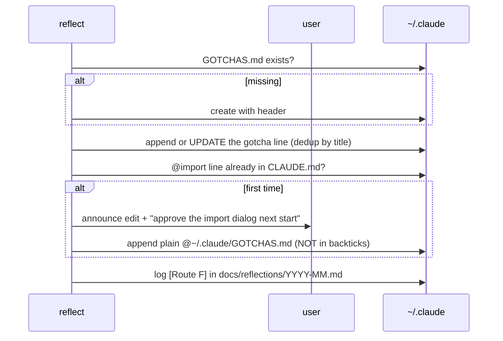

# Design Spec — reflect files cross-project gotchas into a global, auto-loaded GOTCHAS.md

- **Date:** 2026-07-12
- **Skill:** `dev-workflows/reflect` (owned — Route A change)
- **ADRs:** [0028](../../adr/0028-reflect-cross-project-gotchas-file.md) ·
  [0029](../../adr/0029-reflect-route-f-global-gotcha.md) ·
  [0030](../../adr/0030-gotchas-file-format-diagram-exempt.md) ·
  [0031](../../adr/0031-reflect-provisions-gotchas-idempotent-with-transparency-gate.md)

## Overview

## Problem

reflect routes each session lesson to where it will fire again: an owned skill
(A), a new skill (B), the **project** CLAUDE.md (C), **project-keyed** memory
(D), or discard (E). None of these reaches *every* project. Cross-project
tooling/environment traps — e.g. "PowerShell 5.1 has no &&", "the mobile-app
write-guard flips drive-letter case within a session" — were being filed to
Route D (auto-memory), whose store is keyed by project directory, so a lesson
learned in project X never surfaced in project Y. The lesson was captured where
it could not fire.

## Goal

Give reflect a destination for a gotcha that must fire **in every project**: a
standalone `~/.claude/GOTCHAS.md` that Claude Code **auto-loads in every
session** via an `@` import in the global `~/.claude/CLAUDE.md` — the AI reads it
itself, and the user can also re-read it on demand.

## Design

### 1. Destination + loading mechanism (ADR 0028)

- File: **`~/.claude/GOTCHAS.md`** (next to the global CLAUDE.md; uppercase to
  match `CLAUDE.md` / `MEMORY.md` / `PLAYBOOK.md`).
- Wired via a single bare line in `~/.claude/CLAUDE.md`: `@~/.claude/GOTCHAS.md`
- Verified behavior (Claude Code docs, 2026-07-12): the user-level CLAUDE.md
  loads in every session/working directory (Claude Code walks up the directory
  tree); `@~/…` is the documented import pattern; imports recurse up to 4 hops.
- **Manual re-read** always works because it is a real file: "read the gotchas
  again" / `@GOTCHAS.md`.

### 2. Route F — global gotcha (ADR 0029)

Add **Route F** to reflect's routing table. Selection test:

> **"If I did this in another project, would this same thing bite me?"**

- **Yes** → Route F (tooling quirks, harness/hook behaviors, shell/language
  traps, cross-cutting environment gotchas).
- **No — this project's own convention/architecture** → Route C.
- **Personal preference / single-project fact** → Route D.

Route F **reclaims** the cross-project tooling/environment lessons that used to
default to Route D. Route D keeps genuinely single-project facts and prefs.

### 3. GOTCHAS.md format — terse, diagram-exempt (ADR 0030)

The file is auto-loaded every session, so it stays as small as possible and is
**exempt from the Mermaid diagram convention** (like MEMORY.md).

- **One gotcha = one line**, grouped under `##` area headings; create a heading
  lazily when none fits.
- Line shape: `- **<short title>** — <fix / workaround>. (YYYY-MM-DD)`
  The bold title doubles as the **dedup key**.

Header template (written on lazy creation):

~~~markdown
# GOTCHAS — cross-project traps

Auto-loaded everywhere via `@` in ~/.claude/CLAUDE.md. One gotcha = ONE line.
Harvested by the reflect skill (Route F). Grouped by area; update in place, do
not duplicate. (Keep any literal @-path in backticks so it is not re-imported.)

## Shell / PowerShell
- **PS 5.1 has no &&/||** — use `;` + `if ($?)`. (2026-07-12)

## Claude Code hooks & harness
- **mobile-app write-guard flips drive-letter case mid-session** — if an Edit fails on path case, retry with the opposite `c:`/`C:`. (2026-07-12)
~~~

> Note: any real `@path` written into GOTCHAS.md itself must be wrapped in
> backticks — because GOTCHAS.md is an imported file, a bare `@path` there would
> recursively import (up to the 4-hop limit).

### 4. Provisioning — idempotent, with a transparency gate (ADR 0031)

Runs in **Stage 4** when applying an already-approved Route-F finding:

Rules:
- **Check before write, always** — never clobber GOTCHAS.md, never duplicate the
  import line.
- **Create GOTCHAS.md silently** (reflect's own artifact, finding already
  approved).
- **Announce before editing the personal global CLAUDE.md**, and tell the user
  to **approve the one-time import dialog** on next start (else the import stays
  disabled permanently).
- A newly filed gotcha is **inert until the next session** — it loads only after
  a restart and the approved import; reflect cannot verify activation, so it
  must not report the gotcha as already live.
- The import line is written **plain** — a backticked `@…` is treated as literal
  and never loads.

### 5. Growth discipline

- **Update beats create** — grep the bold title first; if present, refine that
  line in place and re-date it.
- **No auto-delete** (knowledge is never dropped silently); the trailing date
  supports manual review/expiry.
- **No hard cap** — a cap could force dropping a real gotcha. A wrong/obsolete
  line may be corrected or removed (covered by "update beats create" + reflect's
  existing Pass C technical verification).

### 6. Coexistence with the reflections log

A Route-F finding writes **two places**, which do not overlap:
- `~/.claude/GOTCHAS.md` — the always-on, distilled cross-project knowledge base.
- `docs/reflections/YYYY-MM.md` — the chronological session journal gains its
  normal one-line entry: `[Route F · GOTCHAS.md] <title>`.

## Concrete edits to `reflect/SKILL.md`

1. **Stage 2 routing table** — add a Route F row (Global gotcha →
   `~/.claude/GOTCHAS.md`; when: cross-project tooling/environment trap, "would
   this bite me in another project too?") and note Route F reclaims cross-project
   lessons that previously went to D.
2. **Ownership guardrail** — Route F writes the user's global config
   (`~/.claude/`), which the user owns; the CLAUDE.md edit is announced
   (transparency), consistent with Route D's write discipline.
3. **Stage 4** — add the Route-F apply block (provisioning steps in §4, header
   template in §3).
4. **Stage 5** — note that a Route-F finding also records a
   `[Route F · GOTCHAS.md] <title>` line in the monthly reflections block.
5. **Write mechanism** — the existing Stage 4 write-guard note applies: if the
   Write/Edit tools are blocked in the active workspace, fall back to a shell
   here-string / Bash (the `~/.claude/` writes are outside any repo).

## Versioning & deploy

- Bump **dev-workflows 0.24.0 → 0.25.0** in BOTH
  `plugins/dev-workflows/.claude-plugin/plugin.json` and its entry in
  `.claude-plugin/marketplace.json` (keep identical). New capability = minor bump.
- Update the dev-workflows `description` blurb's "Reflection:" clause to mention
  the cross-project gotcha route.
- After editing, the change loads only after a **cache resync + Claude Code
  restart** (see the `skills-deploy-mechanism` memory).

## Out of scope

- **Migrating existing Route-D memories** that are really cross-project gotchas —
  reflect will route *future* ones to F; a manual promotion sweep can be done
  separately.
- **PLAYBOOK.md** — reflect is an existing skill, not a new one, so no new row is
  added (the maintenance rule fires only for new skills).
- **A `/gotcha` command or read-side skill** — reading is handled by the `@`
  auto-load + manual re-read; no new command needed.

## Self-review

- Placeholders: none (`<short title>` / `YYYY-MM-DD` are intended templates).
- Consistency: routing test identical in Overview, §2, and ADR 0029.
- Scope: touches only reflect + its two manifests + (runtime) two `~/.claude`
  files; ADRs already written.
- Ambiguity: F-vs-D boundary pinned to a one-line test; provisioning ceremony
  pinned (silent file, announced CLAUDE.md edit, import-dialog warning).
