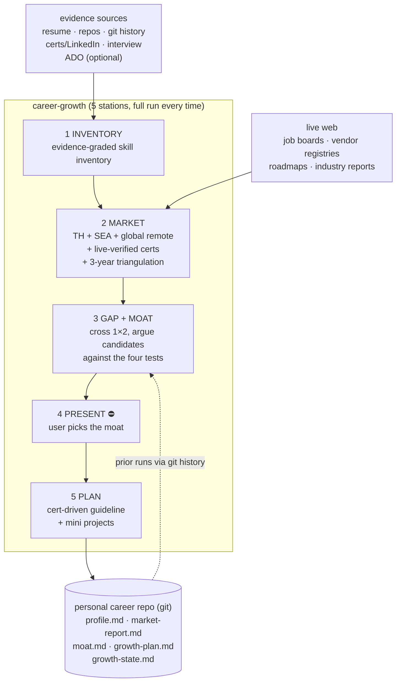
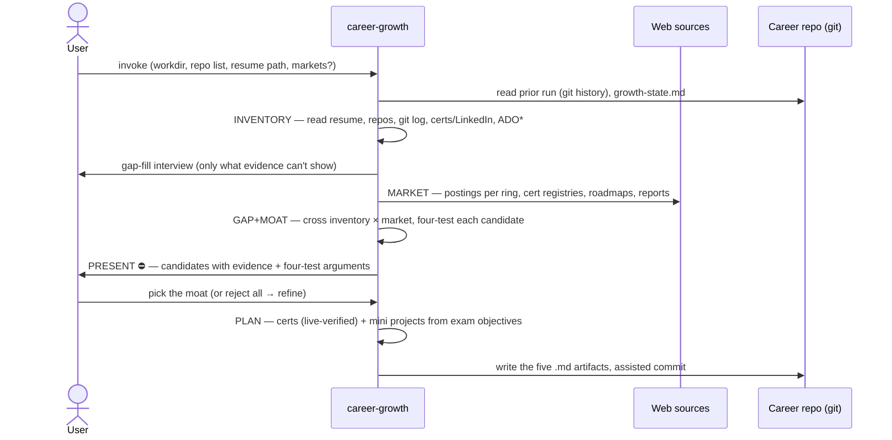
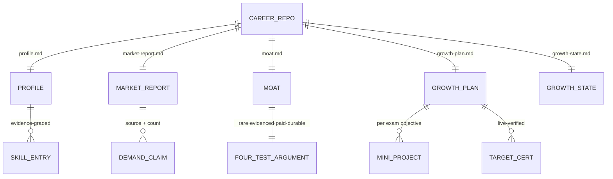

# career-growth — design spec

> ⚠️ **SUPERSEDED IN PART.** This spec's `paid` test ("demand verified by real
> market signals") is weaker than what the skill now runs. Since
> [ADR 0174](../../adr/workflow-daily-work-0174-the-paid-test-requires-breadth-and-a-moat-sits-on-a-common-core.md) `paid` also requires **breadth** — a floor of
> distinct employers across at least two rings — and every moat candidate is shaped
> as a **broad core plus a rare edge**, with the core named. The four tests, the
> five stations and everything else here still hold; the skill wins over this
> document where they differ.

- **Date:** 2026-07-31
- **Status:** Draft for review
- **ADRs:** 0043–0052
- **Plugin:** `dev-workflows`

## 1. Goal

A reusable skill that turns a person's real evidence and live market data into a
defensible career direction — a **moat** — and a concrete, cert-driven plan to
build it, re-runnable as the market moves, with a ≥3-year outlook. The owner's own
career run is the first execution and acceptance test (ADR 0043).

**Moat** (ADR 0044, CONTEXT.md): a skill combination passing **all four tests** —
(1) *rare* in the target market, (2) *evidenced* by tangible public proof,
(3) *paid* per verified market signals, (4) *durable* ≥3 years against
AI/automation. Every recommendation must argue all four; failing one disqualifies
it as moat material.

## 2. Scope

- **In:** the five-station pipeline below; the personal career repo it maintains;
  one PLAYBOOK row; a thin command wrapper `/dev-workflows:career-growth`.
- **Out:** automation/scheduling (re-runs are user-initiated, ADR 0050); scraping
  sources that block automated fetch; any writing to job sites or LinkedIn;
  storing personal data inside the marketplace (ADR 0043).

## 3. Pipeline

Five stations, in order, full run every time (ADRs 0045, 0050). PRESENT is a hard
approval gate: nothing downstream runs until the user explicitly picks a moat.

\* ADO only when `ado-backlog` is installed (soft dependency, ADR 0046).

### 3.1 INVENTORY (ADR 0046)

Builds `profile.md` from five evidence sources:

| # | Source | How |
|---|--------|-----|
| 1 | Resume | user-provided file path |
| 2 | Repos + cross-repo git history | user lists repo roots; skill scans commits for what was built, how recently, how often |
| 3 | Held certificates + LinkedIn | user-pasted/exported — never scraped |
| 4 | Gap-fill interview | short, targeted; only what evidence cannot show (non-git work, soft skills, languages, domain knowledge); pre-filled from the previous `profile.md` so the user corrects rather than re-answers (ADR 0050) |
| 5 | ADO work items | via `ado-backlog` **if installed**; detect → use → else skip with a notice |

Every inventory entry records which source(s) attest it; resume-only claims are
flagged **unverified**, and the GAP+MOAT station weights verified skills higher.

### 3.2 MARKET (ADRs 0047, 0048)

Surveys three default rings — **Thailand, SEA (incl. Singapore), global remote** —
per-run overridable. Produces `market-report.md`. Three non-negotiable evidence
rules:

1. **Certificates are live-verified** against the vendor's retirement/lifecycle
   registry at run time (for Microsoft: `credentials/support/retired-certification-exams`
   + `credential-retirement` + the study guide's own banner). Model memory is
   never a source for cert existence, exam codes, or lifecycle.
2. **Job data only from boards that serve automated fetch**; on a 403 try
   alternates before reporting a metric unavailable. Every demand claim carries
   source + posting count.
3. **The 3-year outlook is triangulated** from ≥3 signal types: vendor roadmaps,
   industry/developer-survey reports, posting-trend deltas vs prior runs (via the
   career repo's git history), plus an explicit per-skill AI-absorption
   assessment feeding four-test #4.

Per-ring effort is bounded (fixed source list per ring) so MARKET stays a
single-session stage.

### 3.3 GAP + MOAT

Crosses INVENTORY × MARKET. Emits moat **candidates**, each with: the skill
combination, the gap (what's missing vs what the person has), and a four-line
four-test argument. Anything failing a test may appear only as a labeled
*supporting skill*, never a moat candidate.

### 3.4 PRESENT ⛔ (ADR 0045)

Presents candidates with their evidence and arguments; the **user picks the moat**
(or rejects all, sending the skill back to refine). The choice is recorded in
`moat.md`. This mirrors the marketplace's approval-gate precedent: the skill never
self-selects a career path.

### 3.5 PLAN (ADR 0051)

Cert-driven: selects target certificates for the chosen moat (live-verified,
rule 1), then designs each **mini project backwards from that cert's exam
objectives** — the project exists to build the knowledge the exam tests; passing
the exam is the milestone. The skill **offers** to publish each project to a
public repo when content allows (no org data) — opportunistic second evidence,
never required. Moat components with no matching cert get an explicit non-cert
milestone (a shipped artifact or delivered work). Output: `growth-plan.md` +
updated `growth-state.md` (progress, suggested next review — default quarterly).

## 4. Data — the personal career repo (ADR 0049)

All personal artifacts live in a user-chosen git repo outside the marketplace;
the skill offers `git init` on first run; commits are assisted, never automatic.

Files are overwritten each run; git history holds prior rounds, giving trend
deltas via `git log`/`git diff`. All `.md` outputs are document-skill artifacts —
the diagram convention applies to them.

## 5. Re-run behavior (ADR 0050)

Every run executes all five stations — no delta mode, no skipped station. Prior
outputs inform the run only as *inputs* (interview pre-fill, trend deltas).
Re-runs are user-initiated; the skill records a suggested next-review-due
(default quarterly) in `growth-state.md` but never schedules itself
(harness-neutral).

## 6. Marketplace integration (ADR 0052)

- **Home:** `plugins/dev-workflows/skills/career-growth/SKILL.md` — frontmatter
  `name` + trigger-rich `description` (triggers: career review, skill gap,
  certificate plan, job market, moat, "พัฒนาสกิลตัวเอง", quarterly career
  check…).
- **Command:** `plugins/dev-workflows/commands/career-growth.md` — thin wrapper
  (`description` + `argument-hint`), hands off via `$ARGUMENTS`, per the
  `daily.md` precedent.
- **PLAYBOOK:** one WORKING-router row — "planning my own growth / quarterly
  career review → career-growth" — same commit as the skill.
- **Harness-neutral wording** throughout SKILL.md (Claude Code + Antigravity);
  any bundled file referenced via the three rewritable `${CLAUDE_PLUGIN_ROOT}`
  shapes only.
- **Version sync:** bump `dev-workflows` `plugin.json` + `marketplace.json`
  together.
- **CONTEXT.md:** the **Moat** term is already added (this session).

## 7. Failure & degradation

| Situation | Behavior |
|---|---|
| Job board blocks fetch (403) | try alternate boards; only then report the metric unavailable (gotcha 2026-07-31) |
| Vendor registry unreachable | cert recommendations are withheld, never guessed from memory |
| `ado-backlog` absent | ADO source skipped with an explicit notice |
| Offline run | degrade to INVENTORY-only value; MARKET and PLAN refuse to fabricate |
| User rejects all moat candidates | loop back to GAP+MOAT with the user's objections as constraints |

## 8. Open items deferred to the implementation plan

- `growth-state.md` exact schema (mirrors the `daily-state-contract.md` style).
- The fixed per-ring source list for MARKET (which boards/reports per ring).
- Interview question bank for INVENTORY gap-fill.
- SKILL.md step wording + reference-file split (if any).
