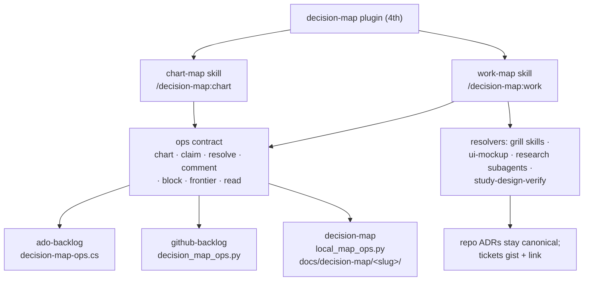
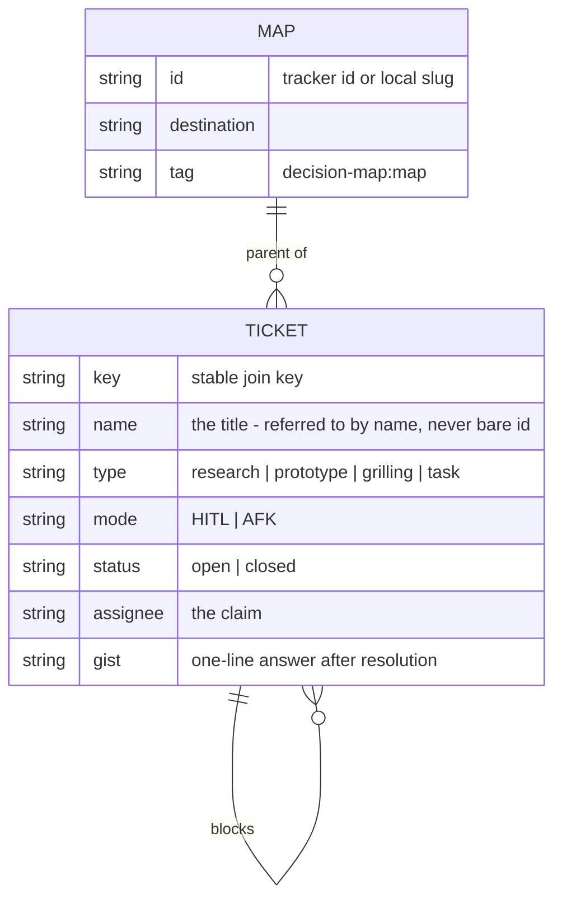
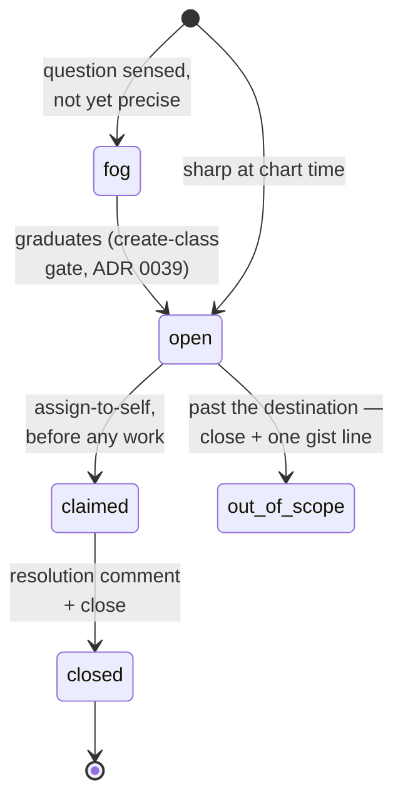
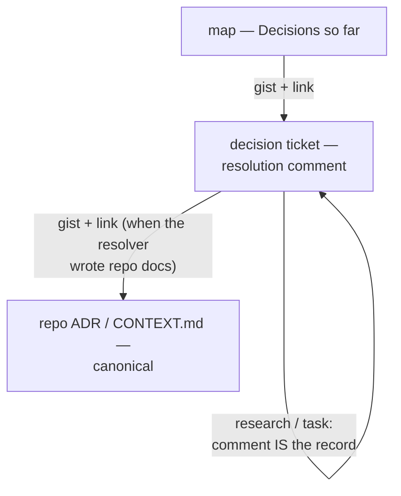
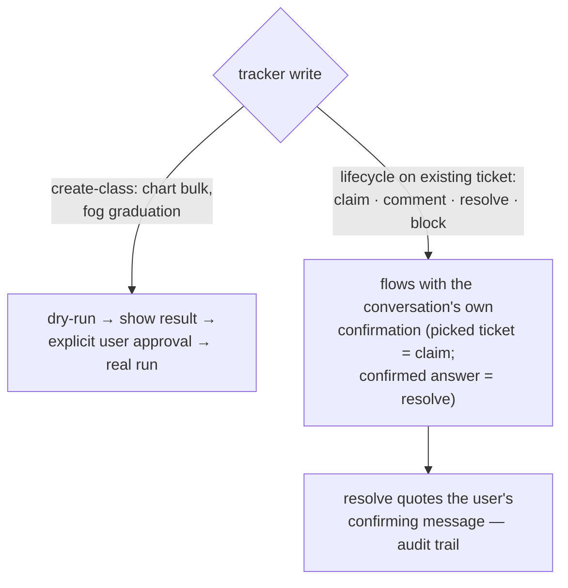
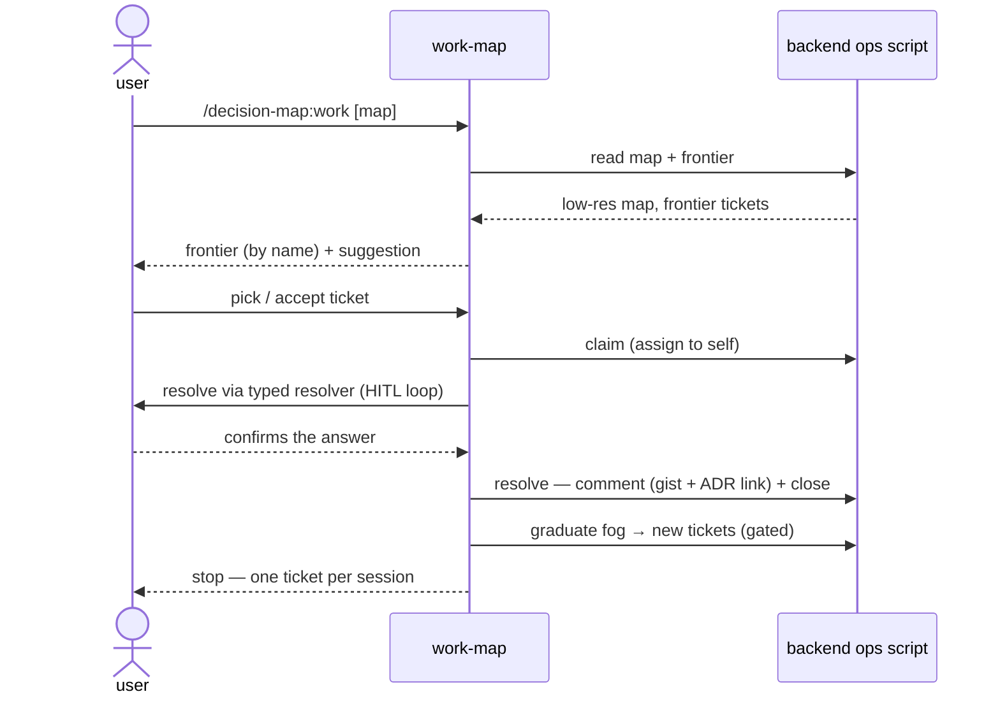

# decision-map — design spec

> ⚠️ **SUPERSEDED IN PART — historical design record, not the current
> behaviour.** This is the spec as approved on 2026-07-31; implementation and
> five review rounds changed three things it still describes. For what the
> tool actually does, read
> [`plugins/decision-map/references/data-contracts.md`](../../../plugins/decision-map/references/data-contracts.md)
> and the two skills — the contract wins over this document everywhere.
>
> | This spec says | Actually |
> |---|---|
> | "three backends at full parity" | **v1 ships the local Markdown backend only.** ADO and GitHub are deferred to phase 2; the ops contract is written so they can be added without changing it ([ADR 0059](../../adr/0059-v1-ships-local-backend-only-tracker-backends-deferred.md)) |
> | offer the tracker install command when a tracker is wanted | **Never offer it.** Both skills forbid it — say decision-map cannot do that yet and stop |
> | `chart` creates a map once | **`chart` is additive**: it creates only what is absent, unions fog / out-of-scope lines, and unions a new `blockedBy` edge into an existing ticket, leaving everything else untouched ([ADR 0057](../../adr/0057-chart-is-additive-so-fog-graduation-needs-no-new-subcommand.md), [ADR 0058](../../adr/0058-additive-chart-unions-blocked-by-on-existing-tickets.md)) |
>
> The resolution format shown here is also pre-marker; `resolve` now writes a
> sentinel-delimited region. See the contract's "Generated regions" section.

- **Date:** 2026-07-31
- **Status:** Approved and implemented, then partly superseded — see the banner above
- **Decisions recorded:** ADRs [0033](../../adr/0033-decision-map-as-fourth-plugin.md) ·
  [0034](../../adr/0034-fourth-plugin-named-decision-map.md) ·
  [0035](../../adr/0035-decision-map-v1-supports-both-trackers-plus-local-fallback.md) ·
  [0036](../../adr/0036-decision-ticket-gists-repo-adr-is-canonical.md) ·
  [0037](../../adr/0037-decision-map-uniform-ops-script-contract.md) ·
  [0038](../../adr/0038-ticket-types-map-to-arc-skills-research-light-with-escalation.md) ·
  [0039](../../adr/0039-decision-map-gates-create-class-writes-only.md) ·
  [0040](../../adr/0040-frontier-view-lives-in-decision-map-only.md) ·
  [0041](../../adr/0041-one-ticket-per-session-discipline-adopted-verbatim.md) ·
  [0042](../../adr/0042-local-map-lives-in-docs-decision-map-folder.md)
- **Upstream credit:** adapts the `wayfinder` skill (mattpocock/skills) to this
  marketplace's plugins, trackers, and safety gates.



## 1. Purpose

An effort **too big for one agent session** — the way to its destination not yet
visible — gets charted as a **Decision map**: one tracker item indexing the effort,
with child **Decision tickets** (questions whose resolution is a *decision*, not a
build slice), resolved one session at a time until nothing is left to decide. The
plugin **plans, it doesn't do**: when the map is clear, it hands off to the normal
build flow (`superpowers:writing-plans` → execution). Every arc skill today is
single-session-sized; this is the missing pre-router above them.

## 2. Placement & structure (ADRs 0033, 0034)

A **new, fourth plugin** `decision-map` in `.claude-plugin/marketplace.json`.

```
plugins/decision-map/
  .claude-plugin/plugin.json      version — keep in sync with marketplace.json
  skills/chart-map/SKILL.md       mode 1: name destination, map frontier, create
  skills/work-map/SKILL.md        mode 2: load map, claim ticket, resolve, graduate
  commands/chart.md               → /decision-map:chart (thin, hands off to skill)
  commands/work.md                → /decision-map:work
  scripts/local_map_ops.py        local-markdown backend (ADR 0042)
  references/data-contracts.md    map.json + map/ticket body formats (single source)
  README.md                       user docs + upstream credit
```

Both skills open with a **Step-0 preflight** (the grill-then-plan pattern): detect
an installed backend — `ado-backlog`, `github-backlog`, or neither (local
fallback) — harness-neutrally via skill availability first, registry second. A
missing-but-wanted backend gets the install command offered; the session never
starts if it cannot finish. Ticket resolution happens under the resolver skills, so
`chart-map`/`work-map` themselves stay tracker-thin.

Conventions inherited: `${CLAUDE_PLUGIN_ROOT}` only in installer-rewritable shapes;
harness-neutral wording (actions, not tool names); **one PLAYBOOK row per skill in
the same commit** (ADR 0001); versions in `plugin.json` and `marketplace.json`
match.

## 3. Backends & the ops contract (ADRs 0035, 0037)

v1 ships **three backends at full parity**. Each implements the same subcommand
contract in one executable owned by the plugin that owns that backend; the flow
skills never touch a tracker API directly.

| Subcommand | Meaning | ADO (`decision-map-ops.cs`) | GitHub (`decision_map_ops.py`) | Local (`local_map_ops.py`) |
|---|---|---|---|---|
| `chart` | bulk-create map + tickets (+ parent links), **dry-run default** | reuse `BuildPatch` JSON-patch + `Hierarchy-Reverse` + `validateOnly=true` (all exist in `create-backlog.cs`) | create issues + labels; native **sub-issues** where available, else Tracking-Issue task list | write `map.md` + `tickets/*.md` |
| `claim` | assign ticket to self | PATCH `System.AssignedTo` | `gh issue edit --add-assignee @me` | frontmatter `assignee:` |
| `resolve` | resolution comment + close | POST `/wit/workItems/{id}/comments` + PATCH `System.State` | `gh issue comment` + `gh issue close` | append answer + `status: closed` |
| `comment` | plain comment | comments API | `gh issue comment` | append section |
| `block` | dependency edge | `System.LinkTypes.Dependency-Forward/Reverse` | native "blocked by" where the plan supports it, else `blocked-by: #N` body convention (label the weaker mode in output) | frontmatter `blocks:` |
| `frontier` | open + unblocked + unclaimed children | `WorkItemLinks` WIQL (Hierarchy-Forward from map) + relations pass for open predecessors | `gh issue list --state open --no-assignee --label decision-map:ticket` + dependency check | scan frontmatter |
| `read` | map + optional ticket zoom | fetch map item + children batch | `gh issue view` | read files |

**Verified against the code (Step 5a):** `create-backlog.cs` has `BuildPatch`
(line 176), `Hierarchy-Reverse` (197), `validateOnly=true` (219), create-time
`System.AssignedTo`; `my-work.cs`'s WIQL is hardcoded to `@Me` (55) — the frontier
query is genuinely new; **no** dependency links, comments, or state transitions
exist anywhere in either plugin's scripts today. All of `claim/resolve/comment/
block/frontier` are new code on both tracker backends.

Shapes are defined **once** in `plugins/decision-map/references/data-contracts.md`:



The tracker (or the local files) stays the source of truth; any `map.json` the
scripts exchange is a working file, never a store.

## 4. The map and its tickets

**Map body** (upstream-verbatim sections): `## Destination` (one or two lines —
every session orients to it first) · `## Notes` (domain, skills to consult,
standing preferences) · `## Decisions so far` (index: one line + link per closed
ticket) · `## Not yet specified` (fog: in-scope questions not yet sharp enough to
ticket — *ticket when you can state the question precisely; fog when you can't*) ·
`## Out of scope` (consciously ruled out; never graduates; mis-scoped tickets get
closed and one gist line here).

Tracker-hosted map bodies are **channel-like** — no Mermaid (ADO/GitHub boards
don't render it usefully); the local `map.md` is a generated Markdown document and
follows the diagram convention (one small overview diagram).

**Ticket lifecycle:**



**Refer by name**: everything the human reads uses ticket *names* (the title
wrapping its link) — never bare `#42` walls.

## 5. Ticket types → resolvers (ADR 0038)

| Type | Mode | Resolver |
|---|---|---|
| grilling (default) | HITL | `grill-with-docs` / `grill-then-plan`; fix-shaped tickets inherit ADR 0003/0011 — debug-mantra verifies the cause first |
| prototype | HITL | ui-mockup mechanism (DesignSync per ADR 0032; Artifact / `.html` fallbacks) |
| research | AFK | light research subagents fired in parallel at chart time; findings → resolution comment; **escalate to `study-design-verify`** when the answer must be grounded in a live system |
| task | HITL/AFK | agent executes where it can, else hands a precise checklist |

A HITL ticket resolves **only** through live human exchange — an agent that answers
its own grilling questions has broken the type. Research is the one exception to
one-ticket-per-session.

## 6. Where a decision lives (ADR 0036)



Resolver skills keep their inline-ADR habits unchanged; the ticket comment quotes
the answer in one or two lines and links the ADR/commit, never restating it.

## 7. Safety gates (ADR 0039)



Every ops subcommand still supports `--dry-run` for diagnostics; the tier decides
when a *dialog* is required, not what the scripts can do.

## 8. Daily-arc integration (ADR 0040)

- WORK-router branch: *"work too big for one session"* → `decision-map` (chart if
  no map, work if one exists). Never a sixth station (ADR 0004).
- The **frontier view** renders inside `work-map` at session start. `my-work` is
  untouched — a claimed ticket appears there naturally because it is assigned.
- `daily-state.md` may name the claimed ticket as its focus line; the map remains
  the effort's source of truth (replay, don't re-derive).
- PLAYBOOK gains two rows (chart-map, work-map) in the same commit as the skills.

## 9. Invocation & session discipline (ADR 0041)

**Chart** (`/decision-map:chart`, loose idea in hand): name the destination
(grilling, HITL) → grill **breadth-first** to surface fog and first tickets → *no
fog? stop — the effort fits one session, don't map it* → create map + tickets
(create-then-wire blocking edges in a second pass; gate per ADR 0039) → fire
research subagents in parallel → stop. Charting hand-resolves nothing.

**Work** (`/decision-map:work`, map in hand):



Concurrent sessions are expected: claim-first makes them skip each other's work.

## 10. Out of scope

- The four small wayfinder-inspired edits to `grill-then-plan` / `grill-with-docs`
  (destination-first, parked questions, out-of-scope recap section, HITL guard) —
  a separate, smaller change.
- Execution/build tickets — the map plans; building happens after handoff.
- Any change to `my-work`, `/daily start`, or the backlog pipeline contracts.

## 11. Not yet specified (fog for the planning phase)

- Exact `WorkItemLinks` WIQL for the ADO frontier (MODE, predecessor filter).
- Detecting whether the target GitHub plan supports native sub-issues /
  dependencies (probe vs config).
- `map.json` field-level schema (drafted at implementation into
  `references/data-contracts.md`).
- Local-backend concurrency (two sessions editing `tickets/*.md` — likely
  git-conflict-as-signal, to be confirmed while planning).

## 12. Build inventory (for writing-plans)

| Where | What |
|---|---|
| `plugins/decision-map/` | plugin manifest, 2 skills, 2 commands, local ops script, data-contracts reference, README |
| `plugins/ado-backlog/scripts/` | new `decision-map-ops.cs` (reuses auth + `BuildPatch` patterns) |
| `plugins/github-backlog/scripts/` | new `decision_map_ops.py` (wraps `gh` + REST/GraphQL sub-issues) |
| `.claude-plugin/marketplace.json` | add the plugin |
| `PLAYBOOK.md` | WORK-router branch + two rows |
| `CONTEXT.md` | done — Decision map / Decision ticket / HITL-AFK terms |
| `docs/adr/` | done — ADRs 0033–0042 |
