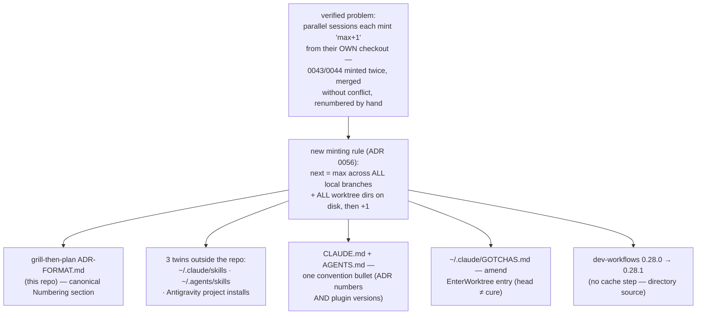
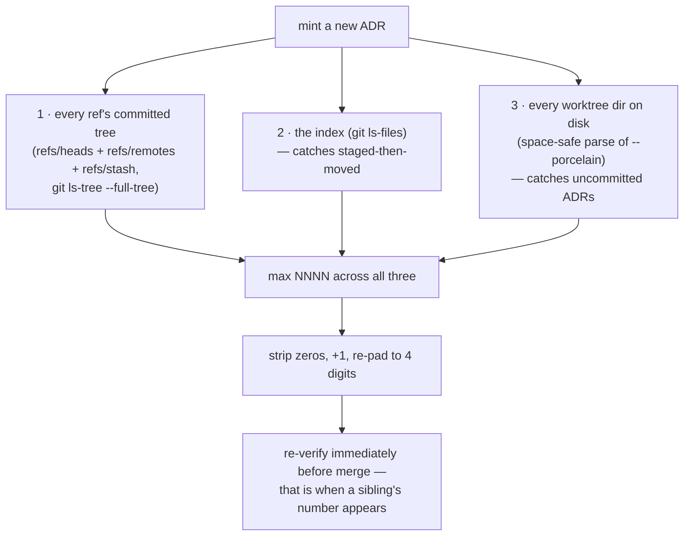

# ADR minting: global scan across branches and worktrees — design

> ⚠️ **SUPERSEDED IN PART — the decision holds, the wording and the change list do
> not.** This is the spec as approved on 2026-08-01; a verification pass before
> implementation changed three things it still describes. For what the rule actually
> says, read the **Numbering** section of
> [`plugins/dev-workflows/skills/grill-then-plan/ADR-FORMAT.md`](../../../plugins/dev-workflows/skills/grill-then-plan/ADR-FORMAT.md)
> — that file is canonical and this document must never hold a second copy of it.
>
> | This spec says | Actually |
> |---|---|
> | scan `refs/heads` + worktree dirs, "then increment by one" | **Three sources** (`refs/heads refs/remotes refs/stash`, the index, worktree dirs) with `--full-tree`, a space-safe worktree parse, and base-10 re-padded arithmetic. The original text returned wrong numbers *silently* from a subdirectory, contributed zero from the worktree pass on any path containing a space, and errored on `$((0059+1))` |
> | hot-patch the `0.25.8` plugin cache (row 6) | **Dropped — the step is wrong, not merely redundant.** `known_marketplaces.json` records `installLocation` = the repo itself; the cache is the runtime's own copy (`autoUpdate: true`) and does not track repo edits |
> | bump dev-workflows `0.27.1 → 0.27.2` (row 5) | **`0.28.0 → 0.28.1`.** The spec hard-coded a version that was already stale — itself an instance of the collision class this ADR is about |
>
> The change list also missed four live copies of the rule (two Antigravity installs,
> a Codex cache, the decision-map worktree) and `AGENTS.md`. See §Changes.

- **Date:** 2026-08-01
- **Status:** **implemented 2026-08-01** — and revised during implementation. A
  seven-agent verification pass ran the proposed rule against this repo and found it
  produced silently wrong numbers three ways; §"The canonical rule text" below no
  longer holds the wording (see the banner).
- **Decision record:** [ADR 0056](../../adr/0056-adr-numbers-minted-from-global-max-across-branches-and-worktrees.md)
- **Origin:** debug session (debug-mantra) that verified the root cause of duplicate
  ADR numbers 0043/0044 — see Context below.

## Context — the verified failure

Two sessions ran in parallel on divergent lines of history:

- `main` (career-growth session) minted ADRs **0043–0053** (commits `82660fb`,
  `0a71de9`, `7667378`).
- `worktree-decision-map` (decision-map session, worktree created *from local head*
  — `worktree.baseRef: "head"` was already set and worked) minted **0043/0044**
  hours later (commits `426f76b`, `9712d3d`).

Both computed "highest number in `docs/adr/` + 1" from their own checkout, per the
current rule in the grilling skills' ADR-FORMAT.md. At the merge (`56e9779`) both
`0043-*` and both `0044-*` files coexisted — git sees no conflict because the
filenames differ; only the numbers collide. Commit `9472d1e` renumbered the
decision-map pair to 0054/0055 by hand.

Key falsification: `baseRef: "head"` **cannot** prevent this. It fixes staleness at
worktree *creation*; the colliding ADRs were minted on `main` *after* the worktree
already existed. The GOTCHAS.md entry that presents `baseRef: "head"` as the fix for
ADR collisions is therefore incomplete and will cause the same misdiagnosis again.

## Decision (ADR 0056)

Keep sequential numbers — they are load-bearing identity ("ADR 0044", ranges
"0005–0009") across CLAUDE.md, CONTEXT.md, README, specs, and commit messages, and
55+ existing ADRs use them. Change the *minting rule* instead. Rejected: GUID/hash
filenames (collision-free but unordered, uncitable), date-prefixed IDs (verbose
citations, mass migration or a mixed corpus).

## The canonical rule text

The canonical text lives **only** in the `## Numbering` section of
[`plugins/dev-workflows/skills/grill-then-plan/ADR-FORMAT.md`](../../../plugins/dev-workflows/skills/grill-then-plan/ADR-FORMAT.md),
replicated byte-identically into the twins outside this repo. It is deliberately
*not* reproduced here — a design spec that carries a second copy of a rule becomes
the stale copy, which is the failure mode this repo already documents as a
convention. No new shared reference file either: grill-with-docs lives outside this
repo and could not point into the plugin.

**Three things the shipped wording does that the draft below did not**, each found by
running the draft against this repo: `--full-tree` on `ls-tree` (its pathspec is
cwd-relative, so from `plugins/ado-backlog/` the draft scanned that plugin's sequence
and returned `0003` for a root-`docs/adr` mint, at exit 0); a space-safe worktree
parse (this repo's path is `C:/Repo2/workflow daily work`, so every naive parse
truncated it and the worktree pass contributed nothing); and base-10 re-padded
arithmetic (`$((0059+1))` errors in bash, `$((0012+1))` silently yields 11).

Verified live in this repo (2026-08-01), running the *shipped* command from a
subdirectory: repo-root `docs/adr` → next `0060` (max 0059); `plugins/ado-backlog/docs/adr`
→ `0003`; `plugins/github-backlog/docs/adr` → `0004`; `plugins/dev-workflows/docs/adr`
→ `0002`; a directory that does not exist → `0001`. The PowerShell variant returns the
same five answers. The same rule applied to plugin *versions* confirms `0.28.0` as the
global max across 14 refs and 2 worktrees, so this change ships `0.28.1`.

## Changes, file by file

| # | File | Change | Done |
|---|------|--------|:----:|
| 1 | `plugins/dev-workflows/skills/grill-then-plan/ADR-FORMAT.md` | Canonical `## Numbering` section (was line 35–37, "Scan `docs/adr/` for the highest existing number and increment by one."). Also line 3 and line 5, which hard-coded `docs/adr/` and contradicted the new per-directory framing. | ✅ |
| 2 | `~/.claude/skills/grill-with-docs/ADR-FORMAT.md` | Byte-identical `## Numbering` + the same line 3/5 edits. Outside the repo — edited in place, no commit. | ✅ |
| 3 | `~/.agents/skills/grill-with-docs/ADR-FORMAT.md` | **Not in the original list.** A third live copy — the Antigravity staged install at the home root. Same replacement. | ✅ |
| 4 | `CLAUDE.md` | One bullet at the end of `## Conventions (do not violate)` (the header is line **62**, not 59 — 59 is AGENTS.md's). Covers minted counters generally: ADR numbers *and* plugin/marketplace versions, plus the repo-specific routing (root `docs/adr/`, per-plugin dirs are older separate sequences). | ✅ |
| 5 | `AGENTS.md` | **Not in the original list.** The Codex-facing mirror of CLAUDE.md's Conventions had no numbering bullet. Same bullet added. Also fixed a pre-existing defect: rows 77–78 said `.Codex-plugin/plugin.json`, a botched harness find-replace — no such directory exists. | ✅ |
| 6 | `~/.claude/GOTCHAS.md` | Amend the `EnterWorktree` entry (line 23) to say `head` only fixes stale-at-creation and defer to the global-max entry below it. Marked `rev 2026-08-01`. | ✅ |
| 7 | `plugins/dev-workflows/.claude-plugin/plugin.json` + `.claude-plugin/marketplace.json` | Bump dev-workflows **`0.28.0 → 0.28.1`** in both files, same commit. Version derived by the new rule, not hard-coded. | ✅ |
| 8 | `docs/adr/0056-*.md` | The ADR's own rule text updated to the three-source version; Consequences record the four live copies, the 0055 hole, and the version-minting sibling case. | ✅ |
| 9 | `docs/superpowers/plans/2026-07-12-reflect-cross-project-gotchas.md` | Supersession banner — it carries the same false cache hot-patch step as a runnable command. | ✅ |
| 10 | `C:\Repo2\testskill\.agents\skills\grill-then-plan\ADR-FORMAT.md` | A fourth live copy, in an unrelated project. **Not touched** — out of this repo's remit; re-run `install-antigravity.py` against that project, or delete the stale staged skill. | ⬜ |
| 11 | `.claude/worktrees/decision-map/…/ADR-FORMAT.md` | The worktree checkout still holds the old rule. Its branch is already fully merged into `main`, so the worktree should be removed rather than patched. | ⬜ |
| ~~x~~ | ~~`~/.claude/plugins/cache/.../0.25.8/…`~~ | ~~Hot-patch the cached copy.~~ **Dropped — see below.** | ➖ |

**Why the cache step is wrong, not merely redundant.**
`~/.claude/plugins/known_marketplaces.json` records this marketplace as
`{"source": {"source": "directory", "path": "C:\\Repo2\\workflow daily work"},
"installLocation": "C:\\Repo2\\workflow daily work", "autoUpdate": true}` — the
install location *is* the working tree, so editing the repo is the deploy. The cache
is the runtime's own copy: the `0.25.8` dir carries an `.orphaned_at` marker, and a
fresh `0.28.0` dir appeared mid-session at 14:41 without one. That newer dir still
does **not** track repo edits (its `ADR-FORMAT.md` kept its 2026-06-19 mtime while the
repo's moved to 14:45), which is the point — the cache is a snapshot the runtime
manages, never the load path and never a hand-patch target. The same reasoning
retires the Codex cache at `~/.codex/plugins/cache/.../0.23.0/`: `config.toml` gives
`source_type = "local"` pointing at the same repo.

Also committed with this change: [ADR 0056](../../adr/0056-adr-numbers-minted-from-global-max-across-branches-and-worktrees.md)
and this spec.

## Out of scope

- **No renumbering of existing ADRs.** The second renumber (decision-map → 0057–0059)
  left **0055 permanently vacant**; it stays vacant. Minting is from the max, never
  from the first gap, so a hole can never become a collision — and older commits still
  cite the retired number.
- **Gitignored numbered scratch is outside the rule by construction** —
  `.superpowers/sdd/task-N-*.md` (19 files) can never be reached by a git-based scan.
  Treat pre-existing SDD scratch as stale, as the existing GOTCHAS entry already says.
- **Date-prefixed families are already immune** — `docs/superpowers/specs/` and
  `plans/` use `YYYY-MM-DD-slug.md`, so their identity is content-derived rather than
  counter-derived. They need no rule and get none.
- **Merging `worktree-decision-map` into `main`** — separate work; until then the
  new rule itself protects the 0054/0055 range.
- **`~/Downloads/custom-skill` repo** — verified it does not bundle grill-with-docs.
- **PLAYBOOK.md** — no new skill is added, so no new row (convention only requires
  rows for skills).

## Acceptance checks

1. `grep -rl "highest existing number"` over the repo, `~/.claude/skills/` and
   `~/.agents/skills/` returns only *archives* — session transcripts, `backups/`,
   `file-history/`, runtime plugin caches, and the two documents that quote the old
   rule deliberately (ADR 0056's Context and this spec). No live skill file.
2. `grep -rl 'numbering-rule v2'` lists all three in-scope copies, and their
   `## Numbering` sections hash identically after CRLF normalisation
   (verified: `6cef9134011a6168` for all three — the repo file is CRLF, both twins LF,
   so compare content, never bytes-on-disk).
3. `plugin.json` and `marketplace.json` both report `0.28.1` for dev-workflows.
4. The shipped command, run **from a subdirectory**, reports `0060` for the repo-root
   sequence and the correct independent number for each per-plugin sequence — the
   cwd-sensitivity check the original text failed.
5. CLAUDE.md **and** AGENTS.md Conventions sections both contain the bullet citing
   ADR 0056; GOTCHAS.md's `EnterWorktree` entry carries `rev 2026-08-01` and defers to
   the global-max entry rather than competing with it.
6. No *instructional* file in the repo tells anyone to hand-patch a
   `workflow-daily-work` plugin cache. Two surviving `plugins/cache` mentions are
   legitimate and were checked by hand: `grill-then-plan/SKILL.md` reads the
   `claude-plugins-official` cache to *detect* whether superpowers is installed (that
   marketplace is a github source, where the cache is real), and
   `plans/2026-06-02-grill-then-plan-skill.md` copies between two `~/.claude/skills/`
   directories, not a cache.
