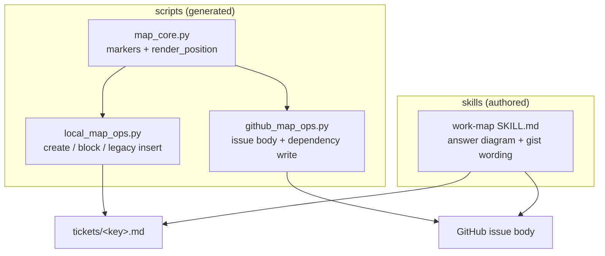
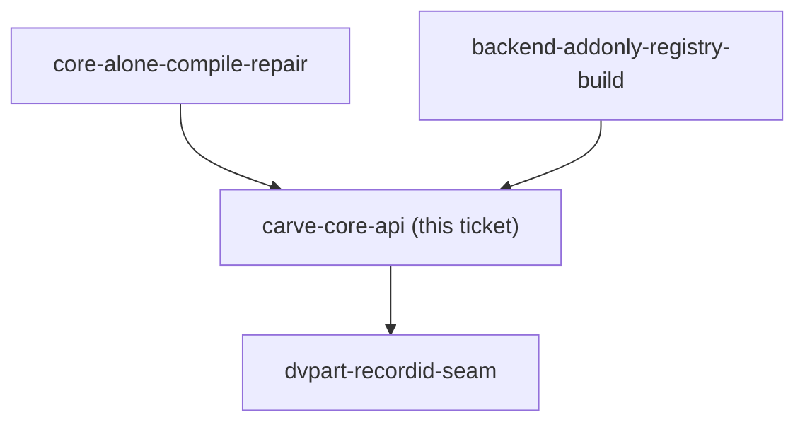
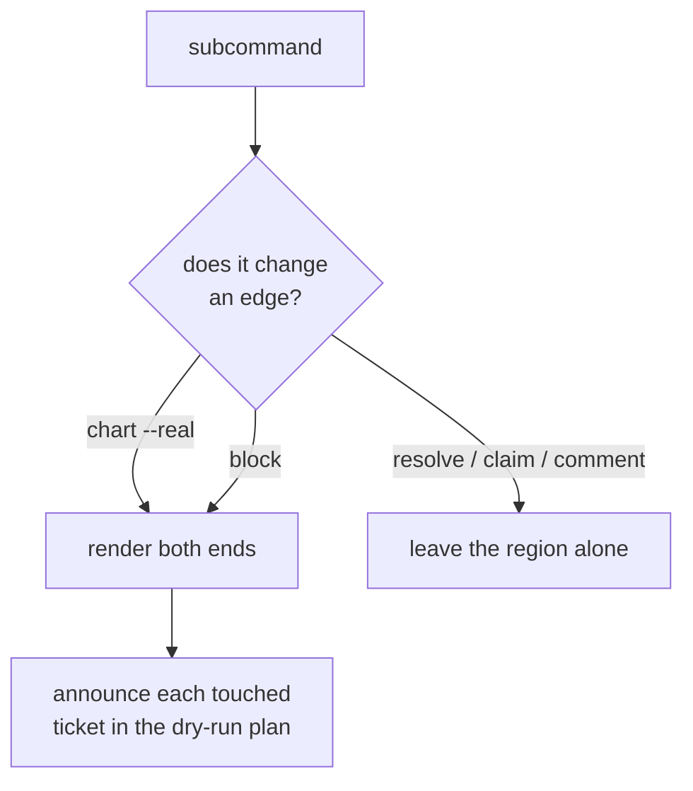

# Decision-map diagrams — design

Every Decision ticket gains two Mermaid diagrams: one **position diagram**
generated by the ops scripts, showing the ticket's immediate neighbourhood, and
one **answer diagram** authored by the agent into the resolution, showing what
the decision changed. The map document is untouched.

Decisions behind this design: [ADR 0063](../../adr/0063-ticket-position-diagram-is-a-generated-region.md),
[ADR 0064](../../adr/0064-the-position-diagram-shows-structure-only-never-status.md),
[ADR 0065](../../adr/0065-the-resolution-carries-a-diagram-of-the-answer.md),
[ADR 0066](../../adr/0066-an-over-long-gist-warns-it-does-not-fail-the-resolve.md).

## Problem

A resolved Decision ticket is correct, complete and unreadable. The worked
example is `dashboard-summary-field-ownership` on the GlassHull map: a 470-word
single-paragraph `gist`, reproduced verbatim twice in the same file, ahead of a
well-structured resolution nobody reaches. Nothing in the artifact shows the
shape of the answer, and nothing shows where the ticket sits among the other
twenty-three.

Two separate gaps, needing different mechanisms: *where does this ticket sit* is
derivable from data the scripts already hold, so a script generates it; *what did
we decide* exists only in the agent's head at resolve time, so the skill
instructs it.

## 1. The position diagram

### What it renders

One `graph TD` naming three levels and no more — the ticket's blockers, itself,
and the tickets it unblocks:

Structure only. No status, no assignee, no colour — ADR 0064. A ticket with no
edges in either direction renders a single node; the region is still emitted, so
it exists on every ticket and no writer has to decide where to insert one later.

### Where it lives

A new generated region, `<!-- decision-map:graph:start -->` /
`<!-- decision-map:graph:end -->`, added to both `TICKET_REGIONS` and
`TRACKER_TICKET_REGIONS` in `map_core.py`. Registration there is what buys the
enforcement: `_save_ticket` runs `_assert_regions` on every ticket write from
every subcommand (`local_map_ops.py:206`), so the marker invariant covers the new
region without a new guard.

It sits **above `## Question`**, so a reader sees the position before the prose.

The renderer is `map_core.render_position_diagram(key, parents, children)` — one
implementation, both backends, as ADR 0062 requires of anything two backends must
not disagree about.

### When it is written

**Both ends.** An edge appears in two diagrams — as a parent in the blocked
ticket, as a child in the blocker. `block(A, B)` therefore rewrites two files.
This is the design's main cost, and it follows directly from rendering children
at all.

**Rendering either end needs the whole map.** A ticket's parents are in its own
`blocked_by`, but its children are every ticket whose `blocked_by` names it, so
the renderer needs the full ticket set. On the local backend `block()` grows from
two file reads to an `_all_tickets` scan plus one load each. On GitHub it is
free — the snapshot GraphQL query already returns every child with its dependency
edges.

**Legacy tickets.** A ticket created before this change carries no `graph`
markers. Insert a fresh region rather than guessing at the boundary of existing
content — the same conservative choice `_reindex_decisions` already makes for
pre-region maps (`local_map_ops.py:534-542`).

## 2. The answer diagram

One Mermaid diagram opening every `--body-file` resolution, depicting **the
answer**: the structure the decision creates. Not the options weighed, not the
process followed (ADR 0065).

Type-matched to the ticket's own `type`, so no new vocabulary is introduced:

| ticket `type` | diagram | what it shows |
|---|---|---|
| `grilling` | `flowchart TD` | the chosen shape and what it displaces |
| `research` | `graph TD`, or `erDiagram` for a real data model | the structure that was found |
| `prototype` | `sequenceDiagram` if the answer is a call order, else `graph TD` | the seam that was built |
| `task` | `graph TD` | before to after |

A ticket resolving with `--link` alone still draws one. It does not duplicate the
ADR's Rule 3 diagram, because the subjects differ: the ADR draws *chosen versus
rejected*, the ticket draws *what the chosen answer changes*.

Enforced in `work-map`'s SKILL.md Step 4, not in the scripts. The scripts never
see the answer — only the string handed to them — so the rule lives with the
author.

## 3. The gist warning

`resolve` prints one stderr line when the flattened `gist` exceeds the length a
single index line can carry, and writes it regardless (ADR 0066). `work-map`
Step 4's wording is sharpened in the same change: *one sentence, not one
paragraph.* Exit 2 was rejected — it would discard a resolved decision to enforce
a formatting rule, against Step 4's own instruction that the answer lands in the
same turn.

Threshold: 200 characters, roughly the longest gist that still reads as one line
in the map index. It is a warning, so the number is cheap to revise.

## 4. Explicitly not in scope

- **A map-wide blocking graph.** Considered and dropped: a map may legally hold
  100 tickets, and even the 24-ticket GlassHull map renders far past Rule 1's
  ~15-node guidance. The map's existing three-node prologue diagram stays exactly
  as it is.
- **Status or assignee in any generated diagram** — ADR 0064.
- **Rewriting the twenty-three existing over-long gists** on the GlassHull map.
  That is a data cleanup in another repo, not a change to this plugin.

## 5. Contract and test changes

These record the current behaviour and will state something false the moment the
code changes.

`references/data-contracts.md`:

- the `tickets/<slug>.md` format gains the `graph` region
- "Generated regions in local files" says **Four spans**; it becomes five
- the additive guarantee's wording — *a ticket gaining an edge changes exactly
  one line* — becomes *one frontmatter line plus its graph region*, with the real
  guarantee (nothing removed, reordered or overwritten; an identical re-run is
  byte-identical) restated unchanged
- the `merge` detail vocabulary gains the blocker-end entry
- the shared-marker list (`key`, `gist`, `fog`, `scope`, `decisions`) gains
  `graph`

Tests in `test_local_map_ops.py`:

| test | what happens |
|---|---|
| `test_additive_chart_unions_a_new_edge_into_an_existing_ticket` (`:936`) | **updated, not deleted.** Its line-count and exactly-one-line assertions are wrong by design now, and its "every other ticket is byte-identical" assertion must permit the blocker end. It keeps asserting that claim, comment and resolution survive. |
| `test_rechart_identical_input_is_a_byte_identical_no_op` (`:845`) | **must keep passing unchanged** — identical input renders an identical diagram. This is the regression that catches a non-deterministic renderer. |
| new | node and edge ordering is deterministic (key-ascending, as everything else in this contract is), or the no-op guarantee breaks silently |
| new | a ticket with no edges renders a single-node region |
| new | the legacy insert path adds a region to a ticket that predates it |

## 6. Risks

- **Diagram determinism is load-bearing.** Any ordering that depends on
  filesystem or API order breaks the byte-identical no-op, which is the property
  that makes a partially-failed `chart` resumable. Sort by key.
- **A key is user-authored text inside a node label.** It matches
  `[A-Za-z0-9][A-Za-z0-9_-]*` so it cannot break a Mermaid label, but the label
  must still be quoted — and titles must not be used as node labels unless
  escaped, because a title is free text.
- **Two backends, one renderer.** Implemented per backend rather than in
  `map_core`, the two drift on the first change. The `_MAP_DIAGRAM` constant
  duplicated in both files today is the precedent for exactly that drift.
