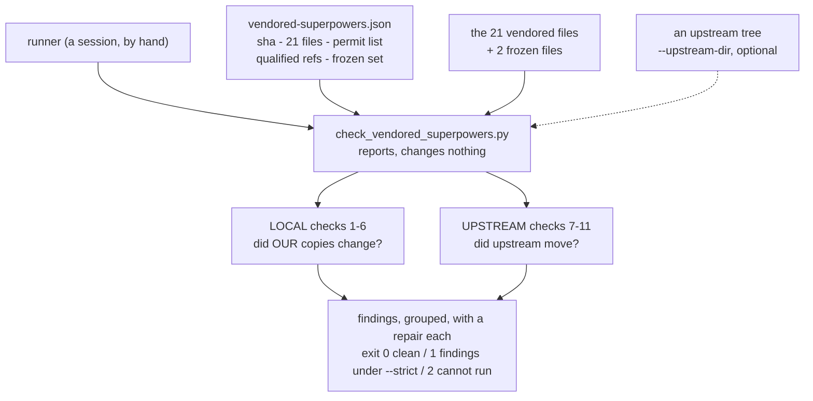
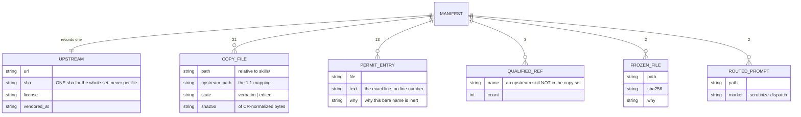
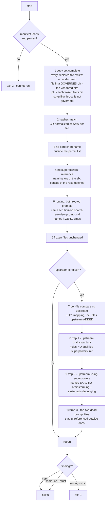
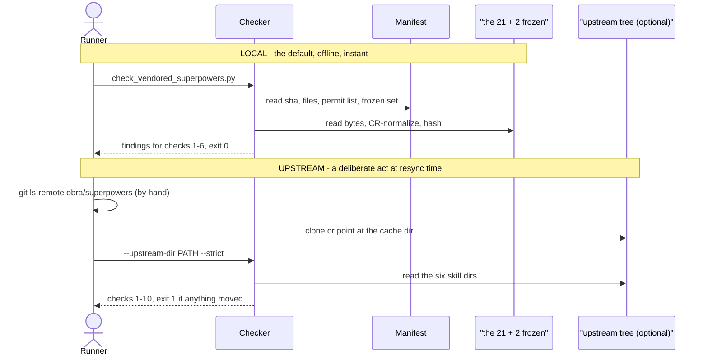

# The vendored-superpowers resync checker — design

- **Date:** 2026-08-16
- **Status:** Approved design, ready for `sp-writing-plans`
- **Implements:** [ADR 0075](../../adr/0075-resync-is-a-checker-script-and-one-recorded-sha.md)
- **Decisions taken while designing it:** [ADR 0085](../../adr/0085-the-vendoring-manifest-is-json-under-references-not-yaml-beside-the-copies.md)
  (manifest is JSON under `references/`),
  [ADR 0086](../../adr/0086-every-hash-and-comparison-strips-cr-first.md) (CR-normalize
  everything), [ADR 0087](../../adr/0087-the-permit-list-records-each-line-verbatim-not-a-rule-per-category.md)
  (permit list is verbatim lines),
  [ADR 0088](../../adr/0088-the-checker-also-guards-the-frozen-scrutinize-skill.md)
  (the frozen set)

## Why this exists

Task 7 of the routing plan deleted all four `scripts/assert_*.py` harnesses. They were
temporary. **Nothing mechanically guards the 21 vendored files today.**

That gap is not theoretical. A Critical defect — a bare upstream Skill name inside a copy —
survived seven task gates, two fix rounds, a scoped re-review and a passing acceptance
probe. `sp-brainstorming` said *"writing-plans is the next step"*, which resolves to the
**unvendored** upstream Skill with no error message. Every assertion missed it because
every assertion was derived from the plan's prose, and the prose carried the blind spot.
ADR 0071 had the correct failing test written in it the whole time, and nothing ran it.

This checker runs it.

## Scope

**In:** the program, its manifest, its test, and the resync procedure document.

**Out, unchanged:** the setup-check (ADR 0082), the three user commands (ADR 0081), arc
rewiring and the Step 0 warning (ADRs 0072 / 0080), the Antigravity install run, and the
16 unpushed commits on `main`. No hook and no CI — this repo has no `.github/workflows`,
and `--upstream-dir` is a deliberate act, not a session-start cost.

## Corrections this design carries

Four claims in the source documents were re-measured at `16de152` and are wrong. The
design follows the measurements, not the prose.

| source claim | measured | consequence for the design |
|---|---|---|
| ADR 0074: **11 of 21** working-tree files are CRLF, 10 are LF | **21 of 21** CRLF; **0 of 21** equal their own blob | hashes and diffs must CR-normalize unconditionally (ADR 0086) |
| ADR 0074: **12 verbatim / 9 edited** | **13 verbatim / 8 edited** | `re-review-prompt.md` is verbatim, as ADR 0084's amendment requires. The manifest records 13/8 |
| the handoff brief: assert **2** references to `scrutinize-dispatch` | the string appears in **4** files | 2 are routing lines in prompts; 2 are `description:` text. Only the prompts are asserted |
| ADR 0071: qualified refs are the group of **eight**, tabulated as 2 names | **3** names appear, 9 refs total | the rule is "none of the six", not "only these two". An exact-match assertion would false-fail on `using-superpowers` |

A fifth trap has no source claim at all: a glob of `skills/sp-*` collects **24** files, not
21, because `sp-grill-with-doc` carries the `sp-` prefix and is **not** a vendored copy
(ADR 0071, `CONTEXT.md`). The manifest is an explicit file list for this reason, and the
completeness check must exclude that directory by name.

## The manifest

One JSON file, `plugins/dev-workflows/references/vendored-superpowers.json`, read only by
the checker. It carries **data**; the rules that read it live in the program.

**One sha for the whole set, never per-file** (ADR 0075). A partial resync spreads the copy
set across several shas and the checker can no longer answer its only question: is this
file different because we edited it, or because upstream moved?

### Producing it without transcribing it

21 hashes and 13 exact lines cannot be hand-written — that is the failure ADR 0075 exists
to remove. The checker therefore takes `--emit-manifest`, which computes a complete
manifest from the current tree and **prints it to stdout**. The runner redirects it.

This keeps ADR 0075's *"reports and changes nothing"* property literally true: the program
writes no file under any flag. It also makes the manifest reviewable — `--emit-manifest`
piped through `diff` against the committed file is itself a check.

**The redirect must never target the manifest itself.** `--emit-manifest > the-manifest.json`
truncates that file *before* the program starts, so the hand-written keys — the upstream sha,
the routed prompt list, the frozen set, the trap config — are read as absent and silently
dropped, while the computed counts still print correctly. Emit to a temp file and move it
into place. The program also refuses with exit `2` when it finds the manifest present but
empty, so the mistake cannot be made quietly twice.

## What the checker asserts

### Check 3 in detail — the one that matters

ADR 0071's check, run verbatim: *a search for any of the six upstream short names,
unprefixed, must return nothing.* A bare name is an occurrence of `brainstorming`,
`writing-plans`, `executing-plans`, `subagent-driven-development`, `requesting-code-review`
or `receiving-code-review` **not** preceded by `superpowers:` or `sp-`.

13 such lines are legitimate today. Each is recorded verbatim (ADR 0087). Two finding
classes, because the repairs are opposite:

| class | meaning | repair |
|---|---|---|
| **NEW** | a bare name on a line not in the permit list | read it. Either a routing defect — fix the file — or legitimate, and it joins the manifest |
| **STALE** | a permit entry whose text is no longer present in its file | the line moved, was reworded or deleted. Re-confirm it is inert, then update the manifest |

The two `**Announce at start:**` entries deserve a note in the procedure document: they are
a bare short name, in quotation marks, naming a Skill — **the same textual shape as the
defect**. They are inert only because they tell the agent to *say* a name, not to *load*
one. No regex separates those two; only a reader does. That is why the permit list is
verbatim text and not a pattern.

### Check 5 in detail — routing

| file | assertion | source |
|---|---|---|
| `sp-requesting-code-review/code-reviewer.md` | contains `scrutinize-dispatch` | ADR 0074 class 1, as amended |
| `sp-subagent-driven-development/task-reviewer-prompt.md` | contains `scrutinize-dispatch` | same |
| `sp-subagent-driven-development/re-review-prompt.md` | contains it **zero** times, and is `verbatim` | ADR 0084 amendment |

The two `description:` fields that also mention `scrutinize-dispatch` are **not** asserted
here — they are permit-list entries and are covered by their files' hashes. Asserting a
raw count of 4 would couple the routing check to description wording.

## The two modes

`--upstream-dir` takes a **path**, not a URL. The program never touches the network. The
one network step — establishing whether the sha moved — stays a manual `git ls-remote` line
in the procedure document, which is where ADR 0075 already puts it. This keeps the checker
deterministic, unit-testable, and usable while offline or rate-limited, which is exactly
when a mid-resync failure would be most expensive.

The runner supplies the tree from either source: a `git clone` at the pinned sha, or the
local plugin cache. **The cache dir is not a durable anchor** — ADR 0075 records that
`b36e0829c6d0` already carries an `.orphaned_at` marker — so the checker accepts it as an
argument and never resolves it itself.

## Report format and exit codes

Follows the convention `check_doc_provenance.py` already sets in the same directory:

- **report by default** — print findings, exit `0`. Usable as a routine glance.
- **`--strict`** — exit `1` if there is any finding. This is the resync gate.
- **exit `2`** — cannot run: manifest missing or malformed, a declared file unreadable,
  `--upstream-dir` given but absent.
- stdout reconfigured to UTF-8 (`errors="replace"`) — three permitted lines carry em-dashes
  and a Windows cp1252 console would otherwise crash while printing a finding.

Every finding names the file, what is wrong, and the repair. Findings are grouped by check
so a resync can work them in order. A clean run prints one line stating what was verified,
including the counts it read from the manifest rather than any literal.

**No count is hard-coded in the program.** Not 21, not 13, not 8, not 2. Every number comes
from the manifest, so an intentional change to the copy set is a manifest edit, never a
code edit. The program asserts that the *set* matches, never that its size equals a literal.

## Test plan

Paired `plugins/dev-workflows/scripts/test_check_vendored_superpowers.py`.

**Synthetic cases** build a miniature copy set and manifest in a temp tree, so each check
can be driven to fire in isolation:

| # | case | expects |
|---|---|---|
| 1 | clean tree | no findings, exit 0 |
| 2 | a copied file edited | hash finding, naming the file |
| 3 | a bare short name added on a new line | **NEW** finding |
| 4 | a permit-list line reworded | **STALE** finding |
| 5 | the same content with CRLF instead of LF | **no** finding (ADR 0086) |
| 6 | `superpowers:writing-plans` added inside a copy | qualified-ref finding |
| 7 | `superpowers:using-git-worktrees` added | **no** finding — not in the copy set |
| 8 | the routing line removed from `code-reviewer.md` | routing finding |
| 9 | `scrutinize-dispatch` added to `re-review-prompt.md` | unrouted-violation finding |
| 10 | a frozen file changed | frozen finding |
| 11 | an undeclared file added under a vendored dir | completeness finding |
| 12 | a file added under `sp-grill-with-doc` | **no** finding — not a copy |
| 13 | manifest absent / malformed | exit 2 |
| 14 | `--strict` with findings | exit 1 |
| 15 | upstream tree with a moved `verbatim` file | check 7 finding |
| 16 | upstream `brainstorming/` gains a qualified ref | trap 1 finding |
| 17 | upstream `using-superpowers` names a third skill | trap 2 finding |
| 18 | upstream references a dead prompt file from `skills/` | trap 3 finding |
| 19 | upstream adds a file to a vendored skill dir | 1:1-mapping finding |

Review added three more after tracing the checks against their fixtures — an undeclared
file beside a frozen one, two permit entries claiming one line, and the truncated-manifest
guard — taking the suite to **22** synthetic cases plus the live one.

**One live case, and it is the regression guard:** run the checker against the real repo
tree and assert exit 0 with no findings. Case 3 driven against the real tree is the test
that would have caught Plan A's Critical.

Cases 15–19 need an upstream fixture. Build it from the real cache dir at
`b36e0829c6d0` if present, and **skip with a stated reason** if it is not, so the suite
stays green on a machine without the cache. Never silently pass.

## Files this produces

| file | what |
|---|---|
| `plugins/dev-workflows/scripts/check_vendored_superpowers.py` | new — the program |
| `plugins/dev-workflows/scripts/test_check_vendored_superpowers.py` | new — the test |
| `plugins/dev-workflows/references/vendored-superpowers.json` | new — the manifest, generated by `--emit-manifest` |
| `plugins/dev-workflows/references/resync-superpowers.md` | new — the procedure: the six rewrite classes and the three traps, **no line numbers** |
| `CONTEXT.md` | done — 4 glossary terms added |
| `docs/adr/0085…0088` | done |
| `plugins/dev-workflows/.claude-plugin/plugin.json` | version `0.38.0` → `0.39.0` |
| `.claude-plugin/marketplace.json` | same version, kept in sync |

No PLAYBOOK row: the playbook maps Skills, and this adds a script, not a Skill.

## Risks and what stays open

- **The manifest can be regenerated to hide a defect.** `--emit-manifest` after a bad edit
  produces a manifest that matches the bad edit. Mitigated only by review: the manifest is
  committed, so a regenerated one shows up as a diff. Stated here so nobody mistakes the
  checker for a gate against a determined editor — it catches accidents, not intent.
- **Nothing notices that upstream moved.** On-demand means a new version can sit unnoticed
  indefinitely. Recorded as fog on the map by ADR 0075; unchanged by this design.
- **Nothing compares `scrutinize-dispatch` against `scrutinize`** when the latter is
  improved. ADR 0088 converts that from undetected to *reported*, and no further.
- **Whether the harness accepts a bare skill literal is still unmeasured.** The routing
  check matches file text, so it is unaffected — but the procedure document must not claim
  the probe settled it.
- **`task-reviewer-prompt.md` was never driven live**; only `code-reviewer.md` was. The
  checker asserts the reference exists, not that a dispatch obeys it. That distinction
  belongs in the procedure document so a green run is not over-read.
