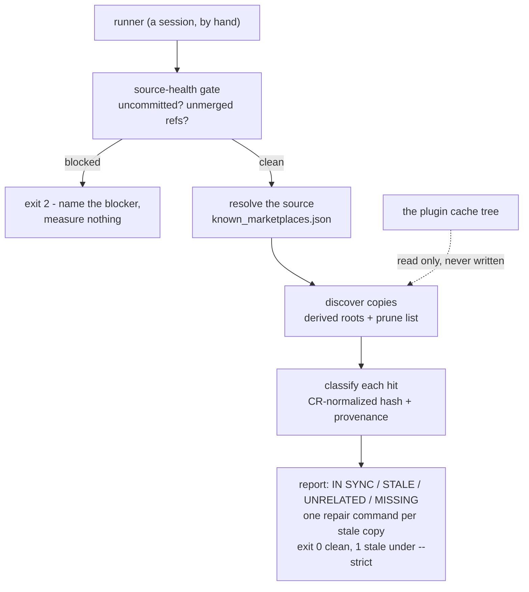

# copy-audit — find every copy of a plugin or skill, and prove which are stale

> **Superseded in part (2026-08-20, during implementation).** This spec's Mermaid
> diagram below and its verdict table both list `MISSING` as a fourth verdict.
> Implementation dropped it: on a real machine it produced 199 rows, none
> actionable, inflating the summary to "299 stale" — the rule behind it (a
> parent contributing any hit should hold every sibling skill) does not hold on
> a real machine. **The verdicts are now exactly three: `IN SYNC`, `STALE`,
> `UNRELATED`.** Two exclusions were also added that this spec does not
> describe: superseded cache-version directories (only the version the install
> manifest claims is graded) and backup snapshots under the Claude home's
> `backups` directory are both removed from grading and counted separately,
> because a report otherwise reads as missing rows rather than a deliberate
> exclusion. Finally, `PROVENANCE_MIN` shipped at **0.70**, not the 0.60 this
> spec's Classification section implies — raised during implementation once
> the git-history-fallback and the case data were both re-examined together.
> See `plugins/dev-workflows/scripts/check_plugin_copies.py` for the shipped
> behaviour and `plugins/dev-workflows/skills/copy-audit/SKILL.md` for the
> user-facing procedure.

- **Date:** 2026-08-20
- **Status:** Approved design, ready for `sp-writing-plans`
- **Decisions taken while designing it:**
  [ADR 0104](../../adr/workflow-daily-work-0104-copy-audit-reports-and-never-writes.md)
  (report-only),
  [ADR 0105](../../adr/workflow-daily-work-0105-copies-are-found-by-scanning-derived-roots-not-a-declared-manifest.md)
  (scan, not manifest),
  [ADR 0106](../../adr/workflow-daily-work-0106-a-dirty-or-behind-source-refuses-the-run.md)
  (refuse on a stale source),
  [ADR 0107](../../adr/workflow-daily-work-0107-a-copy-is-graded-by-content-provenance-never-by-name.md)
  (provenance, not name),
  [ADR 0108](../../adr/workflow-daily-work-0108-scan-roots-are-derived-from-the-marketplace-registry.md)
  (derived roots),
  [ADR 0109](../../adr/workflow-daily-work-0109-the-audit-unit-is-both-a-plugin-and-a-bare-skill.md)
  (both units)

## Why this exists

A plugin on this machine exists in more places than anyone tracks. A sweep on
2026-08-20 found **seven** copies of one plugin, of which exactly one carried the
current code. There is no tooling for this: the copies are reconciled by hand, and
they have drifted silently before.

The drift is not theoretical, and it is not limited to the plugin that prompted the
sweep. While designing this checker, one command comparing the npx-skills store against
the source found `sp-grill-with-doc` missing `effort: max` from its frontmatter — a
copy that had been running at default effort for an unknown period, on a machine whose
owner believed the two were the same file. Nothing reported it, because nothing
compared them.

Every existing signal that *looks* like it answers "is my change live?" is unsound:

- `installed_plugins.json` can name the new version, the new `installPath` and the new
  `gitCommitSha` while the cache directory it points at was never created.
- "I restarted" proves nothing about a directory outside the load path.
- A version number matching across two files proves the numbers match, not the bytes.

The only sound signal is a hash of the file itself. This checker takes that hash.

## Scope

**In:** any plugin or bare skill installed through the Claude Code plugin system, on any
machine, plus copies of it found by scanning. Both a plugin directory and a flattened
skill directory count as copies (ADR 0109).

**Out:** making any copy current. The checker reports and stops (ADR 0104). Repairing a
vendored copy is a commit in the consumer's repo, made by a person who read the report.

**Out:** installing, enabling or removing plugins. The checker never mutates the plugin
system's own state.

## Portability — the design constraint that shapes everything

The checker must run unchanged on a machine it has never seen. No path in it may name a
user, a drive, a repo or a marketplace. Everything is derived at run time from files the
plugin system maintains at fixed locations under the Claude home and the agents home.

This rules out the obvious shortcut of shipping the measured seven-copy table as
configuration. That table describes one machine on one day; the next machine has a
different one, and a stale table reports confidently about copies that do not exist.

## Source resolution

The authoritative source for a plugin is derived from the marketplace registry
(`known_marketplaces.json` under the Claude home), which records every marketplace and
how it is sourced:

| `source.source` | Where the load path is |
|---|---|
| `directory` | `source.path` — **the repo working tree itself**. Editing that tree is the deploy. |
| `github` | the marketplace clone the registry names in `installLocation` |

The `directory` case is the one that makes the cache a *snapshot* rather than a load
path, and it is why writing into the cache fakes a deployed signal while the real source
stays old.

`installed_plugins.json` is read for the *claimed* version only, and every claim it makes
is labelled as a claim in the report. It is never treated as evidence.

## The source-health gate

Before any copy is measured, the checker inspects the source. If the source resolves into
a git repository it asks two questions:

1. Are there uncommitted changes under the plugin's own paths?
2. Does any ref hold commits, touching those paths, that the checked-out branch lacks?

Either answer being yes means the source does not represent the finished work, so every
verdict downstream would be graded against the wrong baseline — copies would be reported
current when they merely match an obsolete source. The checker prints the blocker in the
terms needed to clear it (`branch <name> is <n> commits ahead - merge it first`) and exits
2 without measuring anything (ADR 0106).

`--allow-dirty-source` exists for the case where the runner has already accepted the
baseline. It prints the same blocker as a banner and continues. It is not the default,
and the report it produces is stamped as ungraded.

## Discovery

Scan roots are computed, never configured (ADR 0108):

- the parent directory of every `directory`-sourced marketplace in the registry
- the Claude home and the agents home

On the machine that prompted this design, the first rule yields the repo root that
contains the sibling checkout holding the vendored copies — without that path appearing
anywhere in the checker. `--root PATH` adds roots for a layout the rules miss; it is
additive and never replaces the derived set.

The scan walks each root for directories that contain a `SKILL.md` and whose directory
name matches a skill in the source, plus every version directory under the plugin's own
cache tree. It prunes `node_modules`, `.git`, `obj`, `bin`, `__pycache__` and `.venv`,
which is what keeps a whole-drive root affordable.

A scan finds copies nobody registered — its reason for being chosen over a declared
manifest — and it pays for that with false positives, which the next section removes.

## Classification

Every comparison is CR-normalized before hashing, following ADR 0086: git stores LF
blobs, Windows checks out CRLF, so raw bytes carry no information about whether two
files agree.

Each discovered copy is graded against the source:

| Verdict | Condition | Meaning |
|---|---|---|
| `IN SYNC` | normalized hash equal | nothing to do |
| `STALE` | differs, **and** provenance confirmed | a real copy of ours, behind |
| `UNRELATED` | differs, provenance **not** confirmed | same name, different lineage - not our problem |
| `MISSING` | source skill absent from a copy carrying its siblings | an incomplete copy |

Provenance is confirmed when the copy's non-blank lines overlap the source's by at least a
high threshold, or when the copy's hash equals a *historical* committed version of the
same source file. A name match alone never earns `STALE` (ADR 0107).

This is what makes scanning safe. Measured against real data on the design machine:

- the store's `wait-what` — hash equal, so `IN SYNC`
- the store's `sp-grill-with-doc` — differs, 100% line overlap, 79 lines against 80, so
  `STALE`, and the diff is the missing `effort: max`
- a `debug-mantra` vendored from an unrelated upstream that happens to share the name, so
  `UNRELATED`, never reported as drift

Without the provenance step the third row would be reported as a stale copy of ours and a
person would be told to "repair" a file belonging to somebody else's project.

## Report format and exit codes

One table, grouped by copy role, with the claimed version beside the measured verdict so
a manifest lying about a version is visible as a lie rather than believed. Each `STALE`
row carries the repair appropriate to its role:

- **cache** — no repair is ever offered. The row says the runtime maintains this snapshot
  and names the source edit that will refresh it.
- **vendored in another repo** — an edit-and-commit in that repo, named as such, because
  the copy is git-tracked there and a file copy would leave the consumer's tree dirty.
- **npx-skills per-agent copy** — the reinstall for that one agent, plus the standing
  warning that `npx skills update` short-circuits on the source hash without checking the
  copy, so a drifted copy is never repaired by an update.

Exit codes follow the sibling checker: 0 clean, 1 when findings exist and `--strict` was
passed, 2 when the checker cannot run — which includes the source-health refusal.

## Traps the skill must carry

Each has cost this machine real time, and the checker exists partly to stop them
recurring:

- **Never write into the plugin cache tree.** A hand-patched cache reports success
  while the real source stays old.
- **A manifest is a claim.** Hash the file named by the claim; a version directory can be
  absent while every manifest field says it exists.
- **CR-normalize before comparing.** Raw byte equality is meaningless across the LF/CRLF
  boundary.
- **Check that the agent list contains Claude Code.** `npx skills` can install for
  every other agent and report success. The array was correct on the design machine, and
  the trap re-arms on the next install, so the check stays.
- **Mint versions from refs *and* working trees.** An uncommitted bump in the checkout is
  invisible to a ref-only scan, which then mints a colliding number.
- **A pipe reports the last command's exit status.** Every command the skill hands a
  person redirects to a file and checks the bare command's code.

## Files this produces

| Path | What it is |
|---|---|
| `plugins/dev-workflows/skills/copy-audit/SKILL.md` | the procedure, harness-neutral |
| `plugins/dev-workflows/scripts/check_plugin_copies.py` | the measuring engine |
| `plugins/dev-workflows/scripts/test_check_plugin_copies.py` | tests over synthetic trees |
| `PLAYBOOK.md` | one row, same commit |
| `docs/adr/workflow-daily-work-0104...0109-*.md` | the six decisions above |

The engine is a script rather than prose in the skill because the comparison is
deterministic and must not be re-derived per run — the same reasoning that made
`check_vendored_superpowers.py` a script.

## Test plan

Tests build synthetic trees in a temp directory and point the resolver at a fabricated
registry, so no test depends on the machine it runs on. Cases:

- registry with a `directory` source resolves to the repo tree; a `github` source
  resolves to the marketplace clone
- a copy differing only by CRLF grades `IN SYNC`
- a same-named file sharing no lineage grades `UNRELATED`, not `STALE`
- a copy matching a historical version grades `STALE` with that version named
- an uncommitted change under the plugin's paths exits 2 and measures nothing
- a ref ahead of the checked-out branch exits 2 and names the branch
- `--allow-dirty-source` continues and stamps the report ungraded
- derived roots include the parent of a `directory` source and exclude everything else
- the prune list is honoured
- a cache row never carries a write repair
- `--strict` turns findings into exit 1; without it findings exit 0

## Risks and what stays open

- **Threshold choice.** The provenance overlap threshold is a judgement. Too low and an
  unrelated file grades `STALE`; too high and a heavily edited real copy grades
  `UNRELATED`. The measured cases sit at 100% and near zero, far from any plausible
  boundary, so the threshold is not load-bearing today — but a copy that legitimately
  diverges by half would sit in the gap, and the report must say which side of the
  threshold a verdict came from so the judgement is visible rather than hidden.
- **Scan cost on a large root.** The derived rules can yield a root holding many repos.
  The prune list makes this affordable in the measured case; a machine with a much larger
  root may need `--root` to narrow rather than widen.
- **`install-antigravity.py` covers `dev-workflows` only.** The checker reports copies for
  any plugin, so it will name Antigravity-shaped copies of plugins the installer does not
  handle. That asymmetry is stated in the report, not silently resolved.
