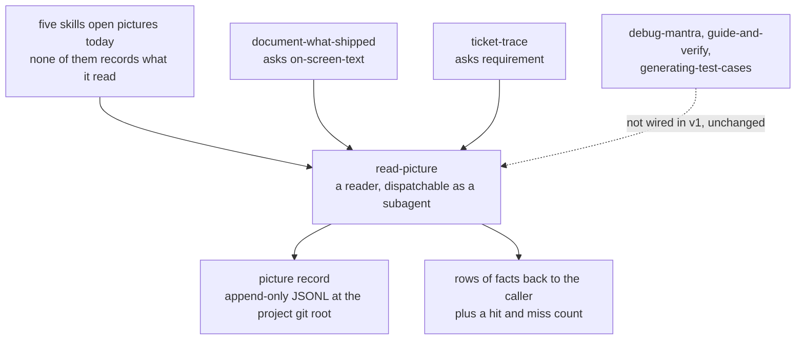
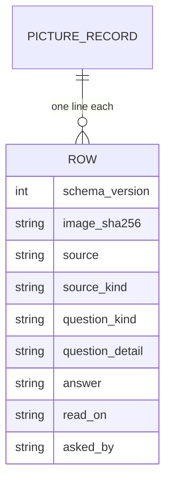
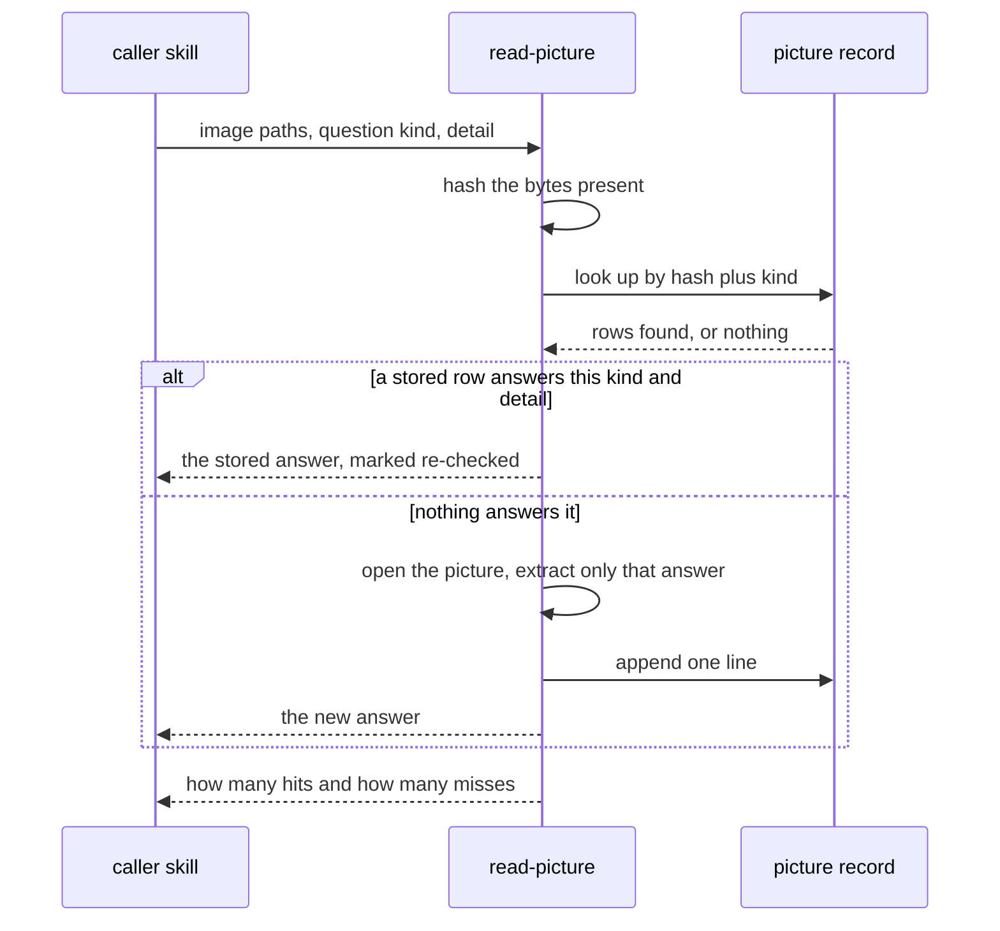
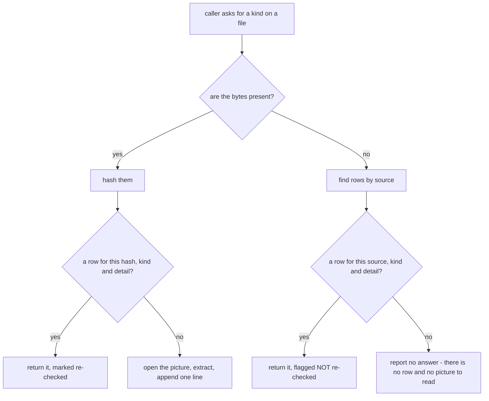

# read-picture — read a picture once, and let every skill reuse the answer

> **Superseded in part (2026-08-24, during the whole-branch review).** Two
> corrections to what shipped:
>
> - The Tests section below requires "given a fixture whose picture carries more
>   than the question asked, the appended line contains only the answer." No such
>   test exists and none can: the violation it describes requires a model reading
>   an image, and every fixture in this suite is a byte string standing in for one.
>   What IS mechanically locked is the nine-field row whitelist — `validate_row`
>   rejects any field the contract does not name — plus a small partial guard in
>   `validate_row` against an obvious credential shape in `answer` (a signed query
>   string, a `Bearer` token). The answer-content whitelist itself stays
>   prose-enforced in the `read-picture` SKILL ("record only the answer"), the way
>   it was always going to have to be.
> - The "What the script owns, and what the skill owns" table below lists "report
>   hit and miss counts" under the script. It shipped as a `Tally` class and an
>   `_OUTCOME_COUNTER` dict that `main()` never constructed — a one-shot CLI
>   process can only ever count to one, so there was nothing for either to tally.
>   Both were deleted (YAGNI, not a redesign): reporting a run's counts across
>   several lookups is the skill's job, exactly as `SKILL.md` section ④ already
>   said before this correction.

- **Date:** 2026-08-24
- **Status:** Approved design, ready for `sp-writing-plans`
- **Decisions taken while designing it:**
  [ADR 0135](../../adr/workflow-daily-work-0135-the-shared-image-step-is-a-reader-skill-not-a-record-format.md)
  (a reader, not a record format),
  [ADR 0136](../../adr/workflow-daily-work-0136-a-ledger-row-is-keyed-by-hash-and-question.md)
  (keyed by hash and question),
  [ADR 0137](../../adr/workflow-daily-work-0137-the-reader-records-only-what-the-question-asked.md)
  (record only what was asked),
  [ADR 0138](../../adr/workflow-daily-work-0138-the-question-half-of-the-key-is-a-named-set.md)
  (a named set, not free text),
  [ADR 0139](../../adr/workflow-daily-work-0139-a-row-carries-its-source-and-hash-and-flags-when-unverifiable.md)
  (source plus hash, flagged when unverifiable),
  [ADR 0140](../../adr/workflow-daily-work-0140-two-callers-in-v1-and-lazy-enforcement.md)
  (two callers, lazy enforcement),
  [ADR 0141](../../adr/workflow-daily-work-0141-the-skill-is-named-read-picture.md)
  (the name, and model-invocable),
  [ADR 0142](../../adr/workflow-daily-work-0142-the-picture-record-lives-at-the-project-git-root.md)
  (at the project git root),
  [ADR 0143](../../adr/workflow-daily-work-0143-the-picture-record-is-append-only-jsonl.md)
  (append-only JSONL)

## Why this exists

Five skills in `dev-workflows` open pictures, and not one of them writes down what it saw.
Reading a picture is the only measurement step in those skills whose result is discarded
the moment the session ends, so the second run on the same input pays the same cost to
reach the same sentence.

The cost is not hypothetical in either direction:

- `ticket-trace` exists *because* of a picture. A hardcoded label looked like a naming
  bug until the trail reached ADO #5887, whose description was one annotated screenshot
  reading "Rename Auto to Vehicles / Hide Breakbulk" — the hardcode was an explicit
  requirement, and the skill's own note says that without opening the image the answer
  would have been wrong. That skill runs at `effort: max`, and every re-run re-downloads
  and re-reads the same picture.
- `document-what-shipped` ran a publish carrying **11 attachments**, six of which had
  been referenced for a day with nobody able to say whether they existed.

So the shared step is a **reader**: a caller hands it image paths and the question it
needs answered, and gets rows of facts back (ADR 0135). Dispatched as a subagent it keeps
the images out of the calling conversation entirely — the shape `study-design-verify`
already uses, where the orchestrator keeps only structured findings and never becomes the
reader.

## Scope

**In:** a new model-invocable skill `read-picture` in the `dev-workflows` plugin; one
script that owns every read and write of the picture record; one plugin-level contract
document; and the wiring of exactly two callers.

**Out:** the three picture-reading skills v1 does not wire — `debug-mantra`,
`guide-and-verify`, `generating-test-cases`. They keep their current behaviour, nothing
about them is edited, and no gate starts failing for them (ADR 0140).

**Out:** copying image bytes anywhere (ADR 0139). **Out:** transcribing a picture in full
— the reader answers a question and records nothing else it happened to see (ADR 0137).
**Out:** any change to how images reach a destination; `document-what-shipped` keeps
owning attachment upload and its own `check_links.py` verification.

## The picture record — the data contract

One file per project at the **git root of the repo you run in**, resolved at runtime with
the same precedence `daily-state.md` already uses — an explicit `--path`, then an
environment variable, then `git rev-parse --show-toplevel` — and asking the user rather
than failing when the cwd is not inside a repo (ADR 0142). Never in this marketplace repo,
which installs onto other people's machines.

The file is **append-only JSONL**, one line per answer, never rewritten (ADR 0143).

| field | meaning |
|---|---|
| `schema_version` | on every line, so a format change never needs the file rewritten. `1` in v1. |
| `image_sha256` | hash of the bytes that were actually read. Half of the key (ADR 0136). |
| `source` | the URL or path the bytes came from. This is how a row is found when the file is gone. |
| `source_kind` | `ado-attachment`, `local-path`, or `url`. Says whether the source is expected to be re-fetchable. |
| `question_kind` | a name from the set below. The other half of the key (ADR 0138). |
| `question_detail` | the caller's own wording underneath that name — what specifically it asked. |
| `answer` | only what the question asked for (ADR 0137). |
| `read_on` | ISO-8601 with offset, when the bytes were read. |
| `asked_by` | the calling skill's name. Makes cross-skill reuse observable rather than assumed. |

**The not-re-checked flag is on the returned row, never on a stored line.** A line records
what was true when the bytes were read. Whether that could be confirmed *just now* is a
property of this lookup, so the reader sets it on what it hands back (ADR 0139). A
re-verification appends a new line rather than editing an old one, which is what gives the
record a history of when each answer was confirmed.

## Question kinds — the named set

The canonical set lives in one plugin-level file,
`plugins/dev-workflows/references/picture-record-contract.md`, alongside the row schema —
the single source of truth for both, mirroring `daily-state-contract.md`. Nothing else
redefines them.

v1 ships **exactly two kinds, plus `other`**:

| kind | the question it stands for | who asks it in v1 |
|---|---|---|
| `on-screen-text` | the exact words the product shows — control labels, page titles, status names | `document-what-shipped` |
| `requirement` | what an annotated picture asks to be done | `ticket-trace` |
| `other` | anything else, and using it obliges the run to write the new kind back into the contract file | — |

Two, not five. A kind invented for a caller nobody has wired is a guess, and this repo
already refuses guessed recipes: *an adapter is measured or it does not exist.* The set is
expected to grow by being used — the same way `document-what-shipped` writes back a spine
its five did not cover, because a type answered once should never be improvised twice.

**A near-miss is a miss.** If a caller asks `on-screen-text` about the confirm button and
the only stored row for that hash answers `on-screen-text` about the page title, that row
does not answer the request. The reader compares `question_detail`, and when the stored
detail does not cover what was asked it treats the lookup as a miss and opens the picture.
Serving it anyway would manufacture exactly the under-specification failure
`generating-test-cases` names — a value that is genuinely sourced but is the class rather
than the instance, which slips the source check *because* it looks verified.

## The reader's contract

The lookup has four outcomes, and the two that are not a plain hit or miss are the ones
that must be visible:

**The reader reports its hit and miss counts on every call.** ADR 0138's whole argument
against free-text keys is that a hit which never happens is silent, and a design that
argues that must not then hide the same thing: a caller can see whether the record is
earning its place, and a run where every call is a miss says the key set is wrong rather
than the record being cold.

## Safety

- **Only what was asked goes in a line** (ADR 0137). A data value is recorded only when the
  caller names the field it wants. This is what makes the record safe to commit at all.
- **No credential, ever.** `document-what-shipped` classifies a signed accept link as a
  credential that stays out of the page, out of the record and out of the commit, and says
  it does not bend for any reader. It does not bend here either.
- **The reader never writes to the source.** It reads image bytes and appends to the
  record. Nothing else.
- **A flagged row is not evidence.** A caller quoting a row marked *not re-checked* onto a
  published page is quoting something no reader can audit, and must be able to see that
  before it does.

## What the script owns, and what the skill owns

Split the same way `daily-state.py` and the `daily` skill are split: the script owns all
file I/O so the format cannot drift, and the judgment stays in the skill.

| the script (`scripts/picture-record.py`) | the skill (`SKILL.md`) |
|---|---|
| resolve the record path (`--path` > env > git root) | decide what the picture actually shows |
| hash bytes, look up by hash or by source | choose the kind, or register a new one via `other` |
| append one line, validate it against the schema | refuse to answer beyond the question asked, hand rows back, say when one is flagged, and report hit and miss counts |

Importable seams, named to match: `resolve_path`, `hash_file`, `lookup(hash_or_source,
kind, detail)`, `append_row(row)`. Importing must not auto-run; only
`if __name__ == '__main__':` invokes the CLI.

## Caller wiring — the two edits

| caller | where | what changes |
|---|---|---|
| `document-what-shipped` | ① the shot list, after the gate opens on files | once files are handed over, load `read-picture` with kind `on-screen-text` for the words the page will quote. The gate itself is untouched — silence still leaves it closed, and a step with neither picture nor diagram still becomes a visible hole in the draft. |
| `ticket-trace` | Operation A step 5, "Read the attachments" | replace *download it with the same auth and view it* with loading `read-picture` at kind `requirement`. The trap note stays: a description that is only an image is still the whole spec, and must never be reported as empty. |

Both callers load it the harness-neutral way this repo already uses: *"Load the
`read-picture` skill via your harness's mechanism"* — never by naming one harness's tool.

## Repo obligations for this change

- **A PLAYBOOK row in the same commit.** A skill missing from `PLAYBOOK.md` is invisible.
- **`CONTEXT.md`** already carries the three new terms — **Picture record**, **Question
  kind**, **read-picture** — added while designing this.
- **Version bump in sync.** `plugins/dev-workflows/.claude-plugin/plugin.json` and the
  `dev-workflows` entry in `.claude-plugin/marketplace.json` are both at `0.48.0` and must
  move together, minted from the global max across every ref and worktree.
- **Model-invocable.** No `disable-model-invocation` on this skill — that flag makes a
  skill slash-only and therefore unloadable by another skill (ADR 0141). Its `description`
  must still be narrow enough not to fire whenever a user merely mentions a screenshot.
- **Frontmatter `description` on one line, single-quoted** if it contains a colon followed
  by a space, or strict YAML parsers silently drop the skill.
- **Antigravity-safe paths only.** `${CLAUDE_PLUGIN_ROOT}` appears only in the
  `/scripts/…` and `/references/…` shapes the installer rewrites; the skill's own files are
  referenced skill-relative.
- **The vendored-superpowers checker is unaffected** — nothing under `skills/sp-*` or
  `skills/scrutinize/` is touched.

## Tests

- **Path resolution:** `--path` beats the env var beats the git root, and no repo plus no
  override asks rather than failing.
- **The key:** same hash and same kind and covered detail is a hit. Same hash, new kind is
  a miss. Same hash, same kind, a detail the stored row does not cover is a miss.
- **Append-only:** appending N rows leaves the first N-1 lines byte-identical. This is the
  test that protects against the whole-file-rewrite scar behind ADR 0143.
- **The flag:** with the file deleted, a lookup by source returns the row flagged, and a
  lookup with neither row nor file reports no answer instead of inventing one.
- **The whitelist:** given a fixture whose picture carries more than the question asked,
  the appended line contains only the answer.
- **Fixtures are generated, never real screenshots.** A few tiny PNGs built by the test
  itself. No customer system's picture enters this repo.
- **Every negative probe must actually fail.** Assert the mutation anchor matched before
  running it, and require the mutated run to fail — a mutated run that passes is a failed
  probe, not a pass.

## Risks, honestly

- **The kind set could ossify or balloon.** Two kinds is deliberately thin. The mitigation
  is `other` plus the write-back obligation, and the hit and miss counts that show when the
  set stops fitting.
- **Detail matching is a judgment call.** Whether a stored `question_detail` covers a new
  request is decided by the reader, not by string equality, and it can be wrong in the
  generous direction. The design leans the other way on purpose: a near-miss is a miss.
- **Hit-rate may start near zero** and only pay off on re-runs and across callers. That is
  why v1 wires two callers asking different questions rather than one (ADR 0140) — a single
  caller would leave the whole premise unmeasured.

## Not built in v1

- The other three picture-reading skills. They are unchanged, by decision.
- Any sweep that re-verifies stored rows in the background.
- Image copies beside the record.
