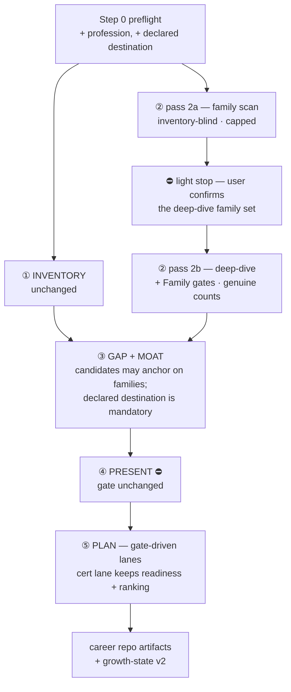
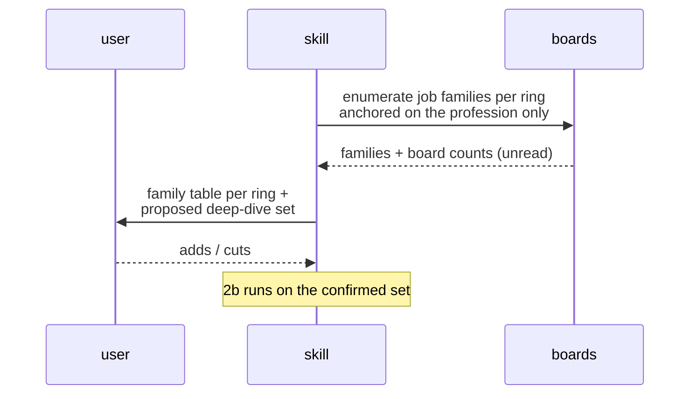
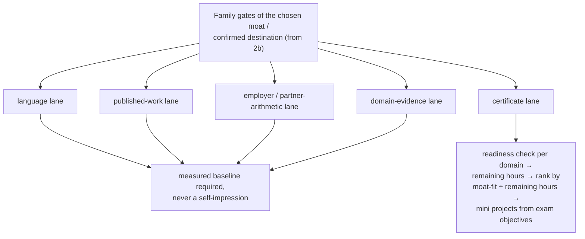

# career-growth — market-first redesign (design spec)

- **Date:** 2026-08-26
- **Scope:** `plugins/dev-workflows/skills/career-growth/` — `SKILL.md` and its
  three reference files; plus the plugin version and marketplace description.
- **ADRs settled in the grilling session:** workflow-daily-work-0148, 0149,
  0150, 0151, 0152 (0152 supersedes ADR 0051 in part).
- **Glossary terms added:** **Job family**, **Declared destination**,
  **Family gate** (in the marketplace `CONTEXT.md`).



## 1. Why this change

Round 1 of the skill (career repo, 2026-08-11) surveyed the market through
keywords grown from the user's own inventory, because `SKILL.md` scopes
Station 2 to "the skill areas from Station 1's inventory plus any adjacent
areas". Round 2 (2026-08-26) exposed three consequences, each measured:

| Round 2 finding | What it proves about the design |
|---|---|
| The architect **Job family** was never counted in round 1 | Station 2's scope was blind to families the inventory does not name |
| Every reproducible Ring 1 count came back 3–10x below round 1's `[External-research]` figure; a board count of 4 held **0 genuine** postings | A count with a confidence grade is still not a measured count |
| Ring 1 postings named **zero** Microsoft certs; the binding gate is client-facing spoken English | "PLAN is cert-driven" (ADR 0051) plans against the wrong instrument |

The order itself (inventory × market) is not the defect — a moat is an
intersection and needs both sides. The defect is that **one side scoped the
other**. This redesign cuts that dependency where it costs the most and leaves
the pipeline's five stations, its approval gate, and its evidence grading in
place.

## 2. Preflight changes (Step 0)

Two new inputs, both asked once and carried in `growth-state.md`:

1. **Profession (coarsest true label)** — e.g. *software engineering*. It is
   pass 2a's only anchor. Ask once, ever; later rounds pre-fill and let the
   user correct.
2. **Declared destination (optional)** — role + ring + stack, e.g. *Solution
   Architect · Bangkok · Microsoft Business Applications*. Pre-filled from the
   previous round. Absent is a valid answer and the pipeline runs unchanged.

Preflight also still confirms the career repo path, resume path, repo roots,
the ADO source, and the rings.

## 3. Station 2 — two passes

### 3.1 Pass 2a — inventory-blind family scan



Rules:

- Anchored **only** on the profession. Pass 2a **may not read Station 1's
  output** — this is the bright line the redesign exists to draw. Station 1
  and pass 2a are independent and may run in either order.
- Cap **~8–10 families per ring**, to hold ADR 0047's single-session bound.
  When the cap truncates, `market-report.md` names the dropped families — a
  silent truncation reads as full coverage.
- Counts here are **board counts labeled `unread`**. They may shape the
  family table and inform the user's pick; they may not reach a verdict.
- Output per family: name, ring, board count (`unread`), and whether the
  family exists as a separately-laddered role in that ring at all — round 1's
  most useful structural finding was of exactly this shape ("Bangkok absorbs
  these skills into Senior Full-Stack titles").

### 3.2 The light stop — user confirms the deep-dive set

The skill proposes the set: every family adjacent to Station 1's inventory
enters automatically, as does every family belonging to the declared
destination. The user adds or cuts. This is a light touchpoint, not the
Station 4 gate — but the run does not proceed on an unanswered proposal.

### 3.3 Pass 2b — scoped deep-dive

Runs `verify-then-advise`'s six-stage method in full, as today, over the
confirmed families plus the inventory's skill areas. Additions:

- **Read requirement text** and record each family's **Family gates** —
  language level, named certificates, domain experience, lead-delivery
  demand. Round 2 named this "the most decision-relevant unmeasured field";
  it becomes a required output, and where a board does not expose it at list
  level, say so per family rather than leaving the field absent.
- **Genuine counts** for every number that will bear a verdict (§4).
- Everything already required stays: live-verified certs with published prep
  hours and practice-assessment availability, compensation signals,
  counter-signal hunt, institutional-incentive read, triangulated outlook,
  and the "what was not checked" section.

## 4. Evidence rule 5 — verdict-bearing counts

Added to the skill's non-negotiable evidence rules:

> **A count may carry a verdict only as a board+genuine pair.** The *board
> count* is what the search page reports; the *genuine count* is what remains
> after reading at least the first page of returned titles (~10–15) and
> keeping only those actually about the thing named. A count labeled
> `unread` may inform but never decide. An `[External-research]` count is a
> **lead to re-measure**, never a citable count.

"Bears a verdict" means: any four-test line, any ranking, the final family
shortlist, or any sentence asserting a market has or lacks something.

The reading method (how to page, what counts as on-topic, recording both
integers with the date and query string) goes in `references/market-sources.md`.
The Gemini Deep Research workflow survives: it supplies leads and coverage
breadth; deciding integers are measured locally.

## 5. Station 3 — candidates may anchor on families

Unchanged: the inventory × market cross, the evidence-grade weighting, the
gap list, combinations-only rule, and the four-test argument.

Changed:

- A moat candidate **may anchor on any deep-dived Job family**, including one
  the inventory barely touches, provided the candidate states its gap plainly.
- A **declared destination is a mandatory candidate** and must be argued
  against the four tests alongside **at least one comparator**. A failing
  verdict is reported as a verdict, never softened — round 2's honest output
  was "the Business Applications architect title fails `paid` in Ring 1".
- Each candidate lists the **Family gates** it must clear, sourced from 2b.
  These become Station 5's lanes.

## 6. Station 4 — unchanged

The approval gate stands exactly as ADR 0045 set it: the user picks one moat
or rejects all; rejection loops to Station 3 with the objections as
constraints. A declared destination gets no privilege here — the user may
confirm it against a failing verdict, but the skill never silently swaps it.
`moat.md` additionally records the chosen candidate's Family gates.

## 7. Station 5 — gate-driven lanes



1. **Derive the lanes** from the chosen candidate's Family gates. A gate with
   no lane is a planning hole and must be named as one.
2. **Cert lane keeps its whole machinery, unchanged**: candidate certs
   live-verified, study guides fetched, per-domain readiness grades
   (known / partial / unknown), remaining hours weighted by exam weighting,
   a published practice assessment outranking any estimate, unvalidated
   figures labeled, ranking by **moat-fit ÷ remaining hours** with
   disagreeing orderings both shown, mini projects designed backwards from
   exam objectives and aimed at `unknown` domains, publish-when-feasible.
3. **Every planned cert carries a justification**, one of:
   - **(a) an institution or ring demonstrably reads it** — evidence from the
     institutional-incentive read or from posting requirement text; or
   - **(b) it forces capability the readiness check graded `unknown`.**

   A cert that can state neither is dropped from the plan and recorded as
   dropped, with the reason, so a later round can revisit it.
4. **Non-cert lanes take the same measurement discipline.** Each needs a
   pass/fail milestone and a **measured baseline** — the analogue of the
   practice assessment. A language lane baselined on "I write well, speak with
   effort" is an estimate and must be labeled unvalidated exactly as an
   unmeasured cert estimate is.
5. **Zero-study-hour milestones list first — across every lane**, not just
   within the non-cert section.
6. `growth-plan.md` gains a **lane table** at the top: gate · lane · milestone ·
   baseline (measured / unvalidated) · study hours. The cert readiness table,
   the ranking with its trade, and the per-project sections follow.

## 8. Artifact and contract changes

### 8.1 `market-report.md`

New sections: the per-ring **family table** (family · ring · board count ·
`unread`/genuine · exists as a laddered role?) and the **Family gates** read
per deep-dived family. Existing sections keep their shape; every
verdict-bearing count becomes a board+genuine pair. Dropped families (cap
truncation) and unreadable gate fields are named in "what was not checked".

### 8.2 `growth-state.md` — contract v2

```yaml
version: 2
last_run: 2026-11-11
cadence_months: 3
next_review_due: 2027-02-11
profession: "software engineering"          # NEW — pass 2a's anchor, asked once
declared_destination:                        # NEW — null when the user declares none
  statement: "Solution Architect · Bangkok · Microsoft Business Applications"
  declared_on: 2026-08-26
  last_verdict: "fails `paid` in ring 1; passes in ring 3"
chosen_moat: "<one-line moat statement>"
moat_adopted_on: 2026-11-11
milestones:                                  # NEW — replaces target_certs + mini_projects
  - lane: certificate                        # certificate | language | published-work |
    gate: "partner designation arithmetic"   #   employer-arithmetic | domain-evidence
    milestone: "pass AB-620"
    baseline: unvalidated                    # measured | unvalidated
    study_hours_estimate: 55
    cert:                                    # present only on the certificate lane
      code: AB-620
      status: planned                        # planned | studying | scheduled | passed | retired-blocked
      verified_on: 2026-08-26
      registry_url: https://learn.microsoft.com/credentials/...
      justification: b                       # a = an institution/ring reads it
                                             # b = forces capability graded unknown
    projects:
      - name: <kebab-slug>
        exam_objectives: ["…"]
        status: planned
        published_url: null
```

**Migration:** a v1 file is read, not rejected. `target_certs` entries become
`lane: certificate` milestones (justification unset → the run must supply one
or drop the cert); `mini_projects` fold into their cert's `projects`, and a
`for_cert: none` project becomes its own lane milestone. The skill writes v2
and says in the run that it migrated.

### 8.3 Reference files

- `references/market-sources.md` — add the pass 2a family-scan method (how to
  enumerate families from a profession anchor per board), the genuine-count
  reading method, and the Family-gate fields to extract. The ring/board tables
  and the trend-signal taxonomy stay.
- `references/interview-bank.md` — add the profession question and the
  declared-destination question to *Constraints & preferences*. The human-language
  question already exists under *Soft skills & languages* and needs no addition;
  what needs stating is that its answer is `interview-attested` by that file's own
  grading rule and therefore **is not a measured baseline** for Station 5's
  language lane — the lane must name the measurement it still needs.
- `references/growth-state-contract.md` — rewrite for v2 with the migration
  rule above.

### 8.4 `SKILL.md`

- Redraw the pipeline diagram to show 2a / the light stop / 2b and the lanes.
- Rewrite Station 2, add evidence rule 5, amend Stations 3 and 5, extend
  Step 0.
- **Frontmatter description**: replace "cert-driven growth plan" with the
  gate-driven framing and mention the family scan, so the trigger text matches
  the behaviour.
- **Failure table** additions: *pass 2a returns no families for a ring* → say
  so and continue with the rings that answered; *a board exposes no
  requirement text* → record the Family gate as unread per family, never
  absent; *a v1 `growth-state.md` is found* → migrate and say so.

### 8.5 Plugin packaging

- Bump `plugins/dev-workflows/.claude-plugin/plugin.json` and
  `.claude-plugin/marketplace.json` from **0.50.0 → 0.51.0** (both verified at
  0.50.0 on 2026-08-26; the cache at `…/cache/workflow-daily-work/dev-workflows/0.50.0/`
  exists, so the currently-loaded copy is live).
- Update the `dev-workflows` marketplace **description**, which currently
  advertises career-growth as a "cert-driven mini-project plan".
- After the bump, verify the cache directory for 0.51.0 exists and contains
  the edited `SKILL.md` — a manifest claiming the new version while its cache
  dir was never created is a known trap; `cp -a` the plugin into place if so.

## 9. What this redesign deliberately does not change

- The five stations, their order, and the Station 4 approval gate.
- The four-test moat definition (ADR 0044) and combinations-only rule.
- Evidence grading, the four-grade claim scale, and delegation of all
  outside-world verification to `verify-then-advise`.
- The readiness check and the moat-fit ÷ remaining-hours ranking (they move
  inside the cert lane, unchanged).
- Full-run-every-time (ADR 0050); the ring defaults (ADR 0047); personal data
  never entering the plugin (ADR 0043/0049); assisted commits only.
- The Gemini Deep Research routing for market research — it now supplies
  leads and breadth rather than citable integers.

## 10. Out of scope

- Re-running career-growth itself. This spec changes the skill; round 3 is a
  separate, user-initiated run.
- Rewriting the career repo's existing round 1/2 artifacts. `market-report.md`
  is overwritten by the next run by design; no back-fill is planned.
- Any change to `verify-then-advise`, whose six-stage method this skill keeps
  consuming as-is.
