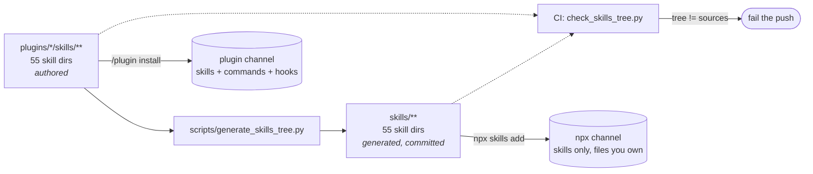
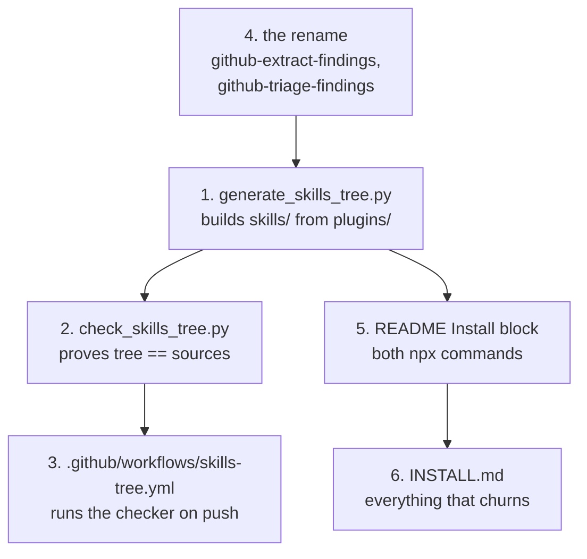
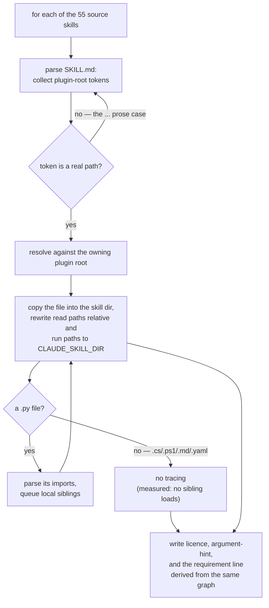

# Design — the npx install channel



**Status:** proposed — awaiting approval, then `sp-writing-plans`.
**Decisions:** ADRs `workflow-daily-work-0153` … `0164`.
**Glossary:** `CONTEXT.md` → **Install channel**, **Generated tree**.

## 1. Why

A colleague who wants one skill from this repo has no cheap way to take it. The plugin
channel installs a whole plugin and needs a marketplace registration first; taking
`wait-what` into an unrelated project is disproportionate.

The skills.sh CLI (`npx skills`, from `vercel-labs/skills`) is the ecosystem that solves
this, and — measured 2026-08-29 — **it already reads this repo**: it parses
`.claude-plugin/marketplace.json` and reported 53 skills with no change to the repo. What
does not work is what happens after the copy.

### Measured, 2026-08-29

| probe | result |
|---|---|
| `add <repo> --list` | 53 skills found; repo holds **55 skill directories** |
| why 53 | `extract-findings` and `triage-findings` exist in **both** backlog plugins as different files (132/96 and 120/82 lines); one of each pair is dropped silently |
| `--skill <name>` (space) | installs exactly that skill |
| `--skill=<name>` (equals) | installs **all 53** — a CLI arg-parsing behaviour, not ours to fix |
| `--all` | installs all 53 in one run, no interactive picker |
| what is copied | the skill directory and nothing above it |
| plugin-level deps | **29 of 55** skill dirs resolve `${CLAUDE_PLUGIN_ROOT}/references/…` or `…/scripts/…` — they install and then fail |
| root vs plugin | a `skills/<name>/` at repo root **shadows** `plugins/*/skills/<name>/`; no duplicate listing; names present only under `plugins/` still appear |
| addressing | the CLI keys on **frontmatter `name:`**, not the directory: `--skill gamma` against a `gamma/` dir declaring `name: delta` installed nothing |
| branch/ref | unsupported — only `owner/repo`, a URL, a direct skill path, or a local path |
| commands & hooks | never installed; skills only |
| invocation | a skill at `.claude/skills/<name>/` is invocable as `/<name>`; `disable-model-invocation: true` blocks only automatic use |
| licences | **no SKILL.md references** `LICENSE-superpowers` or `LICENSE-mattpocock-skills`; both sit at plugin root and never travel |

## 2. What is being built

Four things, plus two documents.



## 3. The generated tree — contract

`skills/<name>/` at the marketplace root, one directory per skill, **all 55**
(ADR 0161), generated and committed, **never hand-edited** (ADR 0154).

For each source skill the generated directory contains:

1. **`SKILL.md`**, with every `${CLAUDE_PLUGIN_ROOT}/…` reference rewritten by kind
   (ADR 0164): a file Claude **reads** becomes a relative markdown link
   (`[diagram-convention.md](references/diagram-convention.md)`), the Agent Skills
   standard form; a file Claude **runs** becomes `${CLAUDE_SKILL_DIR}/scripts/x.py`,
   which resolves from any working directory. Where a rewritten script also appears in an
   `allowed-tools` Bash rule, both occurrences use the same token so the command still
   matches and runs without a prompt.
2. **Every file the SKILL.md names**, placed at the rewritten path.
3. **Every file those files import, transitively** (ADR 0155) — this is what brings
   `map_core.py` along for `chart-map` and `work-map`, which no SKILL.md mentions.
4. **The vendored licence file** for the 7 skills that need one (ADR 0158):
   `LICENSE-superpowers` for the six `sp-*`, `LICENSE-mattpocock-skills` for `wait-what`.
5. **`argument-hint`** in the frontmatter, lifted from the skill's command wrapper where
   one exists (ADR 0157). Nothing else about the frontmatter changes.
6. **A requirement line**, for the 10 skills that need one: a marker comment and one
   blockquote under the frontmatter naming the third-party packages their bundled scripts
   import. Derived from the same import graph as item 3 — a module is third-party when a
   `.py` that travels with the skill imports it, no sibling `.py` supplies it, and
   `sys.stdlib_module_names` does not know it. The npx channel's unit is the skill and its
   reader never chose a plugin, so the answer has to travel inside `SKILL.md`; deriving it
   is what stops it drifting the way INSTALL.md's per-plugin table did.

Invariants the checker asserts (§5):

- the directory name equals the frontmatter `name` (ADR 0162);
- no **resolvable** `${CLAUDE_PLUGIN_ROOT}/<path>` reference survives in any `.md` file —
  a bare token inside a non-`.md` file, and the prose form `${CLAUDE_PLUGIN_ROOT}/...`
  that names no path, are legitimate survivors (the built tree holds one of each)
  — this narrowing amended the invariant after the tree was first built (ADR 0168);
- every relative path a generated file names resolves inside its own directory, and every
  `${CLAUDE_SKILL_DIR}/…` path names a file that exists in that directory. A bare
  relative path to a plugin-level file is the second way to name a file that never
  arrives, and the checker holds that half too (ADR 0170);
- the frontmatter `name` is unique across the whole tree;
- regenerating from the current sources reproduces the tree byte-for-byte.

### Exclusions

- `test_*` files and `fixtures/` directories are not copied — 196K of 352K in
  `dev-workflows/scripts`, 264K of 572K in `decision-map/scripts`. **Override:** a file a
  SKILL.md names directly is always copied, which `sa-doc` relies on for
  `scripts/fixtures/sa-model-bookstore.yaml`.
- Commands and hooks are not represented in the tree; the CLI would not install them.
- `${CLAUDE_PLUGIN_ROOT}/...` in `ado-create-work-items` is prose about quoting paths
  with spaces, not a reference. The rewriter must not chase it.

## 4. The generator



Only Python is traced. Every `.cs` and `.ps1` the skills call — `create-backlog.cs`,
`my-work.cs`, `setup_check.ps1`, `setup_check_github.ps1` — was checked for dot-sourcing
and `#load`/`#r` and has none. No skill references another skill's directory, so the
graph has no skill-to-skill edges.

## 5. The checker and CI

`check_skills_tree.py` regenerates into a temporary directory and compares against the
committed tree, then asserts the §3 invariants. It reports and exits non-zero; it never
writes to `skills/`.

`.github/workflows/skills-tree.yml` runs it on every push and pull request — the repo's
first CI (ADR 0159). Because the workflow exists, ADR 0090's refusal of a CI badge is
lifted: the badge may be added, and it will mean something.

## 6. The rename

`github-backlog`'s `extract-findings` → `github-extract-findings`, `triage-findings` →
`github-triage-findings` (ADR 0156). ADO keeps the bare names, matching the existing
`my-work` / `github-my-work` pair.

The rename is a **frontmatter `name:` edit as well as a directory rename** (ADR 0162);
renaming directories alone leaves both twins answering to the old name.

Live files to update, measured: `findings-to-github-issues/SKILL.md`,
`github-writeback-tracking/SKILL.md`, `classify-github-issues/SKILL.md`,
`github-backlog/references/data-contracts.md`, `github-backlog/README.md`,
`docs/ARCHITECTURE.md`. The plans and specs under `docs/superpowers/` that mention the
old names are historical records and are **not** rewritten.

## 7. The documents

### README — the Install block that already exists (ADR 0160, 0163)

Gains the npx channel beside the plugin one, whole-set first:

```text
npx skills@latest add ThodsaphonSonthiphin/workflow-daily-work --all
npx skills@latest add ThodsaphonSonthiphin/workflow-daily-work --skill grill-then-plan
```

No skill names beyond the one worked example, no counts, no versions — ADR 0090 holds.

### INSTALL.md — new, repo root

Everything that churns:

1. **Choosing a channel** — the plugin channel is a managed bundle with commands, hooks
   and short aliases; the npx channel writes files you own and can edit, one skill at a
   time. Neither is a fallback for the other.
2. **The `--skill=` trap** — measured, and the exact syntax the ecosystem's own docs
   show, so a reader will hit it: `--skill=<name>` installs everything; write
   `--skill <name>`.
3. **The alias table** — `/ask` → `/asking-to-understand`, `/feynman` →
   `/feynman-explain`, `/chart` → `/chart-map`, `/work` → `/work-map`, `/run` →
   `/findings-to-ado-backlog`, and the rest. Short aliases exist only in the plugin
   channel.
4. **What the npx channel does not carry** — no hooks, no aliases, no automatic updates
   (`npx skills update <name>`).
5. **The renames** from §6, for anyone with the old names installed.
6. **Machine setup** — `az login`, `gh auth login`, `AZDO_ORG` / `AZDO_PROJECT`,
   `GH_OWNER` / `GH_REPO`, and the Python packages per plugin. The table is keyed by the
   plugin a skill came from, which the npx channel's reader never chose, so it says so and
   points at each skill's own generated requirement line (§3 item 6) for the answer that
   cannot drift.

## 8. Out of scope

- Fixing the `--skill=` parsing — it is the CLI's, and this repo cannot change it.
- Publishing to the skills.sh registry; discovery already works from the repo.
- Antigravity: `install-antigravity.py` keeps its own staging and is untouched. The two
  solve the same problem for different hosts and are not merged here.
- Any change to what the plugin channel installs.

## 9. Known risks

- **The tree doubles the repo's skill directories, and a quarter of it is copies of
  itself.** Measured on the built tree: 55 authored directories become 110, and `skills/`
  holds 164 tracked files totalling 1.73 MiB (2.1 MB on disk). 38 of those 164 are
  byte-identical to another file in the tree — 461 KiB, 26% of it. `diagram-convention.md`
  arrives 12 times, identical every time; `data-contracts.md` arrives 12 times in three
  different versions, one of them 89 KiB, for 232 KiB between them. That is the price of
  the CLI copying one directory and nothing above it. Accepted for one unconditional rule
  (ADR 0161); CI is what makes it safe.
- **`install-antigravity.py` and the generator now do overlapping work.** Not merged now;
  if both need the same rewrite rule twice, that is the signal to extract it.
- **`${CLAUDE_SKILL_DIR}` is a Claude Code extension, not the open standard.** A skill
  taken into a non-Claude agent shows the token unexpanded in a script path. Accepted in
  ADR 0164: a visible failure beats a path that silently resolves somewhere else.
- **The CLI is third-party and moving.** Every behaviour above is dated and measured, not
  read from documentation alone. The `--skill=` behaviour in particular may be fixed
  upstream, at which point INSTALL.md's warning becomes stale and harmless.
