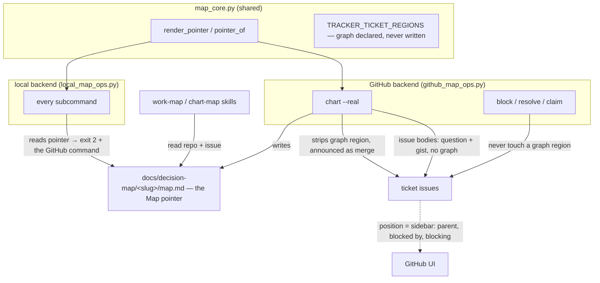

# decision-map on GitHub: no position diagram, and a Map pointer in the repo — design

The GitHub backend of `decision-map` stops writing the position diagram into ticket
issues, strips the ones it already wrote on the next gated `chart`, and leaves a
**Map pointer** file in the repo so a cold session can find a map that lives on
GitHub. The local backend keeps its diagram and learns to refuse a pointer loudly.



Decisions behind this design:
[ADR 0171](../../adr/workflow-daily-work-0171-the-github-backend-does-not-write-the-position-diagram.md)
(no diagram on GitHub),
[ADR 0172](../../adr/workflow-daily-work-0172-a-github-chart-re-run-strips-the-position-diagrams-it-wrote.md)
(a `chart` re-run strips the old ones),
[ADR 0173](../../adr/workflow-daily-work-0173-a-github-map-leaves-a-pointer-file-in-the-repo.md)
(the Map pointer). Glossary: **Map pointer** in `CONTEXT.md`.

## Problem

Two reports from the owner, both about a map charted on GitHub Issues.

**The tickets are hard to read.** Each ticket issue opens with (or, since ADR 0102,
carries below its question) a Mermaid `graph TD` of its blockers, itself and what it
unblocks. On GitHub that picture is a duplicate: the backend writes real sub-issues
and real blocked-by dependencies (`github_map_ops.py:892-897`), so the issue's own
sidebar already shows the parent map, *Blocked by* and *Blocking* — live, striking a
blocker through when it closes. The diagram is structure-only by decision (ADR
0064), so it is the staler of the two renderings, and on a fresh ticket it is a
single box naming the ticket itself. ADR 0102 moved it below the question for new
tickets only; every ticket charted before decision-map 0.10.0 still opens with it,
because additive never reorders a body it wrote.

**A cold session cannot find the map.** A GitHub `chart` writes nothing into the
repo (`chart-map` Step 5: "on GitHub there is nothing to commit"), and `work-map`'s
preflight knows a map is on GitHub only when "the user names a repo or a board". A
session opened cold in that repo sees an empty `docs/decision-map/`, concludes there
is no map, and points at `/decision-map:chart` — an absence read as a fact, the
harm class ADR 0061 exists to prevent.

## 1. The GitHub backend writes no position diagram (ADR 0171)

### Ticket issue body

`render_ticket_issue_body(key, question)` renders the key marker, `## Question`,
the question, and an empty gist region — **no graph region**:

```markdown
<!-- decision-map:key:<key> -->

## Question

<the question>

<!-- decision-map:gist:start -->
<!-- decision-map:gist:end -->
```

The `--force` path reuses the same renderer, so an `OVERWRITE` also leaves a ticket
with no diagram.

### Nothing on GitHub renders a diagram

- `chart`'s post-write graph pass (`github_map_ops.py:1215-1245`) no longer
  re-renders diagrams; it becomes the strip pass of §2.
- `block` no longer calls `_patch_graph_region` at either end
  (`github_map_ops.py:1450-1453`). It writes the dependency and returns.
- `_patch_graph_region` and `_children_of` leave `github_map_ops.py`. The local
  backend keeps its own `_children_of` and its diagram; `map_core.
  position_diagram_region`, `set_graph_region` and `force_orphaned_blockers` stay,
  used by local only.

### The region stays declared

`TRACKER_TICKET_REGIONS` keeps `(GRAPH_START, GRAPH_END)`. `assert_regions` does not
require a declared region to be present, but it rejects any decision-map marker that
belongs to no declared region (`map_core.py:332`), so undeclaring the pair would make
every old ticket unwritable at its next `resolve`. Declared-but-never-written is the
shape: an old ticket carrying the region passes `_assert_ticket_body` on `resolve`,
`claim` and `block`, all of which leave the region exactly as they found it.

### The local backend is unchanged here

`local_map_ops.py` keeps rendering the diagram below `## Question` (ADRs 0063, 0064,
0102) and keeps re-rendering both ends of every edge. A markdown file has no sidebar.

## 2. A `chart` re-run strips the old diagrams (ADR 0172)

### Plan

`chart_plan` on GitHub gains one pass over the snapshot: every existing ticket whose
body contains `GRAPH_START` gets a plan entry with `action: "merge"` and detail
`removes the position diagram (ADR 0171)`, appended to any detail the entry already
carries (an edge union, say), through the same "skip → merge with detail" promotion
the `pending` pass uses (`github_map_ops.py:1009-1015`). A ticket the run is creating
or overwriting is not listed here — its own line covers its body.

The two diagram-only announcements leave the GitHub plan: `renders as a child in the
graph: …` (`:1043-1051`) and the `--force` orphan pass (`:1060-1072`) announce
writes that no longer happen. `map_core.force_orphaned_blockers` and
`force_orphan_detail` stay for the local backend.

### Real run

The former graph pass becomes:

```
for every key in final_snap.tickets (sorted):
    body = norm_eol(ticket body)
    new_body = strip_graph_region(body)      # map_core, see below
    if new_body != body:
        _assert_ticket_body(new_body, …)
        ops.patch_issue(number, {"body": new_body}, repo=…)
```

`map_core.strip_graph_region(body)` removes the region matched by
`region_re(GRAPH_START, GRAPH_END)` (which already consumes the region's trailing
newline) and collapses the blank lines it leaves so that at most one empty line
separates the neighbours. It is deterministic and idempotent: a body without the
region comes back byte-identical, which is what restores the no-op guarantee from
the second run onward. It touches nothing outside the markers.

The first `chart` after upgrading is **not** a byte-identical no-op on a map that
carries diagrams; the plan says so ticket by ticket, and the second run is.

### What is not stripped

- Nothing on the local backend.
- Nothing by `block`, `resolve`, `claim`, `comment` or `lint`.
- The resolution comment's answer diagram (ADR 0065) — that is a native comment the
  agent authored, not a generated region, and the owner's report was about the
  ticket body.

## 3. The Map pointer (ADR 0173)

### The file

On GitHub, `chart --real` writes `<root>/<slug>/map.md`, where `--root` is a new
flag on `github_map_ops.py` defaulting to `docs/decision-map` like the local
backend's:

```markdown
---
type: decision-map-pointer
backend: github
repo: acme/widgets
issue: 42
url: https://github.com/acme/widgets/issues/42
---
# Decision map — billing

This decision map lives on GitHub Issues, not in this folder: the map is
acme/widgets#42 and every ticket is one of its sub-issues. Nothing here is a
copy of it. Work it with the decision-map plugin's GitHub backend
(`github_map_ops.py`) and `--repo acme/widgets --map 42`; the local backend
refuses this file on purpose.
```

Rendered by `map_core.render_pointer(slug_title, repo, issue, url)`; parsed by
`map_core.pointer_of(text) -> dict | None`, which returns the frontmatter when
`type` is `decision-map-pointer` and `None` otherwise. Both live in `map_core`
because one backend writes what the other must recognise (ADR 0062). Values pass
through `one_line` like every frontmatter value the tool writes. The pointer holds
**no state** — no tickets, status or frontier — so nothing it says can go stale in a
way that misleads.

### In the plan and the run

`chart_plan` on GitHub appends one entry for the pointer, after the map entry and
before the tickets, with `path` = the file's repo-relative path (the local plan's
`path` shape, `data-contracts.md:366`):

| the file at `<root>/<slug>/map.md` | action | detail |
|---|---|---|
| absent | `create` | `null` |
| a pointer to this repo and issue, byte-identical | `skip (exists)` | `null` |
| a pointer to this repo and issue, different bytes (title changed, older format) | `merge` | `refreshes the Map pointer` |
| a pointer to another repo or issue | **validation error** — exit 2, naming both; `--force` makes it `OVERWRITE` | |
| not a pointer (a local map lives at this slug) | **validation error**, always — one slug cannot name a local map and a GitHub map in the same repo | |

On a dry run nothing is written. On `--real` the pointer is written last, after the
closing snapshot, so a run that fails mid-way on the tracker leaves no pointer to a
half-charted map; a re-run then creates it. On a `create` map the issue number is
known only after the map issue exists, which is another reason the write is last.

A `chart` re-run on a map charted before this design creates the pointer it never
had — the same gated run that strips its diagrams (§2).

### The skills

`chart-map` Step 3's bundled ask and Step 5's close both change: on GitHub there
**is** one file to commit, the pointer, offered through assisted git exactly as the
local folder is. The Step 0 table's "where the map lives" row for GitHub gains
"plus a Map pointer at `docs/decision-map/<slug>/map.md`".

`work-map` Step 0 gains the first "how to tell": **read `docs/decision-map/`**. A
directory whose `map.md` is a pointer means GitHub, and the preflight takes `--repo`
and the map's issue number from it without asking. This is not inferring the repo
from the git remote, which the skill still forbids: the pointer was written by a
deliberate `chart` the user approved. A directory whose `map.md` is not a pointer
means local. No directory at all means "no map here, or a GitHub map charted before
the pointer existed" — the skill says both, and asks, rather than concluding no map.

### The local backend refuses it

Every `local_map_ops.py` subcommand that names a map — `read`, `frontier`, `lint`,
`claim`, `block`, `comment`, `resolve`, and `chart` for the slug in its input —
checks `<root>/<slug>/map.md` through `pointer_of` first and, on a pointer, exits
`2` with one stderr line:

```
error: read: map 'billing' lives on GitHub (acme/widgets#42), not in this folder -- run github_map_ops.py read --repo acme/widgets --map 42
```

One check in `_dispatch` covers the seven that take `--map`; `chart` runs the same
check once it has validated `target.slug`. Without this, `read` on a pointer would
take `---` as the title and report a map with zero tickets — exactly the empty-map
misreading the pointer exists to prevent.

## 4. Explicitly not in scope

- Changing the local backend's diagram, its placement, or its both-ends re-render.
- Migrating old GitHub tickets to the ADR 0102 order — moot once the region is gone.
- An ADR per map, or a generated line in `CLAUDE.md` (both rejected in ADR 0173;
  either can be added later without touching this design).
- Refreshing the pointer from anything but `chart` (`resolve` and friends never
  touch it).
- The Azure DevOps backend (still gated, ADR 0059).
- Any change to what `read`, `frontier` or `lint` return — the JSON shapes are
  untouched; only the GitHub plan's entries and the issue bodies change.

## 5. Contract, docs and test changes

`references/data-contracts.md`:

- the per-field table row for *ticket position diagram* (`:1161`): GitHub column
  becomes "**not written** (ADR 0171); a region left by an earlier version is
  tolerated and stripped by the next `chart` (ADR 0172)".
- the GitHub dry-run example (`:381-389`) gains the pointer entry; the GitHub ticket
  issue body is shown without a graph region.
- a new subsection **The Map pointer** under the GitHub backend: the file format
  above, the plan table above, and the local backend's refusal.
- the `--force` table row for a blocker "blocking an `OVERWRITE`'d ticket"
  (`:271`) and the "Both ends, on removal as well as addition" paragraph (`:274`)
  are marked **local backend only**.
- "byte-identical regions on both backends" (ADR 0062) is restated as *every region
  both backends write*, naming `graph` as the one region only local writes.
- `github_map_ops.py` gains `--root` in the CLI table.

Skills and docs: `chart-map/SKILL.md` (Step 0 table, Step 3 ask, `:317`, `:430-436`),
`work-map/SKILL.md` (Step 0 preflight, `:433`), `plugins/decision-map/README.md`
(`:115-120`), `PLAYBOOK.md:129` already reads "maps live in `docs/decision-map/`" and
becomes true for both backends. The committed `skills/` tree is regenerated with
`scripts/generate_skills_tree.py` and checked with `scripts/check_skills_tree.py --repo .`
(ADR 0159; CI runs the checker). Version: `decision-map` 0.11.0 → **0.12.0** in
`plugin.json` and `marketplace.json` (global max across refs is 0.11.0 on every ref
today).

Supersession banners, same change: `docs/superpowers/specs/2026-08-03-decision-map-diagrams-design.md`
(§1 is now local-only), ADR 0102 and ADR 0064 (an amendment line each: local-only
since ADR 0171), ADR 0062 (the regions wording).

Tests, `test_github_map_ops.py`:

| test | what happens |
|---|---|
| `test_a_created_ticket_issue_body_carries_a_graph_region` (`:1195`) | **inverted**: no `GRAPH_START`, gist region present, question first |
| `test_adding_a_dependency_patches_both_issue_bodies` (`:1203`) | **inverted**: after `chart` neither body holds a graph region; the edge exists in the fake's dependencies |
| `test_an_existing_ticket_gaining_a_new_blocker_role_is_announced_in_the_plan` (`:1215`) | **deleted** — nothing is written at the blocker end on GitHub any more; the local twin stays |
| `test_a_new_ticket_issue_leads_with_its_question` (`:1542`) | updated: asserts `GRAPH_START` absent |
| `test_every_merge_entry_names_what_it_adds` (`:154`) | unchanged, must keep passing — the strip and pointer `merge` entries carry details |
| new | a fake pre-seeded with a ticket body carrying a graph region: the dry run lists `merge … removes the position diagram`, `--real` strips it, the body is otherwise byte-identical, and a second `--real` is a byte-identical no-op |
| new | `resolve` on that pre-seeded ticket succeeds *before* any `chart` runs (the region is tolerated) |
| new | `block` writes the dependency and patches no body |
| new | `chart --real` writes the pointer at `--root`; the dry run lists it and writes nothing; the second run lists `skip (exists)` and leaves the bytes |
| new | pointer collisions: another issue → exit 2, `--force` → `OVERWRITE`; a local map at the slug → exit 2 always |
| new | `main(["chart", …, "--root", tmp])` accepts the flag |

Tests, `test_local_map_ops.py`: new — a pointer at `<root>/<slug>/map.md` makes each
of the eight subcommands exit `2` with a line naming the repo, the issue and the
GitHub command; `read` in particular must **not** return a zero-ticket map.

`smoke_github_live.py` passes a temporary `--root` so the live byte-identical
re-chart check covers the pointer, and asserts no ticket body carries `GRAPH_START`.

## 6. Verified premises

Checked against the code in this session rather than assumed:

- The GitHub backend writes native dependencies (`add_blocked_by`,
  `remove_blocked_by`, `github_map_ops.py:892-897`) and sub-issues (`link_child`,
  `:1171`), which is what makes the sidebar a rendering of the same structure.
- `assert_regions` tolerates an absent declared region and rejects an undeclared
  marker (`map_core.py:315-334`) — the reason the region stays declared.
- `region_re` consumes the region's trailing newline (`map_core.py:364-366`), so a
  strip needs only to tidy the blank line before it.
- A GitHub `chart` writes nothing into the repo today, and `github_map_ops.py` has no
  `--root` (`:1666-1692`).
- `read_map` on the local backend takes line 1 as the title and an absent `tickets/`
  as an empty list (`local_map_ops.py:563-584`), so an unrecognised pointer would
  read as an empty map.
- Both suites are green at the start: 331 tests, `OK`.

**One premise is not measured here:** that GitHub's issue page shows *Blocked by* /
*Blocking* and the parent in its sidebar. ADR 0062 records native dependencies as GA
2025-08-21 and read/write-verified live; the sidebar is that feature's UI. No live map
is reachable from this session to screenshot it. If the owner's GitHub plan or a
future UI change hid it, ADR 0171 would lose its premise — the pointer (§3) and the
tolerated region (§1) would stand regardless.

## 7. Risks

- **The first re-chart is noisy by design.** A map of 24 tickets shows 24 `merge`
  lines the user must approve once. The plan detail names the reason on each.
- **A pointer and a real local map with the same slug** is refused rather than
  merged; the message names both files. A team that wants both must pick a
  different slug for one.
- **`--root` on GitHub is a second place the flag exists.** Same default, same
  meaning; the contract's CLI table carries both.
- **The pointer's command line cannot know the install path**, so it names the
  script and flags, not a runnable path. The skill knows `${CLAUDE_PLUGIN_ROOT}`.
