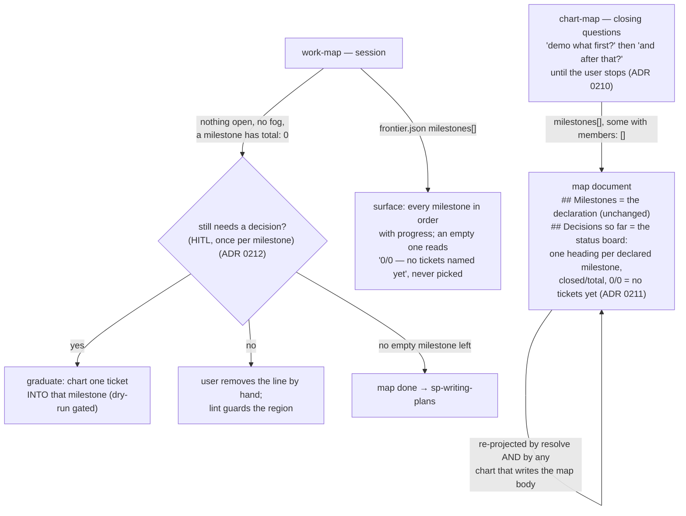
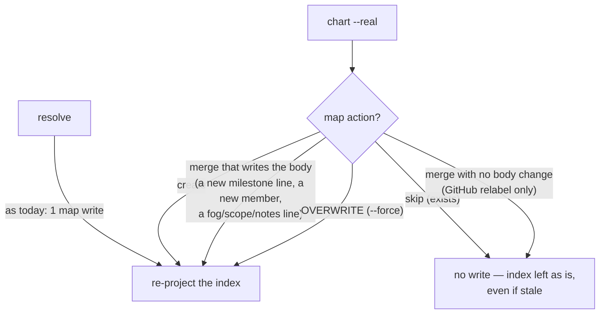
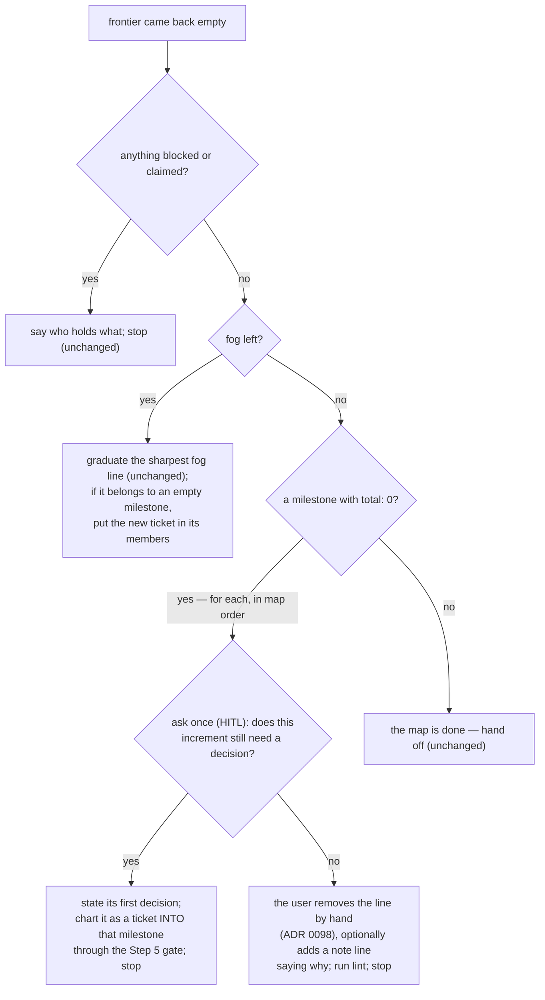

# decision-map — the map says which milestones remain

- **Date:** 2026-09-13
- **Status:** Implemented 2026-09-13 on branch `decision-map-remaining-milestones`; ADR 0213 added during execution (duplicate-slug rendering)
- **ADRs:** [0210](../../adr/workflow-daily-work-0210-chart-map-asks-for-the-later-milestones-too-one-skippable-question-at-a-time.md),
  [0211](../../adr/workflow-daily-work-0211-the-decisions-index-shows-every-declared-milestone-with-its-progress.md),
  [0212](../../adr/workflow-daily-work-0212-an-empty-milestone-holds-the-map-open-like-fog-does.md)
  [0213](../../adr/workflow-daily-work-0213-a-duplicated-milestone-slug-renders-its-first-declaration-only.md),
  (refining ADRs 0100 and 0103, which carry banners)
- **Plugin:** `decision-map` — `0.12.0 → 0.13.0` (plugin.json and marketplace.json together)
- **Glossary:** `CONTEXT.md` gains **Empty milestone**; the user's word "phase" stays under *Avoid* for Milestone



Read the diagram top-down: chart writes the whole ordered plan into the map from
day one; the map file itself then shows, per milestone, what is closed and what
remains; and work-map refuses to call the map done while a declared milestone has
nothing under it.

## 1. The problem

Reported 2026-09-13: *"the map never says which phases remain once the user has
chosen phase 1."* Three design choices stack to produce it (all verified against the
code on this date):

1. **chart-map records only the first milestone.** Its closing question is "what do
   you want to demo first?" and only that answer becomes a milestone
   ([chart-map SKILL.md L172–186](../../../plugins/decision-map/skills/chart-map/SKILL.md), ADR 0100).
   Every other ticket is left `milestone: null`, which ADR 0097 defines as "not yet
   scheduled" — a legal state, so nothing flags it.
2. **The map document stores membership, not progress.** The `## Milestones` region
   holds `- \`slug\` label [keys]` lines only
   ([map_core.py `render_map_body`](../../../plugins/decision-map/scripts/map_core.py)).
   `closed/total` exists only in `frontier.json`, which work-map prints into the
   conversation and never writes back.
3. **The decisions index hides a milestone until something in it closes.**
   `decisions_region` omits a milestone with no closed decision "rather than
   rendered empty" (ADR 0103;
   [test_local_map_ops.py `test_a_milestone_with_no_closed_decision_is_not_rendered`](../../../plugins/decision-map/scripts/test_local_map_ops.py)).

So a reader opening `map.md` cold sees the first milestone's member list and nothing
that says a second or third increment exists, let alone which one is done.

## 2. Scope

- **In:** the chart-time question loop; the index rendering; when the index is
  re-projected; the work-map end-of-map gate and its session-surface wording; the
  data-contract, README and skill text that describe all of it; tests on both
  backends; the version bump.
- **Out (deliberate):**
  - **Repairing maps that predate the milestones region.** The contract already
    rules "not repaired" (ADR 0098 — inserting markers means guessing where a
    pre-marker list ended). The only such local map in this repo
    (`superpowers-review-to-scrutinize`) is finished: 0 open, 0 blocked, 0 claimed.
    `practice-english-writing` is a Map pointer to GitHub #15, charted after the
    region existed.
  - **A lint rule for empty milestones** — rejected in ADR 0212: it would make every
    freshly charted map lint dirty on day one.
  - **Any change to `map.json` / `frontier.json` shapes** — they already carry
    everything needed (`milestones[].total`, per-ticket `milestone`).
  - **Renaming the `## Decisions so far` heading** — both backends' legacy insertion
    path keys on that exact text.
  - Azure DevOps (still specification-only, ADR 0059).

## 3. Decisions

| # | Decision | ADR | Alternatives rejected |
|---|---|---|---|
| 1 | After "demo what first?", chart-map asks "and after that?" until the user says that is all; every question skippable; an increment with no named ticket yet is written as an **empty milestone** `[]` | 0210 | ask only "first" (status quo); require the full grouping (a toll) |
| 2 | `## Decisions so far` renders **every declared milestone** as a heading with `closed/total`, placeholders when nothing has closed; the Milestones region stays a pure declaration; the index is re-projected by `resolve` **and** by any `chart` that writes the map body, never by an extra write | 0211 | count on the declaration line; session surface only; a third generated region |
| 3 | An empty milestone holds the map open like fog: work-map asks once per empty milestone whether it still needs a decision — yes → graduate one ticket into it; no → hand-remove the line. Done only when no milestone is empty | 0212 | done-with-a-note; refuse `[]` at chart; a lint warning |

## 4. chart-map — the closing loop (ADR 0210)

The section "Ask what ships first (ADR 0100)" becomes "Ask what ships first, then
what ships next (ADR 0100, ADR 0210)". The HITL guard is unchanged: every question
carries a recommendation and waits.

```mermaid
sequenceDiagram
    participant U as user
    participant C as chart-map
    participant O as ops script
    C->>U: what do you want to be able to demo first? (skippable)
    U-->>C: search page — provider-choice, auth-model
    C->>U: and after that? (skippable; "that is all" ends the loop)
    U-->>C: per-tenant rollout — cutover-order
    C->>U: and after that?
    U-->>C: retire the old provider — nothing decided yet
    C->>U: that is all?
    U-->>C: yes
    C->>O: chart (dry run) with milestones [mvp[2], tenant-ramp[1], billing-sunset[]]
    O-->>C: plan: create map.md, 3 tickets … 
    C->>U: approve the plan?
    U-->>C: yes
    C->>O: chart --real
```

Rules the skill text states:

- **The loop.** After the first answer, ask "and after that?"; repeat until the user
  says that is all, or skips. Each answer is one more entry, in order, of the same
  `map.milestones` input: a slug, an optional label in the user's words, and the
  tickets named on this pass that belong to it. Keep the existing framing: at most
  two options, lead with your recommendation, in the user's terms ("what do you
  want to see next?", not "which tickets go in group two?").
- **A ticket belongs to the first increment that needs it** (ADR 0097, unchanged);
  do not re-list it in a later one.
- **An increment with no named ticket is still recorded**, as `"members": []` — the
  contract already admits it (`members` is optional in `_validate_milestones`), and
  `milestone_progress` already reports it `0/0`, never complete. Say to the user that
  it will stay on the map as a placeholder and that work-map will ask about it before
  the map can be called done (ADR 0212).
- **Skipping costs nothing**, exactly as today: a declined question leaves the list
  as it stands and work-map can still grow it later (ADR 0098).
- The Step 3 template shows three entries: one with two members, one with one, one
  with `[]`, and the bullet under it gains one sentence on the empty case.

## 5. The map document — the index as status board (ADR 0211)

### 5.1 Rendering grammar

`decisions_region(entries, milestones)` keeps its signature; `entries` is still the
closed tickets only. Progress is computed by the **same** function the frontier uses —
`milestone_progress(milestones, {key: "closed" for key in entries})` — so the file and
`frontier.json` cannot disagree about distinct-member counting.

```
<!-- decision-map:decisions:start -->
#### <slug>[ — <label>] (<closed>/<total> closed)

- [<title>](<link>) — <gist>            ← key-ascending, as today
…

#### <slug>[ — <label>] (0/<total> closed)

_nothing closed yet_                     ← total > 0, closed == 0

#### <slug>[ — <label>] (0/0 closed — no tickets yet)
                                         ← total == 0: the heading says it, no body line
#### (unassigned)

- …                                      ← only when unassigned closed entries exist, as today
<!-- decision-map:decisions:end -->
```

- Milestones render in **map order**, all of them — the omission rule of ADR 0103
  is withdrawn.
- The label is still passed through `one_line` (defence in depth on the marker
  invariant — the existing test for it keeps passing because the escaped label
  precedes the count).
- **Unmilestoned map: unchanged** — the flat list, and `START\nEND\n` when empty.
- **Milestoned map with nothing closed** now renders headings; the docstring's
  "must render as START/END" note narrows to the unmilestoned case. Determinism is
  what the no-op guarantee needs, and this rendering is a pure function of
  (entries, milestones).

Worked example after one resolve on the map charted in §4:

```
#### mvp — demo the search page (1/2 closed)

- [Provider — which one do we commit to?](tickets/provider-choice.md) — Stripe, because …

#### tenant-ramp — per-tenant rollout (0/1 closed)

_nothing closed yet_

#### billing-sunset — retire the old provider (0/0 closed — no tickets yet)
```

### 5.2 When the index is re-projected



- **Trigger = the map body is being written anyway.** The projection rides inside
  that write: on GitHub it is folded into `map_body` **before** the single
  `create_issue` / `patch_issue` call `chart` already makes, so the per-subcommand
  call budget in the contract is unchanged. On local a second write of `map.md`
  within the same run is acceptable (a file write, no cost), so the implementer may
  either fold it into the planned text or call `_reindex_decisions` after pass 1
  when the map action was not `skip (exists)` — the observable result must be the
  same: one run, index current at the end of it.
- **Inputs to the projection at chart time:** the milestones **as merged** (from the
  merged body, not the raw input), plus the status and gist of every ticket that
  will exist when the run ends — existing tickets from disk / the snapshot, tickets
  this run creates as open, and under `--force` every rewritten ticket as open.
- **The skip decision is unchanged.** `_plan_map_md` / `_plan_map` compare the
  region-merged text against the stored text *without* the projection, so a stale
  index (a ticket closed by hand, a map charted before this change) never turns an
  identical re-chart into a write. The byte-identical no-op guarantee stands, and
  `smoke_github_live.py`'s round-trip keeps its meaning.
- **`--force` changes observably:** the index no longer "comes out empty"; it is
  fully re-projected from the ticket state after the rewrite (surviving closed
  tickets stay listed; rewritten ones are open and drop out). The contract's rule
  "either fully re-projected or left for the next resolve" stands — this picks
  *fully*. ADR 0103's parenthetical on `--force` is withdrawn (banner).
- The dry-run plan does **not** gain a line for it: like the graph re-render of
  ADR 0064, it is a rendering consequence of a write the plan already announces.
  The contract's "what additive does not guarantee" list names it instead.

## 6. work-map — the empty-milestone gate (ADR 0212)

### 6.1 Session surface (Step 1)

Unchanged structure (ADR 0099); two wording additions:

- an empty milestone renders as one line, `<slug> — 0/0, no tickets named yet`,
  with no takeable/blocked/claimed lines under it;
- the two-level recommendation rule already skips a milestone with nothing
  takeable, so it never recommends into an empty one — say so in the rule's text.

### 6.2 The empty-frontier branches (Step 6)



- The fourth case is detected from `frontier.json`: `milestones[]` entries with
  `total == 0`. No new subcommand, no lint rule.
- **One HITL question per empty milestone, in map order, and only when nothing
  else is takeable** — the same "one decision per session" discipline: a *yes*
  answer is this session's work (graduation), so the loop stops after the first
  yes; a *no* answer is a hand edit the user makes, after which the next empty
  milestone (if any) can be asked about in the same session, because no ticket was
  resolved.
- The top terminal diagram's step ② line becomes: `nothing open, no fog, no empty
  milestone? ■ the map is done`.
- Step 5's graduation guidance gains one sentence: a ticket that answers an empty
  milestone's question is declared in that milestone's `members` in the same
  input (the field already exists in the template).

## 7. Documents to change

| File | Change |
|---|---|
| `plugins/decision-map/skills/chart-map/SKILL.md` | §4 loop text; Step 3 template + bullet |
| `plugins/decision-map/skills/work-map/SKILL.md` | top diagram line; Step 1 wording; Step 2 rule note; Step 5 sentence; Step 6 fourth case |
| `plugins/decision-map/references/data-contracts.md` | (a) the "Generated regions in local files" bullet: new rendering rule replaces "omitted rather than rendered empty"; (b) the `--force` index paragraph (index is re-projected, not emptied); (c) "What additive does not guarantee": the decisions region is re-projected whenever the map body is written; (d) the Milestones section: one sentence on the empty milestone as placeholder + gate (ADR 0210/0212); (e) the `map.md` skeleton: note the milestoned shape of the index; call budget table: explicitly unchanged |
| `plugins/decision-map/README.md` | lifecycle diagram: the map-done branch reads "empty, no fog, no empty milestone"; a branch for the empty-milestone question; vocabulary row **Empty milestone — placeholder increment, a "TBD phase"** |
| `plugins/decision-map/.claude-plugin/plugin.json`, `.claude-plugin/marketplace.json` | `0.12.0 → 0.13.0` |
| `docs/adr/…0100…`, `docs/adr/…0103…` | banners (already added) |
| `CONTEXT.md` | Empty milestone (already added) |

No PLAYBOOK row (no new skill). No Antigravity install exists for `decision-map`, so
no installer change. The generated skills tree carries copies of the skills' scripts and references,
so it is regenerated after every code, contract or SKILL.md change
(`python3 scripts/generate_skills_tree.py`) and gated with
`python3 scripts/check_skills_tree.py --repo .`.

## 8. Tests

Run from `plugins/decision-map/scripts/`: `python3 test_local_map_ops.py` and
`python3 test_github_map_ops.py` (baseline 2026-09-13: 219 and 134 tests, all OK).

**`map_core.decisions_region` (local suite, `DecisionsRegionTest`):**

- flip `test_a_milestone_with_no_closed_decision_is_not_rendered` → it *is*
  rendered, with `(0/1 closed)` and `_nothing closed yet_`;
- flip `test_empty_entries_with_milestones_supplied_is_still_unchanged` → headings
  at `0/N`; keep `test_empty_entries_and_no_milestones_is_byte_identical_to_before`;
- amend `test_grouped_by_milestone_in_map_order_with_an_unassigned_tail` for the
  `(n/m closed)` suffix; `test_a_heading_label_is_flattened_and_escaped` and
  `test_the_region_markers_still_frame_it_exactly_once` pass unchanged;
- new: an empty milestone renders `(0/0 closed — no tickets yet)` and no body line;
  counts are distinct-member counts (a repeated key does not inflate `total`);
  the count equals `milestone_progress` for the same inputs.

**Local backend:**

- new: `chart` (create) with a milestoned input writes the headings at `0/N` into
  `map.md` in the same run; an additive `chart` that appends a milestone line
  writes its heading in the same run;
- `test_rechart_identical_input_is_a_byte_identical_no_op` and
  `test_an_identical_re_chart_is_byte_identical` pass unchanged;
- new: a stale index is not rewritten by an identical re-chart (close a ticket by
  editing its frontmatter, re-chart the same input → `skip (exists)`, `map.md`
  bytes unchanged);
- new: `--force` leaves the index fully re-projected (a ticket the input did not
  name and that is still closed stays listed; a rewritten one drops out). No
  existing test asserts the old "comes out empty" behaviour, so nothing flips;
- `LocalGroupedIndexTest` keeps passing.

**GitHub backend (fake):**

- new: `chart` create carries the headings in the `create_issue` body, with no
  `patch_issue` on the map in that run; an additive `chart` adding a milestone
  patches the map body **once** and that body carries the heading;
- `test_an_identical_rechart_reports_no_divergence_at_all` and the byte-identical
  re-chart assertions pass unchanged;
- new: `--force` re-projects (mirror of the local test);
- `GitHubGroupedIndexTest` keeps passing.

The skills are verified by reading, against the diagrams in §4 and §6.

## 9. Acceptance

1. A map charted with three milestones, the third `[]`, shows all three under
   `## Decisions so far` with `0/2`, `0/1`, `0/0 — no tickets yet` before any ticket
   is resolved — on local and on the GitHub fake.
2. After one `resolve`, the first heading reads `1/2 closed`; `frontier.json`
   reports the same numbers.
3. An identical re-chart writes nothing on either backend.
4. With every ticket closed and no fog, work-map's Step 6 asks about the empty
   milestone instead of declaring the map done; a *yes* charts one ticket into it.
5. Both plugin manifests report `0.13.0`; both test suites pass; the skills tree
   check passes.
