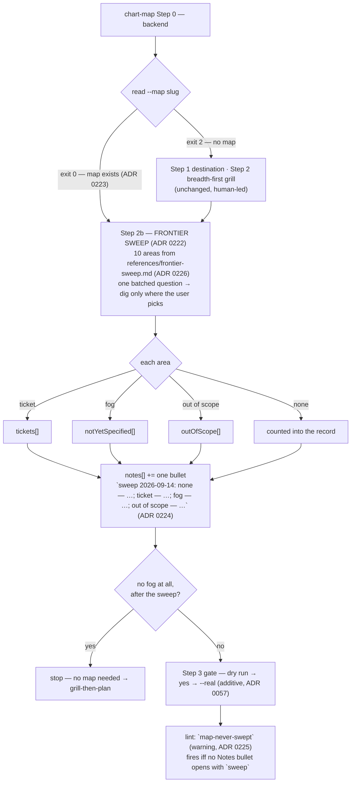
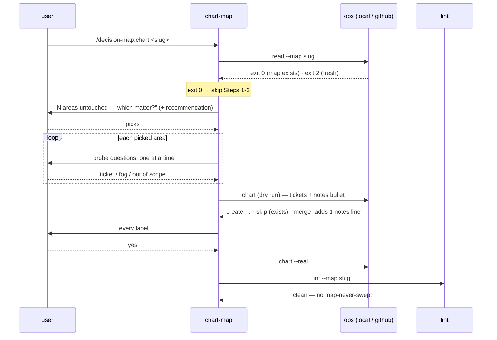

# decision-map — the frontier sweep: chart-map covers the areas the human did not raise

- **Date:** 2026-09-14
- **Status:** Approved for planning (pending owner sign-off on this spec)
- **ADRs:** [0222](../../adr/workflow-daily-work-0222-chart-map-runs-a-frontier-sweep-after-the-human-led-grill.md),
  [0223](../../adr/workflow-daily-work-0223-maps-charted-before-the-sweep-are-swept-by-an-additive-re-chart-flagged-by-lint.md),
  [0224](../../adr/workflow-daily-work-0224-the-sweep-record-is-one-notes-bullet-per-sweep-read-by-a-prefix-lint-rule.md),
  [0225](../../adr/workflow-daily-work-0225-map-never-swept-fires-on-every-map-without-a-record-finished-or-not.md),
  [0226](../../adr/workflow-daily-work-0226-the-frontier-sweep-list-is-ten-fixed-areas-drawn-from-published-frameworks.md)
- **Plugin:** `decision-map` — `0.13.0 → 0.14.0` (plugin.json and marketplace.json together)
- **Glossary:** `CONTEXT.md` decision-map section gains **Frontier sweep** (already written)



Read top-down: the only new box on a fresh chart is Step 2b; on an existing map the run
enters at Step 2b directly. Everything the sweep produces goes through the `chart` input
that already exists, and the record is an ordinary notes line.

## 1. The problem

[chart-map Step 2](../../../plugins/decision-map/skills/chart-map/SKILL.md) says *"fan out
across the whole space, never deep"* and never names the space. The frontier is therefore
exactly as wide as what the human happens to raise, and live software maps were observed
with no ticket, fog line or out-of-scope line about security, authorization, backup and
rollback, or deployment limits — not decided, never asked. Worse, the map cannot show the
difference: "Not yet specified" and "Out of scope" record only what was said, so a
missing security ticket is invisible to every later session.

The owner's framing (2026-09-14): *"decision map สำหรับ software engineer ยังสร้างคำถามไม่ครบ —
ขาด nonfunctional, functional, security, RBAC, backup/rollback, deploy limitation"*, and then
*"แล้ว map เก่าที่สร้างคำถามไปแล้วจะทำไง"*.

## 2. Scope

- **In:** one new reference file and one new step in `chart-map`; chart-map's existing-map
  entry (re-chart = sweep only) and the description/trigger change that permits it; one
  lint rule in `map_core.py` with tests on both backends; the contract's lint table and
  `ticket: null` paragraph; the decision-map README row and the PLAYBOOK row; one eval
  case; the version bump; the regenerated `skills/` tree.
- **Out (deliberate):** any change to `work-map` (breadth stays chart-map's job,
  [work-map SKILL.md:331](../../../plugins/decision-map/skills/work-map/SKILL.md)); any
  change to `sp-grill-with-doc`; a new map region or `map_input.json` field (ADR 0224
  rejected it); per-destination-kind lists (ADR 0226); the ADO backend (ADR 0059).

## 3. Step 2b — the sweep, inside chart-map

Inserted after Step 2's milestone questions ("what ships first / and after that") and
before Step 3. Behaviour, in order:

1. **Load the list** from `references/frontier-sweep.md` (skill-relative path — the
   skill's own file, per CLAUDE.md).
2. **Mark what the human-led pass already covered.** For each of the ten areas, decide
   from the tickets, fog and scope lines already named this session whether the area is
   *touched* (at least one line clearly belongs to it) or *untouched*. This classification
   is the agent's, like the ticket/fog/scope verdict; it is not asked.
3. **One batched HITL question**, in the user's terms, naming only the untouched areas
   with their one-line gloss from the reference file, and leading with a recommendation
   (the HITL guard of Step 1 applies): *"These N areas have not come up — which of them
   matter for this map? My guess: X and Y, because …"*. The user may pick some, none, or
   say "all of them are fine".
4. **Dig one area at a time, only into the picked ones**, using that area's probe
   questions. Each picked area ends as a ticket, a fog line or an out-of-scope line, by
   Step 2's own test ("can you state the question now?"). A picked area may yield more
   than one ticket.
5. **Every unpicked area is `none`.** It is not asked about further.
6. **Write the record** — one entry appended to `map.notes` (see §6).
7. **Only now** apply Step 2's "no fog at all → stop, no map needed" rule. The existing
   sentence moves below the sweep; its wording does not change.

The diagram at the top of chart-map's SKILL.md gains a line under ③: `sweep the ten
areas the human did not raise` — and ④'s "no fog anywhere? STOP" moves under it.

**Re-chart entry (ADR 0223).** Step 0 already fixes `<ops>` and the slug. Immediately after
that, chart-map runs `read --map <slug>`. Exit 2 → a fresh chart, continue to Step 1. Exit 0
→ the map exists: say so in one line, quote its destination, skip Steps 1 and 2 entirely and
run Step 2b with "already covered" computed from the map as read (tickets, fog and scope
regions) rather than from this session. Then Step 3 as normal — the dry run will read almost
entirely `skip (exists)` plus `create` for any new ticket and one `merge` line for the map
body (`adds 1 notes line, …`). Step 4 fires any `research` ticket the sweep created, Step 5
lints and reports. The frontmatter `description` changes from *"do NOT use to continue a
map that already exists (that is work-map)"* to *"on a map that already exists it runs only
the frontier sweep — continuing the map's decisions is work-map"*, and the description
gains the trigger phrases *"sweep the map", "did we cover security / rollback / deploy",
"lint says never swept"*.



## 4. `references/frontier-sweep.md` — the list (ADR 0226)

One file under `plugins/decision-map/skills/chart-map/references/`. It opens with the
diagram-convention overview (a small flowchart: ten areas → four verdicts → one record),
then one section per area. Each section has: the **area slug** used in the record, a
**one-line gloss** the batched question quotes, **two or three probe questions** in the
user's terms, and the **source** it is drawn from. The plan transcribes this table:

| # | slug | gloss (quoted in the batched question) | probes | source |
|---|---|---|---|---|
| 1 | `scope` | what it does, what it will not do, who uses and who owns it after | Which flows are explicitly *not* in this effort? Who owns it once it ships? | Google design doc — goals and non-goals |
| 2 | `functional` | flows we cannot yet say how they work | Which user flow can you not describe end to end today? Which edge case do you already know exists? | ISO 25010 functional suitability |
| 3 | `performance` | load, spikes, growth, acceptable latency | How much load on day one and in six months? Is there a spike? What latency is *unacceptable*? Does it have to survive 10×? | SRE launch checklist; ISO 25010 performance efficiency; WAF performance |
| 4 | `reliability` | what happens when it breaks, and how it comes back | What breaks first and what do users see? Is there a backup, and who has restored from it? How long can it be down, how much data can be lost? | SRE failover/backup; ISO 25010 reliability (recoverability) |
| 5 | `security` | what we are protecting, from whom, and where the trust boundary is | What are we working on, and what can go wrong? Where do secrets live? What crosses a trust boundary? | OWASP four questions; ISO 25010 security |
| 6 | `identity` | who can do what, and how we prove it afterwards | Which roles exist and what can each one *not* do? Is it multi-tenant? Does anyone need an audit trail? | ISO 25010 accountability; architecture review checklist |
| 7 | `data` | personal data, migration, retention, who owns the data | Is there personal data, and what must happen to it? Does existing data have to move, and can the old shape and the new one coexist? How long is data kept? | Google design doc — privacy; review checklist — data ownership |
| 8 | `deploy` | environments, rollback, deploy windows, platform limits | Which environments exist? Can this be rolled back, and has that been tried? Is there a deploy window or a platform limit (quota, region, version) that constrains the design? What must deploy in what order? | Octopus/Cortex deployment checklists; SRE rollout planning |
| 9 | `operations` | what we watch, who is paged, what the runbook says | What signal tells us it is unhealthy before a user does? Who is on call? Is there a runbook? | SRE monitoring; Azure WAF operational excellence |
| 10 | `dependencies` | third parties, cost, and rules we must obey | Which external service can take this down, and what degrades when it does? What does it cost to run, and who pays? Which law, policy or contract binds the design? | SRE external dependencies; AWS WAF cost; compliance |

Two areas are recorded in the file as **deliberately excluded** with one line each, so the
next editor sees they were considered: usability/accessibility and maintainability
(ADR 0226).

## 5. `map-never-swept` — the lint rule (ADRs 0223, 0225)

Implemented once, in `lint_findings` in
[map_core.py](../../../plugins/decision-map/scripts/map_core.py), so both backends get it:

- **Severity:** warning. **Ticket:** `None` — the fourth `ticket: null` finding, beside
  `gist-budget`, `milestone-line-unparsable` and `milestone-duplicate-slug`.
- **Fires when:** the Notes region (between `decision-map:notes` markers) contains no
  bullet whose text, after the leading `- ` and any whitespace, starts with `sweep`
  (case-insensitive, followed by a space or a colon). A map with **no notes region at
  all** (a legacy paragraph Notes, pre-ADR 0101) also fires — it cannot carry the record.
- **Never fires on notChecked:** the rule needs only the map text, which every backend
  has, so it is never listed under `notChecked`.
- **Message:** `this map carries no frontier-sweep record (no Notes bullet opening with
  'sweep'); it was charted before the sweep existed, or the record was deleted. Re-run
  /decision-map:chart <slug> to sweep it, or if you have reviewed it by hand add a Notes
  bullet 'sweep <date>: reviewed, accepted as-is' (ADRs 0223, 0225).`
- **Contract:** one new row in the lint table of
  [data-contracts.md](../../../plugins/decision-map/references/data-contracts.md) after
  `fog-line-graduated`; the paragraph *"Three findings carry `ticket: null`"* becomes four
  and names it; the sentence *"`fog-line-graduated` is the only heuristic rule"* stays true
  and gains *"— `map-never-swept` is an exact prefix match, not a heuristic"*.
- **Reporting:** chart-map Step 5 and work-map Steps 1/7 already print every finding;
  nothing changes there. A fresh chart lints clean by construction because Step 2b wrote
  the record before `--real`.

## 6. The record (ADR 0224)

One entry in `map.notes` per sweep run, written by chart-map into `map_input.json` and
rendered by `chart` as an ordinary Notes bullet. Grammar, fixed so a later lint rule could
parse it if ever wanted:

```
sweep <YYYY-MM-DD>: none — <slug>, <slug>; ticket — <key>[, <key>]; fog — <slug>; out of scope — <slug>
```

- Every one of the ten area slugs appears exactly once, under one verdict; a verdict with
  no areas is omitted. Under `ticket` the entries are **ticket keys**, not area slugs, so
  the reader can jump to them; an area that produced two tickets lists both keys.
- On a re-chart the line is a new bullet; earlier sweep lines are never edited (union
  never deletes). Two `sweep` bullets on one map are legal and read as two runs.
- The hand-written form `sweep <date>: reviewed, accepted as-is` is legal and satisfies
  the rule (ADR 0225).
- Because the line is flattened like every notes entry (ADR 0101), it must not contain a
  line break; the tool collapses one to a space anyway.

## 7. Files touched

| file | change |
|---|---|
| `plugins/decision-map/skills/chart-map/references/frontier-sweep.md` | **new** — §4 |
| `plugins/decision-map/skills/chart-map/SKILL.md` | description + triggers; diagram; Step 0 `read` probe and re-chart entry; Step 2b; move the no-fog stop; Step 5 report gains "areas swept: N none / N ticket / …" as one line |
| `plugins/decision-map/scripts/map_core.py` | `map-never-swept` in `lint_findings` |
| `plugins/decision-map/scripts/test_local_map_ops.py`, `test_github_map_ops.py` | §8 tests |
| `plugins/decision-map/references/data-contracts.md` | §5 contract edits; the `map_input.json` note on `notes` gains one sentence naming the sweep bullet |
| `plugins/decision-map/README.md` | chart-map row (L115) mentions the sweep and the re-chart |
| `PLAYBOOK.md` | chart-map row (L86) gains "…and sweeps the ten areas the human did not raise; re-run it on an existing map to sweep it" |
| `plugins/decision-map/.claude-plugin/plugin.json`, `.claude-plugin/marketplace.json` | `0.13.0 → 0.14.0`, description sentence about the sweep |
| `plugins/decision-map/skills/chart-map/evals/evals.json` | **new** — §8 |
| `skills/` | regenerated with `python3 scripts/generate_skills_tree.py`; `check_skills_tree.py` must pass |
| `CONTEXT.md`, ADRs 0222–0226 | already written |

## 8. Tests and the eval

**Unit (both backends, mirrored):**

- a map whose Notes has no `sweep` bullet → exactly one `map-never-swept` warning,
  `ticket: None`, not in `notChecked`;
- a map with `- sweep 2026-09-14: none — security; ticket — auth-model` → silent;
- a map with `- Sweep 2026-09-14: reviewed, accepted as-is` → silent (case-insensitive);
- a map with a bullet containing `sweep` but not opening with it (`- the sweep is
  pending`) → fires;
- a legacy map with paragraph Notes (no markers) → fires;
- round trip: `chart` with `notes: ["sweep 2026-09-14: none — …"]` on an existing map →
  dry run reports `merge … adds 1 notes line`, `--real` writes it, `lint` is then clean;
  the local test asserts the bullet text byte-for-byte, the GitHub test asserts it in the
  issue body through `fake_github`.

**Eval** (`skills/chart-map/evals/evals.json`, one case): a prompt charting a small
internal web tool where the user talks only about features and UI, never security,
rollback or deploy. Assertions: the transcript asks, in one batched question, about areas
the user did not raise and names security and deploy among them; it does not ask ten
separate questions before the user's own concerns; every unpicked area lands under `none`
in a single `sweep <date>:` notes bullet in the dry run; the "no map needed" stop is not
declared before the sweep.

## 9. Self-review

- Placeholders: none — the record grammar, rule name, message text and the ten slugs are
  fixed above.
- Consistency: ADR 0222's "none is recorded" = §6; ADR 0223's re-chart = §3 re-chart entry
  and the description change; ADR 0224's prefix match = §5 fire condition; ADR 0225's
  "finished or not" = §5 has no status clause; ADR 0226's ten areas = §4.
- Load-bearing claims verified 2026-09-14 against the code: `read` on a missing slug exits
  2 with empty stdout; `lint_findings(map_text, tickets, …)` is the one shared function and
  already emits `ticket: None` findings; `chart` unions `notes` lists on both backends
  (ADR 0101, `map_core.py` L886–901) and the dry run words a body merge as `adds N notes
  line(s)`; evals live at `skills/<name>/evals/evals.json`; the `skills/` tree is
  generated by `scripts/generate_skills_tree.py` and guarded by `check_skills_tree.py`.
- Ambiguity left on purpose: what counts as an area "touched" by the human-led pass is the
  agent's judgement (§3 item 2), like the ticket/fog/scope verdict itself; the eval, not a
  rule, checks it.
