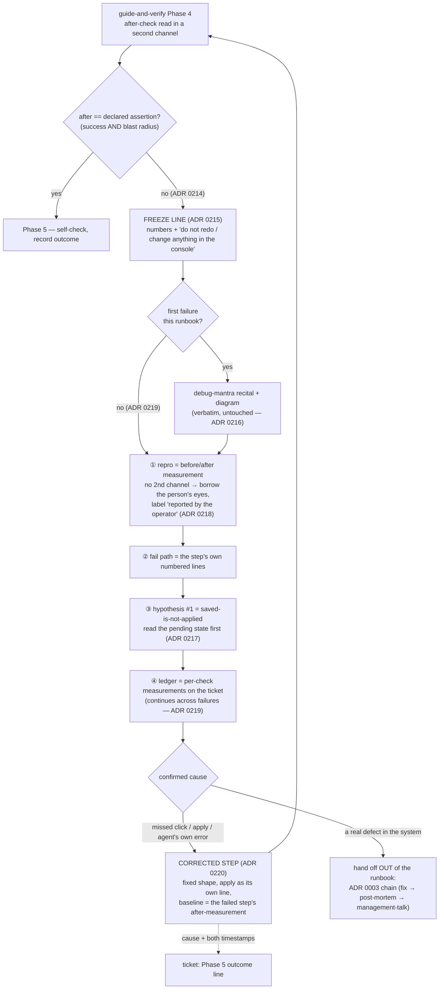

# guide-and-verify — a failed after-check hands off to debug-mantra
> **Refined by ADR 0221 (2026-09-14, whole-branch review):** the Freeze line reads *"do not redo the step or change anything in the console"*, not *"touch the console"* — a read-only look the agent asks for is not a redo. §3 item 2's quoted line and the row-③ cell below are superseded by the shipped SKILL.md wording.

- **Date:** 2026-09-14
- **Status:** Approved for planning (pending owner sign-off on this spec)
- **ADRs:** [0214](../../adr/workflow-daily-work-0214-guide-and-verify-hands-a-failed-after-check-to-debug-mantra.md),
  [0215](../../adr/workflow-daily-work-0215-a-failed-after-check-opens-with-a-one-line-freeze-before-the-mantra.md),
  [0216](../../adr/workflow-daily-work-0216-the-handoff-lives-in-guide-and-verify-only-debug-mantra-is-not-edited.md),
  [0217](../../adr/workflow-daily-work-0217-the-handoff-maps-what-it-holds-onto-the-four-steps-and-ranks-saved-not-applied-first.md),
  [0218](../../adr/workflow-daily-work-0218-with-no-second-channel-the-handoff-still-fires-and-borrows-the-persons-eyes.md),
  [0219](../../adr/workflow-daily-work-0219-the-runbook-session-is-one-debug-session-recite-once-keep-one-ledger.md),
  [0220](../../adr/workflow-daily-work-0220-a-confirmed-cause-returns-as-a-corrected-step-recorded-on-the-ticket.md)
  (the caller-side mirror of [0011](../../adr/0011-grill-then-plan-verifies-cause-first.md))
- **Plugin:** `dev-workflows` — `0.54.0 → 0.55.0` (plugin.json and marketplace.json together)
- **Glossary:** `CONTEXT.md` gains a *guide-and-verify terms* section with **Freeze line**
  and **Corrected step** (already written)



Read top-down: the only new branch is the *no* edge out of the assertion check. Everything
under it is `guide-and-verify` text; `debug-mantra` is entered as-is and returns a cause,
and the runbook resumes with a corrected step asserted against a fresh baseline.

## 1. The problem

[guide-and-verify SKILL.md L177–178](../../../plugins/dev-workflows/skills/guide-and-verify/SKILL.md)
says, when the after-check fails: *"say so plainly with the numbers, and diagnose before
proposing a redo. Half-applied is the common outcome, and telling them to 'try again' on a
step that partly landed makes it worse."* It names no method for *diagnose*. In practice the
agent improvises, and the improvisation is "try again" — the one instruction the sentence
forbids. Meanwhile the repo already has the method (`debug-mantra`) and a precedent for a
caller adopting it at its own weak point (ADR 0011: `grill-then-plan` verifies the cause
before grilling a fix).

The owner's framing (2026-09-14): *"guide-and-verify has a step that checks the environment
— so the skill should call debug-mantra."*

## 2. Scope

- **In:** one new subsection in `guide-and-verify`'s Phase 4; the `PLAYBOOK.md` row and WORK
  diagram; the `plugin.json` description sentence; one eval case; the version bump; the
  regenerated `skills/` tree.
- **Out (deliberate):**
  - **Any edit to `debug-mantra`** — owner's ruling, ADR 0216. Not the recital, not the
    diagram, not the prose.
  - **The reverse link** (debug-mantra using guide-and-verify for human-run probes) — raised
    in conversation, explicitly not what the owner asked for; a separate design if ever.
  - **Phase 1 document contradictions and Phase 2 unverifiable predictions** — not
    malfunctions (ADR 0214 rejected branches).
  - **A post-mortem for a failed runbook step** — ADR 0220; the ADR 0003 chain is entered
    only when the confirmed cause is a defect in the system.
  - **`daily` router text** — the "something broke" station already routes to
    `debug-mantra`; a failed runbook step is reached from inside `guide-and-verify`, not from
    the router, so the router does not change.

## 3. The change to `guide-and-verify`

Insert a new subsection at the end of Phase 4 (after the "If the check fails…" paragraph,
before Phase 5), titled **"When the check fails: hand off to debug-mantra"**. It replaces
nothing; the existing paragraph stays as the lead-in. Content, in this order — the plan
should transcribe it, not paraphrase it:

1. **The rule and its invariant.** A failed after-check — success condition *or* blast
   radius — hands off to `debug-mantra`. Never propose a redo on an unverified cause
   (ADR 0214; the mirror of ADR 0011).
2. **The freeze line comes first** (ADR 0215). Before anything else the person reads one
   line in the runbook's own shape, with the numbers:
   *"Check failed: expected `<assertion>`, got `<measured>`. Do not redo the step or change anything in the
   console — a redo destroys the state that tells not-saved from not-applied from wrong-object.
   I am finding out why first."*
   Then load `debug-mantra` via the harness's mechanism (harness-neutral wording — never
   name one harness's tool).
3. **What you already hold, per step** (ADR 0217) — a four-row table:

   | debug-mantra step | you already have |
   |---|---|
   | ① reproduce | the baseline and the after-measurement — the repro is the diff; the environment is the one the runbook names (no "local or deployed?" to ask) |
   | ② fail path | the step's own numbered actions — "which line did not land" |
   | ③ falsify | **hypothesis #1 is always the saved-is-not-applied trap**: read the pending state first (the table under *The trap that catches nearly every system* says where); rank the rest yourself |
   | ④ breadcrumbs | the per-check measurements you wrote on the ticket in Phase 1 — a half-applied step shows as a contradiction between two of them |

4. **No second channel** (ADR 0218): the handoff still fires; step ① is met by borrowing the
   person's eyes — one read-only look, pasted back — and that run, and every claim built on
   it, is labelled *reported by the operator, not independently measured*.
5. **A second failure in the same runbook** (ADR 0219): the runbook session is one debug
   session. Send the freeze line again, re-enter at step ①, do not re-recite, keep the ledger.
6. **When the cause is confirmed** (ADR 0220): resume at Phase 3 and write a **corrected
   step** in the fixed shape — the missing apply/publish as its own numbered line — asserted
   against the failed step's after-measurement as its baseline. Never "try again". If the
   cause was yours (a Phase 1 count, a Phase 2 prediction), say so and correct the runbook.
   Write the cause and both timestamps into the Phase 5 outcome line on the ticket. If the
   cause is a real defect in the system, that is a hand-off *out of* the runbook to the
   ADR 0003 chain — name it as such and stop the runbook there.

Style constraints on the new text: same voice as the rest of the file (short sentences,
"the person", no editorialising about risk); use the CONTEXT.md terms **Freeze line** and
**Corrected step**; cite ADRs by bare number (in-repo citation, ADR 0093).

## 4. Surrounding files

| File | Change |
|---|---|
| `PLAYBOOK.md` — `guide-and-verify` row (L103) | append: *"— and when an after-check fails, it hands off to `debug-mantra` (freeze line first, saved-is-not-applied as hypothesis #1) and returns with a corrected step (ADRs 0214–0220)"* |
| `PLAYBOOK.md` — WORK mermaid | add node `GAV["guide-and-verify"]` on an edge `WORK -- hand-work in a console I can't write to --> GAV`, and a dotted edge `GAV -. after-check fails .-> DM`. Verified: the diagram has no `guide-and-verify` node today, only the table row |
| `plugins/dev-workflows/.claude-plugin/plugin.json` — description | in the guide-and-verify sentence, after "…or you cannot read the system at all", append: *"; a failed after-check hands off to debug-mantra behind a one-line freeze and returns with a corrected step, never 'try again'"* |
| `plugins/dev-workflows/skills/guide-and-verify/evals/evals.json` | add case `id: 3`, `name: "failed-after-check-hands-off"` — see §5 |
| `plugins/dev-workflows/.claude-plugin/plugin.json` + `.claude-plugin/marketplace.json` | `0.54.0 → 0.55.0`, both |
| `skills/` (generated tree) | `python3 scripts/generate_skills_tree.py` then `python3 scripts/check_skills_tree.py` |

## 5. The eval case

```mermaid
sequenceDiagram
    participant U as user (eval prompt)
    participant A as agent
    U->>A: "I did step 2 (published the form). Here is the dig / query output — it still shows the old value."
    A->>U: freeze line (numbers, do-not-redo with reason)
    A->>U: mantra recital (first failure)
    A->>U: ① repro = before/after; ③ hypothesis #1 = saved-not-applied — "read the pending state"
    U->>A: pending state pasted
    A->>U: corrected step in fixed shape (apply as its own line), outcome line for the ticket
```

Prompt sketch: the RDS case from eval 1 continued — the user reports the parameter change
done, pastes `SHOW log_min_duration_statement` returning `-1`, and asks what to do.
Assertions (each one a design decision):

- The first line the user reads states expected vs measured **and** tells them not to redo
  the step or change anything in the console, with the reason (ADR 0215).
- It does not tell the user to "try again" anywhere (ADR 0220).
- It names the saved-is-not-applied gap (pending-reboot / apply) as the first thing to check,
  before any other hypothesis (ADR 0217).
- It does not ask the user for a reproduction; it treats the before/after readings as the
  repro (ADR 0217).
- The corrected step, when given, puts the apply/reboot action as its own numbered line and
  states the baseline it is asserted against (ADR 0220).
- It records, or says it will record, the cause and the timestamps on the ticket (ADR 0220).
- If the prompt variant says no read-only channel exists, the response labels the user's
  report as *reported by the operator, not measured* rather than *verified* (ADR 0218).

## 6. Verification of load-bearing claims (Step 5a)

All checked against the tree on 2026-09-14, commit `c781c68`:

- Phase 4's "diagnose before proposing a redo" sentence exists at L177–178 and names no
  method — confirmed by reading the file.
- `debug-mantra` recites once per session and stops on no-repro (L57, L111) — confirmed; the
  handoff text works around both without editing them.
- `PLAYBOOK.md`'s WORK diagram carries `DM["debug-mantra…"]` and no `guide-and-verify` node —
  confirmed (L68 and the diagram block).
- `evals.json` is a flat list with `id`, `name`, `prompt`, `expected_output`, `files`,
  `assertions` — confirmed; case 3 follows that shape.
- Neither skill is in `references/vendored-superpowers.json` — confirmed by grep (exit 1), so
  the resync checker is not involved.
- Global max ADR was 0213 before this session; 0214–0220 were minted from it. **Re-verify
  the numbers immediately before merging** (CLAUDE.md, ADR 0056) — the bash scan in
  `grill-then-plan/ADR-FORMAT.md`; the sed-based helper is GNU-only and prints an empty
  number on macOS.
- The generator is `scripts/generate_skills_tree.py` (usage confirmed via `--help`); the
  gate is `scripts/check_skills_tree.py`.

## 7. Out-of-band notes for the implementer

- Harness-neutral wording only (CLAUDE.md): "load `debug-mantra` via your harness's
  mechanism", never "call the Skill tool".
- The new subsection cites its ADRs by bare number; the PLAYBOOK row cites the range.
- Do not touch `plugins/dev-workflows/skills/debug-mantra/` — ADR 0216 is an owner ruling.
