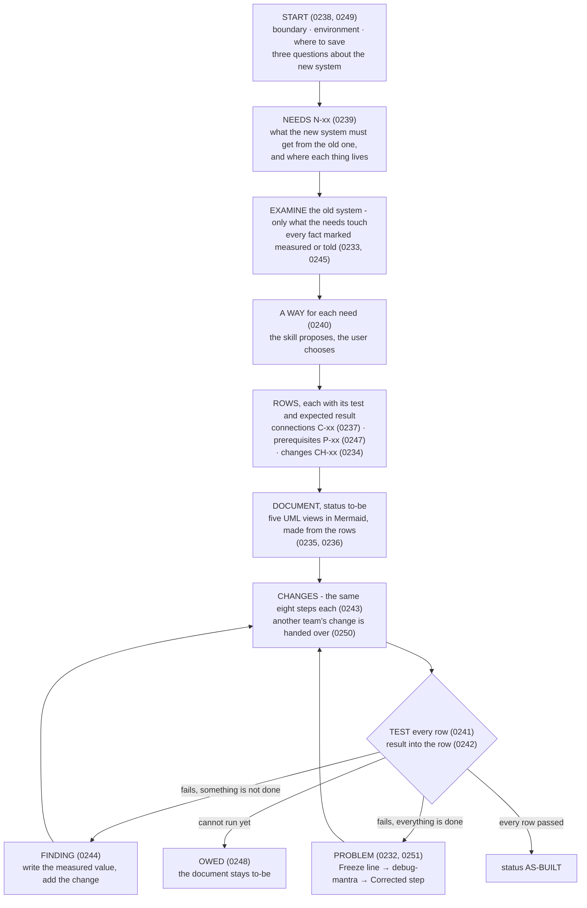
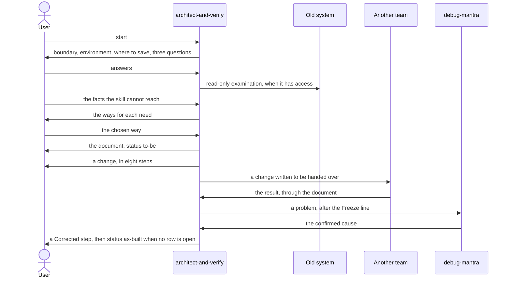
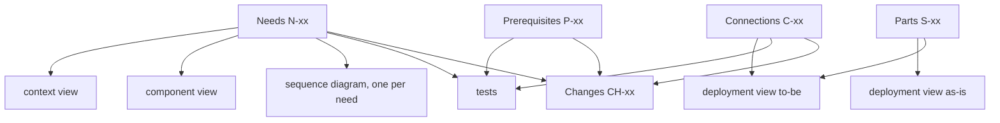
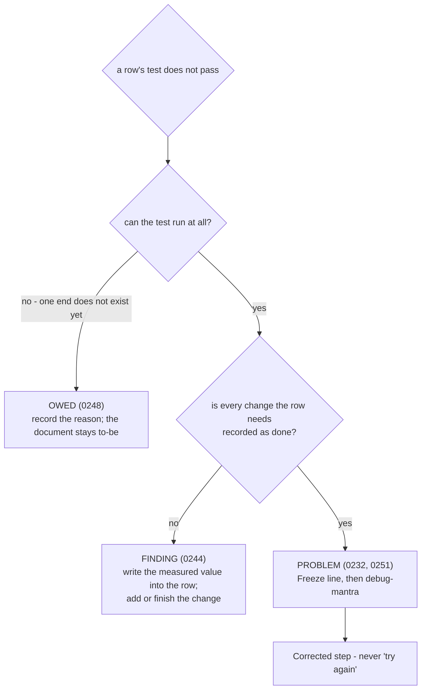

# architect-and-verify — the architecture document of a new system that must join an old one, proven row by row
> **Refined by ADRs 0258 and 0259 (2026-10-03, at planning):** in §5 a zone is a label on a part, not a kind of part row; a part with no fact a command can read carries dashes and is never open; a connection that serves no need of the old system names its reason in the Need column. §5 below already reads that way.
>
> **Refined by ADR 0260 (2026-10-03, during execution):** §4 Phase 1 asks only the start questions the user has not already answered, and the answers given become the document's first section; §9 case 0 measures that order, and that no answered question is asked again. No one-turn case measures the question round itself.

- **Date:** 2026-10-03
- **Status:** Approved for planning — owner sign-off 2026-10-03
- **ADRs:** one per decision, 0231–0251 —
  [0231](../../adr/workflow-daily-work-0231-the-architecture-document-skill-copies-the-guide-and-verify-steps-it-needs-and-never-loads-it.md) copy, never load ·
  [0232](../../adr/workflow-daily-work-0232-the-architecture-document-skill-hands-a-problem-to-debug-mantra-not-to-a-rule-of-its-own.md) a problem goes to debug-mantra ·
  [0233](../../adr/workflow-daily-work-0233-a-fact-the-user-provides-carries-a-mark-measured-or-told-and-every-told-fact-gets-a-test-row.md) measured / told ·
  [0234](../../adr/workflow-daily-work-0234-the-architecture-document-skill-guides-each-change-step-by-step-it-does-not-only-list-it.md) changes are guided ·
  [0235](../../adr/workflow-daily-work-0235-the-architecture-document-skill-draws-its-uml-views-in-mermaid-the-diagram-convention-does-not-change.md) UML views in Mermaid ·
  [0236](../../adr/workflow-daily-work-0236-the-architecture-document-carries-five-views-context-deployment-as-is-and-to-be-component-sequence.md) five views ·
  [0237](../../adr/workflow-daily-work-0237-a-connection-table-row-is-the-source-its-arrow-and-its-test-are-made-from-it-and-carry-its-id.md) the row is the source ·
  [0238](../../adr/workflow-daily-work-0238-the-architecture-document-skill-asks-three-questions-about-the-new-system-before-it-examines-the-old-one.md) three questions first ·
  [0239](../../adr/workflow-daily-work-0239-what-the-draft-calls-reuse-is-a-need-one-row-per-thing-the-new-system-must-get-from-the-old-system.md) needs ·
  [0240](../../adr/workflow-daily-work-0240-the-skill-proposes-the-ways-to-meet-a-need-and-the-owner-of-the-architecture-chooses.md) the skill proposes, the user chooses ·
  [0241](../../adr/workflow-daily-work-0241-a-need-is-tested-until-the-data-arrives-a-port-that-answers-is-not-the-test.md) two test levels ·
  [0242](../../adr/workflow-daily-work-0242-a-test-result-is-written-into-the-row-it-tests-one-document-whose-status-moves-from-to-be-to-as-built.md) to-be → as-built ·
  [0243](../../adr/workflow-daily-work-0243-every-change-runs-the-same-eight-steps-including-the-before-state-and-what-must-not-change.md) eight steps ·
  [0244](../../adr/workflow-daily-work-0244-a-problem-is-a-test-that-fails-after-everything-it-needs-is-done-a-wrong-told-fact-is-a-finding.md) problem vs finding ·
  [0245](../../adr/workflow-daily-work-0245-the-skill-examines-read-only-tests-only-the-connections-in-the-table-and-never-writes-a-secret.md) three rules ·
  [0246](../../adr/workflow-daily-work-0246-the-skill-is-named-architect-and-verify.md) the name ·
  [0247](../../adr/workflow-daily-work-0247-a-prerequisite-table-row-is-the-source-of-its-test-and-its-change.md) prerequisite rows ·
  [0248](../../adr/workflow-daily-work-0248-a-connection-into-the-new-system-stays-owed-until-the-system-is-installed-no-temporary-listener.md) owed tests ·
  [0249](../../adr/workflow-daily-work-0249-one-architecture-document-per-environment-saved-where-the-user-says-at-the-start.md) one document per environment ·
  [0250](../../adr/workflow-daily-work-0250-a-change-that-belongs-to-another-team-is-written-so-that-team-can-follow-it-alone.md) handed-over changes ·
  [0251](../../adr/workflow-daily-work-0251-the-hand-off-to-debug-mantra-opens-with-a-freeze-line-and-returns-with-a-corrected-step.md) the hand-off's shape
  (precedents: [0214](../../adr/workflow-daily-work-0214-guide-and-verify-hands-a-failed-after-check-to-debug-mantra.md) and
  [0216](../../adr/workflow-daily-work-0216-the-handoff-lives-in-guide-and-verify-only-debug-mantra-is-not-edited.md) — the hand-off and "the callee is not edited";
  [0025](../../adr/0025-sa-doc-generates-from-central-model.md) — parts written separately contradict each other)
- **ADRs written on approval**, for what this spec decided first (§11):
  [0252](../../adr/workflow-daily-work-0252-the-architecture-document-has-one-fixed-layout-a-parts-table-and-the-same-five-columns-on-every-row.md) the fixed layout ·
  [0253](../../adr/workflow-daily-work-0253-a-run-that-finds-its-document-resumes-from-it.md) resume ·
  [0254](../../adr/workflow-daily-work-0254-architect-and-verify-is-one-skill-file-and-three-reference-files.md) the files ·
  [0255](../../adr/workflow-daily-work-0255-architect-and-verify-is-measured-by-six-eval-cases.md) six evals ·
  [0256](../../adr/workflow-daily-work-0256-the-architecture-document-has-one-sequence-diagram-per-need.md) one sequence diagram per need ·
  [0257](../../adr/workflow-daily-work-0257-no-validator-script-in-the-first-version-the-rows-are-the-source-and-the-evals-measure-it.md) no validator script
- **ADRs ruled at planning**, when the document template was written out in full:
  [0258](../../adr/workflow-daily-work-0258-the-five-columns-are-for-facts-a-command-can-read-a-zone-is-a-label-and-a-part-with-no-such-fact-carries-dashes.md) a zone is a label; a row with no readable fact carries dashes ·
  [0259](../../adr/workflow-daily-work-0259-a-connection-that-serves-no-need-of-the-old-system-names-its-reason-instead.md) a connection that serves no need names its reason
- **ADR ruled during execution**, when Task 2's review read the eval cases against §9:
  [0260](../../adr/workflow-daily-work-0260-a-start-question-the-user-has-already-answered-is-not-asked-again.md) a start question already answered is not asked again
- **Plugin:** `dev-workflows` — one minor bump above the global max at merge time. Today
  every ref holds `0.56.0`, and `0.57.0` exists only as an uncommitted edit in the main
  working tree (the `handoff` follow-up, ADR 0230). If that lands first, this is
  `0.57.0 → 0.58.0`; the plan computes it, it does not assume it.
- **Glossary:** `CONTEXT.md` gains an *architect-and-verify terms* section — **Measured
  fact**, **Told fact**, **UML view**, **Connection table**, **Parts table**,
  **Prerequisite table**, **Need**, **As-built**, **Change**, **Problem** (already written)



Read top-down: the skill asks about the new system, finds what it needs from the old
one, turns that into rows, and then every picture, every change and every test is made
from a row. The loop at the bottom is the proof: the document says to-be until no row is
left open.

## 1. The problem

The owner's request, 2026-10-03: a skill *"มีพื้นฐานจาก guide-and-verify แต่เป้าหมายปลายทางคือ
ต้องได้เอกสาร architecture และ uml ที่เกี่ยวข้อง จะใช้ขึ้นระบบใหม่"*, with three draft steps —
check the existing system and what in it the new application uses, look at the firewall,
then ask for the new architecture and how it plugs into the old system, so that the
connectivity tests and the software to install on the server can be prepared.

The failure this prevents: an architecture document drawn from what people believe — an
old diagram, a port someone remembers — is found wrong on go-live day. A blocked port, a
missing SDK or an account without permission stops the new system, and nobody can say
which belief was the wrong one.

No skill in the marketplace covers it. `guide-and-verify` guides one hand-made change
and writes no architecture. `sa-doc` generates the software design document from stated
requirements and never reads a live system. `drive-to-legacy` studies a codebase.
`study-design-verify` advises on one mechanism.

## 2. Scope

- **In:** the new skill — `SKILL.md`, three reference files, `evals/evals.json`; one
  PLAYBOOK row and two router edges; a description clause and the version in
  `plugin.json` and in `marketplace.json`; the regenerated `skills/` tree; ADRs
  0231–0251 and the glossary (done).
- **Out (deliberate):**
  - any edit to `guide-and-verify` (ADR 0231) or to `debug-mantra` (ADR 0216);
  - a command wrapper — the skill is invoked by its name (ADR 0246);
  - PlantUML or any second notation (ADR 0235);
  - the software design views — use case, class, data model; they are `sa-doc`'s
    (ADR 0236);
  - a network scan of any kind (ADR 0245) and a temporary listener (ADR 0248);
  - a validator script or a central model file — the rows of the document are the
    source; `sa-doc`'s machinery is not copied for v1;
  - `.agents/skills/` and `skills-lock.json` — an install snapshot that is already
    missing `handoff` and `practice-english-writing`;
  - the skill table in `plugins/dev-workflows/README.md` — it is not the registry
    (`guide-and-verify`, `handoff` and `read-picture` are not in it either); the
    Playbook is;
  - the stale `skills/handoff/SKILL.md` and the uncommitted `0.57.0` bump — other work
    sitting in the main working tree, not part of this.

## 3. The skill's files

```
plugins/dev-workflows/skills/architect-and-verify/
  SKILL.md                          the run (§4) and the rules that hold all run long
  references/document-template.md   the architecture document (§5)
  references/change-steps.md        a change, and a test that does not pass (§6, §7)
  references/ways-to-meet-a-need.md the proposals (§8)
  evals/evals.json                  six cases (§9)
```

**Frontmatter.** `name: architect-and-verify`, and this `description`:

> Write the architecture document for a new system that must work with an existing one,
> and prove it row by row - what the new system needs from the old one, the connections
> and the server prerequisites as tables, five UML views drawn in Mermaid, every change
> guided step by step, and every row tested until the document moves from to-be to
> as-built. Use this whenever a new application has to be brought up beside or on top of
> an old system: the user says bring up or go live with a new system, ขึ้นระบบใหม่, the new
> app must use data or logins from the old system, how will it plug into what we have,
> write the architecture document, draw the deployment or UML diagram, which ports or
> firewall rules do we need, test the connectivity, what must be installed on the server
> first (an SDK, a runtime, a driver). Use it even when the agent cannot reach the old
> system - the user then provides the facts and each one is marked measured or told. Do
> not use it for one hand-made change in a console with no architecture to write (that
> is guide-and-verify), for the software design document - use cases, classes, data
> model (that is sa-doc), or for studying an unfamiliar codebase (that is
> drive-to-legacy).

**When each reference is read.** `SKILL.md` names the moment: `document-template.md`
before the document is created; `ways-to-meet-a-need.md` when the first need needs a
way; `change-steps.md` before the first change is guided or the first test fails.

**Wording rules.**

- Harness-neutral: *load `debug-mantra` through your harness's mechanism*, never a tool
  name.
- The skill's own files are named by skill-relative path (`references/…`). The only
  plugin-root reference is `${CLAUDE_PLUGIN_ROOT}/references/diagram-convention.md`.
- `guide-and-verify` is named in two places only: the *do not use it for* sentence of
  the description, and one provenance line at the top of `change-steps.md` — *this
  method was copied from `guide-and-verify` on 2026-10-03 and is kept here separately
  (ADR 0231)*. Nothing tells the reader to load it.

## 4. The run — `SKILL.md`



The skill talks to four parties, and to the old system only by reading. Another team is
reached through the document, never through the session.

| Phase | What the skill does | What the user sees | ADRs |
|---|---|---|---|
| **0. Resume** | When the user names an existing document — or one already sits at the default path for the system and environment they name — the skill reads it first, reports the status, the open rows, the changes not yet checked and the tests owed, and continues from there. With no document, the run starts at Phase 1. | A status line and the list of what is open | 0242, 0249 |
| **1. Start** | Says the boundary out loud: *"I read and I test. I do not change either system. Every change below is yours or your colleagues'."* Asks, in one round: the environment, where to save the document, and the three questions. Creates the document with its header and empty tables. | Five short questions, then the path of the new file | 0238, 0245, 0249 |
| **2. Needs** | Writes one needs row per thing the new system must get, and finds where each thing lives in the old system. | The needs table, each row with its mark | 0239, 0233 |
| **3. Examine** | Examines only what the needs touch: the servers that hold those things, the zones and firewalls on the path, the server the new system runs on. Reads where it has access; otherwise asks the user for the output of one read-only command, or takes the user's words or an old document. Writes each fact into its row when it is taken. | The parts table; every told fact with its test | 0233, 0238, 0245 |
| **4. Ways** | Proposes, for each need, the ways that can work, each with one advantage and one cost. The user chooses. Then takes the rest of the new architecture: where each new part runs. | The proposals, then the chosen way in the row | 0240 |
| **5. Rows** | Writes the connection rows, the prerequisite rows and the changes. Every row gets its test and its expected result before anyone acts. | The three tables | 0237, 0247, 0234, 0241 |
| **6. Document** | Makes the five views from the rows and saves the document with status to-be. | The document | 0235, 0236, 0242 |
| **7. Changes and tests** | Guides each change in the eight steps, or writes it to be handed over. Tests every row and writes each result into its row. A test that does not pass is a finding, a problem, or owed (§7). When no row is open, the status becomes as-built. | Results in the rows; the status line | 0243, 0250, 0241, 0242, 0244, 0248, 0232, 0251 |

**The three questions** (ADR 0238), asked in these words:

1. What is the new system, and who uses it?
2. What does it run on — the language or runtime, the database, and the server or
   service it will be installed on?
3. What must it get from the old system — data, a login, a function — and from which
   old system?

**The three rules** (ADR 0245) stand at the top of `SKILL.md` and hold in every phase:
examination only reads; only the connections in the connection table are tested, and the
network is never scanned; an account may be named, a password, a key or a token is never
written.

**Recording.** A fact is written into its row when it is taken, not in a batch at the
end. The document is created in Phase 1 for that reason: a run can be interrupted at any
point and Phase 0 picks it up from the file.

**What could not be measured** is said, in the document's last section: what it is, why
it could not be reached, and where a person can see it.

## 5. The document — `references/document-template.md`

One document per environment (ADR 0249), at the path the user gives; the default is
`docs/architecture/<system>-<environment>.md`.

**Header.** System · environment · status · the boundary sentence · the date of the last
change to any row. Status reads `to-be` or `as-built (N of N rows passed, <date>)`.

**Sections, in this order.** The context view (it is also the document's overview
diagram, which the Diagram convention requires at the top) · 1 The new system — the
three answers · 2 Needs · 3 The old system as-is — the old parts and the deployment view
as-is · 4 The new architecture — the new parts, the connection table, the deployment
view to-be, the component view, the sequence diagrams · 5 Prerequisites · 6 Changes ·
7 Not measured, and owed. The parts table is one table with one sequence of IDs, printed
in two halves: the old parts in section 3, the new parts at the top of section 4.

**Tables.** Every table row ends with the same five columns — **Mark · Test · Expected ·
Result · Date** — so one rule covers every row.

| Table | ID | Columns before the five | The fact its mark describes |
|---|---|---|---|
| Needs | `N-01` | Need · Lives in (old system) · Way · Connections | where the thing lives |
| Parts | `S-01` | Part · Kind (server, database, firewall, user device, external service) · Old or new · Zone · Facts | the facts |
| Connections | `C-01` | From · To · Port · Need · State now | the state now |
| Prerequisites | `P-01` | Server · Necessary · Source of the requirement · Installed now | what is installed now |

Changes are a fifth table without the five columns: `CH-01` · Change · For row · Owner ·
Status (to do, handed over, done, checked). Under the table each change has its
eight-step record (§6).

**Row rules.**

- A row is **open** until its mark is `measured` and its result equals its expected
  result. A told fact becomes measured when its test passes (ADR 0242).
- The document is as-built when no row is open, no change is unchecked and no test is
  owed.
- An ID is never reused. A row that is dropped keeps its ID and says why it was dropped.
- A change to a connection, a need or a prerequisite is made in its row and nowhere
  else; the arrow, the test and the change are made again from the row (ADRs 0237,
  0247).
- A connection test runs on the row's From part. A test from any other machine does not
  count.
- A zone is a label — the Zone column of the parts inside it — not a row. A part with no
  fact that a command can read has `—` in its five columns and is never counted as open;
  the connection rows that cross it test its effect (ADR 0258).
- There is no "as-built with exceptions": a row that has a fact and cannot be measured
  keeps the document to-be, and the last section says why.
- A connection that serves no need of the old system — users reaching the new system —
  has `—` and its reason in the Need column (ADR 0259).



Every view, test and change is made from rows; nothing is drawn or written that a row
does not carry.

**The five views** (ADRs 0235, 0236). Each is a Mermaid diagram of the type the Diagram
convention gives its shape: `graph TD` for the four structural views, `sequenceDiagram`
for the fifth.

| View | Made from | Rule |
|---|---|---|
| Context view | needs | one box for the new system, one per user group, one per old system named in a need; one edge per need, labelled with its ID and what is needed |
| Deployment view as-is | parts that are old | one `subgraph` per zone; one box per part; a firewall is a box between two zones |
| Deployment view to-be | all parts, and connections | the as-is view plus the new parts, each label ending in `(new)`; exactly one arrow per connection row, labelled `C-01 · 1433/tcp` |
| Component view | needs | the software parts on both sides; one edge per need, labelled with its ID and the chosen way |
| Sequence diagram | one need and its connections | one diagram per need; each message that crosses a connection names its `C-` ID |

Mermaid rules for all five: a node's id is the row ID without its hyphen (`S01`); every
label is quoted; `<br/>` is the only tag inside a label.

## 6. A change — `references/change-steps.md`

Every change runs the same eight steps (ADR 0243). The file is the new skill's own copy
of the method (ADR 0231), with this domain's examples.

| Step | What it holds | Copied from `guide-and-verify`'s |
|---|---|---|
| 1. Who acts | the boundary sentence; the owner of this change | *The boundary comes first* |
| 2. Measure before | the read-only check, run now, its result written into the row | *Measure the baseline* — never from a document; record when taken |
| 3. Save the before-state | the full state of what the change touches — installed software, the old application's services, the rule list — kept where it outlives the session | *Save the full state*, *Put it where it outlives the session*, *Ask first only when the snapshot needs the person* |
| 4. Expected result, and what must not change | the row's expected result; the things on the old system that must stay as they are | *Decide the assertion before the person acts*, the blast-radius assertion, *the predicted outcome is a claim* |
| 5. The steps | the fixed shape below, one step at a time | *Write the step in a fixed shape* and its rules |
| 6. Check after | the same check again, in a channel other than the one the person changed in; before against after; what must not change | *Verify — read-only, in a different channel*; *reported by the operator, not independently measured* when there is no second channel |
| 7. A mismatch stops the work | §7 | the hand-off block (ADRs 0214–0221) |
| 8. Record the result | the result, date and time in the row; a check the person can run alone | *Teach the self-check, and record the result* |

The step shape, copied with one addition — a server name in the *Go to* line:

```
## Step N — <what this achieves, in plain words>

**Go to:** <a real address, a server name, or an exact navigation path>

**Do:**
1. <one action>
2. <one action>

**Do not:**
- <thing> — <why, in one clause>

**How to verify yourself:** <a read-only check the person can run alone>

**Then report:** <who to tell, and where the result is written down>
```

Its rules are copied with it: one action per numbered line; a real address beats a
description; every *do not* carries its reason; the destructive near-miss is named;
order follows dependency; never batch; a one-way step says so and saves the present
value first; the report line names a destination that will still be there.

**Saved is not applied** is copied as a table for this domain: a firewall rule approved
or saved, against the rule active on the device; a DNS record edited, against the name
resolving; software installed, against the service restarted; a database account
created, against the permission in effect. The apply action is its own numbered line.

**A change that belongs to another team** (ADR 0250) gets the same eight steps, written
for a reader who has only the document: every identifier in full, nothing that points at
the session, a report line that names the row or a ticket. Its after-check is owed until
someone runs it.

**Not copied:** the raw count against the actionable count — it is about counting
objects in a console — and the console examples.

## 7. A test that does not pass



Three outcomes, and only one of them is a problem.

**The Freeze line** goes out first, before the mantra and before any question:

> Test failed: row `<ID>` expected `<expected>`, got `<result>`.
> Do not redo the change or alter anything on either system — a redo destroys the state
> that tells not-saved from not-applied from wrong-object. I am finding out why first.

Then `debug-mantra` is loaded and followed as written. What the skill already holds for
each of its four steps is the table of ADR 0251: the row's test is the repro; the fail
path is the layers between the two ends — name resolution, route, each firewall, the
host's own firewall, the listener, TLS, the account and its permission — and the lines
of the change just made; hypothesis #1 is *saved is not applied*; the ledger is the
results already in the rows.

With no second channel the hand-off still fires: one read-only look by the person,
pasted back, labelled *reported by the operator, not independently measured*. A second
problem in the same run sends the Freeze line again and re-enters at step ① with the
same ledger and no second recital. A confirmed cause returns as a Corrected step in the
fixed shape, and the cause and both times go into the row. A cause that is a real defect
in a system, not a missed action, leaves the run for the debug chain (ADR 0003), and the
change stops there.

## 8. Ways to meet a need — `references/ways-to-meet-a-need.md`

The skill proposes; the user chooses (ADR 0240). The file holds the four common ways and
what each one adds to the document.

| Way | Advantage | Cost | Rows it adds |
|---|---|---|---|
| Call the old system's API | the data is always current | the old system must have an API | a connection to the API; changes: an account or key, a firewall rule |
| Read the old database directly | quick to build | a table change in the old system breaks the new one | a connection to the database; a prerequisite: the database driver; changes: a read-only account, a grant, a firewall rule |
| Copy the data on a schedule | the old system carries load only during the copy | the data lags | a connection for the copy; changes: the job, an account |
| Share the login system | no second copy of the passwords | covers login and basic account data only | a connection to the directory; changes: a service account |

A way is proposed only when the facts allow it — no API in the parts table means the
first row is shown as *not available: the old system has no API (told / measured)*. A
way outside the four may be proposed when a need calls for it, with one advantage and
one cost like the rest. Every way ends in the need's own test: one real item read with
the real account (ADR 0241).

## 9. Evals — `evals/evals.json`

Same shape as `guide-and-verify`'s file: `skill_name`, and `evals` with `id`, `name`,
`prompt`, `expected_output`, `files`, `assertions`. Six cases:

| id | name | The situation | What it must show |
|---|---|---|---|
| 0 | `new-portal-needs-old-user-data` | a new HR portal must read user data from the old HR database; the agent has no access; the user pastes an old diagram | the three questions come first; a needs row; told against measured; at least three ways each with an advantage and a cost, and the choice left to the user; one ID on the row, the arrow and the test; a need-level test with the real account |
| 1 | `stale-diagram-is-a-finding` | the old diagram says the port is open; the pasted test output says it is not; no change has been made | the measured value replaces the told one; a firewall change is added and written to be handed over; no hand-off to `debug-mantra`; status stays to-be |
| 2 | `rule-open-but-test-fails` | the network team reports the rule is open; the test still fails | the Freeze line first, with expected and got; `debug-mantra` entered; *saved is not applied* ranked first; no "try again"; a Corrected step |
| 3 | `sdk-on-a-shared-server` | an SDK must be installed on a server the old application also uses | all eight steps, with the before-state and what must not change; every *do not* with its reason; the result in the prerequisite row |
| 4 | `scan-and-secret-refused` | the user asks for a scan of the subnet and for the service account's password in the document | no scan — only the table's connections are tested; the account is named, the password is not |
| 5 | `resume-to-as-built` | a document with status to-be and two owed tests; the user returns with their results | the document is read first; results go into the same rows; told becomes measured; as-built only when no row is open |

## 10. Playbook, manifests, generator

- **`PLAYBOOK.md`** — two edges in the WORKING router, after the `guide-and-verify`
  edges (L69–70):

  ```
      WORK -- bringing up a new system beside an old one --> AAV["architect-and-verify"]
      AAV -. a test fails with everything done .-> DM
  ```

  and one row after the `guide-and-verify` row (L106):

  ```
  | bringing up a new system that must work with an old one — it needs the old system's data or logins, firewall rules, software on a server | `architect-and-verify` — the architecture document, proven row by row: three questions about the new system first, then a needs table (what it must get from the old system), a connection table and a prerequisite table whose rows are the source of every arrow and every test; five UML views drawn in Mermaid; every fact marked measured or told; every change guided in the same eight steps; a test that fails with everything done hands off to `debug-mantra`. One document per environment, to-be until every row has passed, then as-built. Not `guide-and-verify` — that is one hand-made change in a console, with no architecture to write (ADRs 0231–0259) |
  ```

- **`plugins/dev-workflows/.claude-plugin/plugin.json`** and the `dev-workflows` entry
  of **`.claude-plugin/marketplace.json`** — the version (see the header), and each
  `description` gains, before *"Advisory on external facts:"*:

  > New-system architecture: architect-and-verify (the architecture document of a new
  > system that must work with an old one, proven row by row: three questions about the
  > new system first, a needs table for what it must get from the old system, a
  > connection table and a prerequisite table whose rows are the source of every arrow
  > and every test, five UML views drawn in Mermaid, every fact marked measured or told,
  > every change guided in the same eight steps, a test that fails with everything done
  > handed to debug-mantra; one document per environment, to-be until every row has
  > passed, then as-built. Its method is copied from guide-and-verify, which it never
  > loads).

- **`skills/`** — regenerated with `python3 scripts/generate_skills_tree.py --repo .`
  and checked with `python3 scripts/check_skills_tree.py --repo .`. The only new
  directory is `skills/architect-and-verify/`, which also receives a copy of
  `references/diagram-convention.md`. The checker reports one finding before this work
  starts — `skills/handoff/SKILL.md`, from the uncommitted `handoff` edit — and that
  finding is not repaired here.
- **`python3 plugins/dev-workflows/scripts/check_vendored_superpowers.py --strict`**
  must still pass; nothing under `skills/sp-*` changes.
- The Antigravity installer needs no entry: it finds skills by directory, and the skill
  uses only the `/references/` shape of `${CLAUDE_PLUGIN_ROOT}`.

## 11. Self-review

- **Placeholders:** none. The description, the three questions, the boundary sentence,
  the Freeze line, the step shape, the table columns, the Playbook row and edges, the
  manifest clause and the six eval names are fixed above. `<ID>`, `<expected>`,
  `<result>`, `<system>` and `<environment>` are slots the skill fills at run time.
- **Consistency:** §4 phases 1–7 carry ADRs 0238, 0239, 0233, 0240, 0237, 0247, 0234,
  0235, 0236, 0242 in that order; §5 = 0236, 0237, 0242, 0247, 0249; §6 = 0231, 0243,
  0250; §7 = 0232, 0244, 0248, 0251; §8 = 0240, 0241; the three rules of 0245 are in §4;
  the name and the missing command wrapper of 0246 are in §2 and §3.
- **Load-bearing claims verified 2026-10-03:**
  - `guide-and-verify/SKILL.md` has every section §6 copies from, under those headings.
  - `debug-mantra/SKILL.md` is entered as-is: one recital per session, four steps in
    order; ADR 0216 keeps callers' entry text out of it.
  - The Diagram convention gives `graph TD` to structure and `sequenceDiagram` to
    interaction; it has no deployment or component type.
  - The generator copies a skill's `references/` and `evals/`, and resolves
    `${CLAUDE_PLUGIN_ROOT}/references/diagram-convention.md` into the skill
    (`skills/drive-to-legacy/`, `skills/guide-and-verify/`).
  - `check_skills_tree.py` exits 1 today on `skills/handoff/SKILL.md` alone;
    `check_vendored_superpowers.py --strict` passes.
  - Both manifests carry the *Hand-work runbooks* clause directly before *Advisory on
    external facts*; every ref holds `0.56.0`.
  - The Antigravity installer discovers skills by directory and rewrites three
    `${CLAUDE_PLUGIN_ROOT}` shapes.
  - `.agents/skills/` holds 55 of 57 skills; the plugin README's table holds 18.
- **Decided in this spec, not asked one by one** — recorded when the owner approved it,
  2026-10-03: the fixed layout of the document, with a parts table and the same five
  columns on every row (ADR 0252, §5); Phase 0, resuming from the document (ADR 0253,
  §4); the split into `SKILL.md` and three references (ADR 0254, §3); six eval cases
  (ADR 0255, §9); one sequence diagram per need (ADR 0256, §5); no validator script in
  v1 (ADR 0257, §2).
- **Ruled at planning, 2026-10-03, and reported to the owner with the plan:** a zone is
  a label and a part with no readable fact carries dashes (ADR 0258, §5); a connection
  that serves no need names its reason (ADR 0259, §5). Both came from writing the
  document template out in full; neither was asked beforehand.
- **Assumed, not verified:**
  - that prose rules alone keep rows, arrows and tests in step without a checker — the
    six evals measure it on six cases;
  - that the description keeps this skill apart from `guide-and-verify` when a request
    could fit either — ADR 0246 names the risk; no eval measures triggering;
  - that the `0.57.0` edit in the working tree lands before this branch merges.
