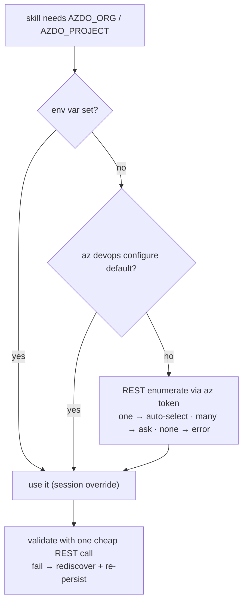

# ADR 0002 — Discover the ADO organization & project from Azure CLI, with a self-priming az-config cache

- **Status:** Accepted
- **Date:** 2026-06-02

## Context

Every ado-* skill needs a **target**: an Azure DevOps **Organization** (bare name, e.g.
`Cartagena365`) and usually a **Project** (e.g. `GlassHull`). Until now the user had to know and
set `AZDO_ORG` / `AZDO_PROJECT` by hand, or the skill asked. We want the toolkit to discover them
from the existing `az` session so the daily flow (especially `my-work`, which needs only the org)
is friction-free.

Two hard facts shaped the design:

1. **There is no direct `az` command that returns an Azure DevOps org name.** Microsoft's own docs
   say so: you must combine an `az` Entra token with the Azure DevOps REST API. `az account show`
   returns the Azure subscription/tenant — a *different* thing from an ADO org.
2. **The runtime breaks naive env-passing.** The agent's PowerShell tool calls don't share shell
   state, and they run `-NonInteractive`. So a resolved `$env:AZDO_ORG` doesn't survive to the next
   call, and a `Read-Host` "which org?" prompt would hang when Claude runs it.

## Decision

A reusable, **dot-sourceable** `scripts/resolve-ado-target.ps1` sets `$env:AZDO_ORG` /
`$env:AZDO_PROJECT` **in the current process**. Skills dot-source it and run their work in the
**same chained shell**. The bundled `.cs` scripts are unchanged — they still read the env vars.

Resolution is a **layered fallback** (applied to org, then project):

1. Explicit `$env:AZDO_*` → use it (a session override; **never** written back to global config).
2. `az devops configure --list` default → parse the org name from the URL / read the project.
3. **REST enumerate** with an `az` token (resource `499b84ac-1321-427f-aa17-267ca6975798`):
   profile `me` → `accounts?memberId=…` for orgs; `/_apis/projects` for projects. **One auto-selects;
   many → ask; none → error with a fix hint.**

The resolved target is **always validated** with one cheap REST call before use; on failure we fall
through to fresh discovery and **re-persist the corrected value** via `az devops configure -d`. On
success, auto-resolved values are persisted (so step 2 short-circuits the *enumerate + ask* next
time). The "ask" is **dual-mode**: `Read-Host` when interactive, otherwise emit a candidate list +
exit 2 so Claude can present choices and re-run with the value pre-set. The `azure-devops` extension
(needed for step 2 + persistence) is **auto-installed** if missing; if that fails, we degrade to
REST-only + session-env with a warning.

## Consequences

- ➕ `my-work` and the auth verify step become zero-config when the user has one org; the create/
  classify flow auto-resolves both org and project.
- ➕ `az` stays the source of truth; the persisted default makes repeat runs skip enumeration + the
  prompt.
- ➕ Works correctly under both a human terminal and the non-interactive agent.
- ➖ The toolkit now **mutates the user's global `az devops configure` state**.
- ➖ "Always validate" costs **one REST round-trip on every run**, even the fast repeat path.
- ➖ A raw `vssps` REST call (profile + accounts) lives in the snippet despite the `az devops`
  extension being present — unavoidable given fact #1.

## Alternatives considered

- **Enumerate-only (ignore configured default)** — rejected: pays the profile+accounts calls and
  re-handles multi-org every run; no self-priming.
- **Config-readback only** — rejected: only works if the user already ran `az devops configure`, so
  it doesn't solve "I don't know my org."
- **Trust the persisted default (no validation)** — rejected: a stale default would silently point
  at the wrong org (the existing *"200 but wrong/empty"* failure mode). We chose always-validate.
- **Discover org only** — rejected: the create/classify flow needs the project too; the same `az`
  pattern covers both.
- **Put discovery inside the `.cs` scripts** — rejected: duplicates profile+accounts REST logic in
  C# across two files; a single PowerShell snippet is the one source of truth.
- **Require the `azure-devops` extension as a manual prereq** — rejected in favor of auto-install
  with graceful degrade, to keep the flow self-contained.
