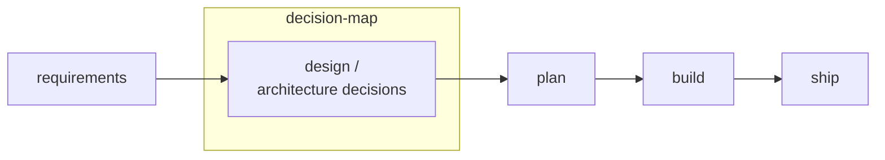
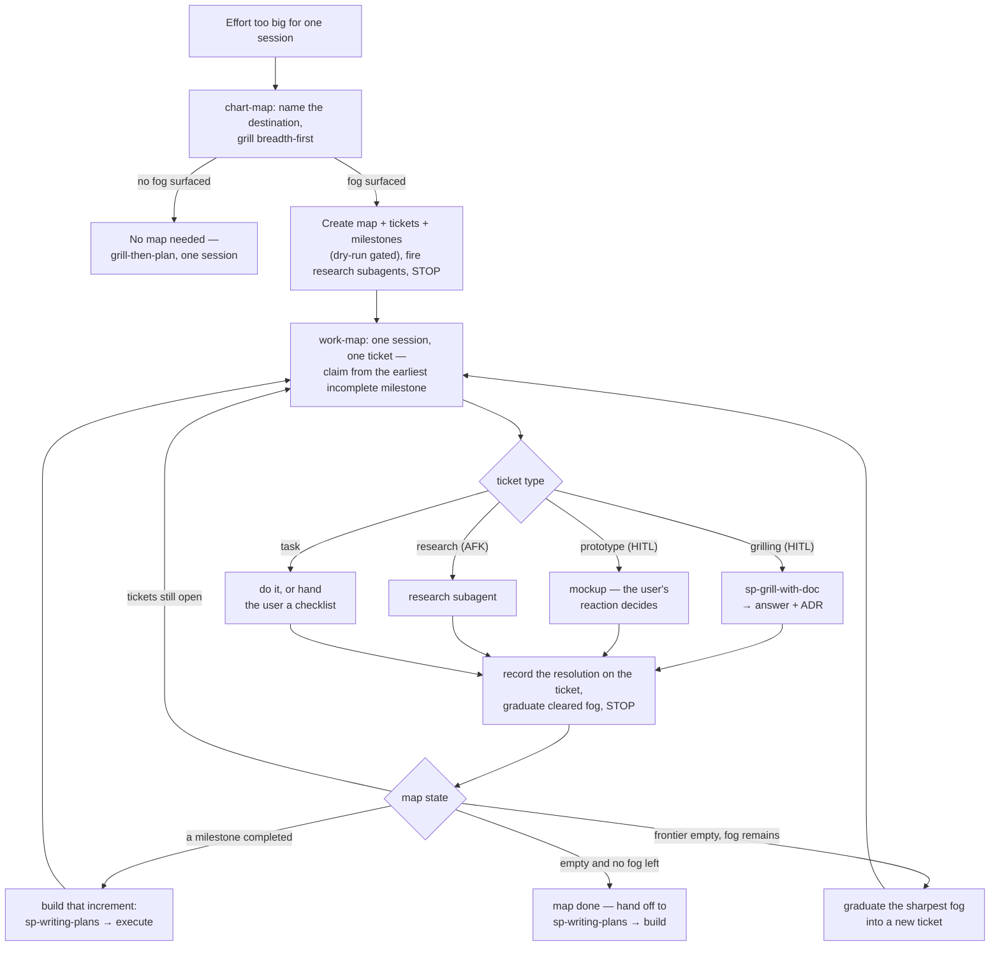

# decision-map

Plan an effort **too big for one agent session** as a **Decision map**: one item
indexing the effort — in v1 a `map.md` committed to your repo — with child
**Decision tickets**, questions whose resolution is a *decision*, not a slice of
a build, resolved **one per session** until nothing is left to decide. Then hand
off to the normal build flow.

Adapted from the [wayfinder](https://github.com/mattpocock/skills) skill by Matt
Pocock, re-grounded on this marketplace's plugins, trackers, and safety gates
(ADRs 0033–0042 and 0054–0056 at the marketplace root). The authoritative
description of what the tool does is
[`references/data-contracts.md`](references/data-contracts.md); the original
design spec at `docs/superpowers/specs/2026-07-31-decision-map-design.md` is a
historical record and is superseded in part — it carries a banner saying how.

## Where it fits

decision-map owns one slice of the delivery arc — the design and
architecture-decision phase. It does not gather requirements, and it does not
build:

Most of its vocabulary has a familiar counterpart, so a reader coming from
ordinary delivery practice can place it quickly:

| decision-map | Usual counterpart |
|---|---|
| Decision map | RFC, design epic, architecture backlog |
| Decision ticket | spike ticket, an open question awaiting its ADR |
| `research` ticket (AFK) | spike |
| `prototype` ticket | tracer bullet, throwaway prototype |
| `grilling` ticket (HITL) | design review with a stakeholder |
| fog | unknown-unknowns, the parking lot |
| frontier | the ready queue — unblocked, unclaimed tickets |
| Milestone | shippable increment, release slice |
| claim | assignment, plus a WIP limit of one |
| dry-run gate | `plan` before `apply` |
| ADR | ADR — the same artifact |

Four things it does that an ordinary backlog does not:

- **Decisions are separated from build work.** Every ticket is a question, not
  a slice of a build, so nothing can quietly mix "decide the auth model" in
  with "add the login button" and let the first of them go unanswered.
- **Fog is a first-class artifact.** You are not required to know every
  question up front. Uncertainty you cannot yet phrase is held as fog and
  graduated into tickets as it sharpens.
- **State lives in the map, not in the conversation.** The session that
  answered a question can end, be compacted, or crash, and the next one still
  starts from the same place.
- **Who decides is declared per ticket.** A HITL ticket resolves only through
  live exchange with the human — the agent never answers its own design
  question and then records the result as settled.

**Reach for it when both are true:** the effort spans more than one session,
*and* you cannot yet list the decisions it needs. If you can already list them,
or the whole thing fits in one session, `grill-then-plan` is the cheaper route
— chart-map stops and says so itself when its opening grill surfaces no fog.

## Lifecycle

One chart, then work-map sessions in a loop — one ticket each — until a
milestone (or the whole map) is ready to build:

Two notes the diagram compresses. A `grilling` ticket whose deliverable is
*meant* to be a written plan may load `grill-then-plan` instead of
`sp-grill-with-doc` — work-map's Step 3 table carries that one exception. And a
completed milestone is a shippable increment (ADR 0094): building it may begin
while later milestones stay open, but work-map's only *explicit* hand-off to
`sp-writing-plans` is at map-done — for a per-milestone build you invoke it
yourself.

## Skills

| Skill | Command | What it does |
|---|---|---|
| chart-map | `/decision-map:chart` | Name the destination, grill breadth-first, create map + tickets (dry-run gated), fire research subagents, stop. |
| work-map | `/decision-map:work` | Load the map, show the frontier, claim ONE ticket, resolve it via the matching arc skill, record + graduate fog, stop. |

## Backends

**Two backends ship.** Local markdown is the default: your map is repo docs under
`docs/decision-map/<slug>/`, shared the way the repo is shared, by committing it.
GitHub Issues puts the same map on a real board.

| Backend | Status | Needs | Ops script |
|---|---|---|---|
| Local markdown | **ships** (default) | nothing | `scripts/local_map_ops.py` → `docs/decision-map/<slug>/` |
| GitHub Issues | **ships** (ADR 0062) | `gh auth status` passing, and `--repo <owner>/<repo>` on every call | `scripts/github_map_ops.py` → issues + a Map pointer at `docs/decision-map/<slug>/map.md` (ADR 0173) |
| Azure DevOps | not built | — | — |

Installing `ado-backlog` or `github-backlog` does **not** give decision-map a
backend — neither plugin can drive a map. `github-backlog` is a
*findings-to-issues* pipeline; it writes different things to the same tracker.

On GitHub a ticket carries no position diagram — the issue sidebar shows its
blockers live (ADR 0171).

Everything above the ops script is backend-neutral: the skills, the subcommands,
the flags and the JSON shapes are the same on both. Only the script name and that
one `--repo` flag change. The rules the two must not disagree about — the marker
invariant, the region merge, input validation, the key join — live in one shared
module, `scripts/map_core.py`.

### On GitHub

A map is an **issue** labelled `decision-map:map`; each Decision ticket is a
native **sub-issue** of it; blocking uses native **issue dependencies**; a
resolution is an issue **comment** (and a one-line gist region on the ticket, so
`read` can report every gist without walking every ticket's comments). The
`key` → issue join is one GraphQL round trip, and it refuses rather than
truncates — a child the join cannot see would be re-created and shown to you as
an ordinary approvable `create` line.

Two GitHub limits are hard and checked before anything is written: **100 tickets
per map** (its sub-issue ceiling) and **50 blockers per ticket**.

### Why Azure DevOps is not here

The whole design rests on one bet — that `<!-- decision-map:key:<key> -->`
survives a round trip through the tracker, including **an edit in the web UI**,
where the rich-text editor rather than the API rewrites HTML. That bet was tested
against live GitHub and **passed**, including a human editing a body in the
browser (ADR 0060), which is what cleared GitHub to be built.

It has never been tested against ADO, and that is where all the risk is:
`System.Description` is HTML, and Microsoft documents nothing about sanitisation
of work-item HTML fields. If the bet loses there, the per-item marker collapses
to a manifest on the map item — a *different shape* — and the failure is silent
in the worst way: a map whose markers were stripped re-charts in full and is
presented as a page of ordinary, approvable `create` lines.

`scripts/probe_marker_survival.py` is the harness for that test; it covers both
trackers and one of its six steps needs a human editing a description in the
Boards UI. Until it runs, no ADO join code gets written. The ADO mappings stay in
[`references/data-contracts.md`](references/data-contracts.md) because they are
that backend's spec.

## Safety

Creating items (charting, fog graduation) always dry-runs first and waits for your
explicit approval. Claim/comment/close ride the conversation's own confirmations.
