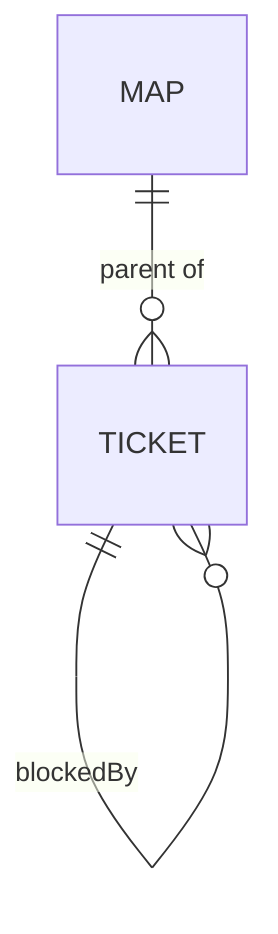
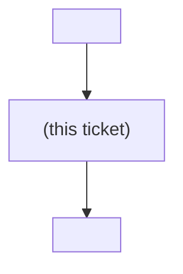

# decision-map data contracts

Single source of truth for the shapes exchanged between the decision-map flow
skills and the backend ops scripts (ADR 0037). Nothing else redefines them.
The tracker (or the local files) is the source of truth; these JSON files are
working files, never a store.



## What ships, and what is specification (ADR 0059, ADR 0062)

**Two backends ship: local markdown and GitHub Issues.** Azure DevOps is still
**phase 2**, gated on the ADO half of the six-step probe below ("Before building
the join"). Read this document in two layers:

| Part | Status |
|---|---|
| the subcommand contract, `map_input.json` / `map.json` / `frontier.json`, the dry-run plan and its action vocabulary, the `key`-join rules, the local file formats and their generated regions | **shipping** — `scripts/local_map_ops.py` |
| the GitHub column of Backend mappings, the GitHub marker regions and `status` rule, the GitHub specifics list, the call budget | **shipping** — `scripts/github_map_ops.py` (ADR 0062) |
| every ADO-specific part: the ADO column of Backend mappings, the ADO marker regions, the ADO `status` reading rules, steps 1–5 of the verification probe and its fallback ladder | **specification** — nothing implements it yet |

Both layers are normative, and the ADO layer stays here unchanged: it is the
specification a third backend implements, and the reasoning behind the `key` join
is the most valuable thing in this document. Where a rule reads "every backend
must …", it binds both shipping backends and any that follow.

The rules two backends must not disagree about live in **one module**,
`scripts/map_core.py` — the marker invariant, the region merge,
`validate_chart_input`, the shared map-body render, the decisions projection and
the key join (ADR 0062). A rule below that says "every backend" is, for the
shipping pair, a single object rather than a promise. Nothing in `map_core`
touches a filesystem or a network.

The flow skills are backend-neutral: the subcommands, flags and JSON shapes below
do not change with the backend, only which ops script the skills call.

### Per-subcommand call budget (GitHub)

Written down because the earlier cost analysis budgeted only the join, and the
conclusion is the opposite of what that suggested: **`resolve` is the expensive
subcommand, not the cheapest.**

| Subcommand | Reads | Writes |
|---|---|---|
| `chart` (dry run) | 1 GraphQL + 1 label listing | **0** |
| `chart --real` | the above + 1 closing GraphQL | 1 per missing label, 1 map create-or-patch, **2 per new ticket** (create, then parent), 1 per new edge |
| `read` / `frontier` | 1 GraphQL | 0 |
| `claim` | 1 GraphQL (+1 `gh api user` when `--user` is omitted) | 1 |
| `block` | 1 GraphQL | 1, or **0** when the edge already exists |
| `comment` | 1 GraphQL | 1 |
| `resolve` | 1 GraphQL | **3** — the comment, the ticket (body *and* state in one call), the map's decisions index |

A slug passed to `--map` costs one extra listing call to resolve; an issue number
costs none. `resolve` re-projects the decisions index over every ticket, but the
snapshot it already holds supplies each ticket's status and gist, so the
projection adds no reads.

The binding rate limit is the **secondary** one — 80 content-creating requests
per minute — not the 5,000/hour primary. A backend must pace writes against it:
a large additive `chart` issues roughly 2–3 writes per new ticket and will cross
the line past ~30 tickets, and failing there leaves a half-charted map *after*
the user approved the plan.

## Subcommand contract (identical on every backend)

| Subcommand | Args | Effect |
|---|---|---|
| `chart` | `--input <map_input.json> --output <map.json>` | create map + tickets + blocking edges, **additively** (ADR 0057/0058) — see below. **Parent links are tracker-only**: the local backend expresses containment by directory and creates none. **Dry-run by default**; `--real` performs the writes; `--force` is a **destructive** full rewrite that discards recorded resolutions, claims and edges. |
| `read` | `--map <id\|slug> --output <map.json>` | fetch map + children at low resolution. |
| `frontier` | `--map <id\|slug> --output <frontier.json>` | open + unblocked + unclaimed children. |
| `claim` | `--map <id\|slug> --ticket <id\|slug> [--user <upn>]` | assign the ticket to the caller. `--user` works on **every** backend (it sets the local `assignee:` frontmatter too); passing an empty value releases the claim. **Omitting it is NOT equivalent across backends:** GitHub resolves the real caller via `gh api user`, but the local backend falls back to the literal string `me`, which names nobody and makes two concurrent sessions indistinguishable. On local, always pass a real `--user`. |
| `resolve` | `--map <id\|slug> --ticket <id\|slug> --gist "<one line>" [--link <url>] [--body-file <md>]` | post resolution comment, close the ticket. |
| `comment` | `--map <id\|slug> --ticket <id\|slug> --body-file <md>` | plain comment. |
| `block` | `--map <id\|slug> --ticket <id\|slug> --blocked-by <id\|slug>` | dependency edge (ticket waits on blocked-by). |
| `lint` | `--map <id\|slug>` | check the map as it stands and **write nothing**. Exits `3` when it finds anything — see below. The one subcommand that answers a question about the map rather than about the call being made. |

**`--map` is required on every ticket subcommand**, not only on `read` and
`frontier`: a ticket is identified by its map plus its key, and no backend
resolves a bare `--ticket` by global search (that is the same rejected
search-the-tracker shortcut as in the join below). Omitting it is a usage
error — the local backend exits `2` with `resolve needs --map`.

Every subcommand also accepts `--dry-run` (change nothing) — for `chart` that
is already the default. **Only `chart` renders a plan.** On `claim`, `resolve`,
`comment` and `block` the shipping backend prints a stub,
`{"dryRun": true, "wouldRun": <cmd>, "ticket": <ticket>}`, and does **not**
check that the map or ticket exists. A tracker backend must match that: a
dry-run that quietly performs lookups is not free, and one that renders a plan
where local renders a stub is not at parity.

### Exit codes and return shapes

Four exit codes, on every subcommand and every backend:

| Exit | Meaning | stdout | stderr |
|---|---|---|---|
| `0` | success | the subcommand's JSON document | empty, except `chart`'s plan rendering (dry-run) or its divergence lines (real run) |
| `2` | a **known** failure — bad usage, missing map or ticket, validation error | **empty** | exactly one line naming the problem |
| `1` | an unhandled crash | empty | a traceback |
| `3` | **`lint` only** — the map was read successfully **and** it has findings | the `lint` document, `clean: false` | empty |

Exit `3` is a third code rather than a reuse of `1` or `2` deliberately: a
caller — a Stop hook, a CI step, a session checking its own work — has to be
able to tell *your map has problems* (act on the findings) from *the call was
wrong* (`2`, fix the arguments) and from *this tool is broken* (`1`, a
traceback). Collapsing them makes an unattended run treat a crash as a dirty
map, or a dirty map as a broken tool.

Exit `2` with empty stdout is the contract the flow skills rely on; a backend
that prints a partial document alongside an error breaks them. Return shapes:

| Subcommand | stdout on success |
|---|---|
| `chart` (dry-run) | `{backend, dryRun: true, planned[], divergence[]}` |
| `chart --real` | the `map.json` document plus a `divergence` key |
| `read` | `map.json` |
| `frontier` | `frontier.json` |
| `claim` | `{"claimed": <ticket>, "assignee": <user>}` |
| `resolve` | `{"resolved": <ticket>, "gist": <gist **as stored**>}` — flattened and escaped, or `null` when the flattened value is empty. Never echo the raw input. |
| `comment` | `{"commented": <ticket>}` |
| `block` | `{"ticket": <t>, "blockedBy": [<the full list>]}` |
| `lint` | `{backend, map, clean, findings[], notChecked[]}` |

`block` **must not issue a write when the edge already exists** — it returns
the same document and touches nothing. On a tracker this matters more than on
local: a redundant link call bumps `System.Rev` and shows in the item history.
GitHub also answers **422** on a duplicate dependency (verified live), so this
cannot be left to the API to make idempotent.

**"Does the edge exist" is a question about item identity, never about a key
string.** `blockedBy` deliberately reports the key of a re-parented item so
`missingBlockers` can name it, so testing membership in that list makes a *stale*
edge indistinguishable from a live one — and then a genuine new edge to the item
that now holds the key is never written, at exit `0`, reported as success.
`--force` has the mirror-image bug: it must remove edges **by target identity**,
or an edge to a re-parented blocker survives the rewrite it was announced as
resetting, leaving the ticket blocked by something that can never close.

**`--user` has no default identity.** The shipping backend writes the literal
string `"me"` when `--user` is omitted. That is meaningless as an ADO
`System.AssignedTo` or a GitHub assignee, so a tracker backend must resolve the
caller's identity itself (`az account show` / `gh api user`) and must not write
`"me"`. Passing an empty value still releases the claim.

### `lint` — the check an agent can run (ADR 0067)

Every other subcommand validates the **one call being made** and then writes.
`lint` validates the **map as it stands** and writes nothing, which is what
makes it usable unattended: it returns a pass/fail an agent reads in the
conversation instead of "looks done" being the only signal available. It is
read-only by construction, so it is also safe for a hook.

Each rule exists because a flow skill states the invariant in prose and nothing
enforced it. Prose is advisory; this is the deterministic half.

| Rule | Severity | Fires when |
|---|---|---|
| `dangling-blocker` | error | a `blockedBy` entry is not a ticket on this map. `frontier` counts a missing blocker as **unsatisfied**, so the ticket is blocked forever rather than merely mis-linked. |
| `self-blocked` | error | a ticket lists itself under `blockedBy`. `block` refuses this, but a hand edit of the frontmatter — which the flow skills *instruct* — bypasses that guard. |
| `blocker-cycle` | error | two or more tickets block each other, transitively. Reported **once per component**, not once per member. Nothing in the cycle can ever reach the frontier, and the map reads as stalled rather than broken. |
| `closed-without-resolution` | error | a ticket is closed but carries no recorded answer, so the map indexes a decision nobody can read. Keyed on the **resolution region** on local and on the **gist region** on a tracker — see `notChecked`. |
| `resolution-without-diagram` | warning | a resolution body carries no ```` ```mermaid ```` block (ADR 0065). |
| `gist-too-long` | warning | a stored gist exceeds `GIST_MAX`. `resolve` warns on stderr and records it anyway, so the only way to find it afterwards is here. |
| `anonymous-claim` | warning | an **open** ticket is held by the literal `--user` default `me`, which names nobody. Structurally impossible on a tracker, where the caller is resolved for real. |
| `fog-line-graduated` | warning | a line under "Not yet specified" reads as a ticket that already exists. An additive `chart` never deletes, so graduating fog leaves the old line behind and the map keeps advertising a question it has answered. |

`fog-line-graduated` is the only **heuristic** rule: it matches significant
words between a fog line and a ticket title, and its thresholds are deliberately
strict (at least three shared words, and those words being most of the shorter
side). A check that cries wolf is worse than no check — a warning nobody trusts
trains the reader to skip the errors next to it.

**`notChecked` is part of the contract, not a convenience.** A rule that was
never run reads as a rule that passed, so any backend that cannot evaluate one
must name it. The local backend returns `[]`. The GitHub backend returns
`["resolution-without-diagram"]`: there the resolution body is a native comment
that the single snapshot does not hold, and walking every ticket's comments
would cost one API call per ticket — on the command whose entire value is being
cheap enough to run after every session.

Severity does not change the exit code: **any** finding, warning included, means
`clean: false` and exit `3`. The caller decides what to act on; the tool does not
decide for it by hiding half the list behind a zero.

### `chart` is additive (ADR 0057, refined by ADR 0058)

`chart` names **two acts**: the initial charting of a map, and the incremental
graduation of fog into fresh tickets mid-map. One create path serves both, so
do not read `chart` as create-only.

**Additive means union.** The guarantee is *never removes, never reorders,
never overwrites* — **not** "never touches". On a map that already exists,
`chart`:

- creates only the tickets whose `key` is absent;
- **unions** `notYetSpecified` / `outOfScope` lines into the map body: new
  lines are appended, existing ones are never removed or reordered, and an
  input that omits a line already on disk does not delete it;
- **unions** a new blocking edge into an existing ticket's `blockedBy`
  (ADR 0058). That ticket gains one `blockedBy` entry and its `graph` region
  is re-rendered to show the new blocker (ADR 0064) — **and nothing else**:
  status, assignee, gist and the resolution block are unchanged. **The edge
  is written at both of its ends**, so the blocker's own `graph` region is
  re-rendered too, to show the new child; its frontmatter values are unchanged.
  ("Values", not "bytes": the local backend re-dumps the whole file through its
  frontmatter writer, which is byte-identical for a file the tool wrote but
  would drop a hand-added line carrying no colon.)
  Dropping the edge instead was worse: `frontier()` then reported a ticket as
  actionable while a just-created ticket was meant to block it;
- does **not** apply a `title` / `destination` / `notes` that differs from
  what is on disk. The difference is reported in the result's `divergence`
  list and left unapplied — silently rewriting an evolved map from a stale
  input is precisely the destruction this design exists to prevent. Edit
  `map.md` by hand to change them.

**What additive does not guarantee:** that an existing ticket file is
byte-identical afterwards (it may gain one `blockedBy` entry and a
re-rendered `graph` region — its own, if it is the blocked ticket, or the
blocker's, since an edge is written at both ends), and that a value in the
input takes effect (a divergent scalar is reported, not applied).
It does guarantee that nothing recorded is ever removed, reordered or
overwritten, and that re-running identical input is a **no-op** — the same
bytes out, which also makes a partially-failed chart resumable.

An edge may name a ticket that already exists in the map **without re-listing
it in `tickets[]`** (ADR 0058). A `blocks` target must exist either in this
input or in the map on disk; naming a target that exists in neither is a
validation error.

`--force` is the explicit, dry-run-announced full rewrite. **It is
destructive: it discards every recorded resolution, claim and blocking edge
on the items it rewrites.** It is never required to add tickets or edges —
that is what additive `chart` is for. No message in any backend may recommend
`--force` without stating this cost.

**What `--force` does and does not discard, per action label.** `--force`
does not mean "reset the map"; it means "rewrite the items in this input".
Its reach is exactly the items the plan labels `OVERWRITE`:

| the item is… | label under `--force` | what happens to its recorded state |
|---|---|---|
| listed in `tickets[]` **and already exists** | `OVERWRITE` | **all discarded** — status back to `open`, assignee cleared, gist cleared, resolution removed, `blockedBy` reset and then re-wired from this input's `blocks` |
| listed in `tickets[]` but **does not exist yet** | `create` | nothing to discard — `--force` does not change how a new ticket is created |
| the map itself | `OVERWRITE` | the **whole map document is regenerated** from the input. Fog and out-of-scope lines that existed only on the map and are absent from the input are lost — the one place additive's union guarantee does not apply — and so is any human prose added *outside* the generated regions. On a tracker that prose is the map item's description, where a team naturally adds context, and the plan shows one `OVERWRITE` line for all of it |
| named only in a `blocks` list, not in `tickets[]`, and **does not yet hold that edge** | `merge` | **nothing discarded** — it gains the edge and keeps its status, assignee, gist and resolution, exactly as on the additive path |
| named only in a `blocks` list and **already holds that edge** | *absent from the plan* | **untouched** — `block` and `chart` both no-op on an edge that exists, so there is nothing to announce |
| present on the map but in neither `tickets[]` nor any `blocks`, and **blocking an `OVERWRITE`'d ticket** | `merge` | **nothing discarded** — but its `graph` region is re-rendered to drop the child it just lost. The edge was written at both of its ends, so resetting one end stales the other; leaving it would make the blocker draw an edge that no longer exists (ADR 0064) |
| present on the map but in neither `tickets[]` nor any `blocks`, and not blocking an `OVERWRITE`'d ticket | *absent from the plan* | **untouched** — `--force` never reaches an item this input does not name |

**Both ends, on removal as well as addition.** An `OVERWRITE` resets the
ticket's own `blockedBy`, and the matching child line lives in the *blocker's*
diagram — so `--force` writes two diagrams per edge it deletes, exactly as
additive `chart` writes two per edge it adds. The `OVERWRITE`'d ticket's own
region is re-rendered too, because its **children** are edges held on other
tickets and survive the reset (only its parents are discarded). Neither write
may be silent: the first rides the `OVERWRITE` line, the second gets its own
`merge` line with a `no longer renders as a child in the graph: …` detail.

A backend must therefore not implement `--force` as "delete the map and
re-chart": that would destroy items the input does not mention, which neither
the plan nor this contract permits. Every destructive act must appear in the
dry-run plan as an `OVERWRITE` line before it happens.

One consequence worth knowing: the "Decisions so far" index is a projection
refreshed by `resolve`, and `--force` rewrites the map body without
re-projecting it, so **the index comes out empty** — not narrowed to the
surviving decisions. Every rewritten ticket is reset to `open` so could not
appear anyway, and a ticket that is still closed (because the input named it
only in a `blocks` list, or did not name it at all) keeps its own closed state
but drops out of the index too. It is **self-healing**: the next `resolve`
re-projects the index from every closed ticket and all of those entries come
back. A backend must therefore not implement a partial refresh here — the
index is either fully re-projected or left for the next `resolve` to rebuild.

#### Dry-run action vocabulary (required of every backend)

The dry run reports one action per item, on both the machine-readable stdout
plan and the human stderr rendering. All four labels are **required** — a
backend must be able to express each of them, because each names an outcome
additive `chart` genuinely produces:

| action | meaning |
|---|---|
| `create` | the item does not exist yet and will be created |
| `skip (exists)` | the item exists and will **not** be written at all |
| `merge` | the item exists and will be **modified in place, additively** — the map body gaining fog / out-of-scope lines, or a ticket gaining a `blockedBy` entry |
| `OVERWRITE` | `--force` only: the item exists and will be fully rewritten |

**Tag/label provisioning is IN the plan, not a preflight outside the gate**
(ADR 0062). A tracker `chart` must create `decision-map:map`,
`decision-map:ticket` and `decision-map:type:<type>` when absent, and creating a
repository-wide label is a write — so it gets a `create` entry whose `path` is
`label:<name>`. These entries come **first**, before the map, because they must
exist before the map item is created with its label. That is the one place the
plan's "map first" ordering is relaxed, and it matches execution order rather
than contradicting it.

`skip (exists)` is a promise that nothing is written; anything modified must
be labelled `merge`, never `skip`. A `merge` entry carries a `detail` string
naming what it will add — `unions blockedBy: fog-graduate` on a ticket,
`renders as a child in the graph: api-limits` on a blocker whose diagram
gains an entry (an edge is written at both of its ends, so the blocker's
`merge` line names the write too — ADR 0064),
`no longer renders as a child in the graph: api-limits` on a blocker whose
diagram LOSES one because `--force` reset the other end's edges (the same
both-ends rule, applied to a removal: the ticket named in the `OVERWRITE`
line is not the only one whose picture that line changes), `adds 2 fog
lines, 1 out-of-scope line` on the map body — so the ADR-0039 approval gate can show
the reviewer every write before it happens. **No `merge` entry may carry
`detail: null`**: the gate asks the user to approve that line, and a blank
one asks them to approve an undescribed write.

#### Dry-run plan schema

`chart` with `--dry-run` (the default) writes this to stdout and nothing else:

The worked example is the **shipping** backend, because this plan is exactly what
the ADR-0039 approval gate puts in front of the user:

```json
{
  "backend": "local",
  "dryRun": true,
  "planned": [
    { "path": "docs/decision-map/billing/map.md",                 "action": "merge",         "detail": "adds 1 fog line" },
    { "path": "docs/decision-map/billing/tickets/auth-model.md",  "action": "merge",         "detail": "renders as a child in the graph: rollout" },
    { "path": "docs/decision-map/billing/tickets/rollout.md",     "action": "merge",         "detail": "unions blockedBy: auth-model" },
    { "path": "docs/decision-map/billing/tickets/new-thing.md",   "action": "create",        "detail": null }
  ],
  "divergence": ["<human-readable string>", "..."]
}
```

A tracker backend emits the same document with `"backend": "github"` / `"ado"`
and the ticket `key` (or the literal `<map>`, or `label:<name>`) in `path` — see
the `path` bullet below. The GitHub shape, for the same map charted fresh:

```json
{
  "backend": "github",
  "dryRun": true,
  "planned": [
    { "path": "label:decision-map:map",            "action": "create", "detail": null },
    { "path": "label:decision-map:type:grilling",  "action": "create", "detail": null },
    { "path": "<map>",                             "action": "create", "detail": null },
    { "path": "auth-model",                        "action": "create", "detail": null },
    { "path": "rollout-order",                     "action": "merge",  "detail": "unions blockedBy: auth-model" }
  ],
  "divergence": []
}
```

- `dryRun` is `true` only on a dry run; a real run returns `map.json` instead,
  with `divergence` added.
- **`planned` is ordered and complete**: the label entries first (they must exist
  before the map item is created), then the map, then one entry for every item the
  run would touch — including an existing ticket that appears only as a `blocks`
  target and is therefore not in `tickets[]`. Nothing the run writes may be
  missing from it; that is the whole value of the gate.
- `path` identifies the item. The name is historical — it is the file path on
  the local backend, and on a tracker it is the ticket **`key`**, the literal
  `<map>` for the map item, or `label:<name>` for a label the run will create.
  It is a display and correlation handle, not something to parse.
- An edge whose blocked ticket is itself being created or overwritten is **not**
  announced separately: it is part of that ticket's own `create` / `OVERWRITE`
  line, and there is no prior state on it for the edge to merge into.
- `action` is one of the four labels above. `detail` is a one-line string on a
  `merge` entry saying what it will add, and `null` on every other action.
- `divergence` is always present (empty list when there is nothing to report),
  and holds the same strings the real run returns.

The same plan is rendered for humans on **stderr**; stdout carries JSON or
nothing, so `chart --input x | jq` works — a split every backend must keep.

## `map_input.json` (input to `chart`)

```json
{
  "target": { "org": "Cartagena365", "project": "GlassHull",
              "owner": "Cartagena365", "repo": "GlassHull",
              "slug": "example-effort" },
  "mapType": "Epic",
  "ticketType": "Issue",
  "map": {
    "title": "Decision map — <effort name>",
    "destination": "<one or two sentences — stored as a single line>",
    "notes": "<skills to consult; standing preferences — stored as a single line>",
    "notYetSpecified": ["<fog line>", "..."],
    "outOfScope": ["<ruled-out line>", "..."]
  },
  "tickets": [
    { "key": "auth-model", "title": "Auth model — per-tenant or shared keys?",
      "type": "grilling", "question": "<the decision this resolves>",
      "blocks": ["rollout-order"] }
  ]
}
```

`target` carries only the fields the active backend needs (org/project for ADO,
owner/repo for GitHub, slug for local). `mapType`/`ticketType` are ADO work-item
types (defaults `Epic`/`Issue`; must be valid for the project's process — the
chart-map skill confirms them). `blocks` lists ticket keys this ticket blocks —
**downstream**, an authoring convenience the `chart` operation reads to wire
edges. This is deliberately different from `blockedBy` in `map.json` and
`frontier.json` below: that field reports the **upstream** relation (the
tickets that must close before this one is actionable), which is what every
consumer actually queries. Input authors `blocks`; output (and every reader)
sees `blockedBy` — do not confuse the two. `type` ∈ `research | prototype |
grilling | task`. Mode is derived: research=AFK, grilling/prototype=HITL,
task=either.

## `map.json` (output of `chart` and `read`)

```json
{
  "backend": "local",
  "map": { "id": "billing", "name": "Decision map — <effort>",
           "url": "docs/decision-map/billing/map.md", "destination": "<line>" },
  "tickets": [
    { "key": "auth-model", "id": "auth-model", "name": "Auth model — …",
      "url": "docs/decision-map/billing/tickets/auth-model.md",
      "type": "grilling", "mode": "HITL",
      "status": "open", "assignee": null, "blockedBy": [],
      "gist": null },
    { "key": "rollout-order", "id": "rollout-order", "name": "Rollout order — …",
      "url": "docs/decision-map/billing/tickets/rollout-order.md",
      "type": "grilling", "mode": "HITL",
      "status": "open", "assignee": null, "blockedBy": ["auth-model"],
      "gist": null }
  ]
}
```

Note the direction, because it inverts between the two documents and is the
one relation the whole graph is built from: the input above says `auth-model`
**blocks** `rollout-order`, so it is `rollout-order` that comes back
`"blockedBy": ["auth-model"]`. `auth-model` itself is blocked by nothing. The
`frontier.json` example below shows the same pair the same way round.

A tracker backend emits the same fields with its own native handles —
`"backend": "github"`, `"id": "1235"`, `"url": "https://…"` — and the same `key`s.

**GitHub carries three handles per item, and each answers a different question.**
`id` is the issue **number** — what a human reads, and what `--ticket` accepts
(`--ticket` takes a key *or* a number, because `id` is documented as being "for
passing back to `--ticket`" and it has to actually work). `dbId` is the issue
**database id**, an unrelated value that every sub-issue and dependency mutation
is keyed on; emitting only one costs an extra resolve call per write. `repo` is
the repository the issue **actually lives in**:

```json
{ "key": "auth-model", "id": "1235", "dbId": 5036168435, "repo": "acme/widgets",
  "name": "Auth model — …", "url": "https://github.com/acme/widgets/issues/1235",
  "type": "grilling", "mode": "HITL", "status": "open",
  "assignee": null, "blockedBy": [], "gist": null }
```

**`repo` is not decoration and must not be assumed to be the map's.** A sub-issue
only has to share the parent's *owner*, so it may live in another repository of
that owner — and **issue numbers restart per repository**, so #7 in two repos are
two different issues. A backend that keys the join on the bare number, or
addresses per-ticket writes at the map's repo, silently reads the wrong key and
writes to whatever unrelated issue shares the number. The join must key on
`(repo, number)`, and every per-ticket write must be addressed at `repo`.

The GitHub map object additionally carries `"key"`: the map's own slug, read back
from its key marker, so a caller that resolved the map by issue number learns the
slug without a second call.

**Every `frontier.json` entry carries `id` *and* `key`, and `id` means the same
thing there as in `map.json`.** They disagreed at first — `map.json` reported the
number and `frontier.json` the key — so a skill that read one and called with the
other broke. `id` is the native handle in both; `key` rides alongside because
every ticket-to-ticket reference (`blockedBy`, `missingBlockers`) is a key.

**The decisions index links to the ticket's full URL**, never `#N`. Inside an
issue body `[title](#2)` is a same-page fragment that goes nowhere, so every
entry a human is meant to click was dead. (A bare `#2` would auto-link, but the
index format is `- [title](link) — gist`, so the link has to be real.)

**Ordering is key-ascending on every backend** (ADR 0062) — `map.json.tickets[]`
and all three `frontier.json` buckets. A tracker's natural order is creation or id
order, so without this rule two backends emit different documents for the same
logical state. Key-ascending is the only order that is a deterministic function of
that state; the decisions index is ordered the same way and for the same reason.

`chart` (only — not `read`) adds `"divergence"`: a list of human-readable
strings naming anything the input asked for that an additive run deliberately
did not apply — a differing `title`/`destination`/`notes`, or list lines that
could not be merged into a `map.md` predating the list regions. Empty on an
initial chart and on `--force`. Blocking edges are **not** listed here: since
ADR 0058 they are applied, and appear in the dry-run plan as a `merge`.

`status` ∈ `open | closed`. `blockedBy` lists upstream blockers — the tickets
that must close before this one is actionable; every backend computes it from
its own native dependency mechanism (see the "blocking" row of Backend
mappings below). **Its entries are `key`s, not native ids**, in every backend:
a backend that stores the edge natively (an ADO link, a GitHub "blocked by")
must resolve each linked item back to its key through the join above before
emitting this field.

**`map.json` and `frontier.json` filter `blockedBy` differently — this is
deliberate, and the two must not be made to agree:**

- **`map.json` lists *every* recorded blocker**, open or closed. It is the
  durable graph: an edge does not stop existing because the blocker was
  resolved, and a consumer redrawing the map needs all of them.
- **`frontier.json`'s `blocked[].blockedBy` lists only the *open* blockers.**
  It answers "why can I not pick this up right now", and a closed blocker is
  not a reason. This is also what makes `resolve` release the next decision.

A ticket with blockers that have all closed therefore appears on the
`frontier`, while still showing those blockers in `map.json`.

After `resolve`, `gist` holds the one-line answer. For the local backend, `id`
and `key` are both the ticket file's slug and `url` is the repo-relative file
path.

## `frontier.json` (output of `frontier`)

```json
{
  "frontier": [ { "id": "auth-model", "name": "Auth model — …",
                  "url": "docs/decision-map/billing/tickets/auth-model.md", "type": "grilling" } ],
  "blocked":  [ { "id": "rollout-order", "name": "Rollout order — …", "blockedBy": ["auth-model"] } ],
  "claimed":  [ { "id": "api-limits", "name": "…", "assignee": "thodsaphon.sonthipin@cartagena.no" } ]
}
```

Closed tickets appear in none of the three buckets — a closed ticket is done,
not actionable. `blockedBy` here carries `key`s, as it does in `map.json`, but
lists **only open blockers** — see the note under `map.json` above, which
lists every recorded blocker instead.

**`missingBlockers`** is present on a `blocked[]` entry only when one of its
recorded blockers has no surviving item, and lists those keys (they also remain
in that entry's `blockedBy`). A blocker that cannot be found is **not** a
satisfied blocker: the ticket stays blocked and the absence is named, rather
than the dependent being silently promoted onto the frontier
([ADR 0061](../../../docs/adr/0061-a-missing-map-and-a-deleted-blocker-must-fail-loudly-not-read-as-done.md)).
On a tracker this is the common case — items get deleted, moved and
re-parented — so a backend must implement it, not treat it as a local quirk.

**On a tracker, `missingBlockers` and an ignored foreign edge look identical
until you read the target's body — and they must not be conflated** (ADR 0062).
A native dependency pointing at an item that is not a child of this map is one of
two different things, and the rule below and "Foreign edge targets" further down
point opposite ways for the same observation:

| the edge target… | what it means | what the backend does |
|---|---|---|
| **is** a current child of this map | the ordinary case | its key goes in `blockedBy` |
| is **not** a child but carries a `decision-map:key:` marker | it *was* a ticket of this map and is not any more — deleted from the map, or re-parented out of it | it **keeps blocking**, and its key is named in `missingBlockers` |
| is **not** a child and carries **no** marker | a cross-map or hand-added dependency, which this design does not model | **ignored** — but a `warning:` line names it, because a silently dropped blocker reads to the user as an unblocked ticket |

The GitHub backend therefore fetches each edge target's **body** in the same
snapshot query, so telling the last two apart costs nothing. A deleted issue
takes its dependency edges with it, so on GitHub row 2 is reached by
re-parenting rather than by deletion — but it *is* reachable, and treating it as
row 3 is exactly the silent promotion ADR 0061 exists to prevent.

**Bucket precedence — every backend must use the same order.** A ticket can
satisfy more than one condition at once (claimed *and* blocked is the common
case), and it appears in **exactly one** bucket:

1. `claimed` — the ticket has an assignee (whether or not it is also blocked);
2. `blocked` — otherwise, if it has at least one **open** blocker;
3. `frontier` — otherwise.

So a ticket that is both claimed and blocked appears under `claimed` only, and
its blockers are not listed there. That is deliberate: both answers mean "not
available to pick up", and the blocker list remains visible in `map.json`'s
`blockedBy` for the same ticket. A backend that ordered these the other way
would emit a different `frontier.json` from the same state. The local backend
pins this ordering in
`test_additive_chart_unions_a_new_edge_into_an_existing_ticket`, which asserts
a claimed-and-blocked ticket lands in `claimed` and not in `frontier`.

Only blockers that are still **open** count — a closed blocker does not hold a
ticket back, which is what makes `resolve` release the next decision.

## The `key` → tracker-item join

`key` is the stable, human-authored identity of a ticket (`auth-model`). It is
the **only** identifier that means the same thing in every backend, and every
ticket-to-ticket reference inside these JSON documents is a key — `blocks` in
`map_input.json` and `blockedBy` in `map.json` / `frontier.json`. `id` and
`url` are the backend's own native handles, for linking and for passing back
to `--ticket`; on the local backend `id` and `key` coincide, on ADO and GitHub
they do not.

Additive `chart` **cannot work without this join**: before it can label an item
`create`, `skip (exists)` or `merge`, it must answer *does a ticket with key X
already exist on this map?* A backend that cannot answer re-creates every
ticket on every run.

**The rule: the key is stored on the ticket itself, in a location returned when
the item is fetched, and the join is built by enumerating the map's children
once per run.** Never by a global search.

| Backend | Where the key lives | How the join is built |
|---|---|---|
| Local | the ticket filename stem, `tickets/<key>.md` | glob `tickets/*.md`; the stem *is* the key (a stem that is not a safe slug is not a decision-map ticket: it is ignored, and a `warning:` line naming it is written to stderr so the skip is never silent) |
| ADO | marker line `<!-- decision-map:key:<key> -->` in `System.Description` | one WIQL/link query for the map work item's `System.LinkTypes.Hierarchy-Forward` children, then read each child's description |
| GitHub | marker line `<!-- decision-map:key:<key> -->` in the issue body | **one GraphQL request.** `repository.issue.subIssues` returns each child's `body`, `labels`, `assignees` **and** its `blockedBy` edges (including each edge target's `body`), so the whole join — plus every field `map.json` reports — arrives in a single round trip. The REST `GET /issues/{n}/sub_issues` listing carries bodies but **not** dependencies, so it costs 1 + n |

**A join that truncates must fail, not truncate.** GitHub caps sub-issues at 100
so a single `first: 100` page covers every legal map — but a backend must still
fail loudly if the response reports more, rather than trusting that cap to hold.
A child the join cannot see is labelled `create`, so the map is re-created and
that is shown to the user as an ordinary approvable line. The same applies to a
`blockedBy` connection whose `totalCount` exceeds the nodes returned: reporting a
partial blocker list as complete releases a ticket that is still blocked.

**A map may be named by its slug or by its native id.** GitHub resolves a slug by
listing the issues carrying the `decision-map:map` label and matching the key
marker — a **label-filtered listing**, which is strongly consistent and bounded by
the number of maps in the repo. That is not the rejected search-API shortcut: code
search is eventually consistent, and a stale index would mean duplicate *maps*.
Tickets are still never resolved this way — a ticket is found only through its own
map's children. Two issues claiming one slug is an error, not a coin flip.

**The map's own membership is its key marker too — the label is decorative there
as well, and `chart` must prove absence before it creates.** The label listing is
a *fast path*, not the definition of a map: strip `decision-map:map` by hand and a
label-only lookup finds nothing, so `chart` concludes the map is absent, creates a
second one, and labels every existing ticket `create` — the silent full
re-creation this document calls its worst failure, reached from the map end
instead of the ticket end. So:

- before `chart` may treat a map as absent it walks **every** issue in the repo
  looking for the key marker (one call per 100 issues, once, only on the path that
  would otherwise duplicate a map);
- a map found that way is used, and its missing label is **restored** — announced
  in the plan as a `merge`, not done silently;
- **"absent" is a distinct failure from every other read failure.** Two maps
  claiming one slug, an issue that is not a map, and a 404 that may be a
  permission problem are *not* absence, and a backend that folds them all into
  one "not found" creates a duplicate map for each of them;
- an issue carrying the map label with **no** key marker is not a map. It is
  skipped with a `warning:` naming it — not a fatal error, because the opposite
  choice would let one hand-labelled issue make *every* map in the repo
  unreadable. (The fatal rule is for a labelled **child of the map being read**,
  where ignoring it hides a ticket from the join.)

Both trackers use the **same marker format as the local backend's regions**, so
one escaping rule covers all three: every user-supplied string written into a
tracker item is escaped on the way in, exactly as the local backend escapes
`<!-- decision-map:` to `&lt;!-- decision-map:`, so a `question` or `title`
can never forge a key. The marker is tool-owned — a human editing the body must
leave it alone.

Why not a tag or a label: it would mean one tag/label per ticket ever created,
and the namespace cost is real in both: ADO tags are **project**-scoped (an
unused tag is auto-deleted after about three days, so the pollution is
self-limiting but the live tag list still carries one entry per open ticket),
and GitHub labels are repository-scoped with no cleanup at all. The decisive
argument is not the pollution though — it is that **searchability buys nothing
once you enumerate the map's children**, so any namespace cost is paid for a
capability the design does not use.

Why not the search API: the join is correctness-critical, and code search is
eventually consistent and rate limited — a stale index means duplicate
tickets. Enumerating the map's own children is bounded and strongly
consistent. It is **not** one round trip: on ADO it is a WIQL query returning
ids, then `workitemsbatch` in pages of 200, so O(n/200)+1 calls; on GitHub it
is a paginated sub-issue listing. Bounded and predictable, not constant.

**Line endings are not normalised — normalise them yourself.** A tracker may
return a body with `\r\n`, `\n`, or a mix, decided by how that text was
submitted rather than by anything the tool controls. Verified live on GitHub:
`cli/cli#14021` comes back CRLF and `cli/cli#14031` LF, same repo, both with
HTML comments intact. **Every backend must normalise to `\n` on read, before
parsing regions or comparing anything, and write `\n`.** The key marker itself
is single-line and therefore safe either way, but region content is not: without
this, a human's web-UI edit can flip a whole region to CRLF and the next
`chart` sees every line as changed — breaking the byte-identical no-op
guarantee and emitting divergences for text nobody touched.

**GitHub specifics the backend respects** (verified live 2026-08-01 unless marked
documented; all of these are implemented):

- **A map cannot exceed 100 tickets.** GitHub documents a hard ceiling of 100
  sub-issues per parent (and 8 nesting levels). `chart` must check the count
  before a real run and fail loudly rather than create tickets up to the cap
  and then start failing halfway.
- **Sub-issue mutations are keyed on the issue *database id*, not the issue
  number** — `sub_issue_id` and `issue_id` both take `.id`. The two are
  unrelated values. `map.json`'s `id` for GitHub must therefore carry the
  number (what humans and `--ticket` use) *and* the database id (what the
  mutations need), or every write costs an extra resolve call.
- **Dependencies cap at 50 issues per relationship type** (documented), a
  tighter limit than the 100 sub-issues and a separate one — a ticket cannot be
  blocked by more than 50 others.
- A sub-issue must share the parent's repository **owner** — which means it may
  legitimately live in a *different repository* of the same owner. The join must
  therefore key on parent identity, not on "same repo as the map".
- The remove-sub-issue path segment is **singular** (`DELETE
  /issues/{n}/sub_issue`) and takes `sub_issue_id` in the **request body**,
  which is unusual for a DELETE and easy to get wrong.
- **Secondary rate limit: 80 content-creating requests per minute.** A large
  additive `chart` must pace itself; the primary 5,000/hr limit is not the
  binding one.
- Native GitHub **issue types are organisation-scoped** and unavailable on a
  user-owned repo — which is why the type is carried by the
  `decision-map:type:<type>` label and not by the native field.
- `gh` gained first-class `--parent` / `--blocked-by` flags in **2.94.0**
  (2026-06-10). Rather than pin that, everything goes through `gh api`, which
  works on any version — the backend was developed against 2.93.0 precisely so
  the flags could not be leaned on by accident.
- **Adding a sub-issue that is already one, or a dependency that already exists,
  answers 422** (verified). Neither mutation is idempotent, so an existing edge
  must be detected from the join rather than left to the API to absorb — and a
  redundant link call would show in the issue's timeline anyway. Creating a label
  that exists answers 422 with `errors[].code == "already_exists"`, which *is*
  the desired end state and is the one 422 worth swallowing.
- **Payloads must travel on stdin** (`gh api --input -`), not as command-line
  arguments: PowerShell 5.1 mangles native-exe arguments containing quotes, and a
  ticket title or question routinely contains them.
- **A write is any non-`GET`, not "a call with a body".** The remove-dependency
  call on the `--force` path is a `DELETE` with no payload; pacing on the presence
  of a body left those unthrottled, so a `--force` over a well-connected map could
  cross the 80/minute line mid-rewrite and leave tickets half-reset.
- **`create` then `link` is not atomic, and a failure between them is not
  resumable.** An issue that was created but never parented carries the key marker
  while belonging to no map, and the join only sees children — so a plain re-run
  creates a *second* issue with the same key, and the run after that fails the
  duplicate-key check on a map nobody can chart again. A backend must fail loudly
  and name the orphan rather than leave that trap set.

**Key format.** A key matches `[A-Za-z0-9][A-Za-z0-9_-]*` and **must not
contain `--`**. The HTML spec forbids `--` inside comment text, so
`<!-- decision-map:key:foo--bar -->` is a malformed comment that sanitizers
and rich-text editors rewrite or truncate — breaking the join silently and
re-creating every ticket. A double hyphen carries no meaning a single one does
not, so the key is constrained rather than the marker syntax; the alternatives
were encoding the key, which destroys the marker's greppability, or a
non-comment carrier, which is either visible to readers or strippable by
rich-text editors. Every backend rejects such a key at chart time, where keys
are minted.

**The same rule applies to the map's own `target.slug`** (ADR 0062). On a tracker
the slug *is* a key marker — it identifies the map item exactly as a ticket key
identifies a ticket — so a slug the local backend accepts and a tracker cannot
carry would make a map unmigratable. A backend-specific key rule is the same
defect as no key rule.

#### Rules for a map a human has edited

The join must survive people editing the tracker by hand. These are errors,
not situations to work around:

- **Every child carrying the decision-map ticket tag/label must resolve to
  exactly one key, or the run fails.** In particular, a tagged child with
  **no** key marker is a **loud error** — never "ignore it and carry on".
  Ignoring it hides the ticket from the join, so `chart` labels it `create`,
  and a map whose markers were stripped (a bulk edit, an HTML sanitizer, a
  migration) is silently re-created in full and presented to the user as a
  page of ordinary, approvable `create` lines. That is the worst failure this
  contract can produce. Fail, and name the offending item.
- **Two key markers in one body is an error.** Do not take the first, the
  last, or the one that matches the input.
- **Keys are unique within a map.** Two children resolving to the same key is
  an error — fail, do not pick one.
- A child with **neither** the tag/label **nor** a key marker is simply not a
  decision-map ticket: ignore it, so an unrelated hand-created child cannot
  collide with the join. (The local backend does the same for a filename that
  is not a safe slug.)
- **A body that is absent is not an empty body.** GitHub returns `body: null`
  for an issue created with no description — verified on two live issues — so
  every read of a body must treat `null` as "no markers found" rather than
  letting a `contains`/regex throw. A *labelled* child with a null body is the
  loud error above, not a skip.
- **Parentage is authoritative.** A ticket re-parented out of this map stops
  being one of its tickets, and a later `chart` naming that key creates a
  fresh ticket rather than adopting the moved one. Re-parenting is not a
  supported way to move a decision between maps.

### Before building the join: verify it — any new backend's first step

The whole design rests on one bet — that a marker written into an item's body
survives round trips through the tracker. **Verify that before writing join
code**, because every fallback below is cheaper to adopt early than late.
`scripts/probe_marker_survival.py` is the harness; it covers both trackers and
the GitHub half has already been run through it.

> **GitHub half: PASSED, 2026-08-01.** Run against a throwaway private repo.
> The marker survives byte-for-byte through create → `GET`, through a
> close/reopen, and through a **human edit in the web UI** (the deciding test):
> a body of 122 chars came back byte-identical, and after a human typed a line
> *inside* a `decision-map:fog` region it came back as exactly the original
> plus what was typed — all three markers intact, no line-ending rewrite, no
> sanitiser. A key containing `--` also survives the API verbatim; the format
> rule stays because the local backend already rejects such keys at mint time
> and because ADO is the tracker with a rich-text editor. Sub-issue add/list
> and native `blocked_by` write+read were exercised end to end.
>
> **ADO half: NOT RUN — still the gate.** All the risk lives here:
> `System.Description` is HTML, and **Microsoft documents nothing about
> sanitisation of work-item HTML fields or whether HTML comments survive a
> `PATCH`→`GET` or a Boards rich-text edit.** This probe is therefore not
> diligence, it is the only evidence that will ever exist.

Steps 1–5 are ADO-shaped and **open**; step 6 is GitHub and is settled above.

1. `PATCH` a description containing the marker, `GET` it back, and
   **byte-compare the marker region** — not the whole body, which carries
   formatting the tracker may legitimately reshape.
2. Repeat with a key containing `--`, to confirm the format rule above is
   actually necessary on this tracker (and that a conforming key is safe).
3. **Edit that description in the Boards web UI, then re-`GET`.** This is the
   deciding test: the rich-text editor, not the API, is what rewrites HTML.
4. Close the item and reopen it, then re-`GET`.
5. Confirm the real call shape end to end: WIQL for ids (WIQL returns ids only
   whatever you `SELECT`, so the two-call shape is mandatory), then
   `workitemsbatch` in pages of 200 — **with `errorPolicy: "omit"`**, or one
   deleted child fails the whole batch. Send `fields` *and* `$expand:
   "relations"` in the same call and confirm both come back; the join needs the
   description and the links together. Capture a real `workItemRelations`
   payload for a map with 2+ children and pin the root-row shape in a fixture.
6. GitHub sub-issue API availability. **Settled: GA, no fallback needed.**

Two further ADO checks the documentation forces:

- **Enumerate `GET _apis/wit/workitemrelationtypes?api-version=7.1` rather than
  hard-coding dependency link names.** Microsoft's own WIQL page and the
  relation-types API disagree on the spelling
  (`Dependency-Predecessor/-Successor` vs `Dependency-Forward/-Reverse`); only
  `System.LinkTypes.Hierarchy-Forward` is agreed by both and safe to hard-code.
- **Use `op: "test"` on `/rev` in the JSON-Patch** when `chart` updates an
  existing item, so a concurrent human edit fails the call instead of being
  silently overwritten by a read-modify-write.

If the marker does not survive, take the first rung that does — **tags, labels
and the search API stay rejected at every rung**, for the reasons above:

1. **A key→id manifest in a marker region on the *map* item's body.** One
   marker in one place instead of n, so it is a single survival bet and costs
   zero extra calls (the map item is fetched anyway). The manifest must be
   rebuildable, since it is now a second source of truth.
2. **A tool-owned comment on the map item** holding the same manifest. Comments
   are not touched by the work-item rich-text editor, at the cost of one extra
   call per run.
3. **A key prefix in `System.Title`** (`[auth-model] Auth model — …`). Ugly and
   user-visible, and a human can rename it away, but titles survive everything.

### Parity gaps

The local backend is the reference implementation, and an audit of it against
this document found places where the document is silent, where it describes
behaviour the code does not have, or where the two backends cannot both be
right. Each is marked with whether it is now closed and where.

**Closed, and implemented by both shipping backends** ([ADR 0061](../../../docs/adr/0061-a-missing-map-and-a-deleted-blocker-must-fail-loudly-not-read-as-done.md)) —
both were the same bug shape, an *absence* read as a *resolution*:

- **`frontier` on a map that does not exist now fails** (`OSError` → exit `2`,
  empty stdout, one stderr line), exactly as `read` does. It used to return
  three empty buckets and exit `0`, which is indistinguishable from a map whose
  every decision is resolved — and that is what `work-map` renders to the user.
- **A blocker whose item no longer exists still blocks.** It used to fall out of
  the open-blocker filter, silently promoting its dependents onto the frontier.
  It now stays in `blockedBy`, and the blocked entry carries a
  **`missingBlockers`** list naming what could not be found, so the flow skills
  can say so. Wrongly holding a ticket back costs one question; wrongly
  releasing it starts a session on work the map says is not ready.

**Decided here, because leaving them open is how the worst failure happens:**

- **The key marker is authoritative; the tag/label is decorative.** A child
  carrying a key marker **is** a decision-map ticket whether or not it still
  has the tag/label. Keying membership on the tag instead means one bulk tag
  edit hides every ticket from the join, `chart` labels them all `create`, and
  the map is silently re-created — the exact failure this contract names as the
  worst it can produce. The tag stays for human filtering and for the
  loud-error rule (a *tagged* child with no key marker still fails the run).
- **Normalise line endings to `\n` on read** before parsing regions or
  comparing anything, and write `\n` (see above).
- **A tracker must not write the literal `"me"`** as an assignee.

**Closed by the GitHub backend** ([ADR 0062](../../../docs/adr/0062-github-backend-ships-on-a-shared-core-not-a-second-copy.md)):

- **Ordering is key-ascending on every backend**, for `map.json.tickets[]`, all
  three `frontier.json` buckets and the decisions index. See the rule under
  `map.json` above.
- **Tag/label provisioning is in the dry-run plan**, as `create` entries with a
  `label:<name>` handle, placed before the map. See the action vocabulary above.
- **The per-subcommand call budget is written down** — see the table near the top
  — and it confirms the suspicion: `resolve` is the expensive one.
- **The escaping rule is portable to GitHub.** Bodies are literal Markdown, so
  nothing HTML-encodes user text after the escape and the local rule (flatten,
  then escape, then touch nothing) applies unchanged. The escaped form
  round-tripped byte-identical through the API *and* through a human's web-UI
  edit. **This is still open for ADO**, where `System.Description` is HTML and
  the required HTML-encoding is precisely the after-the-escape transformation
  this contract forbids: if ADO re-encodes `&lt;` to `&amp;lt;` the no-op
  guarantee breaks, and if it decodes back to a live `<!--` a user string forges
  a marker.
- **A read-failure table.** All four cases exit `2` with empty stdout and one
  stderr line, and the line distinguishes them as far as the tracker allows:

  | case | how the line reads |
  |---|---|
  | slug matches no map | names the slug, says the label or the key marker may have been removed by hand, and suggests passing the issue number instead |
  | two maps claim one slug | names both issue numbers and refuses to pick |
  | the issue does not exist, was deleted, or the token cannot see it | **one message for all three**, saying so explicitly — GitHub answers 404 for absent and for forbidden alike on a private repo, and a backend must not assert which it was |
  | the issue exists but is not a decision-map map | says it carries no key marker, and to pass the map rather than a ticket |
  | the map exists but the named ticket does not | names the key **or number** given and points at `read --map` for what it does have |

  The first four are also distinguished **in the exception type, not only in the
  message**, and that is load-bearing rather than tidiness: `chart` treats exactly
  one of them — genuine absence — as "safe to create". Folding the others into the
  same class made it create a duplicate map for each of them.

**Open:**

- **A human editing inside a generated region — it is adopted, not destroyed,
  and that should be written down.** Measured on the shipping backend, not
  assumed: an additive `chart` **preserves** a line a human types between the
  `fog` markers, because additive means union and a hand-typed line is just
  another fog line. It is then *adopted* — it appears in `map.json`'s
  `notYetSpecified` and is re-emitted on every subsequent write, so the human
  has effectively handed their line to the tool. Only `--force` destroys it,
  along with any prose outside the regions, and it announces each file as
  `OVERWRITE` in the dry-run plan first. Nothing here is data loss; what is
  missing is the contract saying any of it — and whether adoption deserves a
  divergence line so the user learns their sentence is now tool-managed. Both
  shipping backends behave this way; neither says so.
- **The write-side region check covers the paired regions and the key marker,
  but nothing validates on READ.** `assert_regions` validates `fog`, `scope`
  and `decisions` (map-level, every backend), `resolution` (ticket-level,
  local only), `graph` (ticket-level, every backend that stores text) and, on
  a tracker, `gist` (ticket-level) — plus the single-line `key` marker — on
  every write. A map whose regions a human has corrupted is still invisible to
  `read`, `frontier` and a no-op `chart` — those paths use `region_body`, which
  returns `None` rather than complaining. The GitHub backend does fail loudly on
  the one corruption that matters most (a duplicate or missing **key** marker,
  because that one silently re-creates tickets); the rest stay silent.
- **ADO remains unimplemented and ungated** — steps 1–5 of the probe below.

**Statements corrected in this document from that audit:** `chart` no longer
claims to create parent links on every backend (local creates none); `--dry-run`
no longer claims to print planned mutations for the four ticket subcommands; the
`merge` rows now say an item already holding the edge is *absent from the plan*
rather than labelled `merge`; and `--force` on the map is recorded as
regenerating the whole document, so human prose outside the generated regions is
lost too.

## Backend mappings

| Concept | ADO | GitHub | Local |
|---|---|---|---|
| map | work item `mapType`, tag `decision-map:map` | issue, label `decision-map:map` | `docs/decision-map/<slug>/map.md` |
| ticket | child via `System.LinkTypes.Hierarchy-Reverse`, tag `decision-map:ticket`, body line `Decision-Map-Type: <type>` | **sub-issue (native REST — GA since 2025-04-09, no fallback)**, labels `decision-map:ticket`, `decision-map:type:<type>` | `tickets/<slug>.md` with frontmatter |
| ticket `key` | `<!-- decision-map:key:<key> -->` in `System.Description` | `<!-- decision-map:key:<key> -->` in the issue body | the filename stem `tickets/<key>.md` |
| claim | `System.AssignedTo` | assignee | frontmatter `assignee:` |
| close | `System.State` → `Done` (fallback `Closed` on 400) | state closed | frontmatter `status: closed` |
| blocking | `System.LinkTypes.Dependency-Reverse` on the blocked item → predecessor | **native issue dependencies** — `POST /issues/{n}/dependencies/blocked_by` with `issue_id`; readable both directions (GA 2025-08-21, no fallback) | frontmatter `blocked_by: [slug]` |
| resolution | work-item comment | issue comment | `## Resolution` section inside the `decision-map:resolution` markers (see below) |
| ticket `gist` | `decision-map:gist` region in `System.Description` | same region in the issue body | frontmatter `gist:` |
| ticket position diagram | `decision-map:graph` region in `System.Description` | same region in the issue body — **shipping**, not spec-only (ADR 0063, ADR 0064) | the same region in `tickets/<slug>.md`, above `## Question` |
| ticket `type` | body line `Decision-Map-Type: <type>` | label `decision-map:type:<type>` — native GitHub issue types are **organisation-scoped** and simply absent on a user-owned repo | frontmatter `type:` |
| map `key` (the slug) | `<!-- decision-map:key:<slug> -->` in `System.Description` | `<!-- decision-map:key:<slug> -->` in the map issue body | the directory name `<slug>/` |
| map `destination` / `notes` | prose in the map item's description | prose in the map issue body | `## Destination` / `## Notes` |
| map `notYetSpecified` / `outOfScope` | `decision-map:fog` / `decision-map:scope` regions in the map item's description | same regions in the map issue body | the same two regions in `map.md` |

### Where each field lives on a tracker

The local backend keeps everything in Markdown files. A tracker backend needs
an equivalent home for each field, and the same enumerate-and-read pass that
builds the key join should recover all of them without extra calls.

**`gist`.** `resolve` posts the human-facing resolution as a native tracker
comment, but the gist must also be **recoverable** for `map.json`, and walking
every ticket's comments costs one API call per ticket. So the gist is *also*
written into a `decision-map:gist` marker region on the ticket item itself and
read from there — one line, flattened and escaped exactly as the local backend
flattens it into frontmatter. The comment is the record a human reads; the
region is the field a machine reads. They are written in the same operation
and must not be allowed to diverge.

**The map body lists.** Additive `chart` unions `notYetSpecified` and
`outOfScope`, so a tracker needs the same delimited regions `map.md` uses:
read the map item's body, replace the content between the markers, write it
back. **Only the resolution markers are local-only** — a tracker records the
resolution as a native comment instead. The `key`, `gist`, `fog`, `scope`,
`decisions` and `graph` markers are shared by every backend that stores text,
and carry the same escaping rule (user-supplied strings are escaped on the way
in, so nothing a user types can forge a marker).

**Foreign edge targets.** decision-map models dependencies **within one map**.
On write, an edge target must be in this input or already a child of this map;
anything else is a validation error, exactly as the local backend enforces. On
read, a native dependency link pointing at an item that is not a child of this
map has no key, cannot be expressed in `blockedBy`, and is **ignored** — it is
not part of the decision-map graph. A cross-map dependency added by hand in
the tracker UI is therefore invisible to the tool; express it as a fog line or
a note instead. A backend must not invent a synthetic key, and must not leak a
native id into `blockedBy`.

**Reading `status` back.** The "close" row above gives the write direction
only. Reading:

| Backend | `open` | `closed` |
|---|---|---|
| ADO | any other state category | `System.State` whose **state category** is `Completed` or `Removed` |
| GitHub | `state` is `open` | `state` is `closed` — read `state` **only** |
| Local | frontmatter `status: open`, or absent | frontmatter `status: closed` |

Match on ADO's **state category**, never on the literal state name: names
differ per process (Agile `Closed`, Scrum `Done`, Basic `Done`) and a project
may add its own, so a name-based check silently mis-reads a customised
process. `Removed` maps to `closed` because a removed item is not actionable;
like any closed ticket it then appears in no `frontier.json` bucket. The
category for a type is one call:
`GET {org}/{project}/_apis/wit/workitemtypes/{type}/states?api-version=7.1`
returns `{name, color, category}`. Note this rule contradicts the **close**
row's `Done` → fallback `Closed` on 400, which is name-based: `Done` is the
completed state in Basic and Scrum, `Closed` in Agile and CMMI, so the pair
covers the four stock processes and nothing else. Phase 2 should resolve the
target state through the states API rather than guessing and catching a 400.

**Never key on GitHub's `state_reason`.** A closed issue can carry
`state_reason: null`, and the enum has grown beyond `completed` /
`not_planned` (it now includes `duplicate` and `reopened`), so any check that
enumerates reasons mis-reads issues that are plainly closed. `state` alone is
the signal.

**GraphQL and REST disagree on the case of `state`** — `OPEN`/`CLOSED` versus
`open`/`closed`. A backend that reads the GraphQL value and compares it against
`"closed"` sees every closed ticket as open, which puts resolved decisions back
on the frontier. Normalise before comparing.

**Reading `type` back, and what to do when the label is gone.** `mode` is
*derived* from `type` and never stored, so a lost type silently changes whether a
session runs unattended. A ticket whose `decision-map:type:<type>` label a human
removed (or which carries two) falls back to `grilling`, deriving mode **HITL**,
and the fallback is announced on stderr — never silent. HITL is the safe
direction: it means the session stops and asks a human, where AFK would send an
agent off unattended on a decision nobody chose to delegate.

**`--user` on a tracker resolves a real identity.** The local backend writes the
literal string `"me"` when `--user` is omitted, which is meaningless as a GitHub
assignee or an ADO `System.AssignedTo`. A tracker backend resolves the caller
itself — GitHub via `gh api user` → `login` — and must never write `"me"`. An
explicitly empty `--user` still releases the claim.

## Local map/ticket file formats

`map.md`:

```markdown
# Decision map — <effort name>

<one small overview mermaid diagram (diagram convention applies to local files)>

## Destination
<one or two sentences, always rendered as a single line>

## Notes
<domain; skills every session should consult; standing preferences>

## Decisions so far

<!-- decision-map:decisions:start -->
- [<ticket title>](tickets/<slug>.md) — <one-line gist>
<!-- decision-map:decisions:end -->

## Not yet specified

<!-- decision-map:fog:start -->
- <fog line>
<!-- decision-map:fog:end -->

## Out of scope

<!-- decision-map:scope:start -->
- <ruled-out line>
<!-- decision-map:scope:end -->
```

An empty list region holds the single line `- (none)`, which is tool-owned:
the merge drops it as soon as a real line arrives and restores it if the list
becomes empty again.

`tickets/<slug>.md`:

```markdown
---
title: <ticket title>
type: grilling
mode: HITL
status: open
assignee:
blocked_by: []
gist:
---

<!-- decision-map:graph:start -->

<!-- decision-map:graph:end -->

## Question

<the decision or investigation this ticket resolves>
```

`## Resolution` (written by `resolve` into the ticket file):

```markdown
<!-- decision-map:resolution:start -->
## Resolution

<gist — one or two lines>

Detail: <link to repo ADR / commit, when one exists (ADR 0036)>

<optional --body-file content, which may contain its own "## " sub-headings>
<!-- decision-map:resolution:end -->
```

### Generated regions in local files (local backend only)

Five spans of a local file are **generated regions**, each delimited by an HTML
comment pair: the resolution block and the graph region in `tickets/<slug>.md`,
and the "Decisions so far" index, the "Not yet specified" list and the "Out of
scope" list in `map.md`. Everything else in those files is user content.

An additive `chart` rewrites only the two `map.md` list regions and leaves the
rest of that file byte-identical. It leaves a ticket file byte-identical too
**unless the ticket gains a blocking edge**, in which case its frontmatter
`blocked_by:` line and its `graph` region are both re-rendered (ADR 0058,
ADR 0064) — and every other byte, including the resolution region, the claim
and the gist, is untouched. **An edge is written at both of its ends**, so the
blocker's file is re-rendered too; its frontmatter values are unchanged. A
ticket at neither end of a new edge is not opened for writing.

("Values", not "bytes": every local write re-dumps the whole file, frontmatter
included, through `_fm_dump`. For a file the tool wrote that is byte-identical.
A hand-added frontmatter line carrying no colon is not a key, so the reader
never saw it and the re-dump does not carry it forward. The GitHub backend
PATCHes the body only, so nothing outside the body can be affected there.)

What still holds, unchanged: nothing recorded is ever removed, reordered or
overwritten, and re-running identical input is a **byte-identical no-op** — the
same bytes out, which also makes a partially-failed chart resumable.

The rules, which any reader or writer of the local format must honour:

- **`resolve` owns strictly the span between its markers** and rewrites it
  wholesale; it never edits, and never needs to parse, anything outside it.
  The `map.md` index is likewise regenerated in full from the ticket
  frontmatter of every closed ticket — one physical line per ticket — so it is
  a projection, not accumulated state. **Its entries are ordered by ticket
  slug (ascending), not by when each decision was resolved**, so the index is
  a deterministic function of the ticket files and re-running the projection
  never reorders it. The local backend records no resolution timestamp, so
  resolution order is not recoverable from the files.
- **Only the tool writes markers.** Every user-supplied string — a ticket
  `question`, a `comment` body, `gist`, `link`, `--body-file` content, titles,
  `notes`, fog and out-of-scope lines — is escaped on the way in, so the
  literal text `<!-- decision-map:` in user content is written as
  `&lt;!-- decision-map:` (which still renders as typed, but is not a marker).
  A file must contain at most one well-formed region of each kind; a writer
  that finds otherwise should refuse to write rather than guess.
- **Escape LAST: flatten first, then escape — never the other way round.**
  Any transformation applied to a string *after* it is escaped can put a
  marker back together. Flattening a value like
  `"<!--\ndecision-map:resolution:start -->"` to a single line finds no marker
  to escape if the escape has already run, and then reconstitutes a live one
  that nothing ever inspected. Whatever a backend does to user text —
  flattening to one line, trimming, collapsing whitespace, converting Markdown
  to HTML — must happen **before** the escape, and nothing may touch the
  string afterwards. Flatten using the same line-break definition the reader
  splits on, so writer and parser cannot drift apart (Python's
  `str.splitlines()` breaks on eight separators beyond CR/LF, including
  U+0085, U+2028 and U+2029). This rule cost four review rounds to get right
  and is invisible in the output when it is working; a backend that escapes
  first will pass every ordinary test and corrupt real files.
- **Do not emit an unmarked resolution block.** `resolve` treats an
  unmarked `## Resolution` as pre-existing user content and appends a fresh
  marked block below it, so an unmarked block written by another tool will
  be duplicated rather than updated.

Only the **resolution** markers are specific to the local backend's Markdown
files: ADO and GitHub record the resolution as a native tracker comment and
need no equivalent. The `key`, `gist`, `fog`, `scope`, `decisions` and `graph`
markers are **shared by every backend that stores text** — see "Where each
field lives on a tracker" above — and carry the same escaping rule and the
same one-well-formed-region-per-kind rule stated here.
