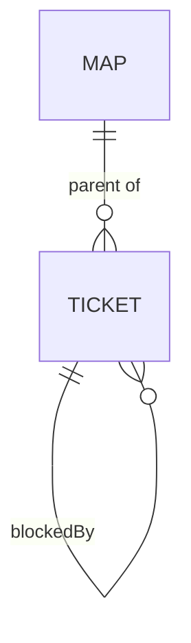

# decision-map data contracts

Single source of truth for the shapes exchanged between the decision-map flow
skills and the three backend ops scripts (ADR 0037). Nothing else redefines them.
The tracker (or the local files) is the source of truth; these JSON files are
working files, never a store.



## Subcommand contract (all three backends)

| Subcommand | Args | Effect |
|---|---|---|
| `chart` | `--input <map_input.json> --output <map.json>` | bulk-create map + tickets + parent links + blocking edges. **Dry-run by default**; `--real` performs the writes. |
| `read` | `--map <id\|slug> --output <map.json>` | fetch map + children at low resolution. |
| `frontier` | `--map <id\|slug> --output <frontier.json>` | open + unblocked + unclaimed children. |
| `claim` | `--ticket <id\|slug>` (`--user <upn>` ADO only) | assign the ticket to the caller. |
| `resolve` | `--ticket <id\|slug> --gist "<one line>" [--link <url>] [--body-file <md>]` | post resolution comment, close the ticket. |
| `comment` | `--ticket <id\|slug> --body-file <md>` | plain comment. |
| `block` | `--ticket <id\|slug> --blocked-by <id\|slug>` | dependency edge (ticket waits on blocked-by). |

Every subcommand also accepts `--dry-run` (print planned mutations, change
nothing) — for `chart` that is already the default.

## `map_input.json` (input to `chart`)

```json
{
  "target": { "org": "Cartagena365", "project": "GlassHull",
              "owner": "Cartagena365", "repo": "GlassHull",
              "slug": "example-effort" },
  "mapType": "Epic",
  "ticketType": "Issue",
  "map": {
    "title": "Decision map — <effort name>",
    "destination": "<one or two lines>",
    "notes": "<skills to consult; standing preferences>",
    "notYetSpecified": ["<fog line>", "..."],
    "outOfScope": ["<ruled-out line>", "..."]
  },
  "tickets": [
    { "key": "auth-model", "title": "Auth model — per-tenant or shared keys?",
      "type": "grilling", "question": "<the decision this resolves>",
      "blocks": ["rollout-order"] }
  ]
}
```

`target` carries only the fields the active backend needs (org/project for ADO,
owner/repo for GitHub, slug for local). `mapType`/`ticketType` are ADO work-item
types (defaults `Epic`/`Issue`; must be valid for the project's process — the
chart-map skill confirms them). `blocks` lists ticket keys this ticket blocks —
**downstream**, an authoring convenience the `chart` operation reads to wire
edges. This is deliberately different from `blockedBy` in `map.json` and
`frontier.json` below: that field reports the **upstream** relation (the
tickets that must close before this one is actionable), which is what every
consumer actually queries. Input authors `blocks`; output (and every reader)
sees `blockedBy` — do not confuse the two. `type` ∈ `research | prototype |
grilling | task`. Mode is derived: research=AFK, grilling/prototype=HITL,
task=either.

## `map.json` (output of `chart` and `read`)

```json
{
  "backend": "ado",
  "map": { "id": "1234", "name": "Decision map — <effort>", "url": "https://…",
           "destination": "<line>" },
  "tickets": [
    { "key": "auth-model", "id": "1235", "name": "Auth model — …",
      "url": "https://…", "type": "grilling", "mode": "HITL",
      "status": "open", "assignee": null, "blockedBy": ["1236"], "gist": null }
  ]
}
```

`status` ∈ `open | closed`. `blockedBy` lists upstream blockers — the tickets
that must close before this one is actionable — the same relation `frontier.json`
reports for every blocked ticket; all three backends compute it naturally (ADO
predecessors, GitHub `dependencies`/`blocked_by`, local frontmatter
`blocked_by`). After `resolve`, `gist` holds the one-line answer. For the local
backend, `id` and `key` are both the ticket file's slug and `url` is the
repo-relative file path.

## `frontier.json` (output of `frontier`)

```json
{
  "frontier": [ { "id": "1235", "name": "Auth model — …", "url": "https://…", "type": "grilling" } ],
  "blocked":  [ { "id": "1236", "name": "Rollout order — …", "blockedBy": ["1235"] } ],
  "claimed":  [ { "id": "1237", "name": "…", "assignee": "thodsaphon.sonthipin@cartagena.no" } ]
}
```

## Backend mappings

| Concept | ADO | GitHub | Local |
|---|---|---|---|
| map | work item `mapType`, tag `decision-map:map` | issue, label `decision-map:map` | `docs/decision-map/<slug>/map.md` |
| ticket | child via `System.LinkTypes.Hierarchy-Reverse`, tag `decision-map:ticket`, body line `Decision-Map-Type: <type>` | sub-issue (native REST if available, else task-list in map body), labels `decision-map:ticket`, `decision-map:type:<type>` | `tickets/<slug>.md` with frontmatter |
| claim | `System.AssignedTo` | assignee | frontmatter `assignee:` |
| close | `System.State` → `Done` (fallback `Closed` on 400) | state closed | frontmatter `status: closed` |
| blocking | `System.LinkTypes.Dependency-Reverse` on the blocked item → predecessor | native "blocked by" if the plan supports it, else body line `blocked-by: #<n>` (weaker — the script labels it) | frontmatter `blocked_by: [slug]` |
| resolution | work-item comment | issue comment | `## Resolution` section appended |

## Local map/ticket file formats

`map.md`:

```markdown
# Decision map — <effort name>

<one small overview mermaid diagram (diagram convention applies to local files)>

## Destination
<one or two lines>

## Notes
<domain; skills every session should consult; standing preferences>

## Decisions so far
- [<ticket title>](tickets/<slug>.md) — <one-line gist>

## Not yet specified
- <fog line>

## Out of scope
- <ruled-out line>
```

`tickets/<slug>.md`:

```markdown
---
title: <ticket title>
type: grilling
mode: HITL
status: open
assignee:
blocked_by: []
---

## Question

<the decision or investigation this ticket resolves>
```

`## Resolution` (appended by `resolve`):

```markdown
## Resolution

<gist — one or two lines>

Detail: <link to repo ADR / commit, when one exists (ADR 0036)>
```
