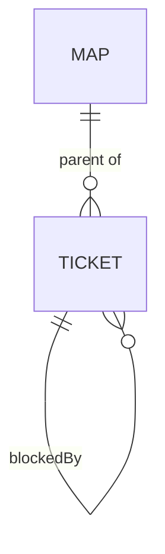

# decision-map data contracts

Single source of truth for the shapes exchanged between the decision-map flow
skills and the three backend ops scripts (ADR 0037). Nothing else redefines them.
The tracker (or the local files) is the source of truth; these JSON files are
working files, never a store.



## Subcommand contract (all three backends)

| Subcommand | Args | Effect |
|---|---|---|
| `chart` | `--input <map_input.json> --output <map.json>` | create map + tickets + parent links + blocking edges, **additively** (ADR 0043) — see below. **Dry-run by default**; `--real` performs the writes; `--force` is a full rewrite. |
| `read` | `--map <id\|slug> --output <map.json>` | fetch map + children at low resolution. |
| `frontier` | `--map <id\|slug> --output <frontier.json>` | open + unblocked + unclaimed children. |
| `claim` | `--ticket <id\|slug>` (`--user <upn>` ADO only) | assign the ticket to the caller. |
| `resolve` | `--ticket <id\|slug> --gist "<one line>" [--link <url>] [--body-file <md>]` | post resolution comment, close the ticket. |
| `comment` | `--ticket <id\|slug> --body-file <md>` | plain comment. |
| `block` | `--ticket <id\|slug> --blocked-by <id\|slug>` | dependency edge (ticket waits on blocked-by). |

Every subcommand also accepts `--dry-run` (print planned mutations, change
nothing) — for `chart` that is already the default.

### `chart` is additive (ADR 0043)

`chart` names **two acts**: the initial charting of a map, and the incremental
graduation of fog into fresh tickets mid-map. One create path serves both, so
do not read `chart` as create-only. On a map that already exists it:

- creates only the tickets whose `key` is absent, and leaves every existing
  ticket **byte-identical** — status, assignee, blocking edges and resolution
  all survive;
- merges `notYetSpecified` / `outOfScope` lines into the map body as a union:
  new lines are appended, existing ones are never removed or reordered, and an
  input that omits a line already on disk does not delete it;
- does **not** apply a `title` / `destination` / `notes` that differs from what
  is on disk — the difference is reported in the result's `divergence` list and
  left unapplied, because silently rewriting an evolved map from a stale input
  is the destructive case `--force` exists for;
- does **not** add a blocking edge into a ticket that already exists (that
  would rewrite it); the skipped edge is reported in `divergence`.

Re-running identical input is therefore a **no-op** — the same bytes out —
which also makes a partially-failed chart resumable. `--force` keeps its
meaning: an explicit, dry-run-announced full rewrite of every file.

The dry run reports one action per file, from the vocabulary
`create` / `skip (exists)` / `merge` / `OVERWRITE`, on both the
machine-readable stdout plan and the human stderr rendering. A file reported
`skip (exists)` is never written; `merge` is the map body gaining fog or
out-of-scope lines. Backends that cannot express `merge` may omit it, but must
not label a write `skip`.

## `map_input.json` (input to `chart`)

```json
{
  "target": { "org": "Cartagena365", "project": "GlassHull",
              "owner": "Cartagena365", "repo": "GlassHull",
              "slug": "example-effort" },
  "mapType": "Epic",
  "ticketType": "Issue",
  "map": {
    "title": "Decision map — <effort name>",
    "destination": "<one or two lines>",
    "notes": "<skills to consult; standing preferences>",
    "notYetSpecified": ["<fog line>", "..."],
    "outOfScope": ["<ruled-out line>", "..."]
  },
  "tickets": [
    { "key": "auth-model", "title": "Auth model — per-tenant or shared keys?",
      "type": "grilling", "question": "<the decision this resolves>",
      "blocks": ["rollout-order"] }
  ]
}
```

`target` carries only the fields the active backend needs (org/project for ADO,
owner/repo for GitHub, slug for local). `mapType`/`ticketType` are ADO work-item
types (defaults `Epic`/`Issue`; must be valid for the project's process — the
chart-map skill confirms them). `blocks` lists ticket keys this ticket blocks —
**downstream**, an authoring convenience the `chart` operation reads to wire
edges. This is deliberately different from `blockedBy` in `map.json` and
`frontier.json` below: that field reports the **upstream** relation (the
tickets that must close before this one is actionable), which is what every
consumer actually queries. Input authors `blocks`; output (and every reader)
sees `blockedBy` — do not confuse the two. `type` ∈ `research | prototype |
grilling | task`. Mode is derived: research=AFK, grilling/prototype=HITL,
task=either.

## `map.json` (output of `chart` and `read`)

```json
{
  "backend": "ado",
  "map": { "id": "1234", "name": "Decision map — <effort>", "url": "https://…",
           "destination": "<line>" },
  "tickets": [
    { "key": "auth-model", "id": "1235", "name": "Auth model — …",
      "url": "https://…", "type": "grilling", "mode": "HITL",
      "status": "open", "assignee": null, "blockedBy": ["1236"], "gist": null }
  ]
}
```

`chart` (only — not `read`) adds `"divergence"`: a list of human-readable
strings naming anything the input asked for that an additive run deliberately
did not apply (a differing `title`/`destination`/`notes`, a blocking edge into
an existing ticket). Empty on an initial chart and on `--force`.

`status` ∈ `open | closed`. `blockedBy` lists upstream blockers — the tickets
that must close before this one is actionable — the same relation `frontier.json`
reports for every blocked ticket; every backend computes this relation
naturally from its own native dependency mechanism (see the "blocking" row of
Backend mappings below for the exact field/label each backend uses). After
`resolve`, `gist` holds the one-line answer. For the local backend, `id` and
`key` are both the ticket file's slug and `url` is the repo-relative file
path.

## `frontier.json` (output of `frontier`)

```json
{
  "frontier": [ { "id": "1235", "name": "Auth model — …", "url": "https://…", "type": "grilling" } ],
  "blocked":  [ { "id": "1236", "name": "Rollout order — …", "blockedBy": ["1235"] } ],
  "claimed":  [ { "id": "1237", "name": "…", "assignee": "thodsaphon.sonthipin@cartagena.no" } ]
}
```

## Backend mappings

| Concept | ADO | GitHub | Local |
|---|---|---|---|
| map | work item `mapType`, tag `decision-map:map` | issue, label `decision-map:map` | `docs/decision-map/<slug>/map.md` |
| ticket | child via `System.LinkTypes.Hierarchy-Reverse`, tag `decision-map:ticket`, body line `Decision-Map-Type: <type>` | sub-issue (native REST if available, else task-list in map body), labels `decision-map:ticket`, `decision-map:type:<type>` | `tickets/<slug>.md` with frontmatter |
| claim | `System.AssignedTo` | assignee | frontmatter `assignee:` |
| close | `System.State` → `Done` (fallback `Closed` on 400) | state closed | frontmatter `status: closed` |
| blocking | `System.LinkTypes.Dependency-Reverse` on the blocked item → predecessor | native "blocked by" if the plan supports it, else body line `blocked-by: #<n>` (weaker — the script labels it) | frontmatter `blocked_by: [slug]` |
| resolution | work-item comment | issue comment | `## Resolution` section inside the `decision-map:resolution` markers (see below) |

## Local map/ticket file formats

`map.md`:

```markdown
# Decision map — <effort name>

<one small overview mermaid diagram (diagram convention applies to local files)>

## Destination
<one or two lines>

## Notes
<domain; skills every session should consult; standing preferences>

## Decisions so far

<!-- decision-map:decisions:start -->
- [<ticket title>](tickets/<slug>.md) — <one-line gist>
<!-- decision-map:decisions:end -->

## Not yet specified

<!-- decision-map:fog:start -->
- <fog line>
<!-- decision-map:fog:end -->

## Out of scope

<!-- decision-map:scope:start -->
- <ruled-out line>
<!-- decision-map:scope:end -->
```

An empty list region holds the single line `- (none)`, which is tool-owned:
the merge drops it as soon as a real line arrives and restores it if the list
becomes empty again.

`tickets/<slug>.md`:

```markdown
---
title: <ticket title>
type: grilling
mode: HITL
status: open
assignee:
blocked_by: []
gist:
---

## Question

<the decision or investigation this ticket resolves>
```

`## Resolution` (written by `resolve` into the ticket file):

```markdown
<!-- decision-map:resolution:start -->
## Resolution

<gist — one or two lines>

Detail: <link to repo ADR / commit, when one exists (ADR 0036)>

<optional --body-file content, which may contain its own "## " sub-headings>
<!-- decision-map:resolution:end -->
```

### Generated regions in local files (local backend only)

Four spans of a local file are **generated regions**, each delimited by an HTML
comment pair: the resolution block in `tickets/<slug>.md`, and the
"Decisions so far" index, the "Not yet specified" list and the "Out of scope"
list in `map.md`. Everything else in those files is user content — an additive
`chart` rewrites only the two list regions and leaves the rest of the file
byte-identical. The rules, which any reader or writer of the local format must
honour:

- **`resolve` owns strictly the span between its markers** and rewrites it
  wholesale; it never edits, and never needs to parse, anything outside it.
  The `map.md` index is likewise regenerated in full from the ticket
  frontmatter of every closed ticket — one physical line per ticket — so it is
  a projection, not accumulated state. **Its entries are ordered by ticket
  slug (ascending), not by when each decision was resolved**, so the index is
  a deterministic function of the ticket files and re-running the projection
  never reorders it. The local backend records no resolution timestamp, so
  resolution order is not recoverable from the files.
- **Only the tool writes markers.** Every user-supplied string — a ticket
  `question`, a `comment` body, `gist`, `link`, `--body-file` content, titles,
  `notes`, fog and out-of-scope lines — is escaped on the way in, so the
  literal text `<!-- decision-map:` in user content is written as
  `&lt;!-- decision-map:` (which still renders as typed, but is not a marker).
  A file must contain at most one well-formed region of each kind; a writer
  that finds otherwise should refuse to write rather than guess.
- **Do not emit an unmarked resolution block.** `resolve` treats an
  unmarked `## Resolution` as pre-existing user content and appends a fresh
  marked block below it, so an unmarked block written by another tool will
  be duplicated rather than updated.

These markers are specific to the local backend's Markdown files. ADO and
GitHub record the resolution as a native tracker comment and need no
equivalent.
