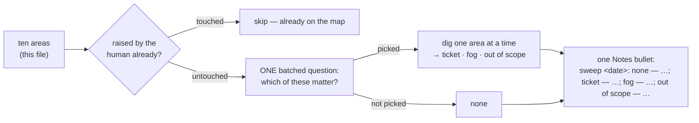

# Frontier sweep — the ten areas chart-map covers after the human-led grill

This list is what "fan out across the whole space" means (ADR 0222). It is drawn
from the frameworks people actually review software against — ISO/IEC 25010:2023,
Google's SRE launch checklist and design-doc cross-cutting concerns, the AWS and
Azure Well-Architected pillars, OWASP's four threat-modelling questions — and it
is one fixed list for every destination (ADR 0226). It is a **coverage check, not
a questionnaire**: the human-led grill runs first, this pass asks once which of the
untouched areas matter, and digs only where the user points.

How to use each area: the **slug** is the word that goes in the record; the
**gloss** is what the batched question quotes; the **probes** are what you ask,
one at a time, only if the user picks the area. Ask them in the user's terms —
what they would see or do — and lead with your own recommendation, which the
human accepts, rejects or reshapes (the HITL guard in SKILL.md).

## 1. `scope` — what it does, what it will not do, who uses it and who owns it after

- Which flows are explicitly *not* part of this effort?
- Who uses it on day one, and who owns it once it has shipped?

Source: Google design doc — goals and non-goals.

## 2. `functional` — flows we cannot yet say how they work

- Which user flow can you not describe end to end today?
- Which edge case do you already know exists and have not placed anywhere?

Source: ISO 25010 — functional suitability.

## 3. `performance` — load, spikes, growth, acceptable latency

- How much load on day one, and in six months? Is there a spike (a launch, a
  month-end, a campaign)?
- What latency would users call broken?
- Does the design have to survive ten times today's load without a redesign?

Source: SRE launch checklist (volume, capacity, growth); ISO 25010 — performance
efficiency; Well-Architected — performance.

## 4. `reliability` — what happens when it breaks, and how it comes back

- What breaks first, and what do users see when it does?
- Is there a backup, and has anyone actually restored from it?
- How long can it be down, and how much data can be lost, before it is a crisis?

Source: SRE launch checklist (failover, backup and restore); ISO 25010 —
reliability, recoverability.

## 5. `security` — what we are protecting, from whom, and where the trust boundary is

- What are we working on, and what can go wrong with it?
- Where do the secrets live, and who can read them?
- What crosses a trust boundary — user input, a partner API, a file upload?

Source: OWASP threat modelling — the four questions; ISO 25010 — security.

## 6. `identity` — who can do what, and how we prove it afterwards

- Which roles exist, and what can each one *not* do?
- Is it multi-tenant — can one customer's user ever see another's data?
- Does anyone need to know afterwards who did what (an audit trail)?

Source: ISO 25010 — accountability, authenticity; architecture review checklists —
authorization.

## 7. `data` — personal data, migration, retention, who owns the data

- Is there personal data, and what must happen to it (consent, deletion, export)?
- Does existing data have to move, and can the old shape and the new one coexist
  during the move?
- How long is data kept, and who decides?

Source: Google design doc — privacy as a cross-cutting concern; architecture
review checklists — data ownership.

## 8. `deploy` — environments, rollback, deploy windows, platform limits

- Which environments exist, and does this pass through all of them?
- Can this be rolled back, and has that been tried on something like it?
- Is there a deploy window, a freeze, or a platform limit (quota, region,
  runtime version) that constrains the design?
- What has to deploy before what?

Source: deployment checklists (Octopus Deploy, Cortex); SRE launch checklist —
rollout planning.

## 9. `operations` — what we watch, who is paged, what the runbook says

- What signal tells us it is unhealthy before a user tells us?
- Who is on call for it, and do they know?
- Is there a runbook — what does the person paged at 3 a.m. read?

Source: SRE launch checklist — monitoring; Azure Well-Architected — operational
excellence.

## 10. `dependencies` — third parties, cost, and rules we must obey

- Which external service can take this down, and what degrades when it does?
- What does it cost to run, and who pays for it?
- Which law, policy or contract binds the design (data residency, licensing,
  a customer's security questionnaire)?

Source: SRE launch checklist — external dependencies; AWS Well-Architected — cost;
compliance reviews.

## Deliberately not on the list (ADR 0226)

- **Usability / accessibility** — on a decision map this arrives as a user-led
  `prototype` ticket already; the sweep would only repeat it.
- **Maintainability** — a property of the code once written, not a decision to
  take before starting.

If a real map shows the sweep missed something, these two are the first places to
reopen — record the change as a new ADR, and add the area here with its slug.
