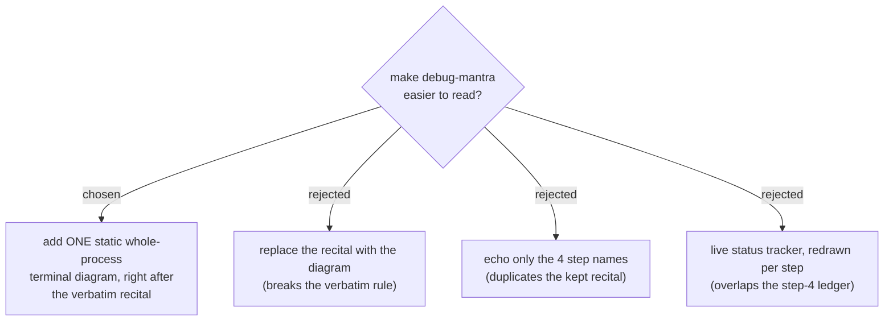

# ADR 0001 — debug-mantra adds a whole-process terminal diagram alongside the verbatim recital

- **Status:** Accepted
- **Date:** 2026-06-15

## Context

`debug-mantra` opens by reciting a four-line mantra **verbatim**, then walks the
four steps in prose — including the step-2 escalation ladder (debugger → source
trace + knobs → in-code instrumentation) and two loop-backs (no-repro → STOP;
step-4 contradiction → revisit a hypothesis). The owner finds the terminal output
hard to read. The skill's hard rule is that the mantra is recited verbatim and
never paraphrased, so the fix must not touch that text.

This is the first adopter of the terminal-diagram convention (ADR 0010).

## Decision

Add **one static Unicode terminal diagram** of the whole process, **alongside**
the recital (never replacing it):

- **Content (scope b):** the four steps, the step-2 escalation ladder, the
  no-repro **STOP** gate, and the step-4 → step-3 loop-back. Static — drawn once,
  not a live tracker.
- **Style:** Unicode box-drawing, vertical layout, inside a fenced code block
  (per ADR 0010).
- **Placement:** emitted immediately **after** the verbatim recital in the first
  response, as a **canonical block reproduced verbatim** from SKILL.md — so it
  cannot drift from the recital wording.
- **Skip behavior:** it is part of the opening recital, so "skip the mantra"
  skips the diagram too.

## Consequences

- ➕ The escalation order and the loop-backs — the genuinely hard-to-follow
  parts — become scannable at a glance.
- ➕ The recital wording is untouched; because the diagram is also a fixed
  canonical block, there is no paraphrase/drift risk.
- ➕ Provides the concrete pilot that proves out ADR 0010.
- ➖ One more canonical block to keep in sync if the four mantra steps ever
  change.
- ➖ Creates the first `docs/adr/` directory inside the dev-workflows plugin.

## Alternatives considered

- **Replace the recital with the diagram** — rejected: breaks the verbatim-recital
  rule the skill is built around.
- **Echo only the four step names** — rejected: pure duplication of the recital
  we are deliberately keeping; adds no information.
- **Live status tracker redrawn each step** — rejected: overlaps the step-4
  ledger (already the "live state" mechanism) and adds mid-session state to
  maintain.
- **Horizontal 4-box layout** — rejected: ~77 cols wide, wraps on narrow
  terminals; vertical stays ≲ 55 cols.
