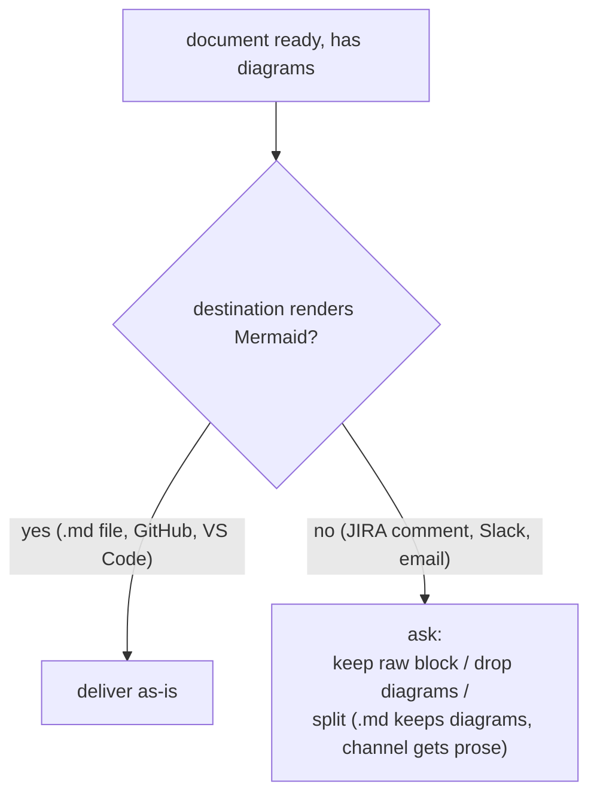

# Diagram convention

Canonical wording of the marketplace diagram convention (ADRs 0005–0010 at the
marketplace repo root). Skills point here; nothing else restates these rules.
To change the convention, change THIS file only.

## Two render targets

A diagram's **render target decides which family applies** — not the skill that
produces it:

| Output | Renders | Diagram family |
|---|---|---|
| Markdown document (ARCHITECTURE.md, post-mortem, spec, audit, trace) | Mermaid | **Mermaid diagrams** (below) |
| Live terminal session (interactive skill) | monospace text only | **Terminal diagrams** (below) |

Exempt from both families: **channel outputs** (Slack, JIRA comment, email,
standup line, Tribletext) and the **CONTEXT.md glossary**.

---

## Mermaid diagrams (Markdown documents)

### Who must follow this

Any skill whose output is a **Markdown document** — ARCHITECTURE.md, a
post-mortem, a design spec, an advisory document, a fit-gap, an audit report, a
trace report. **The artifact decides, not the skill:** if a normally
chat-shaped output (cards, tables, answers) is requested as a `.md` file, the
convention applies to that file.

### Rule 1 — One overview diagram at the top (mandatory)

Every generated Markdown document opens with **one Mermaid diagram showing the
shape of the whole thing** — placed right after the title/header block, before
any prose. It is a thumbnail, not the full model: keep it to roughly ≤ 15
nodes; deep detail belongs in section diagrams.

### Rule 2 — Type-matched section diagrams

Any section whose content describes a flow, data model, decision, or hierarchy
gets a diagram of the matching type:

| Content shape | Mermaid type |
|---|---|
| flow / lifecycle / interaction between actors | `sequenceDiagram` |
| data model / entity relationships | `erDiagram` |
| decision logic / branching | `flowchart TD` |
| hierarchy / pipeline / dependency / org structure | `graph TD` |

No forced diagrams: a pure table/list section stays prose.

Tie-breaker: `sequenceDiagram` is time-ordered (who sends what to whom);
`graph TD` is structural (what connects to what). If the arrows would carry
messages or events, use `sequenceDiagram`; if they connect boxes in a
hierarchy or pipeline, use `graph TD`.

### Rule 3 — ADRs carry a small decision diagram

Every ADR opens with one small Mermaid diagram of the decision — typically a
`flowchart TD` of the chosen path vs the rejected alternatives, or the
structure the decision creates. The glossary (CONTEXT.md) is the only exempt
Markdown document.

### Rule 4 — Ask before a non-rendering destination

Diagrams are **always authored**. If the chosen destination doesn't render
Mermaid (JIRA comment, Slack, email), **ask the user first** — never silently
strip, never silently post raw fences:

### Authoring guidance

- Quote node labels containing spaces or punctuation: `A["label with spaces"]`.
- Use ` ` for line breaks inside labels (HTML entities render unreliably).
- Diagrams supplement prose, never replace it — introduce or follow every
  diagram with at least one sentence saying what to see in it.

---

## Terminal diagrams (interactive skills)

For a skill whose output is a **live terminal session** (an interactive
discipline, not a durable `.md` document), Mermaid is useless — it renders as raw
code. Use a **terminal diagram** instead: a text diagram that reads correctly in
a monospace terminal.

### When it applies

An interactive skill MAY carry one terminal diagram of its process when prose
alone is hard to scan. It is optional per skill, not mandatory like Rule 1.

### Style

- **Unicode box-drawing** characters (`┌ ─ │ ▼ ▶ ① ■`), not Mermaid, not raw ASCII art.
- **Vertical** layout (top-to-bottom flow); keep width **≲ 50 columns** so it
  never wraps on a narrow terminal.
- Emit it **inside a fenced code block** so it renders monospace.
- **Static** — drawn once at the point it helps (e.g. session start), never
  redrawn or animated mid-session.
- **Augments, never replaces** prose — same as the Mermaid rules.

### Authoring guidance

- Alignment is **hand-maintained** — no renderer catches drift; keep columns
  simple and re-check spacing after edits.
- If a skill's diagram is fixed (e.g. debug-mantra's four-step process), store it
  as a **canonical block in the SKILL.md** and emit it **verbatim**, so it can't
  drift from the prose it mirrors.
- Introduce the diagram with a sentence, as with Mermaid.
